# ARES 架构全景图

> 生成时间: 2026-07-12
> 22,825 个节点, 124,690 条边, 1,260 个 Go 文件, 41 个 internal 包

## 六层架构总览

```mermaid
graph TB
    subgraph L1 ["Layer 1: 入口层 — CLI / SDK / API"]
        CLI["cmd/ares<br/>ares init / run / bench / doctor"]
        SDK["sdk/<br/>MustNew / NewAgent / Run / Stream"]
        API["api/<br/>HTTP Handlers / Router / Client"]
    end

    subgraph L2 ["Layer 2: 核心服务层 — Service / Handler"]
        SVC["api/service/<br/>agent / arena / eval / evolution<br/>flight / memory / workflow / knowledge"]
        HANDLER["api/handler/<br/>agent / arena / eval / llm / memory<br/>retrieval / runtime / stream / workflow"]
        BOOT["internal/ares_bootstrap<br/>ProvideNew / ProvideEvolution / ProvideLLM<br/>ProvideMemory / ProvideMCP / ProvideDashboard"]
    end

    subgraph L3 ["Layer 3: 运行时 & Agent 管理层"]
        RT["internal/ares_runtime<br/>Runtime Manager / PluginBus<br/>Checkpoint / Events / Interrupt"]
        AGENTS["internal/agents<br/>Leader / Sub / Base<br/>Strategy / MemoryRepository"]
        WORKFLOW["internal/workflow<br/>engine: MutableDAG / DynamicExecutor<br/>graph: Executor / Patcher / Scheduler"]
    end

    subgraph L4 ["Layer 4: 进化引擎层"]
        EVO_V1["internal/ares_evolution<br/>GA Population / NSGA-II / Steady-State<br/>Crossover / Mutation / Selection<br/>DreamCycle / Experience / Guardrails"]
        EVO_V2["internal/evolution<br/>genome: 6 Genomes<br/>diff: 4 Differs<br/>coordinator / patch / llm_adapter"]
        EVIDENCE["internal/evidence<br/>Evidence primitives / MemoryStore"]
    end

    subgraph L5 ["Layer 5: 记忆 & 知识层"]
        MEM["internal/ares_memory<br/>Session / Distillation / Embedding<br/>MemoryPatcher / Pipeline / Push"]
        KNOWLEDGE["internal/knowledge<br/>AKF: Runtime / Compiler / Linker<br/>Provider / Retriever / Store / Planner<br/>MCP / Pipeline / Workflow"]
        EXP["internal/ares_experience<br/>FeedbackService / RankingService<br/>ConflictResolver / Distillation"]
    end

    subgraph L6 ["Layer 6: 基础设施层"]
        EVENTS["internal/ares_events<br/>EventStore / Compactor<br/>MemoryStore / PGStore"]
        MCP["internal/ares_mcp<br/>Client / Manager / Transport<br/>SSE / Stdio / JSON-RPC"]
        STORAGE["internal/storage<br/>postgres / memory / models<br/>query / repositories"]
        SEC["internal/ares_security<br/>Sanitizer"]
        SHUTDOWN["internal/ares_shutdown<br/>Manager / Phase / Signal"]
        LLM["internal/llm<br/>Providers / Failover / Output"]
        TOOLS["internal/tools<br/>Builtin / Planner / Resources"]
        MONITOR["internal/monitoring<br/>Dashboard / Console / Tabs / DAG"]
        ARENA["internal/ares_arena<br/>Injector / Scenario / Scorer<br/>Survival / Regression"]
        FLIGHT["internal/ares_flight<br/>Collector / Genealogy / Diagnostics"]
        QUANT["internal/ares_quant<br/>Portfolio / Market / Research<br/>MarketMaking / Indicators"]
        CORE["internal/core<br/>Errors / Models"]
        ERRORS["internal/errors<br/>Wrap / New"]
        LOGGER["internal/logger<br/>Debug / Info / Warn"]
        DISCOVERY["internal/discovery<br/>MCP discovery / Health checks"]
        OBSERV["internal/ares_observability"]
        RATELIMIT["internal/ares_ratelimit"]
        CALLBACKS["internal/ares_callbacks"]
        EVAL["internal/ares_eval"]
        CONFIG["internal/ares_config"]
        CTXUTIL["internal/ares_ctxutil"]
        TRUNCATE["internal/truncate"]
        CMDUTIL["internal/cmdutil"]
        PROTOCOL["internal/ares_protocol/ahp<br/>Heartbeat / Queue / DLQ / Codec"]
    end

    L1 --> L2
    L2 --> L3
    L3 --> L4
    L3 --> L5
    L4 --> L6
    L5 --> L6
    L3 --> L6
```



## 模块详细关系图

```mermaid
graph TB
    %% ─── 入口层 ───
    subgraph Entry ["入口层"]
        CLI["cmd/ares<br/>ares init / run / bench / doctor<br/>ares version / evolution / arena"]
        SDK["sdk/<br/>Runtime: MustNew / New<br/>Agent: Run / Stream / Team<br/>Config: LoadConfigFile"]
        EVAL_FW["evaluation/<br/>RunScenario / RunAll<br/>Metrics / Report"]
    end

    %% ─── API 层 ───
    subgraph APILayer ["API 层"]
        HANDLER["api/handler/<br/>agent.go / arena.go / eval.go<br/>evolution.go / flight.go / llm.go<br/>memory.go / retrieval.go / runtime.go<br/>stream.go / workflow.go"]
        ROUTER["api/router/<br/>router.go"]
        CLIENT["api/client/<br/>client.go / config.go<br/>health.go / workflow.go"]
        SERVICE["api/service/<br/>agent / arena / callbacks / dashboard<br/>eval / events / evolution / flight<br/>knowledge / llm / memory / runtime / workflow"]
        CORE_IF["api/core/<br/>Agent / Arena / Runtime / Workflow<br/>Memory / LLM / Evolution / Flight<br/>Callbacks / Eval / MCP / Types"]
        BOOT["api/bootstrap/<br/>bootstrap.go"]
        MCP_API["api/mcp/<br/>mcp.go / sse.go / stdio.go<br/>log.go"]
        TOOLS_API["api/tools/<br/>tools.go / log.go"]
        DISCOVERY_API["api/discovery/<br/>discovery.go"]
        MEMORY_API["api/memory/<br/>memory.go / distillation/"]
        EVOLUTION_API["api/evolution/<br/>evolution.go"]
        FLIGHT_API["api/flight/<br/>flight.go"]
    end

    %% ─── 内部核心层 ───
    subgraph Internal ["内部核心层"]

        subgraph Runtime ["运行时"]
            RT["ares_runtime<br/>Manager: Start/Stop/Resurrection<br/>PluginBus: Subscribe/Emit<br/>Checkpoint: Save/Restore<br/>Events: Emit/Subscribe<br/>Loop: ControlledEvolution<br/>Arena: FaultInjection"]
            AGENTS["agents<br/>leader: New/RecoverStaleTasks<br/>sub: NewTaskExecutor<br/>base: Agent interface<br/>strategy: ApplyEvolvedParams"]
            WORKFLOW["workflow<br/>engine: MutableDAG / DynamicExecutor<br/>graph: Executor / Patcher / Scheduler<br/>HITL: HumanInTheLoop<br/>Checkpoint: Resume"]
            CALLBACKS["ares_callbacks<br/>Handler / Registry"]
        end

        subgraph Evolution ["进化系统"]
            EVO_V1["ares_evolution<br/>genome/: Population / Selection<br/>  NSGA-II / Steady-State<br/>  Crossover / Mutation<br/>  FitnessSharing / Guardrails<br/>  ExperienceHints / DreamCycle<br/>mutation/: Mutator / Adapter<br/>scoring/: MemoryAwareScorer<br/>service/: WiredSystem / Bridge<br/>genome_wiring_system.go"]
            EVO_V2["evolution<br/>genome/: 6 Genomes<br/>  Workflow / Scheduler / Knowledge<br/>  Recovery / Planner / Memory<br/>diff/: 4 Differs<br/>  Workflow / Scheduler / Knowledge<br/>  Recovery<br/>coordinator/: Coordinator<br/>patch/: PatchRegistry / Apply<br/>llm_adapter.go"]
        end

        subgraph Knowledge ["知识系统"]
            KNOWLEDGE["knowledge<br/>runtime/: KnowledgeRuntime<br/>compiler/: DefaultCompiler<br/>linker/: DefaultLinker<br/>provider/: code / evolution / memory<br/>  mysql / vector<br/>store/: memory / postgres / sqlite<br/>pipeline/: KnowledgePipeline<br/>planner/: KnowledgePlanner<br/>retriever/: Retriever<br/>mcp/: AKF MCP Tools<br/>workflow/: KnowledgeWorkflow"]
            EVIDENCE["evidence<br/>MemoryStore / Evidence<br/>EmitWithMeta"]
        end

        subgraph Memory ["记忆系统"]
            MEM["ares_memory<br/>manager: MemoryManager<br/>context: Cleaner / Summarizer<br/>distillation: Distiller<br/>embedding: EmbeddingClient<br/>pipeline: Push / Report<br/>memory_patcher.go"]
            EXP["ares_experience<br/>FeedbackService<br/>RankingService<br/>ConflictResolver<br/>DistillationService"]
        end

        subgraph Events ["事件系统"]
            EVENTS["ares_events<br/>EventStore interface<br/>MemoryEventStore<br/>PGEventStore<br/>Compactor / SummaryRepo<br/>Subscribe / Append"]
        end

        subgraph MCP_SUB ["MCP 通信"]
            MCP_CLIENT["ares_mcp<br/>Client / Manager / Server<br/>Transport: Stdio / SSE<br/>JSON-RPC: Request/Response<br/>Schema: Tool/Resource<br/>ConfigWatcher: HotReload"]
        end

        subgraph Arena ["混沌工程"]
            ARENA["ares_arena<br/>Injector: FaultInjection<br/>Scenario: YAML Config<br/>Scorer: ResilienceScore<br/>Survival: ContinuousTest<br/>Regression: Welch's t-test<br/>EvolutionBridge: GA→Arena"]
        end

        subgraph Flight ["飞行记录器"]
            FLIGHT["ares_flight<br/>Collector: ExecutionTrace<br/>Genealogy: AgentFamilyTree<br/>Diagnostics: DecisionLog<br/>Pipeline: Record→Replay"]
        end

        subgraph Quant ["量化交易"]
            QUANT["ares_quant<br/>portfolio: Simulator<br/>market: CoinGecko / Yahoo<br/>research: MemoryStore / Agents<br/>marketmaking: Paper / API<br/>indicators: Technical<br/>dataflow: DataPipeline"]
        end

        subgraph Monitoring ["监控"]
            MONITOR["monitoring<br/>Console: SPA Dashboard<br/>Tabs: Arena / Event / LLM / MCP<br/>  Memory / Workflow / Evolution<br/>DAG: Interaction Graph<br/>Data: AgentTracker / CostAggregator<br/>Publisher: SSE Streaming"]
        end

        subgraph Storage ["存储"]
            STORAGE["storage<br/>postgres/: Pool / Query / Repos<br/>memory/: InMemoryStore<br/>models/: DomainModels"]
        end

        subgraph Bootstrap ["装配中心"]
            BOOTSTRAP["ares_bootstrap<br/>bootstrap.go<br/>provide_evolution.go<br/>provide_llm.go<br/>provide_memory.go<br/>provide_mcp.go<br/>provide_dashboard.go<br/>provide_new_evolution.go"]
        end

        subgraph Security ["安全"]
            SEC["ares_security<br/>sanitizer.go"]
            RATELIMIT["ares_ratelimit"]
        end

        subgraph Utils ["工具库"]
            ERRORS["errors<br/>Wrap / New / Wrapf"]
            LOGGER["logger<br/>Debug / Info / Warn / Error"]
            CORE["core<br/>errors/ / models/"]
            TRUNCATE["truncate"]
            CTXUTIL["ares_ctxutil"]
            CONFIG["ares_config"]
            OBSERV["ares_observability"]
            SHUTDOWN["ares_shutdown<br/>Manager / Phase / Signal"]
            PROTOCOL["ares_protocol/ahp<br/>Protocol / Heartbeat<br/>Queue / DLQ / Codec"]
            LLM_SVC["llmservice"]
            MEM_SVC["memoryservice"]
            RETRIEVAL["retrievalservice"]
            DASHBOARD["dashboard"]
            DISCOVERY["discovery"]
            PLUGINS["plugins/resurrection"]
            TOOLS["tools<br/>builtin/: calculator / hash / web_search<br/>  pdf / file / math / network<br/>  memory / knowledge / planning<br/>resources/: core / agent / base<br/>planner/: tool_planner"]
            API_IMPL["api_impl<br/>service.go / adapters.go<br/>agent/ / store.go"]
        end
    end

    %% ─── 连接关系 ───
    CLI --> SDK
    CLI --> BOOTSTRAP
    SDK --> BOOTSTRAP
    SDK --> RT
    SDK --> AGENTS
    SDK --> MEM
    SDK --> EVO_V1

    HANDLER --> SERVICE
    HANDLER --> ROUTER
    SERVICE --> CORE_IF
    SERVICE --> BOOTSTRAP
    SERVICE --> RT
    SERVICE --> EVO_V1
    SERVICE --> KNOWLEDGE
    SERVICE --> MEM
    SERVICE --> EVENTS

    BOOTSTRAP --> RT
    BOOTSTRAP --> EVO_V1
    BOOTSTRAP --> EVO_V2
    BOOTSTRAP --> MEM
    BOOTSTRAP --> MCP_CLIENT
    BOOTSTRAP --> MONITOR
    BOOTSTRAP --> LLM_SVC
    BOOTSTRAP --> EVENTS

    RT --> AGENTS
    RT --> WORKFLOW
    RT --> EVENTS
    RT --> CALLBACKS
    RT --> PLUGINS

    AGENTS --> MEM
    AGENTS --> EVENTS
    AGENTS --> LLM_SVC
    AGENTS --> TOOLS

    WORKFLOW --> EVENTS
    WORKFLOW --> EVIDENCE
    WORKFLOW --> EVO_V2

    EVO_V1 --> EVO_V2
    EVO_V1 --> EVIDENCE
    EVO_V1 --> EXP
    EVO_V1 --> ARENA
    EVO_V1 --> FLIGHT
    EVO_V2 --> EVIDENCE
    EVO_V2 --> STORAGE

    KNOWLEDGE --> EVIDENCE
    KNOWLEDGE --> STORAGE
    KNOWLEDGE --> MEM
    KNOWLEDGE --> MCP_CLIENT

    MEM --> EVENTS
    MEM --> STORAGE
    MEM --> EXP

    ARENA --> EVENTS
    ARENA --> FLIGHT
    ARENA --> EVIDENCE
    ARENA --> RT

    FLIGHT --> EVENTS
    FLIGHT --> EVIDENCE

    MCP_CLIENT --> TOOLS
    MCP_CLIENT --> EVENTS

    MONITOR --> EVENTS
    MONITOR --> MCP_CLIENT
    MONITOR --> RT

    STORAGE --> EVENTS

    %% 跨层连接
    API_IMPL --> SERVICE
    API_IMPL --> HANDLER
    API_IMPL --> STORAGE
    API_IMPL --> MCP_CLIENT

    TOOLS --> MCP_CLIENT
    TOOLS --> LLM_SVC
    TOOLS --> PLUGINS
```



## 模块职责速查表

| 模块 | 类型 | 核心职责 |
|------|------|---------|
| `sdk/` | 入口 | 统一 SDK，`MustNew`/`NewAgent`/`Run`/`Stream`/`Evolve`/`Team` |
| `cmd/ares` | 入口 | CLI: `ares init`/`run`/`bench`/`doctor`/`evolution`/`arena` |
| `api/handler` | 接口 | HTTP handler，所有 REST 端点的请求处理 |
| `api/service` | 接口 | 服务层，编排各模块的业务逻辑 |
| `api/core` | 接口 | 核心接口定义（Agent/Runtime/Workflow/Memory/LLM 等） |
| `api/bootstrap` | 装配 | 一键启动所有模块的工厂函数 |
| `internal/ares_runtime` | 运行时 | Runtime Manager、PluginBus、Checkpoint、Lifecycle |
| `internal/agents` | 运行时 | Leader/Sub Agent 实现、Strategy 管理 |
| `internal/workflow` | 运行是 | MutableDAG、DynamicExecutor、GraphPatchExecutor、HITL |
| `internal/ares_evolution` | 进化 | GA 种群、NSGA-II、稳态GA、Crossover、Mutation、DreamCycle |
| `internal/evolution` | 进化 | 6 Genomes、4 Differs、Coordinator、Patch 运行时进化管线 |
| `internal/evidence` | 进化 | Evidence 数据原语，驱动进化决策 |
| `internal/knowledge` | 知识 | AKF 全链路：Runtime/Compiler/Linker/Provider/Retriever/Store |
| `internal/ares_memory` | 记忆 | Session、Distillation、Embedding、MemoryPatcher |
| `internal/ares_experience` | 记忆 | 经验反馈、排序、冲突解决 |
| `internal/ares_events` | 事件 | EventStore、OCC、Compactor、MemStore/PGStore |
| `internal/ares_mcp` | 通信 | MCP Client/Server、Stdio/SSE 传输、JSON-RPC |
| `internal/ares_arena` | 混沌 | 故障注入、场景编排、弹性评分、回归测试 |
| `internal/ares_flight` | 可观测 | 执行跟踪、Agent 谱系、诊断、回放 |
| `internal/monitoring` | 可观测 | 控制台 SPA、多 Tab 面板、SSE 流式更新 |
| `internal/ares_quant` | 量化 | 投资组合模拟、市场数据、研究记忆 |
| `internal/storage` | 存储 | PostgreSQL 连接池、查询、模型、仓库 |
| `internal/ares_shutdown` | 基础设施 | 优雅关闭、信号处理、阶段管理 |
| `internal/tools` | 工具 | 20+ 内置工具、Tool 注册、Planner |
| `internal/ares_bootstrap` | 装配 | 依赖注入、模块装配、回调注入 |
| `internal/ares_security` | 安全 | 输入清洗、安全策略 |
| `internal/ares_ratelimit` | 基础设施 | 限流 |
| `internal/ares_config` | 配置 | YAML/Env 配置加载与验证 |
| `internal/logger` | 基础设施 | 结构化日志（Debug/Info/Warn/Error） |
| `internal/errors` | 基础设施 | 错误包装与追踪链 |
| `internal/ares_protocol/ahp` | 协议 | AHP 协议：Heartbeat/Queue/DLQ/Codec |
| `internal/evidence` | 数据 | Evidence 数据结构与存储 |
| `internal/ares_callbacks` | 运行时 | 事件回调机制 |
| `internal/ares_ctxutil` | 工具 | Context 工具函数 |
| `internal/truncate` | 工具 | 内容截断公用逻辑 |
| `internal/plugins` | 运行时 | 插件（Resurrection） |
| `internal/ares_observability` | 可观测 | 可观测性基础设施 |
| `internal/ares_eval` | 评估 | Agent 评估框架 |
| `internal/ares_flight` | 可观测 | 飞行记录器 |
| `internal/ares_integration` | 测试 | 集成测试 |
| `internal/llm` | LLM | LLM 客户端、Provider、Failover、Output 解析 |
| `internal/llmservice` | LLM | LLM 服务封装 |
| `internal/memoryservice` | 记忆 | 记忆服务封装 |
| `internal/retrievalservice` | 检索 | 检索服务封装 |
| `internal/dashboard` | 监控 | Dashboard 后端 |
| `internal/discovery` | 发现 | MCP 服务发现 |
| `internal/api_impl` | 实现 | API 实现层（适配器、服务） |
| `internal/cmdutil` | 工具 | CLI 工具函数 |
| `evaluation/` | 评估 | 评估框架：RunScenario/Report/Metrics |
| `compat/` | 兼容 | OpenAI/Ollama 协议适配、向量兼容 |
| `services/embedding` | 服务 | Python 嵌入服务 |

## 六层架构说明

```
Layer 1: [入口层]  CLI / SDK / API Handler
    ↓
Layer 2: [核心服务层]  api/service → internal/api_impl
    ↓
Layer 3: [运行时层]  ares_runtime + agents + workflow
    ↙      ↘
Layer 4: [进化引擎]    Layer 5: [记忆&知识]
  ares_evolution        ares_memory
  + evolution           + knowledge
  + evidence            + ares_experience
    ↓                      ↓
Layer 6: [基础设施层]  events / mcp / storage / tools / llm
                       monitoring / arena / flight / quant
                       shutdown / security / config / logger
```

**数据流方向：** 请求从 Layer 1 进入，经过 Layer 2 路由到 Layer 3 运行时，运行时在 Layer 4 进化引擎的驱动下持续优化自身，同时依赖 Layer 5 的记忆知识系统提供上下文，所有操作记录在 Layer 6 的基础设施中。