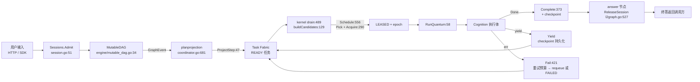
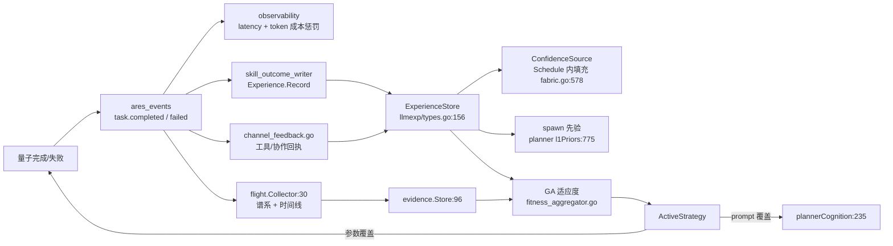
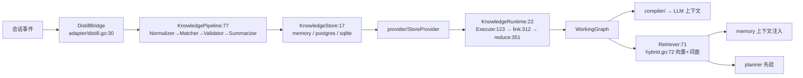
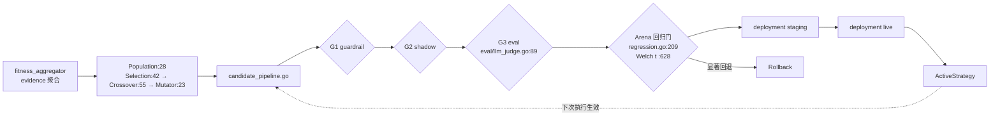

# ARES 架构总图（模块 · 数据流 · 真实任务全程）

> 当前代码的完整模块地图。每条结论带 `file:line` 锚点，可直接跳源码核对。
> 运行时实况（主链/状态机/断线台账）见 `RUNTIME.md`。审查证据见 `docs/reviews/`。

---

## 一、定位与不变量

ARES 是 **Agent 操作系统**：Agent 不是被编排的工作流节点，而是**被调度的进程**——对话历史是可序列化、可迁移、可恢复的进程状态，由 checkpoint + lease + epoch fencing 三件套坐实。

| 不变量 | 实现位置 |
|---|---|
| 一个内核：所有调度决策经过 `internal/kernel` | `kernel/scheduler.go`；kernel **不 import** runtime（`runtime/architecture_test.go` 锁定） |
| 一张图：`MutableDAG` 是全仓唯一任务图载体 | `fabric/task/workflow/engine/mutable_dag.go:34` |
| 一条主线：L2 router 是唯一生产执行路径，serve 与 SDK 共用执行核 | `internal/agentruntime/`（§5.2） |
| 无领导者调度："B 完成→C 就绪"由织物状态机推导 | `fabric/task/dag.go` |
| 执行量子可恢复 | `fabric/task/quantum.go:58` `RunQuantum` |
| Epoch fencing：过期持有者不能驱动已易主任务 | `fabric/task/fabric.go:290` `Acquire` / `:712` `ownerLocked` |
| 协作式抢占，只在量子边界 | `fabric/task/fabric.go:613` `Preempt` |
| 规划者不执行工具，只生长图 | `fabric/agent/planner_cognition.go:801` |
| syscall 调用者身份来自 kernel ctx，绝不信任 LLM 参数 | `agentsyscall/syscall.go`；`fabric/agent/l2graph.go:420` 盖章 |
| 接口定义在消费者侧 | 全仓惯例 |
| Agent 可弃，Task 持久 | `fabric/agent/lifecycle.go:69` + `internal/aresrecovery/` |
| fabric 核心不得 import runtime | `fabric/task/architecture_test.go:63` |

**两个"runtime"不要混淆**（`kernel/component.go:5-8` 明确区分）：

- `internal/runtime.Manager` — agent 生命周期 + 插件总线
- `internal/kernel.Orchestrator` — 系统组件图的控制面（`component.go` / `orchestrator.go` / `registry.go` / `state.go` / `snapshot.go` 都在 **kernel** 包，不在 runtime）

---

## 二、全模块分层总图（38 个包）


```mermaid
flowchart TD
    subgraph L0["入口面（3 个，同一引擎）"]
        direction LR
        CMD["cmd/ares<br/>16 个非测试文件<br/>serve · CLI · HTTP"]
        SDK["sdk/<br/>嵌入库"]
        EMB["services/embedding<br/>独立 sidecar"]
    end

    subgraph L1["装配层 ares_bootstrap"]
        BOOT["Bootstrap bootstrap.go:239<br/>唯一装配根"]
        STEPS["bootstrap_steps.go<br/>wireDistillation:39 · wireGAEvolution:185"]
        PROV["provide_{llm,memory,mcp,evolution,<br/>distillation,discovery,new_evolution}"]
        WIR["eval_gate_wiring · regression_gate_wiring:48<br/>deployment_wiring · knowledge_akg<br/>retriever_wiring · skills_wiring<br/>channel_feedback_wiring · maintenance_worker<br/>embedding_worker · dashboard_observability"]
    end

    subgraph L2["共享执行核 agentruntime"]
        SESS["Sessions session.go:33<br/>Admit:51 · ReleaseQuietly:136 · Harvest:144"]
        SUBM["Submitter submit.go:34<br/>Submit:118 · Seed:54 · MaxRestoredSeq:81"]
        EXEC["Execution execution.go:54<br/>NewExecution:73"]
    end

    subgraph L3A["调度 internal/kernel"]
        SCHED["scheduler.go:355 Run · :489 drain<br/>:800 execute · :919 executeWithCandidates<br/>hybridStatic:99 · WithStaticPoolHybrid:318"]
        EXECREG["executor_registry.go<br/>buildCandidates:129 · hybridPreferStatic:171<br/>LookupExecutor:256 · Capabilities:304"]
        FABEX["fabric_executor.go:16<br/>fabricAgentExecutor:39"]
        LOAD["load_tracker.go:23<br/>TryBegin:82 · ConfidenceFor:206"]
        DEC["decision_recorder.go:66"]
        QH["quantum_hook.go:21"]
        ORCH["orchestrator.go:37 · component.go:14<br/>registry.go:22 · state.go:10 · snapshot.go:11"]
    end

    subgraph L3B["编排 internal/fabric"]
        direction TB
        FA["agent/  Agent Fabric<br/>l2graph.go · planner_cognition.go<br/>session_registry.go · lifecycle.go:69<br/>fabric.go CapabilitiesOf:117 AddCapabilities:136<br/>governance.go · snapshot.go · context.go"]
        FT["task/  Task Fabric<br/>fabric.go:290 Acquire · :556 Schedule<br/>quantum.go:58 · checkpoint_schema.go:29 v4<br/>reaper.go · restore.go · plan_loop.go<br/>workflow_plan.go · confidence.go"]
        FP["planprojection/<br/>coordinator.go:68 · :681 SubscribeGraphEvents<br/>projection.go:47"]
        WF["task/workflow/<br/>engine/mutable_dag.go:34<br/>graph_events.go · dag_patcher.go<br/>recovery_patcher.go · hitl.go<br/>loader.go · reloader.go · registry.go<br/>graph/graph.go"]
    end

    subgraph L4["生命周期 internal/runtime"]
        BUS["bus.go PluginBus 热插拔<br/>Register:84 · Unregister:176<br/>Start:260 · Stop:290"]
        MGR["manager.go:22K · manager_lifecycle.go:17<br/>manager_chaos.go:69-407"]
        PLUG["plugin.go:35 · tool.go · loop.go<br/>interrupt.go · recovery.go<br/>observer.go · collector.go:11<br/>executable.go · events.go · runtime.go"]
        OBS["observability/<br/>tracer.go:9 · cost.go:38 · prometheus.go:23<br/>otel_tracer.go:20 · metrics_tracer.go:13<br/>flight/ recorder.go:14 · collector.go:30<br/>timeline.go:55 · genealogy.go:34<br/>diagnostics.go:45 · replay.go:33"]
        PROT["protocol/<br/>mcp/ client.go:39 · manager.go:39<br/>server.go:97 · transport*.go<br/>skills/ catalog.go:43 · loader.go:14<br/>resolver.go:49 · indexer.go:18<br/>experience.go:25 · discovery.go:13<br/>ahp/ protocol.go:13 · queue.go:13<br/>heartbeat.go · dlq.go · codec.go"]
        ARCHV["archive/<br/>writer.go:42 · reader.go:37<br/>sink.go:43 · extract.go:48"]
        EVAL["eval/<br/>evaluator.go:14 · llm_judge.go:89<br/>process_verifier.go:28<br/>result_verifier.go:34<br/>types.go TestCase:60 · report.go:182"]
        MEM["memory/<br/>manager.go:20 · pipeline.go:97<br/>context/ · distillation/ · embedding/<br/>experience/ · experienceadapters/<br/>push/ · report/"]
        ARENA["arena/<br/>scenario.go:14 · injector.go:48<br/>service.go:28 · regression.go:108<br/>survival.go:72 · score.go:37<br/>http.go:90"]
        AEVO["ares_evolution/ GA v1<br/>dream_cycle.go:186 · adapter.go<br/>genome/ population:28 selection:42<br/>crossover:55 multi_objective<br/>mutation/ mutator.go:23<br/>guided_mutator · llm_hint_provider<br/>scoring/ · experience/ · promotion/<br/>gate_eval.go · fitness_aggregator.go"]
        EVO2["evolution/ v2<br/>candidate.go · candidate_pipeline.go<br/>gate3_orchestrator.go<br/>coordinator/ · deployment/<br/>diff/ · genome/ · patch/"]
    end

    subgraph L5["Agent 与通讯"]
        AG["agents/<br/>base/agent.go:49 · sub/agent.go:31 New:148<br/>peer/registry.go · lease/lease.go:30<br/>outputguard/guard.go:31<br/>strategy.go:13"]
        IPC["agentipc/<br/>bus.go:56 · primitives.go Send:57<br/>Request:146 · Delegate:433 · Handoff:454<br/>Broadcast:516 · deadletter.go:32<br/>policy.go:36 · trace.go · collaboration_observer.go"]
        SYSCALL["agentsyscall/<br/>syscall.go:25K · plan.go:14K"]
        MCPCL["mcpclient/<br/>mcp.go:27 · sse.go:28 · stdio.go:23"]
    end

    subgraph L6["工具系统 internal/tools"]
        TC["resources/core/<br/>tool.go:75 Tool · registry.go:15<br/>Register:97 · Execute:177<br/>GetLLMTools:291 · capability.go"]
        TB["resources/base/ base_tool.go:13"]
        TBI["resources/builtin/<br/>math network file text hash pdf<br/>embedding execution knowledge<br/>memory planning stringutils system"]
        TPL["planner/ 6 阶段管线<br/>planner.go:24 · bridge.go:24<br/>analyzer capability resolver<br/>scorer executor extractor"]
        TSRC["toolsource/<br/>toolsource.go:21 · selector.go:13<br/>capability_selector.go:13"]
        ENV["envcap/ envcap.go:29 Searcher:93"]
        TDIS["discovery/ discover.go:92<br/>CommandTool:200"]
        API["apitools/<br/>tools.go:91 Registry · builtin.go:62"]
    end

    subgraph L7["LLM 栈"]
        LC["llmcore/<br/>llm.go LLMMessage:53<br/>GenerateRequest:85 · Tool:115<br/>GenerateResponse:133 · TokenUsage:147"]
        LL["llm/<br/>client.go:107 · NewClient:200<br/>chat.go:32 · generate.go:62<br/>failover.go:30 FailoverClient<br/>resilience.go RetryPolicy:36<br/>CircuitBreaker:109 · output/"]
        LS["llmservice/<br/>service.go:31 NewService:63<br/>Generate:146 · GenerateEmbedding:277"]
        LSA["llmsvcapi/ service.go:62"]
        LE["llmexp/<br/>types.go Experience:90 Memory:130<br/>ExperienceStore:156<br/>repository.go:25"]
        EMB2["embedding/ service.go:24"]
    end

    subgraph L8["存储与数据"]
        ES["ares_events/<br/>store.go:11 EventStore · Emit:52<br/>memory_store.go:34 · pg_store.go:20<br/>compactable_store.go:26 · compactor.go<br/>trim_store.go · archive_hook.go<br/>summary.go · summary_repository.go"]
        PG["storage/postgres/<br/>pool.go:23 · circuit_breaker.go:28<br/>migrate.go:204 · security.go<br/>embedding_queue.go · repositories/ 7 仓储"]
        VEC["storage/vector.go"]
        EV["evidence/<br/>evidence.go:39 · Store:96<br/>MemoryStore:110 · PostgresStore:22<br/>collector.go:19 Collector:84"]
    end

    subgraph L9["知识 AKG internal/knowledge BETA"]
        KO["object.go · relation.go<br/>relation_extract.go · hybrid.go:72<br/>pipeline.go:77 Pipeline · quality.go · dedup.go"]
        KRT["runtime/runtime.go:22<br/>New:47 · Execute:123<br/>link:312 · reduce:351 · patcher.go"]
        KPL["planner/ · provider/ 6 源<br/>vector postgres store<br/>code memory evolution"]
        KLN["linker/ 4 种<br/>architecture decision<br/>timeline similarity"]
        KCP["compiler/ compiler.go:50"]
        KAD["adapter/<br/>context_retriever.go:126<br/>distill.go:30 DistillBridge<br/>memory.go · evolution.go"]
        KRET["retriever/retriever.go:51<br/>Retrieve:71"]
        KST["store/ memory · postgres · sqlite"]
        KMC["mcp/ mcp.go:26 AKFService"]
        KSK["skills/registry.go:30"]
        KWF["workflow/workflow.go:39"]
        KSV["service/adapter.go:41"]
    end

    subgraph L10["横切基础设施"]
        CFG["ares_config/<br/>config.go:54 Config 18 段<br/>Load:626 · LoadFromEnv:675<br/>config_validate · config_defaults<br/>store.go:30 ConfigStore 热加载"]
        SEC["ares_security/<br/>jwt.go:58 SignJWT · :81 VerifyJWT<br/>rbac.go:12 Role · middleware.go:69 Principal<br/>audit.go:23 · sanitizer.go:69"]
        RL["ares_ratelimit/<br/>limiter.go:10 Limiter · :51 Factory<br/>token_bucket · sliding_window · semaphore"]
        SD["ares_shutdown/<br/>manager.go:48 四阶段<br/>signal.go:12 · callbacks.go:10"]
        CB["ares_callbacks/<br/>callbacks.go:70 Registry<br/>10 种生命周期事件"]
        ERR["errors/<br/>wrap.go:156 Wrap · :172 WrapError<br/>全部 sentinel · kernel_error.go:18"]
        LOG["logger/logger.go:33 Module"]
        MDL["core/models/<br/>task.go:6 · session.go:9<br/>recommend.go:28 RecommendItem<br/>user.go:10 · types.go AgentType:48"]
        TRC["truncate/truncate.go:12"]
        SCU["scoreutil/scoreutil.go:20"]
        DET["detector/environment.go:27 Detect:49"]
        DIS["discovery/<br/>engine.go:18 · discovery.go:81<br/>providers/ filesystem binary<br/>health.go:26 · store.go:11"]
        INTRO["introspect/<br/>introspect.go:20 · api.go:30<br/>control.go:66 ControlServer<br/>intel.go:70 · collab.go:39<br/>chaos.go:100 · flight.go:28 · sink.go:31"]
        FB["feedback/feedback.go:27 Outcome<br/>CollaborationOutcome:93<br/>ToolCallOutcome:110"]
        EAPI["evoapi/ 遗留门面<br/>仅 examples 引用，v0.5.0 移除"]
        KAPI["knowledgeapi/<br/>AKF 类型别名域 · KnowledgeService"]
        ARES["aresrecovery/<br/>recovery.go:21 · chaos.go:21<br/>sandbox.go:67 · evolution_*.go<br/>deterministic_scorer.go · global_tracer.go"]
    end

    CMD --> BOOT
    SDK --> BOOT
    EMB -.sidecar.-> L7
    BOOT --> L2
    BOOT --> L4
    L2 --> L3A
    L2 --> L3B
    L3A <--> L3B
    L3A --> L4
    L3B --> L4
    L3B --> AG
    AG --> IPC
    AG --> L6
    L4 --> L8
    L4 --> L9
    L4 --> L7
    L6 --> L7
    L9 --> L8
    L10 -.横切.- L3A
    L10 -.横切.- L4
    L10 -.横切.- L6
    ARES --> L3B
```

---

## 三、数据流总图

四条闭环数据流贯穿全部模块。箭头方向是数据实际流向。

### 3.1 主执行流：任务 → 量子 → 终态


```mermaid
flowchart LR
    IN["用户输入<br/>HTTP / SDK"] --> ADM["Sessions.Admit<br/>session.go:51"]
    ADM --> DAG["MutableDAG<br/>engine/mutable_dag.go:34"]
    DAG -->|"GraphEvent"| PROJ["planprojection<br/>coordinator.go:681"]
    PROJ -->|"ProjectStep:47"| TF["Task Fabric<br/>READY 任务"]
    TF --> SCH["kernel drain:489<br/>buildCandidates:129"]
    SCH -->|"Schedule:556<br/>Pick + Acquire:290"| LEASE["LEASED + epoch"]
    LEASE --> QM["RunQuantum:58"]
    QM --> COG["Cognition 执行体"]
    COG -->|"Done"| DONE["Complete:373<br/>+ checkpoint"]
    COG -->|"yield"| YD["Yield<br/>checkpoint 持久化"]
    YD --> TF
    COG -->|"err"| FAIL["Fail:421<br/>重试预算 → requeue 或 FAILED"]
    FAIL --> TF
    DONE --> ANS["answer 节点<br/>ReleaseSession l2graph.go:527"]
    ANS --> OUT["终答返回调用方"]
```

### 3.2 反馈流：执行结果 → 经验 → 下一轮先验


```mermaid
flowchart LR
    QM["量子完成/失败"] --> EVT["ares_events<br/>task.completed / failed"]
    EVT --> OBS["observability<br/>latency + token 成本惩罚"]
    EVT --> SKW["skill_outcome_writer<br/>Experience.Record"]
    EVT --> FR["flight.Collector:30<br/>谱系 + 时间线"]
    EVT --> CFB["channel_feedback.go<br/>工具/协作回执"]
    SKW --> EXP["ExperienceStore<br/>llmexp/types.go:156"]
    CFB --> EXP
    EXP --> CONF["ConfidenceSource<br/>Schedule 内填充 fabric.go:578"]
    EXP --> PRIOR["spawn 先验<br/>planner l1Priors:775"]
    EXP --> GA["GA 适应度<br/>fitness_aggregator.go"]
    GA --> STR["ActiveStrategy"]
    STR -->|"prompt 覆盖"| PLN["plannerCognition:235"]
    STR -->|"参数覆盖"| QM
    FR --> EVD["evidence.Store:96"]
    EVD --> GA
```

### 3.3 知识流：对话 → AKG → 检索回注


```mermaid
flowchart LR
    CONV["会话事件"] --> DB["DistillBridge<br/>adapter/distill.go:30"]
    DB --> PIPE["KnowledgePipeline:77<br/>Normalizer→Matcher→Validator→Summarizer"]
    PIPE --> KS["KnowledgeStore:17<br/>memory / postgres / sqlite"]
    KS --> PROV["provider/StoreProvider"]
    PROV --> RT["KnowledgeRuntime:22<br/>Execute:123 → link:312 → reduce:351"]
    RT --> WG["WorkingGraph"]
    WG --> COMP["compiler/ → LLM 上下文"]
    WG --> RET["Retriever:71<br/>hybrid.go:72 向量+词面"]
    RET --> MEM["memory 上下文注入"]
    RET --> PLN["planner 先验"]
```

### 3.4 演化流：候选 → 门禁 → 部署


```mermaid
flowchart LR
    FIT["fitness_aggregator<br/>evidence 聚合"] --> POP["Population:28<br/>Selection:42 → Crossover:55 → Mutator:23"]
    POP --> CAND["candidate_pipeline.go"]
    CAND --> G1{"G1 guardrail"}
    G1 --> G2{"G2 shadow"}
    G2 --> G3{"G3 eval<br/>eval/llm_judge.go:89"}
    G3 --> GR{"Arena 回归门<br/>regression.go:209<br/>Welch t :628"}
    GR --> STG["deployment staging"]
    STG --> LIVE["deployment live"]
    LIVE --> STR["ActiveStrategy"]
    STR -.下次执行生效.-> CAND
    GR -->|显著回退| ROLL["Rollback"]
```

---

## 四、真实任务全程：一次 `POST /api/tasks` 的 23 步

以一个具体请求为例，逐跳追到终答。假设 serve 模式，已配置 2 个 peer agent，工具含 `web_search`。

```
POST /api/tasks
{"capability":"research","payload":{"input":"调研 Go 1.26 的 GC 改进"}}
```

### 阶段 A：HTTP 面 → 会话准入（5 步）

| # | 位置 | 做什么 |
|---|---|---|
| 1 | `cmd/ares/agent.go:378` 路由表 | `POST /api/tasks` → `authWrite` 鉴权 |
| 2 | `ares_security/middleware.go:92` `Verify` | `VerifyJWT`（`jwt.go:81`）解出 `Principal{Subject,Role}`；空 secret 直接 503（`middleware.go:110`） |
| 3 | `rbac.go:68` `AllowRole` | operator/admin 才有 `PermWrite`；chaos 类另需 `PermAdmin`（`agent_routes_chaos.go:35`） |
| 4 | `agent_routes_tasks.go:48` `handleSubmitTask` | 解 JSON；`capability` 为空 → 400；`h.kernel == nil` → 503（非 peer 运行时） |
| 5 | `agent_kernel.go:660` `submitPeerTask` | 薄胶水，转发给 `kernel.submitter` |

### 阶段 B：准入 + 建任务（4 步）

| # | 位置 | 做什么 |
|---|---|---|
| 6 | `agentruntime/submit.go:118` `Submit` | payload 无 `session_id` → 铸 `sess-auto-7`（`seq.Add(1)`）；`research` ≠ `PlanCapability` → 归一化为 `ares/plan` 并记 info 日志 |
| 7 | `agentruntime/session.go:51` `Admit` | 拒含 `/` 的 ID（`:61`）；`GetSession` 未命中 → `InitSession` + `SubscribeGraphEvents`（`coordinator.go:681`，订阅用 `WithoutCancel` `:76`） |
| 8 | `session.go:97` | `CompileNode(ProjectStep(root))` 编译 `sess/sess-auto-7/root`。若 root 已存在且终态（`:109`）→ 先 `Harvest`（`:144`）收割陈旧任务再重编译 |
| 9 | `submit.go:165` | `fabric.Create(peer-plan-3)`，capability=`ares/plan`，envelope 带 `SessionID`，状态 **READY** |

HTTP 此时返回 **202 Accepted** + `task_id`（`agent_routes_tasks.go:77`）——提交是异步的，执行由调度器驱动。

### 阶段 C：调度（8 步）

| # | 位置 | 做什么 |
|---|---|---|
| 10 | `scheduler.go:355` `Run` → `:489` `drain` | 周期扫描 READY 任务；`drainLimit:566` 算并发度 |
| 11 | `scheduler.go:800` `execute` | `boundFor` 查恢复绑定；无绑定 → `:848` `executeUnbound` |
| 12 | `executor_registry.go:129` `buildCandidates` | peer 模式跳过静态注册（fabric 人口是唯一候选源）；SDK hybrid 模式合并（`hybridPreferStatic:171`） |
| 13 | `fabric_executor.go:80` | 追加每个 live/IDLE/executable 的 fabric agent；capability 经 `CapabilitiesOf`（`:104`，锁内拷贝）读取 |
| 14 | `scheduler.go:934` `filterBudgetAffordable` | 预过滤：预算/Deadline 已耗尽的候选在 `Schedule` 拿租约**之前**丢掉（否则会 acquire/release 活锁） |
| 15 | `scheduler.go:952-966` | 置信重解析：measured 值恒胜先验；未测量且有先验 → 置零让 fabric 填充 |
| 16 | `fabric.go:556` `Schedule` | `Pick(t.Capability, candidates)` 打分选优（`scheduler.go:44` `Score`）→ `Acquire:290` 拿租约 + **epoch** |
| 17 | `scheduler.go:1034` `TryBegin` | 原子占忙位。失败 → `Release` 回 READY（防一个 agent 并发跑两个量子，认知状态不可重入） |

### 阶段 D：量子执行（6 步）

| # | 位置 | 做什么 |
|---|---|---|
| 18 | `scheduler.go:997` `fabricExecutor:16` | 解析执行体：fabric 活 agent 优先，静态注册表兜底；都拿不到 → `handleStaleWinner:874` |
| 19 | `fabric_executor.go:60` `ExecuteStep` | `a.ExecuteStep` → agent 的 **Cognition** |
| 20 | `l2graph.go:346` `routerCognition.ExecuteStep` | 按 `task.AgentType` 分发：`tool/*` → toolCognition；`ares/answer` → answerCognition；`ares/plan` → plannerCognition；`ares/root` → rootCognition |
| 21 | `planner_cognition.go:235` `ExecuteStep` | 查 session 图；深度 ≥ max → 强制 answer。`assembleContext:363` 拼前驱历史 → 注入 L1 先验（`:775`）+ 活跃策略 prompt → 调 `Chat` → 解析 tool_calls → `growToolNodes:610` 长出 `tool/web_search` 节点（**不执行**） |
| 22 | `quantum.go:58` `RunQuantum` | `Start` → `t.Quantum++` → `runStepRecovered`（panic 边界）→ planner 返回 `Done:false` → `Yield` 保存 checkpoint 回 READY |
| 23 | 下一轮 drain | 新的 `tool/web_search` 任务被调度 → `l2graph.go:415` `toolCognition.ExecuteStep` → `:420` 盖 `WithCallerID`（**身份来自 ctx，不信 LLM 参数**）→ `binder.CallTool` → DONE |

循环 21→23 直到 planner 长出 answer 节点。answer 量子：`l2graph.go:510` 读 `content` → 成功 → `:527` `ReleaseSession` → `submitThroughL2` 的轮询扫到 COMPLETED answer（`l2_submit.go:126`）→ 返回终答。

### 全程的旁路写入

同一次执行中，并发写向这些地方：

```
RunQuantum  → ares_events  task.created/started/completed/failed
            → flight.Collector   谱系 + 时间线（observability/flight/）
            → LoadTracker        忙位置信（load_tracker.go:92 End）
            → DecisionRecorder   调度决策审计（decision_recorder.go:75）
            → CheckpointEnvelope token 累加（checkpoint_schema.go:86 v4）
task.completed → skill_outcome_writer → Experience（下轮置信先验）
              → observer 成本惩罚 1/(1+tokens/100k)
              → Evidence（GA 适应度）
              → DistillBridge → AKG（若启用）
```

---

## 五、模块分册

### 5.1 装配层 `internal/ares_bootstrap`

唯一装配根。`Bootstrap(ctx, cfg, deps)`（`bootstrap.go:239`）返回 `Components`（`:43`），按固定顺序接线：

```
1  EventStore        :279   deps 提供或 NewMemoryEventStore
1b 事件 retention     :286   仅 PG 模式，eventsRetentionCleanerFor
2  Runtime           :301   ProvideRuntime，恒创建
3  Memory            :309   cfg.Memory.IsEnabled() 才建
4  MCP               :319   ProvideMCP
4b Skills            :332   渐进披露目录，注入 memory
5  LLM               :364   provide_llm
6  Dashboard         :399
8  New Evolution     :426   Genome + Diff + Coordinator
7  Evolution (旧)    :526   依赖齐备才建
9  GA 适配 + 桥接     :620
10 Discovery         :630   opt-in
11 SystemRuntime     :645   注册组件图，拓扑启动
```

`Components` 关键字段（`:43-140`）：`EventStore` `:51`、`Runtime` `:49`、`Memory` `:50`、`MCP` `:44`、`KnowledgeRuntime` `:72`、`KnowledgeStore` `:83`、`AKGBridge` `:88`、`FlightRecorder` `:96`、`ExpRepo` `:103`、`EvidenceStore` `:108`、`SystemRuntime` `:109`、`SkillsRegistry` `:59`、`SkillCatalog` `:63`。

失败路径：`runCleanups` 逆序执行 cleanup，并 `cancel(bctx)` 停掉已启动的后台 worker（防止"Bootstrap 失败留下活 goroutine"）。

### 5.2 共享执行核 `internal/agentruntime`

3 个文件，serve 与 SDK 共用。表面无关（不 import cmd/ 或 sdk/）。

| 类型 | 位置 | 职责 |
|---|---|---|
| `Sessions` | `session.go:33` | 三字段注入后只读，并发安全。`Admit:51`（四步：拒斜杠 → 幂等查 → InitSession+订阅 → 编译 root，终态 root 先 Harvest）· `Release:126` · `ReleaseQuietly:136` · `Harvest:144` · `KeepSet:165` · `ReleaseOnAnswerFailure:185` |
| `Submitter` | `submit.go:34` | **实例级** seq（不再是包级全局）。`Submit:118` · `Seed:54` grow-only CAS · `MaxRestoredSeq:81` 四族 ID 扫描 |
| `Execution` | `execution.go:54` | `NewExecution:73` 是 serve（`agent_kernel.go:319`）与 SDK（`l2.go:153`）的共同构造点。字段：`Sessions:56` `Compile:58` `Router:60` `Reaper:63` `Submitter:66` `SessionIdleTTL:68` |

### 5.3 调度 `internal/kernel`

`Run:355` → `drain:489` → `execute:800`。三条分支：

- **恢复绑定**（`:813`）：绑定的执行器是唯一候选；能力不重叠或已注销 → 落回 `executeUnbound:848`（否则任务永久搁浅）
- **无绑定**（`:848`）：`buildCandidates:129` 合候选
- **`executeWithCandidates:919`**：`filterBudgetAffordable:934` → 置信重解析 `:952` → `Schedule:556` → `fabricExecutor:996` 解析执行体 → `TryBegin:1034` 占忙位 → panic 守卫 `:1050` → `RunQuantum`

| 文件 | 关键符号 |
|---|---|
| `executor_registry.go` | `buildCandidates:129` · `hybridPreferStatic:171` · `RegisterExecutorIfAbsent:43` · `LookupExecutor:256` · `Capabilities:304` |
| `fabric_executor.go` | `fabricExecutor:16` · `fabricAgentExecutor:39` · `appendFabricCandidates:80`（`:104` 走 `CapabilitiesOf`） |
| `load_tracker.go` | `LoadTracker:23` · `TryBegin:82` · `End:92` · `ConfidenceFor:206` · `ConfidenceForMeasured` |
| `decision_recorder.go` | `ScheduleDecision:45` · `DecisionRecorder:66` · `Record:75` |
| `quantum_hook.go` | `QuantumHook:21` — `RunQuantum` 前后的观测钩子，非阻塞 |

**系统控制面**（同包，勿与 `runtime.Manager` 混淆）：`component.go:14` `Component`/`Binder`/`Starter`/`Stopper` · `orchestrator.go:37` `Orchestrator`（`Start:76` 拓扑启动、`Shutdown:185` 逆序、`rollback:357`、`Go:371` 后台协程）· `registry.go:22` `Registry`（`TopologicalOrder:177`）· `state.go:10` 五态 · `snapshot.go:11` 就绪快照

### 5.4 编排 `internal/fabric`

**agent/** — Agent Fabric（Agent = 被调度的进程）

| 文件 | 关键符号 |
|---|---|
| `lifecycle.go` | `Spawn:69` · `Suspend` · `Retire` |
| `fabric.go` | `Get:102` · `CapabilitiesOf:117`（锁内拷贝）· `AddCapabilities:136`（幂等写）· `Agents:161` · `IsIdle:176` |
| `session_registry.go` | `SessionRootID:228` → `sess/<sid>/root` · `SessionNodeID:236` → `sess/<sid>/d<depth>/<tool>#<seq>` · `SessionTaskPrefix:248` |
| `l2graph.go` | `routerCognition.ExecuteStep:346` · `rootCognition:387` · `toolCognition:402`（`:420` 盖 callerID）· `answerCognition:494`（`:527` 释放会话）· `NewRouterCognitionWithPlanner:332` |
| `planner_cognition.go` | `ExecuteStep:235` · `assembleContext:363` · `growToolNodes:610` · `growAnswerNode:801`（幂等：不推进 PlanDepth）· `l1Priors:775` · `activeStrategy:346` |
| `governance.go` | 资源预算（token/tool/deadline） |
| `executor.go` | `ToolBinder` 契约 · `withExecutingAgent` 盖章 |

**task/** — Task Fabric（Task = 持久可恢复）

`fabric.go`：`Acquire:290`（拿租约+epoch）· `Schedule:556`（`Pick` + `Acquire`）· `Complete:373` · `Fail:421` · `Preempt:613` · `ownerLocked:712`（epoch fencing 核心）· `RestoreFromStore`
`quantum.go:58`：`RunQuantum` — Start → `t.Quantum++` → `runStepRecovered`（panic 边界）→ Done 时 `Complete[WithCheckpoint]`，否则 `Yield`
`checkpoint_schema.go:29`：v4，`:86` `InputTokens` 跨量子累加
其余：`reaper.go` · `restore.go` · `plan_loop.go` · `workflow_plan.go` · `confidence.go` · `dag.go`

**planprojection/** — 图事件 → fabric 任务的唯一消费口
`coordinator.go:68` `NewCompileCoordinator` · `:681` `SubscribeGraphEvents` · `projection.go:47` `ProjectStep`

### 5.5 任务图 `MutableDAG`（`workflow/engine/`）

全仓唯一任务图载体，`mutable_dag.go:34`。

- **变更**：`AddNode:77` · `RemoveNode:174` · `AddEdge:243` · `RemoveEdge:303` · `SetNodeMetadata:449`
- **读**：`GetExecutionOrder:355` · `StepIndex:503` · `HasNode:517` · `AgentTypeOf:526` · `CountByAgentType:539` · `StepSnapshot:555` · `NodeCount:612`
- **快照**：`Snapshot:397`（不可变 `*DAG`）· `SnapshotWithSteps:407` · `Version:477`（单调递增，投影侧据此做增量）
- **订阅**：`Subscribe:585` · `SubscribeWithID:593` · `Unsubscribe:599` · `DroppedEvents:607`（非阻塞，慢消费者丢事件）

配套：`graph_events.go` · `dag_patcher.go` · `recovery_patcher.go` · `hitl.go` + `hitl_plugin.go`（人工介入）· `loader.go` · `reloader.go` · `registry.go` · `graph/graph.go`

### 5.6 生命周期 `internal/runtime`

**PluginBus 热插拔**（`bus.go`）— `Register:84` 在 Start 前后都有效；热路径 `invokeStart:497`，失败自动 `remove`；成功后复查 `started`（防与 Stop 竞态留下孤儿）。`Unregister:176` → `removeLocked:201`（**排空所有同名 hook**，不 break 第一个）。`Start:260`/`Stop:290` 均**锁内快照** `b.plugins` 再遍历（热插拔移除了"Start 后不可变"的不变量，未加锁遍历是 data race）。`Emit:406` 全程持 RLock。`ErrBusAlreadyStarted` 已删除。

**Manager**（`manager.go`）+ `manager_lifecycle.go:17` `Start` / `:107` `Stop` / `:379` `healthCheck` + `manager_chaos.go`（7 种注入，见 §5.10）

**插件**（均实现 `plugin.go:35` `RuntimePlugin`）：`observer.go:14`（事件落库）· `loop.go:33`（轮次时钟）· `tool.go:19`（工具白名单门）· `interrupt.go:15`（HITL）· `recovery.go:11`（步骤级恢复许可）· `collector.go:11` `ExecutionCollector`（路由/工具/记忆命中/中断/错误记录，`Export:190` 可入 checkpoint）

**子系统**：`observability/`（`tracer.go:9` · `cost.go:38` `CostTracker` · `prometheus.go:23` · `otel_tracer.go:20` · `flight/` `recorder.go:14` `Collector:30` `timeline.go:55` `genealogy.go:34` `diagnostics.go:45` `replay.go:33`）· `protocol/`（`mcp/` JSON-RPC 客户端+服务端 · `skills/` 目录/信任/FTS5/经验加权选择 `catalog.go:43` `resolver.go:49` `experience.go:25` · `ahp/` agent 线协议 `protocol.go:13` `queue.go:13` `heartbeat.go` `dlq.go`）· `archive/`（`writer.go:42` 轮次归档 `round_N.json` · `sink.go:43`）· `eval/`（`evaluator.go:14` · `llm_judge.go:89` · `process_verifier.go:28` · `result_verifier.go:34` · `types.go:60` TestCase）· `memory/`（见 §5.9）· `arena/`（见 §5.10）

### 5.7 Agent 执行（`internal/agents/`）

| 包 | 关键符号 |
|---|---|
| `base/agent.go` | `Agent:49` · `Messenger:68` · `Heartbeater:76` · `StatefulAgent:85`（可快照可迁移）· `SnapshotStore:102` · `AgentEvent:37` |
| `sub/agent.go` | **主线实现** `Agent:31` · `New:148` · `ToolBinder:83` · `ChatClient:78` · `stepExecutor:56` · `TaskExecutor:61` · `FallbackHandler:71` · `WithEventStore:103` |
| `peer/registry.go` | peer 注册表 |
| `lease/lease.go` | `Lease:30` · `Manager:41` · `Acquire:59` · `Renew:82` · `Release:108` |
| `outputguard/guard.go` | `Guard:31` · `ValidateResult:45`（成功却带 error / 失败却无详情 → 拒绝） |
| `strategy.go` | `ActiveStrategy:13` · `StrategySource:26` · `MergeNodeParams:59` · `ToolNamesFromParams:89` · `PriorHintFromParams:168` |

执行体与调度的接缝是 `kernel.CapabilityExecutor`：fabric 的 `Cognition` 经 `fabricAgentExecutor` 挂上调度器。B3 收敛后 SDK **只有一条 L2 路径**（`sdk/scheduler.go:13` 文件头注释）：drain 在单协程上串行执行量子，若某个量子内部再阻塞等同一 fabric 上的另一个任务，会与"必须调度该任务的 answer"的 drain 循环互锁——所以静态执行器分支被整体删除，没有 ReAct 私有循环。

### 5.8 通讯（4 个面）

| 面 | 包 | 模型 |
|---|---|---|
| agent 间协作 | `agentipc/` | `Bus:56` 主题总线：`Send:57` · `Request:146`/`Reply:356`（corrID 配对）· `Delegate:433` · `Handoff:454`（带 contextSnapshot）· `Broadcast:516` · `Subscribe:474`；死信 `deadletter.go:32`；panic 隔离 `safeInvokeHandler:117` |
| 外部工具协议 | `mcpclient/` | `Client:27` JSON-RPC：`ListTools:88` · `CallTool:115`；`ConnectSSE:28` / `ConnectStdio:23` |
| LLM 自主分解 | `agentsyscall/` | `spawn_agent` / `create_task` / `create_plan`；`syscall.go` 25K + `plan.go` 14K。**身份来自 kernel ctx** |
| 线协议 | `protocol/ahp/` | `Protocol:13` · `MessageQueue:13` · `HeartbeatMonitor` · `DLQ:32` |

### 5.9 工具系统（`internal/tools/` + `internal/apitools/`）

```
resources/core     ← 基石：Tool tool.go:75 · Registry registry.go:15
                     Register:97 · Execute:177 · GetLLMTools:291 · FindByTags:307
resources/base     ← BaseTool tool.go:13 可嵌入实现
resources/builtin  ← 13 类：math network file text hash pdf embedding
                     execution knowledge memory planning stringutils system
                     RegisterGeneralTools builtin.go:86
tools/planner      ← 6 阶段能力驱动规划：SemanticAnalyzer → CapabilityPlanner
                     → ToolResolver → ToolScorer → ExecutionPlanner → ParameterExtractor
                     planner.go:24 Plan:93 · bridge.go:24 ExecutePlan:188
tools/toolsource   ← ToolSource toolsource.go:21 · ToolSelector selector.go:13
                     MultiSource:112 优先级 Static > Registry > MCP
                     discover_tools 元工具 discover_tool.go:41
tools/envcap       ← Searcher envcap.go:93 跨 tool/skill/command 统一搜索
tools/discovery    ← Discoverer discover.go:92 · CommandTool:200（白名单原生命令）
apitools           ← sdk/cmd 面：Registry tools.go:91 · NewRegistry:99 自动注册内置
                     planner 别名 :245 · RegisterBuiltinTools builtin.go:62
```

`Tool` 接口（`core/tool.go:75`）：`Name` · `Description` · `Category` · `Capabilities` · `Execute` · `Parameters`。可选 `IdempotentTool:95`（可重试标记）、`TaggableTool:114`（语义标签供 LLM 路由）。

### 5.10 记忆（`internal/runtime/memory/`）

"session memory 回答*发生了什么*；experience 回答*什么有效*"（`doc.go:1-12`）。

| 层 | 位置 |
|---|---|
| 接口 | `manager.go:20` `MemoryManager`（`CreateSession` · `AddMessage` · `AddStructuredMessage` · `BuildPromptMessages` · `DeleteSession` · `BuildContext` · `CreateTask` · `StoreDistilledTask` · `SearchSimilarTasks` · `GetLatestSessionForAgent`） |
| 实现 | `manager_impl.go:128` · `production_manager.go:16` · `pipeline.go:97` `Pipeline`（`Distiller:52` 批量提炼） |
| 上下文 | `context/` `ContextCleaner:45` · `ContextRetriever:63` · `MemoryRetriever:78` · `SessionMemory:17` · `TaskMemory:12` |
| 蒸馏 | `distillation/` `Distiller:133` · `ImportanceScorer:11` · `ConflictResolver:17` · `NoiseFilter:16` + `SecurityFilter:258` · `ExperienceExtractor:25` |
| 嵌入 | `embedding/` `EmbeddingPipeline:13` · `EmbeddingSpec:31` |
| 经验 | `experience/` `DistillationService:40` · `RankingService:16` · `FeedbackService:14` · `ConflictResolver:13` |
| 适配 | `experienceadapters/adapters.go` `ExperienceSearcher:55` · `KnowledgeRetrieverAdapter:384` |
| 推送/报告 | `push/service.go:15` · `report/generator.go:14`（仅 pipeline 消费） |

### 5.11 知识 AKG（`internal/knowledge/`，全部 BETA）

```
对象层   object.go · relation.go · relation_extract.go · hybrid.go:72 ScoreHybrid
管线层   pipeline.go:77 KnowledgePipeline：Normalizer:14 → EntityMatcher:24
         → Validator:42 → Summarizer:65，全部接口注入；Process:136 · ProcessStream:300
运行时   runtime/runtime.go:22 KnowledgeRuntime：New:47 · Execute:123（planner 规划源
         → provider 取图 → pipeline 加工 → link:312 抽关系 → reduce:351 按 TokenBudget 裁剪）
规划     planner/ KnowledgePlanner:43 · SourceDiscovery:80 · QueryPlanner:90
提供者   provider/ GraphProvider:15，6 实现：vector postgres store code memory evolution
链接     linker/ 4 种：architecture decision timeline similarity
编译     compiler/ Compiler:50 → Prompt/Markdown/JSON/XML/ToolSchema
适配     adapter/ KnowledgeRetriever:126 · DistillBridge:30（写侧）· MemoryAdapter:26
检索     retriever/retriever.go:51 Retrieve:71（融合 hybrid.go:72 向量+词面）
存储     store/ memory · postgres · sqlite，均实现 KnowledgeStore store.go:17
表面     mcp/ AKFService:26（AKF 作为 MCP 工具）· skills/registry.go:30
         workflow/workflow.go:39（AKF 作为 DAG 节点）· service/adapter.go:41
别名域   knowledgeapi/ 类型别名 + KnowledgeService service.go:10
```

### 5.12 演化 GA

**v1（`runtime/ares_evolution/`，信任根）**

| 算子 | 位置 |
|---|---|
| 总编排 | `dream_cycle.go:186` `DreamCycle` · `NewDreamCycle:230` · `Run:290` · `EvolutionMode:20` |
| 种群 | `genome/population.go:28` · `NewPopulation:103` · `Evolve:197` · `EvolveSteadyState:224` · `Best:790` · `ParetoFrontStrategy:665` |
| 选择 | `genome/selection.go:19` · `TournamentSelection:42` · `Select:160` · `WithTournamentSize:95` |
| 交叉 | `genome/crossover.go:55` · `New:106` · `CrossoverType:39` · `WithPromptMode:170` |
| 变异 | `mutation/mutator.go:23` · `Mutate:109` · `WithMutationProbs:44` · `mutateParameter:265` · `mutateSwap:315` · `mutateInversion:336` |
| 引导变异 | `mutation/guided_mutator.go` + `llm_hint_provider.go` + `adaptive_distribution.go` |
| 多目标 | `genome/multi_objective.go` `ParetoFrontStrategy:665` |
| 护栏 | `genome/population_guard.go` · `scoring/` · `fitness_aggregator.go` · `gate_eval.go` |
| 反馈 | `channel_feedback.go` · `feedback_recorder.go` · `experience_hints.go` |
| 晋级 | `promotion/` · `refine/` |

**v2（`runtime/evolution/`）**：`candidate.go` · `candidate_pipeline.go` · `gate3_orchestrator.go` · `candidate_regression.go` · `coordinator/` · `deployment/`（staging→live，配 `deployment_wiring.go:74` `Apply`/`:111` `Evaluate`/`:149` `Rollback`）· `diff/` · `patch/`

**门禁链**：G1 guardrail → G2 shadow → G3 eval（`eval/llm_judge.go`）→ **Arena 回归门**（`regression_gate_wiring.go:48` → `arena/regression.go:209` `Run` → `:628` `computeSignificance` Welch t）→ staging

**遗留门面**：`evoapi/` 仅 examples 引用，v0.5.0 移除。

### 5.13 混沌工程与 Arena

| 面 | 入口 | 性质 |
|---|---|---|
| 进程内包装 | `runtime/manager_chaos.go` | `chaosWrappedAgent:225` 装饰器，故障在 `Process` 就地生效 |
| Fabric 级 | `aresrecovery/chaos.go:60` | 直接改 fabric 状态，触发真实恢复链 |
| Arena 编排 | `runtime/arena/` | 场景文件驱动，产出报告与韧性评分 |

**进程内注入**（`manager_chaos.go`）：`PauseAgent:69` · `ResumeAgent:111` · `SlowAgent:151` · `PartitionNetwork:372` · `ToolTimeout:383` · `CorruptMemory:391` · `DisconnectMCP:399` · `InjectLLMFailure:407`

**Fabric 级 + 沙箱**（`aresrecovery/`）：`Chaos.InjectFailure:60`（`FailureKill:33` / `FailureSuspend:36`）· `VerifyRecovery:89` · `Sandbox:67`（`Replay:108` 离线回放 · `Simulate:184`）· `EvolutionAdapter:113` `AdaptPopulation:139`

**Arena**（`runtime/arena/`）：
```
Scenario scenario.go:14 → RunScenarioReport:117 → Service service.go:28
  → Injector injector.go:48（KillAgent:64 KillLeader:110 NetworkPartition:98
     RemoveNode:132 RemoveEdge:160 PauseAgent:172 ResumeAgent:184）
     → RuntimeProvider:24（cmd/ares/serve_arena.go:704 适配 runtime.Manager）
     → DAGProvider:38（MutableDAG）
  → RunSurvival survival.go:72 · GetSurvivalStatus:159
  → CalculateScore score.go:37（availability/recovery/consistency 三维，gradeFromScore:140）
  → Handler http.go:90（/arena/leader/kill · /arena/agent/{id}/kill|partition|pause
     · /arena/stats · /history · /stream）
  → FlightBridge:61 · EvolutionBridge:66
```

**serve 双模式**（`cmd/ares/serve_chaos_domain.go`）：`wireChaos:165` → `effectiveChaosMode:239` 分流：shadow（`shadowSandboxLoop:57` → `runShadowSandbox:81`，走 Sandbox 不碰生产）vs live（`liveChaosLoop:340` → `runLiveChaosInjection:426`，`liveChaosGuard:266` 限流冷却）。状态写 `introspect.ChaosReporter:100`。

### 5.14 恢复（`internal/aresrecovery/`）

```
kernel.go:975 recovery loop
  → RequeueExpiredLeases:171        扫过期 lease → READY
  → RecoverTaskCheckpoint:200       读 checkpoint 派生新 epoch
  → RevivableSnapshot:353           有快照？
       是 → RestartAgent:265        快照复活
       否 → spawnAgent              全新 replacement
  → Acquire(task, replacement, epoch)   epoch fencing 挡住过期持有者
```

`Recovery:21` · `New:92` · `RestartPolicy:68`（默认 `:80`，指数退避）· `RecoverFromAgentDeath:375`（整段封装）· `RestartCount:344`
其余：`deterministic_scorer.go` · `global_tracer.go` · `evolution_{attribution,execution_feedback,feedback,ipc,population,quota,spawner,tracer}.go` · `score_writer.go`

### 5.15 LLM 栈

| 包 | 关键符号 |
|---|---|
| `llmcore/` | `LLMMessage:53` · `GenerateRequest:85` · `Tool:115` · `GenerateResponse:133` · `TokenUsage:147` |
| `llm/` | `Client:107` · `NewClient:200` · `Chat:32`（chat.go）· `Generate:62` · `GenerateWithParams:79` · `GenerateStream:347` · `FailoverClient:30` + `NewFailoverClient:61`（多配置冷却轮换）· `RetryPolicy:36` + `CircuitBreaker:109`（resilience.go）· `output/` 结构化输出 |
| `llmservice/` | `Service:31` · `NewService:63` · `Generate:146` · `GenerateSimple:259` · `GenerateEmbedding:277` · `LLMClient:19` |
| `llmsvcapi/` | `Service:62` 对外门面（type 委托） |
| `llmexp/` | `Experience:90` · `StoredExperience:111` · `Memory:130` · `ExperienceStore:156` · `ExperienceRepository:25` |
| `embedding/` | `EmbeddingService:24` `Embed` / `EmbedWithPrefix` |

### 5.16 存储

**事件存储**（`ares_events/`）：`EventStore:11`（store.go）· `Emit:52` · `MemoryEventStore:34` · `PostgresEventStore:20`+`:37` · `CompactableEventStore:26`+`:81`（内存模式：归档 `archive_hook.go` + 压缩 `compactor.go` + 裁剪 `trim_store.go`）· `summary.go` / `summary_repository.go` / `memory_summary_repo.go`

**领域仓储**（`storage/postgres/`）：`Pool:23`+`:32`（`WithConnection:90` · `IsHealthy:133`）· `CircuitBreaker:28`+`:56`（`AllowRequest:75` · `RecordSuccess:111` · `RecordFailure:169`）· `Migrate:204` / `RollbackLast:219` / `Seed:229` · `migrate_storage.go` 17K · `security.go` · `retrieval_guard.go` · `profile.go` · `embedding_queue.go` 25K

`repositories/` 七仓储（接口 + PG/memory 双实现）：`conversation` · `experience`(+interface+memory) · `knowledge`(+interface) · `secret` · `strategy` · `task_result` · `tool`；`adapters/secret_adapter.go`

`storage/vector.go` — 本地向量余弦，无外部向量库依赖。

### 5.17 可观测与内省

`observability/`：`Tracer:9`（`LLMCall:30` `ToolCall:47` `AgentStep:57` `AgentError:67`）· `CostTracker:38` + `CostDashboard:272` · `PrometheusMetrics:23` + `MetricsHTTPHandler:569` · `OTelTracer:20` · `MetricsTracer:13` · `LogTracer:15` · `NoopTracer:19`
`observability/flight/`：`FlightRecorder:14` · `Collector:30` · `Timeline:55` · `Graph:47` · `Genealogy:34` · `DecisionLog:33` · `DiagnosticsEngine:45`（`ClassifyError:140` `SuggestFix:160` `AutoDiagnose:214`）· `ReplaySession:33`

`introspect/`（严格只读读模型）：`Collector:68` 周期拉快照，`Store:111` 只留最新
`Handler api.go:30`（`/introspect` SPA · `/api/v1/introspect/{events,eventstream,snapshot}`）
`ControlServer control.go:66`（`/api/agents` · `/api/runtime/config` · `/api/health*` · `/api/anomalies` · `/api/insights` · `/api/evolution/{trajectory,lifecycle}` · `/api/observability/spans` · `/api/flight/{timeline,summary,graph,decisions,diagnostics,genealogy}`）
`Engine intel.go:70`（健康评分 + 异常）· `CollabReporter collab.go:39` · `ChaosReporter chaos.go:100` · `Sink sink.go:31` · `FlightProvider flight.go:28`

### 5.18 服务发现与环境探测

`discovery/`：`Engine:18`（`AddProvider:35` → `DiscoverNow:49` → 身份合并 → `CheckHealth:235` → EventBus）· `DiscoveryProvider:81` · `Confidence`（Low60/Med80/High95/Max100 `discovery.go:30-37`）· `providers/`（`FilesystemProvider:24`：Claude/Cursor/VSCode/ARES 四种 · `BinaryProbeProvider:57`）· `MCPHealthChecker health.go:26` · `MemoryStore store.go:11`

`detector/`：`Environment:27` · `Detect:49`（Ollama 探测 → API key → PostgreSQL → MCP，全部有界超时，永不 panic/hang）。**仅 SDK 零配置启动用**（`sdk/quickstart.go`）。

### 5.19 横切基础设施

| 包 | 关键符号 | 消费规模 |
|---|---|---|
| `ares_config/` | `Config:54` 18 段 · `Load:626` · `LoadFromEnv:675` · `Validate config_validate.go:12` · `ConfigStore store.go:30`（fsnotify + 200ms debounce）· `Redacted redacted.go:18` | 51 个 import |
| `ares_security/` | `SignJWT jwt.go:58` · `VerifyJWT:81` · `Role rbac.go:12` · `Principal middleware.go:69` · `AuthMiddleware:27` · `AuditLogger audit.go:23` · `Sanitizer sanitizer.go:69`（9 类敏感字段） | 16 个 import |
| `ares_ratelimit/` | `Limiter limiter.go:10` · `Factory:51` · `TokenBucketLimiter` · `SlidingWindowLimiter` · `SemaphoreLimiter` + `WeightedSemaphoreLimiter` | 4 个 import |
| `ares_shutdown/` | `Manager manager.go:48` 四阶段 PreShutdown→Graceful→Force→Done · `SignalHandler signal.go:12` · `CallbackRegistry callbacks.go:10` | 仅 `cmd/ares/serve.go` |
| `ares_callbacks/` | `Registry callbacks.go:70` · 10 种事件（`llm.start`…`tool.error`）· `Emit:104` 快照后派发 + 单 handler panic 恢复 | 9 个 import |
| `errors/` | `Wrap wrap.go:156` · `WrapError:172`（链式 `Unwrap() []error`）· 全部 sentinel · `KernelError kernel_error.go:18` + `Kernel:54`（仅 scheduler 用） | ~95 个 import |
| `logger/` | `Module logger.go:33`（每包 `log.go` 调用）· `Logger New:68`（方法归因） | ~59 个 import |
| `core/models/` | `Task task.go:6` · `TaskResult:68` · `Session session.go:9` · `RecommendItem recommend.go:28` · `UserProfile user.go:10` · `AgentType types.go:48` | **112 个 import（最多）** |
| `truncate/` | `WithEllipsis truncate.go:12` · `Plain:30` | 16 个 import |
| `scoreutil/` | `ClampUnit scoreutil.go:20`（NaN→0） | 5 个 import |
| `evidence/` | `Evidence evidence.go:39` · `Store:96` · `MemoryStore:110` · `PostgresStore:22` · `Collector collector.go:84` | GA/混沌/记忆/AKF 全产 Evidence |
| `feedback/` | `Outcome feedback.go:27`（`Score:64`）· `CollaborationOutcome:93` · `ToolCallOutcome:110` | 纯数据，stdlib only，保持 import 无环 |
| `knowledgeapi/` | AKF 类型别名域 · `KnowledgeService service.go:10` | 门面 |
| `evoapi/` | 遗留门面，仅 examples | v0.5.0 移除 |

**依赖方向**：`errors` 与 `logger` 在最底层；`core/models` 是被引最多的领域类型；`feedback` 特意只用 stdlib 以保持 agentipc（产）↔ ares_evolution（消）无环。

### 5.20 三个入口面的装配差异

| | cmd/ares (serve) | sdk/ | services/embedding |
|---|---|---|---|
| 装配根 | `bootstrap.go:239` | `NewRuntime` + `bootstrap_runtime.go` | 独立进程（`bridge.go:3` `package main`） |
| fabric | `kernel.fabric`（持久，`RestoreFromStore`） | `r.sdkFabric`（内存） | — |
| L2 核 | `createPeerAgents agent_kernel.go:70` 内 `NewExecution:319` | `ensureL2 l2.go:135` 惰性 | — |
| 提交入口 | `submitPeerTask:660`（薄胶水，同步返回 taskID） | `submitThroughScheduler scheduler.go:62`（同步等终答） | — |
| 调度模式 | peer（fabric 唯一候选源） | hybrid（`WithStaticPoolHybrid:318` + `WithGovernance:204`，均在 `scheduler.go:46`/`:50` 接线） | — |
| 执行路径 | L2 router | L2 router（B3 收敛后无静态执行器分支，`scheduler.go:62` 直接拒绝无 LLM 的提交） | — |
| ID 序列 | `Submitter` + `Seed:346` | SDK 自己 Execution 的 `Submitter` | — |
| reaper | `runBackground agent_kernel.go:354` | `eg.Go` `l2.go:193` | — |
| idle-TTL sweeper | 有 `:374` | **无**（同步 Submit + defer 覆盖） | — |
| answer 失败释放 | 事件订阅 `:401` | 等待循环快败 `l2_submit.go:169` | — |
| 混沌 | `wireChaos` `serve_chaos_domain.go:165` | 无 | — |
| Arena | `serve_arena.go` | 无 | — |
| 环境探测 | 无（配置驱动） | `detector.Detect` 零配置 | 无 |

---

## 六、验证基线

```
go build ./...     # clean
go vet   ./internal/... ./sdk/... ./cmd/...
go test  ./...     # 8749 passed / 135 packages
go test -race ./internal/{runtime,agentruntime}/... ./sdk/... \
              ./internal/kernel/... ./internal/fabric/...   # clean
```

| 测试 | 锁定什么 |
|---|---|
| `runtime/architecture_test.go` | kernel 不得 import runtime |
| `fabric/task/architecture_test.go:63` | fabric 核心不得 import runtime |
| `workflow/engine/architecture_test.go` | DAG 引擎依赖边界 |
| `runtime/bus_test.go` | 热插拔注册、拔出、失败自动拔 |
| `kernel/hybrid_pool_test.go` | 静态执行器赢下自己的 capability，非重叠 fabric 候选保留 |
| `agentruntime/submit_test.go` | `MaxRestoredSeq` 四族 ID、`Seed` grow-only、准入先于建任务 |
| `sdk/l2_session_test.go` | 多轮续聊各答各的、含 `/` 的 session ID 快败 |
| `sdk/l2_wiring_test.go` | L2 核装配完整性、无 LLM 时不半接线 |


