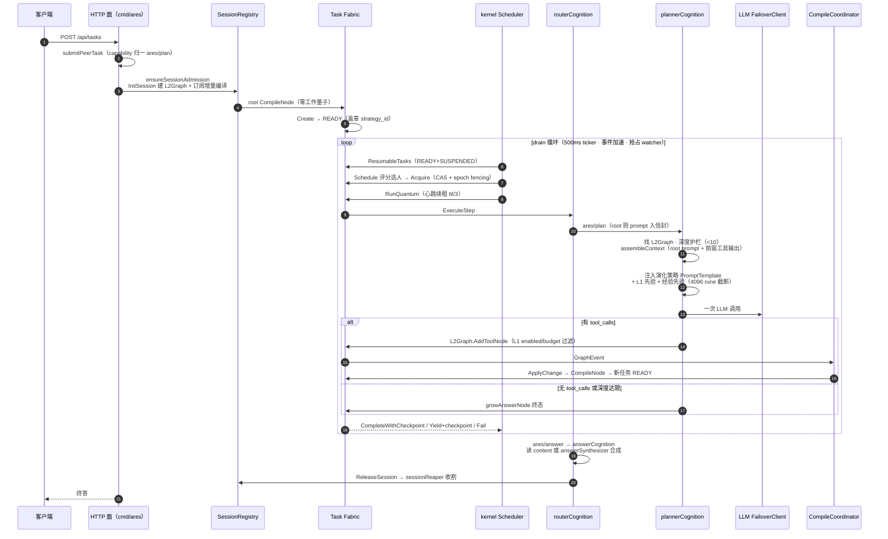
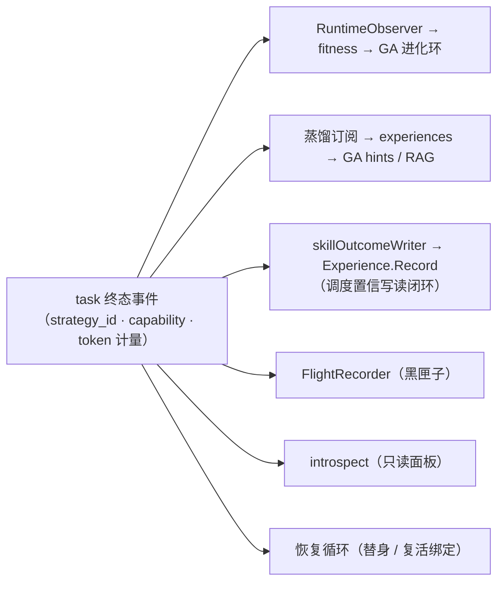
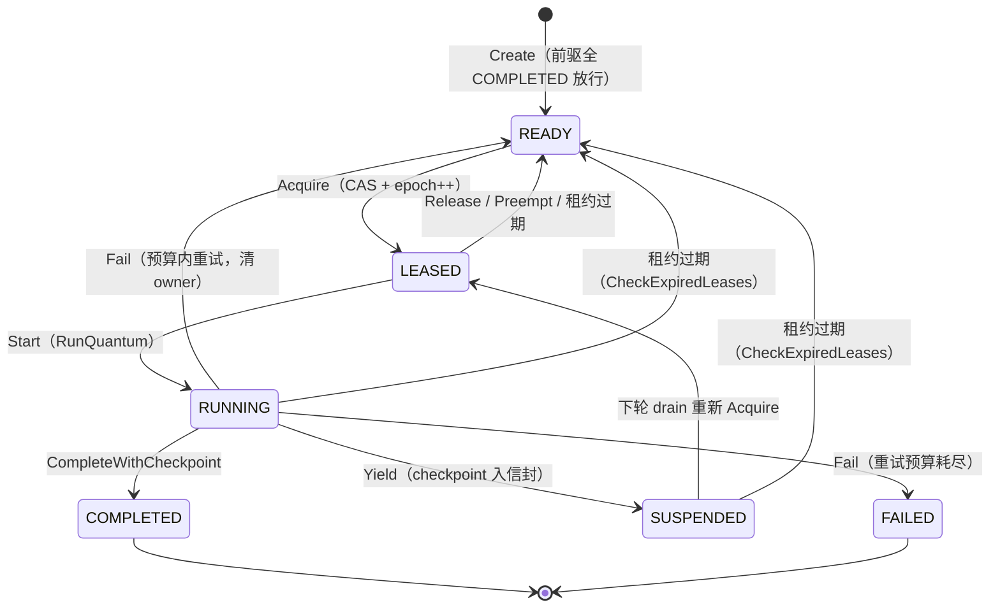
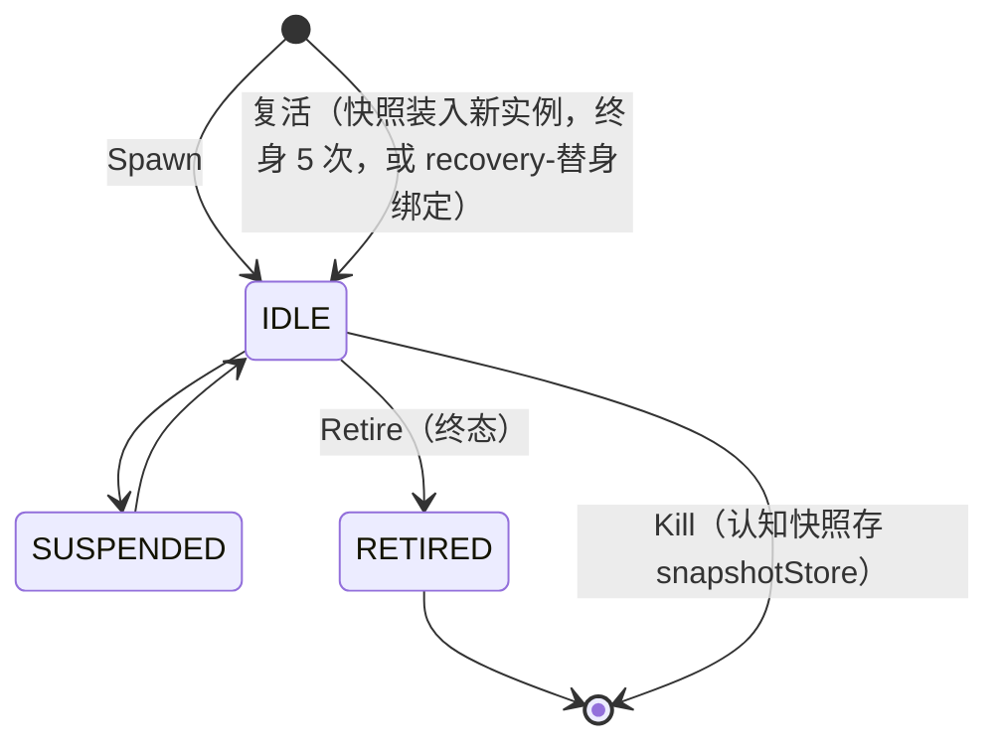
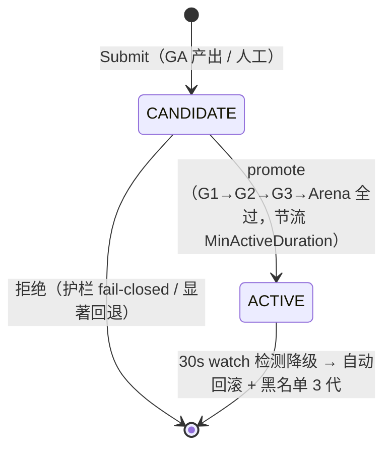
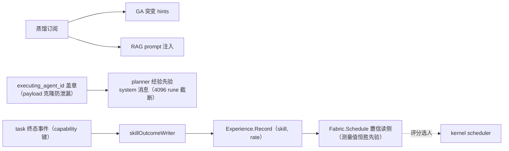
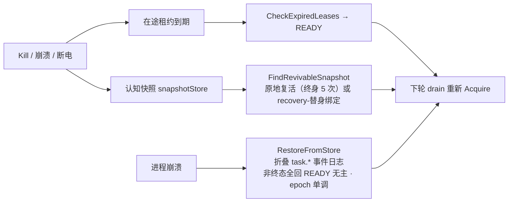
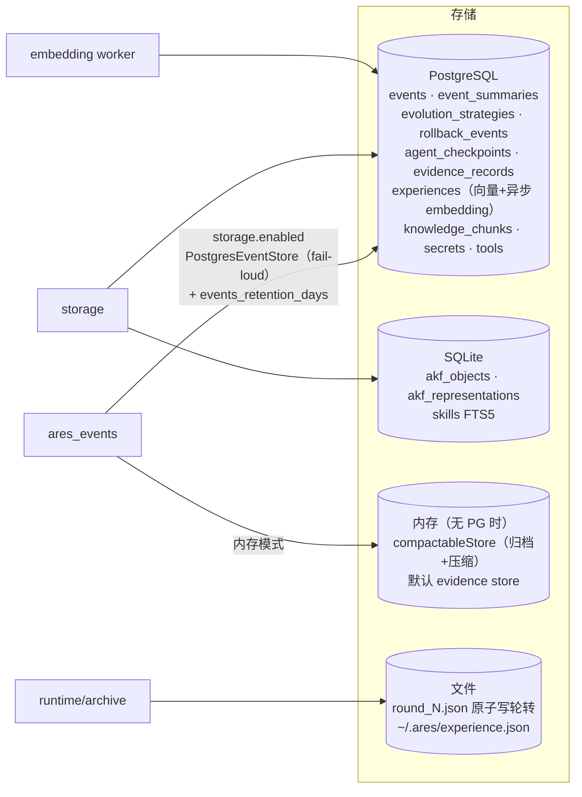

# ARES AgentOS — 终极架构图（Mermaid 版）

> 锚定：dev@25ece828（VERSION 0.3.1，2026-09-10）。反映 C1.3（PluginBus 仅剩 LoopPlugin）、M-G（G3 默认强度 + Arena 回归门 tri-state 默认 AUTO-ARMED）、M4/M5 收敛后的最新形态。
> 分工：本文档 = **全架构一页看穿**（图为主）；ARCHITECTURE.md = 设计依据与路线图；RUNTIME.md = 运行时实况（全部带 file:line 锚点，漂移以其为准）。

## 0. 一句话架构

**Agent 是被调度的进程**：对话历史 = 可迁移的进程状态（checkpoint envelope）；调度靠 lease + epoch fencing；任务图由 planner 自生长 → 增量编译 → 无领导者调度；进化 / 经验 / 恢复三环闭合。

---

## 1. 终极架构总图

```mermaid
flowchart TB
    %% ============ 外部世界 ============
    subgraph EXT["外部世界"]
        direction LR
        CLIENT["客户端"]
        LLP["LLM Providers"]
        MCPS["MCP Servers"]
        PG[("PostgreSQL + pgvector")]
        SQLITE[("SQLite")]
        FS[("文件<br/>round_N.json · experience.json")]
    end

    %% ============ L0 入口层 ============
    subgraph L0["L0 入口层"]
        direction LR
        CLI["cmd/ares — 唯一 CLI 入口<br/>serve·status·tools·db·dashboard·evolution…"]
        SDK["sdk/ — 极简 SDK（与 CLI 共用引擎）<br/>Agent.Run = agentloop 同步 ReAct（by-design）"]
        APIF["api/ — 纯转发层（DEPRECATED）"]
        COMPAT["compat/ — 零生产引用<br/>（0.4.x 整删决策）"]
    end

    %% ============ L1 组装层 ============
    subgraph L1["L1 组装层"]
        BOOT["ares_bootstrap — 唯一装配根<br/>provide_* 依赖注入 · cleanups 逆序回滚<br/>门禁装配 G1→G2→G3→Arena<br/>ExpiryCleaners（events retention · evidence）"]
    end

    %% ============ L2 核心层 ============
    subgraph L2["L2 核心层"]
        subgraph KERN["internal/kernel — 唯一调度内核"]
            SCHED["Scheduler.drain<br/>500ms ticker + 任务事件加速 + 抢占 watcher<br/>drainLimit auto = max(静态注册表, fabric 空闲候选)"]
            CAND["buildCandidates 评分选人<br/>能力重叠 × (1−load) × confidence × (1+priority)"]
            ORCH["Orchestrator — 六支柱系统运行时<br/>逆拓扑 30s 预算优雅停机"]
            KX["fabric_executor.go<br/>kernel → fabric 桥接"]
        end
        subgraph FAB["internal/fabric — 唯一编排层"]
            subgraph AFAB["agent/ — Agent Fabric"]
                ROUTER["l2graph routerCognition 四路分发<br/>ares/plan · tool/x · ares/answer · ares/root"]
                PLANNER["plannerCognition<br/>规划者不执行工具只长图 · 深度护栏 10<br/>assembleContext + 策略/经验注入"]
                SESS["SessionRegistry + sessionReaper<br/>answerSynthesizer 终答合成"]
                LIFE["lifecycle Spawn/Kill/Retire<br/>认知快照 + 5 次复活"]
            end
            subgraph TFAB["task/ — Task Fabric"]
                TSTATE["状态机 + lease/epoch fencing<br/>ownerLocked 三重校验（Owner+Epoch+状态）"]
                QUANT["RunQuantum 执行量子<br/>checkpoint envelope（schema v4 · token 累计）"]
                RSTR["RestoreFromStore 跨重启重建<br/>epoch 单调 · 租约不恢复全回 READY"]
            end
            MDAG["workflow/engine MutableDAG<br/>全仓唯一任务图载体（L1 能力图 + L2 会话图）"]
            PROJC["planprojection CompileCoordinator<br/>图事件 → 增量编译 → reconcile → CompileNode"]
        end
        subgraph RT["internal/runtime — 生命周期 + 子系统"]
            direction LR
            CORE["Manager·Router·Observer<br/>PluginBus（仅 LoopPlugin）"]
            EVOA["ares_evolution GA 接线<br/>fitness 聚合 · 门链 · watch 回滚"]
            EVOB["evolution GA 引擎<br/>genome·mutation·patch·coordinator"]
            MEMW["memory 工作记忆 + 蒸馏"]
            EVALW["eval G3 判分（默认强度）"]
            ARENAW["arena 回归门 A/B + Welch t<br/>tri-state 默认 AUTO-ARMED"]
            OBS["observability metrics·flight·cost"]
        end
    end

    %% ============ L3 基础设施层 ============
    subgraph L3["L3 基础设施层"]
        direction LR
        EVT["ares_events 事件溯源中枢<br/>OCC 追加 · 订阅分发"]
        LLMP["llm·llmcore·llmservice<br/>FailoverClient · 429 冷却降级"]
        TOOLP["tools·apitools<br/>web_search·calculator·regex·json·file<br/>+ mcp.* 动态发现"]
        KNW["knowledge·knowledgeapi<br/>AKG 三层对象 · 混合检索"]
        STGP["storage 迁移 · WriteBuffer"]
        EMBP["embedding 异步回填<br/>queue + dead_letter + reconciler"]
        IPCP["agentipc 协作主题<br/>delegate·pipeline·orchestrate"]
        SYSP["agentsyscall<br/>身份来自 kernelctx，不信 LLM 参数"]
        RECP["aresrecovery 恢复 + 混沌"]
        MISC["ares_security·ares_ratelimit·ares_config<br/>ares_shutdown·introspect·evidence<br/>feedback·discovery·detector…"]
    end

    %% ============ 边 ============
    CLIENT -->|"POST /api/tasks（JWT）"| CLI
    CLI --> BOOT
    SDK --> BOOT
    APIF -.->|"examples 经转发层编译"| L3

    BOOT --> KERN
    BOOT --> CORE
    BOOT --> MISC

    SCHED --> CAND --> KX
    KX <-->|"调度桥接"| TSTATE
    QUANT -->|"ExecuteStep"| ROUTER
    ROUTER -->|"ares/plan"| PLANNER
    ROUTER -->|"tool/x → 一次 CallTool"| TOOLP
    ROUTER -->|"ares/answer → 合成 + 释放会话"| SESS
    PLANNER -->|"读 GetActiveStrategy"| EVOA
    PLANNER -->|"一次 LLM 调用"| LLMP
    PLANNER -.->|"RAG 检索（retriever_wiring）"| KNW
    PLANNER -->|"AddToolNode（L1 enabled/budget 过滤）"| MDAG
    MDAG -->|"GraphEvent"| PROJC
    PROJC -->|"ApplyChange → CompileNode → READY"| TSTATE

    TSTATE --> EVT
    EVT -.->|"任务事件加速 drain"| SCHED
    CORE --> EVT
    CORE --> OBS
    EVOA --> EVALW
    EVOA --> ARENAW
    EVOA --> MEMW
    EVOA --- EVOB
    EVOB --> IPCP

    EVT -->|"storage.enabled → PostgresEventStore（fail-loud）"| PG
    EVT -.->|"内存模式 compactableStore + round 归档"| FS
    STGP --> PG
    STGP --> SQLITE
    EMBP --> PG
    KNW --> STGP
    LLMP --> LLP
    TOOLP --> MCPS
```

分层规则（架构测试强制锁定）：

- kernel 不 import runtime / workflow-engine（`internal/kernel/architecture_test.go`）
- fabric/task 顶层 + agent + planprojection 禁 import internal/runtime（`internal/fabric/task/architecture_test.go`）
- 接口定义在消费者侧（如 CapabilityExecutor 住 kernel）
- kernel（调度）⊄ fabric（编排），`fabric_executor.go` 是唯一桥

---

## 2. 核心执行主线（从 POST 到终答，一条线）

关键事实：**任务的最大来源是 planner 自己长图**，不是用户；所有提交归一到 `ares/plan` 首量子，L2 router 是唯一生产执行路径。

### 终态事件的六路消费者

---

## 3. 状态机三联

### 3.1 Task Fabric（`fabric/task/state.go`）

所有持权操作过 `ownerLocked` 三重校验；过期持有者的 complete/release 被 `ErrEpochMismatch` 拒绝；DAG 成环在提交时 Kahn 检测拒绝。

### 3.2 Agent Fabric（`fabric/agent/lifecycle.go`）

生产 agent 一生 IDLE（RUNNING 无人驱动）；**Agent 可弃，Task 持久**。

### 3.3 Strategy（进化策略生命周期）

---

## 4. 三大反馈闭环

### 4.1 进化环（GA 自我改进，5min ticker）

```mermaid
flowchart LR
    TE["task.completed/failed<br/>（带 strategy_id）"] --> OBSV["RuntimeObserver<br/>fitness 1.0/0.0<br/>latency 惩罚 1/(1+t/30s)<br/>token 惩罚 1/(1+tokens/100k)"]
    OBSV --> EVID["evidence（source=strategy）"]
    EVID --> AGG["RuntimeFitnessAggregator<br/>strategy .40 · dimension_eval .25<br/>workflow .15 · scheduler .15 · recovery .05"]
    AGG --> LC["lifecycle.Submit"]
    LC --> G1["G1 护栏门（fail-closed）"]
    G1 --> G2["G2 shadow 门（fail-closed）"]
    G2 --> G3["G3 eval 门（默认强度）"]
    G3 --> RG["Arena 回归门<br/>A/B + Welch t 检验（默认 AUTO-ARMED）"]
    RG --> PROM["promote → StrategyStore.SetActive"]
    PROM --> PP["planner 下一量子读 GetActiveStrategy<br/>新 PromptTemplate 生效（无重启无推送）"]
    PP -.->|"下一批任务"| TE
    PROM -.->|"30s watch 降级监测"| LC
```

### 4.2 经验环（四路闭合）

### 4.3 恢复环（Agent 可弃，Task 持久）

---

## 5. 存储布局

| 模式 | 事件总线 | 说明 |
|---|---|---|
| `storage.enabled=true` | PostgresEventStore | 表即持久历史；跨重启可 RestoreFromStore 重建 |
| 内存模式 | compactableStore | round 文件归档 + 压缩；重启丢事件流与 fitness 证据 |

---

## 6. 架构不变量（重构不得违反）

| 不变量 | 实现位置 |
|---|---|
| 一个内核：所有调度决策经过 internal/kernel | kernel 不 import runtime（architecture_test 锁定） |
| 一张图：MutableDAG 是全仓唯一任务图载体 | fabric/task/workflow/engine/mutable_dag.go |
| 一条主线：cmd/ares 唯一 CLI；L2 router 唯一生产执行路径 | fabric/agent/l2graph.go |
| 无领导者调度：就绪由织物状态机推导 | fabric/task/dag.go |
| 执行量子可恢复：yield 即 checkpoint | fabric/task/quantum.go |
| Epoch fencing：过期持有者不能驱动已易主任务 | fabric/task/fabric.go Acquire / ownerLocked |
| 协作式抢占：只在量子边界 | fabric.go Preempt |
| 规划者不执行工具，只生长图（深度上限 10） | fabric/agent/planner_cognition.go |
| syscall 身份来自 kernelctx，绝不信任 LLM 参数 | agentsyscall/syscall.go |
| 接口定义在消费者侧 | 全仓惯例 |
| Agent 可弃，Task 持久 | lifecycle.go + recovery.go |
