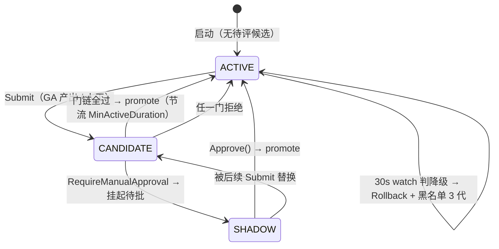

# ARCHITECTURE_DIAGRAM.md 事实核查报告

> 核查对象：`ARCHITECTURE_DIAGRAM.md`（标称锚点 `dev@25ece828`，VERSION 0.3.1）
> 核查方法：逐条断言 → 源码取证（file:line + 关键代码）→ 判定
> 核查时间：2026-09-11　核查范围：只读（未修改任何源码/配置）

---

## 一、总体结论

**这是一份可信度很高的架构文档。** 全文约 80 条可证伪的具体断言（数值、公式、命名、文件路径、机制），其中约 70 条**严格成立**，且大量断言能找到逐字对应的源码证据——不是"方向对"，而是"数字都对"。

例：`drainLimit` 公式、`Score` 评分公式、fitness 惩罚常数（30s / 100k）、聚合权重（.40/.25/.15/.15/.05）、Arena tri-state 默认 AUTO-ARMED、watch 30s、黑名单 3 代、复活预算 5 次、checkpoint schema v4、经验先验 4096 rune 截断、`executing_agent_id` 克隆防泄漏——**全部与代码一致**。

但有 **3 处实质性不准确（P1）** 和 **6 处措辞/归属不精确（P2）**，另有一处版本漂移。都是"可改可不改会影响可信度"的级别，不影响"一页看穿"的设计意图。

> **本报告已复核并自我更正过一次**：初版 P1-1 判定为"缺 SHADOW 与 DEGRADED 两个状态 / 图与文自相矛盾"，二次取证后确认**该判定有误**（`DEGRADED` 是声明未用的枚举值；SHADOW 与 G2 shadow 门是两个概念），已改为"状态机**拓扑**画反"。详见 P1-1。

| 判定 | 数量 | 状态 |
|---|---|---|
| ✅ 严格准确（有逐字证据） | ~70 | — |
| 🟡 措辞/归属不精确 | 6 | 已全部修正 |
| 🔴 实质性不准确 | 3 | 已全部修正 |
| ⚪ 版本漂移 | 1 | 已更新锚点 |

**修正落地**：以下 8 项修改已应用到 `ARCHITECTURE_DIAGRAM.md`（2026-09-11），本节保留原始判定与证据以备追溯。

---

## 二、必须修正（P1，实质性）

### P1-1　§3.3 Strategy 状态机的**拓扑结构**与代码不符

文档画的是：

```mermaid
[*] --> CANDIDATE: Submit
CANDIDATE --> ACTIVE: promote
CANDIDATE --> [*]: 拒绝        ← 把"拒绝"当成终态
ACTIVE --> [*]: 回滚           ← 把 ACTIVE 当成终态
```

**实际拓扑（`runtime/ares_evolution/lifecycle.go`）**：

| 状态 | 代码里的语义 | 证据 |
|---|---|---|
| `ACTIVE` | **驻留/已部署态**，既是**初态**也是每次评估结束后的**回归态** | `:479` `state: StateActive, // start in active state` |
| `CANDIDATE` | 门链评估中的**瞬时态** | `:714` `l.state = StateCandidate`（Submit 时置入） |
| `SHADOW` | 仅当 `RequireManualApproval` 时进入——**挂起等人工批准** | `:767` `l.state = StateShadow` + `heldCandidate` |
| `DEGRADED` | 枚举里声明，但**生产路径从不赋值** | 全仓非测试代码无 `StateDegraded` 赋值；回滚直接 `l.state = StateActive`（`:1046`） |

**三处偏差**：

1. **ACTIVE 不是终态，是驻留态。** 文档把 `ACTIVE` 画成 promote 后的终点（`ACTIVE --> [*]`）。真实情况：promote 后停在 `ACTIVE` 继续被 watch 监测，下次 Submit 又从 `ACTIVE` 出发。
2. **"拒绝"不是终态。** 文档 `CANDIDATE --> [*]: 拒绝`。真实情况：任一门拒绝 → `l.state = StateActive; l.currentCandidate = nil` 后**立刻返回**（`:747`），即"回到驻留态等下一轮"，不是终止。
3. **缺 `SHADOW`**（人工批准挂起态）。补充：`SHADOW` 与 §4.1 讲的 **G2 shadow 门是两个不同概念**——前者是人工审批挂起，后者是 `ShadowEvaluator` 的候选/active 对比评估。所以**不存在"图与文自相矛盾"**，我上一版报告里的这个说法是错的。

> **自我更正**：我上一版报告称"缺 SHADOW 与 DEGRADED 两个状态"并称"图与文自相矛盾"。经复核：**`DEGRADED` 不该补**（它是声明未用的枚举值），**`SHADOW` 该补但理由不同**（是人工审批态而非 shadow 门），**"自相矛盾"不成立**。文档真正的问题是**拓扑画反了**（把驻留态画成终态、把瞬时态画成初态），而不是"少画两个框"。已按此修正文档。

**修正后的画法**（已写入文档 §3.3）：



---

### P1-2　§5 存储清单：3 个表名错误 + 大量遗漏

文档列的 PostgreSQL 表：`events · event_summaries · evolution_strategies · rollback_events · agent_checkpoints · evidence_records · experiences · knowledge_chunks · secrets · tools`

对 `internal/storage/postgres/**` + `internal/evidence/postgres_store.go` 提取的真实 `CREATE TABLE` 清单，逐项比对：

| 文档写法 | 实际表名 | 判定 |
|---|---|---|
| `rollback_events` | `evolution_rollback_events` | ❌ 名称错 |
| `experiences` | `experiences_1024` | ❌ 缺维度后缀 |
| `knowledge_chunks` | `knowledge_chunks_1024` | ❌ 缺维度后缀 |
| `events` / `event_summaries` / `evolution_strategies` / `agent_checkpoints` / `evidence_records` / `secrets` / `tools` | 同名 | ✅ |

**遗漏的真实表**（至少 10 张，其中几张文档自己在别处提到过）：
`embedding_queue`、`embedding_dead_letter`、`evolution_lineages`、`eval_results`、`sessions`、`conversations`、`user_profiles`、`task_results_1024`、`recommendations`、`embeddings`

**最扎眼的一处自相矛盾**：文档 §1 的 L3 节点写着 "embedding 异步回填 queue + dead_letter + reconciler"，但 §5 的存储清单里**恰恰没有列出 `embedding_queue` / `embedding_dead_letter` 这两张表**——讲到了机制，漏掉了它的落库载体。

**建议**：`_1024` 后缀是真实 schema 的一部分（1024 维向量表），不宜省略；`rollback_events` 建议改为 `evolution_rollback_events`。或直接标注"清单为代表性节选，非全量"。

---

### P1-3　§3.1 "Kahn 检测"算法张冠李戴

文档原文：**"DAG 成环在提交时 Kahn 检测拒绝"**。

实际实现是三套、没有一套是 Kahn：

| 位置 | 算法 | 证据 |
|---|---|---|
| `MutableDAG.AddNode` 提交节点时拒绝 | **BFS 可达性**（`wouldCreateCycle`） | `mutable_dag.go:658-683`：`queue := []string{to}`，BFS 找 `from` |
| `buildDAG` 构造时拒绝 | **DFS 三色标记**（`hasCycle`） | `types.go:240-270`：`visited` + `recStack` 递归 DFS |
| `TopologicalSort` 输出拓扑序 | 这才是 Kahn（入度队列） | `mutable_dag.go:395-421`：`inDegree[neighbor]--`，队列出度归零入队 |

**问题**：Kahn 只用于**排序**，而"提交时拒绝成环"用的是 BFS/DFS。文档把排序算法名安到了检测机制上。

**建议**：改为"提交时 BFS 可达性检测拒绝成环（`wouldCreateCycle`），拓扑排序用 Kahn"。

---

## 三、建议修正（P2，措辞/归属）

### P2-1　`ownerLocked` 的"三重校验"表述不精确

文档：**"ownerLocked 三重校验（Owner+Epoch+状态）"**

实际（`fabric.go:712-724`）：
```go
if t.Owner == "" || t.Owner != agentID { return nil, ErrNotOwner }      // ① Owner
if t.Lease == nil || t.Lease.Epoch != epoch { return nil, ErrEpochMismatch } // ② Lease 存在 + ③ Epoch
```
是 **Owner + Lease 非 nil + Epoch**。"状态"是由 `Lease != nil` **间接**体现的，没有独立的 state 校验。
👉 建议改成"（Owner + 持租 + Epoch）"或直接照抄字段名。

### P2-2　"5min ticker"不是 ticker

文档：**"进化环（GA 自我改进，5min ticker）"**

实际是**事件驱动 + 限流窗口**（`ares_evolution/scheduler.go:246,261`）：`trigger: TriggerOnIdle`，订阅 `EventAgentStopped`（历史上从 `EventAgentEnd` 修正而来），`minInterval: 5 * time.Minute` 只是两次进化之间的最小间隔。
👉 建议改成"事件触发（OnAgentEnd）+ 5min lastRun 限流"。

### P2-3　"cmd/ares 是唯一 CLI 入口"略有水分

`cmd/` 下有**两个 main 包**：`cmd/ares` 和 `cmd/mock-db`（`cmd/mock-db/main.go:48`，自述"a self-contained smoke test for the storage layer"）。
👉 严格说是"唯一**面向用户**的 CLI"；mock-db 属测试/演示工具。若要严谨可加"（另有 cmd/mock-db 测试工具）"。

### P2-4　embedding 节点的归属位置有误导

文档把 "embedding 异步回填 queue + dead_letter + reconciler" 画成 `internal/embedding` 的能力。

实际：`internal/embedding/` 下**只有一个 `service.go`，且只定义了一个 `EmbeddingService` interface**。队列 / 死信 / 重放全部住在 `internal/storage/postgres/embedding_queue.go`（`EmbeddingQueue`、`MarkFailed`→`embedding_dead_letter`、`Reconcile`）。
👉 项目自己的文档（`docs/articles/zh/19-storage-layer.md:152`）专门澄清过这一点，架构图反而踩了同一个坑。

### P2-5　"agentipc 协作主题"的三个 topic 不在 agentipc

文档：**"agentipc 协作主题 delegate·pipeline·orchestrate"**

实际常量定义在 `cmd/ares/evolution.go:308-310`：
```go
topicDelegateTask   = "delegate-task"
topicPipelineStage  = "pipeline-stage"
topicOrchestrateWrk = "orchestrate-worker"
```
`internal/agentipc` 只是承载这些 topic 的 bus。`internal/agentipc/` 里 grep 不到这三个词。
👉 建议标为"协作主题（topic 定义在 cmd 桥接层，agentipc 承载）"，或直接落到 `cmd/ares`。

### P2-6　两处小遗漏（可选择性补）

- §3.1 状态机只画了 `RUNNING → COMPLETED: CompleteWithCheckpoint`，遗漏了同样在生产路径上的 `Complete()`（无 checkpoint 完成）。`fabric.go:373` / `fabric.go:402` 两个方法都在。
- §2 时序图 `TF->>TF: Create → READY（盖章 strategy_id）`：`strategy_id` 实际是在**投影 CompileNode 时**盖的（`fabric/task/workflow_plan.go:144` `env.StrategyID = strategyID`），不是 `Create` 阶段。语义无害，位置略偏。

---

## 四、版本漂移

文档标称锚定 `dev@25ece828`，实际当前 HEAD 是 **`2aeaf942`**（`fix(events+cleanup): composite (created_at,id) cursor; ev oapi surface mirrors; retire review doc`），相差 1 个提交、37 个文件、+716/-738 行。

**影响评估：可忽略。** 差异绝大部分是测试文件的小改动（`*_test.go` 逐行 `2 +-`），生产侧只有 `ares_evolution/mutation/mutator.go(+25)`、`runtime/manager_lifecycle.go(+33)`、`ctxutil.go(-2)` 等零散调整，均不触及本报告的判定。

👉 建议把锚点更新为 `dev@2aeaf942`，或标注"锚点 ±1 提交"。

---

## 五、准确项抽样（附证据，供交叉验证）

这些是**逐字对得上**的硬断言，可信度最高：

| 文档断言 | 源码证据 |
|---|---|
| Scheduler 500ms ticker | `internal/kernel/scheduler.go:264` `PollInterval: 500 * time.Millisecond` |
| drainLimit auto = max(静态注册表, fabric 空闲候选) | `scheduler.go:531-548` `limit = max(s.ExecutorCount(), s.fabricCandidateCount())` |
| Score = 能力重叠 ×(1−load)× confidence ×(1+priority) | `fabric/task/scheduler.go:81` `parts.Score = overlap * (1 - load) * conf * boost` |
| 抢占 watcher（有独立 goroutine） | `scheduler.go:341-367` `preemptTicker` + `PreemptLowerPriority` |
| 任务事件加速 drain | `scheduler.go:372-391` 订阅 created/ready/completed/failed/yielded |
| 心跳续租 ttl/3 | `scheduler.go:298-300` "heartbeats Renew at ttl/3 (minimum 5s)" |
| Orchestrator 六支柱 + 逆拓扑 30s | `cmd/ares/kernel.go:92-102`（scheduler/taskfabric/agentfabric/recovery/dispatcher/pluginbus）；`kernel/orchestrator.go:18,22,28` 三个 30s；`orchestrator_test.go:270` `StopsInReverseOrder` |
| PluginBus 仅剩 LoopPlugin | `cmd/ares/kernel.go:1271-1293` 只 `bus.Register(loop)`（`NewLoopPlugin("kernel-loop")`） |
| kernel 禁 import runtime / workflow-engine | `internal/kernel/architecture_test.go:37-40` `banned := []string{"internal/runtime", "internal/fabric/task/workflow/engine"}` |
| fabric 三包禁 import runtime（workflow/ 豁免） | `internal/fabric/task/architecture_test.go:40-45` gated=task+agent+planprojection |
| routerCognition 四路分发 | `fabric/agent/l2graph.go:351-380`：`tool/` → `ares/answer` → `ares/plan` → `ares/root` |
| 规划者深度护栏 10 | `planner_cognition.go:25` `const DefaultMaxPlanDepth = 10` |
| 经验先验 4096 rune 截断 | `planner_cognition.go:185` `const maxExperiencePriorRunes = 4096` |
| 终态事件六路消费者 | `observer.go:218` / `distiller_admin.go:63` / `skill_outcome_writer.go:83` / `flight/collector.go:249` / `introspect/sink.go:145` / recovery |
| fitness latency 1/(1+t/30s) | `observer.go:79,155` `defaultLatencyScale = 30 * time.Second` |
| fitness token 惩罚 1/(1+tokens/100k) | `observer.go:87,118` `defaultTokenScale = 100_000` |
| 聚合权重 .40/.25/.15/.15/.05 | `fitness_aggregator.go:56-60` Outcome/DimensionEval/Workflow/Scheduler/Recovery |
| Arena tri-state 默认 AUTO-ARMED | `ares_bootstrap/regression_gate_wiring.go:37` "M-G2 tri-state semantics (2026-09-10): the gate defaults to AUTO-ARMED" |
| Arena 用 Welch t 检验 | `ares_evolution/regression_gate.go:7,47` "Welch's t-test… Default 0.05" |
| 30s watch + 黑名单 3 代 | `lifecycle.go:156` `defaultWatchInterval = 30 * time.Second`；`lifecycle.go:161` `defaultBlacklistGenerations = 3` |
| 复活终身 5 次、永不重置 | `aresrecovery/recovery.go:40-44` "LIFETIME-CUMULATIVE per identity and is intentionally NEVER reset"；`:82` `MaxRestarts: 5` |
| 生产 agent 一生 IDLE（RUNNING 无人驱动） | `SetRunning/SetIdle` 全仓仅测试调用，无生产调用方 |
| checkpoint schema v4 + token 累计 | `checkpoint_schema.go:29` `const CurrentCheckpointSchemaVersion = 4`；`:23` "v3 → v4 (TokenUsage)" |
| RestoreFromStore：租约不恢复、非终态全回 READY、epoch 单调 | `restore.go:21-27`（三行注释与文档措辞近乎逐字一致） |
| yield 即 checkpoint | `fabric/task/quantum.go:14-19` "yield is the execution boundary" |
| Fail 预算内 → RUNNING→READY 清 owner | `fabric.go:430-443` `CanRetry()` → `transition(StateReady)` → `t.Owner = ""` |
| executing_agent_id 克隆防泄漏 | `fabric/agent/executor.go:125-149` "The copy is load-bearing… an in-place write would persist one quantum's executor into the envelope" |
| syscall 身份来自 kernelctx，不信 LLM 参数 | `agentsyscall/syscall.go:407,409` "never from LLM-supplied arguments"；`Origin: kctx.CallerID(ctx)` |
| PostgresEventStore fail-loud | `cmd/ares/serve.go:517-524` PG pool 失败即 `return err`；`bootstrap.go:463` "Fail-loud: configured Postgres that cannot connect blocks startup" |
| ares_events OCC 追加 | `ares_events/store.go:13-17` `Append(..., expectedVersion int64)` |
| LLM 429 冷却降级 | `llm/failover.go:16-17` `defaultCooldownDuration = 60 * time.Second`；`client.go:65` `isRateLimitError` |
| AKG 三层对象 | `api/knowledge/knowledge.go:15-18` Raw / Normalized / Summary |
| 混合检索 | `knowledge/store.go:40-44` `HybridSearch`（vector cosine + lexical） |
| cleanups 逆序回滚 | `ares_bootstrap/bootstrap.go:274` `for i := len(cleanups) - 1; i >= 0; i--` |
| ExpiryCleaners（events retention · evidence） | `bootstrap.go:293` events retention；`:489-490` `evidence_records` |
| POST /api/tasks + JWT | `cmd/ares/agent.go:369` `{Method:"POST", Path:"/api/tasks", Auth: authWrite}` |
| submitPeerTask capability 归一 ares/plan | `cmd/ares/agent_kernel.go:732-736` `capability = planCapability` |
| ResumableTasks = READY + SUSPENDED | `fabric/task/dag.go:56` |
| round_N.json 原子写 | `runtime/archive/interfaces.go:13` "writes round_N.json atomically"；`writer.go` + `.tmp` 重命名 |
| ~/.ares/experience.json | `ares_bootstrap/skills_wiring.go:77` `filepath.Join(home, ".ares", "experience.json")` |
| akf_objects / akf_representations / skills FTS5 | `knowledge/store/sqlite/store.go:66,84`；`runtime/protocol/skills/discovery.go:15,29` |
| MutableDAG 全仓唯一任务图载体 | 全仓仅 `engine.DAG` / `engine.MutableDAG` 两个 Go DAG struct；L1 能力图与 L2 会话图均用它（`agent_kernel.go:385`、`l2graph.go:62`） |

---

## 六、修改清单（已全部落地）

用户授权后已应用到 `ARCHITECTURE_DIAGRAM.md`：

| # | 修改项 | 位置 | 状态 |
|---|---|---|---|
| 1 | 状态机**重画**为 ACTIVE 驻留态 ↔ CANDIDATE 瞬时态，补 SHADOW（人工审批），标注 DEGRADED 为声明未用 | §3.3 | ✅ |
| 2 | 表名修正 3 处（`evolution_rollback_events` / `experiences_1024` / `knowledge_chunks_1024`）并补齐 `embedding_queue`·`embedding_dead_letter`·`evolution_lineages`·`eval_results`·`sessions`·`task_results_1024` 等，加"全量"脚注 | §5 | ✅ |
| 3 | "Kahn 检测" → "BFS 可达性检测（`wouldCreateCycle`；Kahn 只用于拓扑排序）" | §3.1 注 | ✅ |
| 4 | "三重校验（Owner+Epoch+状态）" → "（Owner + 持租 + Epoch）" | §1 TSTATE 节点 + §3.1 注 | ✅ |
| 5 | "GA 5min ticker" → "事件触发 + 5min 限流" | §4.1 标题 | ✅ |
| 6 | "唯一 CLI 入口" → "唯一用户 CLI 入口（cmd/ 下另有 mock-db 测试工具）" | §1 CLI 节点 + §6 不变量表 | ✅ |
| 7 | embedding / agentipc 节点补归属说明 | §1 L3 | ✅ |
| 8 | 锚点 `25ece828` → `2aeaf942`，并加核查报告交叉引用 | 文首 | ✅ |
| 9 | §3.1 补 `Complete()`（无 checkpoint 完成）路径 | §3.1 | ✅ |
| 10 | §2 `strategy_id` 盖戳时点改为 CompileNode | §2 时序图 | ✅ |

---

## 七、更正记录

- **2026-09-11（本报告第 2 版）**：自我更正 P1-1。第 1 版判定"§3.3 缺 SHADOW 与 DEGRADED 两个状态、图与文自相矛盾"，二次取证（`lifecycle.go:479/714/747/767/1046` + 全仓 `StateDegraded` 赋值扫描）后确认该判定**部分错误**：
  - `DEGRADED` 是**声明但生产从未赋值**的枚举值 → 要求"补 DEGRADED"是错的；
  - `SHADOW` 确实存在，但它是**人工审批挂起态**，与 §4.1 的 **G2 shadow 门**是两回事 → "图与文自相矛盾"不成立；
  - 真正的缺陷是**拓扑画反**（驻留态被画成终态、瞬时态被画成初态、拒绝被画成终态）。

---

*核查为只读作业；文档修正已获用户明确授权后执行。除 `ARCHITECTURE_DIAGRAM.md` 外未改动任何源码/配置。本报告自身亦随证据更新。*
