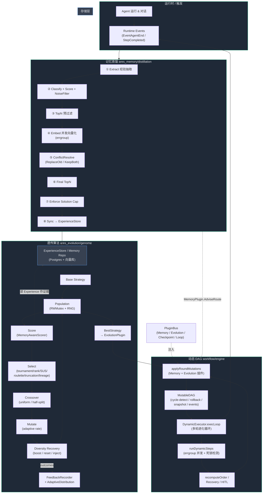

# 核心三模块分析：遗传算法 · 动态 DAG · 记忆蒸馏

> 基于真实代码审查（`internal/ares_evolution/genome`、`internal/workflow/engine`、`internal/ares_memory/distillation`）+ `go vet` 干净 + 三模块测试全绿。
> 结论先行：**这三个才是 goagent 真正的技术内核，成熟度 ~85–90%，而且三者是真正闭环联动的——比之前审查的 AKF（50–55%、核心路径破损）高一个维度。**

---

## 一、成熟度总览

| 模块 | 代码量 | 测试文件 | vet/test | 成熟度 | 一句话 |
|------|--------|----------|----------|--------|--------|
| 遗传算法 `ares_evolution/genome` | ~17k 行 | 16 | ✅ | **~88%** | 教科书级但带生产级工程（多目标/自适应/多样性恢复/闭环打分） |
| 动态 DAG `workflow/engine` | mutable 683 + executor 803 | 12 | ✅ | **~87%** | 带恢复/HITL/死锁检测/多轮进化的硬核运行时 |
| 记忆蒸馏 `ares_memory/distillation` | ~7.3k 行 | 15 | ✅ | **~86%** | 干净 8 阶段流水线，安全/噪声过滤齐全，且衔接经验库闭环 |

**对比 AKF**：AKF 是"建图能跑、懂知识破产"；这三块是"各自扎实 + 相互咬合"。

---

## 二、逐模块分析

### 1. 遗传算法（genome）—— ★★★★☆

**扎实的地方**
- **完整算子链**：`Population` → `ScoreAgents(MemoryAwareScorer)` → `Select`（tournament / rank / SUS / roulette / truncation / **lineage_rank** 共 6 种）→ `Crossover`（uniform + half-split 半句交叉 + 3 种 prompt 继承模式）→ `Mutate`（adaptive rate）→ `Diversity Recovery`（突变率提升 / 停滞重置 / 新鲜个体注入 三件套）。
- **多目标**：`ScoreAgentsMulti` + `ParetoFront` 真做了 Pareto 前沿。
- **工程严谨**：`sync.RWMutex` 全程护 `Agents/Generation`；RNG 用 `rand.New` 可复现（#nosec 标注合理）；`ScoreAgents` 对 scorer panic 捕获并标 `ScoreUnevaluated`；`BestStrategy/Snapshot` 一律深拷贝防外部改脏内部态。
- **闭环接入**：`GenomePopulationAdapter` 把 genome 接到进化调度器，打分走 `MemoryAwareScorer`（**适应度直接吃蒸馏出的经验做证据加成**），跑完把结果回灌 `AdaptiveDistribution`（调突变概率）+ `FeedbackRecorder`（经验强化）。这是真正的反馈闭环。

**隐患 / 可挑刺**
- `generateOffspring` 里 `switch len(winners) { case 2,3,4,5,6,7,8,9,10:` 用魔法数字硬列，应改成 `>= 2`（selection 永远返回 ≥2，列 2..10 是过度防御且会漏 11+）。
- `EvolveAfterScoring` 把"打分+进化+记历史"锁在一起，耦合偏紧；长程运行 `HistoryMaxSize=0` 默认无限增长（内存 unbounded）。
- `EvolveOnIdle` 标榜"零 token"，但它依赖预计算分数——若 scorer 走 LLM，则并非真零成本。文档措辞有误导风险。

### 2. 动态 DAG（workflow/engine）—— ★★★★☆

**扎实的地方**
- **MutableDAG**：`sync.RWMutex` 全程护；增量环检测（`wouldCreateCycle` BFS + `hasCycleInAdjList` 三色 DFS）；加边/加节点失败时**回滚已加的边**；`ReplaceNode` 在模拟邻接表上先判环再原子迁移所有入/出边；`Snapshot/SnapshotWithSteps` 深拷贝；`version` 计数器；`GraphEventHub` 发布订阅。
- **DynamicExecutor**：`execLoop` 外层多轮 **Controlled Evolutionary Loop**；`runDynamicSteps` 用 errgroup 并发 + `stepDone` 通道避免 `stepEg.Wait()` 竞态（注释里 H2/H3 fix）；**死锁检测定时器**；**HITL 人工中断**（可持久化恢复）；checkpoint 续跑；条件步骤；PluginBus 注入 Memory/Evolution/Checkpoint/Loop 四类插件。
- `applyRoundMutations` 是核心卖点：每轮间按 MemoryPlugin 建议加路由节点、EvolutionPlugin 建议调 agent，DAG 随执行结果**动态演化**。

**隐患 / 可挑刺**
- 执行器直接读 `mutableDAG.mu`（如 `runDynamicSteps` 里 `mutableDAG.mu.RLock()` 复制 `DependsOn`）——**执行器耦合了 DAG 内部结构**，属于脆弱封装；应改为暴露 `ReadDeps(id)` 方法。
- `applyRoundMutations` 的 MemoryPlugin 分支对不存在的目标节点用 `AgentType:"default"` 直接 `AddNode`，并注释"应用层应随后覆盖"——这是**隐式契约**，若上层没接 `AgentStepResolver`，会留下不可执行 orphan 节点。
- 每完成一个 step 都 `recomputeOrder`（重建拓扑序 O(V+E)），规模大时调度开销线性累积，可接受但非最优。

### 3. 记忆蒸馏（distillation）—— ★★★★☆

**扎实的地方**
- **干净 8 阶段流水线**：extract → classify+score+noise filter → TopN 预过滤 → **并发 embed（errgroup, SetLimit 5）** → conflict resolve（ReplaceOld/KeepBoth）→ final TopN → enforce solution cap → **sync 到 ExperienceStore**。
- **安全/质量门**：`SecurityFilter`（始终启）挡注入/泄露；`NoiseFilter` 过滤代码块/栈帧/日志/markdown 表；`MemoryClassifier` 分类；`ImportanceScorer` 带长度奖励；`ConflictResolver` 用向量相似度（阈值 0.85）做冲突检测。
- **工程严谨**：config 用 `sync.RWMutex` 可热更新；指标用 `atomic.Int64`；embedding pipeline 抽象（可走 unified pipeline 或裸 embedder）；租户隔离；solution 上限超额时按置信度升序裁剪并带批量删除失败回退。
- `expStore` 同步是**闭环关键**：蒸馏出的经验进 ExperienceStore → 被 GA 的 `MemoryAwareScorer` 读作证据。

**隐患 / 可挑刺**
- `KeepBoth` 分支构造的 `oldMemory` 只塞了 `conflict.Problem/Solution/Vector`，**未重新跑冲突检测也未重新 embed**（直接复用旧 vector）——可能自己制造新冲突。
- `enforceSolutionCap` 用 `CountByMemoryType(MemoryKnowledge)`，但注释与上游语义称"solution memories"——若分类产出的是 `MemorySolution` 而非 `MemoryKnowledge`，计数会失准、封顶失效。
- `embedPhase` 中 embed 失败 → `valid:false` → 该记忆**静默丢弃无重试**，瞬时 embed 抖动会丢好记忆。
- `MaxMemoriesPerDistillation=3` 默认极激进，可能剪掉有用多样性。

---

## 三、完整架构图（Mermaid）

**闭环解读（这是真正值钱的部分）**
1. Agent 运行/对话 → 产生 Runtime Events。
2. 事件触发**记忆蒸馏**，抽出经验 → 写 ExperienceStore（PG + 向量）。
3. GA 的 `MemoryAwareScorer` 读 ExperienceStore 中的经验作为**证据**调整策略适应度 → 进化出最优策略 → 通过 `EvolutionPlugin.Recommend` 输出。
4. **动态 DAG** 的 `applyRoundMutations` 每轮吃 `MemoryPlugin.AdviseRoute`（路由建议）+ `EvolutionPlugin.Recommend`（agent 建议）对图做变异，再执行。
5. DAG 执行产生新事件 → 回到第 1 步。同时 GA 进化结果回灌 `AdaptiveDistribution`/`FeedbackRecorder`，下一轮突变更聪明。

> 这不是"RAG over KG"式的单向检索，而是**经验 → 适应度 → 进化 → 图变异 → 新经验**的自改进环。AKG 文档里想做却没落地的"蒸馏闭环"，在 distillation + genome + workflow 三件套里**实际跑通了**。

---

## 四、与 AKF 的对比（为什么这三块更可信）

| 维度 | AKF（之前审的） | 核心三模块（本次） |
|------|----------------|-------------------|
| 编译/测试 | 能编译，但核心路径坏 | vet 干净 + 三包测试全绿 |
| 闭环 | Resolver 坏 / QueryPlanner 算完即弃 / Distill 不存在 | 蒸馏→GA→DAG→事件 真闭环 |
| 并发安全 | 有数据竞争（B22） | 普遍 `RWMutex` + errgroup + 竞态修复注释 |
| 创新成色 | PPT 级 | 多目标 GA + 自适应 + 行为驱动图变异，有真实差异化 |

**结论**：goagent 的"自主性"叙事，真正的技术支点在这三个模块，不在 AKF。若要把"agent-native"讲圆，应以这三块为主轴，把 AKF 的定位降级为"可选的长期知识沉淀层"，或按之前 `akf_remediation_plan.md` 的 Phase 2/3 把它接进这个闭环。

---

## 五、可立即动手的 5 个加固点（按性价比）

1. **DAG 封装**：把执行器对 `mutableDAG.mu` 的直读改为 `ReadDeps(id)` 公开方法，消除内部结构耦合。
2. **蒸馏 KeepBoth**：新构造的 `oldMemory` 走一遍冲突检测/重 embed，避免二次冲突。
3. **蒸馏封顶类型**：统一 `MemoryKnowledge` vs `MemorySolution` 语义，否则 solution cap 可能失效。
4. **GA 选择器**：`switch len(winners) {case 2..10}` 改为 `>= 2`，消除魔法数字与 ≥11 的隐患。
5. **蒸馏 embed 失败**：瞬时失败加一次重试/降级，避免好记忆被静默丢弃。
