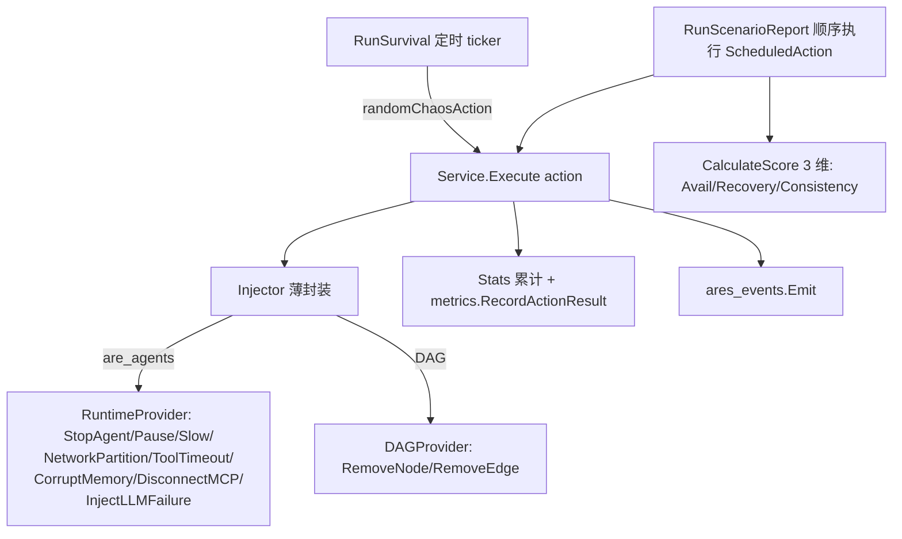

# 核心模块评审：混沌工程 & 工具调度层

> 审查范围：`internal/ares_arena/`（agent 级混沌竞技场）、`internal/ares_quant/marketmaking/chaos.go` + `marketmaking_api/chaos.go`（量化混沌）、`internal/agents/leader/dispatcher.go`（任务分发）、`internal/workflow/graph/scheduler.go`（图调度）、`internal/ares_evolution/scheduler.go`（进化调度）、`internal/tools/planner/`（工具选择/执行层）。
> 方法：通读核心实现 + `go vet`（全部干净，行号引用均为真实代码）。
> 严重度：🔴 Critical / 🟠 High / 🟡 Medium / 🟢 Low / ℹ️ Info。

---

## 一、混沌工程（Chaos Engineering）

成熟度判定：**agent 级竞技场 ~85%（真打、工程扎实）；量化 chaos 两极分化（真打层有评分死维，模拟层是纯公式骨架）**。

### 1.1 架构：ares_arena（agent 级）



设计优点：锁层级注释清晰（`survival.mu → s.mu`），`GetSurvivalStatus` 深拷贝 events 防 race，Recovery 用 resurrection/failover 插件自动兜底（不自己实现恢复）。是**真混沌**——直接打真实 runtime API。

### 1.2 发现的问题（混沌）

- 🟡 **C-01 · survival 的图变异打错目标**（`survival.go:252-267`）
  `randomChaosAction` 里 `ActionRemoveNode` / `ActionRemoveEdge` 用 `s.injector.AvailableAgentIDs()`（agent ID）当 DAG 节点/边 ID，但 `Injector.RemoveNode/RemoveEdge` 走 `DAGProvider`，其节点 ID 空间与 agent ID **不一定相同**。结果：survival 模式下图变异几乎永远命中"无此节点"→ 全部计为 failed fault，或静默 no-op。**变异类混沌在 survival 里基本无效**。
  *修复*：`DAGProvider` 增加 `ListNodes() []string` / `ListEdges() []Edge`；`randomChaosAction` 对 RemoveNode/RemoveEdge 改用真实 DAG ID。

- 🟡 **C-02 · Scenario 评分虚高 / 不闭环**（`scenario.go:200,263`）
  `RunScenarioReport` 最终 `report.Score = CalculateScoreV1(service.Stats(), service.calculateAvgRecoveryTime(nil))` 传 `nil` 时间线 → `avgRecovery=0` → speedScore 按"≤1s 恢复"计满分 100；且用的是**全局累计** `service.Stats()`，不是本次 `results`。后果：scenario 评分不反映本次动作的真实恢复速度，且跨多次运行污染。
  *修复*：从 `results` 现算——`total=len(results)`、`recovered=count(Success)`、`avgRecovery = mean(Duration where Success)`；传给 `CalculateScore`。

- 🟡 **C-03 · 量化真打层评分有"死维度"**（`marketmaking/chaos.go:139-140`）
  `stoppedDangerousQuotes/maintainedCapital/auditLogComplete/recoveredControlled` 初始全 `true`；其中 `auditLogComplete`、`recoveredControlled` **全程再未被置 false**。这意味着 `computeScore` 里 -15（审计）和 -20（恢复）两段惩罚**永远不触发**，分数不可能因审计缺失或恢复失败而下降。韧性评分对这两个维度是"免疫通过"的。
  *修复*：真实评估——例如 `recoveredControlled = 检测 engine 是否回到受控态`；`auditLogComplete = 校验 eventsLog 是否完整落盘`。

- 🟡 **C-04 · 量化真打层 disconnect 不可并发观测**（`marketmaking/chaos.go:334-364`）
  `executeExchangeDisconnect` 在持有 `e.mu` 的整个 `time.Sleep(duration)` 期间设置/清除 `e.disconnected`；而 `IsDisconnected()` 也要锁 `e.mu`。结果：`Execute` 持锁期间，任何并发调用 `IsDisconnected()` 会**阻塞到整个测试结束**，断连状态在测试中无法被外部观测。注释自称"Execute 已持锁直接访问"，但这恰恰让观测接口失效。
  *修复*：`disconnected` 改用 `atomic.Bool`；`executeExchangeDisconnect` 释放 `e.mu` 后再 sleep，仅用 atomic 保护标志位。

- 🟢 **C-05 · 量化模拟层是纯公式，不可当韧性证据**（`marketmaking_api/chaos.go`）
  `DefaultChaosExecutor` 的 `injectFaults` 只数随机数、不触碰任何真实系统；`calculateRecoveryTime`/`isSystemDegraded` 全是**写死的公式**（duration/10、duration/3…），从不观测真实行为。`validateScenario` 还漏了 `Type` 校验。注释已承认是 skeleton，但**拿它的输出当"系统韧性证明"会严重误导**。
  *修复*：在文档/接口明确标 `// 仅用于仿真/压测脚本，不代表真实系统韧性`；或让 `Execute` 真正驱动被测系统并测量。另：`ChaosAction.TriggerTime`/`Duration` 字段从没被读（死字段）。

---

## 二、工具调度层（Tool Scheduling / Dispatch）

成熟度判定：**leader dispatcher ~85%（errgroup+信号量，工程好，但有死 timeout）；graph/evolution scheduler ~90%（纯函数/锁严谨）；tools/planner ~80%（管线设计优雅，但单点失败 abort 整计划是硬伤）**。

### 2.1 架构：真正的三层调度

```mermaid
flowchart TD
    subgraph L[leader 任务分发]
      D[TaskDispatcher.Dispatch] -->|errgroup + sem(maxParallel)| E[executeTask]
      E -->|本地| F1[executorFuncs]
      E -->|分布式| F2[MessageSender.Send]
    end
    subgraph G[workflow 图调度]
      S1[DefaultScheduler FIFO] --> Q[ready queue]
      S2[PriorityScheduler] --> Q
      S3[ShortJobScheduler] --> Q
    end
    subgraph P[工具选择/执行层 tools/planner]
      A1[SemanticAnalyzer] --> A2[CapabilityPlanner]
      A2 --> A3[ToolResolver 静态map+provider自检]
      A3 --> A4[ToolScorer 静态meta+evidence排序]
      A4 --> A5[ExecutionPlanner 单步/DAG]
    end
    subgraph EV[进化调度]
      R[EvolutionScheduler.OnAgentEnd] -->|minInterval+降级检测+guardrails| AD[adapter.Run 异步]
    end
```

### 2.2 发现的问题（工具调度）

- 🟡 **T-01 · dispatcher 的 timeout 是死字段**（`dispatcher.go:34,57-59,65`）
  `NewTaskDispatcher` 收 `timeout` 并存进 `d.timeout`，但 `Dispatch` / `executeTask` **从不读取**，也没套 `context.WithTimeout`。文档承诺的"dispatch timeout in seconds"实际从未生效——超时的任务会一直跑到底。
  *修复*：`Dispatch` 开头 `ctx, cancel := context.WithTimeout(ctx, time.Duration(d.timeout)*time.Second); defer cancel()`。

- 🟡 **T-02 · planner 单点失败 abort 整条计划**（`planner.go:95-97`）
  `Plan` 对每个 `requirement` 调 `resolver.Resolve`，**任一返回 error 就 `return nil`**，导致整个多步 plan 失败。而 `resolver.go:138-139` 对映射表里没有的 capability 直接返回 "no tools found"。后果：**一个未识别的 capability（或 analyzer 多打了某个能力名）会让整条请求挂掉**，即使其它步骤都能解析。
  *修复*：把解析失败当作"该需求未解析"而非致命错误——`continue` 并标记 `req.ResolvedTool=""`，最后对完全无解的需求降级（或返回 partial plan + 警告），而不是整体 abort。

- 🟢 **T-03 · resolver 硬编码 0.95 成功率**（`resolver.go:180`）
  每个候选 `SuccessRate: 0.95`，无论是否有真实记录。无 track record 的工具与已验证工具被同等对待（魔法数 0.95）。
  *修复*：无 evidence 时成功率应为 0（或更低默认），让 evidence 真正驱动排序；或在 `ToolCandidate` 增加 `HasEvidence` 标志。

- 🟢 **T-04 · scorer 平局不确定**（`scorer.go:66-68`）
  `sort.Slice` 用 `>` 非 stable，分数相同的两个候选谁排第一不确定 → `planner.Plan` 取 `scored[0]`（planner.go:116）在平局时任意选。
  *修复*：加确定性 tie-break（先按 latency 升序，再按 ToolName 字典序）。

- 🟢 **T-05 · step↔requirement 用 index 耦合**（`planner.go:127-131`）
  `plan.Steps[i].ToolName = requirements[i].ResolvedTool` 假设 `execPlan.Plan` 产出的 steps 顺序与 `requirements` 完全一致。当前 executor.go 确实同序，但这是脆弱的隐式契约——一旦 ExecutionPlanner 重排/合并步骤就会错位。
  *修复*：给 `CapabilityRequirement` 和 `ExecutionStep` 显式共享一个 `RequirementID`，按 ID 关联而非 index。

- 🟢 **T-06 · 分布式模式"成功"语义误导**（`dispatcher.go:185`）
  分布式部署下 `messageSender.Send` 后即 `result.SetSuccess(...)`——这里的 success = "已派出"，而非"已执行完"。调用方若以为 `Dispatch` 返回即任务完成会误判。
  *修复*：注释明确"dispatched ≠ executed"；或返回带追踪句柄的 in-flight 结果。

- ℹ️ **T-07 · 能力知识四处重复**
  `capabilityMapping`(resolver.go) + `toolMetadata`(resolver.go) + `defaultParamsFor`/`fallbackToolsFor`(executor.go) + analyzer 的意图→能力。新增一个能力要在 3~4 处同步改。resolver 注释已写"future phase self-declaration"——建议优先做工具自声明，消除这套静态表。

### 2.3 进化调度（ares_evolution/scheduler.go）— 基本无问题
锁使用严谨（`s.mu` / `s.evolveMu` / `s.scoreMu` / `atomic.Bool enabled`），`minInterval` 防抖、降级检测、guardrails 前置、Shutdown 等 errgroup，都很正。
- 🟢 **E-01 · 轻微**：`OnAgentEnd` 里 `eg, _ := errgroup.WithContext(egCtx)` 的 ctx 被丢弃（`_`），实际传 `egCtx`；功能正常但多创建了一个未被使用的派生 ctx。另有并发完成同时过 `shouldEvolve` 后会互相 cancel——属预期行为，但可考虑 single-flight 防抖避免短暂丢进化。

### 2.4 workflow graph scheduler（scheduler.go）— 无 bug
`DefaultScheduler`/`PriorityScheduler`/`ShortJobScheduler` 均为无状态纯选择器，`Select(ready)` 线程安全。`ShortJobScheduler` 未知节点默认 1000ms 合理。

---

## 三、建议优先级（你审核后可动手的顺序）

| 优先级 | 编号 | 一句话 | 量级 |
|--------|------|--------|------|
| P0 | T-01 | dispatcher timeout 死字段，补 `context.WithTimeout` | ~5 行 |
| P0 | T-02 | planner 单 capability 失败 abort 整计划 → 改 partial | ~15 行 |
| P1 | C-01 | survival RemoveNode/Edge 打 agent ID → 加 `ListNodes/Edges` | 中 |
| P1 | C-02 | scenario 评分用全局+null timeline → 用 `results` 现算 | ~10 行 |
| P1 | C-03 | 量化评分死维度 auditLog/recovery 永远 true | 中 |
| P2 | C-04 | 量化 disconnect 持锁 sleep → atomic.Bool | ~10 行 |
| P2 | T-03~T-05 | resolver 0.95 / scorer 平局 / step index 耦合 | 小 |
| P3 | C-05 | 量化模拟层明确标注"非真实韧性证据" | 文档 |
| P3 | E-01/T-06/T-07 | 进化 ctx 丢弃 / 分布式 success 语义 / 能力表去重 | 小/文档 |

> 一句话总评：**混沌工程"agent 级"真打且工程扎实，但 survival 的图变异打错 ID、scenario 评分虚高；量化层"真打"评分有死维度、模拟层是公式骨架不能当证据。工具调度层 dispatcher 好用但 timeout 失效、tools/planner 优雅却因单点失败而脆弱。** 这几处都不算架构性重写，是"把已写好的好代码补齐最后一块"的性价比修复。

---

## 四、可选下一步
- 若你要继续"挨个模块看"，建议下一批：**事件溯源（event-sourcing）/ 记忆蒸馏闭环（ares_memory）/ 运行时生命周期（ares_runtime）**，这几块跟前面三轮（AKF / 遗传+DAG+蒸馏 / 本轮）能拼成完整自进化闭环图。
- 也可指定某个 P0 我直接开干（T-01、T-02 改动小、风险低，最适合先动）。
