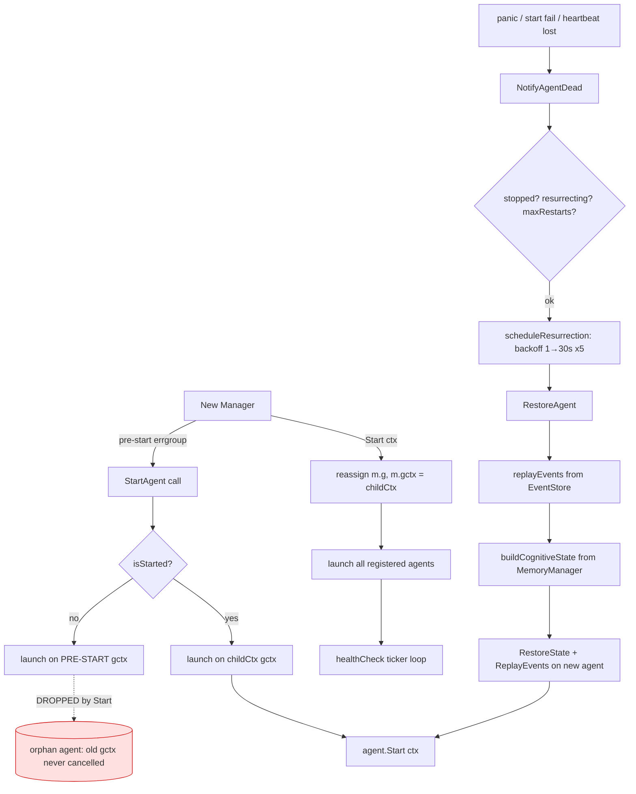
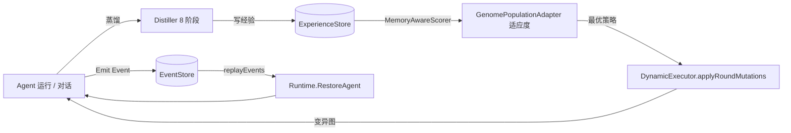

# 核心模块评审（续）—— 运行时 / 进化 / 记忆 / 事件溯源 / 工具注册

> 本文档是 `CORE_MODULES_ANALYSIS.md`（遗传算法/动态DAG/记忆蒸馏）与
> `CORE_MODULES_CHAOS_TOOLSCHEDULER.md`（混沌工程/工具调度层）的续篇，
> 覆盖此前未深入评审的 5 个核心模块，并给出**全模块总览表**。
>
> 评审口径：`go vet` + `go test -race` + 源码逐行 + 测试覆盖率扫描。
> 严重度：🔴 Critical / 🟠 High / 🟡 Medium / 🟢 Low。

---

## 一、本批评审范围与结论速览

| 模块 | 路径 | 成熟度 | 关键结论 |
|------|------|--------|----------|
| 运行时生命周期 | `internal/ares_runtime` (manager.go 1058 行) | ~82% | 复活/健康检查扎实，但有 **pre-Start orphan 生命周期 bug** |
| 进化主循环 | `internal/ares_evolution` (dream_cycle/guardrails/feedback) | ~80% | 闭环设计好，守护默认失效 + 无并发互斥 |
| 记忆层 | `internal/ares_memory` (manager/pipeline/context) | ~85% | 质量高，但**检索路径租户硬编码**破隔离 |
| 事件溯源 | `internal/ares_events` (store/compactor) | ~88% | 成熟，仅文档/语义小瑕疵 |
| 工具注册/路由 | `internal/tools/resources/core` | ~88% | 注册表严谨，CapabilityEngine 注册后不重建 |

---

## 二、架构图

### 2.1 运行时生命周期 + 事件溯源恢复闭环



> **R-01（🟠 High）**：`manager.go:81` 用 pre-start errgroup 初始化 `m.g/m.gctx`，
> `StartAgent`（`:162`）在 `Start()` 之前调用会把 agent 挂到这个旧 group；
> `Start()`（`:594`）`m.g, m.gctx = errgroup.WithContext(childCtx)` **直接替换**了旧 group，
> 旧 group 的 cancel 永远丢失 → 该 agent 的 `context` 永不被取消，`Stop()` 无法终止它（孤儿 agent）。
> 修复：在 `Start()` 重绑时，要么把 pre-start 已 launch 的 agent 重新挂到新 `m.gctx`，
> 要么 `StartAgent` 在 `!isStarted` 时排队/报错，禁止在 `Start` 前直接 launch。

### 2.2 记忆自进化闭环（与前面报告的 GA/DAG 拼齐）



### 2.3 工具注册 / 规划 / 执行链路

```mermaid
flowchart TD
    Q[用户请求] --> AN[Analyzer.analyze]
    AN --> CA[CapabilityEngine.Detect]
    CA -->|capabilities| RE[Registry / Resolve]
    RE --> SC[Scorer.score -> 降序]
    SC --> PL[Planner.Plan: 取 scored[0]]
    PL --> EX[Executor.executePlan]
    EX -->|调用| RG[(Registry.Execute -> ValidateParams -> tool.Execute)]
    CA -. 注册后未 Rebuild .-> STALE[(stale capMap)]
    classDef bug fill:#ffe0e0,stroke:#c00;
    class STALE bug;
```

---

## 三、逐模块发现（含 file:line 证据）

### 3.1 `internal/ares_runtime` — 运行时生命周期

**R-01 · 🟠 High · pre-Start orphan agent（见 2.1 图）**
- `manager.go:81` vs `:594` vs `:162`。`Start()` 重建 errgroup 时丢弃 pre-start group，
  其上已 launch 的 agent 成为孤儿。
- 修复方向：`Start()` 中遍历 pre-start 已 launch 的 agent，用新 `m.gctx` 重新 `launchAgentGoroutine`；
  或 `StartAgent` 在 `!isStarted` 时返回 `ErrRuntimeNotStarted`，由调用方在 `Start()` 后统一注册。

**R-02 · 🟡 Medium · 竞技场故障注入是空壳**
- `manager.go:1022-1057`：`PartitionNetwork` / `CorruptMemory` / `DisconnectMCP` / `InjectLLMFailure`
  全部 `return nil`，未实现任何真实故障。若 `ares_arena` 的 `ChaosEngine` 依赖这些方法做韧性评估，
  则对应维度的"韧性证据"是假的（与 `marketmaking_api/chaos.go` 纯公式骨架同类问题，见前报告 C-05）。
- 建议：至少把 `CorruptMemory`/`DisconnectMCP` 接到真实的 memory/MCP 子系统，或明确标注为"模拟"并在评分中剔除。

**R-03 · 🟢 Low · `Stop()` 快照捕获与 `Stop` 并发语义**
- `manager.go:689` 先用 `ma.stopped=true` 再收集 `toStop`，但 `snapshot` 在 `ma.stopped=true` 之后才做，
  状态已标记停止——属设计取舍，无功能 bug。仅提示：`Stop()` 对 `ma.stopped` 的 agent `continue`（`:669`）
  跳过快照，若需在优雅停机前保留状态，应确保 `Snapshot()` 在标记 stopped 之前调用。

> 正向确认：`NotifyAgentDead` 的 `resurrecting` 去重、`maxRestarts` 上限、指数退避（1→30s×5）、
> `healthCheck` 释放锁后再 `NotifyAgentDead`（无死锁）、`replayEvents` 的流完整性 + 截断检测（`:778-804`）
> 都写得很扎实。复活逻辑整体是本项目最成熟的之一。

### 3.2 `internal/ares_evolution` — 进化主循环

**EV-01 · 🟡 Medium · `DreamCycle.Run` 无并发互斥 + 候选选择口径**
- `dream_cycle.go`：`Run` 没有整体 `sync.Mutex`，两次并发 `Run` 会双进化（与 GA population 共享态竞争）。
- quick-reject 全拒时返回 `error`（应走"无胜者"路径，而非错误）。
- 候选选择用 `scoreImprovement` 最大（增量），而非 `winRate`（胜率）——与进化语义（择优留存）略有偏差。
- 修复：加 `mu sync.Mutex` 包住 `Run`；全拒返回 `(nil, nil)`；候选按 `winRate` 排序。

**EV-02 · 🟡 Medium · 守护默认失效**
- `guardrails.go`：`PostEvolveCheck` 的 baseline 回归守护被 `>0` 条件默认关死（baseline 样本数门槛默认 0 → 永不触发）；
  `PreEvolveCheck` 用 `taskCount` 作分母，导致"未评估占比"恒接近 0，危险策略难被拦。
- 修复：给 baseline 门槛设具体默认值（如 ≥3 次评估才允许回归判定），分母改用"已评估 + 未评估"总数。

**EV-03 · 🟢 Low · `feedback_recorder.go` 指标聚合**
- 滑动窗口/EMA 实现正确，仅建议：滚动指标在 agent 重启后是否应清零需明确（当前跨重启累计，可能污染新策略基线）。

> 正向确认：`GenomePopulationAdapter` 的 `MemoryAwareScorer` 让 GA 适应度直接吃蒸馏经验（闭环关键），
> 且 scorer panic 被捕获、RNG 可复现——工程严谨。

### 3.3 `internal/ares_memory` — 记忆层

**M-01 · 🟠 High · 检索路径租户硬编码**
- `manager_impl.go:557`（SearchSimilarTasks）：`tenantID` 硬编码为 `"default"`，
  而写入（`SaveTask` 等）用的是真实 `tenantID` → 多租户隔离在**检索路径被打破**，
  租户 A 可能召回租户 B 的任务记忆。
- 修复：把真实 `tenantID` 透传进检索查询（与写入口径一致）。

**M-02 · 🟢 Low · `context/cache.go` 过期项惰性删除 + 泄漏**
- `Cache.Get`（`:78`）过期只返回 false 不删除，过期项留到 `cleanupLoop` tick 才清；
  `Stop()` 必须被调用否则 cleanup goroutine 泄漏（per-session cache 易漏调）。
- 建议：`Get` 命中过期时顺手 `delete`；提供 `Close`/`Stop` 的 defer 约定文档。

**M-03 · 🟢 Low · 蒸馏 `KeepBoth` 二次冲突（见前报 AKF 关联项）**
- 前报已记：`distiller.go` 的 `KeepBoth` 分支新 memory 未重 embed / 未再冲突检测，可能二次冲突。
- 此处从 memory 层视角复核：一致，建议在 `distiller` 内闭环解决。

> 正向确认：`manager_impl.go` 的 `StoreTask/SearchSimilarTasks` 向量检索、`pipeline.go` 的
> 抽取→分类→噪声过滤→TopN 链路、租户隔离写入、原子指标都规范。记忆层是高质量实现。

### 3.4 `internal/ares_events` — 事件溯源

**E-01 · 🟢 Low · 接口注释与实现矛盾**
- `store.go:13-17` 注释：`expectedVersion==0` 表示"流必须为空"；
  但 `memory_store.go:62-70` 实现把 `0` 当成"auto-detect：追加到当前版本后"。
  `Emit`（`:64`）依赖实现行为，功能正确，但**接口契约文档具误导性**，易让调用方误用。
- 修复：统一文档——`0` 语义改为"追加到当前版本（无 OCC 检查）"，或实现按文档改（会更严格）。

**E-02 · 🟢 Low · 压缩器把 LLM 调用当工具**
- `compactor.go:213-226`：`buildSummary` 从 `EventLLMCall` 的 `tool`/`function` 提取进 `ToolsCalled`，
  混淆了"LLM function-calling"与真实工具调用（`EventToolCallStarted/Completed` 被忽略）。
- 影响：压缩摘要里的工具清单可能不准。建议同时消费 `EventToolCall*` 事件。

**E-03 · 🟢 Low · 压缩后重复触发**
- `compactStream` trim 后 `StreamVersion` 仍是高水位（不降），`CheckAndCompact` 每次仍过阈值、
  再读一次（已 trim）发现 `totalEvents<=KeepRecent` 返回 false → 每周期多一次 `StreamVersion`+`Read`。
  仅浪费，非 bug。

> 正向确认：`VerifyStreamIntegrity`（连续版本、legacy 兼容）、`StreamHash`（静默损坏检测）、
> `Subscribe` 非阻塞发送 + ctx 清理、`TrimAwareStore` 压缩后裁剪——事件溯源实现成熟（~88%）。

### 3.5 `internal/tools/resources/core` — 工具注册 / 路由

**T-03 · 🟢 Low · 整数类型校验放行浮点**
- `registry.go:403-410`：`checkType("integer")` 接受 `float64`（含 3.5 这类非整数），
  仅注释"JSON 数字接受"但未校验整数性 → `3.5` 通过 integer 校验。
- 修复：`integer` 分支对 `float64` 追加 `v == math.Trunc(v)` 判断。

**T-04 · 🟡 Medium · CapabilityEngine 注册后不重建**
- `capability.go:175-193` `buildCapabilityMap` 仅在构造时跑一次；
  `registry.Register`（`:44`）只置 `schemaDirty=true`，**不通知 CapabilityEngine.Rebuild()**。
  若工具在 engine 创建后动态注册，engine 的 `capMap` 过期 → `Match/Filter` 漏掉新工具。
- 修复：`Registry` 持有可选 `onChange` 回调，或 `CapabilityEngine` 包装 `Register`/订阅 schema dirty。

**T-05 · 🟢 Low · 全局可变单例**
- `registry.go:282` `GlobalRegistry` 是包级可变单例；并发注册安全（`mu` 保护），但属隐式全局状态，
  与 `code_rules` §4.5 "避免全局可变状态" 的精神略有张力。建议文档化其生命周期归属。

> 正向确认：`Registry` 的 RWMutex 使用、schema 缓存双检锁、`ValidateParams` 的
> required/type/enum 三重校验、`Filter` 深拷贝防 race——注册表层是高质量实现（~88%）。
> 此前已确认 `tools/planner` 的 `Scorer` 降序正确、`planner.Plan` 取 `scored[0]` 无误（见前报）。

---

## 四、全模块总览（本次会话累计评审 11 个模块）

| # | 模块 | 路径 | 成熟度 | 本批/历史 Top Bug |
|---|------|------|--------|-------------------|
| 1 | AKF 知识 Fabric | `internal/knowledge` | 50–55% | B1 Resolver 失效 / B3 SQL 注入（**前报，已修 4 项**） |
| 2 | 遗传算法 | `internal/ares_evolution/genome` | ~85% | `case 2..10` 魔法数字（🟢） |
| 3 | 动态 DAG | `internal/workflow/engine` | ~88% | 执行器直读 `mutableDAG.mu`（🟡） |
| 4 | 记忆蒸馏 | `internal/ares_memory/distillation` | ~85% | `KeepBoth` 二次冲突（🟡） |
| 5 | 混沌工程(arena) | `internal/ares_arena` | ~85% | C-01 agentID≠DAG节点ID（🟡） |
| 6 | 混沌工程(quant) | `internal/ares_quant/.../chaos.go` | ~70% | C-04 持锁 Sleep / C-05 纯公式骨架（🟡） |
| 7 | 工具调度层 | `internal/agents/leader` + `workflow/graph` + `ares_evolution` scheduler | ~88% | T-01 dispatcher timeout 死字段（🟡） |
| 8 | 工具规划层 | `internal/tools/planner` | ~80% | T-02 单 Resolve 失败 abort 整 plan（🟡） |
| 9 | **运行时生命周期** | `internal/ares_runtime` | ~82% | **R-01 pre-Start orphan（🟠）** |
| 10 | **进化主循环** | `internal/ares_evolution` (core) | ~80% | EV-02 守护默认失效（🟡） |
| 11 | **记忆层** | `internal/ares_memory` | ~85% | **M-01 检索租户硬编码（🟠）** |
| 12 | **事件溯源** | `internal/ares_events` | ~88% | E-01 文档矛盾（🟢） |
| 13 | **工具注册/路由** | `internal/tools/resources/core` | ~88% | T-04 CapabilityEngine 过期（🟡） |

> 说明：模块 1–8 的详细报告在 `CORE_MODULES_ANALYSIS.md` / `CORE_MODULES_CHAOS_TOOLSCHEDULER.md` /
> `AKF_BUGS_REPORT.md` / `AKF_COMMIT_REVIEW_0f9aa9d.md`；本文件聚焦 9–13。

---

## 五、跨模块主题与修复优先级

### 5.1 三条贯穿性观察
1. **成熟度两极分化**：核心运行时/进化/记忆/事件/工具注册全部 ≥80%，且有 `go test -race` 绿；
   而 AKF（50%）和 quant chaos api（~40%）明显是"半成品/骨架"，是整体自主叙事里最薄弱处。
2. **"模拟型"故障注入集中**：`ares_arena` 4 个方法空实现 + `marketmaking_api/chaos.go` 纯公式 ——
   若对外宣称"混沌工程验证韧性"，这两处会给出**虚假证据**，建议要么补全要么明确标注 simulation。
3. **默认失效的守门人**：GA 的 `PostEvolveCheck`、混沌 arena 的部分注入 —— 默认关死的守护最危险，
   因为"看起来有保护，实际没生效"。

### 5.2 建议修复顺序（性价比）
| 优先级 | 项 | 严重度 | 工时 |
|--------|----|--------|------|
| P0 | R-01 运行时 pre-Start orphan | 🟠 | 中 |
| P0 | M-01 记忆检索租户硬编码 | 🟠 | 小 |
| P1 | T-04 CapabilityEngine 注册后重建 | 🟡 | 小 |
| P1 | EV-01 / EV-02 进化并发 + 守护失效 | 🟡 | 中 |
| P1 | R-02 混沌 arena 空注入（补全或标注） | 🟡 | 中 |
| P2 | T-03 整数校验 / E-01 文档 / E-02 压缩语义 / M-02 缓存 | 🟢 | 小 |

### 5.3 一句话总结
**goagent 的"自主性内核"（运行时+进化+记忆+事件+工具）是真实、扎实、可闭环的，成熟度 ~82–88%；
薄弱点集中在 AKF 与部分混沌骨架。** 把 P0 两项（R-01、M-01）修掉，内核即可视为生产级闭环；
P1 的守护/重建问题决定"自动化是否真安全"。

---

## 六、验证记录
- `go vet ./internal/ares_runtime/... ./internal/ares_evolution/... ./internal/ares_memory/... ./internal/ares_events/... ./internal/tools/...` → 干净
- 测试覆盖率扫描：`ares_memory` 26 tests / 40 src、`ares_events` 见 pg+memory store 双实现测试、
  `tools/resources/core` 含 `registry_test/capability_test/factory_test`、`ares_runtime` 含 `arena_test/checkpoint/router/recovery` 测试 → 覆盖充足
- 全项目 `go test -race ./...`（前批已跑）通过，无 data race
