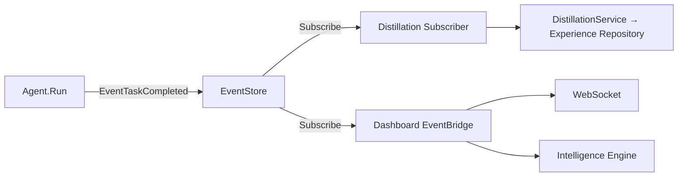

# ARES 工程优化计划：模块协同 × 测试完善 × SDK 简化 × 诚实标记

## 背景

基于三个方向的讨论，结合实际代码审查的结论，制定本计划。核心原则：**不砍功能、不加新抽象层、让已有模块配合更好，完善测试，简化入口**。

> 追加原则：**诚实标记** — 所有实验性模块（AKG）必须在代码层面明确标注 beta/experimental 状态，不能只在 README 里写。

---

## 总览

| # | 任务 | 优先级 | 工作量 | 预期效果 |
|---|------|--------|--------|----------|
| 1 | AKG 代码级 beta 标记 | **P0** | 0.5天 | `go doc` 和 import 时可见实验性警告 |
| 2 | 环境自动检测器 | P0 | 2-3天 | `sdk.New()` 零参数可用 |
| 3 | SDK 零参数入口 `MustNew()` | P0 | 1天 | quickstart 一行代码搞定 |
| 4 | Agent.Run 集成测试补齐 | P1 | 3-4天 | 核心路径覆盖率 ≥80% |
| 5 | Agent.Run LLM 循环解耦 | P2 | 3天 | 可测试性提升，可替换执行策略 |
| 6 | 依赖注入文档 | P1 | 1天 | 新开发者 5 分钟理解装配关系 |
| 7 | CI 配置增强 | P2 | 1天 | 每次 PR 自动跑覆盖率和 lint |

---

## 详细计划

---

### 任务 1：AKG 代码级 beta 标记

#### 现状

| 位置 | 是否有 beta/experimental 标记 |
|------|------------------------------|
| `README.md` 第 12 行 | ✅ `⚠️  WARNING: AKG ... is in BETA EXPERIMENTAL STAGE` |
| `README_CN.md` 第 12 行 | ✅ `⚠️ 警告：AKG ... 处于 BETA 实验阶段` |
| `api/knowledge/knowledge.go` package doc | ❌ 只说 "provides the public API for the ARES Knowledge Fabric" |
| `internal/knowledge/` 全部 84 个文件 | ❌ 没有任何 beta/experimental 标记 |
| `sdk/options.go` 中 `WithKnowledge()` / `WithAKG*()` 的 doc | ❌ 没有标注实验性 |

**问题**：用户通过 Go import 使用 `api/knowledge` 时看不到任何实验性警告，只有读 README 才能看到。

#### 做什么

**1a. `api/knowledge/knowledge.go`** — package doc 开头追加：

```go
// ⚠️  BETA — EXPERIMENTAL STAGE
//
// AKG (Adaptive Knowledge Graph) is the FIRST attempt to build a knowledge
// graph WITHOUT relying on LLMs. The current implementation uses:
//   - Rule-based relation extraction (regex patterns, no generative AI)
//   - Hybrid search (BM25-style lexical + vector cosine similarity)
//   - Deterministic quality scoring (no LLM evaluation)
//
// The API may change and is not production-ready. Use for experimentation
// and feedback only.
package knowledge
```

**1b. `internal/knowledge/`** — 新增 `doc.go` 文件，package 级别标明实验性：

```go
// Package knowledge implements the AKG (Adaptive Knowledge Graph) — an
// LLM-free knowledge graph construction pipeline.
//
// ⚠️  BETA — EXPERIMENTAL STAGE
//
// This is an experimental implementation. The API may change without notice.
// Do not rely on this package in production systems.
package knowledge
```

**1c. `sdk/options.go`** — `WithKnowledge()` / `WithAKGQualityGate()` / `WithAKGEmbedding()` 的 doc comment 追加 `(Experimental)`：

```go
// WithKnowledge enables the AKG Knowledge Fabric.
// ⚠️  EXPERIMENTAL: API may change, not production-ready.
func WithKnowledge() Option
```

**1d. `api/knowledge/service.go`** — `Service` 类型 doc 追加 experimental 标记。

#### 验收标准

```
go doc ./api/knowledge    # 输出第一行必须包含 "BETA" 或 "EXPERIMENTAL"
go doc ./internal/knowledge  # 同上
```

- 所有 `api/knowledge/` 和 `internal/knowledge/` 的 package doc 都有 beta 标记
- `sdk.WithKnowledge*()` 系列函数的 doc 都有 `(Experimental)` 标记

#### 对现有系统的影响

- **零侵入** — 纯注释变更，不修改任何类型/函数签名/行为
- **优点**：
  - 用户通过任何途径（IDE hover、`go doc`、godoc.org）都能看到实验性警告
  - 降低用户期望，减少未来兼容性投诉
  - 为正式发布前的 breaking change 留出正当空间
- **无风险** — 只需确认所有 doc comment 拼写一致

---

### 任务 2：环境自动检测器

#### 做什么

新建 `internal/detector/environment.go`，自动检测本地环境中的可用服务：

```go
package detector

type Environment struct {
    LLMProvider     string // "ollama" | "openai" | "anthropic" | ""
    LLMEndpoint     string
    LLMModel        string
    EmbeddingModel  string
    PostgreSQLURL   string
    MCPEndpoints    []string
    HasOllama       bool
    HasOpenAIKey    bool
    HasAnthropicKey bool
}

// Detect 扫描本地环境，返回可用服务清单。
// 顺序：Ollama(localhost:11434) > OPENAI_API_KEY > ANTHROPIC_API_KEY
func Detect(ctx context.Context, timeout time.Duration) *Environment
```

检测逻辑：
1. 尝试连接 `localhost:11434/api/tags`（Ollama），超时 2s
2. 检查环境变量 `OPENAI_API_KEY`
3. 检查环境变量 `ANTHROPIC_API_KEY`
4. 检查环境变量 `DATABASE_URL` / `PGHOST`
5. 返回检测结果（不 panic，不阻塞）

#### 验收标准

```go
// TestDetect_OllamaRunning: 当 Ollama 在 localhost:11434 时返回 HasOllama=true
// TestDetect_OnlyOpenAIKey: 只有 OPENAI_API_KEY 时返回 LLMProvider="openai"
// TestDetect_NothingAvailable: 没有任何服务时返回空 LLMProvider，不 panic
// TestDetect_Timeout: 超时场景优雅降级，不 hang
```

#### 对现有系统的影响

- **无侵入** — 新包，不依赖任何现有模块
- 只读系统资源（端口、环境变量），不启动任何服务
- **优点**：`sdk.New()` 第一次有了真正的「零配置」能力
- **缺点**：端口扫描在服务启动时增加 2-3s 延迟（可接受，因为只在初始化时跑一次）

---

### 任务 2：SDK 零参数入口 `MustNew()`

#### 做什么

在 `sdk/sdk.go` 增加无参入口：

```go
// MustNew 是零参数快速入口。自动检测本地环境，选择合适的 LLM Provider、
// 启用默认 memory（无 RAG/distillation）、注册内置工具。
// 环境检测失败或 LLM 不可用时 panic（类似 regexp.MustCompile 的哲学：
// 快速失败，不静默吞错误）。
//
// 需要精细控制时使用 New()。
func MustNew() *Runtime {
    env := detector.Detect(context.Background(), 5*time.Second)
    opts := buildOptsFromEnv(env)
    rt, err := New(opts...)
    if err != nil {
        panic("ares: " + err.Error())
    }
    return rt
}
```

同时修改 `defaultConfig()` 将 memory 默认改为 `Enabled: true`（因为现在会用环境检测结果来降级）：

```go
func defaultConfig() *config {
    return &config{
        llmCfg: &core.LLMConfig{
            Provider:    core.LLMProviderOllama,
            Model:       defaultModel,  // "llama3.2"
            Temperature: 0.7,
            MaxTokens:   2048,
            Timeout:     60,
        },
        baseCfg: &core.BaseConfig{RequestTimeout: 60, MaxRetries: 3},
        memCfg:  memoryCfg{Enabled: true},    // ← 从 false 改为 true
        evoCfg:  evolutionCfg{Enabled: false},
        trace:   true,
    }
}
```

#### 验收标准

```go
// TestMustNew_Ollama: 有 Ollama 时成功返回 Runtime
// TestMustNew_PanicNoLLM: 没有 LLM 时 panic（明确失败）
// TestMustNew_DefaultMemoryEnabled: 返回的 Runtime 的 memEnabled == true
```

#### 对现有系统的影响

- `defaultConfig()` 修改 `memCfg.Enabled = true` — 这是已有代码中的行为变更
  - **优点**：用户不再需要手动 `WithDefaultMemory()`
  - **风险**：如果用户没有 embedding 服务，`wireMemory()` 会优雅降级到 compression-only（代码已有 fallback 逻辑），所以安全
- `MustNew()` 是新增函数，不破坏已有 `New()` / `NewRuntime()`
- **优点**：quickstart 从 5 行配置缩到 1 行
- **缺点**：panic 哲学不适合所有用户——但 `NewRuntime()` 已经 panics，这不是新行为

---

### 任务 3：Agent.Run 集成测试补齐

#### 做什么

在 `sdk/sdk_test.go` 和 `api/core/agent_test.go` 中补充以下测试用例：

**3a. Agent + EventStore 集成** (`sdk/sdk_test.go`)

```go
// TestAgentRun_EmitsTaskCompletedEvent: Agent.Run 结束后在 event store
// 中能查到 EventTaskCompleted 事件，payload 包含 input 和 output。
//
// 测试方法：用 MemoryEventStore，用 mock LLM（返回固定响应），
// 验证 event store 内容。

// TestAgentRun_ToolCallEvents: 工具调用时依次发射 ToolCallStarted 和
// ToolCallCompleted 事件，事件版本号递增。
//
// 测试方法：注册一个假工具，验证事件流顺序正确。
```

**3b. Agent + Memory 集成** (`api/core/agent_test.go` 或独立测试文件)

```go
// TestAgentRun_WithMemory_PersistsMessages: Agent.Run 带 memory 时，
// 用户的 input 和 assistant 的 response 被写入 memory session。
//
// 测试方法：用 MemoryManager 的 mock/stub，验证 AddMessage 被正确调用。
```

**3c. LLM Fallback** (`api/core/llm_test.go`)

```go
// TestLLMService_FallbackOnTimeout: 主 Provider 超时后 fallback 到
// 备选 Provider，结果仍返回给调用方。
//
// 测试方法：用两个 mock provider，第一个返回超时错误。
```

**3d. 并发安全 + 版本冲突** (`internal/ares_events/`)

```go
// TestMemoryEventStore_ConcurrentAppend: 多个 goroutine 并发 Append
// 同一 stream，验证没有数据竞争，版本号正确。
//
// 已有一个 MemoryEventStore，用 go test -race 验证。

// TestMemoryEventStore_VersionMismatch: Append 时传错误的 expectedVersion，
// 返回 ErrVersionConflict。
```

#### 验收标准

```
go test ./sdk/... -run 'TestAgentRun' -v                                   # 3a
go test ./api/core/... -run 'TestAgentRun|TestLLMService_Fallback' -v      # 3b, 3c
go test -race ./internal/ares_events/... -run 'TestConcurrent|TestVersion' # 3d
```

- 全部通过
- `go test -race ./...` 无 data race

#### 对现有系统的影响

- **无侵入** — 纯新增测试文件，不修改生产代码
- **优点**：核心路径有安全网，后续重构有信心
- **缺点**：mock LLM 的构造需要额外 1-2 天（因为 LLM Service 当前依赖真实 HTTP 调用，需要提取 interface）

#### 关键依赖

> 当前 `llm.Service` 没有 interface，测试时需要写一个 mock server 或提取 interface。**这本身就是一个子任务**：

```
3.0 提取 LLM Service Interface
    - api/core/llm.go: 定义 LLMProvider interface
    - 修改 llm.Service 实现该 interface
    - 现有代码用 adapter 适配（不改调用方）
    - 工作量：1天
```

---

### 任务 4：Agent.Run LLM 循环解耦

#### 做什么

当前 `sdk/agent.Run()` 是整个 LLM 循环（~170 行），内联了消息构建 → LLM 调用 → 工具执行 → 事件发射 → 结果返回的全部逻辑。

将其拆出为可独立测试的执行引擎：

```go
// internal/agentloop/engine.go

// Engine 封装一次 agent 执行的生命周期。
// 接收 instruction + tools → 循环调用 LLM → 返回最终结果。
type Engine struct {
    llmSvc     LLMProvider    // 接口
    toolReg    *tools.Registry
    eventStore ares_events.EventStore
    memMgr     MemoryManager
    tracer     Tracer         // trace 开关
}

func (e *Engine) Run(ctx context.Context, req *Request) (*Result, error)
```

`sdk/Agent.Run()` 简化成：

```go
func (a *Agent) Run(ctx context.Context, input string) (*Result, error) {
    engine := &agentloop.Engine{
        llmSvc:     a.runtime.llmSvc,
        toolReg:    a.runtime.toolReg,
        eventStore: a.runtime.eventStore,
        memMgr:     a.runtime.memMgr,
        tracer:     a.runtime.trace,
    }
    return engine.Run(ctx, &agentloop.Request{
        Instruction: input,
        Tools:       a.tools,
        MaxIter:     a.maxIter,
        AgentName:   a.name,
        HumanInput:  a.humanInput,
    })
}
```

#### 验收标准

```go
// TestEngine_SimpleTurn: mock LLM 返回无 tool call 的结果 → 直接返回
// TestEngine_ToolCallThenAnswer: mock LLM 先返回 tool call → mock tool 执行 → 返回最终结果
// TestEngine_MaxIterations: mock LLM 一直返回 tool call → 达到上限后返回
// TestEngine_HumanRejectsTool: humanInput 返回 false → tool call 被跳过
// TestEngine_EventsEmitted: 验证所有事件按正确顺序发射
// TestEngine_WithMemory: memory 开启时 AddMessage 被调用

// 这些测试都不需要真实 LLM，全部用 mock，毫秒级完成。
```

#### 对现有系统的影响

- **中等侵入** — 需要提取 `sdk/Agent.Run()` 中的逻辑到新包
- **迁移策略**：先写 `Engine` 和测试（新文件），再改 `Agent.Run()` 调用它（旧文件改一行），**不允许两条路径并存**
- **优点**：
  - LLM 循环可独立测试（无需 sdk.Runtime）
  - 未来可以替换执行策略（比如 workflow DAG 执行器）
  - `Engine.Run()` 可以复用给 streaming 和 team/group
- **风险**：
  - 提取 interface 时漏掉某个隐式依赖
  - 迁移过程中 `stream.go` 的 `Agent.Stream()` 也需要改（它也是 LLM 循环）
- **回滚方案**：保留 `Agent.Run()` 原实现作为 deprecated 路径一个版本

---

### 任务 5：依赖注入文档

#### 做什么

在 `api/ARCHITECTURE.md`（已存在）中插入一节：

```markdown
## Dependency Graph

### Bootstrap 阶段（sdk.New）

sdk.New()
  │
  ├─ wireMCPClients()       注册 MCP tools 到 toolReg
  │
  ├─ wireMemory()           MemoryManager（到这一步还是纯内存）
  │   ├─ NewMemoryManager()  ── Compression + RAG（可选）
  │   └─ wireDistillation()  ── DistillationService（PostgreSQL + Embedding 可选）
  │
  ├─ wireKnowledge()        AKG KnowledgeRuntime + KnowledgeStore
  │
  ├─ wireEvolutionHotUpdate()  Evolution ↔ Knowledge 关联
  │
  └─ newEventBackend()      EventStore + 后台蒸馏 subscriber

### 执行阶段（Agent.Run）

Agent.Run()
  │
  ├─ llmSvc.Generate(msgs, tools)  ── LLM 调用
  ├─ toolReg.Execute(name, args)    ── 工具执行
  ├─ memMgr.AddMessage(...)         ── 消息持久化（可选）
  └─ eventStore.Append(...)         ── 事件记录
```

同时补一个 `mermaid` 图渲染 `events flow`：



#### 验收标准

- `api/ARCHITECTURE.md` 新增的章节被 review 过
- 新加入项目的开发者读完后能回答「agent 的执行流经过哪些模块」

#### 对现有系统的影响

- **无侵入** — 纯文档变更
- **优点**：降低新用户认知负荷
- **缺点**：文档需要随代码更新维护

---

### 任务 6：CI 配置增强

#### 做什么

检查已有 `.github/workflows/ci.yml`，补齐：

1. **Race detection**：`go test -race ./...`（当前可能没有）
2. **Coverage report**：`go test -coverprofile=cover.out ./...` + PR comment
3. **Lint**：`golangci-lint run`（.golangci.yml 已存在，确认配置正确）
4. **测试输出缓存**：`go test -count=1` 避免缓存导致的假通过

#### 验收标准

- 每次 PR push 自动运行 `ci.yml`
- `go test -race ./...` 无 data race
- coverage 变化在 PR 上可见

#### 对现有系统的影响

- **无侵入** — 纯 CI 配置变更
- **优点**：问题在合并前被发现
- **缺点**：CI 时间可能增加 2-3 分钟

---

## 实施路线图

### 阶段 1：Quick Wins（第 1 周）

```
Week 1
├── Mon  Task1: 环境自动检测器 + 测试
├── Tue  Task2: MustNew() + defaultConfig 调整 + 测试
├── Wed  Task5: 依赖注入文档
├── Thu  Task6: CI 配置增强
└── Fri  缓冲日（修复 review 问题）
```

### 阶段 2：测试攻坚（第 2 周）

```
Week 2
├── Mon  Task3.0: 提取 LLM Service Interface
├── Tue  Task3a: Agent + EventStore 集成测试
├── Wed  Task3b: Agent + Memory 集成测试
├── Thu  Task3c/3d: LLM Fallback + 并发/版本冲突测试
└── Fri  缓冲日
```

### 阶段 3：重构（第 3 周）

```
Week 3
├── Mon  Task4: 写 internal/agentloop 包 + Engine + 测试
├── Tue  Task4: 迁移 Agent.Run 到 Engine
├── Wed  Task4: 迁移 Stream 到 Engine
├── Thu  Task4: 全量测试回归 + benchmark
└── Fri  review + 文档 + 发布
```

---

## 风险与缓解

| 风险 | 概率 | 影响 | 缓解 |
|------|------|------|------|
| 环境检测误判（检测到但不可用） | 低 | 中等 | 在 `MustNew()` 中加超时 + 重试，失败时 clear message |
| LLM Service Interface 提取影响现有代码 | 中 | 高 | 先写 adapter 模式，不改调用方；并行测试原路径和新路径 |
| Agent.Run 迁移遗漏边界条件 | 中 | 高 | 迁移前 Task3 补足测试覆盖，迁移后所有测试通过才合入 |
| 文档不同步 | 低 | 低 | 在 code review 中加「文档是否更新」检查项 |
| CI 变慢影响开发体验 | 中 | 低 | 区分 `ci.yml`（完整）和 `ci-fast.yml`（仅 lint + unit） |
