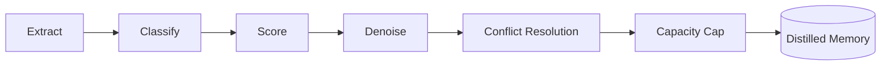

# GoAgent

```shell

   >===>                            >>                                       >=>   
 >>    >=>                         >>=>                                      >=>   
>=>            >=>                >> >=>        >=>      >==>    >==>>==>  >=>>==> 
>=>          >=>  >=>  >====>    >=>  >=>     >=>  >=> >>   >=>   >=>  >=>   >=>   
>=>   >===> >=>    >=>          >=====>>=>   >=>   >=> >>===>>=>  >=>  >=>   >=>   
 >=>    >>   >=>  >=>          >=>      >=>   >=>  >=> >>         >=>  >=>   >=>   
  >====>       >=>            >=>        >=>      >=>   >====>   >==>  >=>    >=>  
                                               >=>                                 
```


Go-based multi-agent framework with DAG workflow orchestration, memory distillation, and AHP inter-agent protocol.

## Architecture 

```mermaid
graph TB
    User[User Request] --> Leader

    subgraph Agent System
        Leader[Leader Agent]
        Leader -->|AHP Protocol| SubA[Sub Agent A]
        Leader -->|AHP Protocol| SubB[Sub Agent B]
        Leader -->|AHP Protocol| SubC[Sub Agent C]
        Leader -.->|Checkpoint Recovery| Supervisor[Supervisor]
    end

    subgraph Workflow Engine
        MutableDAG[MutableDAG]
        DynamicExec[DynamicExecutor]
        MutableDAG --> DynamicExec
        DynamicExec --> TopoSort[Topological Sort]
        DynamicExec --> CycleDetect[Cycle Detection]
    end

    subgraph Memory Manager
        Session[Session Memory]
        Task[Task Memory]
        Distilled[Distilled Memory]
        Session --> Pipeline[Distillation Pipeline]
        Task --> Pipeline
        Pipeline --> Distilled
    end

    subgraph Storage Layer
        VS["VectorStore Interface"]
        PG[(PostgreSQL + pgvector)]
        MEM[(In-Memory)]
        QD[(Qdrant)]
        SQL[(SQLite + sqlite-vec)]
        CUSTOM[(Your Backend)]
        Cache[Cache]
        CB[Circuit Breaker]
        VS --> PG
        VS --> MEM
        VS --> QD
        VS --> SQL
        VS --> CUSTOM
        PG --> Cache
        Cache --> CB
    end

    subgraph Tool System
        Registry[Tool Registry]
        Matcher[Capability Matcher]
        Validator[Parameter Validator]
    end

    Leader --> Workflow Engine
    Leader --> Memory Manager
    Leader --> Tool System
    Memory Manager --> Storage Layer
    Tool System --> Storage Layer
```

### Memory Distillation Pipeline / 记忆蒸馏管线



6-step pipeline: extract experiences from raw interactions, classify by type, score relevance, filter noise, resolve conflicts with existing memories, and enforce capacity limits.

### AHP Protocol

Custom Agent Hosting Protocol handling inter-agent communication with heartbeat monitoring, dead-letter queue (DLQ), and progress tracking. All protocol operations benchmark under 1 us.

### Leader Failover

Checkpoint-based recovery. Supervisor detects leader failure, recovers stale tasks from last checkpoint, and reassigns work to available sub-agents.

## Key Features

**DAG Workflow Engine**
- MutableDAG: runtime graph mutation (add/remove nodes and edges) all under 1 us
- DynamicExecutor: executes DAG with topological sort
- Incremental cycle detection on edge insertion
- Hot reload and runtime mutation without stopping execution

**Memory System**
- Session memory: short-term conversation context
- Task memory: per-task working memory
- Distilled memory: long-term compressed knowledge via 6-step pipeline
- pgvector-backed semantic search

**Storage Layer**
- Pluggable vector store interface — swap PostgreSQL for Qdrant, Milvus, SQLite, or your own backend
- Built-in implementations: PostgreSQL + pgvector (production), in-memory (dev/test)
- Repository pattern abstraction
- Built-in cache layer + circuit breaker for fault tolerance
- See [Custom Vector Store Guide](docs/en/development/custom-vector-store.md)

**Agent System**
- Leader/Sub agent architecture
- AHP protocol for structured communication (heartbeat, DLQ, progress)
- Leader failover with checkpoint recovery
- Parallel task execution with configurable concurrency

**Tool System**
- Dynamic tool registration and discovery
- Capability matching between agents and tools
- Parameter validation with schema support

## Benchmark Highlights

54 benchmarks total. 589 tests pass with `-race`.

Platform: darwin/arm64, Apple M3 Max, Go 1.26.4

| Category | Count | Hot (< 1 us) | Normal (1-100 us) | Cold (> 100 us) |
|----------|-------|---------------|--------------------|--------------------|
| Eval | 5 | 2 | 2 | 1 |
| Distillation | 8 | 3 | 3 | 2 |
| Tools/Core | 8 | 4 | 3 | 1 |
| Errors | 4 | 4 | 0 | 0 |
| Handler | 3 | 1 | 2 | 0 |
| Workflow Engine | 12 | 8 | 3 | 1 |
| AHP Protocol | 6 | 4 | 2 | 0 |
| Leader Agent | 8 | 5 | 2 | 1 |
| **Total** | **54** | **31** | **17** | **6** |

Selected hot-path results:

| Operation | ns/op | allocs/op |
|-----------|-------|-----------|
| ExactMatchEvaluator | 3.13 | 0 |
| ToolExecution | 15.21 | 0 |
| ResultCreation | 0.27 | 0 |
| ParameterValidation | 7.40 | 0 |
| ConflictDetection | 1,181 | 0 |
| MutableDAG_RemoveEdge | ~200 | 1 |
| MutableDAG_Version | ~10 | 0 |
| AHP NewMessage | ~200 | 2 |
| AHP QueueEnqueue | ~300 | 1 |
| AHP HeartbeatMonitor_Record | ~100 | 1 |

31 of 54 benchmarks run under 1 us. Zero-allocation paths for evaluation, tool execution, result creation, and conflict detection.

Full benchmark report: `benchmarks/benchmark_report.md`

## Quick Start

### Prerequisites

- Go 1.26+
- PostgreSQL 15+ with pgvector (optional, for persistence)
- Docker (optional, for database)

### 1. Set API Key

```bash
export OPENROUTER_API_KEY="your-api-key"
```

### 2. Start Database (Optional)

```bash
docker run -d \
  --name goagent-db \
  -e POSTGRES_PASSWORD=postgres \
  -e POSTGRES_DB=goagent \
  -p 5433:5432 \
  pgvector/pgvector:pg15
```

### 3. Run Examples

```bash
# Travel planning (multi-agent collaboration)
cd examples/travel && go run main.go

# Knowledge base Q&A (requires database + embedding service)
cd examples/knowledge-base
go run main.go --save README.md   # Import document
go run main.go --chat              # Start Q&A
```

### 4. Run Tests

```bash
go test ./...                      # All tests
go test -race ./...                # With race detector
go test -bench=. ./...             # Benchmarks
```

## Project Structure

```
goagent/
├── internal/
│   ├── agents/          # Leader/Sub agent system
│   ├── protocol/ahp/    # AHP inter-agent protocol
│   ├── memory/          # Memory system + distillation
│   ├── workflow/engine/  # DAG workflow engine
│   ├── storage/          # VectorStore interface + implementations
│   │   ├── postgres/     # PostgreSQL + pgvector (production)
│   │   └── memory/       # In-memory (dev/test)
│   └── tools/           # Tool registry and invocation
├── services/embedding/  # Embedding gateway (FastAPI + Ollama)
├── examples/            # Travel, knowledge-base, simple demos
├── api/                 # Service interfaces and client
└── benchmarks/          # Benchmark reports and logs
```

## Configuration

Configuration is YAML-based. Key sections:

```yaml
llm:
  provider: openrouter
  api_key: "${OPENROUTER_API_KEY}"
  model: meta-llama/llama-3.1-8b-instruct
  timeout: 60

agents:
  leader:
    id: leader-main
    max_steps: 10
    max_parallel_tasks: 4
  sub:
    - id: agent-a
      type: research
      max_retries: 3
      timeout: 30

storage:
  type: postgres
  host: localhost
  port: 5433
  database: goagent
  pgvector:
    enabled: true
    dimension: 1024

memory:
  enabled: true
  enable_distillation: true
  distillation_threshold: 3
```

See `examples/travel/config.yaml` for a complete example.

## Tech Stack

| Component | Technology |
|-----------|-----------|
| Language | Go 1.26+ |
| Database | PostgreSQL 15+ with pgvector (pluggable: Qdrant, Milvus, SQLite, or custom) |
| Protocol | Custom AHP (Agent Hosting Protocol) |
| Embedding | FastAPI + Ollama/SentenceTransformers |
| Cache | Redis |
| Concurrency | errgroup, sync |

## Documentation

- [Architecture](docs/en/architecture/arch.md)
- [Quick Start](docs/en/guides/quick-start.md)
- [FAQ / 常见问题](docs/en/guides/faq.md)
- [Integration Guide](docs/en/development/integration-guide.md)
- [Custom Vector Store](docs/en/development/custom-vector-store.md)
- [Leader Failover](docs/en/features/leader-failover.md)
- [Dynamic Graph](docs/en/features/dynamic-graph.md)
- [Framework Comparison](docs/en/framework-comparison.md)
- [Benchmark Report](benchmarks/benchmark_report.md)

## LICENSE
Apache 2.0