```shell
           _____  ______  _____ 
     /\   |  __ \|  ____|/ ____|
    /  \  | |__) | |__  | (___  
   / /\ \ |  _  /|  __|  \___ \ 
  / ____ \| | \ \| |____ ____) |
 /_/    \_\_|  \_\______|_____/ 

```

**ARES** — Agent Runtime & Evolution System.

Build resilient, self-evolving AI agents in Go. Unified SDK, DAG workflow, chaos engineering, MCP support.

**Runtime Evolution**: ARES continuously evolves its DAG topology, scheduler, knowledge planner, and recovery strategies — all in production, without restarts. LLM is a participant in evolution, not the leader.

## Quick Start

```go
package main

import "github.com/Timwood0x10/ares/sdk"

func main() {
    rt := sdk.MustNew(sdk.WithOllama("llama3.2"))
    defer rt.Close()

    agent := rt.NewAgent("assistant")
    result, _ := agent.Run(ctx, "Say hello")
    println(result.Output)
}
```

Install the CLI:

```bash
go install github.com/Timwood0x10/ares/cmd/ares@latest
ares doctor
ares run -c ares.yaml "What is Go?"
```

Or run examples directly:

```bash
git clone https://github.com/Timwood0x10/ares
cd ares
make quickstart        # go run examples/quickstart
make examples          # build all 24 examples
```

## Features

| Feature | Description |
|---|---|
| **Unified SDK** | Single `sdk.MustNew()` API for LLM, tools, memory, evolution |
| **Runtime Evolution** | Genome + Diff Engine + Coordinator evolve DAG, scheduler, planner, recovery in production |
| **Strategy GA** | Population-based strategy optimization — NSGA-II multi-objective, steady-state, uniform/two-point/segment crossover, 6 mutation types |
| **Evidence-Driven** | Every runtime event (flight, chaos, fitness) feeds into evolution decisions |
| **DAG Workflow** | Dynamic graphs with conditional branching and recovery |
| **Chaos Resilient** | Fault injection, failover, survival testing, self-healing |
| **Memory** | Session context, task distillation, vector similarity search |
| **MCP Ready** | Connect any Model Context Protocol server for tools and data |
| **Multi-Agent** | Leader/sub orchestration with automatic failover |
| **Observability** | OpenTelemetry traces, structured logs, Prometheus metrics |

## CLI

```bash
ares serve              # Start full agent monitoring (LLM + MCP + dashboard)
ares agent list         # List all registered agents
ares arena run/validate/list/serve/survival/inspect  # Chaos engineering scenarios
ares evolution run/status         # Runtime evolution
ares flight inspect/replay        # Inspect and replay task recordings
ares workflow run <id> <input>    # Execute a workflow
ares knowledge build <goal>       # Build a knowledge graph (via HTTP API)
ares mcp-null serve     # Start minimal MCP null server (stdio)
ares db migrate/setup-test/create-table/check-rls  # Database management
ares init               # Scaffold a new project (main.go + ares.yaml)
ares run                # Run agent from config file
ares bench              # Quick performance benchmark
ares doctor             # Diagnose environment (LLM key, Ollama, Git)
ares version            # Show version
```

## SDK

```go
rt := sdk.MustNew(
    sdk.WithOpenAI("gpt-4o-mini"),          // or WithOllama, WithAnthropic
    sdk.WithDefaultMemory(),                 // session history
    sdk.WithEvolution(),                     // strategy evolution
    sdk.WithMCP(sdk.MCPConn{                 // MCP server tools
        Name: "my-server", Command: "/path/to/server", Args: []string{"serve"},
    }),
)
defer rt.Close()

// Agent with tools and human-in-the-loop.
agent := rt.NewAgent("assistant",
    sdk.WithInstruction("You are helpful."),
    sdk.WithTools(calculatorTool, weatherTool),
    sdk.WithHumanInput(approveFn),
)
result, _ := agent.Run(ctx, "Calculate 15*23")

// Streaming response.
ch, _ := agent.Stream(ctx, "Tell me a story")
for chunk := range ch { fmt.Print(chunk.Content) }

// Multi-agent team.
team := rt.NewTeam("project", leaderAgent, []*Agent{memberAgent})
teamResult, _ := team.Run(ctx, "Research and write")
```

See [examples/README.md](examples/README.md) for 9 hands-on examples.

## Articles

Deep dives into ARES internals:

| English | 中文 |
|---|---|
| [Architecture](docs/articles/en/architecture-overview-deep-dive.md) | [架构](docs/articles/zh/architecture-overview-deep-dive.md) |
| [Evolution](docs/articles/en/autonomous-evolution-deep-dive.md) | [进化](docs/articles/zh/autonomous-evolution-deep-dive.md) |
| [MCP Integration](docs/articles/en/mcp-integration-deep-dive.md) | [MCP 集成](docs/articles/zh/mcp-integration-deep-dive.md) |
| [Workflow Engine](docs/articles/en/workflow-engine-deep-dive.md) | [工作流引擎](docs/articles/zh/workflow-engine-deep-dive.md) |
| [Memory & Distillation](docs/articles/en/memory-distillation-deep-dive.md) | [记忆与蒸馏](docs/articles/zh/memory-distillation-deep-dive.md) |
| [Chaos Arena](docs/articles/en/arena-fault-injection-deep-dive.md) | [混沌测试](docs/articles/zh/arena-fault-injection-deep-dive.md) |

## Architecture

```mermaid
graph TB
    User["User / CLI"] --> SDK

    subgraph sdk ["SDK Layer (sdk/)"]
        RT["Runtime<br/>MustNew / New"]
        A["Agent<br/>Run / Stream"]
        T["Team<br/>Multi-Agent"]
        CFG["Config<br/>YAML + Options"]
    end

    SDK --> LLM
    SDK --> Tools
    SDK --> Memory
    SDK --> Evo

    subgraph LLM ["LLM Providers"]
        OAI["OpenAI"]
        OLL["Ollama"]
        ANTH["Anthropic"]
        OR["OpenRouter"]
    end

    subgraph Tools ["Tool System"]
        BT["Built-in<br/>calculator, web_search..."]
        MCP["MCP Servers<br/>Stdio / SSE"]
        CT["Custom Tools<br/>ToolFunc"]
    end

    subgraph Memory ["Memory"]
        SES["Session Context"]
        DIST["Task Distillation"]
        VEC["Vector Search"]
    end

    subgraph Evo ["Evolution"]
        GA["Genetic Algorithm"]
        NSGA["NSGA-II / Steady-State"]
        CROSS["Uniform / Two-Point / Segment"]
        MUT["6 Mutation Types"]
        SCORE["Experience-Guided Scoring"]
    end

    subgraph RuntimeEvo ["Runtime Evolution"]
        GENOME["Genomes<br/>Workflow / Scheduler / Knowledge / Recovery"]
        DIFF["Diff Engine"]
        COORD["Coordinator"]
        LLM_ADAPT["LLM Adapter"]
        EXEC["Executors<br/>Graph / Scheduler / Knowledge / Recovery"]
    end

    subgraph CLI ["CLI (cmd/ares/)"]
        INIT["ares init"]
        RUN["ares run"]
        BENCH["ares bench"]
        DOCTOR["ares doctor"]
        EVO["ares evolution"]
    end

    subgraph EX ["Examples (24)"]
        QS["quickstart"]
        TC["tool-calling"]
        DAG["dag-workflow"]
        MA["multi-agent"]
        EVO["evolution-demo"]
        CHAOS["chaos-resilience"]
        HIL["human-in-loop"]
    end

    style sdk fill:#1e3a5f,stroke:#3b82f6,color:#fff
    style LLM fill:#1a2332,stroke:#64748b
    style Tools fill:#1a2332,stroke:#64748b
    style Memory fill:#1a2332,stroke:#64748b
    style Evo fill:#1a2332,stroke:#64748b
    style RuntimeEvo fill:#2d1b69,stroke:#8b5cf6,color:#fff
    style CLI fill:#2d1b69,stroke:#8b5cf6,color:#fff
    style EX fill:#1a3a2a,stroke:#22c55e
```



## Cookbook

| Recipe | Code |
|---|---|
| [Chat Agent](docs/cookbook/chat.md) | 20-line conversational agent |
| [Tool Calling](docs/cookbook/tool.md) | Custom tools for LLM function calling |
| [Multi-Agent](docs/cookbook/multi-agent.md) | Leader/member team orchestration |
| [Memory](docs/cookbook/memory.md) | Persistent conversation context |
| [Coding Agent](docs/cookbook/coding.md) | Code generation with specialized instructions |
| [Code Review](docs/cookbook/review.md) | Automated PR review |
| [GitHub Agent](docs/cookbook/github.md) | Issue and PR automation |

## Project Structure

```
├── sdk/           # Unified SDK (package sdk)
├── cmd/ares/      # CLI entry point (evolution status/run)
├── examples/      # 24+ runnable examples
│   └── runtime_evolution/  # Evolution demos (basic / knowledge / full)
├── docs/          # Documentation and articles
├── api/           # Public API interfaces
└── internal/
    ├── evolution/         # Runtime evolution system
    │   ├── genome/        # 5 Genome implementations (Workflow/Scheduler/Knowledge/Recovery/Prompt)
    │   ├── diff/          # Diff Engine (4 Differ implementations)
    │   ├── coordinator/   # Evolution Coordinator (7 PatchSources, PolicyGenome)
    │   ├── patch/         # RuntimePatch type + Registry + Apply/ApplySet
    │   └── llm_adapter.go # LLM participant adapter
    ├── evidence/          # Evidence data primitive + MemoryStore
    ├── workflow/
    │   ├── graph/         # GraphPatchExecutor (7 patch types)
    │   └── engine/        # RecoveryPatchExecutor
    ├── knowledge/
    │   └── runtime/       # KnowledgePatchExecutor
    └── ares_bootstrap/    # Assembly wiring (ProvideNewEvolution)
```

## Runtime Evolution

ARES's runtime evolution system is **evidence-driven**: every execution, fault, and insight produces `Evidence`, which feeds into the evolution cycle. The system evolves DAG topology, scheduler selection, knowledge planner parameters, and recovery strategies — all in production, without restarts.

### Architecture

```
Execution → Evidence → Genome → Candidate → Diff Engine → RuntimePatch → Coordinator → Apply
```

| Component | Role | Sources |
|-----------|------|---------|
| **5 Genomes** | Generate candidate configurations via mutation + crossover | workflow, scheduler, knowledge, recovery, prompt |
| **4 Differs** | Compare old vs new snapshots → produce RuntimePatches | workflow, knowledge, scheduler, recovery |
| **Coordinator** | Decides Apply/Reject/Delay for each PatchProposal | GA, Chaos, AKF, LLM, Human, K8s, Rule |
| **3 Executors** | Apply patches to live runtime | Graph, Knowledge, Recovery |
| **LLM Adapter** | Converts natural-language suggestions into PatchProposals | parsed format → Coordinator |

**Key design**: LLM is a **participant**, not the leader. The Coordinator treats all 7 `PatchSource` values equally. No source has privileged access.

### Benchmarks (Apple M3 Max)

```
BenchmarkWorkflowGenome_Mutate     309k   7.1µs  11.4KB  155 allocs
BenchmarkSchedulerGenome_Mutate    3.3M   0.4µs   719B    15 allocs
BenchmarkKnowledgeGenome_Mutate    2.8M   0.4µs   960B    11 allocs
BenchmarkRecoveryGenome_Mutate     2.2M   0.5µs  1.1KB    21 allocs
BenchmarkDiffEngine_Workflow       2.9M   0.4µs   256B     3 allocs
BenchmarkCoordinator_Evaluate      217M   5.4ns     0B      0 allocs
BenchmarkFullEvolutionCycle        206k   5.3µs  8.0KB   109 allocs
```

### CLI

```bash
ares evolution status   # Show genomes, differs, coordinator state
ares evolution run      # Run one evolution cycle
```

### Examples

```bash
go run examples/runtime_evolution/basic/      # Full end-to-end evolution demo
go run examples/runtime_evolution/knowledge/  # Knowledge parameter evolution
go run examples/runtime_evolution/full/       # All 4 genomes + real executors
```

## License

Apache 2.0

## Acknowledgments

ARES's genetic algorithm implementation was inspired by the design and features of **[PyGAD](https://github.com/ahmedfgad/GeneticAlgorithmPython)** — the Python genetic algorithm library by [Ahmed F. Gad](https://github.com/ahmedfgad). PyGAD's architecture, operator design, and multi-objective optimization capabilities served as a valuable reference for building the GA engine in this project.

We recommend PyGAD for anyone looking for a mature, well-documented GA library in Python:
- GitHub: [github.com/ahmedfgad/GeneticAlgorithmPython](https://github.com/ahmedfgad/GeneticAlgorithmPython)
- Documentation: [pygad.readthedocs.io](https://pygad.readthedocs.io/)

Additional GA concepts and terminology follow the standard definitions from the [Genetic Algorithm](https://en.wikipedia.org/wiki/Genetic_algorithm) article on Wikipedia.
