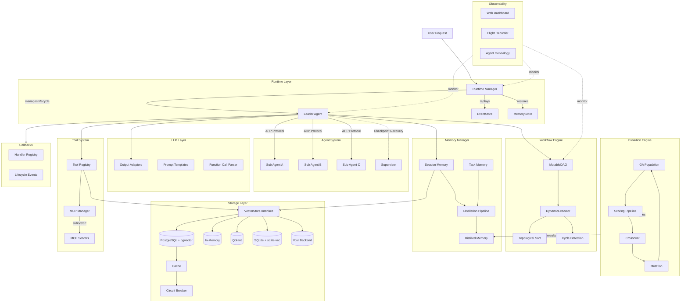
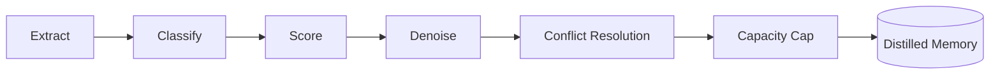

# ares

```shell
           _____  ______  _____ 
     /\   |  __ \|  ____|/ ____|
    /  \  | |__) | |__  | (___  
   / /\ \ |  _  /|  __|  \___ \ 
  / ____ \| | \ \| |____ ____) |
 /_/    \_\_|  \_\______|_____/ 

```

ARES(Adaptive Resilient Evolution System)  A Self-Healing Evolutionary Runtime for Autonomous Agents

Go-based multi-agent framework with DAG workflow orchestration, memory distillation, and AHP inter-agent protocol.

## Architecture 



### Memory Distillation Pipeline



6-step pipeline: extract experiences from raw interactions, classify by type, score relevance, filter noise, resolve conflicts with existing memories, and enforce capacity limits.

### AHP Protocol

Custom Agent Hosting Protocol handling inter-agent communication with heartbeat monitoring, dead-letter queue (DLQ), and progress tracking. All protocol operations benchmark under 1 us.

### Leader Failover

Checkpoint-based recovery. Supervisor detects leader failure, recovers stale tasks from last checkpoint, and reassigns work to available sub-agents.

## Key Features

**DAG Workflow Engine**
- MutableDAG: runtime graph mutation (add/remove nodes and edges) all under 1 us
- DynamicExecutor: executes DAG with topological sort
- Incremental cycle detection on edge insertion
- Hot reload and runtime mutation without stopping execution

**Memory System**
- Session memory: short-term conversation context
- Task memory: per-task working memory
- Distilled memory: long-term compressed knowledge via 6-step pipeline (errgroup-based concurrent embedding)
- Multi-language experience extraction with Chinese keyword detection and importance scoring
- Content-hash deduplication for idempotent memory storage
- pgvector-backed semantic search

**Storage Layer**
- Pluggable vector store interface — swap PostgreSQL for Qdrant, Milvus, SQLite, or your own backend
- Built-in implementations: PostgreSQL + pgvector (production), in-memory (dev/test)
- Repository pattern abstraction
- Built-in cache layer + circuit breaker for fault tolerance
- Idempotent DDL migrations, safe for repeated execution
- See [Custom Vector Store Guide](docs/en/development/custom-vector-store.md)

**Agent System**
- Leader/Sub agent architecture
- AHP protocol for structured communication (heartbeat, DLQ, progress)
- Leader failover with checkpoint recovery
- Parallel task execution with configurable concurrency
- Agent resurrection plugin with pluggable health checking

**Runtime Layer**
- Agent lifecycle management: register, start, stop, restart, restore
- Automatic crash detection and resurrection via AgentFactory
- Two recovery dimensions: EventStore (operational) + MemoryStore (cognitive)
- Health monitoring with heartbeat and status-based checks
- Structured concurrency via errgroup with graceful shutdown

**Event Sourcing**
- EventStore interface with optimistic concurrency control
- MemoryEventStore for dev/test, PostgresEventStore for production
- 17 event types covering agent lifecycle, tasks, sessions, workflows, failover
- Pub/sub via Subscribe with filtered event channels
- DLQ auto-retry with configurable retry budgets

**Human-in-the-Loop**
- Pause workflow steps for human approval before execution
- InterruptConfig on any step, InterruptHandler for blocking approval
- InterruptStore for crash recovery of pending approvals
- Approval workflows and review gates

**Tool System**
- Dynamic tool registration and discovery
- Capability matching between agents and tools
- Parameter validation with schema support
- Pre/post execution lifecycle hooks

**MCP Integration**
- Model Context Protocol client with JSON-RPC 2.0 messaging
- Stdio and SSE transport support
- Tool schema management and connection lifecycle

**Observability**
- Web Dashboard: real-time monitoring with WebSocket streaming
- Flight Recorder: timeline tracking, decision logging, diagnostics engine
- Agent Genealogy: lineage tracking with graph export (DOT/JSON)
- Event Bridge: system state streaming to dashboard

**Chaos Engineering**
- Arena framework for fault injection testing
- Fault types: process_kill, network_partition, latency_spike, kill_orchestrator
- Resilience scoring with configurable metrics
- Survival mode for continuous chaos testing

**LLM Tool Calling**
- Multi-provider output adapters (OpenAI, Ollama, OpenRouter)
- Prompt template engine with Go template syntax
- Function calling extraction and validation
- Schema-based parameter validation
- Streaming output parser

**Extensibility**
- Event-driven callbacks system with typed contexts
- Event auto-compaction with retention policies
- Pluggable health checking for agent resurrection

**Autonomous Evolution (Genetic Algorithm)**
- Multi-generation population-based evolution with selection, crossover, and mutation
- Strategy mutation engine with deterministic reproducibility (seed-controlled)
- Arena regression testing with Welch's t-test statistical significance
- Dream cycle orchestration: trigger → mutate → evaluate → adopt → record lineage
- Bandit feedback loop for continuous experience quality optimization
- Event-driven callback system for LLM/Tool/Agent lifecycle hooks
- Wired high-level API: `NewWiredEvolutionSystem` for one-call component wiring
- Elite preservation and adaptive survival rate across generations

## Benchmark Highlights

32 benchmarks total. 2573 tests pass with `-race` across 49 packages.

Platform: darwin/arm64, Apple M3 Max, Go 1.26.4

| Category | Count | Hot (< 1 us) | Normal (1-100 us) | Cold (> 100 us) |
|----------|-------|---------------|--------------------|--------------------|
| Eval | 5 | 2 | 2 | 1 |
| Distillation | 9 | 0 | 8 | 1 |
| Tools/Core | 8 | 3 | 5 | 0 |
| Errors | 4 | 2 | 2 | 0 |
| Event Sourcing | 6 | 0 | 5 | 1 |
| **Total** | **32** | **7** | **22** | **3** |

Selected hot-path results:

| Operation | ns/op | allocs/op |
|-----------|-------|-----------|
| ExactMatchEvaluator | 180.3 | 0 |
| ToolUsageEvaluator | 361.3 | 0 |
| ToolExecution | 347.3 | 0 |
| ConvertEvent | 97.00 | 0 |
| ResultCreation (Success) | 125.0 | 0 |
| ResultCreation (Error) | 55.33 | 0 |
| ParameterValidation | 208.3 | 0 |
| Wrap (error) | 69.67 | 0 |
| WrapMultipleWraps | 69.33 | 0 |
| ConflictDetection | 2125 | 0 |

7 of 32 benchmarks run under 1 us. Zero-allocation paths for evaluation, tool execution, result creation, event conversion, error wrapping, and conflict detection.

Full benchmark report: `benchmarks/benchmark_report.md`

## Quick Start

### Prerequisites

- Go 1.26+
- PostgreSQL 15+ with pgvector (optional, for persistence)
- Docker (optional, for database)

### 1. Set API Key

```bash
export OPENROUTER_API_KEY="your-api-key"
```

### 2. Start Database (Optional)

```bash
# One-click restart with migration (optionally import a doc)
./scripts/docker/restart.sh
./scripts/docker/restart.sh --save examples/knowledge-base/README.md

# Or manually:
docker run -d \
  --name ares-db \
  -e POSTGRES_PASSWORD=postgres \
  -e POSTGRES_DB=goagent \
  -p 5433:5432 \
  pgvector/pgvector:pg15
```

### 3. Run Examples

```bash
# Travel planning (multi-agent collaboration)
cd examples/travel && go run main.go

# Knowledge base Q&A (requires database + embedding service)
cd examples/knowledge-base
go run main.go --save README.md              # Import document
go run main.go --save docs/goagent-overview.md  # Import framework overview
go run main.go --chat                         # Start Q&A (supports knowledge correction)

# Advanced examples (v2 features)
go run ./examples/advanced/leader_failover/
go run ./examples/advanced/agent_resurrection/
go run ./examples/advanced/runtime_resurrection/
go run ./examples/advanced/dynamic_executor/
go run ./examples/advanced/mutable_dag/

# Dashboard with MCP integration
cd examples/mcp-dashboard && go run main.go

# Quantitative analysis demo
cd examples/quant-trading && go run . --ticker AAPL

# Development agent demo
cd examples/devagent && go run main.go

# Tool capability demo
cd examples/capability-demo && go run main.go

# Autonomous evolution (genetic algorithm) demo
cd examples/autonomous-evolution && go run main.go
```

See [Advanced Examples](docs/en/development/examples.md) for detailed documentation.

### 4. Run Tests

```bash
go test ./...                      # All tests
go test -race ./...                # With race detector
go test -bench=. ./...             # Benchmarks
```

## Project Structure

```
ares/
├── internal/
│   ├── agents/          # Leader/Sub agent system
│   ├── runtime/         # Runtime lifecycle management
│   ├── protocol/ahp/    # AHP inter-agent protocol
│   ├── memory/          # Memory system + distillation
│   ├── events/          # EventStore interface + implementations
│   ├── workflow/engine/  # DAG workflow engine
│   ├── storage/          # VectorStore interface + implementations
│   │   ├── postgres/     # PostgreSQL + pgvector (production)
│   │   └── memory/       # In-memory (dev/test)
│   ├── mcp/             # MCP client (stdio/SSE transport)
│   ├── dashboard/        # Web dashboard (WebSocket + REST API)
│   ├── flight/           # Flight recorder (timeline/genealogy/diagnostics)
│   ├── arena/            # Chaos engineering arena
│   ├── callbacks/        # Event-driven callback system
│   ├── llm/output/       # LLM output parsers + prompt templates
│   └── tools/           # Tool registry and invocation
├── services/embedding/  # Embedding gateway (FastAPI + Ollama)
├── examples/            # Travel, knowledge-base, dashboard, quant, devagent, ...
├── api/                 # Service interfaces and client
├── cmd/                 # CLI tools (arena, flight, migration, ...)
│   └── tools/           # Tool registry and invocation
├── services/embedding/  # Embedding gateway (FastAPI + Ollama)
├── examples/            # Travel, knowledge-base, simple demos
├── api/                 # Service interfaces and client
└── benchmarks/          # Benchmark reports and logs
```

## Configuration

Configuration is YAML-based. Key sections:

```yaml
llm:
  provider: openrouter
  api_key: "${OPENROUTER_API_KEY}"
  model: meta-llama/llama-3.1-8b-instruct
  timeout: 60

agents:
  leader:
    id: leader-main
    max_steps: 10
    max_parallel_tasks: 4
  sub:
    - id: agent-a
      type: research
      max_retries: 3
      timeout: 30

storage:
  type: postgres
  host: localhost
  port: 5433
  database: goagent
  pgvector:
    enabled: true
    dimension: 1024

memory:
  enabled: true
  enable_distillation: true
  distillation_threshold: 3
```

See `examples/travel/config.yaml` for a complete example.

## Tech Stack

| Component | Technology |
|-----------|-----------|
| Language | Go 1.26+ |
| Database | PostgreSQL 15+ with pgvector (pluggable: Qdrant, Milvus, SQLite, or custom) |
| Protocol | Custom AHP (Agent Hosting Protocol) |
| Embedding | FastAPI + Ollama/SentenceTransformers |
| Cache | Redis |
| Concurrency | errgroup, sync |

## Documentation

- [Changelog](CHANGELOG.md)
- [Architecture](docs/en/architecture/arch.md)
- [Runtime Layer](docs/en/architecture/runtime.md)
- [Quick Start](docs/en/guides/quick-start.md)
- [FAQ](docs/en/guides/faq.md)
- [Integration Guide](docs/en/development/integration-guide.md)
- [Custom Vector Store](docs/en/development/custom-vector-store.md)
- [Leader Failover](docs/en/features/leader-failover.md)
- [Dynamic Graph](docs/en/features/dynamic-graph.md)
- [Human-in-the-Loop](docs/en/features/hitl.md)
- [Agent Resurrection](docs/en/features/resurrection.md)
- [MCP & Dashboard](docs/en/features/mcp-and-dashboard.md)
- [Event Sourcing](docs/en/features/event-sourcing.md)
- [Integration Testing](docs/en/development/integration-testing.md)
- [CI/CD Pipeline](docs/en/development/ci-cd.md)
- [Framework Comparison](docs/en/framework-comparison.md)
- [Benchmark Report](benchmarks/benchmark_report.md)
- [Autonomous Evolution Guide](docs/en/features/autonomous-evolution.md)

## LICENSE
Apache 2.0