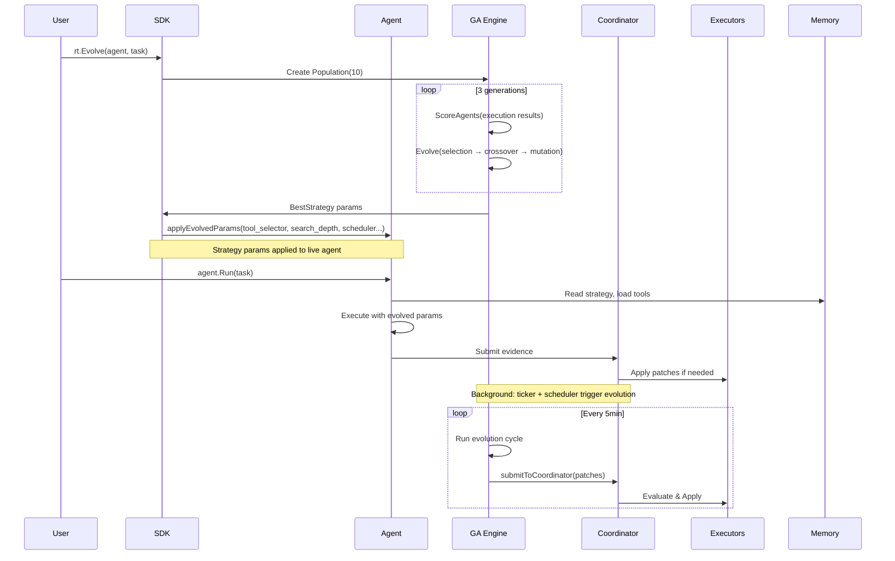

```shell
           _____  ______  _____ 
     /\   |  __ \|  ____|/ ____|
    /  \  | |__) | |__  | (___  
   / /\ \ |  _  /|  __|  \___ \ 
  / ____ \| | \ \| |____ ____) |
 /_/    \_\_|  \_\______|_____/ 

```

**ARES** — Agent Runtime & Evolution System.

Build resilient, self-evolving AI agents in Go. Unified SDK, DAG workflow, chaos engineering, MCP support.

**Runtime Evolution**: ARES continuously evolves its DAG topology, scheduler, knowledge planner, and recovery strategies — all in production, without restarts. LLM is a participant in evolution, not the leader.

## Quick Start

```go
package main

import "github.com/Timwood0x10/ares/sdk"

func main() {
    rt := sdk.MustNew(sdk.WithOllama("llama3.2"))
    defer rt.Close()

    agent := rt.NewAgent("assistant")
    result, _ := agent.Run(ctx, "Say hello")
    println(result.Output)
}
```

Install the CLI:

```bash
go install github.com/Timwood0x10/ares/cmd/ares@latest
ares doctor
ares run -c ares.yaml "What is Go?"
```

Or run examples directly:

```bash
git clone https://github.com/Timwood0x10/ares
cd ares
make quickstart        # go run examples/quickstart
make examples          # build all 24 examples
```

## Features

| Feature | Description |
|---|---|
| **Unified SDK** | Single `sdk.MustNew()` API for LLM, tools, memory, evolution |
| **Runtime Evolution** | Genome + Diff Engine + Coordinator evolve DAG, scheduler, planner, recovery in production |
| **Strategy GA** | Population-based strategy optimization — NSGA-II multi-objective, steady-state, uniform/two-point/segment crossover, 6 mutation types |
| **Evidence-Driven** | Every runtime event (flight, chaos, fitness) feeds into evolution decisions |
| **DAG Workflow** | Dynamic graphs with conditional branching and recovery |
| **Chaos Resilient** | Fault injection, failover, survival testing, self-healing |
| **Memory** | Session context, task distillation, vector similarity search |
| **MCP Ready** | Connect any Model Context Protocol server for tools and data |
| **Multi-Agent** | Leader/sub orchestration with automatic failover |
| **Observability** | OpenTelemetry traces, structured logs, Prometheus metrics |

## Module Map

> Start from "I want to use capability X" and find the code in one step.

- [Capability–Module Map (English)](docs/CAPABILITY-MAP.en.md)

## CLI

```bash
ares serve              # Start full agent monitoring (LLM + MCP + dashboard)
ares agent list         # List all registered agents
ares arena run/validate/list/serve/survival/inspect  # Chaos engineering scenarios
ares evolution run/status         # Runtime evolution
ares flight inspect/replay        # Inspect and replay task recordings
ares workflow run <id> <input>    # Execute a workflow
ares knowledge build <goal>       # Build a knowledge graph (via HTTP API)
ares mcp-null serve     # Start minimal MCP null server (stdio)
ares db migrate/setup-test/create-table/check-rls  # Database management
ares init               # Scaffold a new project (main.go + ares.yaml)
ares run                # Run agent from config file
ares bench              # Quick performance benchmark
ares doctor             # Diagnose environment (LLM key, Ollama, Git)
ares version            # Show version
```

## SDK

```go
rt := sdk.MustNew(
    sdk.WithOpenAI("gpt-4o-mini"),          // or WithOllama, WithAnthropic
    sdk.WithDefaultMemory(),                 // session history
    sdk.WithEvolution(),                     // strategy evolution
    sdk.WithMCP(sdk.MCPConn{                 // MCP server tools
        Name: "my-server", Command: "/path/to/server", Args: []string{"serve"},
    }),
)
defer rt.Close()

// Agent with tools and human-in-the-loop.
agent := rt.NewAgent("assistant",
    sdk.WithInstruction("You are helpful."),
    sdk.WithTools(calculatorTool, weatherTool),
    sdk.WithHumanInput(approveFn),
)
result, _ := agent.Run(ctx, "Calculate 15*23")

// Streaming response.
ch, _ := agent.Stream(ctx, "Tell me a story")
for chunk := range ch { fmt.Print(chunk.Content) }

// Multi-agent team.
team := rt.NewTeam("project", leaderAgent, []*Agent{memberAgent})
teamResult, _ := team.Run(ctx, "Research and write")
```

See [examples/README.md](examples/README.md) for 9 hands-on examples.

## Articles

Deep dives into ARES internals:

| English | 中文 |
|---|---|
| [Architecture](docs/articles/en/01-architecture-overview-deep-dive.md) | [架构](docs/articles/zh/01-architecture-overview-deep-dive.md) |
| [Agent Harmony](docs/articles/en/02-agent-harmony-protocol.md) | [Agent 通信协议](docs/articles/zh/02-agent-harmony-protocol.md) |
| [Memory & Distillation](docs/articles/en/03-memory-distillation-deep-dive.md) | [记忆与蒸馏](docs/articles/zh/03-memory-distillation-deep-dive.md) |
| [Workflow Engine](docs/articles/en/04-workflow-engine-deep-dive.md) | [工作流引擎](docs/articles/zh/04-workflow-engine-deep-dive.md) |
| [Tool System](docs/articles/en/05-tool-system-deep-dive.md) | [工具系统](docs/articles/zh/05-tool-system-deep-dive.md) |
| [Security & Observability](docs/articles/en/06-security-observability-deep-dive.md) | [安全与可观测性](docs/articles/zh/06-security-observability-deep-dive.md) |
| [Runtime Lifecycle](docs/articles/en/07-runtime-lifecycle-deep-dive.md) | [运行时生命周期](docs/articles/zh/07-runtime-lifecycle-deep-dive.md) |
| [Event System](docs/articles/en/08-event-system-deep-dive.md) | [事件系统](docs/articles/zh/08-event-system-deep-dive.md) |
| [Chaos Arena](docs/articles/en/09-arena-fault-injection-deep-dive.md) | [混沌测试](docs/articles/zh/09-arena-fault-injection-deep-dive.md) |
| [Retrieval System](docs/articles/en/10-retrieval-system-deep-dive.md) | [检索系统](docs/articles/zh/10-retrieval-system-deep-dive.md) |
| [Autonomous Evolution](docs/articles/en/11-autonomous-evolution-deep-dive.md) | [自主进化](docs/articles/zh/11-autonomous-evolution-deep-dive.md) |
| [Security Hardening](docs/articles/en/12-security-hardening-deep-dive.md) | [安全加固](docs/articles/zh/12-security-hardening-deep-dive.md) |
| [Bootstrap & API](docs/articles/en/13-bootstrap-api-deep-dive.md) | [Bootstrap 与 API](docs/articles/zh/13-bootstrap-api-deep-dive.md) |
| [Plugin System](docs/articles/en/14-plugin-system-deep-dive.md) | [插件系统](docs/articles/zh/14-plugin-system-deep-dive.md) |
| [MCP Integration](docs/articles/en/15-mcp-integration-deep-dive.md) | [MCP 集成](docs/articles/zh/15-mcp-integration-deep-dive.md) |
| [Flight Recorder](docs/articles/en/16-flight-recorder-deep-dive.md) | [Flight Recorder](docs/articles/zh/16-flight-recorder-deep-dive.md) |
| [SDK Layer](docs/articles/en/17-sdk-layer.md) | [SDK 层](docs/articles/zh/17-sdk-layer.md) |
| [Knowledge Graph Build](docs/articles/en/18-knowledge-graph-build.md) | [知识图谱构建](docs/articles/zh/18-knowledge-graph-build.md) |
| [Storage Layer](docs/articles/en/19-storage-layer.md) | [存储层](docs/articles/zh/19-storage-layer.md) |
| [LLM Client Layer](docs/articles/en/20-llm-client-layer.md) | [LLM 客户端层](docs/articles/zh/20-llm-client-layer.md) |
| [Evaluation Framework](docs/articles/en/21-evaluation-framework.md) | [评估框架](docs/articles/zh/21-evaluation-framework.md) |
| [Config System](docs/articles/en/22-config-system.md) | [配置系统](docs/articles/zh/22-config-system.md) |
| [Quant Trading Module](docs/articles/en/23-quant-trading.md) | [量化交易模块](docs/articles/zh/23-quant-trading.md) |
| [GA Deep Dive](docs/articles/en/24.1-ga-deep-dive.md) | [GA 深度解析](docs/articles/zh/24.1-ga-deep-dive.md) |
| [GA Tiered Scorer](docs/articles/en/24.2-ga-tiered-scorer.md) | [GA 分层评分](docs/articles/zh/24.2-ga-tiered-scorer.md) |
| [GA Selection Benchmark](docs/articles/en/24.3-ga-selection-benchmark.md) | [GA 选择算子对比](docs/articles/zh/24.3-ga-selection-benchmark.md) |
| [GA Promoter](docs/articles/en/24.4-ga-promoter.md) | [GA 晋升系统](docs/articles/zh/24.4-ga-promoter.md) |
| [GA Genealogy](docs/articles/en/24.5-ga-genealogy.md) | [GA 谱系记录](docs/articles/zh/24.5-ga-genealogy.md) |
| [GA in the Trenches](docs/articles/en/24.6-ga-in-the-trenches.md) | [GA 实战经验](docs/articles/zh/24.6-ga-in-the-trenches.md) |

## Architecture

```mermaid
graph TB
    User["User / CLI"] --> SDK

    subgraph SDK ["SDK Layer (sdk/)"]
        RT["Runtime<br/>MustNew / New"]
        A["Agent<br/>Run / Stream"]
        T["Team<br/>Multi-Agent"]
        CFG["Config<br/>YAML + Options"]
        EV["Evolve()<br/>GA Strategy Evolution"]
    end

    SDK --> LLM
    SDK --> Tools
    SDK --> Memory
    SDK --> Evo

    subgraph LLM ["LLM Providers"]
        OAI["OpenAI"]
        OLL["Ollama"]
        ANTH["Anthropic"]
        OR["OpenRouter"]
    end

    subgraph Tools ["Tool System"]
        BT["Built-in<br/>calculator, search..."]
        MCP["MCP Servers<br/>Stdio / SSE"]
        CT["Custom Tools<br/>ToolFunc"]
    end

    subgraph Memory ["Memory System"]
        SES["Session Context"]
        DIST["Task Distillation"]
        VEC["Vector Search"]
        CONF["Config<br/>max_history, session_ttl..."]
        MP["Memory Patch Executor<br/>Runtime Evolution"]
    end

    subgraph Evo ["GA Evolution Engine"]
        direction TB
        POP["Population<br/>N individuals"]
        SEL["7 Selection Operators<br/>tournament/rank/nsga2..."]
        CROSS["3 Crossover Types<br/>uniform/two_point/segment"]
        MUT["6 Mutation Types<br/>param/swap/inversion/scramble..."]
        SCORE["Experience-Guided Scoring<br/>multi-objective"]
        SS["Steady-State GA<br/>online learning mode"]
        SHARE["Fitness Sharing<br/>SelectionScore preservation"]
    end

    POP --> SEL --> CROSS --> MUT --> SCORE
    SCORE --> POP
    SS -.-> POP

    subgraph RuntimeEvo ["Runtime Evolution Pipeline"]
        direction TB
        TICKER["Background Ticker<br/>5min interval"]
        SCHED["Scheduler<br/>OnAgentEnd callback"]
        ADAPTER["GenomePopulationAdapter<br/>Run()"]
        GENOME["Genomes<br/>Workflow / Scheduler / Knowledge<br/>Recovery / Planner / Memory"]
        DIFF["Diff Engine<br/>4 Differs"]
        COORD["Coordinator<br/>Apply / Reject / Delay"]
        EXEC["Executors<br/>Graph / Recovery / Knowledge / Memory"]
        STORE["Strategy Store<br/>Active Strategy"]
        AGENT["Live Agent<br/>consume evolved params"]
    end

    TICKER --> ADAPTER
    SCHED --> ADAPTER
    ADAPTER --> GENOME
    GENOME --> DIFF
    DIFF --> COORD
    COORD --> EXEC
    ADAPTER --> STORE
    STORE --> AGENT

    Evo --> ADAPTER
    AGENT --> LLM
    AGENT --> Tools
    AGENT --> Memory

    subgraph CLI ["CLI (cmd/ares/)"]
        INIT["ares init"]
        RUN["ares run"]
        BENCH["ares bench"]
        DOCTOR["ares doctor"]
        EVO["ares evolution"]
        ARENA["ares arena"]
    end

    subgraph EX ["Examples"]
        QS["01 Quickstart"]
        TC["02 Tool Calling"]
        DAG["03 DAG Workflow"]
        MA["04 Multi-Agent"]
        EVO_DEMO["05 Evolution Demo"]
        CHAOS["06 Chaos Resilience"]
        HIL["07 Human-in-Loop"]
        GA_FULL["10 GA Full Evolution"]
    end

    style SDK fill:#1e3a5f,stroke:#3b82f6,color:#fff
    style LLM fill:#1a2332,stroke:#64748b
    style Tools fill:#1a2332,stroke:#64748b
    style Memory fill:#1a2332,stroke:#64748b
    style Evo fill:#1a2332,stroke:#64748b
    style RuntimeEvo fill:#2d1b69,stroke:#8b5cf6,color:#fff
    style CLI fill:#2d1b69,stroke:#8b5cf6,color:#fff
    style EX fill:#1a3a2a,stroke:#22c55e
```



## Data Flow



## Cookbook

| Recipe | Code |
|---|---|
| [Chat Agent](docs/cookbook/chat.md) | 20-line conversational agent |
| [Tool Calling](docs/cookbook/tool.md) | Custom tools for LLM function calling |
| [Multi-Agent](docs/cookbook/multi-agent.md) | Leader/member team orchestration |
| [Memory](docs/cookbook/memory.md) | Persistent conversation context |
| [Coding Agent](docs/cookbook/coding.md) | Code generation with specialized instructions |
| [Code Review](docs/cookbook/review.md) | Automated PR review |
| [GitHub Agent](docs/cookbook/github.md) | Issue and PR automation |

## Runtime Evolution

ARES's runtime evolution system is **evidence-driven**: every execution, fault, and insight produces `Evidence`, which feeds into the evolution cycle. The system evolves DAG topology, scheduler selection, knowledge planner parameters, and recovery strategies — all in production, without restarts.

### Architecture

```
Execution → Evidence → Genome → Candidate → Diff Engine → RuntimePatch → Coordinator → Apply
```

| Component | Role | Sources |
|-----------|------|---------|
| **5 Genomes** | Generate candidate configurations via mutation + crossover | workflow, scheduler, knowledge, recovery, prompt |
| **4 Differs** | Compare old vs new snapshots → produce RuntimePatches | workflow, knowledge, scheduler, recovery |
| **Coordinator** | Decides Apply/Reject/Delay for each PatchProposal | GA, Chaos, AKF, LLM, Human, K8s, Rule |
| **3 Executors** | Apply patches to live runtime | Graph, Knowledge, Recovery |
| **LLM Adapter** | Converts natural-language suggestions into PatchProposals | parsed format → Coordinator |

**Key design**: LLM is a **participant**, not the leader. The Coordinator treats all 7 `PatchSource` values equally. No source has privileged access.

### Benchmarks (Apple M3 Max, 2026-07-16)

```
=== Runtime Evolution (internal/evolution) ===
BenchmarkWorkflowGenome_Mutate     309k   7.1µs  11.4KB  155 allocs
BenchmarkSchedulerGenome_Mutate    3.3M   0.4µs   719B    15 allocs
BenchmarkKnowledgeGenome_Mutate    2.8M   0.4µs   960B    11 allocs
BenchmarkRecoveryGenome_Mutate     2.2M   0.5µs  1.1KB    21 allocs
BenchmarkDiffEngine_Workflow       2.9M   0.4µs   256B     3 allocs
BenchmarkCoordinator_Evaluate      217M   5.4ns     0B      0 allocs
BenchmarkFullEvolutionCycle        206k   5.3µs  8.0KB   109 allocs

=== Event System (internal/ares_events) ===
BenchmarkMemoryStore_Append           226k   516ns    596B    7 allocs
BenchmarkMemoryStore_AppendBatch      27k    3.96µs   8.4KB   1 alloc
BenchmarkMemoryStore_Read             28k    4.33µs   17.5KB  11 allocs
BenchmarkMemoryStore_ConcurrentAppend 165k   667ns    619B    6 allocs

=== Evaluation Framework (internal/ares_eval) ===
BenchmarkExactMatchEvaluator_Evaluate    39.2M   3.1ns      0B      0 allocs
BenchmarkToolUsageEvaluator_Evaluate      4.2M   28.7ns     0B      0 allocs
BenchmarkAgentTestRunner_RunSingle       372k    315ns    320B      5 allocs
BenchmarkReportGenerator_GenerateMarkdown 33k     3.5µs   4.3KB    76 allocs
BenchmarkLoader_Load                      2.5k    47.3µs  34.1KB   601 allocs

=== AKG Knowledge Fabric (internal/knowledge) ===
--- Linkers ---
DecisionLinker (100 objs)           8.4k   15.1µs  10.9KB  295 allocs
ArchitectureLinker (100 objs)       3.7k   34.1µs 102.6KB   85 allocs
TimelineLinker (100 objs)          61.2k   2.01µs   3.1KB   11 allocs
SimilarityLinker (100 objs)          74    1.96ms   3.2MB 20216 allocs
--- Compiler ---
DefaultCompiler Prompt (100 nodes) 2.6k   45.6µs  73.3KB  819 allocs
DefaultCompiler All Formats (100)    478   263.7µs 365.2KB 3476 allocs
--- Memory Store ---
Store_Save                          213k   503ns    586B    11 allocs
Store_Get                          2.09M    56ns     13B     1 alloc
Store_QueryByType                  22.8k   5.16µs  4.5KB    11 allocs
Store_Search                        1.3k   77.2µs  69.4KB  1514 allocs
--- Pipeline ---
DefaultNormalizer_Normalize        254k    476ns    607B     9 allocs
--- Planner ---
KnowledgePlanner_Plan              170k    720ns    928B    14 allocs
--- Retriever (end-to-end) ---
Retrieve (100 objs)                  16   10.8ms  23.8MB 132959 allocs
```

### CLI

```bash
ares evolution status   # Show genomes, differs, coordinator state
ares evolution run      # Run one evolution cycle
```

### Examples

```bash
go run examples/11-knowledge-import/ --dir ./notes          # Ingest markdown into pgvector
go run examples/11-knowledge-import/ --ask "question"       # RAG query against KB
go run examples/11-knowledge-import/ --evolve "task"        # GA evolution on import
go run examples/11-knowledge-import/ --chat                 # Interactive chat with tools
go run examples/11-knowledge-import/ --team --dir ./notes   # Multi-agent import
go run examples/11-knowledge-import/ --chaos-fail 0.3       # With fault injection
go run examples/11-knowledge-import/akg/                    # Build AKG from KB
go run examples/runtime_evolution/basic/      # Full end-to-end evolution demo
go run examples/runtime_evolution/knowledge/  # Knowledge parameter evolution
go run examples/runtime_evolution/full/       # All 4 genomes + real executors
```

## Strategy Evolution (GA)

Beyond runtime-level evolution, ARES includes a **strategy-level Genetic Algorithm** that optimizes agent inference parameters (temperature, top_k, prompt templates, tool configs) through population-based search. The system evolves a population of strategies across generations using selection, crossover, and mutation, with zero-cost background evolution cycles.

### Key Features

| Feature | Description |
|---|---|
| **NSGA-II Multi-Objective** | 4 default dimensions (success_rate 0.40, quality 0.25, cost 0.20, latency 0.15) with direction-aware Pareto dominance |
| **Steady-State GA** | Configurable replace rate (0.1–0.5, default 0.3) — replaces only the worst individuals each generation |
| **Score / SelectionScore** | Canonical score preserved; selection score adjusted by fitness sharing for diversity |
| **Fitness Sharing** | 3 strategies — full O(n²), reservoir sampling, spatial grid index (for >500 individuals) |
| **3 Crossover Types** | Uniform (per-gene), Two-Point (swap segment), Segment (contiguous block) |
| **6 Mutation Types** | Parameter, Prompt, Tool, Swap, Inversion, Scramble |
| **Evolution Callbacks** | OnGeneration / OnFitness / OnMutation / OnCrossover |
| **Termination** | MaxGenerations + TargetFitness (stops when BestEverScore ≥ target) |
| **Generation History** | Per-generation snapshots with metadata |
| **Experience System** | 3-tier pipeline: ToolCallRecord → RawExperience → NormalizedExperience → EvolutionHint → GuidanceProvider |

### Benchmarks (Apple M3 Max, 2026-07-16)

```
=== GA Genome (internal/ares_evolution/genome) ===
CrossoverUniform (10 params)        500k   2.4µs    2.9KB   29 allocs
CrossoverUniform (100 params)        68k  17.7µs   21.0KB   36 allocs
TruncationSelection (pop=100)       200k   6.2µs        —    —
TournamentSelection (pop=50,k=2)    380k   3.2µs        —    —
RouletteWheelSelection (pop=100)    410k   2.9µs        —    —
Evolve_OneGeneration (pop=10)       437k     281ns   344B     6 allocs
Evolve_MultipleGenerations (100)     3.7k    28µs   34.4KB  600 allocs
ApplyFitnessSharing (pop=100)         88   1.35ms    540KB 106 allocs
RealWorldEvolution (100 gen)          12    9.87ms  4.43MB  59894 allocs
```

### Examples

```bash
go run examples/10-ga-full-evolution/main.go   # Full GA evolution demo
go run examples/05-evolution-demo/main.go       # Pre-NSGA-II evolution demo
```

## License

Apache 2.0

## Acknowledgments

ARES's genetic algorithm implementation was inspired by the design and features of **[PyGAD](https://github.com/ahmedfgad/GeneticAlgorithmPython)** — the Python genetic algorithm library by [Ahmed F. Gad](https://github.com/ahmedfgad). PyGAD's architecture, operator design, and multi-objective optimization capabilities served as a valuable reference for building the GA engine in this project.

We recommend PyGAD for anyone looking for a mature, well-documented GA library in Python:
- GitHub: [github.com/ahmedfgad/GeneticAlgorithmPython](https://github.com/ahmedfgad/GeneticAlgorithmPython)
- Documentation: [pygad.readthedocs.io](https://pygad.readthedocs.io/)

Additional GA concepts and terminology follow the standard definitions from the [Genetic Algorithm](https://en.wikipedia.org/wiki/Genetic_algorithm) article on Wikipedia.
