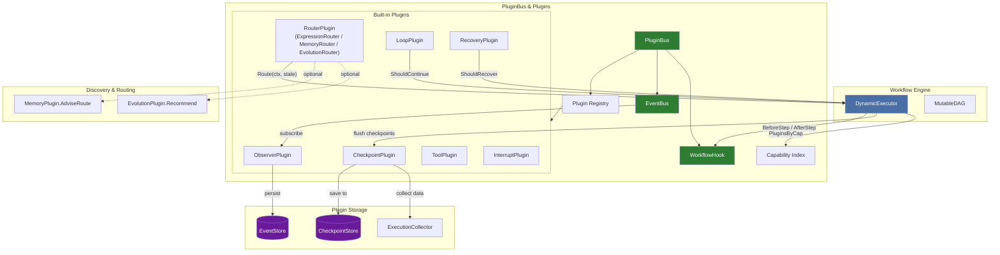
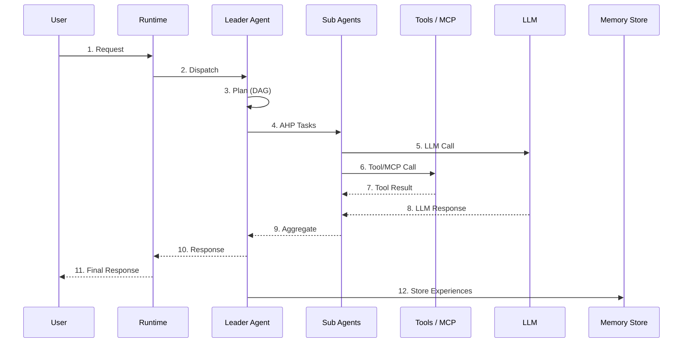
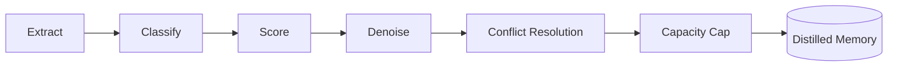

```shell
           _____  ______  _____ 
     /\   |  __ \|  ____|/ ____|
    /  \  | |__) | |__  | (___  
   / /\ \ |  _  /|  __|  \___ \ 
  / ____ \| | \ \| |____ ____) |
 /_/    \_\_|  \_\______|_____/ 

```

ARES(Adaptive Resilient Evolution System)  A Self-Healing Evolutionary Runtime for Autonomous Agents

Go-based multi-agent framework with DAG workflow orchestration, memory distillation, and AHP inter-agent protocol.

## Architecture

```mermaid
graph TB
    User["User Request"] --> Bootstrap

    subgraph api ["API Layer (api/core/)"]
        Bootstrap["Bootstrap Factory"]
        Interfaces["AgentService / Runtime / Evolution / Arena / MemoryService / LLMService / WorkflowService"]
    end

    Bootstrap --> RT
    Bootstrap --> EvoSvc
    Bootstrap --> ArenaSvc
    Bootstrap --> MemMgr

    subgraph runtime ["Runtime Layer"]
        RT["Runtime Manager"]
        RT -->|"manages lifecycle"| Leader
        RT -->|"replays"| ES["EventStore"]
        RT -->|"restores"| MM["MemoryStore"]
        RT -->|"module=runtime"| LOG["Structured Logger"]
    end

    subgraph agents ["Agent System"]
        direction TB
        Leader["Leader Agent"]
        SubA["Sub Agent A"]
        SubB["Sub Agent B"]
        SubC["Sub Agent C"]
        Leader -->|"AHP Protocol"| SubA
        Leader -->|"AHP Protocol"| SubB
        Leader -->|"AHP Protocol"| SubC
        Supervisor["Supervisor"]
        Leader -.->|"Checkpoint Recovery"| Supervisor
    end

    subgraph workflow ["Workflow Engine"]
        MutableDAG["MutableDAG"]
        DynamicExec["DynamicExecutor"]
        PluginBus["PluginBus"]
        MutableDAG --> DynamicExec
        DynamicExec --> PluginBus
        DynamicExec --> TopoSort["Topological Sort"]
        DynamicExec --> CycleDetect["Cycle Detection"]
    end

    subgraph llm ["LLM Layer"]
        Adapters["Output Adapters"]
        Templates["Prompt Templates"]
        Parser["Function Call Parser"]
    end

    subgraph mem ["Memory Manager"]
        MemMgr["Memory Manager"]
        Session["Session Memory"]
        Task["Task Memory"]
        Distilled["Distilled Memory"]
        Session --> Pipeline["Distillation Pipeline"]
        Task --> Pipeline
        Pipeline --> Distilled
    end

    subgraph evo ["Evolution Engine"]
        EvoSvc["Evolution Service"]
        Pop["GA Population"]
        Score["Scoring Pipeline"]
        EvidAgg["Evidence Aggregator"]
        Promo["Promotion Logic"]
        Report["Evolution Report"]
        Cross["Crossover"]
        Mut["Mutation"]
        EvoSvc --> Pop
        Pop --> Score
        Score --> Cross
        Cross --> Mut
        Mut --> Pop
        Score -->|"per-generation"| EvidAgg
        EvidAgg -->|"evidence"| Promo
        Promo -->|"after all gens"| Report
        ExpStore["Experience Store"]
        Norm["Normalizer"]
        OutcomeRec["Outcome Recorder"]
        ToolCollect["Tool Call Collector"]
        OutcomeRec --> Norm
        ToolCollect --> Norm
        Norm --> ExpStore
        ExpStore --> EvidAgg
    end

    subgraph hitl ["Human-in-the-Loop"]
        IH["Interrupt Handler"]
        IS["Interrupt Store"]
        AW["Approval Workflow"]
        IH --> IS
        IH --> AW
    end

    subgraph stor ["Storage Layer"]
        VS["VectorStore Interface"]
        PG[("PostgreSQL + pgvector")]
        MEM[("In-Memory")]
        QD[("Qdrant")]
        SQL[("SQLite + sqlite-vec")]
        CUSTOM[("Your Backend")]
        Cache["Cache"]
        CB["Circuit Breaker"]
        VS --> PG
        VS --> MEM
        VS --> QD
        VS --> SQL
        VS --> CUSTOM
        PG --> Cache
        Cache --> CB
    end

    subgraph tools ["Tool System"]
        Registry["Tool Registry"]
        MCP["MCP Manager"]
        MCP_Ext["MCP Servers"]
        Registry --> MCP
        MCP -->|"stdio/SSE"| MCP_Ext
    end

    subgraph obs ["Observability"]
        Dashboard["Web Dashboard"]
        Flight["Flight Recorder"]
        Genealogy["Agent Genealogy"]
    end

    subgraph cb ["Callbacks"]
        Handler["Handler Registry"]
        Events["Lifecycle Events"]
    end

    subgraph arena ["Chaos Engineering"]
        ArenaSvc["Arena Service"]
        FI["Fault Injector"]
        RS["Resilience Scoring"]
        SM["Survival Mode"]
        ArenaSvc --> FI
        FI --> RS
        RS --> SM
    end

    EmbedSvc["Embedding Service"]
    ReportFile["Report File"]

    evo -->|"stores results"| Distilled
    evo -->|"uses"| Score
    Report -->|"persists to"| ReportFile

    Leader --> MutableDAG
    Leader --> Session
    Leader --> Registry
    Leader --> Adapters
    Leader --> cb
    Leader --> IH
    Session --> VS
    Registry --> VS
    VS -.->|"embeds via"| EmbedSvc

    obs -.->|"monitor"| RT
    obs -.->|"monitor"| Leader
    obs -.->|"monitor"| MutableDAG
    arena -.->|"stress test"| RT
    arena -.->|"stress test"| Leader
```



### Plugin System Architecture



The PluginBus sits between the DynamicExecutor and all plugins. The executor calls **BeforeStep/AfterStep** hooks on every step boundary; hooks dispatch with configurable timeout and automatic panic recovery. **EventBus** enables pub/sub decoupling — plugins emit events without knowing who consumes them. **Capability Index** allows loose‑coupling lookup (`PluginsByCap`) so the executor never depends on concrete plugin types.

### Data Flow

#### Request Lifecycle



Request routed through Runtime → Leader plan with DAG → Sub Agents execute (LLM + Tools) → results aggregated and returned.

#### Memory Distillation Pipeline



6-step pipeline: extract experiences from raw interactions, classify by type, score relevance, filter noise, resolve conflicts with existing memories, and enforce capacity limits.

### AHP Protocol

Custom Agent Hosting Protocol handling inter-agent communication with heartbeat monitoring, dead-letter queue (DLQ), and progress tracking. All protocol operations benchmark under 1 us.

### Leader Failover

Checkpoint-based recovery. Supervisor detects leader failure, recovers stale tasks from last checkpoint, and reassigns work to available sub-agents.

## Key Features

**DAG Workflow Engine**
- MutableDAG: runtime graph mutation (add/remove nodes and edges) all under 1 us
- DynamicExecutor: executes DAG with topological sort
- Incremental cycle detection on edge insertion
- Hot reload and runtime mutation without stopping execution

**Memory System**
- Session memory: short-term conversation context
- Task memory: per-task working memory
- Distilled memory: long-term compressed knowledge via 6-step pipeline (errgroup-based concurrent embedding)
- Multi-language experience extraction with Chinese keyword detection and importance scoring
- Content-hash deduplication for idempotent memory storage
- pgvector-backed semantic search

**Storage Layer**
- Pluggable vector store interface — swap PostgreSQL for Qdrant, Milvus, SQLite, or your own backend
- Built-in implementations: PostgreSQL + pgvector (production), in-memory (dev/test)
- Repository pattern abstraction
- Built-in cache layer + circuit breaker for fault tolerance
- Idempotent DDL migrations, safe for repeated execution
- See [Custom Vector Store Guide](docs/en/development/custom-vector-store.md)

**Agent System**
- Leader/Sub agent architecture
- AHP protocol for structured communication (heartbeat, DLQ, progress)
- Leader failover with checkpoint recovery
- Parallel task execution with configurable concurrency
- Agent resurrection plugin with pluggable health checking

**Runtime Layer**
- Agent lifecycle management: register, start, stop, restart, restore
- Automatic crash detection and resurrection via AgentFactory
- Two recovery dimensions: EventStore (operational) + MemoryStore (cognitive)
- Health monitoring with heartbeat and status-based checks
- Structured concurrency via errgroup with graceful shutdown

**Event Sourcing**
- EventStore interface with optimistic concurrency control
- MemoryEventStore for dev/test, PostgresEventStore for production
- 17 event types covering agent lifecycle, tasks, sessions, workflows, failover
- Pub/sub via Subscribe with filtered event channels
- DLQ auto-retry with configurable retry budgets

**Human-in-the-Loop**
- Pause workflow steps for human approval before execution
- InterruptConfig on any step, InterruptHandler for blocking approval
- InterruptStore for crash recovery of pending approvals
- Approval workflows and review gates

**Tool System**
- Dynamic tool registration and discovery
- Capability matching between agents and tools
- Parameter validation with schema support
- Pre/post execution lifecycle hooks

**MCP Integration**
- Model Context Protocol client with JSON-RPC 2.0 messaging
- Stdio and SSE transport support
- Tool schema management and connection lifecycle

**Observability**
- Web Dashboard: real-time monitoring with WebSocket streaming
- Flight Recorder: timeline tracking, decision logging, diagnostics engine
- Agent Genealogy: lineage tracking with graph export (DOT/JSON)
- Event Bridge: system state streaming to dashboard

**Chaos Engineering**
- Arena framework for fault injection testing
- Fault types: process_kill, network_partition, latency_spike, kill_orchestrator
- Resilience scoring with configurable metrics
- Survival mode for continuous chaos testing

**LLM Tool Calling**
- Multi-provider output adapters (OpenAI, Ollama, OpenRouter)
- Prompt template engine with Go template syntax
- Function calling extraction and validation
- Schema-based parameter validation
- Streaming output parser

**Extensibility**
- Event-driven callbacks system with typed contexts
- Event auto-compaction with retention policies
- Pluggable health checking for agent resurrection

**Autonomous Evolution (Genetic Algorithm)**
- Multi-generation population-based evolution with selection, crossover, and mutation
- Strategy mutation engine with deterministic reproducibility (seed-controlled)
- Arena regression testing with Welch's t-test statistical significance
- Dream cycle orchestration: trigger → mutate → evaluate → adopt → record lineage
- Bandit feedback loop for continuous experience quality optimization
- Event-driven callback system for LLM/Tool/Agent lifecycle hooks
- Wired high-level API: `NewWiredEvolutionSystem` for one-call component wiring
- Elite preservation and adaptive survival rate across generations
- Post-run evolution report generation: winner score, generation trajectory, scorer cost summary, lineage concentration, and promotion summary persisted to file
- Evidence aggregation and promotion evaluation pipeline: per-generation evidence collection with success rate, latency, error rate, confidence; promotion state/reason computed for champion/candidate decisions
- AfterRun hook for finalization: one-shot evidence collection, promotion evaluation, report generation, and file persistence

**Plugin System**
- PluginBus: centralized plugin registry and lifecycle manager. Thread-safe Start/Stop with reverse-order shutdown, duplicate detection, and started-state guards.
- EventBus: typed event pub/sub interface. `Emit` is non-blocking — drops events on full subscriber buffers. `Subscribe` supports filtering by stream ID, event type, and time range.
- WorkflowHook: synchronous interceptor interface (`BeforeStep` / `AfterStep`) invoked by DynamicExecutor at every step boundary. Each dispatch has configurable timeout and automatic panic recovery with structured `PluginError` wrapping.
- Capability-based discovery: `PluginsByCap(CapCheckpoint)` returns a copy of all plugins advertising that capability. Enables loose coupling between the workflow engine and plugins — the executor never depends on concrete plugin types.

**Built-in Plugins**

| Plugin | Capability | Role |
|--------|------------|------|
| ObserverPlugin | observer | Subscribes to workflow lifecycle events (workflow.started/completed/failed, step.started/completed/failed, checkpoint.saved) and persists them to EventStore |
| CheckpointPlugin | checkpoint | Saves deep-copy execution snapshots at step boundaries. Configurable flush interval. 22-field schema covering step states, variables, route/tool/memory/interrupt/error/loop history, and scoring signals |
| ToolPlugin | tool | Validates and records tool invocations via ExecutionCollector |
| ExpressionRouter | router | Rule-based router: FromStepID → ToStepID with predicate condition. First-match semantics |
| MemoryRouter | router | Queries `MemoryPlugin.AdviseRoute` first, falls back to expression rules |
| EvolutionRouter | router | Queries `EvolutionPlugin.Recommend` first, falls back to expression rules |
| LoopPlugin | loop | Controlled execution loops with MaxIterations, UntilCondition, and SubStepIDs |
| BasicRecoveryPlugin | recovery | Allowlist-based step failure recovery decisions |
| InterruptPlugin | — | Records HITL interrupt lifecycle events via collector |
| ArenaPlugin | — | Fault injection for robustness testing (plugin_panic, plugin_timeout, plugin_error, bus_stop) |

**ExecutionCollector**
- Thread-safe data aggregator collecting route decisions, tool calls, memory hits, interrupts, and errors during workflow execution
- `Export()` produces serializable maps; `MergeInto()` copies into `ExperienceCheckpoint`
- Consumed by CheckpointPlugin, memory distillation pipeline, and evolution engine scoring

**ExperienceCheckpoint** — full execution snapshot:
```json
{
  "schema_version": 1,
  "execution_id": "...",
  "workflow_id": "...",
  "workflow_version": "...",
  "state_version": 1,
  "status": "running",
  "step_states": [...],
  "variables": {...},
  "output_store": {...},
  "route_history": [...],
  "tool_history": [...],
  "memory_hits": [...],
  "interrupt_history": [...],
  "loop_history": [...],
  "error_history": [...],
  "scoring_signals": [...],
  "created_at": "..."
}
```
Enables complete execution state restore for leader failover and step-level recovery.

## Benchmark Highlights

116 benchmarks total. 5675 tests pass with `-race` across 130 packages.

Platform: darwin/arm64, Apple M3 Max, Go 1.26.4

| Category | Count | Hot (< 1 us) | Normal (1-100 us) | Cold (> 100 us) |
|----------|-------|---------------|--------------------|--------------------|
| Eval | 5 | 2 | 2 | 1 |
| Distillation | 10 | 0 | 9 | 1 |
| Tools/Core | 9 | 4 | 5 | 0 |
| Errors | 4 | 3 | 1 | 0 |
| Events | 6 | 0 | 5 | 1 |
| Handler | 3 | 1 | 1 | 1 |
| Evolution | 6 | 0 | 1 | 5 |
| Evolution/Genome | 30+ | 0 | 20+ | 10+ |
| **Total** | **116** | **10** | **43** | **20** |
| Event Sourcing | 6 | 0 | 5 | 1 |
| **Total** | **32** | **7** | **22** | **3** |

Selected hot-path results:

| Operation | ns/op | allocs/op |
|-----------|-------|-----------|
| ExactMatchEvaluator | 3.07 | 0 |
| ToolUsageEvaluator | 28.49 | 0 |
| ToolExecution | 14.69 | 0 |
| ConvertEvent | 4.87 | 0 |
| ParameterValidation | 7.22 | 0 |
| Wrap (error) | 0.27 | 0 |
| WrapMultipleWraps | 0.59 | 0 |
| ResultCreation (Success) | 0.27 | 0 |
| ResultCreation (Error) | 0.28 | 0 |
| ConflictDetection | 1027 | 0 |
| DreamCycle_SingleRun | 224 | 4 |

10 of 116 benchmarks run under 1 us. Zero-allocation paths for evaluation, tool execution, result creation, error wrapping, and parameter validation.

Full benchmark report: `benchmarks/benchmark_report.md`

## Quick Start

### Prerequisites

- Go 1.26+
- PostgreSQL 15+ with pgvector (optional, for persistence)
- Docker (optional, for database)

### 1. Set API Key

```bash
export OPENROUTER_API_KEY="your-api-key"
```

### 2. Start Database (Optional)

```bash
# One-click restart with migration (optionally import a doc)
./scripts/docker/restart.sh
./scripts/docker/restart.sh --save examples/knowledge-base/README.md

# Or manually:
docker run -d \
  --name ares-db \
  -e POSTGRES_PASSWORD=postgres \
  -e POSTGRES_DB=goagent \
  -p 5433:5432 \
  pgvector/pgvector:pg15
```

### 3. Run Examples

```bash
# Quick start (bootstrap API)
go run examples/quickstart/main.go

# Graph workflow demos
go run examples/graph_demo/basic/basic_example.go
go run examples/graph_demo/conditional/conditional_example.go
go run examples/graph_demo/scheduler/scheduler_example.go
go run examples/graph_demo/recovery/recovery_example.go

# Advanced patterns
go run examples/advanced/mutable_dag/main.go
go run examples/advanced/dynamic_executor/main.go
go run examples/advanced/leader_failover/main.go
go run examples/advanced/agent_resurrection/main.go

# Multi-agent collaboration
cd examples/travel && go run main.go

# Knowledge base Q&A (requires database)
cd examples/knowledge-base && go run main.go --chat

# Chaos engineering
cd examples/mcp-dashboard && go run main.go

# Quantitative trading
cd examples/quant-trading && go run . --ticker AAPL

# Autonomous evolution (genetic algorithm)
cd examples/autonomous-evolution && go run main.go
```

### 4. Run Tests

```bash
go test ./...                      # All tests
go test -race ./...                # With race detector
go test -bench=. ./...             # Benchmarks
```

### 5. Use the API

ARES provides abstract interfaces in `api/core/` and a bootstrap factory in `api/bootstrap/`:

```go
package main

import (
    "context"
    "fmt"
    "log"

    "github.com/Timwood0x10/ares/api/bootstrap"
)

func main() {
    ctx := context.Background()

    // Create ARES instance with all modules wired.
    ares, err := bootstrap.New(ctx, bootstrap.DefaultConfig())
    if err != nil {
        log.Fatal(err)
    }
    defer ares.Stop()

    // Start runtime (manages agent lifecycles).
    if err := ares.Start(ctx); err != nil {
        log.Fatal(err)
    }

    // Run genetic algorithm evolution.
    result, err := ares.RunEvolution(ctx, 10)
    if err != nil {
        log.Fatal(err)
    }
    fmt.Printf("Best score: %.2f\n", result.BestStrategy.Score)

    // Execute chaos engineering action.
    res := ares.ExecuteArenaAction(ctx, arena.Action{
        Type:     arena.ActionKillAgent,
        TargetID: "worker-1",
    })
    fmt.Printf("Chaos result: %v\n", res.Success)
}
```

Available interfaces in `api/core/`:
- `AgentService` — Agent CRUD + task execution
- `Runtime` — Agent lifecycle management
- `WorkflowService` — DAG workflow orchestration
- `MemoryService` — Memory management + distillation
- `LLMService` — LLM provider abstraction
- `RetrievalService` — Vector retrieval
- `Evolution` — Genetic algorithm evolution
- `DreamCycle` — Autonomous self-evolution
- `Arena` — Chaos engineering (fault injection + resilience scoring)
- `ContextCleaner` — Context window management

## Project Structure

```
ares/
├── api/                  # Public API layer (interfaces only, no implementations)
│   ├── core/             # Abstract interfaces: AgentService, Runtime, Evolution, Arena, etc.
│   ├── errors/           # Unified error types
│   ├── client/           # Go client SDK
│   ├── handler/          # HTTP handlers (thin delegation)
│   ├── router/           # Route registration
│   └── bootstrap/        # Factory — wires all modules into ARES container
├── internal/
│   ├── agents/           # Leader/Sub agent system
│   ├── ares_runtime/     # Runtime lifecycle + PluginBus (+ 10 built-in plugins)
│   ├── ares_events/      # EventStore interface, MemoryEventStore, event types
│   ├── ares_memory/      # Memory system + distillation
│   ├── ares_evolution/   # Genetic algorithm evolution system
│   ├── ares_arena/       # Chaos engineering arena
│   ├── ares_flight/      # Flight recorder (timeline/genealogy/diagnostics)
│   ├── ares_mcp/         # MCP client (stdio/SSE transport)
│   ├── ares_callbacks/   # Event-driven callback system
│   ├── ares_observability/ # OpenTelemetry + Prometheus metrics
│   ├── ares_eval/        # Evaluation framework
│   ├── ares_quant/       # Quantitative trading tools
│   ├── workflow/engine/  # DAG workflow engine (DynamicExecutor + PluginBus)
│   ├── workflow/graph/   # Graph executor + checkpoint resume
│   ├── protocol/ahp/     # AHP inter-agent protocol
│   ├── storage/          # VectorStore interface + implementations
│   ├── llm/              # LLM client + output parsers
│   ├── dashboard/        # Web dashboard (WebSocket + REST API)
│   ├── logger/           # Module-scoped structured logging
│   └── config/           # Configuration loading + validation
│   └── tools/           # Tool registry and invocation
├── services/embedding/  # Embedding gateway (FastAPI + Ollama)
├── examples/            # Travel, knowledge-base, dashboard, quant, quickstart, ...
├── api/                 # Service interfaces and client
├── cmd/                 # CLI tools (arena, flight, migration, ...)
└── benchmarks/          # Benchmark reports and logs
```

## Configuration

Configuration is YAML-based. Key sections:

```yaml
llm:
  provider: openrouter
  api_key: "${OPENROUTER_API_KEY}"
  model: meta-llama/llama-3.1-8b-instruct
  timeout: 60

agents:
  leader:
    id: leader-main
    max_steps: 10
    max_parallel_tasks: 4
  sub:
    - id: agent-a
      type: research
      max_retries: 3
      timeout: 30

storage:
  type: postgres
  host: localhost
  port: 5433
  database: goagent
  pgvector:
    enabled: true
    dimension: 1024

memory:
  enabled: true
  enable_distillation: true
  distillation_threshold: 3
```

See `examples/travel/config.yaml` for a complete example.

## Performance

Key benchmark results (Apple M3 Max, Go 1.26):

| Operation | Throughput | Latency | Allocs | Note |
|-----------|-----------|---------|--------|------|
| Tool Execution | 68M ops/s | 14.8 ns | 0 | Interface dispatch |
| Result Creation | 3.7B ops/s | 0.27 ns | 0 | Compiler inlined |
| Parameter Validation | 135M ops/s | 7.4 ns | 0 | Struct comparison |
| Event Append | 1.9M ops/s | 530 ns | 7 | |
| Subscribe (100 subs) | 7.7K ops/s | 130 μs | **600** alloc | **↓33% allocs** |
| GA Evolve (1 gen) | 3.3M ops/s | 305 ns | 7 | Population=20 |
| GA Stats (pop=1000) | 23 runs/s | **43.3 ms** | 12 | **↓38%** via DiversitySampleSize sampling |
| FitnessSharing (pop=500) | 136 runs/s | 7.4 ms | **506** alloc | **↓44% allocs** via Reservoir Sampling |
| GA RealWorld (100 gen) | 98 runs/s | 10.2 ms | 57K | Population=20 |
| CloneStrategy (5 params) | 4.5M ops/s | 220 ns | 3 | |
| Stream Handle | 260K ops/s | 3.9 μs | 69 | |

See [Full Benchmark Report](benchmarks/BENCHMARK_REPORT.md) for detailed results across all modules.

## Tech Stack

| Component | Technology |
|-----------|-----------|
| Language | Go 1.26+ |
| Database | PostgreSQL 15+ with pgvector (pluggable: Qdrant, Milvus, SQLite, or custom) |
| Protocol | Custom AHP (Agent Hosting Protocol) |
| Embedding | FastAPI + Ollama/SentenceTransformers |
| Cache | Redis |
| Concurrency | errgroup, sync |

## Documentation

- [Changelog](CHANGELOG.md)
- [Architecture](docs/en/architecture/arch.md)
- [Runtime Layer](docs/en/architecture/runtime.md)
- [Quick Start](docs/en/guides/quick-start.md)
- [FAQ](docs/en/guides/faq.md)
- [Integration Guide](docs/en/development/integration-guide.md)
- [Custom Vector Store](docs/en/development/custom-vector-store.md)
- [Leader Failover](docs/en/features/leader-failover.md)
- [Dynamic Graph](docs/en/features/dynamic-graph.md)
- [Human-in-the-Loop](docs/en/features/hitl.md)
- [Agent Resurrection](docs/en/features/resurrection.md)
- [MCP & Dashboard](docs/en/features/mcp-and-dashboard.md)
- [Event Sourcing](docs/en/features/event-sourcing.md)
- [Integration Testing](docs/en/development/integration-testing.md)
- [CI/CD Pipeline](docs/en/development/ci-cd.md)
- [Framework Comparison](docs/en/framework-comparison.md)
- [Benchmark Report](benchmarks/BENCHMARK_REPORT.md)
- [Autonomous Evolution Guide](docs/en/features/autonomous-evolution.md)

## LICENSE
Apache 2.0