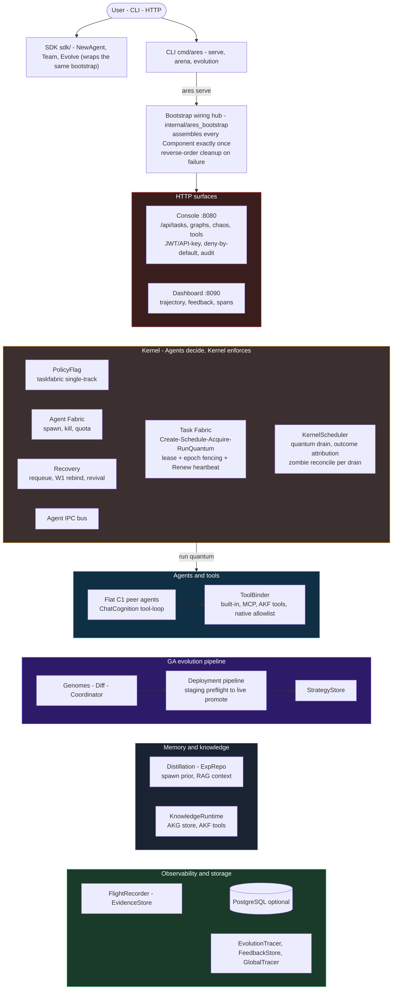
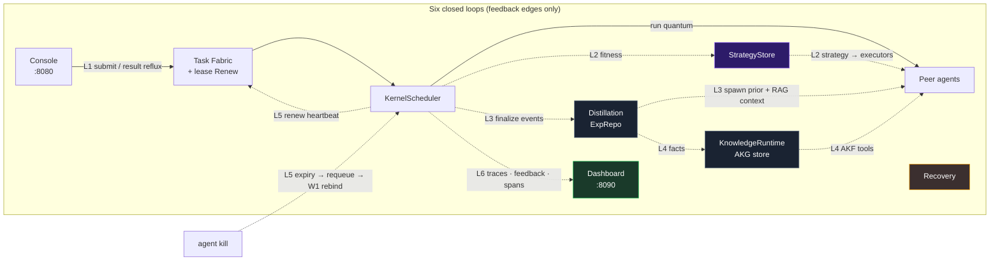
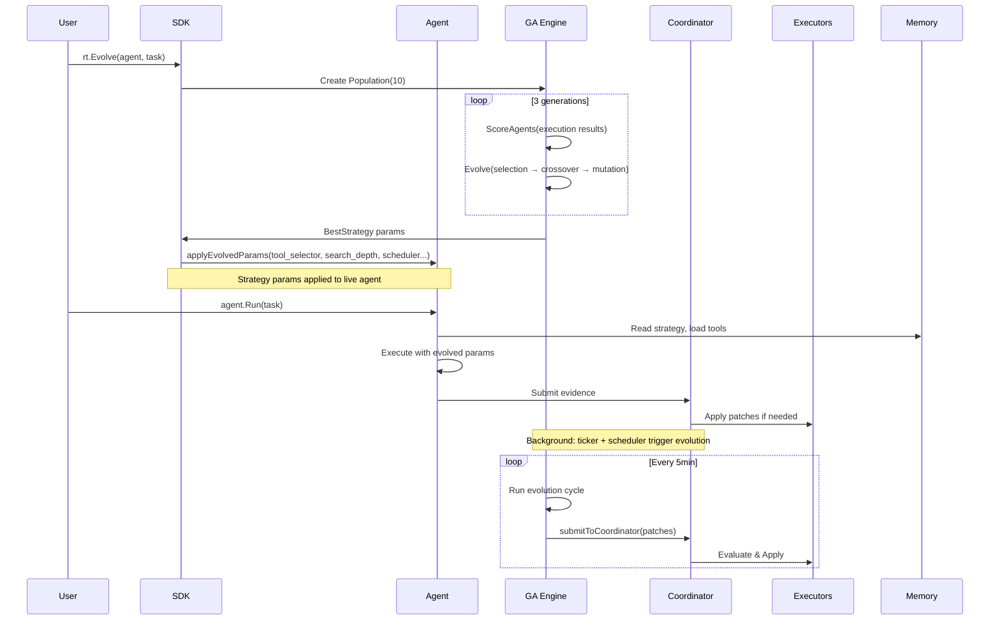

```shell
           _____  ______  _____ 
     /\   |  __ \|  ____|/ ____|
    /  \  | |__) | |__  | (___  
   / /\ \ |  _  /|  __|  \___ \ 
  / ____ \| | \ \| |____ ____) |
 /_/    \_\_|  \_\______|_____/ 

```

[](go.mod)
[](https://github.com/Timwood0x10/ares/actions/workflows/ci.yml)
[](https://github.com/Timwood0x10/ares/actions/workflows/agentos_ci.yml)
[](https://codecov.io/gh/Timwood0x10/ares)

**⚠️  WARNING: AKG (Adaptive Knowledge Graph) is in BETA EXPERIMENTAL STAGE**

This is the **FIRST attempt to build a knowledge graph WITHOUT relying on LLMs**. The current implementation uses:
- Rule-based relation extraction (regex patterns, no generative AI)
- Hybrid search (BM25-style lexical + vector cosine similarity)
- Deterministic quality scoring (no LLM evaluation)

Feature status: **EXPERIMENTAL — API may change, not production-ready**. Please use for experimentation and feedback only.

---
**ARES** — Agent Operating System (AgentOS).

Agents are autonomous cognitive processes, not functions invoked by an orchestrator. They independently create work, communicate as peers, maintain private cognitive state, and may spawn other agents. The ARES Kernel provides scheduling, synchronization, IPC, resource enforcement, lifecycle management, and recovery.

> **Agents decide. The Kernel enforces.**
> **Agent death is an execution failure, not a task failure.**

In practice: tasks are durable and outlive their executors (lease + epoch fencing + checkpoint + event-sourced recovery); execution is scheduled in cooperative semantic quanta (reason → tool → observe → checkpoint → yield); and scheduling policies — capability matching, load, confidence, priority — evolve in production without restarts. Built in Go with a unified SDK, DAG workflow, chaos engineering, and MCP support.

## Quick Start

```go
package main

import (
    "context"
    "fmt"

    "github.com/Timwood0x10/ares/sdk"
)

func main() {
    rt := sdk.MustNew() // auto-detects Ollama / OPENAI_API_KEY / ANTHROPIC_API_KEY; use sdk.New(opts...) for fine-grained config
    defer rt.Close()

    agent := rt.NewAgent("assistant", sdk.WithInstruction("You are helpful."))
    result, _ := agent.Run(context.Background(), "hello")
    fmt.Println(result.Output)
}
```

Install the CLI:

```bash
go install github.com/Timwood0x10/ares/cmd/ares@latest
ares doctor
ares run -c ares.yaml "What is Go?"
```

Or assemble from a YAML config in code — one option loads everything:

```go
rt := sdk.NewRuntime(sdk.WithConfig("ares.yaml")) // LLM / memory / distillation / evolution / tools, all from one file
defer rt.Close()
// Or honor the ARES_YAML env var (falls back to ./ares.yaml):
// rt := sdk.NewRuntime(sdk.WithConfigFromEnv())
```

> 📖 **Config guide**: see [config.yaml Guide (EN)](docs/articles/en/25-config-yaml-guide.en.md) / [config.yaml 配置指南 (中文)](docs/articles/zh/25-config-yaml-guide.zh.md) for the full reference — LLM, distillation, GA evolution, knowledge, tools, and chaos-related switches.

Or run examples directly:

```bash
git clone https://github.com/Timwood0x10/ares
cd ares
make quickstart        # go run examples/01-quickstart
make examples          # build all examples
```

## Features

| Feature | Description |
|---|---|
| **Unified SDK** | Single `sdk.MustNew()` API for LLM, tools, memory, evolution |
| **Runtime Evolution** | Genome + Diff Engine + Coordinator evolve DAG, scheduler, planner, recovery in production |
| **Strategy GA** | Population-based strategy optimization — NSGA-II multi-objective, steady-state, uniform/two-point/segment crossover, 6 mutation types |
| **Evidence-Driven** | Every runtime event (flight, chaos, fitness) feeds into evolution decisions |
| **DAG Workflow** | Dynamic graphs with conditional branching and recovery |
| **Chaos Resilient** | Fault injection, failover, survival testing, self-healing |
| **Memory** | Session context, task distillation, vector similarity search |
| **AKG (Experimental)** | LLM-free knowledge graph — rule-based extraction + hybrid retrieval + quality gate |
| **MCP Ready** | Connect any Model Context Protocol server for tools and data |
| **Multi-Agent** | Capability-based agent registration (`RegisterAgent`) + task dispatch (`Submit`) with peer IPC and recovery |
| **Observability** | OpenTelemetry traces, structured logs, Prometheus metrics |

## AKG — Knowledge Graph Without LLMs (Experimental)

**⚠️ AKG (Adaptive Knowledge Graph) is in BETA EXPERIMENTAL stage. The API may change; it is not production-ready. Use it for experimentation and feedback.**

### Exploration goal

AKG is an experiment with one question: **can we build a precise, queryable knowledge graph from source material WITHOUT a generative LLM in the extraction loop?** The current pipeline uses only embeddings + rules + deterministic scoring — no LLM calls during the write/build/retrieve path. The goal is to measure how far rule-based extraction and hybrid retrieval can go before an LLM becomes a necessity, and to keep the knowledge layer cheap, reproducible, and fully offline-capable.

### How the LLM-free loop works

```
Write:  source → KnowledgeObject (Raw/Normalized/Summary) → RelationExtractor (rules)
                → EmbeddingService → QualityGate → KnowledgeStore
Retrieve: query → EmbeddingService → HybridSearch (0.7·vector + 0.3·lexical)
                → ranked KnowledgeObjects → ContextSnippet
Inject:   ContextSnippets → the Agent's reasoning LLM (the ONLY place an LLM is involved)
```

The LLM never participates in extraction or build — it only consumes the retrieved facts at inference time.

### Current capabilities (no LLM in the loop)

- **Three-layer `KnowledgeObject`** (Raw → Normalized → Summary) with evidence/provenance tracing.
- **Rule-based relation extraction** over a closed predicate vocabulary: `calls`, `fixes`, `depends_on`, `belongs_to`, `similar_to`, `supersedes`, `causes`, `related_to`.
- **Multi-dimensional QualityGate** (extraction / consistency / freshness / usage) driving a `candidate → active → superseded/rejected` lifecycle with promotion.
- **HybridSearch**: vector cosine + lexical Jaccard, filtered by namespace and status.
- **Multi-backend persistence**: Memory, SQLite, PostgreSQL, **MySQL** (driver-free).

### Honest limitations

- No entity disambiguation — two facts about "Redis" are not merged into one entity.
- No semantic relation inference — only rule-pattern matches are extracted.
- No abstractive summarization — `Summary` is extracted/normalized text, not LLM-generated.
- Rule regexes can be greedy on unusual formatting.
- Vector recall is in-process brute-force cosine — fine for tens of thousands of vectors, not millions.

### Extensibility — the architecture is open

| Extension point | What to do | Interface touched |
|---|---|---|
| **New database backend** | Add `internal/knowledge/store/<name>/store.go` implementing `KnowledgeStore`. Shipped: Memory, SQLite, PostgreSQL, **MySQL** (no driver dependency — the consumer blank-imports their MySQL driver). CockroachDB / TiDB / Spanner are one file each. | `KnowledgeStore` (unchanged for new backends) |
| **Professional vector DB** | Implement the `VectorIndex` interface (`Upsert` / `Search` / `Delete`) for pgvector, Milvus, Weaviate, Qdrant. `InMemoryVectorIndex` is the default. Stores delegate recall to a `VectorIndex` internally. | `VectorIndex` (new seam) — **`KnowledgeStore` stays unchanged** |
| **Multi-tenancy** | Every `KnowledgeObject` carries a `Namespace`; `Query`, `HybridSearch`, and `ListByStatus` filter by it, so tenants sharing one store never see each other's facts. | No new interface |

> Design invariant: `KnowledgeStore` is the single persistence contract. Adding a database or a vector index never changes it — only new implementations appear. This is what keeps the upper runtime logic untouched as the storage layer evolves.

## Module Map

> Start from "I want to use capability X" and find the code in one step.

- [Capability–Module Map (English)](docs/CAPABILITY-MAP.en.md)

## CLI

```bash
# Minimal setup — only the LLM endpoint is required; all subsystems
# (agents, memory, tools, storage) are assembled by the runtime from defaults.
ares serve --llm-url https://api.openai.com/v1 --llm-api-key sk-...
ares serve --llm-url http://localhost:11434               # local ollama (no key)
ares serve              # Full agent monitoring from config file (LLM + MCP + dashboard)
ares arena run/validate/list/serve/survival/inspect  # Chaos engineering scenarios
ares evolution run/status         # Runtime evolution
ares flight inspect/replay        # Inspect and replay task recordings
ares knowledge build <goal>       # Build a knowledge graph (via HTTP API)
ares recall query/round           # Query and step through recorded task memory
ares mcp-null serve     # Start minimal MCP null server (stdio)
ares db migrate/setup-test/create-table/check-rls  # Database management
ares auth token         # Issue / inspect JWT tokens
ares init               # Scaffold a new project (main.go + ares.yaml)
ares run                # Run agent from config file
ares bench              # Quick performance benchmark
ares doctor             # Diagnose environment (LLM key, Ollama, Git)
ares status             # Show runtime status at a glance (config / agents / kernel policy)
ares version            # Show version
```

## SDK

```go
rt, err := sdk.New(
    sdk.WithOpenAI("gpt-4o-mini"),          // or WithOllama, WithAnthropic
    sdk.WithDefaultMemory(),                 // session history
    sdk.WithEvolution(),                     // strategy evolution
    sdk.WithMCP(sdk.MCPConn{                 // MCP server tools
        Name: "my-server", Command: "/path/to/server", Args: []string{"serve"},
    }),
)
if err != nil {
    log.Fatal(err)
}
defer rt.Close()

// Agent with tools and human-in-the-loop.
agent := rt.NewAgent("assistant",
    sdk.WithInstruction("You are helpful."),
    sdk.WithTools(calculatorTool, weatherTool),
    sdk.WithHumanInput(approveFn),
)
result, _ := agent.Run(ctx, "Calculate 15*23")

// Streaming response.
ch, _ := agent.Stream(ctx, "Tell me a story")
for chunk := range ch { fmt.Print(chunk.Content) }

// Multi-agent: register capabilities and submit tasks.
rt.RegisterAgent("researcher", sdk.WithInstruction("You research."))
rt.RegisterAgent("writer", sdk.WithInstruction("You write."))
result, _ := rt.Submit(ctx, sdk.Task{Capability: "researcher", Input: "Find sources on Go."})
```

See [examples/README.md](examples/README.md) for hands-on examples, including
[27-peer-spawn-demo](examples/27-peer-spawn-demo/) — a real LLM autonomously
decomposing a task via the kernel syscalls.

## Agent-OS Primitives (2026-08)

Platform-level primitives added since 0.3.0, all additive and tested. They are
the "agent OS" building blocks distilled from the prime-agent comparison.

| Primitive | Package / API | Purpose |
|-----------|---------------|---------|
| Active tools subset | `internal/tools/resources/core`: `Registry.SetActiveTools` / `ActiveTools` / `ClearActiveTools` | Advertise only the active tool subset to the LLM (progressive disclosure) |
| Native command discovery | `internal/tools/discovery` | Probe `command -v` + `--help` for allowlisted host commands and expose them as tools (`ARES_NATIVE_TOOLS`) |
| Peer messaging | `internal/agents/peer` | Direct agent-to-agent message registry + delivery |
| Small-step evolution | `internal/ares_evolution/refine` | Baseline-checked, rollback-capable supplement-state updates (plan → apply → rollback) |
| Runtime state snapshot | `internal/ares_runtime`: `SaveStateSnapshot` / `LoadStateSnapshot` | Versioned runtime state snapshots via CheckpointStore (schema-version guarded) |
| Capability Fabric (SkillCatalog) | `internal/ares_skills`: `Catalog` / `SourceManager` / `Indexer` / `Discovery` / `Loader` / `Resolver` / `Experience` | Skill = capability package: declared-source metadata index (no disk scanning), progressive disclosure metadata → SKILL.md → resources, trust-gated tool resolution (MCP / Executable / Builtin), learned-source relevance priors |
| Output guard | `internal/agents/outputguard` | Reject structurally inconsistent agent results at the boundary |
| Run budgets | `sdk.WithMaxTokens` / `sdk.WithTimeout` (agentloop) | Bounded autonomous execution (token + wall-clock caps) |
| Fingerprint cache | `internal/ares_arena`: `WithFingerprint` | Skip re-running regression when the environment is unchanged |
| Skills (progressive disclosure) | `internal/knowledge/skills` | Description resident in context; detail loaded on demand |
| Session lease | `internal/agents/lease` | Exclusive expiring holds for concurrent session access |
| Action log | `internal/agents/actionlog` | Append-only, replayable action store for audit/recovery |
| Task Fabric | `internal/taskfabric` | Durable Task state machine + Lease/fencing (epoch) + capability-aware Scheduler (Score/Pick/Schedule) + Work Stealing + DAG ReadyTasks + cooperative preempt (0.3.0 Kernel Scheduler pillar) |
| Agent Fabric | `internal/agentfabric` | spawn/suspend/resume/retire/kill/recover + Process Tree (provenance, not hierarchy) + Cognitive State + 3-layer Context + P5 resource quota (`WithResourceBudget`) (0.3.0 Kernel Lifecycle pillar) |
| Agent IPC | `internal/agentipc` | Peer Send/Request/Reply/Delegate/Handoff/Subscribe + policy-gated dispatch (single-track taskfabric; legacy leader path removed) (0.3.0 Kernel IPC pillar) |
| Runtime Recovery | `internal/aresrecovery` | lease-expiry requeue / checkpoint resume / agent restart / Chaos fault-injection validation (**Agent death ≠ Task death**) |
| Kernel assembly | `cmd/ares/kernel.go` + `scheduler.go` | `wireKernelDispatcher`/`wireKernelPolicy`/`kernelScheduler` — config `kernel.policy` (`taskfabric`) + `subagents[].dependencies` DAG wiring |

Wiring: output guard validates sub-agent results; native tools and the peer
registry are wired in `cmd/ares/serve.go`; state snapshots ride workflow
checkpoints; strategy feedback flows through the refine trail; run budgets are
exposed via the SDK options above.

## Articles

Deep dives into ARES internals:

| English | 中文 |
|---|---|
| [Architecture](docs/articles/en/01-architecture-overview-deep-dive.md) | [架构](docs/articles/zh/01-architecture-overview-deep-dive.md) |
| [Agent Harmony](docs/articles/en/02-agent-harmony-protocol.md) | [Agent 通信协议](docs/articles/zh/02-agent-harmony-protocol.md) |
| [Memory & Distillation](docs/articles/en/03-memory-distillation-deep-dive.md) | [记忆与蒸馏](docs/articles/zh/03-memory-distillation-deep-dive.md) |
| [Workflow Engine](docs/articles/en/04-workflow-engine-deep-dive.md) | [工作流引擎](docs/articles/zh/04-workflow-engine-deep-dive.md) |
| [Tool System](docs/articles/en/05-tool-system-deep-dive.md) | [工具系统](docs/articles/zh/05-tool-system-deep-dive.md) |
| [Security & Observability](docs/articles/en/06-security-observability-deep-dive.md) | [安全与可观测性](docs/articles/zh/06-security-observability-deep-dive.md) |
| [Runtime Lifecycle](docs/articles/en/07-runtime-lifecycle-deep-dive.md) | [运行时生命周期](docs/articles/zh/07-runtime-lifecycle-deep-dive.md) |
| [Event System](docs/articles/en/08-event-system-deep-dive.md) | [事件系统](docs/articles/zh/08-event-system-deep-dive.md) |
| [Chaos Arena](docs/articles/en/09-arena-fault-injection-deep-dive.md) | [混沌测试](docs/articles/zh/09-arena-fault-injection-deep-dive.md) |
| [Retrieval System](docs/articles/en/10-retrieval-system-deep-dive.md) | [检索系统](docs/articles/zh/10-retrieval-system-deep-dive.md) |
| [Autonomous Evolution](docs/articles/en/11-autonomous-evolution-deep-dive.md) | [自主进化](docs/articles/zh/11-autonomous-evolution-deep-dive.md) |
| [Security Hardening](docs/articles/en/12-security-hardening-deep-dive.md) | [安全加固](docs/articles/zh/12-security-hardening-deep-dive.md) |
| [Bootstrap & API](docs/articles/en/13-bootstrap-api-deep-dive.md) | [Bootstrap 与 API](docs/articles/zh/13-bootstrap-api-deep-dive.md) |
| [Plugin System](docs/articles/en/14-plugin-system-deep-dive.md) | [插件系统](docs/articles/zh/14-plugin-system-deep-dive.md) |
| [MCP Integration](docs/articles/en/15-mcp-integration-deep-dive.md) | [MCP 集成](docs/articles/zh/15-mcp-integration-deep-dive.md) |
| [Flight Recorder](docs/articles/en/16-flight-recorder-deep-dive.md) | [Flight Recorder](docs/articles/zh/16-flight-recorder-deep-dive.md) |
| [SDK Layer](docs/articles/en/17-sdk-layer.md) | [SDK 层](docs/articles/zh/17-sdk-layer.md) |
| [Knowledge Graph Build](docs/articles/en/18-knowledge-graph-build.md) | [知识图谱构建](docs/articles/zh/18-knowledge-graph-build.md) |
| [Storage Layer](docs/articles/en/19-storage-layer.md) | [存储层](docs/articles/zh/19-storage-layer.md) |
| [LLM Client Layer](docs/articles/en/20-llm-client-layer.md) | [LLM 客户端层](docs/articles/zh/20-llm-client-layer.md) |
| [Evaluation Framework](docs/articles/en/21-evaluation-framework.md) | [评估框架](docs/articles/zh/21-evaluation-framework.md) |
| [Config System](docs/articles/en/22-config-system.md) | [配置系统](docs/articles/zh/22-config-system.md) |
| [Quant Trading Module](docs/articles/en/23-quant-trading.md) | [量化交易模块](docs/articles/zh/23-quant-trading.md) |
| [GA Deep Dive](docs/articles/en/24.1-ga-deep-dive.md) | [GA 深度解析](docs/articles/zh/24.1-ga-deep-dive.md) |
| [GA Tiered Scorer](docs/articles/en/24.2-ga-tiered-scorer.md) | [GA 分层评分](docs/articles/zh/24.2-ga-tiered-scorer.md) |
| [GA Selection Benchmark](docs/articles/en/24.3-ga-selection-benchmark.md) | [GA 选择算子对比](docs/articles/zh/24.3-ga-selection-benchmark.md) |
| [GA Promoter](docs/articles/en/24.4-ga-promoter.md) | [GA 晋升系统](docs/articles/zh/24.4-ga-promoter.md) |
| [GA Genealogy](docs/articles/en/24.5-ga-genealogy.md) | [GA 谱系记录](docs/articles/zh/24.5-ga-genealogy.md) |
| [GA in the Trenches](docs/articles/en/24.6-ga-in-the-trenches.md) | [GA 实战经验](docs/articles/zh/24.6-ga-in-the-trenches.md) |
| [config.yaml Guide](docs/articles/en/25-config-yaml-guide.en.md) | [config.yaml 配置指南](docs/articles/zh/25-config-yaml-guide.zh.md) |

## Architecture

### Closed-Loop Runtime Architecture (ultimate view)

Two views: the **component map** (forward wiring, top to bottom in bootstrap order) and the **six feedback loops** that close back onto the runtime. Every loop is regression-locked (table below).

**Component map**


```mermaid
flowchart TB
    USER(["User - CLI - HTTP"])

    USER --> SDK["SDK sdk/ - NewAgent, Team, Evolve (wraps the same bootstrap)"]
    USER --> CLI["CLI cmd/ares - serve, arena, evolution"]
    CLI -- "ares serve" --> BOOT

    BOOT["Bootstrap wiring hub - internal/ares_bootstrap<br/>assembles every Component exactly once<br/>reverse-order cleanup on failure"]

    BOOT --> HTTPG

    subgraph HTTPG["HTTP surfaces"]
        API["Console :8080<br/>/api/tasks, graphs, chaos, tools<br/>JWT/API-key, deny-by-default, audit"]
        DASH["Dashboard :8090<br/>trajectory, feedback, spans"]
    end

    HTTPG ~~~ KERNELG

    subgraph KERNELG["Kernel - Agents decide, Kernel enforces"]
        POLICY["PolicyFlag<br/>taskfabric single-track"]
        FABRIC["Task Fabric<br/>Create-Schedule-Acquire-RunQuantum<br/>lease + epoch fencing + Renew heartbeat"]
        SCHED["KernelScheduler<br/>quantum drain, outcome attribution<br/>zombie reconcile per drain"]
        AFAB["Agent Fabric<br/>spawn, kill, quota"]
        REC["Recovery<br/>requeue, W1 rebind, revival"]
        IPC["Agent IPC bus"]
        POLICY --> FABRIC
        AFAB --> FABRIC
        REC --> FABRIC
        IPC --> FABRIC
        FABRIC --> SCHED
    end

    KERNELG -- "run quantum" --> AGENTSG

    subgraph AGENTSG["Agents and tools"]
        AG["Flat C1 peer agents<br/>ChatCognition tool-loop"]
        BIND["ToolBinder<br/>built-in, MCP, AKF tools, native allowlist"]
        AG --> BIND
    end

    AGENTSG ~~~ EVOG

    subgraph EVOG["GA evolution pipeline"]
        GAD["Genomes - Diff - Coordinator"]
        DEP["Deployment pipeline<br/>staging preflight to live promote"]
        STRAT["StrategyStore"]
        GAD --> DEP
        DEP --> STRAT
    end

    EVOG ~~~ MEMKG

    subgraph MEMKG["Memory and knowledge"]
        DIS["Distillation - ExpRepo<br/>spawn prior, RAG context"]
        KR["KnowledgeRuntime<br/>AKG store, AKF tools"]
    end

    MEMKG ~~~ OBSG

    subgraph OBSG["Observability and storage"]
        FLY["FlightRecorder - EvidenceStore"]
        TRC["EvolutionTracer, FeedbackStore, GlobalTracer"]
        PG[("PostgreSQL optional")]
        FLY -.-> PG
    end

    style KERNELG fill:#3b2f2f,stroke:#f59e0b,color:#fff
    style AGENTSG fill:#0f2f44,stroke:#38bdf8,color:#fff
    style EVOG fill:#2d1b69,stroke:#8b5cf6,color:#fff
    style MEMKG fill:#1a2332,stroke:#94a3b8,color:#fff
    style OBSG fill:#1a3a2a,stroke:#22c55e,color:#fff
    style HTTPG fill:#3a1e1e,stroke:#ef4444,color:#fff
```

**The six closed loops** (dashed edges = feedback closing back on the runtime)


```mermaid
flowchart LR
    subgraph LOOPS["Six closed loops (feedback edges only)"]
        direction TB
        API["Console<br/>:8080"]
        FABRIC["Task Fabric<br/>+ lease Renew"]
        SCHED["KernelScheduler"]
        AG["Peer agents"]
        STRAT["StrategyStore"]
        DIS["Distillation<br/>ExpRepo"]
        KR["KnowledgeRuntime<br/>AKG store"]
        REC["Recovery"]
        DASH["Dashboard<br/>:8090"]
    end

    API -- "L1 submit / result reflux" --> FABRIC
    FABRIC --> SCHED -- "run quantum" --> AG

    SCHED -. "L2 fitness" .-> STRAT
    STRAT -. "L2 strategy → executors" .-> AG

    SCHED -. "L3 finalize events" .-> DIS
    DIS -. "L3 spawn prior + RAG context" .-> AG

    DIS -. "L4 facts" .-> KR
    KR -. "L4 AKF tools" .-> AG

    AFABK["agent kill"] -. "L5 expiry → requeue → W1 rebind" .-> SCHED
    SCHED -. "L5 renew heartbeat" .-> FABRIC

    SCHED -. "L6 traces · feedback · spans" .-> DASH

    style STRAT fill:#2d1b69,stroke:#8b5cf6,color:#fff
    style DIS fill:#1a2332,stroke:#64748b,color:#fff
    style KR fill:#1a2332,stroke:#64748b,color:#fff
    style REC fill:#3b2f2f,stroke:#f59e0b,color:#fff
    style DASH fill:#1a3a2a,stroke:#22c55e,color:#fff
```

The six loops, and what locks them shut:

| Loop | Closed path | Regression lock |
|------|-------------|-----------------|
| **L1** task | `POST /api/tasks` → Fabric → scheduler quantum (lease renewed while running) → result reflux through checkpoint | `TestGraphsEndpoint*`, `TestSchedulerRenewsLeaseDuringLongQuantum` |
| **L2** strategy | flight fitness → evidence → GA genome → diff → coordinator → deployment pipeline (**staging never mutates live state**) → StrategyStore → **StrategySource injected into every executor** | `TestDeploymentStaging_DoesNotMutateLiveRegistry`, `TestUpdateLiveDAG_WiredFromServeShape` |
| **L3** distillation | task-finalize events → distillation → experience repo → spawn prior (G1) + RAG retrieval | bootstrap closure suite |
| **L4** knowledge | DistillBridge → AKG store → shared KnowledgeRuntime ↔ AKF tools; knowledge patches hit the same instance (`recovery.strategy` target registered) | `TestUpdateLiveDAG_*`, patch-registry tests |
| **L5** recovery | kill → lease expiry (heartbeat-aware) → requeue → W1 replacement bound → checkpoint resume; zombie registrations swept per drain | `TestReconcileFabricDeaths_*`, `TestSchedulerAttributesFailureAsFailure` |
| **L6** observability | runtime hooks write tracers/feedback/spans → Dashboard APIv2 (**now actually listening on :8090**) reads them live | bootstrap dashboard tests |


### Runtime Kernel (0.3.0)

ARES evolved from an "Agent Orchestration Framework" into an
**agent-oriented dynamic compute runtime**: **Agents are not orchestrated.
They are scheduled.** The old leader/sub hierarchy is gone — scheduling is now
unified under one Execution Strategy / Policy (`kernel.policy`: `taskfabric` —
the legacy track has been removed).

The Kernel rests on three pillars (`Agents decide the work. Kernel schedules the work.`):

| Pillar | Package | Responsibility |
|--------|---------|----------------|
| **Scheduler** | `internal/taskfabric` | durable Task state machine + Lease/fencing (epoch), capability-aware scoring (`cap×load×conf`), Work Stealing, DAG ReadyTasks as scheduling source, cooperative preempt |
| **IPC** | `internal/agentipc` | peer-level communication (Send/Request/Reply/Delegate/Handoff/Subscribe) + policy-gated dispatch (single-track taskfabric) |
| **Lifecycle** | `internal/agentfabric` | spawn/suspend/resume/retire/kill/recover + Process Tree (provenance, not hierarchy) + Cognitive State + P5 resource quota (`WithResourceBudget`) |

- **DAG as scheduling source**: planner-produced `subagents[].dependencies`
  are resolved into `models.Task.Context.Dependencies` by the planner,
  carried through the kernel dispatch, and submitted to the fabric with the
  DAG edges — a task whose dependencies are not yet complete is registered
  but not executed; `kernelScheduler`'s `ReadyTasks` picks it up once they
  finish.
- **single-track kernel dispatch**: `wireKernelDispatcher`/`wireKernelPolicy`
  assemble the taskfabric dispatcher at startup — the legacy leader path and
  its live mid-run flip have been removed.
- **Recovery**: `internal/aresrecovery` — lease-expiry requeue / checkpoint
  resume / agent restart, proving **Agent death ≠ Task death**; Chaos
  fault-injection validates the Runtime recovers.

Full design: [ARES Runtime 设计文档](docs/zh/architecture/ares-runtime.md) / [ARES Runtime Design](docs/en/architecture/ares-runtime.md) (authoritative model, bilingual).

## Data Flow


```mermaid
sequenceDiagram
    participant U as User
    participant S as SDK
    participant A as Agent
    participant GA as GA Engine
    participant C as Coordinator
    participant E as Executors
    participant M as Memory

    U->>S: rt.Evolve(agent, task)
    S->>GA: Create Population(10)
    loop 3 generations
        GA->>GA: ScoreAgents(execution results)
        GA->>GA: Evolve(selection → crossover → mutation)
    end
    GA->>S: BestStrategy params
    S->>A: applyEvolvedParams(tool_selector, search_depth, scheduler...)

    Note over S,A: Strategy params applied to live agent

    U->>A: agent.Run(task)
    A->>M: Read strategy, load tools
    A->>A: Execute with evolved params
    A->>C: Submit evidence
    C->>E: Apply patches if needed

    Note over GA,C: Background: ticker + scheduler trigger evolution
    loop Every 5min
        GA->>GA: Run evolution cycle
        GA->>C: submitToCoordinator(patches)
        C->>E: Evaluate & Apply
    end
```

## Cookbook

| Recipe | Code |
|---|---|
| [Chat Agent](docs/cookbook/chat.md) | 20-line conversational agent |
| [Tool Calling](docs/cookbook/tool.md) | Custom tools for LLM function calling |
| [Multi-Agent](docs/cookbook/multi-agent.md) | Capability-based registration and task dispatch |
| [Memory](docs/cookbook/memory.md) | Persistent conversation context |
| [Coding Agent](docs/cookbook/coding.md) | Code generation with specialized instructions |
| [Code Review](docs/cookbook/review.md) | Automated PR review |
| [GitHub Agent](docs/cookbook/github.md) | Issue and PR automation |

## Runtime Evolution

ARES's runtime evolution system is **evidence-driven**: every execution, fault, and insight produces `Evidence`, which feeds into the evolution cycle. The system evolves DAG topology, scheduler selection, knowledge planner parameters, and recovery strategies — all in production, without restarts.

### Architecture

```
Execution → Evidence → Genome → Candidate → Diff Engine → RuntimePatch → Coordinator → Apply
```

| Component | Role | Sources |
|-----------|------|---------|
| **5 Genomes** | Generate candidate configurations via mutation + crossover | workflow, scheduler, knowledge, recovery, prompt |
| **4 Differs** | Compare old vs new snapshots → produce RuntimePatches | workflow, knowledge, scheduler, recovery |
| **Coordinator** | Decides Apply/Reject/Delay for each PatchProposal | GA, Chaos, AKF, LLM, Human, K8s, Rule |
| **3 Executors** | Apply patches to live runtime | Graph, Knowledge, Recovery |
| **LLM Adapter** | Converts natural-language suggestions into PatchProposals | parsed format → Coordinator |

**Key design**: LLM is a **participant**, not a controller. The Coordinator treats all 7 `PatchSource` values equally. No source has privileged access.

### Benchmarks (Apple M3 Max, darwin/arm64, 2026-08-25)

```
=== Runtime Evolution (internal/evolution) ===
BenchmarkWorkflowGenome_Mutate     152k    7.92µs  11.9KB  157 allocs
BenchmarkKnowledgeGenome_Mutate    2.67M    440ns    960B   11 allocs
BenchmarkRecoveryGenome_Mutate     2.35M    521ns   1.28KB  21 allocs
BenchmarkDiffEngine_Workflow       2.68M    448ns    304B    3 allocs
BenchmarkCoordinator_Evaluate       188M   6.33ns      0B    0 allocs
BenchmarkFullEvolutionCycle        277k    4.26µs   7.3KB   90 allocs

=== Event System (internal/ares_events) ===
BenchmarkMemoryStore_Append           2.24M   519ns    618B    7 allocs
BenchmarkMemoryStore_AppendBatch      300k   3.74µs   8.9KB    1 alloc
BenchmarkMemoryStore_Read             231k   5.40µs  17.5KB   11 allocs
BenchmarkMemoryStore_ConcurrentAppend 1.67M   704ns    625B    6 allocs

=== Evaluation Framework (internal/ares_eval) ===
BenchmarkExactMatchEvaluator_Evaluate     490M   2.41ns     0B     0 allocs
BenchmarkToolUsageEvaluator_Evaluate     38.4M  32.3ns     0B     0 allocs
BenchmarkAgentTestRunner_RunSingle        3.92M   306ns   320B     5 allocs
BenchmarkReportGenerator_GenerateMarkdown 351k   3.45µs  4.3KB   76 allocs
BenchmarkLoader_Load                      24.8k  49.3µs  34.1KB  601 allocs

=== AKG Knowledge Fabric (internal/knowledge) ===
--- Linkers (100 objs) ---
DecisionLinker                      73.4k  16.6µs  10.9KB  295 allocs
ArchitectureLinker                  30.0k  40.8µs 167.0KB   85 allocs
TimelineLinker                      646k    1.83µs   3.1KB   11 allocs
SimilarityLinker                     636   1.87ms   4.7MB 20217 allocs
--- Compiler (100 nodes) ---
DefaultCompiler Prompt              25.9k  46.6µs  73.3KB  819 allocs
DefaultCompiler All Formats         4.97k   248µs 365.2KB 3476 allocs
--- Memory Store ---
Store_Save                          1.78M   622ns    679B   11 allocs
Store_Get                          21.7M   54.7ns     13B    1 alloc
Store_QueryByType                   202k    5.77µs   4.5KB   11 allocs
Store_Search                        16.0k  76.0µs  69.4KB 1514 allocs
--- Pipeline ---
DefaultNormalizer_Normalize         2.28M   497ns    688B   10 allocs
--- Planner ---
KnowledgePlanner_Plan               1.72M   691ns   1.0KB   14 allocs
--- Retriever (end-to-end, 100 objs) ---
Retrieve                             126   9.23ms  16.2MB 129671 allocs

=== Kernel (internal/taskfabric · agentfabric · agentipc) ===
--- Task Fabric (internal/taskfabric) ---
Fabric_Create             2.59M    389ns    931B     3 allocs
Fabric_Schedule           1.54M    800ns   1.85KB   18 allocs
Fabric_RunQuantum         796k    1.60µs   3.7KB    23 allocs
Fabric_ReadyTasks         3.25M    359ns    960B     4 allocs
Fabric_IsReady           78.7M   15.0ns      0B     0 allocs
--- Agent Fabric (internal/agentfabric) ---
Fabric_Spawn              3.11M    385ns    936B    10 allocs
Fabric_SpawnWithResources 1.58M    762ns   1.48KB   14 allocs
Fabric_SuspendResume     45.9M   24.7ns      0B     0 allocs
Fabric_Children          46.0M   26.5ns     80B     1 alloc
--- IPC (internal/agentipc) ---
Bus_Send                 8.28M    143ns    280B     4 allocs
Bus_RequestReply         1.00M   1.10µs    912B    14 allocs
Bus_Broadcast (10 subs)   840k   1.49µs   3.0KB    41 allocs
DualTrackDispatch         121M    9.9ns      0B     0 allocs

=== Observability & Recovery (internal/aresrecovery) ===
GlobalTracer_TraceTask                   16.0M  85.4ns   247B     0 allocs
GlobalTracer_TraceMessage                14.0M  91.2ns   282B     0 allocs
GlobalTracer_Spans (200 spans)           784k   1.40µs  10.0KB    5 allocs
Sandbox_ReplayRecoveryChain              457k   2.69µs   6.9KB   60 allocs
Sandbox_SimulateAgentDeath               589k   2.03µs   4.8KB   47 allocs
```

### CLI

```bash
ares evolution status   # Show genomes, differs, coordinator state
ares evolution run      # Run one evolution cycle
```

### Examples

```bash
go run examples/11-knowledge-import/ --dir ./notes          # Ingest markdown into pgvector
go run examples/11-knowledge-import/ --ask "question"       # RAG query against KB
go run examples/11-knowledge-import/ --evolve "task"        # GA evolution on import
go run examples/11-knowledge-import/ --chat                 # Interactive chat with tools
go run examples/11-knowledge-import/ --team --dir ./notes   # Multi-agent import
go run examples/11-knowledge-import/ --chaos-fail 0.3       # With fault injection
go run examples/11-knowledge-import/akg/                    # Build AKG from KB
go run examples/runtime_evolution/basic/      # Full end-to-end evolution demo
go run examples/runtime_evolution/knowledge/  # Knowledge parameter evolution
go run examples/runtime_evolution/full/       # All 4 genomes + real executors
```

## Strategy Evolution (GA)

Beyond runtime-level evolution, ARES includes a **strategy-level Genetic Algorithm** that optimizes agent inference parameters (temperature, top_k, prompt templates, tool configs) through population-based search. The system evolves a population of strategies across generations using selection, crossover, and mutation, with zero-cost background evolution cycles.

### Key Features

| Feature | Description |
|---|---|
| **NSGA-II Multi-Objective** | 4 default dimensions (success_rate 0.40, quality 0.25, cost 0.20, latency 0.15) with direction-aware Pareto dominance |
| **Steady-State GA** | Configurable replace rate (0.1–0.5, default 0.3) — replaces only the worst individuals each generation |
| **Score / SelectionScore** | Canonical score preserved; selection score adjusted by fitness sharing for diversity |
| **Fitness Sharing** | 3 strategies — full O(n²), reservoir sampling, spatial grid index (for >500 individuals) |
| **3 Crossover Types** | Uniform (per-gene), Two-Point (swap segment), Segment (contiguous block) |
| **6 Mutation Types** | Parameter, Prompt, Tool, Swap, Inversion, Scramble |
| **Evolution Callbacks** | OnGeneration / OnFitness / OnMutation / OnCrossover |
| **Termination** | MaxGenerations + TargetFitness (stops when BestEverScore ≥ target) |
| **Generation History** | Per-generation snapshots with metadata |
| **Experience System** | 3-tier pipeline: ToolCallRecord → RawExperience → NormalizedExperience → EvolutionHint → GuidanceProvider |

### Benchmarks (Apple M3 Max, darwin/arm64, 2026-08-25)

```
=== GA Genome (internal/ares_evolution/genome) ===
CrossoverUniform (10 params)        500k    2.46µs   3.1KB   31 allocs
CrossoverUniform (100 params)       61.5k  17.8µs   21.2KB  38 allocs
TruncationSelection (pop=100)       209k    5.82µs   952B     3 allocs
TournamentSelection (pop=50,k=2)    287k    4.45µs  14.4KB  101 allocs
RouletteWheelSelection (pop=100)    422k    2.84µs   3.4KB    7 allocs
Evolve_OneGeneration (pop=100)      4.60M   263ns    344B     6 allocs
Evolve_MultipleGenerations (100)    45.3k  25.9µs  29.6KB  600 allocs
ApplyFitnessSharing (pop=100)        896   1.34ms   540KB  106 allocs
RealWorldEvolution (100 gen)         100  10.05ms   4.4MB 61871 allocs
```

### Examples

```bash
go run examples/10-ga-full-evolution/main.go   # Full GA evolution demo
go run examples/05-evolution-demo/main.go       # Pre-NSGA-II evolution demo
```

## Candidate Release Closed-Loop (0.3.0)

Evolved strategies go through a **layered release gate** via `CandidatePipeline`:

```
NewCandidate → Verify (gate1 static + gate2 evidence + gate3 regression) → Verified
             → Release (coordinator decision + canary) → gate-3 re-check → SetStable → Promoted
```

- **Gate-3 regression check**: `CandidateVerifier` and `CandidatePipeline.Release` share the same `CandidateRegressionChecker` (via `WithRegressionCheck` / `WithReleaseRegressionCheck`), using `LLMArenaScorer` (`internal/ares_evolution/service/llm_arena_scorer.go`) to run a real-LLM preserved-case regression — stable instructions vs the candidate diff — and reject on a statistically significant drop.
- **`BatchScorer` batching**: `ares_arena.BatchScorer` + `LLMArenaScorer.ScoreBatch` collapse all runs of a regression into 2 LLM calls (mitigates low-rpm rate limits).
- **Top-level orchestrator**: `internal/evolution/gate3_orchestrator.go` `BuildRegressionGate3` / `LoadRegressionGate3` assemble `llm.Client` from YAML (ollama / openai providers).

Live runnable examples with full logs: `examples/15-llm-evolution-suite` (real-LLM `scorer` / `regression` / `gate3` / `release` scenarios, each writing `logs/run-<ts>.log`) and the offline, reproducible `examples/19-ga-candidate-e2e`.

## License

Apache 2.0

## Acknowledgments

ARES's genetic algorithm implementation was inspired by the design and features of **[PyGAD](https://github.com/ahmedfgad/GeneticAlgorithmPython)** — the Python genetic algorithm library by [Ahmed F. Gad](https://github.com/ahmedfgad). PyGAD's architecture, operator design, and multi-objective optimization capabilities served as a valuable reference for building the GA engine in this project.

We recommend PyGAD for anyone looking for a mature, well-documented GA library in Python:
- GitHub: [github.com/ahmedfgad/GeneticAlgorithmPython](https://github.com/ahmedfgad/GeneticAlgorithmPython)
- Documentation: [pygad.readthedocs.io](https://pygad.readthedocs.io/)

Additional GA concepts and terminology follow the standard definitions from the [Genetic Algorithm](https://en.wikipedia.org/wiki/Genetic_algorithm) article on Wikipedia.
