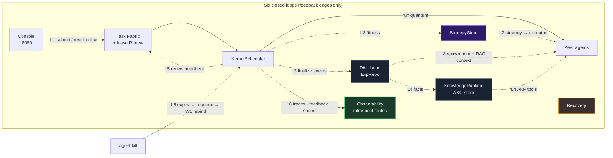
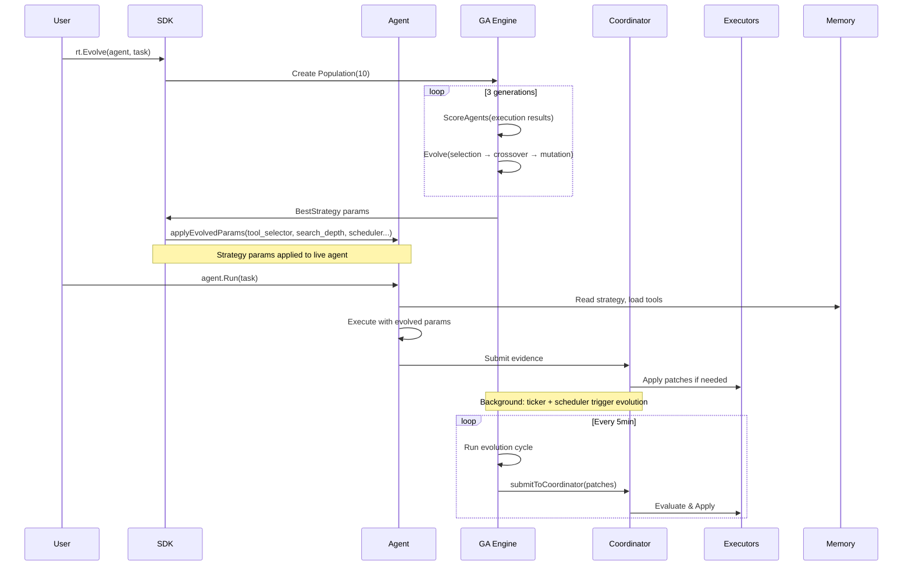

```shell
           _____  ______  _____ 
     /\   |  __ \|  ____|/ ____|
    /  \  | |__) | |__  | (___  
   / /\ \ |  _  /|  __|  \___ \ 
  / ____ \| | \ \| |____ ____) |
 /_/    \_\_|  \_\______|_____/ 

```

[](go.mod)
[](https://github.com/Timwood0x10/ares/actions/workflows/ci.yml)
[](https://github.com/Timwood0x10/ares/actions/workflows/agentos_ci.yml)
[](https://codecov.io/gh/Timwood0x10/ares)

**Status — be precise about what you are getting**

| Area | State |
|---|---|
| Kernel / task fabric / SDK | exercised end-to-end and regression-locked; **not a hardened runtime** |
| GA evolution + patch pipeline | runs end-to-end; the apply gate and the multi-objective entry points are **not wired** |
| **AKG** (Adaptive Knowledge Graph) | **BETA / experimental — API may change, not production-ready** |

AKG is the **first attempt to build a knowledge graph without relying on LLMs**
(rule-based relation extraction, BM25-style lexical + vector hybrid search,
deterministic quality scoring — no generative AI in the extraction loop) and it is
the least finished part of the system. The *Honest limits* section below lists what
this README knows it cannot yet claim; read it before trusting any number or
capability here.

---
**ARES** — Agent Operating System (AgentOS).

Agents are autonomous cognitive processes, not functions invoked by an orchestrator. They independently create work, communicate as peers, maintain private cognitive state, and may spawn other agents. The ARES Kernel provides scheduling, synchronization, IPC, resource enforcement, lifecycle management, and recovery.

> **Agents decide. The Kernel enforces.**
> **Agent death is an execution failure, not a task failure.**

In practice: tasks are durable and outlive their executors (lease + epoch fencing + checkpoint + event-sourced recovery); execution is scheduled in cooperative semantic quanta (reason → tool → observe → checkpoint → yield); and scheduling policies — capability matching, load, confidence, priority — evolve in production without restarts. Built in Go with a unified SDK, DAG workflow, chaos engineering, and MCP support.

## Quick Start

```go
package main

import (
    "context"
    "fmt"

    "github.com/Timwood0x10/ares/api"
)

func main() {
    rt := api.MustNew() // reads ./ares.yaml (the single config entry point); use api.New(opts...) for fine-grained config
    defer rt.Close()

    agent := rt.NewAgent("assistant", api.WithInstruction("You are helpful."))
    result, _ := agent.Run(context.Background(), "hello")
    fmt.Println(result.Output)
}
```

Install the CLI:

```bash
go install github.com/Timwood0x10/ares/cmd/ares@latest
ares doctor
ares run -c ares.yaml "What is Go?"     # one command, human output, zero config flags
```

**One interface, two faces — all configuration lives in `ares.yaml`** (the single config entry point; there are no config flags). The same kernel (scheduler / DAG / GA / memory) is reachable in-process (above) or over HTTP when you run `ares serve` for non-Go callers:

```bash
ares init myproj && cd myproj   # generates ares.yaml incl. a security.api_key
ares serve &                    # boots the full AgentOS kernel from ares.yaml

# submit — the external one-interface entry: {"query": "..."} is enough
curl -sS -X POST localhost:8080/api/tasks \
  -H "Authorization: Bearer <security.api_key from ares.yaml>" \
  -H 'Content-Type: application/json' \
  -d '{"query":"analyze yesterday'"'"'s incidents"}'
# → 202 {"task_id":"...","status":"submitted"}
# bearer = security.api_key (dedicated HTTP credential, generated by ares init);
# when unset it falls back to llm.api_key. With NEITHER set (e.g. ollama,
# which needs no llm.api_key) the write gate answers 401 — deny-by-default,
# loopback included — so set security.api_key before serving.
# capability defaults to server.default_capability — NOTE: audit-only, the
# Submitter normalizes execution to the single L2 capability ares/plan

# read the result — GET /api/tasks/{task_id} (TaskView slim fields + result
# = the session answer on the L2 path; error carries the failure cause on
# FAILED)
curl -sS -H "Authorization: Bearer <security.api_key from ares.yaml>" \
  localhost:8080/api/tasks/<task_id>

# optional: POST /api/tasks?wait=<dur> blocks until the result resolves
# (empty value uses tasks.wait_timeout, default 60s; an explicit value over
# the 300s cap is REJECTED with 400, a configured default over it is clamped;
# expiry still answers 202 with the current state)
```

> The HTTP layer is a thin adapter over the internal submitter — no scheduling logic lives there. `server.default_capability` and `tasks.wait_timeout` are set in ares.yaml like everything else.

Or assemble from a YAML config in code — one option loads everything:

```go
rt := api.NewRuntime(api.WithConfig("ares.yaml")) // LLM / memory / distillation / evolution / tools, all from one file
defer rt.Close()
```

> 📖 **Config guide**: see [config.yaml Guide (EN)](docs/articles/en/25-config-yaml-guide.en.md) / [config.yaml 配置指南 (中文)](docs/articles/zh/25-config-yaml-guide.zh.md) for the full reference — LLM, distillation, GA evolution, knowledge, tools, and chaos-related switches.

Or run examples directly:

```bash
git clone https://github.com/Timwood0x10/ares
cd ares
make quickstart        # go run examples/01-quickstart
make examples          # build all examples
```

## Features

| Feature | Description |
|---|---|
| **Unified SDK** | Single `api.MustNew()` API for LLM, tools, memory, evolution; `api.NewRuntime(api.WithConfig("ares.yaml"))` for config-driven assembly |
| **System Runtime lifecycle kernel** | Orchestrator reverse-topological start/stop + component snapshot observability + Degraded on missing deps; serve / start / SDK share one kernel |
| **Evidence persistence** | `evidence.PostgresStore` accumulates GA feedback across restarts (the in-memory store resets on restart); opt-in + fail-loud via both serve and SDK |
| **Runtime Evolution** | Genome + Diff Engine + Coordinator evolve DAG, scheduler, planner, recovery in production |
| **Strategy GA** | Population-based strategy optimization — NSGA-II multi-objective, steady-state, uniform/two-point/segment crossover, 6 mutation types |
| **Evidence-Driven** | Every runtime event (flight, chaos, fitness) feeds into evolution decisions |
| **DAG Workflow** | Dynamic graphs with conditional branching and recovery |
| **Chaos Resilient** | Fault injection, failover, survival testing, self-healing |
| **Memory** | Session context, task distillation, vector similarity search |
| **Durable archive & retention** | Per-stream event-round archive (concurrent streams never overwrite each other's rounds) + scheduled TTL purge across sessions / knowledge / conversations / secrets |
| **AKG (Experimental)** | LLM-free knowledge graph — rule-based extraction + hybrid retrieval + quality gate |
| **Candidate release pipeline (0.3.0)** | `CandidatePipeline`: candidate → 3-gate validation (static / evidence / regression) → release gate → `SetStable`; gate 3 uses `LLMArenaScorer` + `BatchScorer` (batched/merged requests) for LLM-driven retained-case regression, with `FailoverClient` multi-provider chains (openai / openrouter / anthropic / ollama) auto-switching |
| **MCP Ready** | Connect any Model Context Protocol server for tools and data |
| **Multi-Agent** | Capability-based agent registration (`RegisterAgent`) + task dispatch (`Submit`) with peer IPC and recovery |
| **Observability** | OpenTelemetry traces, structured logs, Prometheus metrics |

## Tenancy Model

Single-tenant by default; per-request tenant scoping when you opt in. **There is no config switch — the `tenant_id` field is the switch**, at request granularity.

| Mode | Trigger | Behavior |
|---|---|---|
| **Default (single-tenant)** | Submit without `tenant_id` | Everything runs under the `default` tenant — tasks, planner-grown nodes, `ask_agent` sessions, distilled facts and knowledge recall. Behavior is identical to a system with no tenant concept. |
| **Opt-in (tenant-scoped)** | Submit with `tenant_id` (`POST /api/tasks`, `POST /api/graphs`, or `payload["tenant_id"]` on SDK submissions) | That request and its derived work executes under that tenant; the experience/distillation store isolates per tenant column, the knowledge side isolates per namespace (see boundaries below). |

How it holds together:

- The tenant rides the task's **checkpoint envelope** (schema v5) through the scheduler's asynchronous execution, is restored into the quantum's context (`tenantctx`), and stamps downstream — grown tool/answer nodes, collaboration sessions, distillation. Empty means "no tenant known"; every consumer falls back to `default`.
- **Anti-forgery is Kernel-enforced**: an LLM-supplied `tenant_id` in tool arguments, `create_task` payloads or `ask_agent` payloads is overwritten by the executing context's tenant (the same contract `Origin` follows). The system never generates a non-default tenant on its own.

**Actual isolation boundaries** (stated honestly — do not read this as end-to-end column-level tenancy):

- **Experience/distillation store**: every query in `internal/storage/postgres/repositories/experience_repository.go` carries a `tenant_id = $N` predicate — column-level isolation. Distillation writes take the tenant through a context seam (`distillation.WithTenant`), so a runtime override reaches the write side.
- **Knowledge isolates by namespace, not by a tenant column**: `KnowledgeStore` objects have a `namespace` column and no `tenant_id` column. `StoreProvider` maps tenant → namespace via `namespaceFor` (explicit `Scope.Namespaces` → `tenantctx` → provider default), so isolation depends on the caller always supplying one; the underlying `Get`/`Delete`/`Search` carry no tenant or namespace predicate of their own.
- **AKG-distilled facts are not tenant-split today**: `akgNamespace` in `internal/ares_bootstrap/knowledge_akg.go` is the constant `"default"`, so every AKG fact lands in the same namespace.

- **Multi-tenant deployments**: the tenant is currently *caller-declared* at the HTTP boundary. A genuine multi-tenant deployment must bind the tenant at the auth layer (e.g. derive it from the JWT principal server-side) rather than trust the request body — and the two knowledge-side gaps above must be closed first before the isolation is end to end. See `SECURITY.md` → Tenancy.

## Honest limits

Every line below is the current state with the file that proves it. If a claim
elsewhere in this README is not in this list, it is either verified in code or it is
a bug in the README.

- **Tenancy is not end-to-end.** The experience/distillation store isolates per
  tenant *column*, but the knowledge side isolates by **namespace** and depends on the
  caller supplying one; AKG-distilled facts all land in the `"default"` namespace. A
  real multi-tenant deployment must bind the tenant at the auth layer rather than
  trust the request body — see *Tenancy Model* above and `SECURITY.md` → Tenancy.
- **`WithMaxTokens` is a peer-lifetime budget, not a per-run cap.** Since 0.3.1 it is
  enforced (no longer a silent no-op): it bridges into the runtime governance budget
  (`sdk/sdk.go:441`) and the scheduler's `budgetOK` gate stops an agent whose
  `tokenUsed` has reached `TokenBudget` at the next quantum boundary. Two real
  caveats: the budget is the **L2 peer's lifetime total** — the first positive value
  wins and later agents cannot tighten it — and enforcement is **cooperative**
  (yield at a quantum boundary, never mid-LLM-call) (`sdk/options.go:703-717`).
  `<= 0` means unbounded.
- **`ask_agent` is fire-and-forget.** The target's answer is logged, not written back
  to the asker (`internal/agentsyscall/syscall.go`: *"the reply is currently
  FIRE-AND-FORGET"*); `Status: "delivered"` is unreachable through the serve wiring.
- **Multi-objective GA is not wired.** Nothing populates `DimensionScores`, so
  `"nsga2"` / `"nondominated"` silently fall back to single-objective tournament
  selection, and `ScoreAgentsMulti` / `ParetoFrontStrategy()` are deprecated with zero
  production callers.
- **The GA apply gate is not installed in production**, so the patch path decides by
  its own fitness threshold — that is precisely why the type is named
  `UngatedPatcher`.
- **Scheduling is cooperative, not preemptive at the token level.** An agent yields
  only at a ReAct-round boundary; a runaway LLM call is bounded by a timeout, not
  sliced.
- **The default fabric is in-memory and single-process.** Task durability across a
  restart requires the Postgres-backed event store; this is not a distributed
  scheduler.
- **AKG is BETA** (see the Status table at the top): its API may change, and it is the
  least finished subsystem.
- **Benchmarks are single-run and single-machine** (Apple M3 Max, `-benchtime=500ms`):
  a smoke baseline for before/after comparison, not an SLA.
- **Coverage is uneven.** `cmd/ares` (the HTTP/serve surface) and the
  discovery/introspection paths are the thinnest, and that is where the review batches
  keep finding defects.

## Stability & Performance

The 0.3.1 hardening cycle closed every crash and leak class the deep reviews
found — each with a lock-in test — and committed a performance baseline that future
changes must compare against. No claim here is "all known defects fixed": the 0.3.1
batch alone was ~230 review findings, and each cycle finds more.

**Where the records live:**

- [plan/stability_performance_plan.md](plan/stability_performance_plan.md) — the phase-by-phase stability program: lock-in tests for every fixed defect, a leak program with `goleak` gates on the kernel and workflow-engine packages, HTTP panic guard + request-ID observability, flake attribution, and a soak harness (`SOAK_SECONDS=N go test ./tests/soak/`)
- [benchmarks/](benchmarks/) — the committed benchmark baseline (`benchmark_report.md`, `benchmark_results.json`) and the benchstat comparison workflow; any optimization PR must show a before/after comparison. (Do not link `plan/` from the repo: that tree is local-only and gitignored.)

Two examples of what "lock-in test" means: the AKG short-query panic (a nil
knowledge repo dereferenced by the precision pipeline) now fails loudly with a
config error — locked by `retrieval_nil_kbrepo_test.go` — and every HTTP handler
runs under a panic guard that returns a structured 500 with a request ID instead
of dropping the connection. Full narrative: `docs/articles/`.

**Baseline headline numbers** (Apple M3 Max, 14 cores; `-benchtime=500ms -count=1`;
re-measured 2026-10-09 for 0.3.2): scheduler drain **1.03ms per 100 tasks** (~10µs/task,
4,525 allocs), empty tick **8.6ns** (zero allocs), 64-node L2 growth chain **132ms**
(1.41MB, 13,733 allocs), and AKG retrieval **13.0ms / 100 objs**, **139ms / 500 objs**.
`benchmarks/benchmark_report.md` holds the per-package tables (2026-09-12 baseline +
2026-10-09 re-run); `benchmark_results.json` is the 2026-09-12 structured set.

Quality gate: `make check` (vet + staticcheck + golangci-lint + tests) must
stay green on every change.

## AKG — Knowledge Graph Without LLMs (Experimental)

*AKG is BETA (see the Status table at the top and *Honest limits*): the API may change.*

### Exploration goal

AKG is an experiment with one question: **can we build a precise, queryable knowledge graph from source material WITHOUT a generative LLM in the extraction loop?** The current pipeline uses only embeddings + rules + deterministic scoring — no LLM calls during the write/build/retrieve path. The goal is to measure how far rule-based extraction and hybrid retrieval can go before an LLM becomes a necessity, and to keep the knowledge layer cheap, reproducible, and fully offline-capable.

### How the LLM-free loop works

```
Write:  source → KnowledgeObject (Raw/Normalized/Summary) → RelationExtractor (rules)
                → EmbeddingService → QualityGate → KnowledgeStore
Retrieve: query → EmbeddingService → HybridSearch (0.7·vector + 0.3·lexical)
                → ranked KnowledgeObjects → ContextSnippet
Inject:   ContextSnippets → the Agent's reasoning LLM (the ONLY place an LLM is involved)
```

The LLM never participates in extraction or build — it only consumes the retrieved facts at inference time.

### Current capabilities (no LLM in the loop)

- **Three-layer `KnowledgeObject`** (Raw → Normalized → Summary) with evidence/provenance tracing.
- **Rule-based relation extraction** over a closed predicate vocabulary: `calls`, `fixes`, `depends_on`, `belongs_to`, `similar_to`, `supersedes`, `causes`, `related_to`.
- **Multi-dimensional QualityGate** (extraction / consistency / freshness / usage) driving a `candidate → active → superseded/rejected` lifecycle with promotion.
- **HybridSearch**: vector cosine + lexical Jaccard, filtered by namespace and status.
- **Multi-backend persistence**: Memory, SQLite, PostgreSQL.

### Honest limitations

- No entity disambiguation — two facts about "Redis" are not merged into one entity.
- No semantic relation inference — only rule-pattern matches are extracted.
- No abstractive summarization — `Summary` is extracted/normalized text, not LLM-generated.
- Rule regexes can be greedy on unusual formatting.
- Vector recall is in-process brute-force cosine — fine for tens of thousands of vectors, not millions.

### Extensibility — the architecture is open

| Extension point | What to do | Interface touched |
|---|---|---|
| **New database backend** | Add `internal/knowledge/store/<name>/store.go` implementing `KnowledgeStore`. Shipped: Memory, SQLite, PostgreSQL. A MySQL / CockroachDB / TiDB / Spanner backend is one file each — none has been written yet. | `KnowledgeStore` (unchanged for new backends) |
| **Professional vector DB** | Add vector recall inside your `KnowledgeStore` implementation (the PostgreSQL store already uses pgvector `ORDER BY embedding <=> $1` for `HybridSearch`). | `KnowledgeStore` (unchanged for new backends) |
| **Multi-tenancy** | Per-request opt-in (see [Tenancy Model](#tenancy-model)): the submission's `tenant_id` rides the checkpoint envelope into the execution context. **Isolation is layered**: the experience/distillation store isolates per tenant column (queries carry a `tenant_id` predicate); the knowledge side isolates per `namespace`, not a tenant column, and AKG facts currently all write to the `default` namespace. Default deployment is single-tenant (`default`). | No new interface |

> Design invariant: `KnowledgeStore` is the single persistence contract. Adding a database or a vector index never changes it — only new implementations appear. This is what keeps the upper runtime logic untouched as the storage layer evolves.

## Module Map

> Start from "I want to use capability X" and find the code in one step.

- [Capability–Module Map (English)](docs/reference/CAPABILITY-MAP.en.md)

## CLI

```bash
# Minimal setup — only the LLM endpoint is required; all subsystems
# (agents, memory, tools, storage) are assembled by the runtime from defaults.
ares serve --llm-url https://api.openai.com/v1 --llm-api-key sk-...
ares serve --llm-url http://localhost:11434               # local ollama (no key)
ares serve              # Full agent monitoring from config file (LLM + MCP + dashboard)
ares arena run/validate/list/serve/survival/inspect  # Chaos engineering scenarios
ares evolution run/status         # Runtime evolution
ares flight inspect/replay        # Inspect and replay task recordings
ares knowledge build <goal>       # Build a knowledge graph (via HTTP API)
ares recall query/round           # Query and step through recorded task memory
ares mcp-null serve     # Start minimal MCP null server (stdio)
ares db migrate/setup-test/create-table/check-rls  # Database management
ares auth token         # Issue / inspect JWT tokens
ares init               # Scaffold a new project (main.go + ares.yaml)
ares run                # Run agent from config file
ares bench              # Quick performance benchmark
ares doctor             # Diagnose environment (LLM key, Ollama, Git)
ares status             # Show runtime status at a glance (config / agents / kernel policy)
ares version            # Show version
```

## SDK

```go
import "github.com/Timwood0x10/ares/api"

rt, err := api.New(
    api.WithOpenAI("gpt-4o-mini"),          // or WithOllama, WithAnthropic
    api.WithDefaultMemory(),                 // session history
    api.WithEvolution(),                     // strategy evolution
    api.WithMCP(api.MCPConn{               // MCP server tools
        Name: "my-server", Command: "/path/to/server", Args: []string{"serve"},
    }),
)
if err != nil {
    log.Fatal(err)
}
defer rt.Close()

// Agent with tools.
agent := rt.NewAgent("assistant",
    api.WithInstruction("You are helpful."),
    api.WithTools(calculatorTool, weatherTool),
)
result, _ := agent.Run(ctx, "Calculate 15*23")

// NOTE: api.WithHumanInput is deprecated and NOT enforced — the L2 execution
// path has no per-tool-call approval hook, so Agent.Run refuses with
// api.ErrHumanInputUnsupported rather than silently ignoring the gate.
// Use api.WithAgentGovernance(tokens, tools, deadline) to bound a run.

// Streaming response.
ch, _ := agent.Stream(ctx, "Tell me a story")
for chunk := range ch { fmt.Print(chunk.Content) }

// Multi-agent: register capabilities and submit tasks.
rt.RegisterAgent("researcher", api.WithInstruction("You research."))
rt.RegisterAgent("writer", api.WithInstruction("You write."))
result, _ := rt.Submit(ctx, api.Task{Capability: "researcher", Input: "Find sources on Go."})
```

See [examples/README.md](examples/README.md) for hands-on examples.

## Agent-OS Primitives (2026-08)

Platform-level primitives added since 0.3.0, all additive and tested. They are
the "agent OS" building blocks distilled from the prime-agent comparison.

| Primitive | Package / API | Purpose |
|-----------|---------------|---------|
| Active tools subset | `internal/tools/resources/core`: `Registry.SetActiveTools` / `ActiveTools` / `ClearActiveTools` | Advertise only the active tool subset to the LLM (progressive disclosure) |
| Native command discovery | `internal/tools/discovery` | Probe `command -v` + `--help` for allowlisted host commands and expose them as tools (`tools.native_allowlist`) |
| Peer messaging | `internal/agents/peer` | Direct agent-to-agent message registry + delivery |
| Small-step evolution | `internal/runtime/ares_evolution/refine` | Baseline-checked, rollback-capable supplement-state updates (plan → apply → rollback) |
| Capability Fabric (SkillCatalog) | `internal/runtime/protocol/skills`: `Catalog` / `SourceManager` / `Indexer` / `Discovery` / `Loader` / `Resolver` / `Experience` | Skill = capability package: declared-source metadata index (no disk scanning), progressive disclosure metadata → SKILL.md → resources, trust-gated tool resolution (MCP / Executable / Builtin), learned-source relevance priors |
| Output guard | `internal/agents/outputguard` | Reject structurally inconsistent agent results at the boundary |
| Run budgets | `api.WithMaxTokens` (governance token budget) / `api.WithTimeout` (`Task.Timeout`) | Both enforced on the L2 path since 0.3.1, at quantum boundaries. `WithMaxTokens` is the peer's **lifetime** budget (first positive value wins, not a per-run allowance) |
| Fingerprint cache | `internal/runtime/arena`: `WithFingerprint` | Skip re-running regression when the environment is unchanged |
| Skills (progressive disclosure) | `internal/knowledge/skills` | Description resident in context; detail loaded on demand |
| Session lease | `internal/agents/lease` | Exclusive expiring holds for concurrent session access |
| Task Fabric | `internal/fabric/task` | Durable Task state machine (cross-restart rebuild from the event log via `RestoreFromStore`; non-terminal tasks resume from checkpoint unowned) + Lease/fencing (epoch) + capability-aware Scheduler (Score/Pick/Schedule) + Work Stealing + DAG ReadyTasks + cooperative preempt (0.3.0 Kernel Scheduler pillar) |
| Agent Fabric | `internal/fabric/agent` | spawn/suspend/resume/retire/kill/recover + Process Tree (provenance, not hierarchy) + Cognitive State + 3-layer Context + P5 resource quota (`WithResourceBudget`) (0.3.0 Kernel Lifecycle pillar) |
| Agent IPC | `internal/agentipc` | Peer Send/Request/Reply/Delegate/Handoff/Subscribe + policy-gated dispatch (single-track taskfabric; legacy leader path removed) (0.3.0 Kernel IPC pillar) |
| Runtime Recovery | `internal/aresrecovery` | lease-expiry requeue / checkpoint resume / agent restart / Chaos fault-injection validation (**Agent death ≠ Task death**) |
| Kernel assembly | `cmd/ares/kernel.go` + `agent_kernel.go` | `wireKernelDispatcher`/`wireKernelPolicy`/`kernelScheduler` — config `kernel.policy` (`taskfabric`) + `subagents[].dependencies` DAG wiring |

Wiring: output guard validates sub-agent results; native tools and the peer
registry are wired in `cmd/ares/serve.go`; state snapshots ride workflow
checkpoints; strategy feedback flows through the refine trail; run budgets are
exposed via the SDK options above.

## Articles

Deep dives into ARES internals:

| English | 中文 |
|---|---|
| [Architecture](docs/articles/en/01-architecture-overview-deep-dive.md) | [架构](docs/articles/zh/01-architecture-overview-deep-dive.md) |
| [Agent Harmony](docs/articles/en/02-agent-harmony-protocol.md) | [Agent 通信协议](docs/articles/zh/02-agent-harmony-protocol.md) |
| [Memory & Distillation](docs/articles/en/03-memory-distillation-deep-dive.md) | [记忆与蒸馏](docs/articles/zh/03-memory-distillation-deep-dive.md) |
| [Workflow Engine](docs/articles/en/04-workflow-engine-deep-dive.md) | [工作流引擎](docs/articles/zh/04-workflow-engine-deep-dive.md) |
| [Tool System](docs/articles/en/05-tool-system-deep-dive.md) | [工具系统](docs/articles/zh/05-tool-system-deep-dive.md) |
| [Security & Observability](docs/articles/en/06-security-observability-deep-dive.md) | [安全与可观测性](docs/articles/zh/06-security-observability-deep-dive.md) |
| [Runtime Lifecycle](docs/articles/en/07-runtime-lifecycle-deep-dive.md) | [运行时生命周期](docs/articles/zh/07-runtime-lifecycle-deep-dive.md) |
| [Event System](docs/articles/en/08-event-system-deep-dive.md) | [事件系统](docs/articles/zh/08-event-system-deep-dive.md) |
| [Chaos Arena](docs/articles/en/09-arena-fault-injection-deep-dive.md) | [混沌测试](docs/articles/zh/09-arena-fault-injection-deep-dive.md) |
| [Retrieval System](docs/articles/en/10-retrieval-system-deep-dive.md) | [检索系统](docs/articles/zh/10-retrieval-system-deep-dive.md) |
| [Autonomous Evolution](docs/articles/en/11-autonomous-evolution-deep-dive.md) | [自主进化](docs/articles/zh/11-autonomous-evolution-deep-dive.md) |
| [Security Hardening](docs/articles/en/12-security-hardening-deep-dive.md) | [安全加固](docs/articles/zh/12-security-hardening-deep-dive.md) |
| [Bootstrap & API](docs/articles/en/13-bootstrap-api-deep-dive.md) | [Bootstrap 与 API](docs/articles/zh/13-bootstrap-api-deep-dive.md) |
| [Plugin System](docs/articles/en/14-plugin-system-deep-dive.md) | [插件系统](docs/articles/zh/14-plugin-system-deep-dive.md) |
| [MCP Integration](docs/articles/en/15-mcp-integration-deep-dive.md) | [MCP 集成](docs/articles/zh/15-mcp-integration-deep-dive.md) |
| [Flight Recorder](docs/articles/en/16-flight-recorder-deep-dive.md) | [Flight Recorder](docs/articles/zh/16-flight-recorder-deep-dive.md) |
| [SDK Layer](docs/articles/en/17-sdk-layer.md) | [SDK 层](docs/articles/zh/17-sdk-layer.md) |
| [Knowledge Graph Build](docs/articles/en/18-knowledge-graph-build.md) | [知识图谱构建](docs/articles/zh/18-knowledge-graph-build.md) |
| [Storage Layer](docs/articles/en/19-storage-layer.md) | [存储层](docs/articles/zh/19-storage-layer.md) |
| [LLM Client Layer](docs/articles/en/20-llm-client-layer.md) | [LLM 客户端层](docs/articles/zh/20-llm-client-layer.md) |
| [Evaluation Framework](docs/articles/en/21-evaluation-framework.md) | [评估框架](docs/articles/zh/21-evaluation-framework.md) |
| [Config System](docs/articles/en/22-config-system.md) | [配置系统](docs/articles/zh/22-config-system.md) |
| [Quant Trading Module](docs/articles/en/23-quant-trading.md) | [量化交易模块](docs/articles/zh/23-quant-trading.md) |
| [GA Deep Dive](docs/articles/en/24.1-ga-deep-dive.md) | [GA 深度解析](docs/articles/zh/24.1-ga-deep-dive.md) |
| [GA Tiered Scorer](docs/articles/en/24.2-ga-tiered-scorer.md) | [GA 分层评分](docs/articles/zh/24.2-ga-tiered-scorer.md) |
| [GA Selection Benchmark](docs/articles/en/24.3-ga-selection-benchmark.md) | [GA 选择算子对比](docs/articles/zh/24.3-ga-selection-benchmark.md) |
| [GA Promoter](docs/articles/en/24.4-ga-promoter.md) | [GA 晋升系统](docs/articles/zh/24.4-ga-promoter.md) |
| [GA Genealogy](docs/articles/en/24.5-ga-genealogy.md) | [GA 谱系记录](docs/articles/zh/24.5-ga-genealogy.md) |
| [GA in the Trenches](docs/articles/en/24.6-ga-in-the-trenches.md) | [GA 实战经验](docs/articles/zh/24.6-ga-in-the-trenches.md) |
| [config.yaml Guide](docs/articles/en/25-config-yaml-guide.en.md) | [config.yaml 配置指南](docs/articles/zh/25-config-yaml-guide.zh.md) |

## Architecture

### Closed-Loop Runtime Architecture (ultimate view)

Two views: the **component map** (forward wiring, top to bottom in bootstrap order) and the **six feedback loops** that close back onto the runtime. Every loop is regression-locked (table below).

The full **component map** (bootstrap order, all 38 packages, data flow and the
step-by-step `POST /api/tasks` walkthrough) lives in
[ARCHITECTURE.md](ARCHITECTURE.md); this README keeps only the feedback loops
and the mental model.

**The six closed loops** (dashed edges = feedback closing back on the runtime)


```mermaid
flowchart LR
    subgraph LOOPS["Six closed loops (feedback edges only)"]
        direction TB
        API["Console<br/>:8080"]
        FABRIC["Task Fabric<br/>+ lease Renew"]
        SCHED["KernelScheduler"]
        AG["Peer agents"]
        STRAT["StrategyStore"]
        DIS["Distillation<br/>ExpRepo"]
        KR["KnowledgeRuntime<br/>AKG store"]
        REC["Recovery"]
        OBS["Observability<br/>introspect routes"]
    end

    API -- "L1 submit / result reflux" --> FABRIC
    FABRIC --> SCHED -- "run quantum" --> AG

    SCHED -. "L2 fitness" .-> STRAT
    STRAT -. "L2 strategy → executors" .-> AG

    SCHED -. "L3 finalize events" .-> DIS
    DIS -. "L3 spawn prior + RAG context" .-> AG

    DIS -. "L4 facts" .-> KR
    KR -. "L4 AKF tools" .-> AG

    AFABK["agent kill"] -. "L5 expiry → requeue → W1 rebind" .-> SCHED
    SCHED -. "L5 renew heartbeat" .-> FABRIC

    SCHED -. "L6 traces · feedback · spans" .-> OBS

    style STRAT fill:#2d1b69,stroke:#8b5cf6,color:#fff
    style DIS fill:#1a2332,stroke:#64748b,color:#fff
    style KR fill:#1a2332,stroke:#64748b,color:#fff
    style REC fill:#3b2f2f,stroke:#f59e0b,color:#fff
    style OBS fill:#1a3a2a,stroke:#22c55e,color:#fff
```

The six loops, and what locks them shut:

| Loop | Closed path | Regression lock |
|------|-------------|-----------------|
| **L1** task | `POST /api/tasks` → Fabric → scheduler quantum (lease renewed while running) → result reflux through checkpoint | `TestGraphsEndpoint*`, `TestSchedulerRenewsLeaseDuringLongQuantum` |
| **L2** strategy | flight fitness → evidence → GA genome → diff → coordinator → deployment pipeline (**staging never mutates live state**) → StrategyStore → **StrategySource injected into every executor** | `TestDeploymentStaging_DoesNotMutateLiveRegistry`, `TestUpdateLiveDAG_WiredFromServeShape` |
| **L3** distillation | task-finalize events → distillation → experience repo → spawn prior (G1) + RAG retrieval | bootstrap closure suite |
| **L4** knowledge | DistillBridge → AKG store → shared KnowledgeRuntime ↔ AKF tools; knowledge patches hit the same instance (`recovery.strategy` target registered) | `TestUpdateLiveDAG_*`, patch-registry tests |
| **L5** recovery | kill → lease expiry (heartbeat-aware) → requeue → W1 replacement bound → checkpoint resume; zombie registrations swept per drain | `TestReconcileFabricDeaths_*`, `TestSchedulerAttributesFailureAsFailure` |
| **L6** observability | runtime hooks write tracers/feedback/spans → introspect ControlServer (`/api/observability/*`, `/api/flight/*`, `/api/evolution/*`) reads them live | bootstrap dashboard tests |


### Runtime Kernel (0.3.0)

ARES is an **agent-oriented dynamic compute runtime**: *agents are not
orchestrated, they are scheduled* — the leader/sub hierarchy is gone and one
Execution Policy (`kernel.policy: taskfabric`) drives every path.

| Pillar | Package | Responsibility |
|--------|---------|----------------|
| **Scheduler** | `internal/fabric/task` | durable task state machine + lease/epoch fencing, `cap×load×conf` scoring, work stealing, DAG `ReadyTasks`, cooperative preempt |
| **IPC** | `internal/agentipc` | peer Send/Request/Reply/Delegate/Handoff/Subscribe with policy-gated dispatch |
| **Lifecycle** | `internal/fabric/agent` | spawn/suspend/resume/retire/kill/recover, process-tree provenance, cognitive state, resource quota |

Recovery (`internal/aresrecovery`) is what makes **agent death ≠ task death**:
lease expiry → requeue → checkpoint resume on another executor. Full design:
[zh](docs/zh/architecture/ares-runtime.md) / [en](docs/en/architecture/ares-runtime.md).

### The mental model: agent-as-process, task-as-thread-of-work

ARES borrows the operating-system scheduling model as a **design lens** — it is
an analogy that shapes the API, not a claim to be a real OS. The mapping is
literal in the code:

| OS concept | ARES | Where |
|---|---|---|
| Process / PCB | **Task** — durable, outlives its executor, has an explicit state machine (READY→RUNNING→SUSPENDED→…) | `internal/fabric/task` |
| Ownership / fencing token | **Lease + epoch** — a resumed task rejects a stale owner's late write | `fabric/task.Fabric.Acquire/Preempt` |
| Scheduled execution unit | **Agent** — acquires a task, runs it, yields it back | `internal/fabric/agent` + `internal/kernel` |
| Time slice | **Quantum** — **one** ReAct round (reason → tool → observe → checkpoint), then yield | `fabric/agent/planner_cognition.go`, `fabric/task.Fabric.Yield` |
| Context save/restore | **Checkpoint + event-sourced replay** — a crashed agent's task is requeued and resumed elsewhere | `internal/aresrecovery` |
| Scheduler policy | capability match × load × confidence, priority, work-stealing | `kernel.Scheduler` |

**Be precise about what this is and isn't:**

- Scheduling is **cooperative, not preemptive at the token level**. An agent
  yields only at a *semantic boundary* — the end of a ReAct round — never
  mid-LLM-call. `PreemptLowerPriority` marks a lower-priority task READY at the
  next quantum boundary; it does not interrupt an in-flight step. A single
  runaway LLM call is bounded by a timeout, not sliced.
- A "quantum" is one tool round, not a CPU instruction. Granularity is coarse
  by design — the unit of scheduling is a cognitive step.
- The default fabric is **in-memory and single-process**. Durability of tasks
  across a restart requires the Postgres-backed event store; the analogy does
  not imply a distributed scheduler.
- This is **experimental**. The model is implemented and tested (durable task
  state machine, lease/epoch fencing, quantum yield/resume, recovery), but it
  is a runtime design under active change, not a hardened kernel.

The one invariant that pays for the whole model: **an agent crashing is an
execution failure, not a task failure** — the task's lease expires, it returns
to READY, and its checkpoint resumes on another executor.

## Data Flow


```mermaid
sequenceDiagram
    participant U as User
    participant S as SDK
    participant A as Agent
    participant GA as GA Engine
    participant C as Coordinator
    participant E as Executors
    participant M as Memory

    U->>S: rt.Evolve(agent, task)
    S->>GA: Create Population(10)
    loop 3 generations
        GA->>GA: ScoreAgents(execution results)
        GA->>GA: Evolve(selection → crossover → mutation)
    end
    GA->>S: BestStrategy params
    S->>A: applyEvolvedParams(tool_selector, search_depth, scheduler...)

    Note over S,A: Strategy params applied to live agent

    U->>A: agent.Run(task)
    A->>M: Read strategy, load tools
    A->>A: Execute with evolved params
    A->>C: Submit evidence
    C->>E: Apply patches if needed

    Note over GA,C: Background: ticker + scheduler trigger evolution
    loop Every 5min
        GA->>GA: Run evolution cycle
        GA->>C: submitToCoordinator(patches)
        C->>E: Evaluate & Apply
    end
```

## Cookbook

| Recipe | Code |
|---|---|
| [Chat Agent](docs/cookbook/chat.md) | 20-line conversational agent |
| [Tool Calling](docs/cookbook/tool.md) | Custom tools for LLM function calling |
| [Multi-Agent](docs/cookbook/multi-agent.md) | Capability-based registration and task dispatch |
| [Memory](docs/cookbook/memory.md) | Persistent conversation context |
| [Coding Agent](docs/cookbook/coding.md) | Code generation with specialized instructions |
| [Code Review](docs/cookbook/review.md) | Automated PR review |
| [GitHub Agent](docs/cookbook/github.md) | Issue and PR automation |

## Runtime Evolution

ARES's runtime evolution system is **evidence-driven**: every execution, fault, and insight produces `Evidence`, which feeds into the evolution cycle. The system evolves DAG topology, scheduler selection, knowledge planner parameters, and recovery strategies — all in production, without restarts.

### Architecture

```
Execution → Evidence → Genome → Candidate → Diff Engine → RuntimePatch → Coordinator → Apply
```

| Component | Role | Sources |
|-----------|------|---------|
| **5 Genomes** | Generate candidate configurations via mutation + crossover | workflow, scheduler, knowledge, recovery, prompt |
| **4 Differs** | Compare old vs new snapshots → produce RuntimePatches | workflow, knowledge, scheduler, recovery |
| **Coordinator** | Decides Apply/Reject/Delay for each PatchProposal | GA, Chaos, AKF, LLM, Human, K8s, Rule |
| **3 Executors** | Apply patches to live runtime | Graph, Knowledge, Recovery |
| **LLM Adapter** | Converts natural-language suggestions into PatchProposals | parsed format → Coordinator |

**Key design**: LLM is a **participant**, not a controller. The Coordinator treats all 7 `PatchSource` values equally. No source has privileged access.

Re-measured 2026-10-09 for 0.3.2 (`-benchtime=500ms -count=1 -benchmem`, Apple
M3 Max 14 cores, go1.27.1). Full per-package tables and the 2026-09-12
baseline: [benchmarks/benchmark_report.md](benchmarks/benchmark_report.md).

| Benchmark | time | B/op | allocs/op |
|---|---|---|---|
| `Bus_Send` (IPC) | 303ns | 400 | 8 |
| `Fabric_Schedule` | 552ns | 444 | 10 |
| `Fabric_RunQuantum` | 1.31µs | 1.2KB | 16 |
| `SchedulerDrainEmpty` | 8.6ns | – | 0 |
| `SchedulerDrain100Tasks` | 1.03ms | 578KB | 4,525 |
| `L2GraphGrowthChain64` | 132ms | 1.41MB | 13,733 |
| `KnowledgePlanner_Plan` | 740ns | 1.0KB | 14 |
| `Retriever_Retrieve` / 100 objs | 13.0ms | 11.2MB | 100,202 |
| `Retriever_Retrieve` / 500 objs | 139ms | 106MB | 1,029,675 |
| `SimilarityLinker` / 500 objs | 18.6ms | 79.8MB | 2,032 |
| `ExactMatchEvaluator_Evaluate` | 2.3ns | – | 0 |
| `UngatedPatcher_Evaluate` | 6.3ns | – | 0 |
### CLI

```bash
ares evolution status   # Show genomes, differs, coordinator state
ares evolution run      # Run one evolution cycle
```

### Examples

```bash
go run examples/_internal/11-knowledge-import/ --dir ./notes          # Ingest markdown into pgvector
go run examples/_internal/11-knowledge-import/ --ask "question"       # RAG query against KB
go run examples/_internal/11-knowledge-import/ --evolve "task"        # GA evolution on import
go run examples/_internal/11-knowledge-import/ --chat                 # Interactive chat with tools
go run examples/_internal/11-knowledge-import/ --team --dir ./notes   # Multi-agent import
go run examples/_internal/11-knowledge-import/ --chaos-fail 0.3       # With fault injection
go run examples/_internal/11-knowledge-import/akg/                    # Build AKG from KB
go run examples/_internal/runtime_evolution/basic/      # Full end-to-end evolution demo
go run examples/_internal/runtime_evolution/knowledge/  # Knowledge parameter evolution
go run examples/_internal/runtime_evolution/full/       # All 4 genomes + real executors
```

## Strategy Evolution (GA)

Beyond runtime-level evolution, ARES includes a **strategy-level Genetic Algorithm** that optimizes agent inference parameters (temperature, top_k, prompt templates, tool configs) through population-based search. The system evolves a population of strategies across generations using selection, crossover, and mutation, with zero-cost background evolution cycles.

### Key Features

| Feature | Description |
|---|---|
| **NSGA-II Multi-Objective** | 4 default dimensions (success_rate 0.40, quality 0.25, cost 0.20, latency 0.15) with direction-aware Pareto dominance |
| **Steady-State GA** | Configurable replace rate (0.1–0.5, default 0.3) — replaces only the worst individuals each generation |
| **Score / SelectionScore** | Canonical score preserved; selection score adjusted by fitness sharing for diversity |
| **Fitness Sharing** | 3 strategies — full O(n²), reservoir sampling, spatial grid index (for >500 individuals) |
| **3 Crossover Types** | Uniform (per-gene), Two-Point (swap segment), Segment (contiguous block) |
| **6 Mutation Types** | Parameter, Prompt, Tool, Swap, Inversion, Scramble |
| **Evolution Callbacks** | OnGeneration / OnFitness / OnMutation / OnCrossover |
| **Termination** | MaxGenerations + TargetFitness (stops when BestEverScore ≥ target) |
| **Generation History** | Per-generation snapshots with metadata |
| **Experience System** | 3-tier pipeline: ToolCallRecord → RawExperience → NormalizedExperience → EvolutionHint → GuidanceProvider |

### Benchmarks (Apple M3 Max, darwin/arm64, 2026-09-12)

```
=== GA Genome (internal/runtime/ares_evolution/genome) ===
CrossoverUniform (10 params)          262k    2.29µs   2.97KB     31 allocs
CrossoverUniform (100 params)        34.1k    17.2µs   20.6KB     38 allocs
TruncationSelection (pop=100)        103k     5.82µs   952B        3 allocs
TournamentSelection (pop=50,k=2)     158k     3.84µs   13.3KB    101 allocs
RouletteWheelSelection (pop=100)     208k     3.02µs   3.34KB      7 allocs
Evolve_OneGeneration (pop=100)       2.22M    271ns    344B        6 allocs
Evolve_MultipleGenerations (100)     23.2k    26.3µs   33.6KB    600 allocs
ApplyFitnessSharing (pop=100)        429      1.36ms   527KB     106 allocs
RealWorldEvolution (100 gen)         58       10.5ms   4.31MB  61922 allocs
```

### Examples

```bash
go run examples/_internal/10-ga-full-evolution/main.go   # Full GA evolution demo
go run examples/_fixtures/05-evolution-demo/main.go       # Pre-NSGA-II evolution demo
```


## License

Apache 2.0

## Acknowledgments

ARES's genetic algorithm implementation was inspired by the design and features of **[PyGAD](https://github.com/ahmedfgad/GeneticAlgorithmPython)** — the Python genetic algorithm library by [Ahmed F. Gad](https://github.com/ahmedfgad). PyGAD's architecture, operator design, and multi-objective optimization capabilities served as a valuable reference for building the GA engine in this project.

We recommend PyGAD for anyone looking for a mature, well-documented GA library in Python:
- GitHub: [github.com/ahmedfgad/GeneticAlgorithmPython](https://github.com/ahmedfgad/GeneticAlgorithmPython)
- Documentation: [pygad.readthedocs.io](https://pygad.readthedocs.io/)

Additional GA concepts and terminology follow the standard definitions from the [Genetic Algorithm](https://en.wikipedia.org/wiki/Genetic_algorithm) article on Wikipedia.
