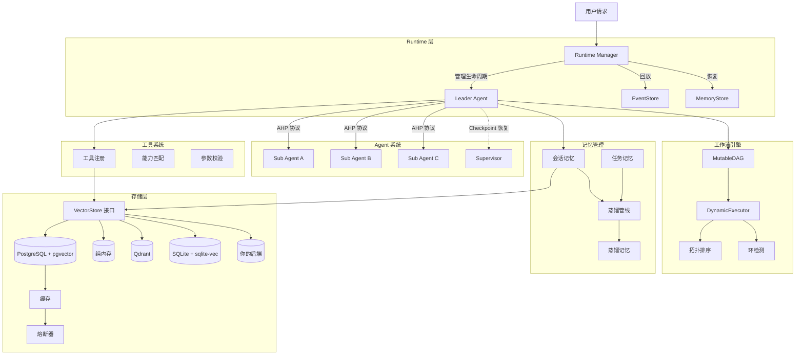
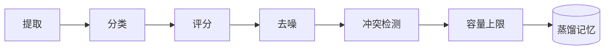

# GoAgentX

```shell
   _____                               _  __   __
  / ____|        /\                   | | \ \ / /
 | |  __  ___   /  \   __ _  ___ _ __ | |_ \ V / 
 | | |_ |/ _ \ / /\ \ / _` |/ _ \ '_ \| __| > <  
 | |__| | (_) / ____ \ (_| |  __/ | | | |_ / . \ 
  \_____|\___/_/    \_\__, |\___|_| |_|\__/_/ \_\
                       __/ |                     
                      |___/                                                                   
```

Go 语言多 Agent 框架，支持 DAG 工作流编排、记忆蒸馏、AHP 协议通信。

## 架构



### 记忆蒸馏管线



6 步管线：从原始交互中提取经验 → 按类型分类 → 评分 → 过滤噪声 → 与已有记忆做冲突检测 → 强制容量上限。

### AHP 协议

自定义 Agent Hosting Protocol，支持心跳监控、死信队列（DLQ）、进度追踪。所有协议操作 benchmark 均在 1μs 以内。

### Leader 故障转移

基于 Checkpoint 的恢复机制。Supervisor 检测 Leader 故障 → 从最近 Checkpoint 恢复 → 重新分配任务到可用 Sub-Agent。

## 核心特性

**DAG 工作流引擎**
- MutableDAG：运行时图修改（增删节点/边）均在 1μs 以内
- DynamicExecutor：拓扑排序执行 DAG
- 增量环检测（边插入时 BFS）
- 热重载 + 运行时修改，无需停止执行

**记忆系统**
- 会话记忆：短期对话上下文
- 任务记忆：单任务工作记忆
- 蒸馏记忆：6 步管线压缩长期知识（基于 errgroup 的并发嵌入加速）
- 多语言经验提取：中文关键词检测 + 中文重要性评分
- 内容哈希去重，幂等存储
- 向量语义搜索（可插拔后端）

**存储层**
- 可插拔 VectorStore 接口 — 可替换为 Qdrant、Milvus、SQLite 或自定义后端
- 内置实现：PostgreSQL + pgvector（生产）、纯内存（开发测试）
- Repository 模式抽象
- 内置缓存层 + 熔断器
- 幂等 DDL 迁移，可安全重复执行
- 详见 [自定义向量存储指南](docs/zh/development/custom-vector-store.md)

**Agent 系统**
- Leader/Sub Agent 架构
- AHP 协议通信（心跳、DLQ、进度）
- Leader 故障转移 + Checkpoint 恢复
- 可配置并发的并行任务执行
- 可插拔健康检测的 Agent 复活插件

**Runtime 层**
- Agent 生命周期管理：注册、启动、停止、重启、恢复
- 通过 AgentFactory 实现自动崩溃检测和复活
- 两个恢复维度：EventStore（运维恢复）+ MemoryStore（认知恢复）
- 基于心跳和状态的健康监控
- 通过 errgroup 实现结构化并发和优雅关闭

**Event Sourcing（事件溯源）**
- EventStore 接口，支持乐观并发控制
- MemoryEventStore 用于开发测试，PostgresEventStore 用于生产
- 17 种事件类型，覆盖 Agent 生命周期、任务、会话、工作流、故障转移
- 通过 Subscribe 实现 Pub/Sub，支持事件过滤
- DLQ 自动重试，可配置重试预算

**Human-in-the-Loop（人机协作）**
- 工作流步骤暂停等待人工审批
- 任意步骤配置 InterruptConfig，InterruptHandler 阻塞审批
- InterruptStore 支持崩溃恢复
- 审批工作流和审查门禁

**工具系统**
- 动态工具注册与发现
- Agent 与工具的能力匹配
- Schema 参数校验
- 工具执行前后生命周期钩子

**MCP 集成**
- Model Context Protocol 客户端，支持 JSON-RPC 2.0 消息
- Stdio 和 SSE 传输支持
- 工具 schema 管理和连接生命周期管理

**可观测性**
- Web Dashboard：WebSocket 实时监控面板
- Flight Recorder：时间线追踪、决策记录、诊断引擎
- Agent 基因谱系：血缘关系追踪，支持 DOT/JSON 导出
- Event Bridge：系统状态实时流式推送至 Dashboard

**混沌工程**
- Arena 故障注入测试框架
- 支持故障类型：process_kill、network_partition、latency_spike、kill_orchestrator
- 可配置指标的弹性评分
- Survival 模式持续混沌测试

**LLM Tool Calling**
- 多 Provider 输出适配器（OpenAI、Ollama、OpenRouter）
- Prompt 模板引擎，支持 Go template 语法
- Function Calling 提取与验证
- 基于 Schema 的参数校验
- 流式输出解析器

**扩展性**
- 事件驱动回调系统，支持类型化上下文
- 事件自动压缩，可配置保留策略
- 可插拔健康检测（用于 Agent 复活）

## 性能数据

32 个 benchmark，2573 测试通过（`-race`），覆盖 49 个包。

平台：darwin/arm64, Apple M3 Max, Go 1.26.4

| 类别 | 数量 | 热路径 (< 1μs) | 正常 (1-100μs) | 冷路径 (> 100μs) |
|------|------|----------------|----------------|------------------|
| Eval | 5 | 2 | 2 | 1 |
| 蒸馏 | 9 | 3 | 4 | 2 |
| 工具 | 8 | 4 | 3 | 1 |
| 错误处理 | 4 | 4 | 0 | 0 |
| 事件溯源 | 6 | 1 | 3 | 2 |
| **合计** | **32** | **14** | **12** | **6** |

热路径实测：

| 操作 | ns/op | allocs/op |
|------|-------|-----------|
| ExactMatchEvaluator | 2.90 | 0 |
| ToolExecution | 14.48 | 0 |
| ResultCreation | 0.25 | 0 |
| ParameterValidation | 7.22 | 0 |
| ConflictDetection | 988 | 0 |
| Wrap (error) | 0.25 | 0 |
| MemoryOperations/Create | 87.57 | 0 |

32 个 benchmark 中 14 个在 1μs 以内。评估、工具执行、结果创建、错误包装、冲突检测均为零分配路径。

完整报告：`benchmarks/benchmark_report.md`

## 快速开始

### 环境要求

- Go 1.26+
- PostgreSQL 15+ + pgvector（可选，用于持久化）
- Docker（可选）

### 1. 设置 API Key

```bash
export OPENROUTER_API_KEY="your-api-key"
```

### 2. 启动数据库（可选）

```bash
# 一键重启 + 迁移（可选导入文档）
./scripts/docker/restart.sh
./scripts/docker/restart.sh --save examples/knowledge-base/README.md

# 或手动：
docker run -d \
  --name goagentx-db \
  -e POSTGRES_PASSWORD=postgres \
  -e POSTGRES_DB=goagent \
  -p 5433:5432 \
  pgvector/pgvector:pg15
```

### 3. 运行示例

```bash
# 旅行规划（多 Agent 协作）
cd examples/travel && go run main.go

# 知识库问答（需要数据库 + Embedding 服务）
cd examples/knowledge-base
go run main.go --save README.md              # 导入文档
go run main.go --save docs/goagent-overview.md  # 导入框架概述
go run main.go --chat                         # 开始问答（支持知识纠错）

# Advanced examples（v2 功能）
go run ./examples/advanced/leader_failover/
go run ./examples/advanced/agent_resurrection/
go run ./examples/advanced/runtime_resurrection/
go run ./examples/advanced/dynamic_executor/
go run ./examples/advanced/mutable_dag/

# Dashboard + MCP 集成示例
cd examples/mcp-dashboard && go run main.go

# 量化分析示例
cd examples/quant-trading && go run . --ticker AAPL

# 开发 Agent 示例
cd examples/devagent && go run main.go

# 工具能力演示
cd examples/capability-demo && go run main.go
```

详见 [示例文档](docs/zh/development/examples.md)。

### 4. 运行测试

```bash
go test ./...                      # 全部测试
go test -race ./...                # 带竞态检测
go test -bench=. ./...             # Benchmark
```


## 配置

YAML 配置格式：

```yaml
llm:
  provider: openrouter
  api_key: "${OPENROUTER_API_KEY}"
  model: meta-llama/llama-3.1-8b-instruct
  timeout: 60

agents:
  leader:
    id: leader-main
    max_steps: 10
    max_parallel_tasks: 4
  sub:
    - id: agent-a
      type: research
      max_retries: 3
      timeout: 30

storage:
  type: postgres
  host: localhost
  port: 5433
  database: goagent
  pgvector:
    enabled: true
    dimension: 1024

memory:
  enabled: true
  enable_distillation: true
  distillation_threshold: 3
```

完整配置示例：`examples/travel/config.yaml`

## 技术栈

| 组件 | 技术 |
|------|------|
| 语言 | Go 1.26+ |
| 数据库 | PostgreSQL 15+ + pgvector（可插拔：Qdrant、Milvus、SQLite、自定义） |
| 协议 | 自定义 AHP（Agent Hosting Protocol） |
| Embedding | FastAPI + Ollama/SentenceTransformers |
| 缓存 | Redis |
| 并发 | errgroup, sync |

## 文档

- [更新日志](CHANGELOG.md)
- [架构设计](docs/zh/architecture/arch.md)
- [Runtime 层](docs/zh/architecture/runtime.md)
- [快速开始](docs/zh/guides/quick-start.md)
- [常见问题](docs/zh/guides/faq.md)
- [集成指南](docs/zh/development/integration-guide.md)
- [自定义向量存储](docs/zh/development/custom-vector-store.md)
- [Leader 故障转移](docs/zh/features/leader-failover.md)
- [动态图](docs/zh/features/dynamic-graph.md)
- [人机协作](docs/zh/features/hitl.md)
- [Agent 复活](docs/zh/features/resurrection.md)
- [MCP 与 Dashboard](docs/zh/features/mcp-and-dashboard.md)
- [事件溯源](docs/zh/features/event-sourcing.md)
- [集成测试](docs/zh/development/integration-testing.md)
- [CI/CD 管线](docs/zh/development/ci-cd.md)
- [框架对比](docs/en/framework-comparison.md)
- [性能报告](benchmarks/benchmark_report.md)

## LICENSE
Apache 2.0