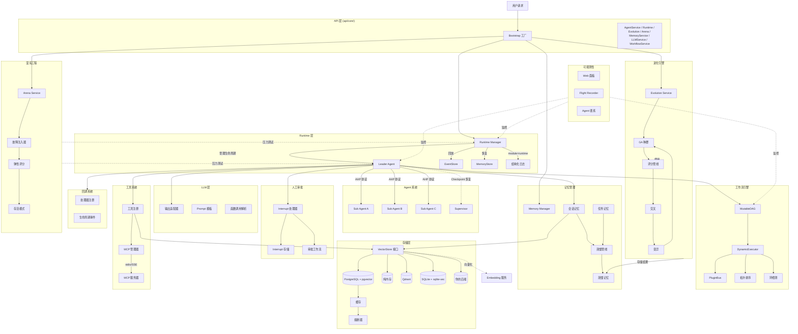
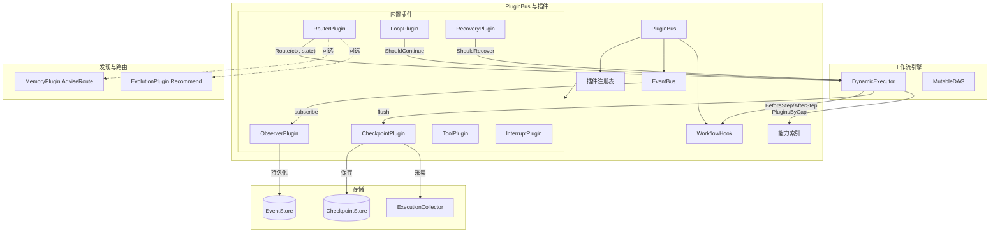
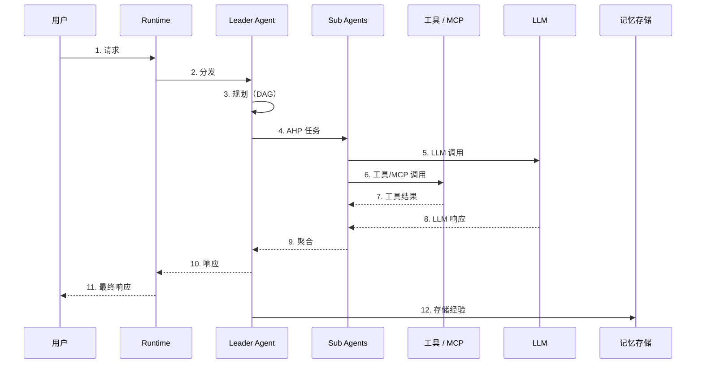

```shell
           _____  ______  _____ 
     /\   |  __ \|  ____|/ ____|
    /  \  | |__) | |__  | (___  
   / /\ \ |  _  /|  __|  \___ \ 
  / ____ \| | \ \| |____ ____) |
 /_/    \_\_|  \_\______|_____/ 
                    
```

ARES（自适应弹性进化系统）：一种用于自主agent的自愈进化运行时

Go 语言多 Agent 框架，支持 DAG 工作流编排、记忆蒸馏、AHP 协议通信。

## 架构



### 插件系统架构



DynamicExecutor 在每个 Step 边界调用 PluginBus 的 BeforeStep/AfterStep 钩子，PluginBus 分发到所有注册的 WorkflowHook 实现。插件通过 EventBus 发布/订阅事件，通过 Capability Index 实现能力发现。ObserverPlugin 将工作流事件持久化到 EventStore，CheckpointPlugin 将执行快照写入 CheckpointStore。

### 数据流

#### 请求生命周期



请求经过 Runtime → Leader 用 DAG 规划 → Sub Agents 执行（LLM + 工具） → 结果聚合后返回。

#### 记忆蒸馏管线


6 步管线：从原始交互中提取经验 → 按类型分类 → 评分 → 过滤噪声 → 与已有记忆做冲突检测 → 强制容量上限。

### AHP 协议

自定义 Agent Hosting Protocol，支持心跳监控、死信队列（DLQ）、进度追踪。所有协议操作 benchmark 均在 1μs 以内。

### Leader 故障转移

基于 Checkpoint 的恢复机制。Supervisor 检测 Leader 故障 → 从最近 Checkpoint 恢复 → 重新分配任务到可用 Sub-Agent。

## 核心特性

**DAG 工作流引擎**

- MutableDAG：运行时图修改（增删节点/边）均在 1μs 以内
- DynamicExecutor：拓扑排序执行 DAG
- 增量环检测（边插入时 BFS）
- 热重载 + 运行时修改，无需停止执行

**记忆系统**

- 会话记忆：短期对话上下文
- 任务记忆：单任务工作记忆
- 蒸馏记忆：6 步管线压缩长期知识（基于 errgroup 的并发嵌入加速）
- 多语言经验提取：中文关键词检测 + 中文重要性评分
- 内容哈希去重，幂等存储
- 向量语义搜索（可插拔后端）

**存储层**

- 可插拔 VectorStore 接口 — 可替换为 Qdrant、Milvus、SQLite 或自定义后端
- 内置实现：PostgreSQL + pgvector（生产）、纯内存（开发测试）
- Repository 模式抽象
- 内置缓存层 + 熔断器
- 幂等 DDL 迁移，可安全重复执行
- 详见 [自定义向量存储指南](docs/zh/development/custom-vector-store.md)

**Agent 系统**

- Leader/Sub Agent 架构
- AHP 协议通信（心跳、DLQ、进度）
- Leader 故障转移 + Checkpoint 恢复
- 可配置并发的并行任务执行
- 可插拔健康检测的 Agent 复活插件

**Runtime 层**

- Agent 生命周期管理：注册、启动、停止、重启、恢复
- 通过 AgentFactory 实现自动崩溃检测和复活
- 两个恢复维度：EventStore（运维恢复）+ MemoryStore（认知恢复）
- 基于心跳和状态的健康监控
- 通过 errgroup 实现结构化并发和优雅关闭

**Event Sourcing（事件溯源）**

- EventStore 接口，支持乐观并发控制
- MemoryEventStore 用于开发测试，PostgresEventStore 用于生产
- 17 种事件类型，覆盖 Agent 生命周期、任务、会话、工作流、故障转移
- 通过 Subscribe 实现 Pub/Sub，支持事件过滤
- DLQ 自动重试，可配置重试预算

**Human-in-the-Loop（人机协作）**

- 工作流步骤暂停等待人工审批
- 任意步骤配置 InterruptConfig，InterruptHandler 阻塞审批
- InterruptStore 支持崩溃恢复
- 审批工作流和审查门禁

**工具系统**

- 动态工具注册与发现
- Agent 与工具的能力匹配
- Schema 参数校验
- 工具执行前后生命周期钩子

**MCP 集成**

- Model Context Protocol 客户端，支持 JSON-RPC 2.0 消息
- Stdio 和 SSE 传输支持
- 工具 schema 管理和连接生命周期管理

**可观测性**

- Web Dashboard：WebSocket 实时监控面板
- Flight Recorder：时间线追踪、决策记录、诊断引擎
- Agent 基因谱系：血缘关系追踪，支持 DOT/JSON 导出
- Event Bridge：系统状态实时流式推送至 Dashboard

**混沌工程**

- Arena 故障注入测试框架
- 支持故障类型：process\_kill、network\_partition、latency\_spike、kill\_orchestrator
- 可配置指标的弹性评分
- Survival 模式持续混沌测试

**LLM Tool Calling**

- 多 Provider 输出适配器（OpenAI、Ollama、OpenRouter）
- Prompt 模板引擎，支持 Go template 语法
- Function Calling 提取与验证
- 基于 Schema 的参数校验
- 流式输出解析器

**扩展性**

- 事件驱动回调系统，支持类型化上下文
- 事件自动压缩，可配置保留策略
- 可插拔健康检测（用于 Agent 复活）

**自主进化（遗传算法）**

- 多代种群进化：选择、交叉、变异
- 策略变异引擎：支持确定性种子控制，结果可复现
- Arena 回归测试：Welch's t-test 统计显著性检验
- Dream Cycle 编排：触发 → 变异 → 评估 → 采用 → 记录谱系
- Bandit 反馈循环：持续优化经验质量
- 事件驱动回调系统：LLM/工具/Agent 生命周期钩子
- 高层 API：`NewWiredEvolutionSystem` 一键组装全部组件
- 精英保留策略 + 自适应存活率

**插件系统**

- PluginBus：中心化插件注册表与生命周期管理器。线程安全的 Start/Stop，支持反向顺序关闭、重复检测和启动状态守卫。
- EventBus：类型化事件发布/订阅接口。`Emit` 非阻塞——订阅者缓冲区满时丢弃事件。`Subscribe` 支持按流 ID、事件类型、时间范围过滤。
- WorkflowHook：同步拦截器接口（`BeforeStep` / `AfterStep`），由 DynamicExecutor 在每个 Step 边界调用。每次分派可配置超时，支持自动 panic 恢复并包装为结构化 `PluginError`。
- 基于能力（Capability）的发现：`PluginsByCap(CapCheckpoint)` 返回所有声明该能力的插件副本。工作流引擎不依赖具体插件类型，实现松散耦合。

**内置插件**

| 插件                  | 能力         | 作用                                                                                                            |
| ------------------- | ---------- | ------------------------------------------------------------------------------------------------------------- |
| ObserverPlugin      | observer   | 订阅工作流生命周期事件（workflow\.started/completed/failed、step.started/completed/failed、checkpoint.saved）持久化到 EventStore |
| CheckpointPlugin    | checkpoint | 在 Step 边界保存深拷贝执行快照。可配置 flush 间隔。22 字段 schema 覆盖 Step 状态、变量、路由/工具/记忆/中断/错误/循环历史及评分信号                           |
| ToolPlugin          | tool       | 通过 ExecutionCollector 验证和记录工具调用                                                                               |
| ExpressionRouter    | router     | 规则路由：FromStepID → ToStepID + 条件谓词。首匹配语义                                                                       |
| MemoryRouter        | router     | 优先查询 `MemoryPlugin.AdviseRoute`，回退到表达式规则                                                                      |
| EvolutionRouter     | router     | 优先查询 `EvolutionPlugin.Recommend`，回退到表达式规则                                                                     |
| LoopPlugin          | loop       | 受控执行循环：MaxIterations、UntilCondition、SubStepIDs                                                                |
| BasicRecoveryPlugin | recovery   | 基于白名单的 Step 故障恢复决策                                                                                            |
| InterruptPlugin     | —          | 通过采集器记录 HITL 中断生命周期事件                                                                                         |
| ArenaPlugin         | —          | 故障注入测试（plugin\_panic、plugin\_timeout、plugin\_error、bus\_stop）                                                 |

**ExecutionCollector**

- 线程安全的数据聚合器，在工作流执行期间采集路由决策、工具调用、记忆命中、中断和错误
- `Export()` 输出可序列化 map；`MergeInto()` 合并到 `ExperienceCheckpoint`
- 被 CheckpointPlugin、记忆蒸馏管道和进化引擎评分所消费

**ExperienceCheckpoint** — 完整执行快照：

```json
{
  "schema_version": 1,
  "execution_id": "...",
  "workflow_id": "...",
  "workflow_version": "...",
  "state_version": 1,
  "status": "running",
  "step_states": [...],
  "variables": {...},
  "output_store": {...},
  "route_history": [...],
  "tool_history": [...],
  "memory_hits": [...],
  "interrupt_history": [...],
  "loop_history": [...],
  "error_history": [...],
  "scoring_signals": [...],
  "created_at": "..."
}
```

支持 Leader 故障转移和 Step 级恢复的完整执行状态还原。

## 性能数据

116 个 benchmark，5675 测试通过（`-race`），覆盖 130 个包。

平台：darwin/arm64, Apple M3 Max, Go 1.26.4

| 类别 | 数量 | 热路径 (< 1μs) | 正常 (1-100μs) | 冷路径 (> 100μs) |
|------|------|----------------|----------------|-------------------|
| Eval | 5 | 2 | 2 | 1 |
| 蒸馏 | 10 | 0 | 9 | 1 |
| 工具 | 9 | 4 | 5 | 0 |
| 错误处理 | 4 | 3 | 1 | 0 |
| 事件溯源 | 6 | 0 | 5 | 1 |
| Handler | 3 | 1 | 1 | 1 |
| 进化 | 6 | 0 | 1 | 5 |
| 进化/基因组 | 30+ | 0 | 20+ | 10+ |
| **合计** | **116** | **10** | **43** | **20** |

热路径实测：

| 操作 | ns/op | allocs/op |
|------|-------|-----------|
| ExactMatchEvaluator | 3.07 | 0 |
| ToolExecution | 14.69 | 0 |
| ParameterValidation | 7.22 | 0 |
| Wrap (error) | 0.27 | 0 |
| ResultCreation (Success) | 0.27 | 0 |
| ResultCreation (Error) | 0.28 | 0 |
| ConflictDetection | 1027 | 0 |
| DreamCycle_SingleRun | 224 | 4 |

116 个 benchmark 中 10 个在 1μs 以内。评估、工具执行、结果创建、错误包装、参数验证均为零分配路径。

完整报告：`benchmarks/benchmark_report.md`

## 快速开始

### 环境要求

- Go 1.26+
- PostgreSQL 15+ + pgvector（可选，用于持久化）
- Docker（可选）

### 1. 设置 API Key

```bash
export OPENROUTER_API_KEY="your-api-key"
```

### 2. 启动数据库（可选）

```bash
# 一键重启 + 迁移（可选导入文档）
./scripts/docker/restart.sh
./scripts/docker/restart.sh --save examples/knowledge-base/README.md

# 或手动：
docker run -d \
  --name ares-db \
  -e POSTGRES_PASSWORD=postgres \
  -e POSTGRES_DB=goagent \
  -p 5433:5432 \
  pgvector/pgvector:pg15
```

### 3. 运行示例

```bash
# 快速开始（bootstrap API）
go run examples/quickstart/main.go

# 图工作流演示
go run examples/graph_demo/basic/basic_example.go
go run examples/graph_demo/conditional/conditional_example.go
go run examples/graph_demo/scheduler/scheduler_example.go
go run examples/graph_demo/recovery/recovery_example.go

# 高级模式
go run examples/advanced/mutable_dag/main.go
go run examples/advanced/dynamic_executor/main.go
go run examples/advanced/leader_failover/main.go
go run examples/advanced/agent_resurrection/main.go

# 多 Agent 协作
cd examples/travel && go run main.go

# 知识库问答（需要数据库）
cd examples/knowledge-base && go run main.go --chat

# 混沌工程
cd examples/mcp-dashboard && go run main.go

# 量化交易
cd examples/quant-trading && go run . --ticker AAPL

# 自主进化（遗传算法）
cd examples/autonomous-evolution && go run main.go
```

### 4. 运行测试

```bash
go test ./...                      # 全部测试
go test -race ./...                # 带竞态检测
go test -bench=. ./...             # Benchmark
```

### 5. 使用 API

ARES 在 `api/core/` 提供抽象接口，在 `api/bootstrap/` 提供工厂：

```go
package main

import (
    "context"
    "fmt"
    "log"

    "github.com/Timwood0x10/ares/api/bootstrap"
)

func main() {
    ctx := context.Background()

    // 创建 ARES 实例，所有模块自动接线
    ares, err := bootstrap.New(ctx, bootstrap.DefaultConfig())
    if err != nil {
        log.Fatal(err)
    }
    defer ares.Stop()

    // 启动运行时（管理 Agent 生命周期）
    if err := ares.Start(ctx); err != nil {
        log.Fatal(err)
    }

    // 运行遗传算法进化
    result, err := ares.RunEvolution(ctx, 10)
    if err != nil {
        log.Fatal(err)
    }
    fmt.Printf("最佳得分: %.2f\n", result.BestStrategy.Score)
}
```

`api/core/` 中可用的接口：
- `AgentService` — Agent CRUD + 任务执行
- `Runtime` — Agent 生命周期管理
- `WorkflowService` — DAG 工作流编排
- `MemoryService` — 记忆管理 + 蒸馏
- `LLMService` — LLM 提供者抽象
- `RetrievalService` — 向量检索
- `Evolution` — 遗传算法进化
- `DreamCycle` — 自主进化循环
- `Arena` — 混沌工程（故障注入 + 韧性评分）
- `ContextCleaner` — 上下文窗口管理

## 配置

YAML 配置格式：

```yaml
llm:
  provider: openrouter
  api_key: "${OPENROUTER_API_KEY}"
  model: meta-llama/llama-3.1-8b-instruct
  timeout: 60

agents:
  leader:
    id: leader-main
    max_steps: 10
    max_parallel_tasks: 4
  sub:
    - id: agent-a
      type: research
      max_retries: 3
      timeout: 30

storage:
  type: postgres
  host: localhost
  port: 5433
  database: goagent
  pgvector:
    enabled: true
    dimension: 1024

memory:
  enabled: true
  enable_distillation: true
  distillation_threshold: 3
```

完整配置示例：`examples/travel/config.yaml`

## 技术栈

| 组件        | 技术                                                      |
| --------- | ------------------------------------------------------- |
| 语言        | Go 1.26+                                                |
| 数据库       | PostgreSQL 15+ + pgvector（可插拔：Qdrant、Milvus、SQLite、自定义） |
| 协议        | 自定义 AHP（Agent Hosting Protocol）                         |
| Embedding | FastAPI + Ollama/SentenceTransformers                   |
| 缓存        | Redis                                                   |
| 并发        | errgroup, sync                                          |

## 项目结构

```
ares/
├── api/                  # 公共 API 层（仅接口定义，无实现）
│   ├── core/             # 抽象接口：AgentService、Runtime、Evolution、Arena 等
│   ├── errors/           # 统一错误类型
│   ├── client/           # Go 客户端 SDK
│   ├── handler/          # HTTP Handler（薄委托）
│   ├── router/           # 路由注册
│   └── bootstrap/        # 工厂 — 将所有模块接线为 ARES 容器
├── internal/
│   ├── agents/           # Leader/Sub Agent 系统
│   ├── ares_runtime/     # 运行时生命周期 + PluginBus（含 10 个内置插件）
│   ├── ares_events/      # EventStore 接口、MemoryEventStore、事件类型
│   ├── ares_memory/      # 记忆系统 + 蒸馏
│   ├── ares_evolution/   # 遗传算法进化系统
│   ├── ares_arena/       # 混沌工程测试平台
│   ├── ares_flight/      # Flight Recorder（时间线/谱系/诊断）
│   ├── ares_mcp/         # MCP 客户端（stdio/SSE 传输）
│   ├── ares_callbacks/   # 事件驱动回调系统
│   ├── ares_observability/ # OpenTelemetry + Prometheus 指标
│   ├── ares_eval/        # 评估框架
│   ├── ares_quant/       # 量化交易工具
│   ├── workflow/engine/  # DAG 工作流引擎（DynamicExecutor + PluginBus）
│   ├── workflow/graph/   # 图执行器 + 检查点恢复
│   ├── protocol/ahp/     # AHP Agent 间通信协议
│   ├── storage/          # VectorStore 接口及实现
│   ├── llm/              # LLM 客户端 + 输出解析器
│   ├── dashboard/        # Web 控制面板（WebSocket + REST API）
│   ├── logger/           # 模块级结构化日志
│   └── config/           # 配置加载 + 校验
├── services/embedding/  # Embedding 网关（FastAPI + Ollama）
├── examples/            # 示例项目：travel、knowledge-base、dashboard、quant、quickstart……
├── api/                 # 服务接口与客户端
├── cmd/                 # CLI 工具（arena、flight、migration……）
└── benchmarks/          # 性能报告与日志
```

## 文档

- [更新日志](CHANGELOG.md)
- [架构设计](docs/zh/architecture/arch.md)
- [Runtime 层](docs/zh/architecture/runtime.md)
- [快速开始](docs/zh/guides/quick-start.md)
- [常见问题](docs/zh/guides/faq.md)
- [集成指南](docs/zh/development/integration-guide.md)
- [自定义向量存储](docs/zh/development/custom-vector-store.md)
- [Leader 故障转移](docs/zh/features/leader-failover.md)
- [动态图](docs/zh/features/dynamic-graph.md)
- [人机协作](docs/zh/features/hitl.md)
- [Agent 复活](docs/zh/features/resurrection.md)
- [MCP 与 Dashboard](docs/zh/features/mcp-and-dashboard.md)
- [事件溯源](docs/zh/features/event-sourcing.md)
- [集成测试](docs/zh/development/integration-testing.md)
- [CI/CD 管线](docs/zh/development/ci-cd.md)
- [框架对比](docs/en/framework-comparison.md)
- [性能报告](benchmarks/benchmark_report.md)
- [自主进化指南](docs/zh/features/autonomous-evolution.md)

## LICENSE

Apache 2.0
