```shell
           _____  ______  _____ 
     /\   |  __ \|  ____|/ ____|
    /  \  | |__) | |__  | (___  
   / /\ \ |  _  /|  __|  \___ \ 
  / ____ \| | \ \| |____ ____) |
 /_/    \_\_|  \_\______|_____/ 

```

**ARES** — 智能体运行时与进化系统（Agent Runtime & Evolution System）。

用 Go 构建高韧性、自进化的 AI Agent。统一 SDK、DAG 工作流、混沌工程、MCP 支持。

**运行时进化**：ARES 持续进化 DAG 拓扑、调度器、知识规划器和恢复策略 —— 全部在生产环境中运行，无需重启。LLM 是进化的参与者，而非主导者。

## 快速开始

```go
package main

import "github.com/Timwood0x10/ares/sdk"

func main() {
    rt := sdk.MustNew(sdk.WithOllama("llama3.2"))
    defer rt.Close()

    agent := rt.NewAgent("assistant")
    result, _ := agent.Run(ctx, "Say hello")
    println(result.Output)
}
```

安装 CLI：

```bash
go install github.com/Timwood0x10/ares/cmd/ares@latest
ares doctor
ares run -c ares.yaml "什么是 Go？"
```

或直接运行示例：

```bash
git clone https://github.com/Timwood0x10/ares
cd ares
make quickstart        # 运行快速开始示例
make examples          # 构建全部 24 个示例
```

## 核心特性

| 特性 | 说明 |
|---|---|
| **统一 SDK** | 单一 `sdk.MustNew()` API，统一管理 LLM、工具、记忆、进化 |
| **运行时进化** | Genome + Diff Engine + Coordinator 持续进化 DAG、调度器、规划器、恢复策略 |
| **策略 GA** | 基于种群的策略优化 — NSGA-II 多目标、稳态 GA、三种交叉类型、六种变异类型 |
| **证据驱动** | 每次执行事件、故障、洞察都产生 Evidence，驱动进化决策 |
| **DAG 工作流** | 动态图编排，支持条件分支和自动恢复 |
| **混沌韧性** | 故障注入、自动切换、生存测试、自愈恢复 |
| **记忆系统** | 会话上下文、任务蒸馏、向量相似度检索 |
| **MCP 就绪** | 连接任意 MCP 服务器扩展工具和数据 |
| **多 Agent** | 领导/成员编排，支持自动故障切换 |
| **可观测性** | OpenTelemetry 追踪、结构化日志、Prometheus 指标 |

## CLI 命令

```bash
ares init        # 创建新项目脚手架（main.go + ares.yaml）
ares run         # 从配置文件运行 agent
ares bench       # 快速性能基准测试
ares doctor      # 诊断环境（LLM key、Ollama、Git）
ares version     # 显示版本
ares arena       # 混沌工程场景
ares flight      # 检查与回放任务记录
ares evolution   # 运行时进化：status / run
```

## SDK 用法

```go
rt := sdk.MustNew(
    sdk.WithOpenAI("gpt-4o-mini"),          // 或 WithOllama、WithAnthropic
    sdk.WithDefaultMemory(),                 // 开启会话记忆
    sdk.WithEvolution(),                     // 开启策略进化
    sdk.WithMCP(sdk.MCPConn{                 // 连接 MCP 服务器
        Name: "my-server", Command: "/path/to/server", Args: []string{"serve"},
    }),
)
defer rt.Close()

// 带工具和人工审批的 Agent
agent := rt.NewAgent("assistant",
    sdk.WithInstruction("你是一个助手。"),
    sdk.WithTools(calculatorTool, weatherTool),
    sdk.WithHumanInput(approveFn),
)
result, _ := agent.Run(ctx, "计算 15*23")

// 流式响应
ch, _ := agent.Stream(ctx, "讲个故事")
for chunk := range ch { fmt.Print(chunk.Content) }

// 多 Agent 团队
team := rt.NewTeam("project", leaderAgent, []*Agent{memberAgent})
teamResult, _ := team.Run(ctx, "调研并撰写报告")
```

完整示例见 [examples/README.md](examples/README.md)。

## 架构

```mermaid
graph TB
    User["用户 / CLI"] --> SDK

    subgraph sdk ["SDK 层 (sdk/)"]
        RT["Runtime<br/>MustNew / New"]
        A["Agent<br/>Run / Stream"]
        T["Team<br/>多 Agent"]
        CFG["配置<br/>YAML + Options"]
    end

    SDK --> LLM
    SDK --> Tools
    SDK --> Memory
    SDK --> Evo

    subgraph LLM ["LLM 提供商"]
        OAI["OpenAI"]
        OLL["Ollama"]
        ANTH["Anthropic"]
        OR["OpenRouter"]
    end

    subgraph Tools ["工具系统"]
        BT["内置工具<br/>计算器、搜索..."]
        MCP["MCP 服务器<br/>Stdio / SSE"]
        CT["自定义工具<br/>ToolFunc"]
    end

    subgraph Memory ["记忆"]
        SES["会话上下文"]
        DIST["任务蒸馏"]
        VEC["向量检索"]
    end

    subgraph Evo ["进化"]
        GA["遗传算法"]
        NSGA["NSGA-II / 稳态 GA"]
        CROSS["三种交叉类型"]
        MUT["六种变异类型"]
        SCORE["经验引导评分"]
    end

    subgraph RuntimeEvo ["运行时进化"]
        GENOME["Genomes<br/>Workflow / Scheduler / Knowledge / Recovery"]
        DIFF["Diff Engine"]
        COORD["Coordinator"]
        LLM_ADAPT["LLM Adapter"]
        EXEC["Executors<br/>Graph / Scheduler / Knowledge / Recovery"]
    end

    subgraph CLI ["CLI 命令"]
        INIT["ares init"]
        RUN["ares run"]
        BENCH["ares bench"]
        DOCTOR["ares doctor"]
        EVO["ares evolution"]
    end

    subgraph EX ["示例 (24 个)"]
        QS["01 快速开始"]
        TC["02 工具调用"]
        DAG["03 DAG 工作流"]
        MA["04 多 Agent"]
        EVO["05 进化演示"]
        CHAOS["06 混沌测试"]
        HIL["07 人工审批"]
    end

    style sdk fill:#1e3a5f,stroke:#3b82f6,color:#fff
    style LLM fill:#1a2332,stroke:#64748b
    style Tools fill:#1a2332,stroke:#64748b
    style Memory fill:#1a2332,stroke:#64748b
    style Evo fill:#1a2332,stroke:#64748b
    style RuntimeEvo fill:#2d1b69,stroke:#8b5cf6,color:#fff
    style CLI fill:#2d1b69,stroke:#8b5cf6,color:#fff
    style EX fill:#1a3a2a,stroke:#22c55e
```



## 评估框架

5 个场景直接检验 ARES 核心能力：

```bash
go run examples/eval/main.go
```

| 场景 | 评估内容 |
|---|---|
| `basic-chat` | 基础对话正确性 |
| `tool-calling` | 工具调用准确性 |
| `multi-agent` | 团队协作能力 |
| `resilience` | 错误恢复能力 |
| `evolution` | 进化前后效果对比 |

## 混沌示例

9 种故障模式全覆盖：

```bash
go run examples/06-chaos-resilience/main.go
```

文件系统故障 / 工具超时 / 不可靠服务 / 优雅降级 / 网络故障 / MCP 断连 / LLM 故障 / 内存损坏

## 文档

| 语言 | 文档 |
|---|---|
| English | [Architecture](docs/articles/en/architecture-overview-deep-dive.md), [Evolution](docs/articles/en/autonomous-evolution-deep-dive.md), [MCP](docs/articles/en/mcp-integration-deep-dive.md) |
| 中文 | [架构](docs/articles/zh/architecture-overview-deep-dive.md), [进化](docs/articles/zh/autonomous-evolution-deep-dive.md), [MCP](docs/articles/zh/mcp-integration-deep-dive.md) |

## 项目结构

```
├── sdk/           # 统一 SDK（package sdk）
├── cmd/ares/      # CLI 入口（evolution status/run）
├── evaluation/    # 评估框架
├── examples/      # 24+ 个可运行示例
│   └── runtime_evolution/  # 进化演示（basic / knowledge / full）
├── docs/          # 文档和文章
├── api/           # 公开 API 接口
└── internal/
    ├── evolution/         # 运行时进化系统
    │   ├── genome/        # 5 个 Genome 实现（Workflow/Scheduler/Knowledge/Recovery/Prompt）
    │   ├── diff/          # Diff Engine（4 个 Differ 实现）
    │   ├── coordinator/   # Evolution Coordinator（7 个 PatchSource、PolicyGenome）
    │   ├── patch/         # RuntimePatch 类型 + Registry + Apply/ApplySet
    │   └── llm_adapter.go # LLM 参与者适配器
    ├── evidence/          # Evidence 数据原语 + MemoryStore
    ├── workflow/
    │   ├── graph/         # GraphPatchExecutor（7 种 Patch 类型）
    │   └── engine/        # RecoveryPatchExecutor
    ├── knowledge/
    │   └── runtime/       # KnowledgePatchExecutor
    └── ares_bootstrap/    # 装配中心（ProvideNewEvolution）
```

## 运行时进化

ARES 的运行时进化系统是**证据驱动**的：每次执行、故障和洞察都产生 `Evidence`，驱动进化循环。系统持续进化 DAG 拓扑、调度器选择、知识规划器参数和恢复策略——全部生产环境运行，无需重启。

### 架构

```
Execution → Evidence → Genome → Candidate → Diff Engine → RuntimePatch → Coordinator → Apply
```

| 组件 | 作用 | 来源 |
|------|------|------|
| **5 个 Genome** | 通过变异+交叉产生候选配置 | workflow, scheduler, knowledge, recovery, prompt |
| **4 个 Differ** | 比较新旧快照 → 生成 RuntimePatch | workflow, knowledge, scheduler, recovery |
| **Coordinator** | 决策 Apply/Reject/Delay | GA, Chaos, AKF, LLM, Human, K8s, Rule |
| **3 个 Executor** | 将 Patch 应用到运行时代码 | Graph, Knowledge, Recovery |
| **LLM Adapter** | 将自然语言建议转为 PatchProposal | 解析后 → Coordinator |

**关键设计**：LLM 是**参与者**，而非主导者。Coordinator 对所有 7 个 `PatchSource` 值一视同仁，没有来源拥有特权。

### 基准测试（Apple M3 Max）

```
BenchmarkWorkflowGenome_Mutate     309k   7.1µs  11.4KB  155 allocs
BenchmarkSchedulerGenome_Mutate    3.3M   0.4µs   719B    15 allocs
BenchmarkKnowledgeGenome_Mutate    2.8M   0.4µs   960B    11 allocs
BenchmarkRecoveryGenome_Mutate     2.2M   0.5µs  1.1KB    21 allocs
BenchmarkDiffEngine_Workflow       2.9M   0.4µs   256B     3 allocs
BenchmarkCoordinator_Evaluate      217M   5.4ns     0B      0 allocs
BenchmarkFullEvolutionCycle        206k   5.3µs  8.0KB   109 allocs
```

### CLI

```bash
ares evolution status   # 查看 genomes、differs、coordinator 状态
ares evolution run      # 运行一个进化周期
```

### 示例

```bash
go run examples/runtime_evolution/basic/      # 完整端到端进化演示
go run examples/runtime_evolution/knowledge/  # Knowledge 参数进化
go run examples/runtime_evolution/full/       # 全部 4 个 Genome + 真实 Executor
```

## 许可证

Apache 2.0

## 致谢

ARES 的遗传算法实现参考了 **[PyGAD](https://github.com/ahmedfgad/GeneticAlgorithmPython)** —— [Ahmed F. Gad](https://github.com/ahmedfgad) 开发的 Python 遗传算法库。PyGAD 的架构设计、算子实现和多目标优化能力为本项目的 GA 引擎提供了重要参考。

如果您需要成熟、文档完善的 Python GA 库，推荐使用 PyGAD：
- GitHub: [github.com/ahmedfgad/GeneticAlgorithmPython](https://github.com/ahmedfgad/GeneticAlgorithmPython)
- 文档: [pygad.readthedocs.io](https://pygad.readthedocs.io/)

额外的 GA 概念和术语遵循 [Genetic Algorithm](https://en.wikipedia.org/wiki/Genetic_algorithm) 维基百科条目的标准定义。
