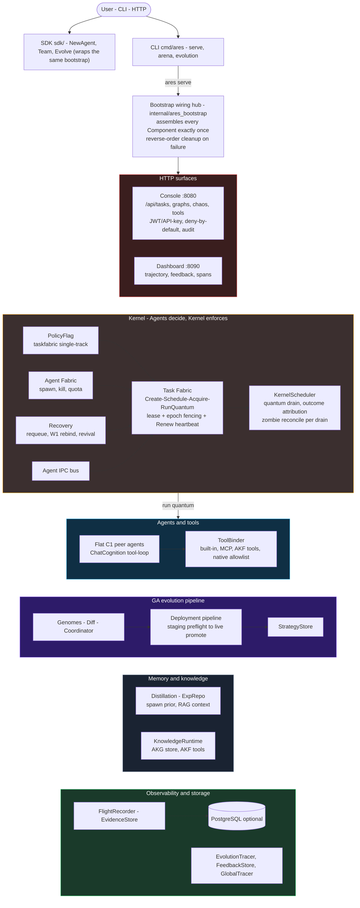
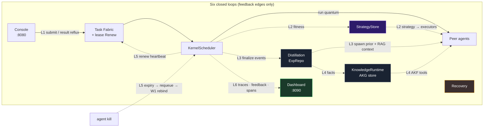
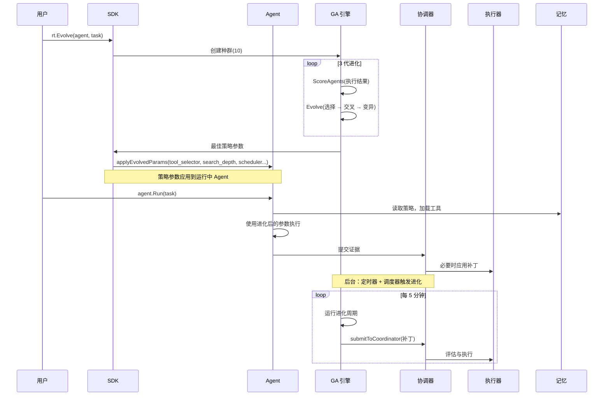

```shell
           _____  ______  _____ 
     /\   |  __ \|  ____|/ ____|
    /  \  | |__) | |__  | (___  
   / /\ \ |  _  /|  __|  \___ \ 
  / ____ \| | \ \| |____ ____) |
 /_/    \_\_|  \_\______|_____/ 

```

**⚠️ 警告：AKG（自适应知识图谱）处于 BETA 实验阶段**

这是**首次尝试在不依赖 LLM 的前提下构建知识图谱**。当前实现使用：
- 基于规则的关系抽取（正则模式，无生成式 AI）
- 混合检索（BM25 风格词法 + 向量余弦相似度）
- 确定性质量评分（无 LLM 评估）

功能状态：**实验性 —— API 可能变化，非生产就绪**。仅用于实验与反馈。

---
**ARES** — 智能体操作系统（Agent Operating System）。

Agent 不是被编排器调用的函数，而是由内核管理的独立认知计算实体。它们自主产生工作、彼此平等通信（IPC）、持有独立的认知状态，并可以 spawn 其他 Agent。ARES Kernel 负责调度、同步、IPC、资源强制、生命周期与恢复。

> **Agents decide. The Kernel enforces.**
> **Agent death is an execution failure, not a task failure.**

具体而言：Task 是可持久化的工作单元，独立于任何 Agent 存活（lease + epoch fencing + checkpoint + 事件溯源恢复）；执行按语义边界量化为 quantum（reason → tool → observe → checkpoint → yield）并由内核调度；调度策略（能力匹配、负载、置信度、优先级）在生产环境中持续进化、无需重启。用 Go 构建，统一 SDK、DAG 工作流、混沌工程、MCP 支持。

## 快速开始

```go
package main

import (
    "context"
    "fmt"

    "github.com/Timwood0x10/ares/sdk"
)

func main() {
    rt := sdk.MustNew() // 零参数：自动检测 Ollama / OPENAI_API_KEY / ANTHROPIC_API_KEY；需要精细配置时使用 sdk.New(opts...)
    defer rt.Close()

    agent := rt.NewAgent("assistant", sdk.WithInstruction("你是一个有用的助手。"))
    result, _ := agent.Run(context.Background(), "你好")
    fmt.Println(result.Output)
}
```

或从 YAML 配置装配（推荐，一份配置驱动 LLM / 记忆 / 蒸馏 / 进化 / 工具）：

```go
rt := sdk.NewRuntime(sdk.WithConfig("ares.yaml")) // 详见 config.yaml 配置指南
defer rt.Close()
// 或读取 ARES_YAML 环境变量（未设置时回退到 ./ares.yaml）：
// rt := sdk.NewRuntime(sdk.WithConfigFromEnv())
```

> 📖 **配置指南**：[config.yaml 配置指南（中文）](docs/articles/zh/25-config-yaml-guide.zh.md) / [config.yaml Guide (EN)](docs/articles/en/25-config-yaml-guide.en.md) —— LLM、蒸馏、GA 进化、知识、工具与混沌相关开关的完整参考。

安装 CLI：

```bash
go install github.com/Timwood0x10/ares/cmd/ares@latest
ares doctor
ares run -c ares.yaml "什么是 Go？"
```

或直接运行示例：

```bash
git clone https://github.com/Timwood0x10/ares
cd ares
make quickstart        # 运行快速开始示例
make examples          # 构建全部示例
```

## 核心特性

| 特性 | 说明 |
|---|---|
| **统一 SDK** | 单一 `sdk.MustNew()` API，统一管理 LLM、工具、记忆、进化；支持 `sdk.NewRuntime(sdk.WithConfig("ares.yaml"))` 配置驱动装配 |
| **System Runtime 生命周期内核** | Orchestrator 逆拓扑启停 + 组件快照可观测 + 缺依赖报 Degraded；serve / start / SDK 三入口共用同一内核 |
| **证据持久化** | `evidence.PostgresStore` 支持 GA 反馈跨重启累积（内存版重启清零），serve/SDK 双接入口 opt-in + fail-loud |
| **运行时进化** | Genome + Diff Engine + Coordinator 持续进化 DAG、调度器、规划器、恢复策略 |
| **策略 GA** | 六 genome 闭环：基于种群的策略优化 — 锦标赛选择、均匀交叉、变异、三级评分；Event→Evidence→GA→Strategy→Agent 真实反馈环 + outcome 写回 experience |
| **证据驱动** | 每次执行事件、故障、洞察都产生 Evidence，驱动进化决策 |
| **DAG 工作流** | 动态图编排，支持条件分支和自动恢复 |
| **混沌韧性** | 故障注入、自动切换、生存测试、自愈恢复 |
| **记忆系统** | 会话上下文、任务蒸馏、向量相似度检索 |
| **持久归档与保留** | 按流隔离的事件轮次归档（并发流互不覆盖对方的 round 文件）+ 定时 TTL 清理，覆盖会话 / 知识 / 对话 / 密钥四类表 |
| **AKG（实验性）** | 无 LLM 知识图谱 —— 规则抽取 + 混合检索 + 质量门 |
| **候选发布闭环（0.3.0）** | `CandidatePipeline`：候选 → 三层验证（静态/证据/回归）→ Release 发布门禁 → SetStable；门3 用 `LLMArenaScorer` + `BatchScorer`（批量合并请求）做 LLM 驱动的保留案例回归，支持 FailoverClient 多 provider 链路（openai / openrouter / anthropic / ollama）自动切换 |
| **MCP 就绪** | 连接任意 MCP 服务器扩展工具和数据 |
| **多 Agent** | 基于能力的 Agent 注册（`RegisterAgent`）+ 任务分发（`Submit`），支持 Peer IPC 与恢复 |
| **可观测性** | OpenTelemetry 追踪、结构化日志、Prometheus 指标 |

## AKG —— 无需 LLM 的知识图谱（实验性）

**⚠️ AKG（自适应知识图谱）处于 BETA 实验阶段。API 可能变化，非生产就绪。仅用于实验与反馈。**

### 探索目标

AKG 是一个围绕单一问题展开的实验：**能否在不引入生成式 LLM 参与抽取循环的前提下，从原始材料构建出精确、可查询的知识图谱？** 当前流水线仅使用 embedding + 规则 + 确定性评分 —— 在写入/构建/检索路径上没有任何 LLM 调用。目标是量化"规则抽取 + 混合检索"能走多远，直到 LLM 成为必需；并让知识层保持廉价、可复现、可完全离线。

### 无 LLM 闭环如何工作

```
写入：  源 → KnowledgeObject（Raw/Normalized/Summary）→ RelationExtractor（规则）
              → EmbeddingService → QualityGate → KnowledgeStore
检索：  query → EmbeddingService → HybridSearch（0.7·向量 + 0.3·词法）
              → 排序后的 KnowledgeObjects → ContextSnippet
注入：  ContextSnippets → Agent 的推理 LLM（唯一涉及 LLM 的环节）
```

LLM 从不参与抽取或构建 —— 它只在推理时消费检索到的事实。

### 当前能力（闭环内无 LLM）

- **三层 `KnowledgeObject`**（Raw → Normalized → Summary），带 evidence/溯源追踪。
- **基于规则的关系抽取**，谓词词表封闭：`calls`、`fixes`、`depends_on`、`belongs_to`、`similar_to`、`supersedes`、`causes`、`related_to`。
- **多维 QualityGate**（抽取/一致性/新鲜度/使用度），驱动 `candidate → active → superseded/rejected` 生命周期与晋升。
- **HybridSearch**：向量余弦 + 词法 Jaccard，按 namespace 与 status 过滤。
- **多后端持久化**：Memory、SQLite、PostgreSQL、**MySQL**（无驱动依赖）。

### 诚实的局限

- 无实体消歧 —— 关于 "Redis" 的两条事实不会合并为同一实体。
- 无语义关系推理 —— 仅抽取规则模式命中的关系。
- 无抽象式摘要 —— `Summary` 是抽取/归一化后的文本，非 LLM 生成。
- 规则正则在异常格式上可能贪婪匹配。
- 向量召回为进程内暴力余弦 —— 适合数万级向量，不适合百万级。

### 可扩展性 —— 架构完全开放

| 扩展点 | 做法 | 涉及接口 |
|---|---|---|
| **新数据库后端** | 新增 `internal/knowledge/store/<name>/store.go` 实现 `KnowledgeStore`。已交付：Memory、SQLite、PostgreSQL、**MySQL**（无驱动依赖 —— 消费方自行 blank-import MySQL 驱动）。CockroachDB / TiDB / Spanner 各只需一个文件。 | `KnowledgeStore`（新增后端时不变） |
| **专业向量库** | 实现 `VectorIndex` 接口（`Upsert` / `Search` / `Delete`）接入 pgvector、Milvus、Weaviate、Qdrant。`InMemoryVectorIndex` 为默认实现。Store 在内部将召回委托给 `VectorIndex`。 | `VectorIndex`（新接缝）—— **`KnowledgeStore` 保持不变** |
| **多租户** | 每个 `KnowledgeObject` 携带 `Namespace`；`Query`、`HybridSearch`、`ListByStatus` 均按其过滤，共享同一 store 的租户互不可见。 | 无新接口 |

> 设计不变量：`KnowledgeStore` 是唯一的持久化契约。新增数据库或向量索引永远不改变它 —— 只会出现新的实现。这正是存储层演进时上层 runtime 逻辑不受影响的根本原因。

## CLI 命令

```bash
ares init        # 创建新项目脚手架（main.go + ares.yaml）
ares run         # 从配置文件运行 agent
ares serve       # 启动完整运行时（LLM + MCP + Console :8080 + Dashboard :8090）
ares bench       # 快速性能基准测试
ares doctor      # 诊断环境（LLM key、Ollama、Git）
ares status      # 查看运行时状态（配置 / agents / kernel policy）
ares version     # 显示版本
ares arena       # 混沌工程场景：run / validate / list / serve / survival / inspect
ares flight      # 检查与回放任务记录：inspect / replay
ares evolution   # 运行时进化：status / run
ares knowledge   # 构建知识图谱：build <goal>（经 HTTP API）
ares recall      # 查询回放已记录的任务记忆：query / round
ares db          # 数据库管理：migrate / setup-test / create-table / check-rls
ares auth        # 签发 / 查看 JWT token
ares mcp-null    # 启动最小 MCP null 服务器（stdio）：serve
```

## SDK 用法

```go
rt, err := sdk.New(
    sdk.WithOpenAI("gpt-4o-mini"),          // 或 WithOllama、WithAnthropic
    sdk.WithDefaultMemory(),                 // 开启会话记忆
    sdk.WithEvolution(),                     // 开启策略进化
    sdk.WithMCP(sdk.MCPConn{                 // 连接 MCP 服务器
        Name: "my-server", Command: "/path/to/server", Args: []string{"serve"},
    }),
)
if err != nil {
    log.Fatal(err)
}
defer rt.Close()

// 带工具和人工审批的 Agent
agent := rt.NewAgent("assistant",
    sdk.WithInstruction("你是一个助手。"),
    sdk.WithTools(calculatorTool, weatherTool),
    sdk.WithHumanInput(approveFn),
)
result, _ := agent.Run(ctx, "计算 15*23")

// 流式响应
ch, _ := agent.Stream(ctx, "讲个故事")
for chunk := range ch { fmt.Print(chunk.Content) }

// 多 Agent：注册能力并提交任务
rt.RegisterAgent("researcher", sdk.WithInstruction("你负责调研。"))
rt.RegisterAgent("writer", sdk.WithInstruction("你负责写作。"))
result, _ := rt.Submit(ctx, sdk.Task{Capability: "researcher", Input: "查找 Go 相关资料。"})
```

完整示例见 [examples/README.md](examples/README.md)。

## 架构

### 闭环运行时架构（终极视图）

两个视图：**组件地图**（正向接线，按 bootstrap 装配顺序自上而下）与**六条反馈闭环**（回馈运行时的边）。每条环都有回归测试锁定（见下表）。

**组件地图**


```mermaid
flowchart TB
    USER(["User - CLI - HTTP"])

    USER --> SDK["SDK sdk/ - NewAgent, Team, Evolve (wraps the same bootstrap)"]
    USER --> CLI["CLI cmd/ares - serve, arena, evolution"]
    CLI -- "ares serve" --> BOOT

    BOOT["Bootstrap wiring hub - internal/ares_bootstrap<br/>assembles every Component exactly once<br/>reverse-order cleanup on failure"]

    BOOT --> HTTPG

    subgraph HTTPG["HTTP surfaces"]
        API["Console :8080<br/>/api/tasks, graphs, chaos, tools<br/>JWT/API-key, deny-by-default, audit"]
        DASH["Dashboard :8090<br/>trajectory, feedback, spans"]
    end

    HTTPG ~~~ KERNELG

    subgraph KERNELG["Kernel - Agents decide, Kernel enforces"]
        POLICY["PolicyFlag<br/>taskfabric single-track"]
        FABRIC["Task Fabric<br/>Create-Schedule-Acquire-RunQuantum<br/>lease + epoch fencing + Renew heartbeat"]
        SCHED["KernelScheduler<br/>quantum drain, outcome attribution<br/>zombie reconcile per drain"]
        AFAB["Agent Fabric<br/>spawn, kill, quota"]
        REC["Recovery<br/>requeue, W1 rebind, revival"]
        IPC["Agent IPC bus"]
        POLICY --> FABRIC
        AFAB --> FABRIC
        REC --> FABRIC
        IPC --> FABRIC
        FABRIC --> SCHED
    end

    KERNELG -- "run quantum" --> AGENTSG

    subgraph AGENTSG["Agents and tools"]
        AG["Flat C1 peer agents<br/>ChatCognition tool-loop"]
        BIND["ToolBinder<br/>built-in, MCP, AKF tools, native allowlist"]
        AG --> BIND
    end

    AGENTSG ~~~ EVOG

    subgraph EVOG["GA evolution pipeline"]
        GAD["Genomes - Diff - Coordinator"]
        DEP["Deployment pipeline<br/>staging preflight to live promote"]
        STRAT["StrategyStore"]
        GAD --> DEP
        DEP --> STRAT
    end

    EVOG ~~~ MEMKG

    subgraph MEMKG["Memory and knowledge"]
        DIS["Distillation - ExpRepo<br/>spawn prior, RAG context"]
        KR["KnowledgeRuntime<br/>AKG store, AKF tools"]
    end

    MEMKG ~~~ OBSG

    subgraph OBSG["Observability and storage"]
        FLY["FlightRecorder - EvidenceStore"]
        TRC["EvolutionTracer, FeedbackStore, GlobalTracer"]
        PG[("PostgreSQL optional")]
        FLY -.-> PG
    end

    style KERNELG fill:#3b2f2f,stroke:#f59e0b,color:#fff
    style AGENTSG fill:#0f2f44,stroke:#38bdf8,color:#fff
    style EVOG fill:#2d1b69,stroke:#8b5cf6,color:#fff
    style MEMKG fill:#1a2332,stroke:#94a3b8,color:#fff
    style OBSG fill:#1a3a2a,stroke:#22c55e,color:#fff
    style HTTPG fill:#3a1e1e,stroke:#ef4444,color:#fff
```

**六条闭环**（虚线 = 回馈运行时的反馈边）


```mermaid
flowchart LR
    subgraph LOOPS["Six closed loops (feedback edges only)"]
        direction TB
        API["Console<br/>:8080"]
        FABRIC["Task Fabric<br/>+ lease Renew"]
        SCHED["KernelScheduler"]
        AG["Peer agents"]
        STRAT["StrategyStore"]
        DIS["Distillation<br/>ExpRepo"]
        KR["KnowledgeRuntime<br/>AKG store"]
        REC["Recovery"]
        DASH["Dashboard<br/>:8090"]
    end

    API -- "L1 submit / result reflux" --> FABRIC
    FABRIC --> SCHED -- "run quantum" --> AG

    SCHED -. "L2 fitness" .-> STRAT
    STRAT -. "L2 strategy → executors" .-> AG

    SCHED -. "L3 finalize events" .-> DIS
    DIS -. "L3 spawn prior + RAG context" .-> AG

    DIS -. "L4 facts" .-> KR
    KR -. "L4 AKF tools" .-> AG

    AFABK["agent kill"] -. "L5 expiry → requeue → W1 rebind" .-> SCHED
    SCHED -. "L5 renew heartbeat" .-> FABRIC

    SCHED -. "L6 traces · feedback · spans" .-> DASH

    style STRAT fill:#2d1b69,stroke:#8b5cf6,color:#fff
    style DIS fill:#1a2332,stroke:#64748b,color:#fff
    style KR fill:#1a2332,stroke:#64748b,color:#fff
    style REC fill:#3b2f2f,stroke:#f59e0b,color:#fff
    style DASH fill:#1a3a2a,stroke:#22c55e,color:#fff
```

六条环路的闭合点与回归锁定：

| 环路 | 闭合路径 | 回归锁定 |
|------|----------|----------|
| **L1** 任务 | `POST /api/tasks` → Fabric → 调度 quantum（运行期间租约心跳续期）→ 经 checkpoint 结果回流 | `TestGraphsEndpoint*`、`TestSchedulerRenewsLeaseDuringLongQuantum` |
| **L2** 进化 | flight fitness → evidence → GA 基因组 → diff → coordinator → 部署流水线（**staging 绝不改写 live 状态**）→ StrategyStore → **StrategySource 注入每个执行器** | `TestDeploymentStaging_DoesNotMutateLiveRegistry`、`TestUpdateLiveDAG_WiredFromServeShape` |
| **L3** 蒸馏 | 任务终结事件 → 蒸馏 → 经验仓库 → spawn prior (G1) + RAG 检索注入 | bootstrap closure 套件 |
| **L4** 知识 | DistillBridge → AKG store → 共享 KnowledgeRuntime ↔ AKF 工具；知识补丁作用于同一实例（`recovery.strategy` target 已注册） | `TestUpdateLiveDAG_*`、patch-registry 测试 |
| **L5** 恢复 | kill → 租约过期（心跳感知）→ 重排队 → W1 替换绑定 → checkpoint 续跑；僵尸注册每 drain 清扫 | `TestReconcileFabricDeaths_*`、`TestSchedulerAttributesFailureAsFailure` |
| **L6** 可观测 | 运行时钩子写入 tracer/feedback/spans → Dashboard APIv2（**现已真正监听 :8090**）实时读取 | bootstrap dashboard 测试 |


## 数据流


```mermaid
sequenceDiagram
    participant U as 用户
    participant S as SDK
    participant A as Agent
    participant GA as GA 引擎
    participant C as 协调器
    participant E as 执行器
    participant M as 记忆

    U->>S: rt.Evolve(agent, task)
    S->>GA: 创建种群(10)
    loop 3 代进化
        GA->>GA: ScoreAgents(执行结果)
        GA->>GA: Evolve(选择 → 交叉 → 变异)
    end
    GA->>S: 最佳策略参数
    S->>A: applyEvolvedParams(tool_selector, search_depth, scheduler...)

    Note over S,A: 策略参数应用到运行中 Agent

    U->>A: agent.Run(task)
    A->>M: 读取策略，加载工具
    A->>A: 使用进化后的参数执行
    A->>C: 提交证据
    C->>E: 必要时应用补丁

    Note over GA,C: 后台：定时器 + 调度器触发进化
    loop 每 5 分钟
        GA->>GA: 运行进化周期
        GA->>C: submitToCoordinator(补丁)
        C->>E: 评估与执行
    end
```
## 评估框架

5 个场景直接检验 ARES 核心能力：

```bash
go run examples/eval/main.go
```

| 场景 | 评估内容 |
|---|---|
| `basic-chat` | 基础对话正确性 |
| `tool-calling` | 工具调用准确性 |
| `multi-agent` | 团队协作能力 |
| `resilience` | 错误恢复能力 |
| `evolution` | 进化前后效果对比 |

## 混沌示例

9 种故障模式全覆盖：

```bash
go run examples/06-chaos-resilience/main.go
```

文件系统故障 / 工具超时 / 不可靠服务 / 优雅降级 / 网络故障 / MCP 断连 / LLM 故障 / 内存损坏

## 文档

| 语言 | 文档 |
|---|---|
| English | [Architecture](docs/articles/en/01-architecture-overview-deep-dive.md), [Agent Harmony](docs/articles/en/02-agent-harmony-protocol.md), [Memory & Distillation](docs/articles/en/03-memory-distillation-deep-dive.md), [Workflow Engine](docs/articles/en/04-workflow-engine-deep-dive.md), [Tool System](docs/articles/en/05-tool-system-deep-dive.md), [Security & Observability](docs/articles/en/06-security-observability-deep-dive.md), [Runtime Lifecycle](docs/articles/en/07-runtime-lifecycle-deep-dive.md), [Event System](docs/articles/en/08-event-system-deep-dive.md), [Chaos Arena](docs/articles/en/09-arena-fault-injection-deep-dive.md), [Retrieval System](docs/articles/en/10-retrieval-system-deep-dive.md), [Autonomous Evolution](docs/articles/en/11-autonomous-evolution-deep-dive.md), [Security Hardening](docs/articles/en/12-security-hardening-deep-dive.md), [Bootstrap & API](docs/articles/en/13-bootstrap-api-deep-dive.md), [Plugin System](docs/articles/en/14-plugin-system-deep-dive.md), [MCP Integration](docs/articles/en/15-mcp-integration-deep-dive.md), [Flight Recorder](docs/articles/en/16-flight-recorder-deep-dive.md), [SDK Layer](docs/articles/en/17-sdk-layer.md), [Knowledge Graph Build](docs/articles/en/18-knowledge-graph-build.md), [Storage Layer](docs/articles/en/19-storage-layer.md), [LLM Client Layer](docs/articles/en/20-llm-client-layer.md), [Evaluation Framework](docs/articles/en/21-evaluation-framework.md), [Config System](docs/articles/en/22-config-system.md), [Quant Trading Module](docs/articles/en/23-quant-trading.md), [GA Deep Dive](docs/articles/en/24.1-ga-deep-dive.md), [GA Tiered Scorer](docs/articles/en/24.2-ga-tiered-scorer.md), [GA Selection Benchmark](docs/articles/en/24.3-ga-selection-benchmark.md), [GA Promoter](docs/articles/en/24.4-ga-promoter.md), [GA Genealogy](docs/articles/en/24.5-ga-genealogy.md), [GA in the Trenches](docs/articles/en/24.6-ga-in-the-trenches.md), [config.yaml Guide](docs/articles/en/25-config-yaml-guide.en.md) |
| 中文 | [架构](docs/articles/zh/01-architecture-overview-deep-dive.md), [Agent 通信协议](docs/articles/zh/02-agent-harmony-protocol.md), [记忆与蒸馏](docs/articles/zh/03-memory-distillation-deep-dive.md), [工作流引擎](docs/articles/zh/04-workflow-engine-deep-dive.md), [工具系统](docs/articles/zh/05-tool-system-deep-dive.md), [安全与可观测性](docs/articles/zh/06-security-observability-deep-dive.md), [运行时生命周期](docs/articles/zh/07-runtime-lifecycle-deep-dive.md), [事件系统](docs/articles/zh/08-event-system-deep-dive.md), [混沌测试](docs/articles/zh/09-arena-fault-injection-deep-dive.md), [检索系统](docs/articles/zh/10-retrieval-system-deep-dive.md), [自主进化](docs/articles/zh/11-autonomous-evolution-deep-dive.md), [安全加固](docs/articles/zh/12-security-hardening-deep-dive.md), [Bootstrap 与 API](docs/articles/zh/13-bootstrap-api-deep-dive.md), [插件系统](docs/articles/zh/14-plugin-system-deep-dive.md), [MCP 集成](docs/articles/zh/15-mcp-integration-deep-dive.md), [Flight Recorder](docs/articles/zh/16-flight-recorder-deep-dive.md), [SDK 层](docs/articles/zh/17-sdk-layer.md), [知识图谱构建](docs/articles/zh/18-knowledge-graph-build.md), [存储层](docs/articles/zh/19-storage-layer.md), [LLM 客户端层](docs/articles/zh/20-llm-client-layer.md), [评估框架](docs/articles/zh/21-evaluation-framework.md), [配置系统](docs/articles/zh/22-config-system.md), [量化交易模块](docs/articles/zh/23-quant-trading.md), [GA 深度解析](docs/articles/zh/24.1-ga-deep-dive.md), [GA 分层评分](docs/articles/zh/24.2-ga-tiered-scorer.md), [GA 选择算子对比](docs/articles/zh/24.3-ga-selection-benchmark.md), [GA 晋升系统](docs/articles/zh/24.4-ga-promoter.md), [GA 谱系记录](docs/articles/zh/24.5-ga-genealogy.md), [GA 实战经验](docs/articles/zh/24.6-ga-in-the-trenches.md), [config.yaml 配置指南](docs/articles/zh/25-config-yaml-guide.zh.md) |

## 项目结构

```
├── sdk/           # 统一 SDK（package sdk）
├── cmd/ares/      # CLI 入口（evolution status/run）
├── evaluation/    # 评估框架
├── examples/      # 24+ 个可运行示例
│   └── runtime_evolution/  # 进化演示（basic / knowledge / full）
├── docs/          # 文档和文章
├── api/           # 公开 API 接口
└── internal/
    ├── evolution/         # 运行时进化系统
    │   ├── genome/        # 5 个 Genome 实现（Workflow/Scheduler/Knowledge/Recovery/Prompt）
    │   ├── diff/          # Diff Engine（4 个 Differ 实现）
    │   ├── coordinator/   # Evolution Coordinator（7 个 PatchSource、PolicyGenome）
    │   ├── patch/         # RuntimePatch 类型 + Registry + Apply/ApplySet
    │   └── llm_adapter.go # LLM 参与者适配器
    ├── ares_evolution/    # 策略级 GA（种群、NSGA-II、交叉、变异、经验系统）
    ├── evidence/          # Evidence 数据原语 + MemoryStore
    ├── workflow/
    │   ├── graph/         # GraphPatchExecutor（7 种 Patch 类型）
    │   └── engine/        # RecoveryPatchExecutor
    ├── knowledge/
    │   └── runtime/       # KnowledgePatchExecutor
    └── ares_bootstrap/    # 装配中心（ProvideNewEvolution）
```

## 运行时进化

ARES 的运行时进化系统是**证据驱动**的：每次执行、故障和洞察都产生 `Evidence`，驱动进化循环。系统持续进化 DAG 拓扑、调度器选择、知识规划器参数和恢复策略——全部生产环境运行，无需重启。

### 架构

```
Execution → Evidence → Genome → Candidate → Diff Engine → RuntimePatch → Coordinator → Apply
```

| 组件 | 作用 | 来源 |
|------|------|------|
| **5 个 Genome** | 通过变异+交叉产生候选配置 | workflow, scheduler, knowledge, recovery, prompt |
| **4 个 Differ** | 比较新旧快照 → 生成 RuntimePatch | workflow, knowledge, scheduler, recovery |
| **Coordinator** | 决策 Apply/Reject/Delay | GA, Chaos, AKF, LLM, Human, K8s, Rule |
| **3 个 Executor** | 将 Patch 应用到运行时代码 | Graph, Knowledge, Recovery |
| **LLM Adapter** | 将自然语言建议转为 PatchProposal | 解析后 → Coordinator |

**关键设计**：LLM 是**参与者**，而非主导者。Coordinator 对所有 7 个 `PatchSource` 值一视同仁，没有来源拥有特权。

### 基准测试（Apple M3 Max，darwin/arm64，2026-08-25）

```
=== 运行时进化（internal/evolution） ===
BenchmarkWorkflowGenome_Mutate     152k   7.92µs  11.9KB  157 allocs
BenchmarkKnowledgeGenome_Mutate    2.67M  440ns    960B    11 allocs
BenchmarkRecoveryGenome_Mutate     2.35M  521ns    1.28KB  21 allocs
BenchmarkDiffEngine_Workflow       2.68M  448ns    304B     3 allocs
BenchmarkCoordinator_Evaluate      188M   6.33ns     0B      0 allocs
BenchmarkFullEvolutionCycle        277k   4.26µs   7.3KB    90 allocs

=== 事件系统（internal/ares_events） ===
BenchmarkMemoryStore_Append           2.24M  519ns    618B    7 allocs
BenchmarkMemoryStore_AppendBatch      300k   3.74µs   8.9KB    1 alloc
BenchmarkMemoryStore_Read             231k   5.40µs  17.5KB   11 allocs
BenchmarkMemoryStore_ConcurrentAppend 1.67M  704ns    625B    6 allocs

=== 内核（internal/taskfabric · agentfabric · agentipc） ===
Fabric_Create             2.59M   389ns   931B     3 allocs
Fabric_Schedule           1.54M   800ns   1.85KB   18 allocs
Fabric_RunQuantum         796k   1.60µs   3.7KB    23 allocs
Fabric_Spawn              3.11M   385ns   936B    10 allocs
Bus_Send                  8.28M   143ns   280B     4 allocs
Bus_RequestReply          1.00M   1.10µs   912B    14 allocs
DualTrackDispatch         121M    9.9ns     0B      0 allocs
```

### CLI

```bash
ares evolution status   # 查看 genomes、differs、coordinator 状态
ares evolution run      # 运行一个进化周期
```

### 示例

```bash
go run examples/11-knowledge-import/ --dir ./notes          # 导入 markdown 到 pgvector
go run examples/11-knowledge-import/ --ask "question"       # RAG 查询知识库
go run examples/11-knowledge-import/ --evolve "task"        # GA 进化导入策略
go run examples/11-knowledge-import/ --chat                 # 交互式对话 + 工具
go run examples/11-knowledge-import/ --team --dir ./notes   # 多 Agent 团队导入
go run examples/11-knowledge-import/ --chaos-fail 0.3       # 故障注入测试
go run examples/11-knowledge-import/akg/                    # 从知识库构建 AKG 图
go run examples/runtime_evolution/basic/      # 完整端到端进化演示
go run examples/runtime_evolution/knowledge/  # Knowledge 参数进化
go run examples/runtime_evolution/full/       # 全部 4 个 Genome + 真实 Executor
```

## 策略进化（GA）

除了运行时级别的进化，ARES 还包含一套**策略级别的遗传算法**，通过基于种群的搜索优化 Agent 推理参数（temperature、top_k、提示词模板、工具配置）。系统跨代使用选择、交叉和变异操作进化策略种群，支持零成本后台进化循环。

### 核心特性

| 特性 | 说明 |
|---|---|
| **NSGA-II 多目标优化** | 4 个默认维度（success_rate 0.40, quality 0.25, cost 0.20, latency 0.15），方向感知帕累托支配 |
| **稳态 GA** | 可配置替换率（0.1–0.5，默认 0.3）—— 每代只替换最差的个体 |
| **Score / SelectionScore** | 规范分数保持不变；选择分数通过适应度共享调整以保持多样性 |
| **适应度共享** | 3 种策略——全量 O(n²)、蓄水池采样、空间网格索引（>500 个体时） |
| **3 种交叉类型** | 均匀（逐基因）、两点（交换片段）、段（连续块） |
| **6 种变异类型** | 参数、提示词、工具、交换、逆序、洗牌 |
| **进化回调** | OnGeneration / OnFitness / OnMutation / OnCrossover |
| **终止条件** | MaxGenerations + TargetFitness（BestEverScore ≥ 目标值时停止） |
| **世代历史** | 每代快照及元数据 |
| **经验系统** | 三层管道：ToolCallRecord → RawExperience → NormalizedExperience → EvolutionHint → GuidanceProvider |

### 基准测试（Apple M3 Max，darwin/arm64，2026-08-25）

```
=== GA Genome（internal/ares_evolution/genome） ===
CrossoverUniform (10 params)        500k   2.46µs   3.1KB   31 allocs
CrossoverUniform (100 params)       61.5k  17.8µs   21.2KB  38 allocs
TruncationSelection (pop=100)       209k   5.82µs   952B     3 allocs
TournamentSelection (pop=50,k=2)    287k   4.45µs  14.4KB  101 allocs
RouletteWheelSelection (pop=100)    422k   2.84µs   3.4KB    7 allocs
Evolve_OneGeneration (pop=100)      4.60M   263ns   344B     6 allocs
Evolve_MultipleGenerations (100)    45.3k  25.9µs  29.6KB  600 allocs
ApplyFitnessSharing (pop=100)         896   1.34ms   540KB 106 allocs
RealWorldEvolution (100 gen)          100  10.05ms   4.4MB 61871 allocs
```

### 示例

```bash
go run examples/10-ga-full-evolution/main.go   # 完整 GA 进化演示
go run examples/05-evolution-demo/main.go       # NSGA-II 之前的进化演示
```

## 候选发布闭环（0.3.0）

进化产出的策略通过 **`CandidatePipeline`** 形成从生成到发布的**分层门禁**：

```
NewCandidate → Verify（门1 静态 + 门2 证据 + 门3 回归）→ Verified
             → Release（coordinator 决策 + canary）→ 发布前门3再确认 → SetStable → Promoted
```

- **门3 回归检查**：`CandidateVerifier` 与 `CandidatePipeline.Release` 共用同一个 `CandidateRegressionChecker`（注入 `WithRegressionCheck` / `WithReleaseRegressionCheck`），用 **`LLMArenaScorer`**（`internal/ares_evolution/service/llm_arena_scorer.go`）调真实 LLM 对比 stable 指令 vs 候选 diff 在保留案例上的表现，统计显著变差则拒绝。
- **`BatchScorer` 批量合并**：`ares_arena.BatchScorer` + `LLMArenaScorer.ScoreBatch` 把一次回归的所有 runs 合并成 2 次 LLM 调用（应对低 rpm 限流）。
- **顶层编排器**：`internal/evolution/gate3_orchestrator.go` 的 `BuildRegressionGate3` / `LoadRegressionGate3` 从 YAML 装配 `llm.Client`（支持 openai / openrouter / anthropic / ollama），并可组成 FailoverClient 主备链路在限流时自动切换。

真实运行示例与完整日志：`examples/15-llm-evolution-suite`（真实 LLM 的 `scorer` / `regression` / `gate3` / `release` 四个场景，各自写入 `logs/run-<ts>.log`）；离线可复现的 GA 候选进化见 `examples/19-ga-candidate-e2e`。

## 许可证

Apache 2.0

## 致谢

ARES 的遗传算法实现参考了 **[PyGAD](https://github.com/ahmedfgad/GeneticAlgorithmPython)** —— [Ahmed F. Gad](https://github.com/ahmedfgad) 开发的 Python 遗传算法库。PyGAD 的架构设计、算子实现和多目标优化能力为本项目的 GA 引擎提供了重要参考。

如果您需要成熟、文档完善的 Python GA 库，推荐使用 PyGAD：
- GitHub: [github.com/ahmedfgad/GeneticAlgorithmPython](https://github.com/ahmedfgad/GeneticAlgorithmPython)
- 文档: [pygad.readthedocs.io](https://pygad.readthedocs.io/)

额外的 GA 概念和术语遵循 [Genetic Algorithm](https://en.wikipedia.org/wiki/Genetic_algorithm) 维基百科条目的标准定义。
