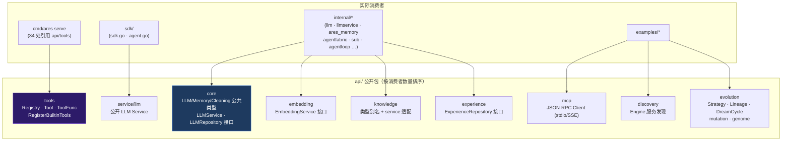
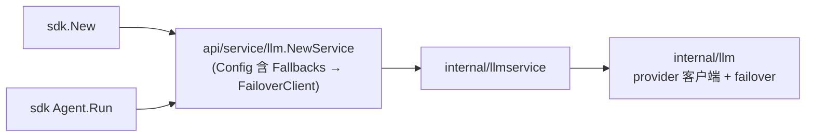
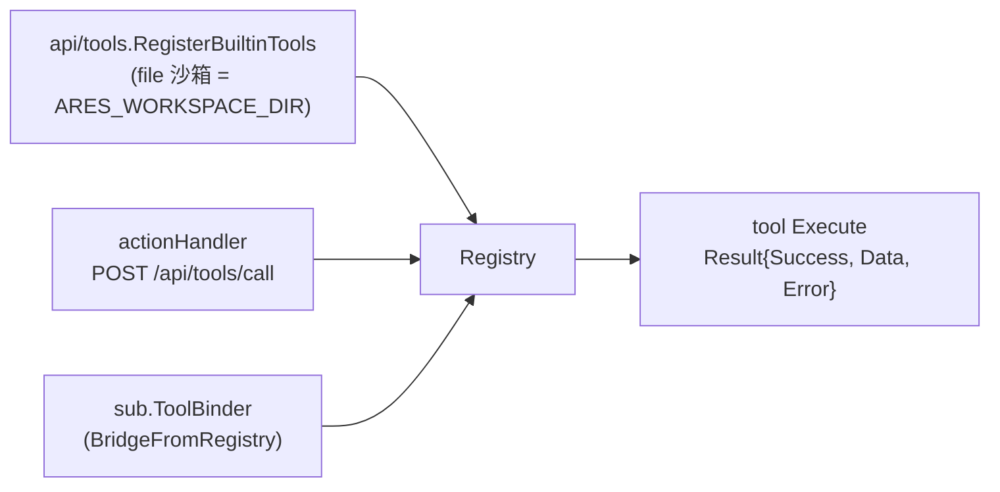
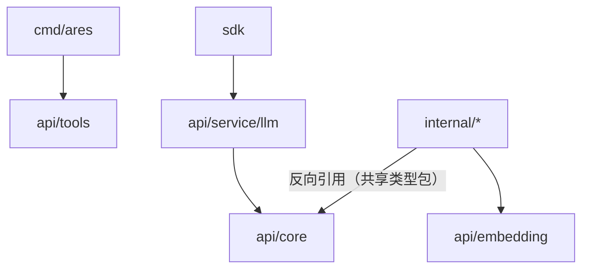
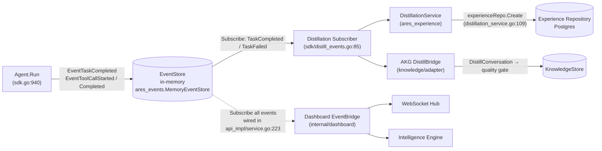

# API Architecture Design

## 现状说明

> **历史变更**：早期的"三层客户端架构"（`api/client` 统一客户端 + `api/service/{agent,memory,retrieval,llm}` + `api/core` 接口层）中的 **legacy client 已被删除**。
> 迁移指引见 [MIGRATION.md](MIGRATION.md)。本文档描述的是**当前真实存在**的 `api/` 公开包——
> 每个导出的类型与函数都标注了实际消费者，可直接用 grep 验证。

## 模块地图



## 各包职责（以源码为准）

### api/core — 公共类型与抽象

**实际内容**（`types.go` · `llm.go` · `memory.go` · `cleaning.go`）：

- LLM 类型族：`LLMConfig` · `GenerateRequest` / `GenerateResponse` · `ToolCall` · `TokenUsage` · `EmbeddingRequest` / `EmbeddingResponse`
- 接口：`LLMService` · `LLMRepository`
- Memory：`Message` · `MessageRole`
- Context cleaning：`CleaningMode` · `CleanOptions` · `DefaultCleanOptions()`

**消费者**：internal 下 10+ 个包（`internal/llm`、`internal/llmservice`、`internal/agentfabric`、`internal/agents/sub`、`internal/ares_memory` 等）将其作为共享类型包反向引用。

### api/service/llm — 唯一保留的 service 包

**实际内容**（`service.go`）：公开 LLM `Service`，
构造时把 `Config`（含 `Fallbacks`）转换为 internal 配置并组装 FailoverClient；
方法：`Generate` · `GenerateSimple` · `GenerateEmbedding` · `GetConfig`。

**消费者**：`sdk/sdk.go`、`internal/agentloop/engine.go`。

> ⚠️ 老文档宣称的 `agent/`、`memory/`、`retrieval/` 三个同级 service **不存在**。

### api/tools — 公开工具注册表

**实际内容**（`tools.go` · `builtin.go`）：`Registry`（Register/Execute/List/CoreRegistry）·
`Tool` / `ToolFunc` / `Result` · `RegisterBuiltinTools`（calculator · json · regex · file(沙箱) · web_search）。

**消费者**：`cmd/ares serve` 全链路（工具注册、`/api/tools*` HTTP 端点、MCP 桥接、监控适配）。

### 其余公开包

| 包 | 内容 | 消费者 |
|----|------|--------|
| `api/embedding` | `EmbeddingService` 接口 | internal 14 处（embedding 管线、知识运行时） |
| `api/evolution` | `Strategy` · `Lineage` · `DreamCycle` · Promoter · mutation/genome 子包 | GA 相关 examples |
| `api/mcp` | MCP JSON-RPC `Client`（ListTools/CallTool）+ stdio/SSE transport | examples（mcp-registry 等） |
| `api/discovery` | 服务发现 `Engine`（Register/List/DiscoverNow/CheckHealth） | examples（discovery） |
| `api/knowledge` | knowledge 领域类型别名 + service 适配 | `internal/knowledge/service` |
| `api/experience` | `ExperienceRepository` 接口 + 经验类型 | 蒸馏路径 |

## 数据流向（真实调用链）

**SDK 的 LLM 链**：



**serve 的工具链**：



## 依赖方向（含一处反直觉的事实）



> 与经典分层不同：`api/core` 在此仓库中是 **被 internal 反向引用的公共类型包**
> （而非"被 service 依赖的最底层接口"）。这是现状事实；新增共享类型时应放入
> `api/core` 并保持零内部依赖。

## 接口设计原则

以三个**真实存在**的接口为例：

```go
// api/core/llm.go — LLM 抽象（由 internal/llmservice 实现）
type LLMService interface {
    Generate(ctx context.Context, req *GenerateRequest) (*GenerateResponse, error)
}

// api/experience/repository.go — 经验仓储抽象（蒸馏路径消费）
type ExperienceRepository interface { /* ListByAgent, Create, ... */ }

// api/tools/tools.go — 工具契约（Registry 执行的最小单元）
type Tool interface {
    Name() string
    Description() string
    Parameters() map[string]any
    Capabilities() []string
    Execute(ctx context.Context, params map[string]any) (Result, error)
}
```

原则：接口定义在**消费方可见的公开包**中，实现留在 internal；
公开包之间禁止互相 import 形成环（`api/core` 保持零内部依赖）。

## 错误处理策略

**现状**：`api/service/llm` 未定义公开 sentinel 错误集，当前模式是
直接透传 internal 层错误（`internal/llm` 的 `HTTPError` 等类型实现了
`error` 接口），调用方按需断言。新增公开错误时遵循：
sentinel 定义在产生它的包内、用 `%w` 包装保持链路、调用方只用 `errors.Is/As`。

## Dependency Graph

This section documents how the SDK Runtime wires its modules at construction
time (`sdk.New`) and which modules the agent execution flow passes through at
run time (`Agent.Run`). Every claim below is traceable to a source location so
new developers can answer "which modules does the agent execution flow pass
through?" without reading the whole codebase.

### Bootstrap stage (sdk.New)

`sdk.New` (`sdk/sdk.go:587`) constructs the Runtime by composing a handful of
`wire*` helpers. The call order below is the actual order in `New`, not a
logical reordering. Each leaf names the value stored on the `Runtime` struct
(`sdk/sdk.go:127`) and the source location that backs it.

```
sdk.New  (sdk/sdk.go:587)
├─ llm.NewService                     → llmSvc            (sdk.go:601)
├─ tools.NewRegistry                  → toolReg           (sdk.go:606)
├─ wireMemory                         → memMgr, embClient, expRepo, distillSvc,
│   (sdk/memory_wiring.go:413)          akgDistiller, distillCleanup
│   ├─ distillation disabled:
│   │    memory.NewMemoryManager           (compression only)   (memory_wiring.go:417)
│   ├─ distillation enabled + deps OK:
│   │    memory.NewMemoryManagerWithDistiller (compression + RAG + distiller)
│   │                                                              (memory_wiring.go:440)
│   ├─ buildDistillationService       → distillSvc        (optional, non-fatal) (memory_wiring.go:451)
│   └─ buildAKGDistiller              → akgDistiller      (optional, non-fatal) (memory_wiring.go:465)
│   Fallback: distillation deps missing or construction failed → compression-only
│   NewMemoryManager                                          (memory_wiring.go:424-438)
├─ wireMCPClients                     → mcpClients        (sdk.go:629, def L552)
├─ wireKnowledge                      → knowledgeRT, knowledgeStore, evolutionStore
│   (sdk.go:636, def L366)
│   ├─ registerKnowledgeProviders     (memory / evolution / extra)  (sdk.go:378, def L423)
│   ├─ buildKnowledgeStore            (SQLite > Postgres > in-memory) (sdk.go:382, def L449)
│   ├─ StoreProvider registered       (closes AKG write→read loop)   (sdk.go:391)
│   └─ khruntime.New                  (planner + linkers + reducers) (sdk.go:402)
├─ registerAKFTools                   (optional, when knowledge enabled) (sdk.go:642)
├─ wireEvolutionHotUpdate             → evoComponents      (optional) (sdk.go:650, def L525)
├─ wireSDKRetrievers                  (best-effort) injects MemoryRetriever +
│   (sdk.go:654, def L723)              KnowledgeRetriever into memMgr via SetRetrievers
├─ buildAKGBridge                     → akgBridge          (optional) (sdk.go:659, def L499)
└─ newEventBackend                    → ctx, cancel, eg, eventStore + subscriber
    (sdk.go:661, def sdk/distill_events.go:47)
    └─ wireDistillationSubscriber     (TaskCompleted/TaskFailed → distillSvc + akgBridge)
        (sdk/distill_events.go:85)
```

Notes on the bootstrap tree:

- `wireMemory` is the only helper with a fallback path. When distillation is
  enabled but its dependencies (embedding service URL or Postgres host) are
  missing, it logs a warning and returns a compression-only
  `MemoryManager` instead of failing the whole Runtime
  (`sdk/memory_wiring.go:424-438`, `ErrDistillDepsMissing` at L57).
- `distillSvc` and `akgDistiller` are both constructed non-fatally: a
  construction failure disables event-driven distillation (or the AKG bridge)
  but leaves the `MemoryManager` working (`sdk/memory_wiring.go:451-472`).
- `newEventBackend` creates the in-memory `MemoryEventStore`
  (`sdk/distill_events.go:55`) and starts the background distillation
  subscriber only when at least one of `distillSvc` / `akgBridge` is non-nil
  (`sdk/distill_events.go:56`). When both are nil, the store is still
  returned but no subscriber runs.

### Execution stage (Agent.Run)

`Agent.Run` (`sdk/sdk.go:954`) runs a ReAct loop. The tree below lists every
module the execution flow passes through. "optional" means the call is gated
on a runtime flag (memory enabled / eventStore non-nil) and may be skipped.

```
Agent.Run  (sdk/sdk.go:954)
├─ buildMessages                                 (sdk.go:965, def L1128)
│  ├─ memMgr.BuildContext        (optional, RAG context)        (sdk.go:1140)
│  ├─ knowledgeRT.Execute        (optional, AKG context)        (sdk.go:1156)
│  └─ memMgr.AddMessage          (user message, optional)       (sdk.go:1181)
├─ for iter < maxIter:
│  ├─ llmSvc.Generate            → LLM response                 (sdk.go:983)
│  ├─ memMgr.AddMessage          (assistant message, optional)  (sdk.go:1002)
│  ├─ if no tool calls (final answer):
│  │  ├─ ares_events.Emit EventTaskCompleted
│  │  │   (optional, gated on eventStore + distillSvc)          (sdk.go:1017)
│  │  └─ return Result
│  └─ for each tool call:
│     ├─ eventStore.Append EventToolCallStarted  (optional)     (sdk.go:1066)
│     ├─ toolReg.Execute                         → tool result  (sdk.go:1078)
│     └─ eventStore.Append EventToolCallCompleted (optional)    (sdk.go:1093)
```

So the modules the execution flow always passes through are `llmSvc` and
`toolReg`. The `memMgr`, `knowledgeRT`, and `eventStore` modules are
optional and depend on the Runtime configuration (`memEnabled`,
`knowledgeEnabled`, and whether `distillSvc` was constructed).

### Events flow

The diagram below shows the flow of events emitted by `Agent.Run`. Solid
edges run inside every `sdk.New` Runtime that has distillation enabled. The
dashed edge (Dashboard EventBridge) is wired only in the full service
deployment (`internal/api_impl/service.go`), where a shared `EventStore` is
injected into `ares_bootstrap.Bootstrap` and also fed to the dashboard — it
is not wired by `sdk.New` itself.



Verified branches:

- `Agent.Run` → `EventStore`: `ares_events.Emit` writes `EventTaskCompleted`
  (`sdk/sdk.go:1003-1012`); `eventStore.Append` writes `EventToolCallStarted`
  and `EventToolCallCompleted` (`sdk/sdk.go:1052`, `sdk/sdk.go:1079`).
- `EventStore` → Distillation Subscriber → `DistillationService` → Experience
  Repository: the subscriber is started in `wireDistillationSubscriber`
  (`sdk/distill_events.go:85`), which calls
  `ares_bootstrap.HandleTaskCompletedForDistillation`
  (`sdk/distill_events.go:119`) → `DistillationService.Distill`
  (`internal/ares_bootstrap/provide_distillation.go:180`) →
  `experienceRepo.Create` (`internal/ares_experience/distillation_service.go:109`).
- `EventStore` → AKG DistillBridge → KnowledgeStore: the subscriber calls
  `triggerAKGBridge` (`sdk/distill_events.go:122`) →
  `bridge.DistillConversation` (`sdk/distill_events.go:165`), which persists
  AKG KnowledgeObjects through the quality gate into the `KnowledgeStore`
  wired by `buildAKGBridge` (`sdk/sdk.go:646`).
- `EventStore` → Dashboard EventBridge → WebSocket / Intelligence Engine:
  `dashboard.NewEventBridge` subscribes to the EventStore and forwards every
  event to the WebSocket hub and the intelligence engine
  (`internal/dashboard/event_bridge.go:32`, `:84`, `:95`). It is wired in
  `internal/api_impl/service.go:223` against the shared EventStore built at
  `internal/api_impl/service.go:176` and passed to
  `ares_bootstrap.Bootstrap` at `internal/api_impl/service.go:184`. This
  branch does NOT run in a pure `sdk.New` Runtime, whose `eventStore` is
  private and has no public accessor on `Runtime` (`sdk/sdk.go:129`).

### Module maturity

The AKG / knowledge packages — `internal/knowledge` and its subpackages
(`adapter`, `compiler`, `linker`, `planner`, `provider`, `runtime`, `store/*`)
— plus the evolution packages under `internal/ares_evolution` are designated
Beta. They carry package-level Beta markers added by Task 2 of the ARES
optimization plan; treat their public API as potentially unstable and subject
to breaking changes before GA. The LLM, tool registry, memory manager, event
store, and distillation service referenced in the trees above are stable.