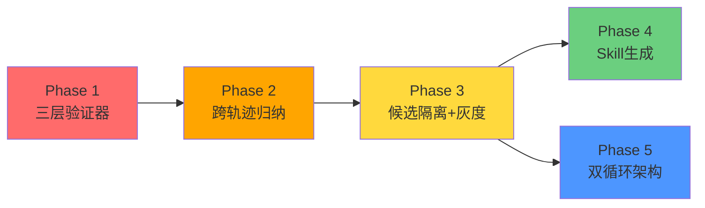

# GoAgent 持续进化能力评估与增强计划
**基于《AI Agents in Depth》第 8 章理论框架 · 修订版**

---

## 一、当前状态评估（准确版）

### 1.1 已有能力清单（之前被低估的部分）

| 第 8 章要求 | GoAgent 现有实现 | 完成度 | 备注 |
|------------|-----------------|--------|------|
| **轨迹记录** | `ares_events` + `Flight` + `dream_cycle.go` 集成 | ✅ 90% | 完整事件流 |
| **经验蒸馏** | `DistillationService` (problem/solution/constraints) | ⚠️ 60% | 单条蒸馏，缺质量校验 |
| **Bandit反馈** | `FeedbackService` (RecordSuccess/RecordFailure) | ✅ 70% | 有正负反馈闭环 |
| **经验冲突解决** | `ConflictResolver` (cosine similarity 聚类) | ✅ 70% | 能做冲突分组，但缺正式淘汰机制 |
| **多维排名** | `RankingService` (语义+使用+时效+bandit分) | ✅ 80% | 公式完善 |
| **进化循环引擎** | `DreamCycle` (ES/GA双模式, MinWinRate门槛) | ✅ 75% | 有快速拒绝+全量评估 |
| **基因组适配** | `GenomePopulationAdapter` + `ShadowEvaluator` | ⚠️ 50% | 有评估框架但缺隔离发布 |
| **回滚策略** | `RollbackPolicy` 接口+实现 | ✅ 60% | 有接口但未深度集成到 DreamCycle |
| **安全护栏** | `Guardrails` + `guardrails_event_handler` | ✅ 70% | 有运行时安全检查 |
| **回归测试** | `RegressionTester` | ✅ 60% | 有基础回归 |
| **突变搜索** | `mutation/` 目录 (多种突变算子) | ⚠️ 40% | 有算子但缺执行前后状态检查 |

### 1.2 关键差距（准确识别）

#### 差距一：三层验证器结构不完整 ⭐ 最大缺口

```
第8章要求:
┌──────────────────────────────────┐
│ 上层: Rubric LLM Judge           │ ✅ DimensionJudge (部分)
├──────────────────────────────────┤
│ 中层: 过程验证器(业务规则/权限)   │ ❌ 完全缺失
├──────────────────────────────────┤
│ 底层: 结果验证器(硬验证/环境状态) │ ❌ 完全缺失
└──────────────────────────────────┘
```

**为什么这是最大的缺口：**
- 当前只有"模型自评"（LLM Judge），没有"环境真值验证"
- 无法区分"结果碰巧对了但过程违规"的情况
- 比如：Agent 违规给用户退款成功——DimensionJudge 可能给高分，但实际违反了业务规则

#### 差距二：跨轨迹归纳停留在"相似聚类"层面

现有 `ConflictResolver` 只做：
```go
// 现状：基于 embedding 相似度聚类
cosineSimilarity > threshold → 同一组 → 保留最高分
```

书中要求的是：
```
任务族聚类 → 成功/失败分类对比 → 生成"支持/反驳证据表" → 形成正式知识文档
```

**缺失的关键环节：**
1. 成功/失败/部分成功的显式分类（当前只靠 score 隐式判断）
2. 跨轨迹的策略对比分析（哪几步是成功必需的，哪些是偶然）
3. 从"候选教训"到"正式知识"的迁移测试门槛

#### 差距三：进化产物缺少"隔离-灰度-回滚"完整链路

现有 `DreamCycle` 流程：
```
生成候选 → 评分 → MinWinRate 筛选 → 直接替换
```

书中要求的完整链路：
```
生成候选 → 写入隔离候选目录 → 边界集回放 → 保留集回放 → 
静态检查 → 安全扫描 → Canary灰度(10%) → 监控 → 自动回滚
```

**缺失的关键环节：**
1. 候选不触碰稳定版本的物理隔离
2. Canary 流量观察期（至少 2-4 小时）
3. 可审计的发布记录（谁发布的、为什么、何时回滚）

#### 差距四：Skill 自动生成完全空白

书中明确指出当多条经验形成完整操作流程时应升级为 Skill（岗位操作手册）。GoAgent 完全没有这个能力。

#### 差距五：线上/线下循环未彻底分离

现有 `DreamCycle` 是定时触发的后台任务，但：
- 它和主 Agent 共享同一进程空间
- 进化信号直接来自 `feedback_service` 的同步调用
- 没有"在线只记录、离线才修改"的明确边界

---

## 二、增强方案设计（精准对标）

### Phase 1：补全三层验证器 ⭐⭐⭐ 最高优先级

#### 1.1 底层：结果验证器（硬验证）

**核心思想**：不信任 LLM 自评，只读环境真实状态

```go
// internal/ares_eval/result_verifier.go

// ResultVerifier: 读取环境真实状态，回答"事情是否真的办成"
type ResultVerifier interface {
    Verify(ctx context.Context, task *models.Task, 
           trajectory []*ares_events.Event) (*VerificationResult, error)
}

type VerificationResult struct {
    Passed     bool                   // true=完成, false=未完成, nil=不确定
    Evidence   map[string]any         // 硬证据
    Confidence float64               // 0-1
    Failures   []FailurePoint
}

type FailurePoint struct {
    StepIndex    int
    Expected     string  // 期望看到什么
    Actual       string  // 实际看到什么  
    SourceEventID string // 对应的轨迹事件ID
}

// ---- 具体实现 ----

// ToolCallVerifier: 检查关键工具调用是否执行
type ToolCallVerifier struct {
    RequiredCalls map[string]bool // tool_name -> 必须调用
}

func (v *ToolCallVerifier) Verify(ctx context.Context, task *models.Task,
    trajectory []*ares_events.Event) (*VerificationResult, error) {
    
    calledTools := collectCalledTools(trajectory) // 从轨迹中提取所有 tool_call
    passed := true
    
    for requiredTool := range v.RequiredCalls {
        if !calledTools[requiredTool] {
            passed = false
            // 记录失败点，供后续诊断
        }
    }
    return &VerificationResult{Passed: passed, Evidence: calledTools}, nil
}

// DBStateVerifier: 检查目标数据库状态是否达成
type DBStateVerifier struct {
    Assertions []DBAssertion // 期望的DB状态断言
}

// FilePresenceVerifier: 检查关键文件是否存在（需配合 VFS）
type FilePresenceVerifier struct {
    RequiredFiles map[string]bool
}
```

**集成点**：在 `leader/aggregator.go` 的 `Aggregate()` **之前**插入：
```go
// 旧流程: results → Aggregate()
// 新流程: results → ResultVerifier.Verify() → 不通过则标记待复核 → Aggregate()

verifier := buildResultVerifier(task)
resultVerdict, err := verifier.Verify(ctx, task, trajectory)
if err != nil || !resultVerdict.Passed {
    // 硬验证不通过，即使 LLM 认为成功也要记录
    signal := buildLearningSignal(task, resultVerdict, "hard_verification_failed")
    offlineQueue.Push(signal) // 进入离线循环处理
}
```

#### 1.2 中层：过程验证器（业务规则引擎）

**核心思想**：不信任最终结果，验证"走的路对不对"

```go
// internal/ares_eval/process_verifier.go

type ProcessVerifier interface {
    VerifyProcess(ctx context.Context, 
        trajectory []*ares_events.Event) (*ProcessResult, error)
}

type ProcessResult struct {
    RuleCompliance bool
    PermissionOK   bool
    SequenceValid  bool
    Violations     []RuleViolation
}

type RuleViolation struct {
    RuleID      string
    Severity    SeverityLevel // critical/warning/info
    StepIndex   int
    Evidence    string  // 具体的轨迹轮次
    SuggestedFix string
}

// ---- 内置规则库 ----
var DefaultBusinessRules = []Rule{
    {
        ID:         "no-delete-without-confirm",
        Description: "删除操作前必须有用户确认",
        Check: func(event *ares_events.Event) bool {
            return isDeleteAction(event) && !hasPriorConfirm(event)
        },
        Severity: Critical,
    },
    {
        ID:         "sensitive-data-access-chain",
        Description: "访问敏感数据需要完整的授权链",
        Check: func(event *ares_events.Event) bool {
            return isSensitiveAccess(event) && !hasAuthorizationChain(event)
        },
        Severity: Critical,
    },
}

// SequenceValidator: 检查动作序列合法性
type SequenceValidator struct {
    Transitions map[string][]string // from_state -> [allowed_next_states]
}
```

#### 1.3 上层：Rubric 评价增强

**核心改动**：从"单一标量打分"升级为"带证据的结构化诊断"

```go
// internal/ares_eval/rubric_verifier.go

type StructuredDiagnosis struct {
    Summary  string
    Dimensions map[string]DimensionScore
    Flags    []Flag          // 需人工关注的高风险项
    Confidence float64
}

type DimensionScore struct {
    Score       int
    Max         int
    Evidence    []string     // "turn-12: 引用了官方文档section-4.2"
    IsUncertain bool
    Reason      string
}
```

---

### Phase 2：跨轨迹归纳系统（预计 3 周）

#### 2.1 三层数据存储（改造现有 Experience 表）

```go
// 现有 Experience 表不变，新增两张表

// Layer 1: raw_trajectories（原始轨迹，不可变）
type RawTrajectory struct {
    TrajectoryID string
    TaskID       string
    SessionID    string
    AgentID      string
    RawEvents    []byte        // JSON 序列化完整事件流
    EnvironmentState map[string]any // 最终环境快照
    CreatedAt    time.Time
}

// Layer 2: analysis_records（单次运行分析，可迭代）
type AnalysisRecord struct {
    AnalysisID     string
    TrajectoryID   string  // FK → raw_trajectories
    Success        bool    // 经结果验证器判定
    Difficulty     string
    TaskFamily     string  // 任务族标签（由聚类引擎赋予）
    Strategies     []string
    Errors         []ErrorRecord
    CandidateLessons []string  // 本条轨迹的候选教训
}

// Layer 3: formal_experiences（正式知识，需迁移测试通过后写入）
// 现有 experience 表升级为此层
```

#### 2.2 任务族聚类增强（扩展现有 ConflictResolver）

```go
// internal/ares_experience/clustering.go

// 扩展现有的 ConflictResolver，增加显式任务族标注
type EnhancedClusterer struct {
    BaseConflictResolver *ConflictResolver  // 复用现有 cosine 聚类逻辑
    llmClassifier        *LLMTaskClassifier // 用 LLM 标注任务族
}

type TaskFamilyCluster struct {
    ClusterID    string
    FamilyName   string      // "flight_booking", "customer_complaint" 等
    Members      []string    // AnalysisRecord IDs
    SuccessCount int
    FailureCount int
    Representative string   // 簇的代表性轨迹
}
```

#### 2.3 跨轨迹对比引擎

```go
// internal/ares_experience/comparator.go

type TrajectoryComparator struct {
    llmClient *llm.Client
}

func (c *TrajectoryComparator) Compare(ctx context.Context,
    successAnalyses []AnalysisRecord,
    failureAnalyses []AnalysisRecord) (*ComparisonResult, error) {
    
    // 输入：同任务族的成功/失败案例
    // 输出：
    // - CommonSuccessPatterns: 成功轨迹共有的步骤
    // - DistinguishingFactors: 成功vs失败的关键差异  
    // - ConditionalStrategies: 仅在特定条件下有效的策略
    // - RefutedHypotheses: 被失败轨迹推翻的假设
}
```

---

### Phase 3：候选-灰度-回滚完整链路（预计 3 周）

#### 3.1 候选隔离机制

```go
// internal/ares_evolution/candidate_isolation.go

type CandidateStore struct {
    stableDir    string   // /evolution/stable/
    candidateDir string  // /evolution/candidates/{version}/
    rejectedDir  string  // /evolution/rejected/
}

// 关键：Submit 只写候选目录，不触碰稳定目录
func (s *CandidateStore) Submit(candidate *EvolutionCandidate) error {
    version := fmt.Sprintf("v%d", s.nextVersion())
    path := filepath.Join(s.candidateDir, version)
    // 写入候选...
}

// Approve 才允许从候选目录移动到稳定目录（原子操作）
func (s *CandidateStore) Approve(version string) error {
    src := filepath.Join(s.candidateDir, version)
    dst := filepath.Join(s.stableDir, version)
    return atomicRename(src, dst) // 原子替换
}
```

#### 3.2 Canary 灰度发布

```go
// internal/ares_evolution/canary_deployer.go

type CanaryDeployer struct {
    router           Router
    metricsCollector MetricsCollector
    minObservationHours int    // 最少观察时间
    degradationThreshold float64 // 指标下降超过此值触发回滚
}

func (d *CanaryDeployer) Deploy(ctx context.Context,
    candidate *EvolutionCandidate,
    initialTraffic float64) (*DeploymentResult, error) {
    
    // 1. 注册新版本
    // 2. 设置小比例流量（10%）
    // 3. 启动监控协程
    // 4. 返回 DeploymentResult（含 monitor ID）
}

// 监控协程定期检查指标
func (d *CanaryDeployer) monitorLoop(deployment *DeploymentResult) {
    ticker := time.NewTicker(5 * time.Minute)
    for {
        select {
        case <-ticker.C:
            metrics := d.metricsCollector.Get(deployment.Version)
            if d.shouldRollback(metrics) {
                d.rollback(deployment.Version)
                return
            }
            if d.shouldPromote(metrics) {
                d.promoteToFullTraffic(deployment.Version)
                return
            }
        case <-deployment.ctx.Done():
            return
        }
    }
}
```

#### 3.3 接入现有 RollbackPolicy

```go
// internal/ares_evolution/rollback_policy.go （已有，需增强接入）

// 现有 RollbackPolicy 接口保持不变
// 新增：与 CanaryDeployer 集成

func init() {
    // 在 bootstrap 阶段连接
    evolution.CanaryDeployer.SetRollbackPolicy(evolutionRollbackPolicy)
}
```

---

### Phase 4：Skill 自动生成（预计 2 周）

```go
// internal/ares_evolution/skill_generator.go

type SkillGenerator struct {
    llmClient       *llm.Client
    skillRepo       repositories.SkillRepository
    duplicateDetector DuplicateDetector
}

// 触发条件：同一类失败出现 >= N 次，且可总结为明确操作流程
func (g *SkillGenerator) GenerateFromFailures(ctx context.Context,
    failures []FailedCase) (*SkillCandidate, error) {
    
    // 1. 检查是否已有近似 Skill（避免重复）
    existing := g.skillRepo.SearchSimilar(ctx, failures[0].TaskType)
    if existing != nil {
        return g.patchExistingSkill(ctx, existing, failures)
    }
    
    // 2. 从失败案例提取共性模式
    // 3. 生成结构化 Skill（触发条件、前置条件、步骤、已知陷阱）
    // 4. 验证生成的 Skill 能通过边界案例
}
```

**Skill 文档模板**（自动生成的 SKILL.md）：
```markdown
# Skill: 保险理赔标准流程

## 触发条件
当用户发起保险理赔相关请求，且提供了保单号时

## 前置条件  
- [ ] 用户已提供有效保单号
- [ ] 损失类型确认为 covered peril

## 操作步骤
1. **验证保单有效性** — 调用 verify_policy(policy_id)，等待 200 响应
   - 验证点：保单状态必须为 active
2. **收集损失证据** — 引导用户提供照片/描述

## 已知陷阱
- ⚠️ 不要在未确认保单状态前承诺赔付金额
- ⚠️ 特殊条款需要人工复核场景

## 来源
- 成功案例：trajectory-001, trajectory-003
- 失败教训：trajectory-002, trajectory-005
```

---

### Phase 5：双循环架构（预计 2 周）

#### 5.1 在线执行循环改造

```go
// internal/ares_runtime/online_loop.go

type OnlineLoop struct {
    agentRunner      AgentRunner
    threeLayerVerifier ThreeLayerVerifier  // 新引入的三层验证
    offlineQueue     chan LearningSignal  // 非阻塞发送到离线队列
}

func (l *OnlineLoop) Run(ctx context.Context, input string) (result any, err error) {
    // 1. 执行任务
    result, err = l.agentRunner.Execute(ctx, input)
    
    // 2. 三层验证（只产生信号，不修改任何东西）
    verdicts := l.threeLayerVerifier.Verify(ctx, task, trajectory)
    
    // 3. 生成学习信号，发送到离线队列（非阻塞）
    signal := LearningSignal{
        TrajectoryID:   trajectoryID,
        ResultVerdict:  verdicts.Result,      // 硬验证
        ProcessVerdict: verdicts.Process,     // 规则验证
        RubricVerdict:  verdicts.Rubric,      // 质量评价
        TaskType:       taskType,
        CompletedAt:    time.Now(),
    }
    
    select {
    case l.offlineQueue <- signal:
    default:
        // 队列满时也继续，不阻塞在线任务
    }
    
    return result, err
}
```

#### 5.2 离线进化循环改造

```go
// internal/ares_evolution/offline_cycle.go

type OfflineCycle struct {
    signalQueue      <-chan LearningSignal
    clusteringEngine EnhancedClusterer
    comparator       TrajectoryComparator
    gatekeeper       KnowledgeGatekeeper    // 候选→正式的门槛
    skillGenerator   *SkillGenerator
    promptOptimizer  *PromptOptimizer
    candidateStore   *CandidateStore
    canaryDeployer   *CanaryDeployer
    curator          *Curator               // 经验库维护者
}

func (c *OfflineCycle) Run(ctx context.Context) error {
    signals := c.collectSignals(ctx)           // 1. 采集
    analyses := c.analyzeSignals(signals)      // 2. 单次分析
    clusters := c.clusteringEngine.Cluster(ctx, analyses)  // 3. 聚类
    
    candidates := c.generateCandidates(ctx, clusters)  // 4. 生成候选
    
    validated := c.validateCandidates(ctx, candidates)  // 5. 验证
    for _, v := range validated {
        c.canaryDeployer.Deploy(ctx, v, 0.1)  // 6. Canary 灰度
    }
    
    c.curator.PruneStale(ctx)                  // 7. 修剪归档
    return nil
}
```

---

## 三、优先级排序与路线图



### 关键里程碑

| 时间 | 里程碑 | 验收标准 |
|------|--------|---------|
| **Week 2** | 三层验证器上线 | 能识别虚假承诺、隐私泄露、过度拒绝三类失败 |
| **Week 5** | 跨轨迹聚类完成 | 能从 100 条轨迹中聚类出 5+ 个有意义任务族 |
| **Week 8** | 候选隔离+Canary | 候选修改不影响稳定版本，可通过 canary 观察 24h |
| **Week 10** | Skill 自动生成 | 能从失败案例生成结构化 Skill 文档 |
| **Week 12** | 双循环运行 | 离线循环每日自动执行，在线循环零感知 |

---

## 四、与 VFS 计划的协同

两个计划相互支撑：

| VFS 提供 | 支撑进化能力的具体场景 |
|---------|---------------------|
| Agent scratchpad | `{agent_id}/logs/trajectory.jsonl` — Phase 2 原始数据来源 |
| `/shared/progress/` | Progress 最后修改时间 → 卡住检测 → 保证轨迹完整性 |
| 外部挂载适配器 | GDrive/Notion 访问日志 → Phase 1 结果验证器的硬证据来源 |
| Skills 只读挂载 | Phase 4 Skill 生成结果可即时写入共享空间 |

**建议启动顺序**：
1. VFS Phase 1（基础存储）先启动 — 为进化提供持久化底座
2. 进化 Phase 1（三层验证器）同步启动 — 最紧急的短板
3. 两者并行，第 3 周开始交叉依赖验证

---

## 五、风险矩阵

| 风险 | 概率 | 影响 | 缓解措施 |
|------|------|------|---------|
| LLM Judge 成本过高 | 高 | 中 | Tiered Scorer：低成本规则预筛 → 高成本 LLM 精评 |
| 候选质量不稳定导致误发布 | 中 | 高 | 多阶段门禁（静态检查→失败重放→回归测试→Canary） |
| Skill/Prompt 无限膨胀 | 高 | 中 | Curator 定期修剪，设定容量上限 |
| Rubric 验证器本身有偏差 | 中 | 中 | 专家标注金标集校准，高风险案例人工复核 |
| 双循环竞争条件 | 低 | 中 | 时间戳分区，离线只读最近 N 天轨迹 |

---

## 六、核心设计原则

1. **证据与指令隔离** — 原始轨迹/工具输出属于不可信证据，LLM 总结只是可读性转换
2. **三层数据分离** — 原始轨迹（不可变）≠ 单次分析（可迭代）≠ 正式知识（需验证）
3. **最小修改原则** — Prompt/Skill 修改只生成最小编辑，不重写全文
4. **可信根不可自改** — 验证器、发布门槛、审计日志、稳定版本备份，这四者不能被 Agent 自身修改
5. **离线与在线分离** — 在线只做记录和验证，离线才做归纳和修改
6. **留痕一切** — 候选、拒绝理由、回滚记录全部写入审计日志

---

**维护者**：GoAgent Core Team  
**最后更新**：2025-01-XX  
**状态**：📝 规划阶段（准确版）
