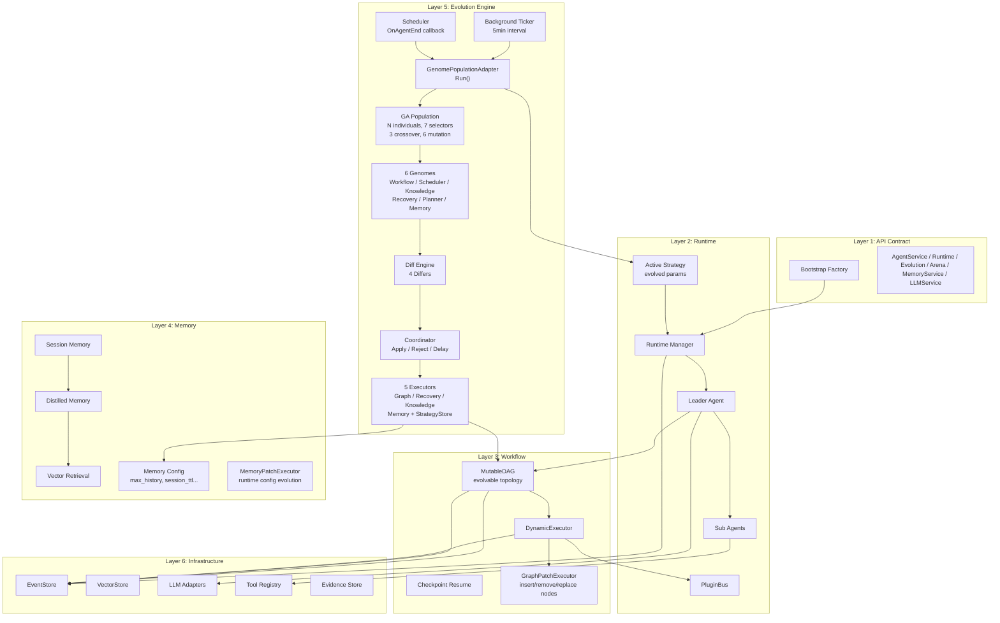

# ares Architecture Deep Dive (I): The Big Picture — Why Another Agent Framework?

I didn't set out to build a framework. I set out to solve a problem: **Agents kept dying, and I couldn't figure out why.**

It started with a simple chatbot. One Leader, two Subs, a handful of tools. Worked fine in dev. In production, the Leader would silently stop responding after 20 minutes. No error, no panic, no crash log. Just... silence.

After three days of debugging, I found it: a goroutine leak in the LLM client. One leaked goroutine per request, eventually hitting the OS thread limit. The fix was one line. But finding it took 72 hours because I had **zero visibility** into what the Agent was doing.

That's when I realized: the problem isn't "how to build an Agent." The problem is "how to keep an Agent alive in production."

---

## The Three Questions

Every Agent framework answers one question: "How do I make an Agent call an LLM?" That's the easy part. The hard questions are:

1. **What happens when the Agent dies?** (Resurrection)
2. **How does it remember what it was doing?** (State Recovery)
3. **How do I know what went wrong?** (Observability)

ares is built around these three questions. Everything else — the DAG engine, the memory system, the evolution engine — exists because answering these questions properly requires a lot of infrastructure.

---

## The Architecture: Five Layers

**Layer 1: API Contract** — What the outside world sees. Interfaces only, no implementations. The Bootstrap factory wires everything together. You call `bootstrap.New()` and get a fully connected system.

**Layer 2: Runtime** — Who does the work. The Runtime Manager owns agent lifecycles: birth, death, resurrection. The Leader plans and delegates. Sub Agents execute. The PluginBus connects everything. The **Active Strategy** carries evolved parameters (tool selection, search depth, scheduler strategy) that the GA engine produces.

**Layer 3: Workflow** — How work flows. The MutableDAG defines task dependencies. The DynamicExecutor runs them in topological order. The **GraphPatchExecutor** can insert, remove, or replace nodes at runtime — this is how DAG topology evolution works. Checkpoint Resume lets you pick up where you left off after a crash.

**Layer 4: Memory** — What agents remember. Session memory is short-term. Distilled memory is long-term compressed knowledge. Retrieval finds relevant memories via vector search. The **MemoryPatchExecutor** adjusts memory configuration (max_history, session_ttl, etc.) at runtime via coordinator patches.

**Layer 5: Evolution Engine** — How agents improve themselves. The GA Population holds N individuals with different strategy parameters. A background ticker (5-minute interval) and an agent-completion scheduler both trigger evolution cycles. The adapter runs selection → crossover → mutation → scoring, then submits the best strategies to **6 Genomes** (Workflow, Scheduler, Knowledge, Recovery, Planner, Memory). The Diff Engine compares old vs new snapshots, producing patches. The Coordinator decides Apply/Reject/Delay. **5 Executors** apply the approved patches to the live system, and the **Strategy Store** makes the evolved strategy available to running agents.

**Layer 6: Infrastructure** — What holds it all up. EventStore records everything. VectorStore indexes memories. LLM Adapters talk to providers. Tool Registry manages capabilities. Evidence Store feeds evolution decisions.

---

## The Design Principles

**1. Agents are disposable.**

This is the most important principle. An Agent is not a precious snowflake — it's a goroutine with a heartbeat. If it dies, the Runtime creates a new one and restores its state from the EventStore. This sounds wasteful until you realize it's the only way to guarantee recovery.

**Honest reflection**: We considered making Agents long-lived and resilient. Tried circuit breakers, retry loops, graceful degradation. It worked — until it didn't. The problem is that you can't predict every failure mode. A goroutine leak, a deadlock, an OOM kill — no amount of defensive coding covers all of them. Making Agents disposable means any failure is recoverable, because you always have a fresh start point.

**2. Record everything, replay anything.**

Every action — LLM call, tool invocation, task assignment, memory query — is an event in the EventStore. Want to know what happened? Replay the events. Want to restore state? Replay the events. Want to debug? Replay the events.

**3. Plugins, not hardcoding.**

The PluginBus lets you extend behavior without modifying core code. Checkpoint snapshots, route decisions, tool invocations — all handled by plugins. The Runtime doesn't know or care which plugins are active.

**4. The API layer is a contract, not an implementation.**

`api/core/` defines interfaces. `internal/` implements them. `api/bootstrap/` wires them together. You can swap implementations without changing the contract. This matters when you want to test with mocks, or switch from in-memory to PostgreSQL.

---

## What Makes This Different

Most Agent frameworks are "LLM orchestration engines" — they focus on prompt chains and tool calling. ares is an **Agent operating system** — it focuses on keeping Agents alive in production.

| Capability | Typical Framework | ares |
|-----------|------------------|------|
| Agent lifecycle | Start and hope | Birth → Death → Resurrection |
| State management | In-memory struct | Event Sourcing + Checkpoint |
| Failure handling | Try/catch | Automatic resurrection with state recovery |
| Observability | Logs | Logs + Events + Metrics + Traces |
| Extensibility | Subclass | Plugin system with capability discovery |
| Self-improvement | None | GA engine with 7 selectors, 3 crossover, 6 mutation operators, 6 evolvable genomes (Workflow/Scheduler/Knowledge/Recovery/Planner/Memory), multi-objective scoring, and background ticker-driven evolution cycles |

---

## The Honest Truth

This project started as a chatbot and grew into something I didn't plan. The evolution engine wasn't in any roadmap — it emerged from the question "what if Agents could optimize their own prompts?" The chaos engineering arena came from "what if I could kill an Agent and watch it recover?" The plugin system came from "what if I could add checkpoint support without touching the executor?"

Each feature was born from a real problem, not a feature checklist. That's why the architecture looks the way it does — it's not designed top-down, it's evolved bottom-up.

**Honest reflection**: The codebase is bigger than it needs to be. The quant trading module, the interview demo, the MCP dashboard — these are experiments that should probably live in separate repos. The core (Runtime + Workflow + Memory + Events) is solid. The periphery is still finding its shape.

But that's how real projects work. You don't design the perfect architecture on day one. You solve problems, accumulate code, and occasionally stop to refactor. The refactoring we did in v0.2.4 — unified naming, API layer thinning, module logging — was one of those "stop and clean up" moments.

---

## What's Next

This series walks through each layer in detail:

| # | Topic | What You'll Learn |
|---|-------|-------------------|
| I | **This article** | The big picture |
| II | Agent Harmony Protocol | How agents communicate |
| III | Memory Distillation | How agents remember and forget |
| IV | Workflow Engine | How tasks flow through a DAG |
| V | Tool Invocation Layer | How agents use tools |
| VI | Security & Observability | How to see what's happening |
| VII | Runtime & Lifecycle | How agents live and die |
| VIII | Event System | How state is recorded and recovered |
| IX | Arena / Fault Injection | How to break things deliberately |
| X | Retrieval System | How to find relevant memories |
| XI | Autonomous Evolution | How agents improve themselves |
| XII | Security Hardening | How to defend against threats |
| XIII | Bootstrap & API Layer | How to wire without pain |
| XIV | Plugin System | How to extend without touching |
| XV | MCP Integration | How to teach agents to use tools |
| XVI | Flight Recorder | How to record and replay execution |
| 00 | SDK Layer | One line of code to start an agent |
| 00 | Knowledge Graph Build | From markdown to 27K edges (AKG) |
| 00 | Storage Layer | postgres/embedding/models/query/repositories/services |
| 00 | LLM Client Layer | Failover, DeepSeek Reasoning, multi-provider abstraction |
| 00 | Evaluation Framework | EvaluatorRegistry, LLMJudge, Bench |
| 00 | Config System | ares.yaml schema, YAML-driven flags |
| 00 | Quant Trading Module | The experiment we keep honest about |

Each article follows the same pattern: **the problem → the design journey → the trade-offs → the honest reflection.**

No marketing. No "10x faster than X." Just engineers talking about engineering.
