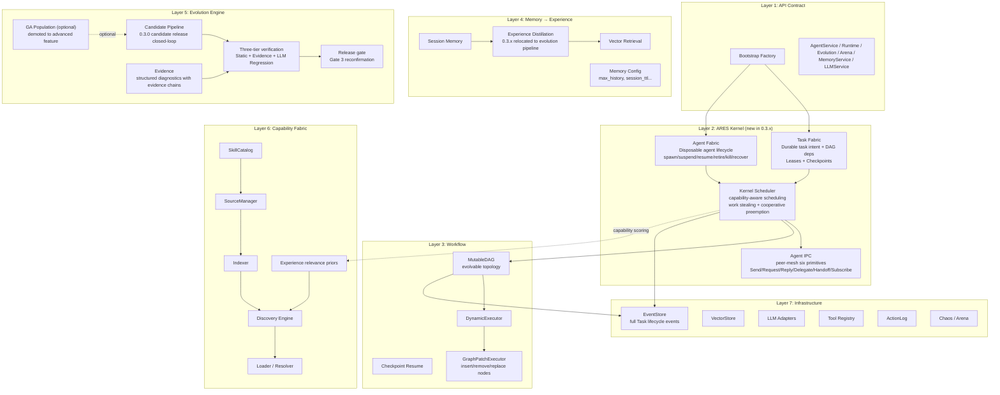

# ares Architecture Deep Dive (I): The Big Picture — Why Another Agent Framework? (0.3.x)

I didn't set out to build a framework. I set out to solve a problem: **Agents kept dying, and I couldn't figure out why.**

It started with a simple chatbot. One Leader, two Subs, a handful of tools. Worked fine in dev. In production, the Leader would silently stop responding after 20 minutes. No error, no panic, no crash log. Just... silence.

After three days of debugging, I found it: a goroutine leak in the LLM client. One leaked goroutine per request, eventually hitting the OS thread limit. The fix was one line. But finding it took 72 hours because I had **zero visibility** into what the Agent was doing.

That's when I realized: the problem isn't "how to make an Agent call an LLM." The problem is "how to keep an Agent alive in production."

---

## The Three Questions

Every Agent framework answers one question: "How do I make an Agent call an LLM?" That's the easy part. The hard questions are:

1. **What happens when the Agent dies?** (Resurrection)
2. **How does it remember what it was doing?** (State Recovery)
3. **How do I know what went wrong?** (Observability)

ares is built around these three questions. The core shift in 0.3.x: **no longer asking "how to make an Agent call an LLM," but asking "how to keep an Agent alive at runtime."** ARES evolved from an "Agent orchestration framework" (Leader + Sub) into a **"dynamic compute runtime for Agents"** — Agents are not orchestrated. They are scheduled.

---

## The Architecture: Seven Layers (0.3.x)

```mermaid
graph TB
    subgraph API ["Layer 1: API Contract"]
        Bootstrap["Bootstrap Factory"]
        Interfaces["AgentService / Runtime / Evolution / Arena / MemoryService / LLMService"]
    end

    subgraph Kernel ["Layer 2: ARES Kernel (new in 0.3.x)"]
        TaskFabric["Task Fabric<br/>Durable task intent + DAG deps<br/>Leases + Checkpoints"]
        AgentFabric["Agent Fabric<br/>Disposable agent lifecycle<br/>spawn/suspend/resume/retire/kill/recover"]
        Scheduler["Kernel Scheduler<br/>capability-aware scheduling<br/>work stealing + cooperative preemption"]
        IPC["Agent IPC<br/>peer-mesh six primitives<br/>Send/Request/Reply/Delegate/Handoff/Subscribe"]
    end

    subgraph Workflow ["Layer 3: Workflow"]
        DAG["MutableDAG<br/>evolvable topology"]
        Exec["DynamicExecutor"]
        Checkpoint["Checkpoint Resume"]
        GraphPatch["GraphPatchExecutor<br/>insert/remove/replace nodes"]
    end

    subgraph Memory ["Layer 4: Memory → Experience"]
        Session["Session Memory"]
        Distilled["Experience Distillation<br/>0.3.x relocated to evolution pipeline"]
        Retrieval["Vector Retrieval"]
        MemConfig["Memory Config<br/>max_history, session_ttl..."]
    end

    subgraph Evolution ["Layer 5: Evolution Engine"]
        Candidate["Candidate Pipeline<br/>0.3.0 candidate release closed-loop"]
        Verifier["Three-tier verification<br/>Static + Evidence + LLM Regression"]
        Release["Release gate<br/>Gate 3 reconfirmation"]
        GA["GA Population (optional)<br/>demoted to advanced feature"]
        Evidence["Evidence<br/>structured diagnostics with evidence chains"]
    end

    subgraph Skills ["Layer 6: Capability Fabric"]
        Catalog["SkillCatalog"]
        SourceMgr["SourceManager"]
        Indexer["Indexer"]
        Discovery["Discovery Engine"]
        Loader["Loader / Resolver"]
        ExpPrior["Experience relevance priors"]
    end

    subgraph Infra ["Layer 7: Infrastructure"]
        Events["EventStore<br/>full Task lifecycle events"]
        Storage["VectorStore"]
        LLM["LLM Adapters"]
        Tools["Tool Registry"]
        ActionLog["ActionLog"]
        Chaos["Chaos / Arena"]
    end

    Bootstrap --> TaskFabric
    Bootstrap --> AgentFabric
    TaskFabric --> Scheduler
    AgentFabric --> Scheduler
    Scheduler --> IPC
    Scheduler --> DAG
    DAG --> Exec
    Exec --> GraphPatch
    Session --> Distilled
    Distilled --> Retrieval
    Scheduler --> Events
    DAG --> Events

    Candidate --> Verifier
    Verifier --> Release
    Evidence --> Verifier
    GA -.->|optional| Candidate

    Catalog --> SourceMgr
    SourceMgr --> Indexer
    Indexer --> Discovery
    Discovery --> Loader
    ExpPrior --> Discovery
    Scheduler -.->|capability scoring| ExpPrior
```

**Layer 1: API Contract** — What the outside world sees. Interfaces only, no implementations. The Bootstrap factory wires everything together. You call `ares_bootstrap.Bootstrap()` and get a fully connected system — Kernel, Memory, Knowledge/AKG, Evolution, Storage, Embedding, MCP, Flight Recorder, EventStore — all assembled from a single config struct. 0.3.x adds `system_runtime.Orchestrator` to manage component lifecycle (Construct → Bind → Start → Ready, reverse-order Stop → Wait → Close).

**Layer 2: ARES Kernel (new in 0.3.x)** — The heart of the system. Replaces the 0.2.x Leader/Sub runtime. Three pillars + IPC:
- **Task Fabric** (`internal/taskfabric`): Durable task intent, holding capability/state/lease/checkpoint. Six core primitives: Acquire / Release / Yield / Checkpoint / Steal / Preempt. All ownership operations carry a fencing token (epoch), preventing stale-holder late writes.
- **Agent Fabric** (`internal/agentfabric`): Disposable agent lifecycle management. Agents are peer cognitive processes (A ≡ B ≡ C); parent-child has only spawn provenance, no authority hierarchy. Process Tree ≠ Scheduling Graph.
- **Kernel Scheduler** (`internal/kernelscheduler`): Capability-aware scheduling. `score = capability_overlap × (1 - load) × confidence`. Execution Quantum boundary yield; cooperative preemption, not OS hard preemption. Supports event-driven drain (GAP 6).
- **Agent IPC** (`internal/agentipc`): Peer-mesh message bus, six primitives: Send / Request / Reply / Delegate / Handoff / Subscribe. Three-layer context separation: Task Shared / Agent Private / IPC Messages.

**Layer 3: Workflow** — How work flows. The MutableDAG defines task dependencies, and the topology itself is evolvable. The DynamicExecutor runs them in topological order. The **GraphPatchExecutor** can insert, remove, or replace nodes at runtime — this is how DAG topology evolution works. Checkpoint Resume lets you pick up where you left off after a crash. In 0.3.x, the DAG directly serves as the scheduling source — Task A completed → B ready / C ready → Scheduler — no leader dispatch needed.

**Layer 4: Memory → Experience** — What agents remember. 0.3.x relocates memory distillation to the evolution pipeline: Trace (what happened) → Experience (what it means) → Memory (formal knowledge). Candidate knowledge and formal knowledge are stored separately. An experience requires ≥2 non-failure trajectory supports to graduate. Conversations are not vector-embedded — conversation history is linear narrative, experience is networked knowledge.

**Layer 5: Evolution Engine** — How agents improve themselves. The 0.3.x primary mode: **Failure → Diagnosis → Patch → Verify**. 0.3.0 candidate release closed-loop: Candidate → three-tier verification (Gate 1 Static + Gate 2 Evidence + Gate 3 LLM Regression) → Release gate (Gate 3 reconfirmation) → SetStable → Promoted. **Candidate generation is easy; shipping is hard — the release gate is what makes evolution safe.** GA is demoted to an optional advanced feature. Evidence no longer returns scalar scores but structured diagnostics with evidence chains.

**Layer 6: Capability Fabric** — The framework-native skill discovery, indexing, and loading system. It's cross-cutting — the runtime (agents need skills), the workflow layer (tasks invoke skills), and the evolution engine (strategies can optimize skill selection) all use it. SkillCatalog with SourceManager aggregates multiple skill sources; the five-piece catalog toolset (skill_search/load/activate/list/experience) implements Level-0/1/2 progressive disclosure. The Experience module learns relevance priors from historical usage, so frequently used skills rank higher in discovery results.

**Layer 7: Infrastructure** — What holds it all up. EventStore records everything — 0.3.x event types upgraded to full Task lifecycle (Created/Ready/Acquired/Started/Yielded/Checkpointed/Preempted/Released/Completed/Failed/Expired/Stolen). VectorStore indexes memories. LLM Adapters talk to providers. Tool Registry manages capabilities. ActionLog records execution-fact audit. Chaos/Arena does Failure Injection + Recovery Verification.

### Cross-Cutting Layer: SkillCatalog / Capability Fabric

In 0.3.x, the Capability Fabric's importance rose — it directly became the capability-aware scoring source for the Kernel Scheduler (`score = capability_overlap × (1 - load) × confidence`). This makes skill-first design actually work.

The core is the **SkillCatalog**, which aggregates skill sources through a **SourceManager** — MCP servers, git repos, local executables, and HTTP manifests are all first-class citizens. An **Indexer** builds searchable skill indexes, a **Discovery** engine finds relevant skills at runtime, a **Loader** resolves and instantiates them, and a **Resolver** handles dependency resolution. The **Experience** module learns relevance priors from past usage, so frequently invoked skills rank higher in discovery results.

The five-piece catalog toolset (`skill_search`/`skill_load`/`skill_activate`/`skill_list`/`skill_experience`) implements Level-0/1/2 progressive disclosure: even with 1000 tools, none enter context; `skill_activate` is the only moment an MCP server connection is established. The **ToolExpander** interface in the AgentLoop engine lets runtime-discovered skill names be resolved into LLM tool definitions on the fly, so agents can pick up new skills without a restart.

---

## The Design Principles

**1. Agents are disposable. Tasks are durable.**

This is the most important principle. 0.3.x upgrades it to: **Agent death ≠ Task death.** An Agent is not a precious snowflake — it's a goroutine with a heartbeat. If it dies, the Agent Fabric creates a new one, and the Task Fabric restores progress from the checkpoint. This sounds wasteful until you realize it's the only way to guarantee recovery.

**Honest reflection**: We considered making Agents long-lived and resilient. Tried circuit breakers, retry loops, graceful degradation. It worked — until it didn't. The problem is that you can't predict every failure mode. A goroutine leak, a deadlock, an OOM kill — no amount of defensive coding covers all of them. Making Agents disposable means any failure is recoverable, because you always have a fresh start point. The 0.3.x Execution Quantum further reinforces this: at the end of each quantum, the agent yields, the checkpoint is persisted, and even if the agent dies, the next quantum resumes from the checkpoint.

**2. Record everything, replay anything.**

Every action — LLM call, tool invocation, task assignment, memory query — is an event in the EventStore. Want to know what happened? Replay the events. Want to restore state? Replay the events. Want to debug? Replay the events.

**3. Plugins, not hardcoding.**

The PluginBus lets you extend behavior without modifying core code. Checkpoint snapshots, route decisions, tool invocations — all handled by plugins. The Runtime doesn't know or care which plugins are active.

**4. The API layer is a contract, not an implementation.**

`api/core/` defines interfaces. `internal/` implements them. `api/bootstrap/` wires them together. You can swap implementations without changing the contract. This matters when you want to test with mocks, or switch from in-memory to PostgreSQL.

---

## What Makes This Different

Most Agent frameworks are "LLM orchestration engines" — they focus on prompt chains and tool calling. ares 0.3.x is an **Agent runtime** — it focuses on keeping Agents alive in production. The core proposition shifted from "how to orchestrate Agents" to "how to schedule Agents": **Agents are not orchestrated. They are scheduled.**

| Capability | Typical Framework | ares 0.3.x |
|-----------|------------------|------|
| Agent lifecycle | Start and hope | Agent Fabric: spawn → suspend → resume → retire → kill → recover; **Agent death ≠ Task death** |
| Scheduling model | Leader dispatch / central orchestration | **Agents are not orchestrated. They are scheduled.** Kernel Scheduler + capability-aware work stealing + cooperative preemption |
| State management | In-memory struct | Event sourcing + checkpoints + fencing token (epoch) |
| Failure handling | Try/catch | Execution Quantum + checkpoint recovery + lease expiry auto-requeue |
| Observability | Logs | Logs + Events + Metrics + Traces + Scheduling Observatory (decision records) |
| Extensibility | Subclass | Plugin system + Capability Fabric with dynamic skill discovery |
| Self-improvement | None | Candidate release closed-loop: Candidate → three-tier verification → Release gate → SetStable. GA demoted to optional. Evidence carries evidence chains, not scalar scores |
| Agent communication | HTTP/gRPC/Message Queue | Agent IPC peer-mesh six primitives (Send/Request/Reply/Delegate/Handoff/Subscribe) + legacy AHP compat |
| Skill discovery | Hardcoded tool registrations | SkillCatalog with SourceManager, Indexer, Discovery, Loader, and learned relevance priors; five-piece catalog toolset progressive disclosure |
| Concurrency control | None or external locks | General Lease (TaskLease/ResourceLease/CapabilityLease) + fencing token |
| Agent architecture | Hierarchical (Leader/Sub) | Peer cognitive processes (A ≡ B ≡ C), spawn is a syscall not an orchestration API |
| Lifecycle management | Manual | system_runtime.Orchestrator: Construct → Bind → Start → Ready, reverse-order Shutdown |

---

## The Honest Truth

This project started as a chatbot and grew into something I didn't plan. The evolution engine wasn't in any roadmap — it emerged from the question "what if Agents could optimize their own prompts?" The chaos engineering arena came from "what if I could kill an Agent and watch it recover?" The plugin system came from "what if I could add checkpoint support without touching the executor?"

Each feature was born from a real problem, not a feature checklist. That's why the architecture looks the way it does — it's not designed top-down, it's evolved bottom-up.

**Honest reflection**: The codebase is bigger than it needs to be. The quant trading module, the interview demo, the MCP dashboard — these are experiments that should probably live in separate repos. The core (Kernel + Workflow + Memory + Events) is solid. The periphery is still finding its shape.

But that's how real projects work. You don't design the perfect architecture on day one. You solve problems, accumulate code, and occasionally stop to refactor. The refactoring we did in v0.3.x — Leader/Sub → Kernel, AHP → Agent IPC, memory distillation relocation, candidate release closed-loop — was one of those "stop and clean up" moments. The core philosophy of 0.3.x shifted from "Agent orchestration" to "Agent runtime" — this wasn't planned, it was forced by real problems.

---

## What's Next

This series walks through each layer in detail:

| # | Topic | What You'll Learn |
|---|-------|-------------------|
| I | **This article** | The big picture |
| II | Agent Harmony Protocol | How agents communicate |
| III | Memory Distillation | How agents remember and forget |
| IV | Workflow Engine | How tasks flow through a DAG |
| V | Tool Invocation Layer | How agents use tools |
| VI | Security & Observability | How to see what's happening |
| VII | Runtime & Lifecycle | How agents live and die |
| VIII | Event System | How state is recorded and recovered |
| IX | Arena / Fault Injection | How to break things deliberately |
| X | Retrieval System | How to find relevant memories |
| XI | Autonomous Evolution | How agents improve themselves |
| XII | Security Hardening | How to defend against threats |
| XIII | Bootstrap & API Layer | How to wire without pain |
| XIV | Plugin System | How to extend without touching |
| XV | MCP Integration | How to teach agents to use tools |
| XVI | Flight Recorder | How to record and replay execution |
| 00 | **SkillCatalog & Capability Fabric** | Framework-native skill discovery, indexing, and loading — MCP servers, git repos, local executables, HTTP manifests |
| 00 | **SDK Layer** | One line of code to start an agent; bootstrap_runtime, team orchestration, event-driven distillation |
| 00 | **Knowledge Graph Build** | From markdown to 27K edges (AKG) |
| 00 | **Storage Layer** | postgres/embedding/models/query/repositories/services |
| 00 | **LLM Client Layer** | Failover, DeepSeek Reasoning, multi-provider abstraction |
| 00 | **Evaluation Framework** | EvaluatorRegistry, LLMJudge, Bench |
| 00 | **Config System** | ares.yaml schema, YAML-driven flags |
| 00 | **Quant Trading Module** | The experiment we keep honest about |

Each article follows the same pattern: **the problem → the design journey → the trade-offs → the honest reflection.**

No marketing. No "10x faster than X." Just engineers talking about engineering.
