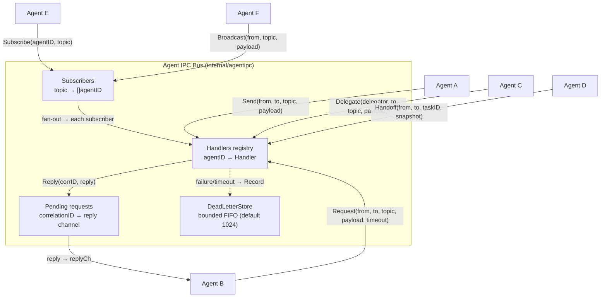

# ares Architecture Deep Dive (II): Agent IPC — Peer-Mesh Communication Primitives (0.3.x)

> When it comes to multi-Agent systems, most people's first reaction is: "How do Agents talk to each other? Via HTTP or WebSocket? Through a message queue?"
> The 0.2.x answer was AHP — a purely in-process channel-based protocol. The 0.3.x answer changed: **Agents are peer cognitive processes; communication doesn't need a Leader relay.**
> And that's how Agent IPC was born — a peer-mesh message bus with six primitives, no Leader required.

## Foreword

What's the most annoying thing about building a multi-Agent system? It's not that the Agents aren't smart enough — it's that the Agents don't talk to each other.

In 0.2.x, the Leader assigned a task to a Sub. The Sub finished and wanted to report back, only to find that the Leader had already timed out. The Sub wanted to report its progress, but there was nowhere to do so. The Leader wanted to know if the Sub was still alive, but there was no heartbeat mechanism. All communication went through the Leader — if the Leader died, the entire communication network went down.

0.3.x changed this. **Agents are peer cognitive processes (A ≡ B ≡ C)** — parent-child has only spawn provenance, no authority hierarchy. Process Tree ≠ Scheduling Graph. This means any Agent can communicate directly with any other Agent, without a Leader relay.

When I first built this in Python, I used Redis queues. Later I switched to Go and wanted a more formal solution, so I spent two full days wrestling with RabbitMQ — the first day installing Erlang, configuring vhosts, setting up exchanges, mapping out binding keys; the second day writing 200+ lines of glue code just to deliver a single message from Agent A to Agent B.

When I finally ran the benchmark, the end-to-end latency had gone from <1μs (Go channel) to 2ms+ — that's a 2000x slowdown, and it wasn't even caused by network latency since both Agents were in the same process. Pure serialization and routing overhead. I thought: **Same process, two goroutines, sending a message still has to go through the network? That's just insane.**

So I wrote a purely in-process communication protocol: no network, no serialization, no middleware dependency. Just channels + shared memory. In 0.2.x it was called AHP. In 0.3.x it was upgraded to **Agent IPC** — a peer-mesh message bus with six primitives.

## I. From AHP to Agent IPC: What Changed?

| Dimension | AHP (0.2.x) | Agent IPC (0.3.x) |
|-----------|-------------|-------------------|
| Topology | Leader → Sub (star) | peer-mesh (any Agent → any Agent) |
| Primitives | 5 (Task/Result/Progress/ACK/Heartbeat) | 6 (Send/Request/Reply/Delegate/Handoff/Subscribe) |
| Semantics | Message-type-driven (method field) | Communication-intent-driven (primitive IS the API) |
| Broadcast | None (Leader for loop) | Subscribe + Broadcast (native fan-out) |
| Task transfer | None | Handoff (peer-to-peer task ownership transfer) |
| Request forwarding | None | Delegate ("I can't handle this — let me ask someone who can") |
| Dead letters | DLQ (fixed-interval retry) | DeadLetterStore (bounded FIFO, observable + redeliverable) |
| Compatibility | — | Legacy AHP path retained (peer.Registry runs in parallel) |

The core difference: AHP's five message types are "what message to send," Agent IPC's six primitives are "what communication action to perform." **You don't need to stuff a method field in the payload to express intent — the primitive you call IS the intent.**

## II. Overall Architecture



Core components:

| Component | Responsibility | Implementation Highlight |
|-----------|---------------|--------------------------|
| `Bus` | peer-mesh message bus, holds all state | `sync.RWMutex` guards handlers/subscribers/pending |
| `Handler` | Message handler function, `func(ctx, *Message) (*Message, error)` | Returns reply or error |
| `Message` | Communication unit, carries topic/payload/correlationID | Lightweight struct, no JSON serialization |
| `DeadLetterStore` | Bounded storage for failed requests | Ring FIFO, default 1024 entries, observable + redeliverable |
| `PolicyFlag` | Dual-track dispatch flag (legacy vs task fabric) | `atomic.Int64`, runtime flip without restart |

## III. The Six Primitives

### 3.1 Send — Fire and Forget

```go
func (b *Bus) Send(ctx context.Context, from, to, topic string, payload any) error
```

The simplest primitive: deliver a message to the target Agent without waiting for a reply. If the target doesn't exist or the handler fails, the message is recorded to the DeadLetterStore. **Send does NOT pair with Reply** — if you need request/reply semantics, use Request.

### 3.2 Request — Request/Reply

```go
func (b *Bus) Request(ctx context.Context, from, to, topic string, payload any, timeout time.Duration) (*Message, error)
```

Synchronous request/reply primitive: send a message and wait for a reply. The Bus allocates a correlation ID and registers a pending reply channel. The target handler can:
- **Reply synchronously**: handler returns `(*Message, error)` directly; the Bus stamps and delivers it in a managed goroutine
- **Reply asynchronously**: handler returns `(nil, nil)`, later calls `Reply(corrID, reply)` to complete

On timeout or context cancellation, the pending entry is cleaned up and `ErrTimeout` is returned. B16 fix: timeout ≤ 0 uses a 30s default instead of blocking indefinitely.

### 3.3 Reply — Asynchronous Reply

```go
func (b *Bus) Reply(corrID string, reply *Message) error
```

When the handler cannot return a reply immediately, it can call Reply later. The correlation ID pairs the reply with the original request. For an already-timed-out/cancelled request, Reply is a best-effort drop — it does not block or panic.

### 3.4 Delegate — Request Forwarding

```go
func (b *Bus) Delegate(ctx context.Context, delegator, to, topic string, payload any, timeout time.Duration) (*Message, error)
```

"I can't handle this — let me ask someone who can." The delegating agent uses its own ID as From to initiate a Request. The original requester's correlation ID is preserved end-to-end so the reply can chain back. **This is the primitive for collaborative forwarding between Agents — no Leader relay needed.**

### 3.5 Handoff — Task Transfer

```go
func (b *Bus) Handoff(ctx context.Context, from, to, taskID string, contextSnapshot map[string]any, timeout time.Duration) (*Message, error)
```

Peer-to-peer task ownership transfer. Unlike Send, Handoff carries a structured transfer payload (task id + context snapshot + artifacts), and the receiver acknowledges acceptance. **The sender yields the task; the receiver takes it. This is the primitive for direct task transfer between Agents — it does NOT go through the Scheduler.**

### 3.6 Subscribe / Broadcast — Subscribe/Broadcast

```go
func (b *Bus) Subscribe(agentID, topic string) error
func (b *Bus) Broadcast(ctx context.Context, from, topic string, payload any) int
```

"I found X — anyone interested in X should know." An Agent subscribes to topics of interest; any Agent can broadcast to a topic. Broadcast is a fire-and-forget fan-out: each subscriber's handler is invoked; a single handler failure does not halt the fan-out; the count of successful deliveries is returned. B16 fix: Subscribe deduplicates — the same agent is not added to the same topic twice.

## IV. Message Model

```go
type Message struct {
    ID            string    // Bus-generated unique ID
    From          string    // sender agent id
    To            string    // target agent id ("" = broadcast to subscribers)
    Topic         string    // message subject (e.g. "verify-conclusion", "handoff-task")
    CorrelationID string    // request/reply pairing ID (empty for fire-and-forget)
    Payload       any       // message body
    At            time.Time  // send timestamp
}
```

Compared to AHP's `AHPMessage`: no `Method` field — **the primitive IS the method.** Calling `Send` is fire-and-forget; calling `Request` is request/reply; you don't need to stuff a `"method": "TASK"` in the payload to express intent.

## V. DeadLetterStore: Bounded and Observable

0.3.x upgrades AHP's DLQ to `DeadLetterStore`:

```go
type DeadLetterStore struct {
    mu       sync.Mutex
    next     uint64
    capacity int       // default 1024
    entries  []DeadLetter
}
```

Key changes:
- **Bounded FIFO**: evicts oldest when full (ring policy, consistent with flight aggregates)
- **Natively observable**: the introspect panel and ops tooling can directly `Snapshot()` read it
- **Redeliverable**: failed requests retain From/To/Topic/Payload/Reason for manual redelivery
- **Does not record context cancellations**: `ctx.Done()` is not a delivery failure — the request may well have been delivered and handled; the caller just cancelled the wait. Recording cancellations in the DLQ would evict genuine delivery failures

Compared to AHP's DLQ: no automatic retry. The 0.2.x DLQ had fixed-interval retry that made things worse. 0.3.x switches to record + observe + manual redeliver — let humans decide, don't auto-hammer.

## VI. Dual-Track Dispatch: PolicyFlag

The 0.3.x `agentipc` package contains a `PolicyFlag` — the dual-track dispatch flag:

```go
const (
    PolicyLegacy     ExecutionPolicy = iota  // old leader+sub path
    PolicyTaskFabric                          // Kernel path: Task Fabric → Scheduler → Agent
)
```

The `DualTrackDispatcher` holds both path dispatchers; the flag selects which is active. When shadow mode is on, the inactive path also runs, and outcomes are compared — **this is "dual-track equivalence" verification: the same task runs both paths, results must match.**

Production only has `PolicyTaskFabric` — the Leader runtime is removed. The legacy constant is retained for shadow-mode dual-track verification.

## VII. Legacy AHP Compatibility

Agent IPC does not replace the old AHP — both run in parallel:

- **`internal/ares_protocol/ahp`**: the old AHP protocol — channel + MessageQueue + HeartbeatMonitor + DLQ
- **`internal/agents/peer/Registry`**: peer-to-peer direct-delivery Send (based on AHP messages)
- **`internal/agentipc/Bus`**: the new peer-mesh six-primitive bus

The `peer.Registry` Send path still uses `ahp.AHPMessage`, directly calling the target Agent's `SendFunc`. This complements `agentipc.Bus`'s Send: the legacy path handles Leader-dispatched legacy scenarios; the new path handles peer-mesh collaboration.

**Honest reflection**: Running two communication systems in parallel is a necessary cost of the migration period. The long-term goal is for AHP to degrade into a compatibility layer only, with all new communication going through Agent IPC. But in the short term, running the leader-dispatched path and peer IPC in parallel with a feature flag for gradual cutover is the safest approach.

## VIII. Three-Layer Context Separation

Agent IPC is the third layer of the 0.3.x Context separation:

| Layer | Content | Lifecycle |
|-------|---------|-----------|
| Task Shared | Task context (DAG, checkpoints, lease) | Task-level — Agent dies, Task survives |
| Agent Private | Agent private state (LLM conversation, intermediate results) | Agent-level — Agent dies, it's gone |
| IPC Messages | Inter-agent messages (Send/Request/Handoff...) | Message-level — delivered, done |

This separation means: when an Agent dies, its Agent Private context is lost, but the Task Shared context is still in the Task Fabric's checkpoints, and IPC Messages are still in the Bus's pending/dead letters. A new Agent is spawned, restores Task context from the checkpoint, and continues working.

## IX. Key Design Decisions

### 9.1 Why Does Request Use a Managed Goroutine?

Request's handler executes in a separate goroutine:

```go
go func() {
    reply, err := h(reqCtx, req)
    // ...
}()
```

Reason: the handler may be slow (LLM calls, database queries). If it executed synchronously in the caller's goroutine, the caller couldn't be timed out or context-cancelled. The managed goroutine + child context means when the timeout fires, the handler is cancelled — **the handler no longer leaks** (B16 fix).

### 9.2 Why Is Reply a Best-Effort Drop?

If the correlation ID is no longer in the pending table (the request has timed out/cancelled), Reply simply returns nil — no error, no panic. Reason: in distributed systems, "the reply arrives after the request timed out" is normal, not exceptional. If Reply returned an error, the caller would need to handle it — but the caller likely doesn't care anymore.

### 9.3 Why Doesn't Handoff Go Through the Scheduler?

Handoff is peer-to-peer task transfer — Agents directly hand off to each other. Reason: in some scenarios, the Agent knows who is best suited to take over (e.g., "I can't do verification, but Agent C specializes in verification"), so there's no need for the Scheduler to re-dispatch. The Scheduler is the path for "I don't know who should do this"; Handoff is the path for "I know who should do this."

## X. What's Missing? (Honest Section)

To be honest, Agent IPC isn't perfect either:

1. **Purely in-process**: Like AHP, it can't span processes. If you need distributed deployment, the Bus's `map[string]Handler` needs to be replaced with some distributed service discovery + network transport. The difficulty of "swapping one layer of implementation" is greater than it looks — the synchronous semantics of pending reply channels need to be redesigned for a network environment
2. **No backpressure**: Broadcast is a fire-and-forget fan-out; if a subscriber is slow, the handler call blocks on that subscriber. There's currently no per-subscriber queue for buffering — Broadcast's handler invocation is synchronous
3. **DeadLetterStore has no auto-redelivery**: The 0.2.x DLQ at least had automatic retry (even though it made things worse). 0.3.x switched to pure recording — but if you don't actively check the DeadLetterStore, failed messages are permanently lost. An alerting mechanism is needed: notify when the dead letter count exceeds a threshold
4. **Subscribe has no pattern matching**: Only supports exact topic match. No wildcard or pattern subscriptions (e.g., `task.*` to match all task-related topics). Sufficient for now, but may be needed long-term

There's also a less obvious design cost: **six primitives look simple, but the edge cases when composing them are numerous.** For instance, the Delegate + Handoff combination — Agent A delegates to Agent B, B gets halfway and realizes C should take over. Can B Handoff A's delegated task to C? How does the correlation ID chain? The semantics are currently clear, but test coverage for these scenarios is insufficient.

All that said, compared to 0.2.x's AHP, Agent IPC solves two core problems: **no more dependency on a Leader relay, and native support for task transfer and broadcast.** These two capabilities are the foundation of peer-mesh collaboration — without them, "peer cognitive processes" is just empty words.

## Summary

Agent IPC is the new communication wheel built for ares in 0.3.x. Six primitives cover all peer-mesh collaboration scenarios: Send for fire-and-forget, Request/Reply for request/reply, Delegate for request forwarding, Handoff for task transfer, Subscribe/Broadcast for pub/sub. DeadLetterStore is bounded and observable. Dual-track dispatch runs in parallel with feature flag for gradual cutover.

The legacy AHP is retained as a compatibility layer — the leader-dispatched path and peer IPC run in parallel, slowly switching over. This "dual-track equivalence" approach is especially important in large refactors — you can't switch all at once; you run both in parallel, compare results, and gradually cut over.

Next up, let's talk about **Memory Distillation** — how Agents distill useful experience from hundreds of conversation histories and reuse them directly when encountering similar problems.
