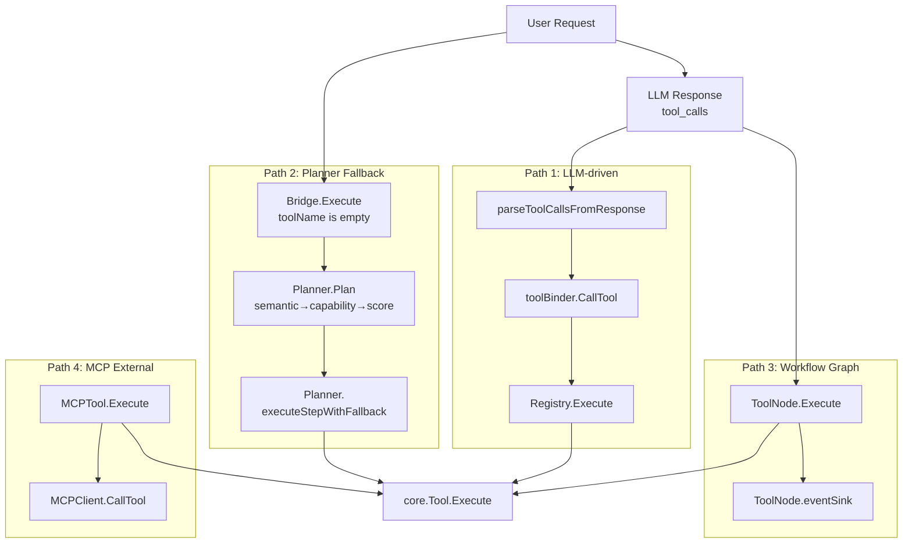

# ares Architecture Deep Dive (V): Tool Invocation Layer -- Four Paths and One Safety Net

> After registering all 22 tools, I thought I was done. Then the first integration test brought me back to reality — the parameters generated by the LLM caused a panic because a type assertion failed.
> I realized something: defining tools is just the first step. What's really complex is the **invocation chain** — how tools actually get called.
> Later I realized something else: the LLM isn't always reliable. It might choose the wrong tool, pass the wrong parameters, or not know which tool to use at all.
> So I added a fourth path — a deterministic fallback engine for when the LLM gets it wrong.

## 1. Four Invocation Paths

A lot of people see the tool registration system and think tool invocation is just `registry.Execute(name, params)` — one call to rule them all. But in practice, there are four completely different invocation paths, each with its own tradeoffs:



When the LLM decides to call a tool, the data flows like this:

```
LLM returns tool_calls (OpenAI JSON)
    ↓
parseToolCallsFromResponse()     [internal/llm/output/openai.go]
    ↓ ToolCallResponse { ToolCalls: [{ID, Name, Arguments}] }
sub-agent executor               [internal/agents/sub/executor.go]
    ↓ iterate ToolCalls
toolBinder.CallTool(name, args)  [internal/agents/sub/tools.go]
    ↓ lookup closure mapping
Registry.Execute(ctx, params)    [internal/tools/resources/core/registry.go]
    ↓ lookup by name
Tool.Execute(ctx, params)        [core/tool.go]
    ↓
core.Result { Success, Data, Error }
```

But there's a hidden branch: if the LLM's `tool_name` doesn't exist in the Registry, or the LLM didn't return any `tool_calls` at all, the system falls through to **Path 2** — the Planner safety net.

---

## 2. Path 1: LLM-Driven Tool Invocation

### 2.1 toolBinder: The Bridge from Registry to Agent

Sub-agents can't use `GlobalRegistry` directly. There's an intermediate layer called `toolBinder`:

```go
// internal/agents/sub/tools.go
type toolBinder struct {
    mu       sync.RWMutex
    tools    map[string]func(ctx context.Context, args map[string]any) (any, error)
    registry *core.Registry
}

func (b *toolBinder) BridgeFromRegistry(registry *core.Registry) {
    // Iterate the registry, create a closure for each tool
    // Effect: b.tools[name] = func(ctx, args) { return t.Execute(ctx, args) }
}
```

Why this extra layer? Three reasons:

1. **Interface isolation**: Sub-agents don't need to know about `Registry` — they just need "call by name"
2. **Local first**: `toolBinder.GetTool` has a local→Registry fallback chain, supporting private tool injection
3. **Testability**: Tests can mock toolBinder directly without bootstrapping the entire Registry

### 2.2 LLM Tool Call Protocol Adaptation

The path from LLM JSON to Go's `map[string]interface{}` looks simple but hides several gotchas:

```go
// internal/llm/output/openai.go
func parseToolCallsFromResponse(choice *Choice) (*ToolCallResponse, error) {
    // OpenAI returns tool_calls in this structure:
    // {
    //   "tool_calls": [{
    //     "id": "call_xxx",
    //     "function": {
    //       "name": "calculator",
    //       "arguments": "{\"expression\": \"1+1\"}"
    //     }
    //   }]
    // }
    // arguments is a JSON **string**, not an object
    // Requires a second deserialization
}
```

One easily overlooked detail: `arguments` is a JSON `string`, not a JSON `object`. If the LLM returns invalid JSON, it panics here. OpenAI and Anthropic have different tool call formats — Anthropic's content block carries the JSON object directly.

To unify, the framework defines its own abstraction:

```go
// internal/llm/output/toolcall.go
type ToolCapable interface {
    GenerateWithTools(ctx context.Context, prompt string, 
        tools []ToolDefinition, choice ToolChoice) (*ToolCallResponse, error)
    SendToolResult(ctx context.Context, messages []map[string]interface{},
        toolResults []ToolResult) (*ToolCallResponse, error)
}

type ToolCall struct {
    ID        string `json:"id"`
    Name      string `json:"name"`
    Arguments string `json:"arguments"`  // JSON string
}
```

Each LLM provider's adapter converts its vendor format to `ToolCallResponse`. Tool registration, dispatch, and execution become completely transparent to the LLM provider.

### 2.3 The Parameter Validation Gap

This is the issue that keeps me up at night. Look at this code:

```go
// internal/tools/resources/builtin/math/calculator.go
func (t *Calculator) Execute(ctx context.Context, params map[string]interface{}) (core.Result, error) {
    expression, ok := params["expression"].(string)  // Manual type assertion
    if !ok || expression == "" {
        return core.NewErrorResult("invalid_expression"), nil
    }
    // ...
}
```

Every tool asserts its own parameter types with `params["key"].(string)`. There's no unified validation layer. This means:

- LLM sends `"expression": 123` (number instead of string) → panic
- LLM sends `"expression": null` → panic
- LLM forgets `expression` → `ok` is false, returns "invalid_expression", LLM and user are both confused

Worse, this error message propagates through the LLM conversation — "invalid_expression" is sent back to the LLM, which regenerates parameters, which fails again, creating a loop. I've observed 5+ rounds of this death spiral in real tests.

**Root cause**: `ParameterSchema` defines a complete set of parameter rules, but nothing validates against the schema before `Execute` is called. There's a gap of air between definition and execution.

---

## 3. Path 2: Capability Planner Fallback

This is the new path — the deterministic safety net that catches failures from Path 1.

### 3.1 Why This Path Exists

Path 1 has a fundamental assumption: **the LLM knows which tool to call**. This assumption doesn't always hold:

- New tools just deployed, not yet in the LLM's training data
- User describes the task without naming a tool ("calculate 1+1" instead of "call calculator with 1+1")
- LLM hallucinates a non-existent tool name
- Tool was removed or renamed, LLM doesn't know

In all these cases, Path 1 fails outright. The traditional approach is to return an error and let the LLM retry — but retrying is just gambling. The LLM will probably generate the same wrong name.

So the core idea shifted: **LLM doesn't know which tool → I'll choose for it.**

### 3.2 ToolExecutionBridge: The Unified Entry Point

`ToolExecutionBridge` is the fork point between the two paths:

```go
// internal/tools/planner/bridge.go
func (b *ToolExecutionBridge) Execute(ctx, toolName, params, userRequest) (Result, error) {
    // Path 1: LLM provided a name and it exists → direct execution
    if toolName != "" {
        tool, exists := b.registry.Get(toolName)
        if exists {
            return tool.Execute(ctx, params)
        }
        log.Warn("tool not found, triggering planner fallback")
    }

    // Path 2: Planner safety net
    plan, _ := b.planner.Plan(ctx, userRequest)
    return b.executePlan(ctx, plan, params)
}
```

The logic is straightforward:

| Condition | Behavior |
|---|---|
| LLM provided tool name + exists | Direct execution (Path 1) |
| LLM provided tool name + not found | Log warning → Planner fallback |
| No tool name + user request present | Planner fallback |
| Neither | Return error |

### 3.3 Planner's Five-Step Pipeline

When the Planner receives a request, it executes five deterministic steps:

```text
User Request "sum from 1 to 1,000,000"
    ↓
Step 1: Semantic Analysis (SemanticAnalyzer)
    → Intent{goal: "mathematical computation", capabilities: ["Summation"]}
    ↓
Step 2: Capability Planning (CapabilityPlanner)
    → [CapabilityRequirement{Name: "Summation", Tool: "calculator"}]
    ↓
Step 3: Tool Resolution (ToolResolver)
    → [ToolCandidate{Name: "calculator", Score: 0, Cost: 1}]
    ↓
Step 4: Evidence Scoring (ToolScorer)
    → calculator 28.5pts vs web_search 15.3pts
    ↓
Step 5: Parameter Extraction (ParameterExtractor)
    → {"expression": "1000000*(1000000+1)/2"}
    ↓
Execution Plan → Bridge.Execute()
```

**Step 1: Semantic Analysis**

The `SemanticAnalyzer` is a rule engine with 20 built-in rules covering both Chinese and English:

```go
// internal/tools/planner/analyzer.go
func defaultRules() []intentRule {
    return []intentRule{
        {keywords: []string{"sum", "累加", "求和"},
            capabilities: []string{"Summation", "Arithmetic"}},
        {keywords: []string{"pdf", "document"},
            capabilities: []string{"PDFParsing", "TextExtraction"}},
        {keywords: []string{"hash", "sha256", "md5", "哈希"},
            capabilities: []string{"Hashing"}},
        {keywords: []string{"mean", "stddev", "average", "平均", "方差"},
            capabilities: []string{"Statistics", "Arithmetic"}},
        {keywords: []string{"factorial", "permutation", "组合", "阶乘"},
            capabilities: []string{"DiscreteMath", "Arithmetic"}},
        // ... 20 rules total
    }
}
```

Matching uses OR semantics — any keyword hit triggers the intent. Rules are ordered by priority, with more specific rules (like "累加") coming before general ones (like "计算").

**Step 2: Capability Planning**

The CapabilityPlanner decomposes the Intent's capability list into ordered `CapabilityRequirement` items. Most requests are single-step, producing a 1:1 mapping. Complex requests (like PDF→Text→Embedding) generate multi-step dependency chains.

Key deduplication logic: if `Summation` is present, `Arithmetic` is automatically subsumed since summation implies arithmetic.

**Step 3: Tool Resolution**

The ToolResolver maps capabilities to concrete tools. It uses both a static mapping table (calculator→Arithmetic) and queries the provider's `GetToolCapabilities()` for dynamically registered tools (like MCP tools).

Only tools actually registered in the provider make it into the candidate list.

**Step 4: Evidence Scoring**

This is the only component in the planner that uses "historical experience." The scoring formula:

```
BaseScore = (1 / Cost) × 10 + (Deterministic ? 3 : 0) + (Composable ? 2 : 0)
EvidenceScore = SuccessRate × 20 - latencyPenalty - failurePenalty
Penalty = SideEffects ? 5 : 0
Final = BaseScore + EvidenceScore - Penalty
```

- calculator (cost=1, deterministic, composable) → base=15
- 100% success rate + 1ms latency → evidence ≈ 20
- No side effects → penalty=0
- **Total ≈ 35 points**

- http_request (cost=5, side effects) → base=2
- 90% success rate + 300ms latency → evidence ≈ 15
- Side effect penalty → penalty=5
- **Total ≈ 12 points**

calculator beats http_request by 20+ points — a compounding advantage of determinism, low cost, and high reliability.

Evidence comes from the `EvidenceStore`, which records every tool execution result. When no historical data exists, static defaults are used.

**Step 5: Parameter Extraction**

The `ParameterExtractor` pulls numbers and operations from natural language, generating tool parameters:

```
"sum from 1 to 1,000,000"    → expression="1000000*(1000000+1)/2"  (Gaussian formula)
"2 to the power of 10"       → expression="2**10"
"sqrt(16)"                   → expression="sqrt(16)"
"gcd of 12 and 18"           → expression="gcd(12,18)"
"mean of 1,2,3,4,5"          → expression="mean(1,2,3,4,5)"
"10 factorial"               → expression="factorial(10)"
```

The extractor only handles common patterns. For inputs it doesn't recognize, it returns empty parameters and lets the LLM decide later.

### 3.4 Multi-Step DAG Execution

The Planner supports multi-step execution. When a request requires multiple tools (like "download PDF → extract text → vectorize"), it generates a DAG:

```go
ExecutionPlan{
    PlanID: "uuid",
    IsMultiStep: true,
    Steps: [
        {StepID: "fetch", Tool: "web_search", DependsOn: []},
        {StepID: "extract", Tool: "pdf_tool", DependsOn: ["fetch"]},
        {StepID: "embed", Tool: "embedding", DependsOn: ["extract"]},
    ],
}
```

Before execution, the plan goes through `DAGValidator`:

| Check | Blocks execution? |
|---|---|
| Cycle detection (A→B→C→A) | ✅ Blocks |
| Missing dependency | ✅ Blocks |
| IO type incompatibility | ✅ Blocks |
| Duplicate StepID | ✅ Blocks |
| Empty execution plan | ✅ Blocks |

After validation, `Bridge.executeMultiStep()` uses topological sort to determine execution order, runs each step with per-step fallback support.

### 3.5 Real-World Validation

I tested 22 requests with a local Ollama llama3.2 (3B parameter model) — real tool execution, not mocks:

```
calculator("1+1")             = 2          ✅
calculator("100*(100+1)/2")   = 5050       ✅ Gaussian formula
calculator("sin(pi/2)+cos(0)")= 2          ✅ Trigonometry
calculator("gcd(12,18)")      = 6          ✅ GCD
calculator("factorial(10)")   = 3628800    ✅ Factorial
calculator("nCr(10,3)")       = 120        ✅ Combinations
calculator("variance(1..5)")  = 2          ✅ Variance
calculator("isPrime(17)")     = 1          ✅ Prime check
hash_tool sha256("hello")     = 2cf24dba.. ✅
string_utils upper            = HELLO WORLD ✅
```

22/22 passed. Importantly, **switching models doesn't require code changes** — the LLM only generates tool names and parameters; the actual execution logic is guaranteed by the planner's deterministic engine.

---

## 4. Path 3: Workflow Graph's ToolNode

When tool calls happen inside a Workflow orchestration, they go through the ToolNode path. This path is relatively self-contained, isolated from the agent layer.

```go
// internal/workflow/graph/node.go (ToolNode)
func (n *ToolNode) Execute(ctx context.Context, state State) (State, error) {
    // 1. Extract tool name and params from state
    toolName := state.Get("tool_name").(string)
    params := state.Get("params").(map[string]any)
    
    // 2. Get tool from global Registry
    tool, err := n.registry.Get(toolName)
    
    // 3. Execute and write back to state
    result, err := tool.Execute(ctx, params)
    state.Set("result", result)
    return state, nil
}
```

ToolNode does three things:
1. Extracts input from `State` (tool name + params)
2. Gets the tool from Registry and executes it
3. Writes the result back to `State`

No parameter validation, no retries, no result formatting. These gaps are partially compensated by ToolNode's `eventSink` mechanism — every execution has complete event tracing with execution_id for debugging.

ToolNode currently does NOT support Planner fallback. This is a known gap — the workflow and planner paths haven't been connected yet.

---

## 5. Path 4: MCP External Tool Adapter

When an Agent needs to call an external system (database query, third-party API, custom script), it goes through the MCP path.

```go
// internal/ares_mcp/mcp_tool.go
type MCPTool struct {
    client     *MCPClient
    serverName string
    toolDef    *MCPToolDef
}

func (t *MCPTool) Execute(ctx context.Context, params map[string]interface{}) (core.Result, error) {
    // 1. Serialize parameters to JSON
    // 2. Send JSON-RPC request via MCPClient (stdio/SSE)
    // 3. Deserialize result
    return result, nil
}
```

MCP tools are completely flat with built-in tools in the Registry. The caller doesn't need to know whether the tool is implemented in Go or running in a remote process.

---

## 6. Result Formatting: The Underestimated Layer

After a tool executes, how does the result go from `core.Result` to something the LLM can understand? This is more important than most people realize.

`Result.Data` is usually a `map[string]interface{}`:

```json
{"result": 5050, "expression": "100*(100+1)/2"}
```

The LLM isn't a JSON parser. It needs natural-language descriptions of the result. But different tools have completely different output shapes — you can't use a single template.

The current solution is `formatByToolType`, a 15-case switch:

```go
// internal/ares_runtime/tool.go
func formatByToolType(toolName, rawJSON string) string {
    switch toolName {
    case "calculator":
        return fmt.Sprintf("Result: %v", data)
    case "web_search":
        return fmt.Sprintf("Search results: %d items", len(results))
    // ... 13 more tools
    }
}
```

Every new tool needs a line added here. Forget it, and the system falls back to `formatDefault` — a raw JSON dump to the LLM.

---

## 7. Events and Callbacks: Two Coexisting Systems

Tool invocation lifecycle events are tracked by two systems:

1. **callbacks.Emit** — Simple lifecycle hooks triggered by the sub-agent executor
2. **ToolNode.eventSink** — Workflow-level event tracing, finer granularity with execution_id

The two systems don't know about each other. The same tool call goes through callbacks in the sub-agent path and eventSink in the Workflow path.

---

## 8. Cross-Cutting Concerns

### 8.1 Timeouts

Tool call timeouts are entirely dependent on `context.Context`:

```go
// sub/executor.go
ctx, cancel := context.WithTimeout(parentCtx, 30*time.Second)
defer cancel()
result, err := toolBinder.CallTool(ctx, name, args)
```

Each caller sets its own timeout. There's no unified fallback.

### 8.2 Concurrency & Rate Limiting

`GlobalRegistry` is safe for concurrent access (`sync.RWMutex`), but it provides **no per-tool concurrency control**. If 10 sub-agents call `CodeRunner` simultaneously, there's no queuing mechanism.

### 8.3 Logging & Tracing

Tool call logs are scattered across three locations:
1. `callbacks.Emit(EventToolStart)` — Simple lifecycle logs
2. `ToolNode.eventSink` — Workflow-level execution tracing
3. `events.EventStore` — Event sourcing

Debugging requires checking three places.

---

## 9. Known Issues & Design Flaws

### 9.1 Missing Parameter Validation (Most Critical)

As discussed, `ParameterSchema` defines constraints, but nothing validates against the schema before `Execute`.

### 9.2 Planner and Workflow Not Connected

The Planner's `ToolExecutionBridge` only covers agent-level tool calls. ToolNode in the workflow hasn't been connected to the planner fallback. If the LLM inside a workflow calls a non-existent tool, it fails directly without attempting planner fallback.

### 9.3 MCP Naming Collision Risk

`NewMCPTool` names tools as `"mcp.{serverName}.{toolName}"`. The LLM might not understand the `mcp.` prefix and generate tool calls without it.

### 9.4 Built-in Tool Auto-Registration Gap (Fixed)

Earlier, `NewRegistry()` returned an empty registry requiring manual `RegisterBuiltinTools()`. Fixed — `NewRegistry()` now auto-registers all built-in tools at construction time.

---

## 10. Summary

Four paths, one destination:

| Path | Trigger | Typical Scenario | Status |
|---|---|---|---|
| Path 1: LLM-driven | LLM provides tool_name | Standard conversation | ✅ Stable |
| Path 2: Planner fallback | No tool name / tool not found | New tools / LLM unaware | ✅ Implemented |
| Path 3: Workflow Graph | Workflow orchestration | Deterministic processes | ✅ Stable |
| Path 4: MCP External | Cross-process tools | Database / Third-party API | ✅ Stable |

Looking back, the tool invocation layer is far more complex than the tool **definition** layer. Defining a tool takes a few dozen lines of code and two lines to register. But making tools work correctly across all four paths — parameter validation, result formatting, timeout handling, retry logic, event tracing — that's where the real complexity lives.

The Planner's addition solves the "LLM chose the wrong tool" problem. But the parameter validation gap remains — and that's the next hard problem to tackle.
