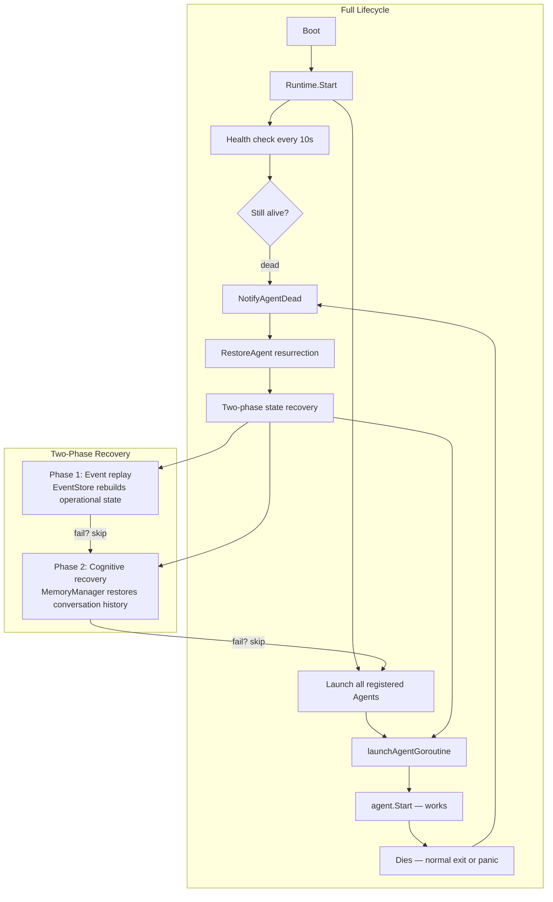
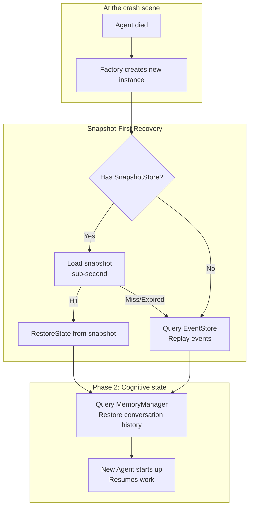
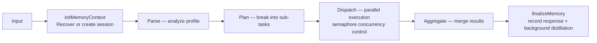
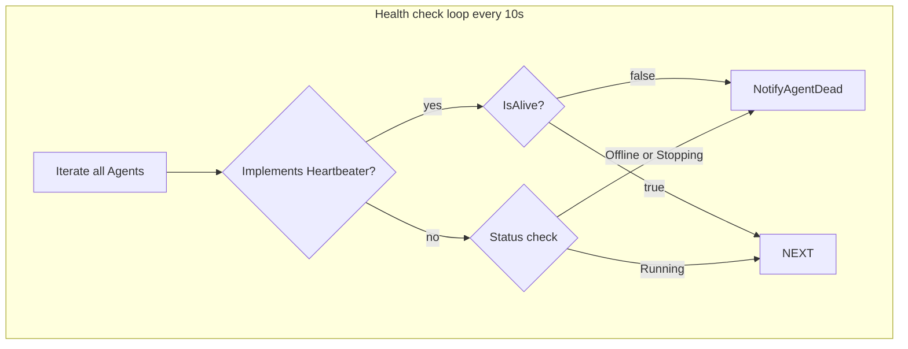
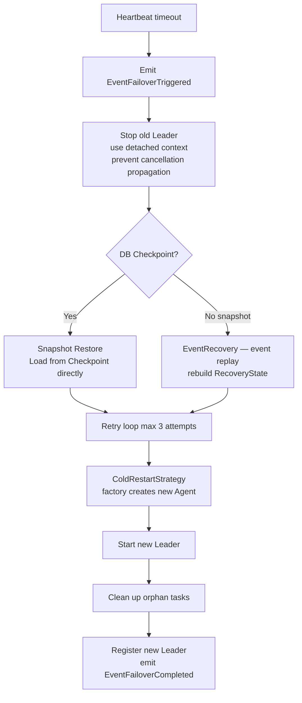
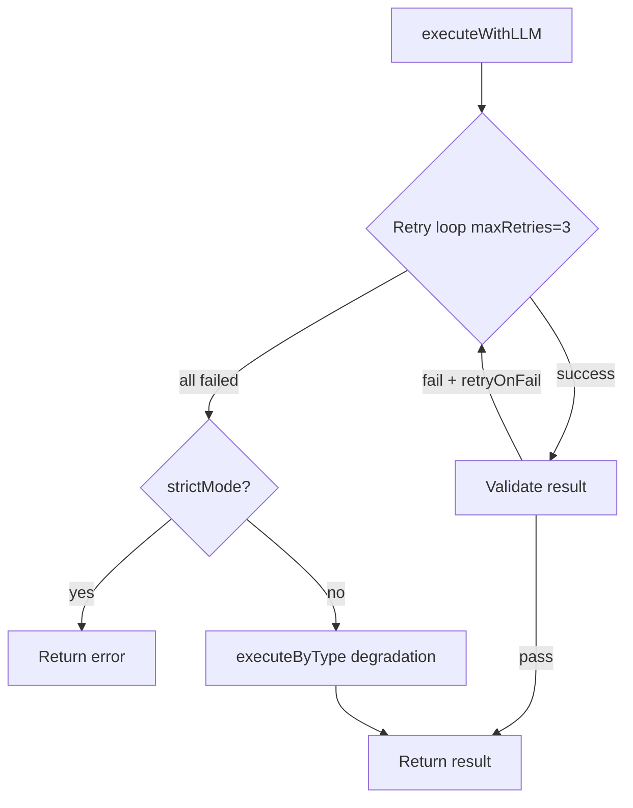
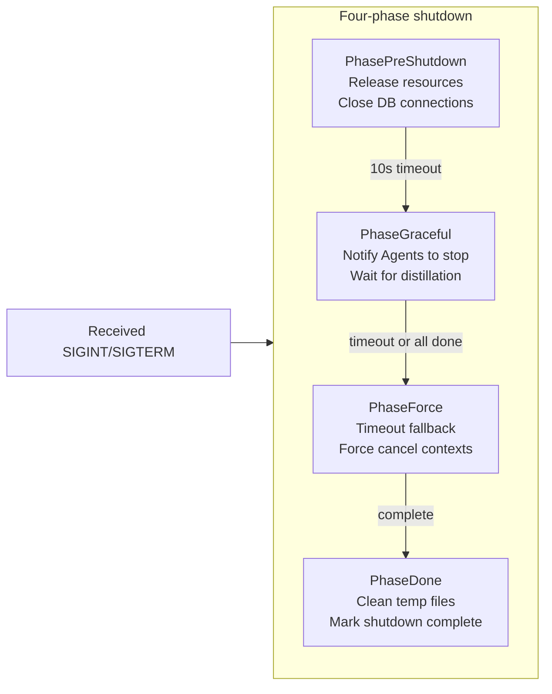

# ares Architecture Deep Dive (VII): Runtime & Lifecycle — Birth, Death, and Resurrection

What happens when an Agent dies? Every framework has to answer this, but few do it well. This article walks through the Runtime subsystem's design journey — from "how to prevent crashes" to "how to resurrect with memories intact" and "how to resume interrupted work without wasting tokens." You'll see the concurrency trap behind the Resurrection Guard, the fault-tolerance philosophy of two-phase state recovery, the detached-context distillation pattern, and the honest trade-offs behind every decision. Written for developers working on agent reliability, distributed orchestration, or stateful service auto-recovery.

> Other Agent frameworks compete on features and flashiness. I have only one obsession: **Bugs I can accept. Crashes I absolutely cannot.**
> One day I started thinking — what if I just `kill -9` a running Agent right now? How would I bring it back?
> Manually? First locate which process, dig through logs to find the cause, write a patch, then `go run main.go --args`… I'm already annoyed just thinking about it.
> So what if there's a mechanism where an Agent can die and then **get back up on its own, with its memories intact**? I call this **resurrection**.
> This is the core of the Runtime subsystem — Agents are disposable executors; the Runtime owns their birth, death, and resurrection.

## 1. The Rabbit Hole

Let me walk you through how I **agonized** over this design.

My first idea was simple: spawn a separate monitor task that checks every Agent's heartbeat. If one dies, report it — then restart it. Sounds solid, right? Then I asked myself: **what happens when the monitor itself dies?** Spawn another monitor to watch the monitor? It's turtles all the way down.

OK, different approach: spin up a backup Leader. Hot standby, disaster recovery, the whole deal. Then the next question hit me — **what about Sub Agents?** I can't give every Sub its own backup. So... a pool of rotating Subs? Cool, cool. Sounds great.

Then came the question that shut me up: **what about the interrupted task?**

The user asked the Agent to write a file. It got halfway through and the system crashed. System restarts, Agent auto-resurrects, and tells the user: **"Hey, the system just went down. I know you're frustrated — grab some tea, and we'll pick up where we left off!"**

Even if the user wants to curse the developer's ancestors, I'd say that's fair. More importantly — what about all those tokens that were already spent? Start over, spend them all again? That's real money.

So the Runtime subsystem's design wasn't about "how to make an Agent never die." It was about three much more pragmatic questions:

1. **How does an Agent get itself back up after dying?** (auto-resurrection)
2. **How does it remember what it was doing?** (state recovery)
3. **How does an interrupted task resume without wasting tokens?** (checkpoint resume)

Answer those three, and you can say "crashes don't happen."

---

## 2. Architecture: The Runtime Owns Life and Death



The core philosophy fits in one line:

```go
// Agents are disposable executors; the Runtime owns their birth, death, and resurrection.
```

Translation: Agents are throwaway executors — but their birth, death, and resurrection belong to the Runtime.

---

## 3. The Resurrection Guard: Why `stopped` Must Come Before `cancel`

This is the most important concurrency detail in the entire system. Here's the key sequence:

```go
func (m *Manager) StopAgent(ctx context.Context, agentID string) error {
    m.mu.Lock()
    // Step 1: Mark as "voluntary stop" FIRST
    ma.stopped = true
    cancel := ma.cancel
    m.mu.Unlock()

    // Step 2: Cancel context SECOND
    if cancel != nil { cancel() }  // triggers goroutine exit
}
```

Why must `stopped = true` come before `cancel()`? Consider this race:

1. Thread A calls `ma.cancel()`, Agent goroutine detects context cancellation
2. Goroutine exits and calls `NotifyAgentDead`
3. If `ma.stopped` hasn't been set to true yet, `NotifyAgentDead` thinks it's an accidental death and **incorrectly triggers resurrection**

Mark first, cancel second — that's the **Resurrection Guard**.

The full guard logic has four conditions; any match skips resurrection:

```go
if m.isStopped ||                     // Runtime itself is stopping
   ma.stopped ||                       // Agent was voluntarily stopped
   ma.resurrecting ||                  // Resurrection already in progress
   (m.config.MaxRestartsPerAgent > 0 &&
    ma.restarts >= m.config.MaxRestartsPerAgent) // Too many restarts
{
    return  // Don't resurrect
}
```

The restart limit is not a hardcoded 10 — it's configured via `Config.MaxRestartsPerAgent` (see `DefaultConfig()` for defaults), and resurrection uses **exponential backoff** to gradually reduce frequency:

```go
func (m *Manager) scheduleResurrection(agentID string, factory AgentFactory) {
    m.g.Go(func() error {
        backoff := time.Second
        const maxBackoff = 30 * time.Second
        const maxAttempts = 5
        for attempt := 1; attempt <= maxAttempts; attempt++ {
            restoreCtx, restoreCancel := context.WithTimeout(m.gctx, m.config.RestoreTimeout)
            err := m.RestoreAgent(restoreCtx, agentID, factory)
            restoreCancel()
            if err == nil { return nil }
            backoff *= 2
            if backoff > maxBackoff { backoff = maxBackoff }
        }
        return fmt.Errorf("resurrection failed after %d attempts", maxAttempts)
    })
}
```

**Honest reflection**: I used to have `MaxRestarts = 10` as a hardcoded constant — a number I pulled out of thin air. Why 10, not 3 or 20? No basis whatsoever. The "exponential backoff should be there but hasn't been" was the old story. Now the code actually has `scheduleResurrection` with backoff (1s → 2s → 4s → 8s → 30s max, 5 attempts). But we still lack a death-counter alert: if an Agent dies 5 times in 30 seconds, ops should be paged immediately. The config-based limit (`MaxRestartsPerAgent`) is better, but without alerting, a "flapping" agent still goes unnoticed until the customer reports it.

---

## 4. Two-Phase State Recovery: Snapshot First, Events Second

Agent resurrection is not **only** about event replay. The actual strategy is **snapshot-first, event-replay-fallback** — a significant evolution from earlier designs.

### Snapshot-First: The Fastest, Most Reliable Recovery Path

`RecoverSnapshotOrEvents` is the entry point for the entire recovery system:

```go
// RecoverSnapshotOrEvents implements snapshot-first recovery strategy:
//   Priority 1: SnapshotStore.Load (agent-level snapshot) — sub-second
//   Priority 2: Event replay (EventStore) — seconds to tens of seconds
//   Priority 3: Cognitive recovery (MemoryManager) — fastest but least complete
func RecoverSnapshotOrEvents(ctx context.Context, store base.SnapshotStore,
    agentID string, eventFn func() map[string]any) map[string]any {
    if store != nil {
        snap, err := store.Load(ctx, agentID)
        if err != nil {
            return eventFn()  // Snapshot load failed → fallback to event replay
        }
        if snap != nil {
            return snap  // Snapshot hit → use directly
        }
    }
    return eventFn()  // No snapshot store → direct event replay
}
```

| Priority | Method | When it applies | Speed |
|----------|--------|----------------|-------|
| 1 | `SnapshotStore.Load()` | `SnapshotAgent` impl + persisted snapshot | Fastest (<1s) |
| 2 | Event replay | EventStore available | Medium (1-30s) |
| 3 | Cognitive recovery | Always available | Fastest but incomplete |



```go
// In Manager.recoverAgentState: snapshot-first recovery
state := RecoverSnapshotOrEvents(ctx, m.snapshotStore, agentID,
    func() map[string]any { return m.buildStateFromEvents(ctx, agentID) })
if sa, ok := newAgent.(base.StatefulAgent); ok {
    sa.RestoreState(state)
    // Event stream integrity verification
    if len(evts) > 1 {
        if err := ares_events.VerifyStreamIntegrity(evts); err != nil {
            log.Error("runtime: event stream integrity check failed", "error", err)
        }
        // Truncation detection: compare expected vs actual stream version
        if streamVersion, _ := m.eventStore.StreamVersion(ctx, streamID); streamVersion > maxVersion {
            log.Error("runtime: event stream truncated — possible data loss")
        }
    }
    sa.ReplayEvents(evts)
}
```

### The Snapshot Interface: Two-Layer Design

```go
type StatefulAgent interface {
    Agent
    RestoreState(state map[string]any)
    ReplayEvents(events []*ares_events.Event)
    Snapshot() (map[string]any, error)     // Key addition
}

type SnapshotStore interface {
    Save(ctx context.Context, agentID string, data map[string]any) error
    Load(ctx context.Context, agentID string) (map[string]any, error)
    Delete(ctx context.Context, agentID string) error
}
```

`Snapshot()` and `RestoreState()` are paired. `Manager.Stop()` captures a final snapshot for every stateful agent, ensuring fast recovery on cold restart. The snapshot is **agent-chosen** — each agent decides what's critical enough to persist (session ID, entry point, pending tasks etc.).

### Event Stream Integrity Verification

The `replayEvents` path now includes three-tier integrity checks — a direct response to the old "partial amnesia" concern:

1. **Hash chain check** — `VerifyStreamIntegrity()` validates the cryptographic chain between consecutive events, detecting corruption or tampering
2. **Truncation detection** — compares the replayed stream's max version against `EventStore.StreamVersion()`; if the store has more events than what was replayed, the stream was likely truncated
3. **Max replay limit** — a safety cap (default 10000 events) prevents unbounded replay from overwhelming memory

### ExperienceCheckpoint: Workflow-Level Step Resume

Beyond agent-level snapshots, the system has an **independent workflow checkpoint system** — `ExperienceCheckpoint`. This is for `Workflow/(MutableDAG)`, not for agents:

```
Scope:
  LeaderCheckpoint (PostgreSQL)          → Agent-level session
  ExperienceCheckpoint (CheckpointStore) → Workflow step-level
```

`ExperienceCheckpoint` has 30+ fields across 8 categories:

```go
type ExperienceCheckpoint struct {
    // Metadata
    SchemaVersion    int                    `json:"schema_version"`
    ExecutionID      string                 `json:"execution_id"`
    WorkflowID       string                 `json:"workflow_id"`
    WorkflowVersion  string                 `json:"workflow_version,omitempty"`
    StateVersion     int64                  `json:"state_version"`
    Status           string                 `json:"status"`
    CurrentRound     int                    `json:"current_round"`
    Error            string                 `json:"error,omitempty"`

    // Step state — which steps completed, which failed
    StepStates       []StepStateSnapshot    `json:"step_states"`

    // Runtime data
    Variables        map[string]interface{} `json:"variables,omitempty"`
    OutputStore      map[string]string      `json:"output_store,omitempty"`

    // DAG topology — for reconstructing the execution graph
    DAGNodes         []string               `json:"dag_nodes,omitempty"`
    DAGEdges         []DAGEdge              `json:"dag_edges,omitempty"`

    // Execution history
    RouteHistory     []RouteEntry           `json:"route_history,omitempty"`
    ToolHistory      []ToolEntry            `json:"tool_history,omitempty"`
    MemoryHits       []MemoryEntry          `json:"memory_hits,omitempty"`
    InterruptHistory []InterruptEntry       `json:"interrupt_history,omitempty"`
    LoopHistory      []LoopEntry            `json:"loop_history,omitempty"`
    ErrorHistory     []ErrorEntry           `json:"error_history,omitempty"`

    // Quality signals
    ScoringSignals   []ScoringSignal        `json:"scoring_signals,omitempty"`

    CreatedAt        time.Time              `json:"created_at"`
}
```

The `CheckpointPlugin` hooks into `BeforeStep` and `AfterStep` lifecycle events:

- **BeforeStep**: Creates/updates checkpoint, marks step as `running`, saves (or batches via `flushInterval`)
- **AfterStep**: Updates step result (status/output/error), appends error history for failed steps
- **Flush**: Forces immediate save when execution completes — ignores the flush interval
- **Cleanup**: Removes in-memory snapshots to prevent unbounded map growth

`DynamicExecutor.ExecuteDynamicFromCheckpoint()` uses this to skip completed steps:

```go
func (e *DynamicExecutor) ExecuteDynamicFromCheckpoint(ctx context.Context, executionID string) error {
    ckpt := e.checkpointPlugin.Snapshot(executionID)
    // Rebuild completed/processed maps from checkpoint
    for _, ss := range ckpt.StepStates {
        if ss.Status == StepStatusCompleted {
            e.completed[ss.StepID] = ss.Output
            e.processed[ss.StepID] = true
        }
    }
    // Only execute uncompleted steps via shared execLoop
    return e.execLoop(ctx, ckpt)
}
```

**Honest reflection**: Snapshot-first recovery sounds great, but it depends on agents correctly implementing `Snapshot()`. If an agent misses a critical field in `Snapshot()`, the recovered state may be **less accurate** than pure event replay. "Snapshot is the best path, not the absolutely reliable path" — this understanding should be systematically documented in every agent's `Snapshot()` implementation.

`ExperienceCheckpoint` has its own data volume concern: a complex workflow execution may produce hundreds of RouteHistory and ToolHistory records. Deserialization + reconstruction is not free. There's currently no automatic TTL cleanup or large-checkpoint sharding.

---

## 5. Leader Agent's Orchestration Pipeline: stopCh Everywhere

The Leader's `Process` method runs a four-stage pipeline:



Each step checks for a stop signal:

```go
select {
case <-a.stopCh:
    return nil, ErrAgentNotRunning
default:
}
```

This means: even if the user hits Ctrl+C at step 2, the Agent doesn't plow through the entire pipeline before stopping.

### Context Detachment in Distillation: The Easiest Bug to Miss

The distillation logic in `finalizeMemory` hides a classic concurrency problem:

```go
func (a *leaderAgent) finalizeMemory(...) {
    a.distillMu.Lock()
    select {
    case <-a.stopCh:
        a.distillMu.Unlock()
        return  // Stopping, skip distillation
    default:
    }
    a.distillWg.Add(1)         // Must Add inside the lock
    a.distillMu.Unlock()

    a.distillEg.Go(func() error {
        defer a.distillWg.Done()

        // Key: use context.Background() to detach from parent
        // Distillation continues even if client disconnects
        distillCtx, cancel := context.WithTimeout(context.Background(), 2*time.Minute)
        defer cancel()

        distilled, _ := a.memoryManager.DistillTask(gCtx, taskID)
        return a.memoryManager.StoreDistilledTask(gCtx, taskID, distilled)
    })
}
```

Three things to notice:

1. **`distillMu` protects the atomicity of `stopCh` check + `Wg.Add(1)`**: Without the lock, `Wait` could run before `Add` → `panic: Add after Wait`
2. **`context.Background()`**: Distillation is independent of the client connection
3. **Stop order**: `close(stopCh)` → `distillWg.Wait()` → `distillEg.Wait()`

**Honest reflection**: `context.Background()` detaches from parent cancellation, but also loses the cancellation chain — what if distillation takes 2 hours? There is a `2*time.Minute` timeout, but again, it's a number I made up. There's also no documentation telling users "distillation may take up to 2 minutes and uses X MB of RAM." That's an operational visibility gap.

---

## 6. Health Check and Heartbeat: The Thinnest Safety Net



```go
func (m *Manager) healthCheck() {
    for _, c := range checks {
        if h, ok := c.agent.(base.Heartbeater); ok {
            if !h.IsAlive() {
                m.NotifyAgentDead(c.id, "heartbeat failed")
            }
            continue
        }
        // Fall back to status polling
        status := c.agent.Status()
        if status == models.AgentStatusOffline {
            m.NotifyAgentDead(c.id, "status=offline")
        }
    }
}
```

There's a subtle problem here: **`NotifyAgentDead` is called from the health check goroutine**, but `NotifyAgentDead` triggers async resurrection (`m.g.Go(func()...)`). This means health check detects a death -> triggers resurrection -> but has no idea whether the resurrection succeeded, how long it took, or whether the Agent died again.

**Honest reflection**: The health check loop is one-way. It only says "found problem -> threw to resurrection" without ever confirming "problem is resolved." The ideal design would let health check observe resurrection status — e.g., a flag that gets set on successful resurrection, letting health check reset its counter. This would also detect "resurrection loops" early and alert ops, rather than letting the configured `MaxRestartsPerAgent` × exponential backoff cycle run its full course before surfacing a problem. Without this feedback, a flapping agent will exhaust all retries (5 attempts with 30s max backoff) before anyone notices.

---

## 7. Supervisor Failover: Checkpoint-First Cold Restart

**Note**: `LeaderSupervisor` has been superseded by the **resurrection plugin** (`scheduleResurrection`), which shares the same snapshot-first recovery mechanism as the Runtime Manager. `LeaderSupervisor` is retained only for test compatibility. New code should use `Manager.RestoreAgent()` directly.

### LeaderCheckpoint: PostgreSQL-Persisted Session State

`LeaderCheckpoint` is an agent-level database checkpoint for failover. It is **not** for workflow steps (that's `ExperienceCheckpoint`'s job) — it saves the Leader Agent's **session-level** state:

```go
type LeaderCheckpoint struct {
    LeaderID     string    `db:"leader_id,primary"`  // Primary key
    SessionID    string    `db:"session_id"`
    EntryID      string    `db:"entry_id"`
    RootMsgID    string    `db:"root_msg_id"`
    StatusPayload []byte   `db:"checkpoint_payload"` // JSON-serialized full state
    CreatedAt    time.Time `db:"created_at"`
    UpdatedAt    time.Time `db:"updated_at"`
}
```

Database operations use UPSERT semantics (`INSERT ... ON CONFLICT (leader_id) DO UPDATE`), guaranteed by the `db:"leader_id,primary"` primary key so each agent has at most one checkpoint row. The interface:

```go
type LeaderCheckpointer interface {
    Save(ctx context.Context, ckpt *LeaderCheckpoint) error
    GetLatest(ctx context.Context, leaderID string) (*LeaderCheckpoint, error)
    Delete(ctx context.Context, leaderID string) error
}
```

### Failover Flow



```go
type RecoveryState struct {
    SessionID     string
    PendingTasks  []string    // Work not yet completed
    LastVersion   int64       // Event version number
    LastFailover  time.Time   // Last failover time
}
```

**Two paths**: With checkpoint → snapshot recovery (seconds); without → falls back to event replay (potentially tens of seconds).

### DAG Status Transitions & Genealogy Tracking

During resurrection, the Manager tracks agent status transitions via `DAGRuntimeManager`:

```
StatusRunning → StatusDead → StatusResurrecting → StatusRunning
```

Each state transition emits corresponding events through the `ares_events` system. The Manager subscribes to these events and maintains **genealogy tracking**:

```go
m.eventBus.Subscribe(ares_events.TypeAgentDead, func(evt *ares_events.Event) {
    m.recordDeath(evt)     // Records death cause, timestamp
})
m.eventBus.Subscribe(ares_events.TypeAgentResurrected, func(evt *ares_events.Event) {
    m.recordResurrection(evt)  // Records new instance ID after resurrection
})
```

Genealogy data is stored in `RuntimeManager.deathRecords` and can be queried via `GetAgentGenealogy()`, helping debug an agent's death-resurrection history.

**Honest reflection**: `EventRecovery.RecoverFromEvents()` uses a degradation strategy — if an event field is corrupted, it skips instead of erroring. This guarantees "recover as much as possible," but might produce a "looks normal but logically wrong" state. E.g., there's a task in `PendingTasks` that was actually already completed in the event stream, but a corrupted field makes it appear unprocessed. The Agent re-executes, potentially producing duplicate results.

Current philosophy: **Better to redo than to miss.** This aligns with the "robustness first" principle, but assumes idempotency — not all tools are idempotent. The fix is to add idempotency markers to tools, so the recovery system knows which can be safely retried and which must be skipped.

---

## 8. Sub Agent: Simplified Lifecycle

Sub Agent is much simpler than Leader:

```go
type subAgent struct {
    stopCh   chan struct{}   // Signals all goroutines to stop
    streamWg sync.WaitGroup  // Tracks active stream goroutines
}
```

The executor's retry and degradation is the most interesting part of the Sub layer:



Heartbeat sender uses `sync.Once` for defensive close:

```go
func (s *heartbeatSender) Stop() {
    s.stopOnce.Do(func() { close(s.stopCh) })
}
```

**Honest reflection**: Sub Agent's `executeByType` degradation is a crude fallback — when all LLM calls fail, it dispatches to hardcoded handling logic based on task type. "Analysis" tasks return empty results, "generation" tasks return cached versions. The quality depends entirely on how many task types are covered. Currently only 4 types are covered — everything else just errors out, making the fallback essentially useless.

---

## 9. Graceful Shutdown: Four-Phase Pipeline



```go
// PhaseExecutor supports retry and exponential backoff
func (e *PhaseExecutor) Execute(ctx context.Context, fn func(ctx context.Context) error) error {
    for attempt := 0; attempt <= e.maxRetries; attempt++ {
        if err := fn(ctx); err != nil {
            backoff := time.Duration(1<<uint(attempt)) * time.Second
            if e.onFailure != nil { e.onFailure(err) }
            continue
        }
        break
    }
    if e.onComplete != nil { return e.onComplete() }
}
```

The callback registry supports priority-sorted shutdown:

```go
type RegisteredCallback struct {
    ID       string
    Priority int       // Higher = executes first
    Fn       Callback
    Timeout  time.Duration
    OnError  func(error)
}
```

---

## 10. Callbacks: Lifecycle Hooks

A lightweight event hook system — each handler has independent panic recovery:

```go
func (r *Registry) Emit(ctx *Context) {
    handlers := r.handlers[ctx.Event]
    for _, h := range handlers {
        func() {
            defer func() {
                if r := recover(); r != nil {
                    log.Error("handler panicked", "event", ctx.Event)
                }
            }()
            h(ctx)
        }()
    }
}
```

Note that `log` here is not `slog` — it's a module-scoped logger created via `logger.Module("runtime")`. Every log entry from Runtime automatically carries `module=runtime`. This sounds trivial until you have Runtime, Workflow, Memory, and Evolution all logging to the same stream at 3am when something breaks. Without module tags, you're staring at identical `slog.Info("started")` lines from four different subsystems with no way to tell them apart.

The same problem exists in the event system itself. When you replay an event stream, you see `step.started` and `tool.call.completed` — but which module emitted them? The workflow engine? The runtime? The plugin bus? The payload doesn't say. That's why `Event` now carries a `ModuleName` field, and `Emit()` requires you to declare who you are at the call site:

```go
Emit(ctx, store, streamID, eventType, "runtime", payload)
```

Forcing the source at the call site means you can't accidentally emit an event without declaring your identity. It's a compile-time guarantee, not a runtime convention.

**Honest reflection**: This system lives in an awkward state. It was designed early on for LLM/Agent/Tool lifecycle event notifications. Later, `events.EventStore` was added for event sourcing. Their functionality overlaps. The only reason it's still here is that some things still depend on callbacks (logging, metrics) and migrating is more expensive than keeping it. Classic "old and new system coexistence" — both emit events, but consumers are different, and debugging requires checking two places.

---

## 11. Known Issues & Design Flaws

**1. Health check has no feedback loop**

It only says "found problem, tossed it to resurrection" — never confirms whether the problem was actually solved. Exponential backoff is now implemented (see Section 3), which reduces log flooding from repeated resurrection failures, but it doesn't fundamentally solve the "death loop" detection problem. Needs a death-counter threshold + alerting mechanism.

**2. Event replay semantic completeness is unverifiable**

`VerifyStreamIntegrity()` now provides hash-chain + truncation detection for the event stream, but it can't guarantee semantic completeness after recovery. If an intermediate event corrupts a critical field, the Agent can resurrect with "partial amnesia" — thinking it completed a task it didn't. Needs WAL-level field-level integrity checks.

**3. Context detachment (distillation) is invisible to ops**

`context.Background()` ensures distillation doesn't get cancelled, but it also means **nobody knows it's running**. No visibility into background task progress.

**4. Sub Agent degradation coverage is incomplete**

`executeByType` only covers 4 task types. For everything else, degradation = just error out — same as not having degradation at all.

**5. Non-idempotent tools are at risk**

"Better to redo than miss" is catastrophic for non-idempotent tools (place order, send email). Needs tool-level idempotency markers.

**6. Callbacks and Events coexist**

Both emit events, both consume events, but there's no unified event model. Debugging requires checking two places.

---

## 12. Architecture Summary

| Pattern | Problem Solved | Gap |
|---------|---------------|-----|
| Resurrection Guard (stopped before cancel) | Prevents voluntary stop from being misidentified as accidental death | — |
| Exponential backoff resurrection | Reduces log flooding from repeated resurrection failures | Still no death-counter alerting |
| Snapshot-first recovery (RecoverSnapshotOrEvents) | Sub-second state recovery > slow event replay | Snapshot may be stale |
| ExperienceCheckpoint | Workflow step-level precise resumption | 30+ field cognitive burden |
| Event integrity verification (VerifyStreamIntegrity) | Prevents silent errors from corrupted event stream | Field-level semantic checks still missing |
| Error-tolerant recovery chain | Partial recovery > no recovery | Semantic completeness unverifiable |
| Genealogy tracking | Traceable death-resurrection history | In-memory only, lost on restart |
| Context detachment (Background) | Distillation survives request cancellation | Invisible to operations |
| Semaphore concurrency control | Limits parallel sub-tasks | — |
| Factory pattern + event replay | State reconstruction | Unsafe for non-idempotent tools |

The most satisfying test I ever ran: I started 10 Agents running analysis tasks, then manually `kill -9`'d the process. When it restarted, every Agent auto-resurrected and continued where it left off.

That moment I knew: **the money wasn't wasted.**

---

**Appendix: Key File Index**

| File | Core Responsibility |
|------|-------------------|
| `internal/ares_runtime/runtime.go` | Runtime interface and config definition |
| `internal/ares_runtime/manager.go` | Register, start, stop, resurrection guard, exponential backoff resurrection, health check |
| `internal/ares_runtime/recovery.go` | Snapshot-first recovery: `RecoverSnapshotOrEvents()` (try snapshot first, fallback to event stream) |
| `internal/ares_runtime/checkpoint.go` | ExperienceCheckpoint: 30+ field workflow step-level snapshot + CheckpointPlugin |
| `internal/agents/base/agent.go` | Agent interface hierarchy: Agent / StatefulAgent / Heartbeater (includes `Snapshot()`) |
| `internal/agents/leader/agent.go` | Leader orchestration pipeline + state recovery + safe distillation |
| `internal/agents/leader/dispatcher.go` | Semaphore concurrent dispatch |
| `internal/agents/leader/supervisor.go` | **Deprecated**: Heartbeat monitor + failover + cold restart (test compat only) |
| `internal/agents/leader/checkpoint.go` | LeaderCheckpoint: PostgreSQL-persisted Agent-level session checkpoint |
| `internal/agents/leader/event_recovery.go` | Rebuild RecoveryState from event stream (degradation strategy) |
| `internal/plugins/resurrection/resurrection.go` | Resurrection plugin: replaces deprecated LeaderSupervisor, shares snapshot-first recovery |
| `internal/workflow/engine/dynamic_executor.go` | `ExecuteDynamicFromCheckpoint()`: step-level resumption from ExperienceCheckpoint |
| `internal/agents/sub/agent.go` | Sub Agent lifecycle |
| `internal/agents/sub/executor.go` | LLM execution engine (retry + degradation) |
| `internal/agents/sub/heartbeat.go` | Heartbeat sender + sync.Once shutdown |
| `internal/ares_shutdown/manager.go` | Four-phase shutdown |
| `internal/ares_callbacks/callbacks.go` | LLM/Agent/Tool lifecycle hooks |

---

**Next up: [Event System](/docs/articles/en/event-system.md) — how Agents communicate, how events are sourced, and how state is rebuilt.**