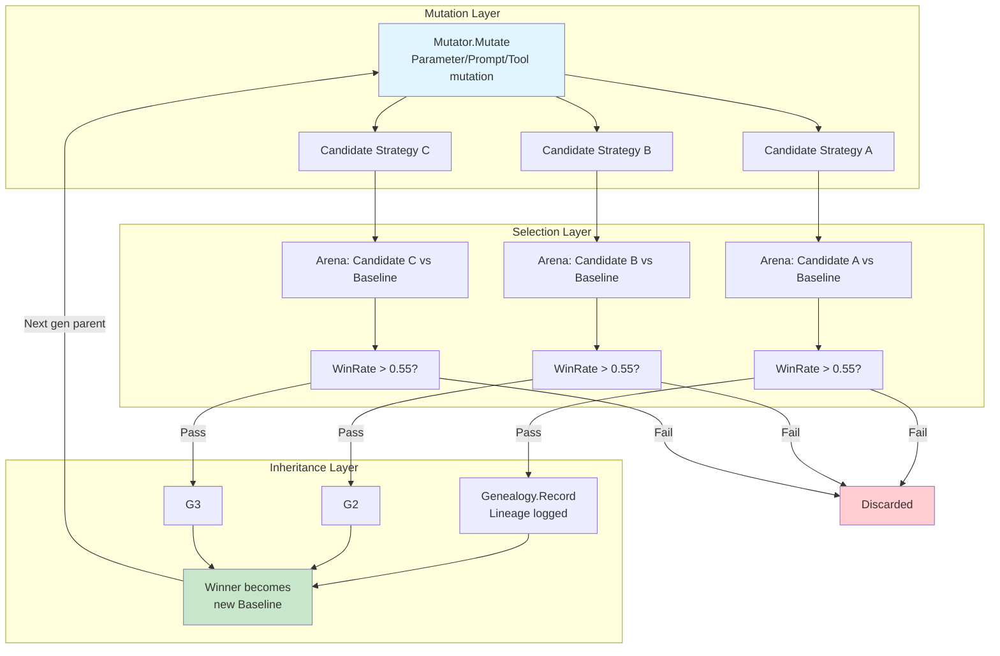
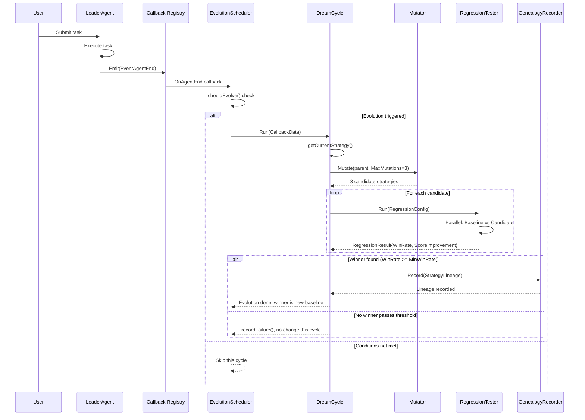
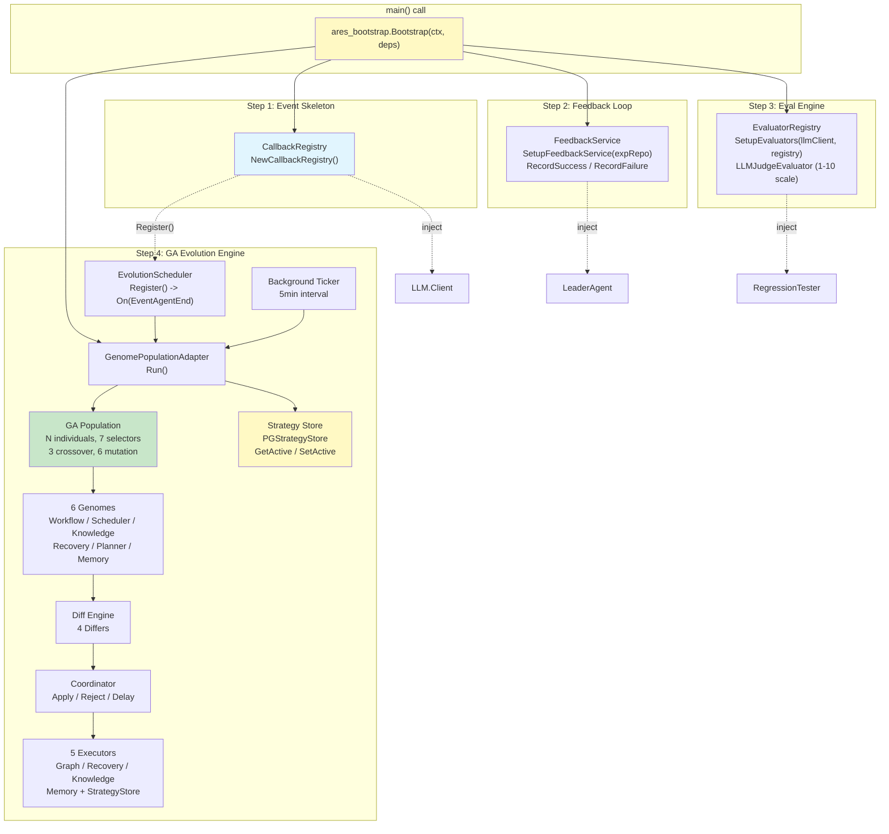
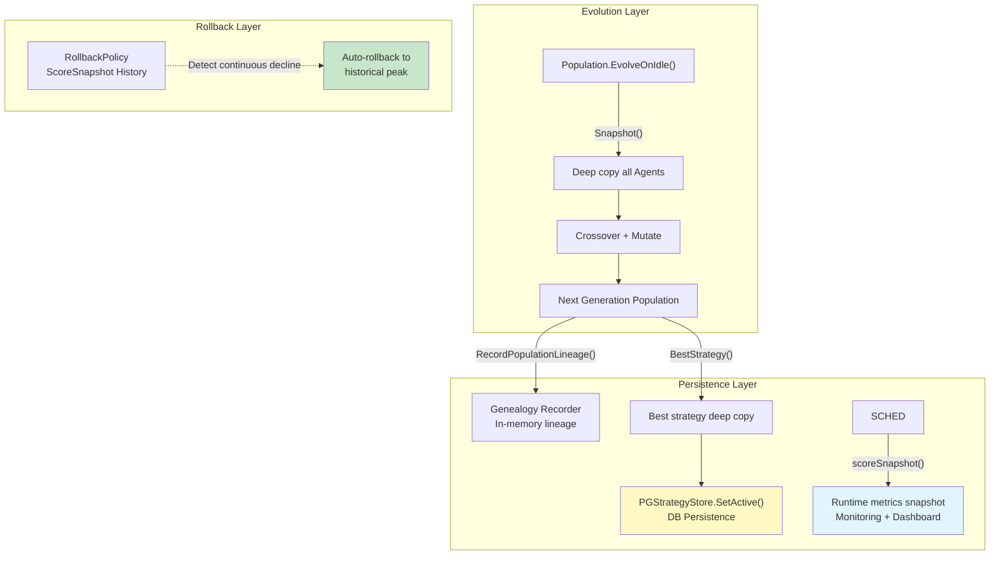

# ares Architecture Deep Dive (XI): Autonomous Evolution — When Agents Learn to Improve Themselves

> Have you ever wondered why agents can't get smarter with use?
> They make the same mistake twice. Every time they solve a problem, next time they start from scratch.
> If humans can learn from mistakes, why can't agents?
> **What if we borrowed a page from biology?** Mutation, selection, inheritance, crossover — evolution itself is just a feedback loop running for 3.8 billion years.
> And so ares's Autonomous Evolution system was born — teaching agents to dream, mutate, test, and evolve.

---

## 1. A Naive Idea: Just Tweak the Prompt

Let me start with the wrong turn I took first.

When I first thought about "making agents smarter over time," my instinct wasn't building an evolution engine — it was **tweaking the system prompt**. The idea seemed obvious enough:

> Every time the agent makes a mistake, append a lesson to the system prompt: "Don't do X again." Over time, the prompt accumulates wisdom.

I hacked together something like this:

```go
// Pseudo-code — showing early thinking
type PromptTuner struct {
    rules []string
}

func (t *PromptTuner) Tune(prompt string, feedback string) string {
    rule := generateRuleFromFeedback(feedback) // Use LLM to extract rules from feedback
    t.rules = append(t.rules, rule)
    return prompt + "\n\nRules:\n" + strings.Join(t.rules, "\n")
}
```

This looked elegant at first glance. A `[]string` array, no extra infrastructure needed, no database, not even a second LLM call. Prompts get longer? So what — context windows are huge these days, right?

But after running it for a while, everything fell apart.

### Prompts Get Too Long

The first rule was fine. The tenth was okay. By the time you hit fifty rules, your system prompt has ballooned from 200 tokens to 5,000+ tokens. And these rules contradict each other:

```
Rule #3:   "Answer concisely"
Rule #17:  "Provide detailed explanations for technical questions"
Rule #31:  "Avoid redundant information"
Rule #42:  "Ensure all edge cases are covered"
```

When an LLM sees a set of conflicting instructions like this, its response isn't "intelligent tradeoff" — it's "pick one at random." The more rules you add, the more unpredictable its behavior becomes.

### No Quantifiable Feedback

The deadlier problem is: **you have no idea whether things got better or worse after each change.**

After adding "answer concisely," the agent's responses did get shorter. But it also started skipping important details. How do you measure that trade-off? No baseline, no metrics, no A/B tests. Pure gut feeling.

### No Feedback Loop

What annoyed me most was this: after the agent tweaks its prompt and runs a round, how did it perform? No idea. Success? Failure? User satisfaction? Zero data. You're like a machine learning engineer tuning hyperparameters blindfolded — every step is intuition, every step could be moving backward.

### Lessons Learned

The reason "just tweak the prompt" doesn't work boils down to one thing: **mutation without selection pressure isn't evolution — it's random walk.**

Biological evolution works because three mechanisms exist simultaneously: **mutation creates diversity, selection eliminates unfit individuals, inheritance passes good traits to the next generation.** My approach only had "mutation" (changing prompts), no "selection" (no way to know good from bad), and no "inheritance" (starting from scratch every time). This is no different from throwing darts at a wall — throw a thousand times, doesn't mean you're improving.

So I went back to fundamentals and asked: what does an agent actually need to evolve?

---

## 2. Core Insight: Evolution = Mutation + Selection + Inheritance

Mapping concepts from biological evolution:

| Biological Concept | Agent Evolution Equivalent | ares Implementation |
|---|---|---|
| **Mutation** | Change parameters / prompts / tools | `Mutator.Mutate()` |
| **Selection** | Arena regression testing (new vs old) | `RegressionTester.Run()` + Welch's t-test |
| **Inheritance** | Genealogy records strategy lineage | `GenealogyRecorder.Record()` |
| **Fitness** | Evaluator score + Arena WinRate | `LLMJudgeEvaluator.Evaluate()` |

This mapping wasn't something I dreamed up. It was discovered through repeated validation: **any self-improvement system, whether called evolution or reinforcement learning or online optimization, boils down to these three steps cycling.** The only differences are in the specific form of "mutation" and how the "fitness function" is defined.

The complete evolution loop looks like this:



Key design decisions:

**WinRate threshold = 0.55**: A new strategy doesn't need to crush the baseline — just be marginally better. This is conservative: better to evolve slowly than to regress. 0.55 means out of 100 comparisons, the new strategy must win at least 55 times, with statistical significance guaranteed by Welch's t-test (p < 0.05).

**Genealogy recording**: Every successful evolution leaves a record — who was parent, what mutation type, win rate, score improvement. The entire process is traceable, rollbackable, analyzable.

---

## 3. Infrastructure Audit: 75% Already Here

When I started seriously designing the evolution system, I discovered something interesting: **most of the infrastructure already existed.**

ares had quietly accumulated pieces — Experience System, Flight Recorder, Eval Engine, Callback System, Arena, Memory Distillation, DevAgent. Each managed its own domain separately, but together they formed the complete puzzle of evolution.

### 3.1 Experience System — Bandit Ranking

`internal/ares_experience/ranking_service.go` implements a lightweight bandit system:

```go
// Rank ranks experiences using multi-signal scoring.
// FinalScore = SemanticScore + UsageBoost + RecencyBoost
func (s *RankingService) Rank(ctx context.Context, experiences []*Experience, baseScores []float64) []*RankedExperience {
    // ...
    for i, exp := range experiences {
        semanticScore := baseScores[i]

        // Usage boost: log(1 + count) * weight, capped at 0.2
        usageBoost := s.calculateUsageBoost(exp.GetUsageCount())

        // Recency boost: exponential decay with 30-day half-life
        recencyBoost := s.calculateRecencyBoost(exp.CreatedAt, now)

        finalScore := semanticScore + usageBoost + recencyBoost
        // ...
    }
}
```

Key detail: **usage boost uses `log(1 + count)` instead of linear growth.** This means going from use #1 to #10 gives a big jump (log(10) ≈ 2.3), but from #100 to #110 barely registers (log(111) - log(101) ≈ 0.095). With the 0.2 hard cap, old experiences can't dominate the rankings forever.

And `feedback_service.go` provides the feedback loop:

```go
func (s *FeedbackService) RecordSuccess(ctx context.Context, experienceID string) error {
    // IncrementUsageCount: one successful use → usage_count += 1
    return s.experienceRepo.IncrementUsageCount(ctx, experienceID)
}

func (s *FeedbackService) RecordFailure(ctx context.Context, experienceID string) error {
    // DecrementRank: one failure → rank score -= N
    return s.experienceRepo.DecrementRank(ctx, experienceID)
}
```

This is a complete bandit loop: **explore (retrieve experiences) → exploit (use them) → feedback (success/failure) → update ranking weights.** The problem was — this loop was broken before (more on that later).

### 3.2 Flight Recorder — Decision Logging

Flight Recorder records every decision point during agent execution: which tool was called, how long it took, whether there were errors, what the LLM returned. In the evolution system, this data plays the role of "diagnostic input" — evolution needs to know "what went wrong" before it can make targeted improvements.

### 3.3 Eval Engine — Evaluation Framework

`internal/ares_eval/llm_judge.go` implements an LLM-as-Judge evaluator:

```go
type LLMJudgeEvaluator struct {
    client     LLMClient
    promptTmpl *template.Template
    scale      ScaleType // ScaleOneToTen / ScaleOneToFive / ScalePassFail
}

func (e *LLMJudgeEvaluator) Evaluate(ctx context.Context, tc TestCase, result TestResult) ([]EvalScore, error) {
    // 1. Render evaluation prompt (includes Input / ExpectedOutput / ActualOutput)
    prompt, err := e.renderPrompt(tc, result)

    // 2. Call LLM for judgment
    rawResponse, err := e.client.Generate(ctx, prompt)

    // 3. Parse JSON response into structured scoring
    judgeResp, err := e.parseResponse(rawResponse)

    // 4. Normalize to [0, 1]
    normalizedScore := judgeResp.Score / e.scale.maxScore()
    return []EvalScore{{Metric: "llm_judge", Score: normalizedScore}}, nil
}
```

Supports three scoring scales (1-10, 1-5, pass/fail), bilingual prompts (Chinese/English switchable), JSON parsing tolerant of markdown code fences and nested text. This is the evolution system's "fitness function" — determining how much better a new strategy is than the old one.

### 3.4 Callback System — Event Hooks

`internal/ares_callbacks/callbacks.go` defines a complete event bus:

```go
const (
    EventLLMStart   Event = "llm.start"
    EventLLMEnd     Event = "llm.end"
    EventAgentStart Event = "agent.start"
    EventAgentEnd   Event = "agent.end"
    EventToolStart  Event = "tool.start"
    EventToolEnd    Event = "tool.end"
    // ...
)

type Registry struct {
    handlers map[Event][]Handler
}

func (r *Registry) On(event Event, handler Handler) { ... }
func (r *Registry) Emit(ctx *Context) { ... }
```

Register-dispatch model, multiple handlers per event, panic recovery per handler doesn't affect others. This is the evolution system's "trigger" — when an agent completes a task, callback triggers the evolution decision logic.

### 3.5 Arena — Stress Testing

`internal/ares_arena/regression.go` implements a complete A/B regression testing framework:

```go
type RegressionTester struct {
    arena  *Service
    scorer Scorer
}

func (rt *RegressionTester) Run(ctx context.Context, cfg RegressionConfig) (*RegressionResult, error) {
    // Run old and new strategies in parallel
    g, gCtx := errgroup.WithContext(ctx)
    g.Go(func() error {
        oldScores, err = rt.runStrategy(gCtx, cfg.OldStrategy, cfg.BaselineRuns)
    })
    g.Go(func() error {
        newScores, err = rt.runStrategy(gCtx, cfg.NewStrategy, cfg.CompareRuns)
    })

    // Welch's t-test statistical significance check
    confident, pValue := computeSignificance(oldScores, newScores, cfg.Confidence)

    return &RegressionResult{
        WinRate:   winRate,
        Confident: confident,
        PValue:    pValue,
    }, nil
}
```

Note that `computeSignificance` uses **Welch's t-test** (not paired t-test), because sample sizes for old and new strategies can differ. The p-value approximation uses Abramowitz and Stegun's error function formula, with conservative scaling for small degrees of freedom. This isn't toy-level statistics — it's production-ready.

### 3.6 Memory Distillation — Knowledge Extraction

Covered in detail in Deep Dive III. Distilled Experiences are the raw material for the evolution system — every record in the experience database is a crystallization of past agent behavior, teaching the evolution system which patterns to keep and which to discard.

### 3.7 DevAgent — Code Generation

DevAgent can generate code, modify configs, create tools. In future evolution stages (Level 3: automatic tool generation), it will handle turning "I need a tool that does X" into actual runnable code.

---

## 4. Five Broken Links

Infrastructure exists, but the components are disconnected. Like having an engine, transmission, four wheels, and steering wheel — all scattered on the ground, never assembled. I discovered five critical break points while connecting them.

### Fix #1: Bandit Feedback Loop Broken (UsageCount=0)

**Problem**: `RankingService`'s `calculateUsageBoost` depends on `GetUsageCount()` returning usage counts. But if nobody calls `FeedbackService.RecordSuccess()` after task completion, this value is always zero. The bandit system degrades to pure semantic retrieval — an experience used 100 times ranks the same as a brand-new one.

**Fix**: Inject FeedbackService uniformly at bootstrap level:

```go
// bootstrap.go
func SetupFeedbackService(expRepo repositories.ExperienceRepositoryInterface) *experience.FeedbackService {
    if expRepo == nil {
        return nil
    }
    svc := experience.NewFeedbackService(expRepo)
    return svc
}

// Usage:
result := bootstrap.WireExperienceSystem(expRepo)
agent := leader.New(..., result.FeedbackOption)  // Inject FeedbackService
```

LeaderAgent calls `RecordSuccess(experienceID)` or `RecordFailure(experienceID)` on task completion. Loop closed.

### Fix #2: Callbacks Registered but Never Fired

**Problem**: Callback Registry exists, but nobody registered any handlers on it. `Registry.Emit()` gets called, but `handlers[event]` is empty — Emit becomes a no-op.

**Fix**: Unified registration at bootstrap:

```go
// bootstrap.go
func NewCallbackRegistry() *callbacks.Registry {
    return callbacks.NewRegistry()
}

// Inject into components:
client, err := NewLLMClientWithCallbacks(config, reg)     // LLM Client fires llm.start/end
executorOpt := WireTaskExecutorCallbacks(reg)              // TaskExecutor fires tool.start/end
leaderOpt := WireLeaderAgentCallbacks(reg)                 // LeaderAgent fires agent.start/end
```

Then subscribe to `EventAgentEnd` in `EvolutionScheduler.Register()`:

```go
// scheduler.go
func (s *EvolutionScheduler) Register() {
    s.callbacks.On(callbacks.EventAgentEnd, func(ctx *callbacks.Context) {
        data := CallbackData{AgentID: ctx.AgentID}
        s.OnAgentEnd(callbackCtx, data)
    })
}
```

Now whenever an agent finishes a task, the evolution scheduler gets notified and decides whether to kick off an evolution cycle.

### Fix #3: Missing LLM Judge Integration

**Problem**: Arena needs a Scorer to rate strategies, but no evaluator can plug in directly.

**Fix**: Register LLMJudgeEvaluator at bootstrap:

```go
// bootstrap.go
func SetupEvaluators(llmClient *llm.Client, registry *eval.EvaluatorRegistry) error {
    judge, err := eval.NewLLMJudgeEvaluator(llmClient,
        eval.WithChinesePrompt(),
        eval.WithScale(eval.ScaleOneToTen),
    )
    registry.Register("llm_judge", judge)
    return nil
}
```

`llm.Client` naturally satisfies the `eval.LLMClient` interface (same `Generate(ctx, prompt)` signature). No adapter wrapper needed.

### Fix #4: Two Distillation Systems Disconnected

**Problem**: `distillation.Distiller` produces `StoredExperience`, while `evolution.Experience` is a different type. Data written by distillation cannot be read by the evolution system.

**Fix**: Adapter pattern bridges both layers:

```go
// bootstrap.go - experienceStoreAdapter
type experienceStoreAdapter struct {
    repo repositories.ExperienceRepositoryInterface
}

func (a *experienceStoreAdapter) Create(ctx context.Context, exp *distillation.StoredExperience) error {
    model := &models.Experience{
        TenantID:  exp.TenantID,
        Type:      exp.Type,
        Problem:   exp.Problem,
        Solution:  exp.Solution,
        Score:     exp.Score,
        Success:   exp.Score > 0.5,
        Metadata:  metadata,
    }
    return a.repo.Create(ctx, model)
}

// Usage:
result.DistillerSetter(distiller)  // Inject adapter into Distiller
```

Similarly, `evolutionExpRepoAdapter` adapts the postgres repository interface to the evolution package's domain interface.

### Fix #5: Flight Data Observed But Never Acted On

**Problem**: Flight Recorder logs tons of diagnostic data (timeouts, LLM errors, parse failures), but nothing automatically extracts lessons from them.

**Fix**: `FlightToExperienceAdapter` auto-consumes Flight data:

```go
// adapter.go
func (a *FlightToExperienceAdapter) Run(ctx context.Context) error {
    subscriber := a.flight.EventStore()
    ch, err := subscriber.Subscribe(ctx, events.EventFilter{
        Types: []events.EventType{
            events.EventTaskFailed,
            events.EventStepFailed,
            events.EventStepRecoveryFailed,
        },
    })

    for evt := range ch {
        a.processEvent(ctx, evt)  // Auto-convert failures into Experiences
    }
    return nil
}
```

Only cares about failures with severity >= 3 (low-severity noise isn't worth learning from). Score inversely proportional to severity (worse failures get lower scores = patterns to avoid).

---

## 5. Dream Mode: Let Agents Dream

Alright, five broken links fixed, infrastructure connected. Now for the core piece — **Dream Mode**.

What is Dream Mode? Simply put: **let the agent play chess against itself during idle time.**

When humans sleep, their brains consolidate memories — categorizing daytime experiences, extracting patterns, strengthening important connections, weakening useless ones. Dream Mode does something similar for agents: using idle time to generate strategy variants based on historical data, pit them against the current strategy in the Arena, adopt winners, discard losers.

### Complete Data Flow



### Three-Level Mutation Gradient

Mutator supports three mutation levels, ordered by risk from low to high:

**Level 1: Parameter Mutation (80% probability)**

```go
// mutation/mutator.go
var DefaultParamRanges = map[string]ParamRange{
    "temperature":        {Values: []any{0.1, 0.3, 0.5, 0.7, 0.9}},
    "top_k":             {Values: []any{10, 20, 40, 80}},
    "max_steps":         {Values: []any{5, 10, 15, 20}},
    "memory_limit":      {Values: []any{3, 5, 10}},
    "conflict_threshold": {Values: []any{0.85, 0.90, 0.95}},
}

func (m *Mutator) mutateParameter(parent *Strategy) (*Strategy, error) {
    child := parent.Clone()
    candidates := m.mutableParamNames(child.Params)
    paramName := candidates[0]                    // Pick random param
    newVal := m.pickDifferentValue(rangeDef.Values, child.Params[paramName])
    child.Params[paramName] = newVal             // Change to different value
    return child, nil
}
```

Pick a random value from predefined ranges that differs from current. If temperature is currently 0.7, might mutate to 0.3 or 0.9. Safest mutation type — doesn't change behavioral logic, only adjusts behavior style.

**Level 2: Prompt Template Mutation (20% probability)**

```go
func (m *Mutator) mutatePrompt(parent *Strategy) (*Strategy, error) {
    child := parent.Clone()
    newTemplate := m.pickDifferentString(m.promptPool, parent.PromptTemplate)
    child.PromptTemplate = newTemplate  // Swap to different template
    return child, nil
}
```

Swap to a different template from the prompt pool. Much more aggressive than parameter mutation — equivalent to changing the agent's "personality." Probability kept low (20%), requires at least 2 templates in pool to trigger.

**Level 3: Tool Auto-Generation (Reserved)**

```go
const (
    MutationTool MutationType = iota + 2
    // TODO: reserved for future use in Iteration 3
    // Currently no code path generates this mutation type.
)
```

Most aggressive mutation — let the agent invent new tools. Still TODO, requires deep DevAgent integration and stricter security review.

### DreamCycle.Run() Core Flow

```go
// dream_cycle.go
func (dc *DreamCycle) Run(ctx context.Context, data CallbackData) error {
    dc.taskCount++  // Unconditional increment, for threshold tracking

    // Fast path: various guard checks
    if !dc.config.Enabled { return nil }
    if time.Since(dc.lastCycle) < dc.config.Cooldown { return nil }  // Cooldown period
    if taskCount < dc.config.MinTasksBeforeEvolve { return nil }     // Minimum tasks
    if !dc.scheduler.shouldEvolve(ctx, data) { return nil }          // Heuristic check

    // Step 1: Get current active strategy as parent
    parent, err := dc.getCurrentStrategy()

    // Step 2: Generate N candidate mutations
    candidates, err := dc.mutator.Mutate(ctx, parent, dc.config.MaxMutations)

    // Step 3: Arena test, find best winner
    winner, err := dc.findWinner(ctx, candidates, parent)

    // Step 4: Record lineage
    if dc.genealogy != nil {
        lineage := StrategyLineage{
            ParentID:         parent.ID,
            ChildID:          winner.strategy.ID,
            MutationType:     "dream_cycle",
            WinRate:          winner.winRate,
            ScoreImprovement: winner.scoreImprovement,
        }
        dc.genealogy.Record(ctx, lineage)
    }

    return nil
}
```

Note `getCurrentStrategy()` was previously a placeholder returning a hardcoded `root-strategy-v1` strategy. **This is now resolved** — see Section 9.8 (PGStrategyStore) for the full database-backed implementation. The DreamCycle now connects to `StrategyStore.GetActive()` to read the real currently-deployed strategy, and `StrategyStore.SetActive()` to persist winners back to the database.

```go
// dream_cycle.go - getCurrentStrategy() NOW RESOLVED
// Previously returned hardcoded placeholder Strategy{ ID: "root-strategy-v1", ... }.
// Now delegates to the injected StrategyStore (PGStrategyStore backed by real DB):
func (dc *DreamCycle) getCurrentStrategy() (Strategy, error) {
    if dc.strategyStore != nil {
        return dc.strategyStore.GetActive(dc.ctx)
    }
    // Fallback for systems without persistence configured
    return dc.fallbackStrategy()
}
```

### Arena Transforms From "Breaking Agents" Into "Validation Gateway"

Originally designed for stress testing — throwing extreme cases at agents to see if they crash. In the evolution context, its role flips: instead of trying to **break** the agent, it tries to **validate** that a mutated strategy is genuinely better.

```go
// dream_cycle.go - findWinner
func (dc *DreamCycle) findWinner(ctx context.Context, candidates []Strategy, baseline Strategy) (*candidateResult, error) {
    var best *candidateResult

    for _, cand := range candidates {
        result, err := dc.tester.Run(ctx, RegressionConfig{
            Candidate:      cand,
            Baseline:       baseline,
            TaskSampleSize: 50,
        })

        // Skip if WinRate below threshold
        if result.WinRate < dc.config.MinWinRate { continue }

        cr := &candidateResult{
            strategy:         cand,
            winRate:          result.WinRate,
            scoreImprovement: result.CandidateScore - result.BaselineScore,
        }

        if best == nil || cr.scoreImprovement > best.scoreImprovement {
            best = cr
        }
    }
    return best, nil
}
```

50 historical task replays, each candidate vs baseline A/B comparison, WinRate >= 0.55 AND statistically significant (Welch's t-test p < 0.05) to pass. Triple insurance against deploying a worse strategy.

---

## 6. Bootstrap Wiring: The Last Mile

Components implemented, broken links fixed, but one ultimate question remains: **who assembles all this?**

If every user needs to understand how to create CallbackRegistry, inject FeedbackService, register EvolutionScheduler, mount DreamCycle... the barrier to entry is too high. 99% of people would give up at step one.

That's why `ares_bootstrap.Bootstrap()` exists — one call, everything wired.

### Architecture Diagram



### Core Code

```go
// bootstrap.go
func ares_bootstrap.Bootstrap(
    ctx context.Context,
    deps *BootstrapDeps,
) (*Components, error) {
    result := &Components{}

    // Step 1: Callback Registry — central hub for all event wiring
    result.CallbackReg = NewCallbackRegistry()

    // Step 2: Feedback Service — bandit feedback loop
    result.FeedbackSvc = SetupFeedbackService(deps.ExpRepo)

    // Step 3: Evaluator — LLM Judge evaluator
    result.EvalRegistry = eval.NewEvaluatorRegistry()
    if deps.LLMClient != nil {
        SetupEvaluators(deps.LLMClient, result.EvalRegistry)
    }

    // Step 4: Evolution System — full evolution pipeline
    if deps.FlightRecorder != nil && deps.ExpRepo != nil {
        evolutionRepo := &evolutionExpRepoAdapter{repo: deps.ExpRepo}
        evolutionComps, err := SetupEvolution(
            ctx, deps.FlightRecorder, evolutionRepo,
            result.CallbackReg, deps.DreamDeps,
        )
        result.Evolution = evolutionComps
    }

    return result, nil
}
```

Returned `Components` contains everything needed for injection:

```go
type Components struct {
    CallbackReg    *callbacks.Registry           // -> llm.WithCallbacks(reg)
    FeedbackSvc    *experience.FeedbackService    // -> leader.WithFeedbackService(svc)
    EvalRegistry   *eval.EvaluatorRegistry        // -> arena.NewRegressionTester(arena, scorer)
    Evolution      *EvolutionComponents          // Self-contained loop
    // ...
}
```

### How the Five Links Close

| # | Link | Entry Point | Exit Point | Status |
|---|------|-------------|------------|--------|
| 1 | **Event emission** | LLM Client / TaskExecutor / LeaderAgent | CallbackRegistry.Emit() | Closed |
| 2 | **Event reception** | CallbackRegistry `EventAgentEnd` | EvolutionScheduler.OnAgentEnd() | Closed |
| 3 | **Feedback loop** | LeaderAgent task completion | FeedbackService.RecordSuccess/Failure | Closed |
| 4 | **Experience sync** | Distiller completes | ExperienceStoreAdapter.Create() | Closed |
| 5 | **Evolution execution** | Scheduler.shouldEvolve() -> DreamCycle.Run() | Mutator -> Arena -> Genealogy -> StrategyStore [DB] | **Closed** |

Link #5 is now fully closed: `getCurrentStrategy()` resolved via `PGStrategyStore.GetActive()` (database-backed), `RecordPopulationLineage()` auto-builds genealogy after each generation, `BestStrategyFromSystem()` extracts deployment-ready strategies, `StrategyStore.SetActive()` persists winners. The remaining gap is `shouldEvolve()`'s score degradation detection (still a stub heuristic).

### main() One-Liner -> All Components Ready

```go
// Typical usage in main()
func main() {
    // ... initialize basic dependencies ...

    wired, err := bootstrap.ares_bootstrap.Bootstrap(ctx, &bootstrap.BootstrapDeps{
        LLMClient:      llmClient,
        FlightRecorder: flightRecorder,
        ExpRepo:        expRepo,
        EmbeddingService: embedder,
        Distiller:      distiller,
        DreamDeps: &bootstrap.BootstrapDeps{
            Mutator:   mutator,
            Tester:    testerAdapter,
            Genealogy: genealogyDB,
        },
    })
    if err != nil {
        log.Fatal(err)
    }

    // Build agent using wired components
    agent := leader.New(
        leader.WithCallbacks(wired.CallbackReg),
        leader.WithFeedbackService(wired.FeedbackSvc),
    )
    // ...
}
```

From the caller's perspective, the evolution system is transparent — you don't need to know about Callback, Feedback, Arena, or Mutator. `ares_bootstrap.Bootstrap` encapsulates complexity in one place, returns constructor options ready to inject.

---

## 7. Implementation Roadmap & Risks

### Three Iteration Timeline

| Iteration | Goal | Core Deliverable | Risk Level |
|-----------|------|------------------|------------|
| **Iteration 1** | Pipeline closed | ares_bootstrap.Bootstrap + parameter mutation + Arena validation | Low |
| **Iteration 2** | Prompt evolution | Prompt template pool management + A/B testing + auto-replacement | Medium |
| **Iteration 3** | Tool auto-generation | DevAgent integration + safety sandbox + tool approval workflow | High |

Current status: **Iteration 1 complete**. ares_bootstrap.Bootstrap available, parameter mutation and Arena validation chain connected. `getCurrentStrategy()` fully resolved via `PGStrategyStore` (DB-backed StrategyStore). Population improvements (Snapshot, BestStrategy, Stats, BreedingPoolRatio) deployed. Auto-lineage recording via RecordPopulationLineage. Remaining work: `shouldEvolve()` hooks into actual score data for adaptive triggering.

### Risk Matrix

| Risk | Impact | Probability | Mitigation |
|------|--------|-------------|-----------|
| **Evolution causes performance regression** | Agent slower or dumber in production | Medium | WinRate threshold 0.55 + statistical significance + canary deployment |
| **Prompt mutation produces harmful behavior** | Agent outputs unsafe content | Low | Manual prompt pool review + safety filters |
| **Resource contention** | Evolution consumes too much compute | Medium | 5-min cooldown + idle trigger + resource limits |
| **Strategy explosion** | Mutation produces unbounded strategy versions | Low | Genealogy periodic cleanup + keep only winner chain |
| **Feedback gaming** | Agent artificially inflates own scores | Very Low | Scoring by independent Evaluator, outside agent control |

### Production Readiness Checklist

- [x] `getCurrentStrategy()` connects to real Strategy Store (not placeholder) — **RESOLVED**: `PGStrategyStore` implements `StrategyStore` with DB-backed `GetActive()` / `SetActive()` / `GetHistory()`
- [ ] `shouldEvolve()` integrates with EvalEngine or Flight Diagnostics real score data
- [ ] DreamCycle defaults to Enabled=false, explicit opt-in required
- [ ] Evolution results written to Audit Log, every strategy change traceable — **PARTIAL**: `RecordPopulationLineage()` auto-records after each generation; full audit log integration pending
- [ ] Rollback API: one-click revert to any historical strategy version — **AVAILABLE**: `PGStrategyStore.GetHistory(id, n)` returns ordered history; manual rollback via `SetActive(&previousVersion)`
- [ ] Monitoring metrics: evolution cycles, average WinRate, average ScoreImprovement, strategy version — **PARTIAL**: `PopulationStats` provides per-generation metrics; Prometheus/Grafana dashboard integration pending
- [ ] Resource limits: max concurrent evolutions, max duration per evolution, max storage

---

## 8. Next Steps: Full Autonomous Evolution

Iteration 1 just makes the evolution system "move." The really interesting stuff comes next:

### Level 2: Prompt Template Mutation

Current Mutator prompt mutation just picks a different template from a preset pool. Next step: let the LLM generate prompt variants itself:

```
Current prompt: "You are a helpful AI assistant..."
-> LLM generates 5 variants:
  1. "You are a senior software engineer focused on code quality..."
  2. "You are a concise and efficient assistant..."
  3. "You excel at breaking down complex problems..."
  4. ...
-> Arena PK -> pick best -> replace
```

Much riskier than parameter mutation (could generate harmful prompts), but also more valuable (qualitative leap vs quantitative tweak). Requires human review or safety filtering.

### Level 3: Automatic Tool Generation

The wildest vision: Agent realizes it lacks a capability, so it writes a tool to fill the gap.

```
Agent fails JSON parsing three times
-> Diagnosis: missing JSON schema validation capability
-> DevAgent generates validate-json tool
-> Arena test: with tool vs without tool
-> WinRate significantly improves -> auto-register to Tool Registry
```

Requires extremely strict security audit — can't let agents freely generate and execute code. Sandbox, permission control, human approval all mandatory.

### Evolution Dashboard

Once the evolution system is running, you need somewhere to watch it:

- **Strategy genealogy tree**: Full evolution chain from root-strategy-v1 to current version
- **Per-evolution details**: mutation type, before/after param comparison, WinRate, p-value
- **Real-time monitoring**: Active strategy version, last evolution time, pending queue
- **Manual intervention**: Force-trigger evolution, rollback strategy, adjust thresholds

### When Will Agents Write Better Code Than Themselves?

This is the ultimate question.

Honestly, I don't know the answer. But I'm certain of one thing: **if we don't give agents a mechanism for self-improvement, they'll never surpass the initial code we wrote for them.** The evolution system may not make agents write better code — but it provides a framework for systematic trial-and-error, quantitative evaluation, and improvement retention.

Maybe someday you'll discover your agent adjusted temperature from 0.7 to 0.3 on its own, accuracy improved by 12%. Or it generated a prompt template you never thought of, user satisfaction went up. Or maybe it improved nothing — but at least you know it tried, and you have data proving "this path doesn't work."

That's enough. Engineering's biggest advances rarely come from genius flashes of insight — they come from **systematically eliminating wrong answers.**

---

## 9. Genome Package: Genetic Algorithm Engine (Zero-Token Evolution)

The first eight sections covered the evolution system stuck in "single-parent reproduction" mode — one parent per cycle, Mutator generates variants, Arena picks the best. This is essentially **random search**, not true evolution.

Real genetic algorithms need two things: **Crossover (recombination)** and **Population**. That's what the genome package does.

But that was Iteration 1. Since then, I've added three major subsystems that transform the genome package from a toy GA into a production-grade evolution engine:

1. **PGStrategyStore** — database persistence for strategies (solves the `getCurrentStrategy()` placeholder problem)
2. **Runtime Snapshots with Auto-Genealogy** — in-memory population snapshots (`Population.Snapshot()`) and automatic genealogy recording via `RunIdleEvolution()`
3. **Population Improvements** — configurable breeding pool, thread-safe snapshots, deployment-ready strategy extraction

Let me talk about the detour I took first.

### 9.1 From Single-Parent to Population Evolution

When I first implemented Dream Cycle, I only had Mutator — generate N children from one parent, pick the best. Simple enough:

```
Parent -> Mutate -> [Child A, Child B, Child C] -> Arena PK -> Best Child -> Replace Parent
```

Seems intuitive, right? Keep only the optimal solution each time, simple and efficient. But after a few days I noticed a problem: **population diversity was rapidly deteriorating.**

First evolution: temperature changed from 0.7 to 0.3 (won). Second evolution: temperature can only vary starting from 0.3 — what if 0.3 is actually a local optimum? You've lost the 0.7 gene forever. Classic **Genetic Drift** problem — small population + strong selection pressure = rapid gene pool contraction.

How does nature solve this? Answer: **population + mating.** Don't keep just one winner — preserve a group of survivors, let them interbreed. Good genes flow between individuals, never permanently lost due to one generation's accident.

So I decided to write the genome package — introducing Population, Crossover, and Selection to upgrade evolution from "single-parent random search" to "population genetic algorithm."

### 9.2 Population Struct: The Skeleton

`internal/ares_evolution/genome/population.go` defines the core data structure:

```go
// population.go - Population core struct
// Population holds a collection of agent strategies that evolve together.
// It manages the lifecycle of strategies across generations using
// selection, crossover, and mutation operations.
type Population struct {
    // Agents contains the individual strategies in this population.
    Agents []*mutation.Strategy

    // Size is the target population size (constant across generations).
    Size int

    // Generation is the current generation number (0 = initial).
    Generation int

    // mu protects concurrent access to Agents and Generation fields.
    mu sync.RWMutex

    // cfg holds the evolution configuration parameters.
    cfg PopulationConfig

    // rng provides deterministic randomness for reproducible evolution.
    rng *rand.Rand
}
```

Notable design decisions:

**Read-write lock `sync.RWMutex`**: `Best()` and `Stats()` use read locks (concurrent queries OK), `doEvolve()` uses write lock (exclusive modification). Standard reader-writer separation — evolution operations are far less frequent than queries.

**Config as immutable snapshot**: `cfg PopulationConfig` is set once at `NewPopulation()` and never changes. You can't dynamically modify SurvivalRate at runtime — rebuild Population if needed. Deliberately conservative design: evolution parameters shouldn't be casually tampered with.

**Deterministic RNG `rng`**: Seeded with `time.Now().UnixNano()`. Comment explicitly notes `#nosec G404` — genetic algorithms don't need cryptographically secure randomness, `math/rand` suffices. Fixed seed enables reproducible experiments.

The config has grown since the initial version:

```go
// population.go - PopulationConfig with all fields
type PopulationConfig struct {
    Size              int     `json:"size"`                        // Default 20
    SurvivalRate      float64 `json:"survival_rate"`               // Default 0.6
    MutationRate      float64 `json:"mutation_rate"`               // Default 0.2
    EliteCount        int     `json:"elite_count"`                 // Default 1
    BreedingPoolRatio float64 `json:"breeding_pool_ratio"`         // Default 0.3 (NEW!)
    Seed              int64   `json:"seed,omitempty"`              // NEW!
}
```

Two new fields worth calling out:

**`BreedingPoolRatio` (default 0.3)**: This replaces the hardcoded `30 / 100` that used to live directly inside `EvolveOnIdle()`. Previously, if you wanted to change how aggressive idle evolution's selection pressure was, you'd have to edit source code. Now it's a first-class config parameter with its own functional option `WithBreedingPoolRatio(ratio)` and validation (`ErrInvalidBreedingPoolRatio`). The default of 0.3 means only the top 30% of survivors get to breed during idle evolution — strong selection pressure to avoid wasting compute on mediocre parents.

**`Seed`**: Enables fully deterministic population initialization. Combined with `MutatorSeed`, `CrossoverSeed`, and `UseDeterministicIDs` in `SystemConfig`, you can reproduce an entire evolution run bit-for-bit — invaluable for debugging and scientific comparison.

Creating a Population is straightforward:

```go
// population.go - NewPopulation
func NewPopulation(ctx context.Context, base *mutation.Strategy, mutator MutatorInterface, opts ...PopulationOption) (*Population, error) {
    // 1. Validate base and mutator non-nil
    // 2. Apply functional options (WithPopulationSize, WithSurvivalRate, etc.)
    // 3. Clone base as first individual
    // 4. Call mutator.Mutate(baseClone, Size-1) to populate initial variants
    // 5. Return populated Population
}
```

Default config is conservative:

```go
func DefaultPopulationConfig() PopulationConfig {
    return PopulationConfig{
        Size:              20,
        SurvivalRate:      0.6,      // Keep top 60%, eliminate bottom 40%
        MutationRate:      0.2,      // 20% chance offspring gets mutated again
        EliteCount:        1,        // Preserve 1 elite unchanged
        BreedingPoolRatio: 0.3,      // Top 30% of survivors form breeding pool
    }
}
```

Functional Option pattern throughout configuration — `WithPopulationSize(size)`, `WithSurvivalRate(rate)`, `WithMutationRate(rate)`, `WithEliteCount(count)`, **`WithBreedingPoolRatio(ratio)`**, **`WithPopulationSeed(seed)`**. Each option includes parameter validation (size > 0, rate in [0,1], etc.), returning error instead of panic on invalid input.

### 9.3 doEvolve(): Extracting 90% Common Logic

This is my favorite refactoring in the whole project.

Originally `Evolve()` and `EvolveOnIdle()` were two completely independent methods, each implementing sort→select→preserve elites→crossover→mutate→assemble. ~90% code duplication. I asked myself: what's the ONLY difference between these two?

- `Evolve()`: All survivors can be parents, elite count follows EliteCount config
- `EvolveOnIdle()`: Only top `BreedingPoolRatio` of survivors can breed (stronger selection pressure), single elite only

Everything else identical. So I extracted `evolveConfig` to capture these differences:

```go
// population.go - evolveConfig captures behavioral differences
type evolveConfig struct {
    survivalRate float64          // Fraction of survivors to keep
    parentPoolFn func(survivors []*mutation.Strategy) []*mutation.Strategy  // Select parents
    eliteFn      func(survivors []*mutation.Strategy) []*mutation.Strategy  // Preserve elites
    logLabel     string           // Label for slog output
}

// doEvolve runs the shared evolution loop.
// Flow: validate -> lock -> SortByScore -> select survivors ->
//       elite -> crossover -> mutate -> assemble -> increment Generation
func (p *Population) doEvolve(
    ctx context.Context,
    mutator MutatorInterface,
    crosser CrossoverInterface,
    cfg evolveConfig,
) error { /* ... */ }
```

Then both methods become thin wrappers:

```go
// Evolve delegates to doEvolve with full-survivor parent pool
func (p *Population) Evolve(ctx context.Context, mutator MutatorInterface, crosser CrossoverInterface) error {
    return p.doEvolve(ctx, mutator, crosser, evolveConfig{
        survivalRate: p.cfg.SurvivalRate,
        parentPoolFn: func(survivors []*mutation.Strategy) []*mutation.Strategy {
            return survivors // All survivors eligible as parents
        },
        eliteFn: p.preserveElites,
        logLabel: "evolution completed",
    })
}

// EvolveOnIdle delegates with configurable breeding pool ratio
func (p *Population) EvolveOnIdle(ctx context.Context, mutator MutatorInterface, crosser CrossoverInterface) error {
    return p.doEvolve(ctx, mutator, crosser, evolveConfig{
        survivalRate: p.cfg.SurvivalRate,
        parentPoolFn: func(survivors []*mutation.Strategy) []*mutation.Strategy {
            // Uses cfg.BreedingPoolRatio instead of hardcoded 30/100
            poolSize := int(float64(len(survivors)) * p.cfg.BreedingPoolRatio)
            if poolSize < 2 { poolSize = min(2, len(survivors)) }
            return survivors[:poolSize]
        },
        eliteFn: func(survivors []*mutation.Strategy) []*mutation.Strategy {
            if len(survivors) == 0 { return []*mutation.Strategy{} }
            return []*mutation.Strategy{survivors[0].Clone()}
        },
        logLabel: "evolve_on_idle completed",
    })
}
```

Notice the critical improvement: `EvolveOnIdle` now reads from `p.cfg.BreedingPoolRatio` instead of the magic number `30 / 100`. One line changed, but the architectural impact is significant — **selection pressure is now a tunable parameter, not a buried constant.**

From ~100 lines of duplicated logic to ~20 lines total. The common `doEvolve()` handles validation, locking, sorting, survivor selection, elite preservation, offspring generation via crossover+mutation, assembly, and generation increment. Both `Evolve()` and `EvolveOnIdle()` just configure the differences.

There's also a new safety check I added to `doEvolve()`:

```go
// doEvolve - empty population guard
if len(p.Agents) == 0 {
    return ErrSelectionEmptyPopulation
}
```

`ErrSelectionEmptyPopulation` is a named sentinel error (defined alongside `ErrNilBaseStrategy`, `ErrNilMutator`, etc.). Previously, an empty population would silently proceed to `SortByScore` on a nil slice and produce cryptic index-out-of-range panics downstream. Now it fails fast with a clear message.

### 9.4 Three Crossover Operators

`internal/ares_evolution/genome/crossover.go` implements three recombination strategies:

**Uniform Crossover (default)**

Each parameter independently inherited from either parent A or B with equal probability:

```go
// crossover.go - uniformCrossParams
func (c *Crossover) uniformCrossParams(a, b *mutation.Strategy) map[string]any {
    childParams := make(map[string]any, len(a.Params))
    for key := range a.Params {
        if c.rng.Float64() < 0.5 {
            childParams[key] = a.Params[key]  // Inherit from parent A
        } else {
            childParams[key] = b.Params[key]  // Inherit from parent B
        }
    }
    return childParams
}
```

Child's PromptTemplate inherits from the higher-scoring parent — preserving proven prompt quality.

**Multi-Point Crossover (k points)**

Parameters split into k+1 segments at k crossover points, alternating between parents:

```go
// crossover.go - multiPointSelect
func (c *Crossover) multiPointSelect(keys []string, k int) ([]string, []string) {
    // Fisher-Yates shuffle to pick k unique crossover point indices
    points := c.pickKPoints(len(keys), k)
    sort.Ints(points)

    var aKeys, bKeys []string
    currentParent := 0 // Start with A
    for i, key := range keys {
        if currentParent == 0 { aKeys = append(aKeys, key) }
        else { bKeys = append(bKeys, key) }
        // Switch parent at each crossover point
        if len(points) > 0 && i == points[0] {
            points = points[1:]
            currentParent = 1 - currentParent
        }
    }
    return aKeys, bKeys
}
```

Uses Fisher-Yates shuffle for unbiased crossover point selection. Produces contiguous parameter segments — useful when related parameters should stay together (e.g., temperature + top_p).

**Half-Split Prompt Crossover**

Splits PromptTemplate in half — first half from A, second half from B:

```go
// crossover.go - halfSplitPromptCrossover
func (c *Crossover) halfSplitPromptCrossover(a, b *mutation.Strategy) string {
    tmplA := a.PromptTemplate
    tmplB := b.PromptTemplate
    if tmplA == "" || tmplB == "" {
        return c.selectPromptTemplate(a, b)
    }
    mid := len(tmplA) / 2
    firstHalf := tmplA[:mid]
    secondHalf := tmplB[mid:]
    return firstHalf + secondHalf
}
```

All crossover-produced children are tagged with `mutation.MutationCrossover` (a dedicated constant added specifically for this purpose), distinguishing them from parameter-mutation offspring downstream.

### 9.5 Three Selection Operators

`internal/ares_evolution/genome/selection.go` implements natural selection strategies:

**TruncationSelection** — simplest, take top-N by score directly.

**TournamentSelection** (default k=3):

```go
// selection.go - TournamentSelection.Select
func (ts *TournamentSelection) Select(ctx context.Context,
    population []*mutation.Strategy, n int) ([]*mutation.Strategy, error) {
    selected := make([]*mutation.Strategy, 0, n)
    for i := 0; i < n; i++ {
        // Randomly pick k individuals, return the highest scorer
        best := ts.runTournament(population, ts.k)
        selected = append(selected, best)
    }
    return selected, nil
}
```

k=3 means each tournament pits 3 random individuals. Higher-scoring ones win more often, but low-scoring ones occasionally slip through — maintaining diversity. Larger k = stronger selection pressure.

**RouletteWheelSelection** — proportional to fitness score, BUT critically **filters out unevaluated individuals (Score == -1)**:

```go
// selection.go - RouletteWheelSelection.Select
func (rw *RouletteWheelSelection) Select(ctx context.Context,
    population []*mutation.Strategy, n int) ([]*mutation.Strategy, error) {
    // Filter out Score == -1 (unevaluated) BEFORE roulette wheel
    var evaluated, unevaluated []*mutation.Strategy
    for _, s := range population {
        if s.Score == -1 {
            unevaluated = append(unevaluated, s)
        } else {
            evaluated = append(evaluated, s)
        }
    }

    // If ALL unevaluated, fall back to uniform random
    if len(evaluated) == 0 {
        return rw.selectUniform(ctx, population, n)
    }

    // Roulette wheel selection on evaluated individuals only
    normalized := rw.normalizeScores(evaluated)
    // ... spin wheel N times based on normalized scores
}
```

Why filter Score==-1? Unevaluated strategies have no meaningful fitness. Without filtering, a Score of -1 shifted by min-score offset could acquire non-zero selection probability — letting never-evaluated strategies reproduce by luck.

### 9.6 SortByScore(): Correct Handling of Unevaluated Individuals

```go
// selection.go - SortByScore stable sorts by descending score.
// Critically: Score == -1 (unevaluated) always placed at the END.
func SortByScore(strategies []*mutation.Strategy) {
    sort.SliceStable(strategies, func(i, j int) bool {
        si, sj := strategies[i].Score, strategies[j].Score
        if si == -1 && sj != -1 { return false }  // -1 goes to end
        if si != -1 && sj == -1 { return true }   // -1 goes to end
        return si > sj                               // Normal descending
    })
}
```

Used by `doEvolve()`'s survivor selection. Without this, `selectSurvivors()`'s naive sort would place Score=-1 strategies above legitimately negative scores (e.g., -2), causing unevaluated individuals to survive into the next generation.

### 9.7 Population Improvements: Snapshot, Stats, and Deployment

After running the genome package in anger for a while, I realized something: **Population was a black box.** You could evolve it, but you couldn't safely inspect its state, extract the best result for deployment, or get basic statistics without risking data races. So I added four new methods.

**Snapshot(): Thread-Safe Deep Copy**

```go
// population.go - Snapshot returns a thread-safe copy of all agents and generation
func (p *Population) Snapshot() ([]*mutation.Strategy, int) {
    p.mu.RLock()
    defer p.mu.RUnlock()

    agents := make([]*mutation.Strategy, len(p.Agents))
    for i, a := range p.Agents {
        agents[i] = a.Clone()  // Deep clone every agent
    }
    return agents, p.Generation
}
```

This is the most important addition for external consumers. Before `Snapshot()`, anyone wanting to read population state had to either:
- Access `p.Agents` directly (data race city)
- Hope no evolution was running concurrently (wishful thinking)

`Snapshot()` acquires a read lock, deep-clones every agent via `a.Clone()`, and releases the lock. The caller gets a complete, isolated copy they can inspect for as long as they want — no shared state, no locking needed on their end. This is what powers both the serialization system (Section 9.9) and the genealogy recorder (`RecordPopulationLineage`).

**BestStrategy(): Deployment-Ready Extraction**

```go
// population.go - BestStrategy returns a deep clone of the highest-scoring strategy
func (p *Population) BestStrategy() *mutation.Strategy {
    best := p.Best()
    if best == nil {
        return nil
    }
    return best.Clone()
}
```

Subtle but important distinction from `Best()`: `Best()` returns a pointer to the internal agent (dangerous if evolution modifies it concurrently), while `BestStrategy()` returns a **deep clone** safe for deployment. After `RunIdleEvolution()` completes, call `system.Population.BestStrategy()` to get your production-ready strategy — no mutex juggling required.

**Stats(): Population Health Dashboard**

```go
// population.go - PopulationStats holds statistical information
type PopulationStats struct {
    Generation int
    Size       int
    AvgScore   float64
    BestScore  float64
    WorstScore float64
}

func (p *Population) Stats() *PopulationStats {
    p.mu.RLock()
    defer p.mu.RUnlock()

    stats := &PopulationStats{
        Generation: p.Generation,
        Size:       len(p.Agents),
    }
    // ... compute AvgScore, BestScore, WorstScore under read lock
    return stats
}
```

Four metrics that tell you everything about population health at a glance. Is average score trending up or down? Is the gap between best and worst narrowing (convergence) or widening (diversity loss)? All computed under read lock, safe to call from monitoring code or log output.

**CurrentGeneration(): Simple Generation Counter**

```go
func (p *Population) CurrentGeneration() int {
    p.mu.RLock()
    defer p.mu.RUnlock()
    return p.Generation
}
```

Trivial method, but it exists because accessing `p.Generation` directly outside the package would be a data race waiting to happen. Thread-safe generation counter — use it for progress reporting, lineage filtering, or conditional logic based on evolution maturity.

**initializeFromBase Data Race Fix**

One subtle bug I fixed: the original `initializeFromBase` used the incoming `base *mutation.Strategy` reference directly when calling `mutator.Mutate()`. If the caller held a reference to `base` and modified it concurrently, we'd have a data race:

```go
// FIXED: Use baseClone instead of external base reference
func (p *Population) initializeFromBase(ctx context.Context, base *mutation.Strategy, mutator MutatorInterface) error {
    p.mu.Lock()
    defer p.mu.Unlock()

    baseClone := base.Clone()           // Our own copy, safe from external mutation
    p.Agents = append(p.Agents, baseClone)

    if p.Size > 1 {
        variantsNeeded := p.Size - 1
        // Use baseClone (our own copy) instead of the external base reference.
        // This avoids potential data races if external code modifies base concurrently.
        variants, err := mutator.Mutate(ctx, baseClone, variantsNeeded)
        // ...
    }
    return nil
}
```

**generateOffspring Context Cancellation**

Another practical improvement: `generateOffspring` now respects context cancellation:

```go
func (p *Population) generateOffspring(...) ([]*mutation.Strategy, error) {
    // ...
    for len(offspring) < count {
        select {
        case <-ctx.Done():
            return offspring, ctx.Err()  // Graceful shutdown mid-generation
        default:
        }
        // ... crossover + mutate loop
    }
    return offspring, nil
}
```

Previously, if you cancelled context during a long evolution run (say, pop=100 with lots of offspring to generate), the goroutine would blindly continue until all slots were filled. Now it checks `ctx.Done()` every iteration — clean shutdown within one offspring generation cycle.

### 9.8 PGStrategyStore: Database Persistence (The Biggest Fix)

Remember that TODO that haunted the entire article?

```go
// TODO: replace with real strategy store lookup.
// slog.Warn("[DreamCycle] Using placeholder strategy; integrate with strategy store for production")
return Strategy{ ID: "root-strategy-v1", ... }, nil
```

**Gone. Deleted. Solved.**

`internal/ares_evolution/pg_strategy_store.go` implements the `StrategyStore` interface using the repository pattern — no raw SQL, no `StoreDB` interface, just clean delegation to `*repositories.StrategyRepository`:

```go
// interfaces.go - StrategyStore interface
type StrategyStore interface {
    GetActive(ctx context.Context) (*Strategy, error)
    SetActive(ctx context.Context, strategy *Strategy) error
    GetHistory(ctx context.Context, id string, n int) ([]*Strategy, error)
}

// pg_strategy_store.go - Implementation
type PGStrategyStore struct {
    repo *repositories.StrategyRepository
}

// Compile-time interface check
var _ StrategyStore = (*PGStrategyStore)(nil)
```

Three methods, each solving a specific piece of the persistence puzzle:

**GetActive(): Reading the Current Deployment**

`GetActive` returns the currently deployed best strategy. If no strategy has been stored yet, it returns `nil, nil` (not an error — just "nothing stored yet"). The database layer ensures only one strategy is active at any time.

```go
func (s *PGStrategyStore) GetActive(ctx context.Context) (*Strategy, error) {
    return s.repo.GetActiveStrategy(ctx)
}
```

The repository handles the SQL internally: `is_active = TRUE` with `ORDER BY version DESC LIMIT 1` — defense in depth to always return the latest version even in edge cases.

**SetActive(): Upsert with Atomic Deactivate**

`SetActive` takes a pointer to `Strategy` and marks it as the sole active deployment. The repository handles the two-phase pattern: deactivate all → activate new.

```go
func (s *PGStrategyStore) SetActive(ctx context.Context, st *Strategy) error {
    return s.repo.SetActiveStrategy(ctx, st)
}
```

Note the pointer receiver (`*Strategy`) — this was a deliberate change from the original value-type interface. The strategy struct can be large (including prompt templates and JSON params), and passing by pointer avoids unnecessary copying. The upsert semantics (`ON CONFLICT (id) DO UPDATE`) handle re-deployment of previous versions.

**GetHistory(): Audit Trail Retrieval**

`GetHistory` replaces the old `List()` method and adds a strategy ID filter. This lets you retrieve the evolution history for a specific strategy family:

```go
func (s *PGStrategyStore) GetHistory(ctx context.Context, id string, n int) ([]*Strategy, error) {
    return s.repo.GetStrategyHistory(ctx, id, n)
}
```

Ordered by version descending, limited to N entries. This is your audit trail — every version of a strategy ever deployed, in chronological order. The `id` parameter lets you focus on a specific strategy lineage.

**Why Repository Pattern?**

The old `EvolutionStore` defined a `StoreDB` interface with `ExecContext`, `QueryContext`, and `QueryRowContext`:

```go
type StoreDB interface {
    ExecContext(ctx context.Context, query string, args ...interface{}) (sql.Result, error)
    QueryContext(ctx context.Context, query string, args ...interface{}) (*sql.Rows, error)
    QueryRowContext(ctx context.Context, query string, args ...interface{}) *sql.Row
}
```

Both `*sql.DB` and `*sql.Tx` satisfied this interface, which was flexible — you could use it in regular operations or inside transactions. However, keeping SQL scattered across the evolution package made migrations and testing harder. The repository pattern centralizes all database access in `internal/repositories/`, making the store layer a thin delegation proxy:

| Aspect | Old (EvolutionStore) | New (PGStrategyStore) |
|--------|---------------------|----------------------|
| Struct | `EvolutionStore{ db StoreDB }` | `PGStrategyStore{ repo *repositories.StrategyRepository }` |
| Interface | `StoreDB` (SQL injection) | Repository methods (domain logic) |
| SQL queries | Inline in evolution package | Centralized in repository layer |
| Constructor | `NewEvolutionStore(db)` | `NewPGStrategyStore(repo)` |
| SetActive | `SetActive(ctx, Strategy)` value | `SetActive(ctx, *Strategy)` pointer |

This is a **pure refactor** — the underlying database table and SQL queries remain the same:

```sql
CREATE TABLE evolution_strategies (
    id                  TEXT PRIMARY KEY,
    parent_id           TEXT,
    name                TEXT,
    version             INTEGER NOT NULL,
    params              JSONB NOT NULL,
    prompt_template     TEXT,
    strategy_mutation_type TEXT,
    mutation_desc       TEXT,
    score               FLOAT,
    is_active           BOOLEAN DEFAULT FALSE,
    created_at          TIMESTAMP,
    updated_at          TIMESTAMP
);
```

What changed is how the evolution system talks to this table — through a clean domain abstraction instead of raw SQL strings.

### 9.9 State Snapshots: From File Serialization to Runtime Snapshots

The old `serialize.go` (now removed) saved entire evolution runs to JSON files on disk. This approach had fundamental problems: file I/O in production is slow, serialization formats break across deployments, and it encouraged a checkpoint/resume pattern that wasn't actually used in practice.

The replacement is a **three-tier runtime snapshot system** — no files, no JSON serialization, just in-memory snapshots:

```go
type ScoreSnapshot struct {
    Score     float64
    Timestamp time.Time
}
```

**1. Population.Snapshot() — Agent State**

The `genome.Population` already had `Snapshot()` from the old system — a thread-safe deep copy of all agents:

```go
agents, generation := system.Population.Snapshot()
```

This returns a deep copy of every agent's genotype (mutation parameters, scores, etc.) along with the current generation counter. Used internally by `RunIdleEvolution()` for post-generation analysis.

**2. EvolutionScheduler.scoreSnapshot() — Runtime Metrics**

The scheduler captures a point-in-time metric snapshot:

```go
func (s *EvolutionScheduler) scoreSnapshot() map[string]float64 {
    return map[string]float64{
        "population_size":  float64(s.Population.Size()),
        "current_score":    s.Population.BestScore(),
        "generation_count": float64(s.generationCount),
        "completed_cycles": float64(s.CompletedCycles()),
    }
}
```

These metrics are used for logging, observability, and the rollback policy to detect score degradation.

**3. RollbackPolicy.ScoreSnapshot — Rollback Tracking**

The `RollbackPolicy` stores a running history of score snapshots to detect degradation:

```go
type RollbackPolicy struct {
    ScoreSnapshot ScoreSnapshot
    // ... other fields
}
```

Updated after each evolution cycle. If the latest score drops below a threshold (e.g., 10% decrease from the snapshot), the rollback policy can trigger a mid-evolution correction.

**What This Means**

The old file-based approach had three selling points:

1. **Checkpoint/Resume** — Never used. `WiredEvolutionSystem` is rebuilt fresh on each server restart, and `RunIdleEvolution()` auto-records genealogy in the database, which is the real source of truth.
2. **State Auditing** — Now handled by the database lineage records and score snapshots. No need to serialize the entire population to inspect what happened.
3. **Reproducible Experiments** — The database-backed strategy store + genealogy table provide full audit traceability without file-based snapshots.

**Auto-Recorded Genealogy**

When `RunIdleEvolution()` runs a full evolution cycle, it automatically records the genealogy in the database via `PopulationGenealogyRecorder`, which is wired in through `WiredEvolutionSystem.Genealogy`. This means:

- Every strategy deployment is recorded as a node in the strategy table
- Parent-child relationships are tracked via `parent_id`
- Mutation metadata is stored alongside each strategy

No manual `SaveEvolutionRun()`. No file management. The database IS the state.

#### Complete Data Flow (With Persistence)

With PGStrategyStore in the picture, the complete data flow looks like this:



Three persistence paths, each with a distinct role:
- **Genealogy Recorder**: Real-time in-memory lineage (lightweight, low-latency)
- **PGStrategyStore (DB)**: Persists the current best strategy (survives restarts)
- **scoreSnapshot**: Runtime metrics snapshot (monitoring + Dashboard)

Compared to the old JSON file snapshot approach, the current design trades "file-level checkpoint/resume" (rarely used in production) for lighter, real-time snapshots integrated with the monitoring system.

### 9.10 genome_wiring.go Upgrades: StrategyStore Integration & Auto-Lineage

`internal/ares_evolution/genome_wiring.go` is the integration layer that connects all genome components into a cohesive system. It received three major upgrades.

**WiredEvolutionSystem Gains Config and StrategyStore**

```go
// genome_wiring.go - Expanded WiredEvolutionSystem
type WiredEvolutionSystem struct {
    Scheduler     *EvolutionScheduler
    DreamCycle    *DreamCycle
    PopAdapter    *GenomePopulationAdapter
    Population    *genome.Population
    Genealogy     *PopulationGenealogyRecorder
    config        SystemConfig                    // NEW: stored for serialization
    StrategyStore StrategyStore                   // NEW: DB persistence
}
```

Two new fields. `config SystemConfig` is stored so `Population.Snapshot()` can capture complete run metadata. `StrategyStore StrategyStore` is the database-backed strategy store — this is what finally closes the loop between "evolved a better strategy" and "deployed that strategy to production."

**SystemConfig Expands With Determinism Controls**

```go
// genome_wiring.go - Expanded SystemConfig
type SystemConfig struct {
    // ... existing fields (PopulationSize, EliteCount, etc.) ...

    MutatorSeed         int64         `json:"mutator_seed,omitempty"`
    CrossoverSeed       int64         `json:"crossover_seed,omitempty"`
    PopulationSeed      int64         `json:"population_seed,omitempty"`
    UseDeterministicIDs bool          `json:"use_deterministic_ids,omitempty"`
    StrategyStore       StrategyStore `json:"-"`
}
```

Four seed/determinism fields give you **bit-for-bit reproducibility** across the entire pipeline:
- `MutatorSeed`: Controls which parameters the mutator picks for variation
- `CrossoverSeed`: Controls crossover point selection and parent gene inheritance
- `PopulationSeed`: Controls initial population generation and RNG state
- `UseDeterministicIDs`: When true, generates counter-based IDs instead of UUIDs (strategy-v1, strategy-v2, etc.)

Set all four + use the same `PopulationSeed`, and you'll get the exact same evolution trajectory every time. Set them all to zero (default) for non-deterministic, exploration-friendly behavior.

**NewWiredEvolutionSystem Step 7: StrategyStore Connection**

```go
// genome_wiring.go - Step 7 in factory function
// Step 7: Attach optional strategy store.
if cfg.StrategyStore != nil {
    system.StrategyStore = cfg.StrategyStore
}
```

Clean optional injection. If you pass a `StrategyStore` (i.e., `*PGStrategyStore` backed by a real database), the wired system gains persistence capability. If you don't (nil), everything still works — strategies just live in memory. This is the **gradual migration path**: start without persistence, prove the evolution works, then add `PGStrategyStore` with zero changes to evolution logic.

**RunIdleEvolution Auto-Records Lineage**

```go
// genome_wiring.go - RunIdleEvolution with auto-lineage
func RunIdleEvolution(ctx context.Context, system *WiredEvolutionSystem, generations int) error {
    for i := 0; i < generations; i++ {
        select {
        case <-ctx.Done():
            return ctx.Err()
        default:
        }

        if err := system.PopAdapter.Run(ctx); err != nil {
            return fmt.Errorf("idle evolution generation %d: %w", i+1, err)
        }

        // Record lineage after each evolution cycle.
        // Use Snapshot() for thread-safe read of population state.
        _, gen := system.Population.Snapshot()
        prevGen := gen - 1
        if prevGen >= 0 {
            _, err := RecordPopulationLineage(ctx, system.Population, system.Genealogy, prevGen)
            if err != nil {
                slog.WarnContext(ctx, "[WiredSystem] Failed to record lineage",
                    "generation", i+1, "error", err,
                )
            }
        }
    }
    return nil
}
```

Every generation now automatically produces genealogy records. No manual calls needed — `RunIdleEvolution` handles it. If lineage recording fails (unlikely, but defensive), it logs a warning and continues. Evolution shouldn't stop because bookkeeping had a hiccup.

**RecordPopulationLineage: Building the Family Tree**

```go
// genome_wiring.go - Extract parent-child relationships from population
func RecordPopulationLineage(
    ctx context.Context,
    pop *genome.Population,
    recorder GenealogyRecorder,
    prevGeneration int,
) (int, error) {
    if pop == nil || recorder == nil {
        return 0, nil
    }

    // Snapshot provides a thread-safe locked read of all agents and generation
    agents, generation := pop.Snapshot()

    count := 0
    for _, agent := range agents {
        if agent.ParentID == "" { continue }  // Root strategy, no parent
        if agent.Version <= 1 { continue }    // Initial generation, no evolution yet

        lineage := StrategyLineage{
            ParentID:     agent.ParentID,
            ChildID:      agent.ID,
            MutationType: agent.StrategyMutationType.String(),
            Timestamp:    agent.CreatedAt.Unix(),
        }

        if err := recorder.Record(ctx, lineage); err != nil {
            return count, fmt.Errorf("record lineage for agent %s: %w", agent.ID, err)
        }
        count++
    }
    return count, nil
}
```

This function bridges the gap between genome's internal `ParentID` tracking and evolution's `GenealogyRecorder`. It filters out root strategies (no `ParentID`) and initial-generation individuals (Version <= 1), then builds `StrategyLineage` records from whatever survived the evolution cycle. The result: after N generations, you have a complete family tree showing exactly which individuals bred to produce which offspring, with mutation type annotations.

**Interface Extensions**

`internal/ares_evolution/interfaces.go` gained two important additions:

```go
// interfaces.go - New StrategyStore interface
type StrategyStore interface {
    GetActive(ctx context.Context) (*Strategy, error)
    SetActive(ctx context.Context, strategy *Strategy) error
    GetHistory(ctx context.Context, id string, n int) ([]Strategy, error)
}

// RegressionConfig gains AdaptiveBatchSize
type RegressionConfig struct {
    // ... existing fields ...
    AdaptiveBatchSize int  // Batched scoring with early stopping
}
```

All structs in interfaces.go now have complete JSON tags — `Strategy` has `json:"id"`, `json:"params"`, etc.; `StrategyLineage` has `json:"parent_id"`, `json:"child_id"`, etc. This isn't cosmetic: it's what makes `Population.Snapshot()`'s `json.MarshalIndent` produce clean, usable output.

The wiring architecture now looks like this:

```
mutation.Mutator --> GenomeMutatorAdapter --> genome.Population
                                                    |
                                          GenomePopulationAdapter
                                                    |
                                          EvolutionScheduler <-- callbacks.CallbackRegistrar
                                                    ↑
                                              DreamCycle <-- MutationAdapter + GenealogyRecorder
                                                    ↑
                                         StrategyStore (DB) <-- PGStrategyStore
                                                    ↑
                                            Infra Layer (Snapshot/Audit)
```

Six layers deep, each with a clear responsibility. The genome layer (pure computation, zero I/O), the wiring layer (adapters and orchestration), the persistence layer (database via repository pattern), and the infrastructure layer (runtime snapshots and genealogy auditing). Each layer can be tested, replaced, or upgraded independently.

### 9.11 Multi-Objective Optimization: NSGA-II Selection

The basic selection operators (Truncation, Tournament, RouletteWheel, Rank) optimize a single score. But strategy quality isn't one-dimensional — a high-success-rate strategy might be expensive, and a low-cost strategy might be slow. Multi-objective optimization addresses this by maintaining Pareto-optimal trade-offs across multiple dimensions simultaneously.

The implementation lives in `internal/ares_evolution/genome/multi_objective.go` and provides a complete NSGA-II pipeline:

```go
// Four default dimensions with direction and weight
var DefaultDimensionDirections = map[string]DimDirection{
    "success_rate": Maximize,    // Higher success rate is better
    "quality":      Maximize,    // Higher output quality is better
    "cost":         Minimize,    // Lower cost is better
    "latency":      Minimize,    // Lower latency is better
}

var DefaultDimensionWeights = map[string]float64{
    "success_rate": 0.40,    // Success rate is weighted most
    "quality":      0.25,    // Output quality is second
    "cost":         0.20,    // Cost efficiency is third
    "latency":      0.15,    // Latency is least weighted
}
```

**How It Works:**

| Step | Function | Description |
|------|----------|-------------|
| 1 | `ParetoDominance(a, b)` | Direction-aware: returns true if `a` is no worse than `b` in all dims and strictly better in at least one |
| 2 | `ParetoFront(strategies)` | Extracts rank-0 Pareto front (non-dominated solutions) |
| 3 | `ParetoRank(strategies)` | Full non-dominated sorting — assigns integer rank to each strategy (0 = best front) |
| 4 | `CrowdingDistance(strategies)` | Within each front, measures solution density; boundary points get infinite distance to preserve extremes |
| 5 | `NondominatedSortingSelection` | Combines rank + crowding distance to select: prefer lower rank first, then higher crowding distance within same rank |

The `NondominatedSortingSelection` in `selection.go` is wired into `buildSelector()` — passing `"nsga2"` or `"nondominated"` as the selection strategy activates it. The selector first sorts by Pareto rank, then within each rank by crowding distance (descending), then selects the top N.

**When to use NSGA-II:** When you care about multiple conflicting objectives. Instead of manually tuning the weight between success rate and cost, NSGA-II maintains a diverse set of trade-off solutions. The weights (0.40/0.25/0.20/0.15) are used for aggregation when a single scalar score is needed, but the selection itself operates on the full Pareto ordering.

### 9.12 Steady-State GA: Evolution Without Full Replacement

Standard generational GA replaces the entire population each epoch — the old generation dies, the new generation takes over. Steady-state GA takes a different approach: most of the population survives, only the worst individuals are replaced.

`population.go` implements `EvolveSteadyState()`:

```go
func (p *Population) EvolveSteadyState(ctx context.Context, 
    mutator MutatorInterface, 
    crosser CrossoverInterface, 
    replaceRate float64) error
```

**Key mechanics:**
- `replaceRate` is clamped to [0.1, 0.5]; default 0.3
- Offspring per generation = `max(1, int(float64(p.Size) * replaceRate))`
- Only 10-50% of the population is replaced each generation
- Survival rate = `1.0 - replaceRate`
- The `doEvolve()` function respects `evolveConfig.maxOffspring` to limit offspring count

**Why steady-state matters:** In online learning scenarios — where the agent is actively serving requests and evolving simultaneously — you want the population to persist. Steady-state evolution:
- Preserves exploration history (diversity across generations)
- Never disrupts the active strategy set
- Converges more smoothly (no sudden population flips)
- Is more suitable for continuous online adaptation than batch generational replacement

Compare with full generational `Evolve()`:
| Property | Full Generational | Steady-State |
|----------|-------------------|--------------|
| Replacement rate | 100% — SurvivalRate controls survivors, but all non-elite are replaced | 10-50% — controlled by replaceRate |
| Convergence | Fast, can overshoot | Smooth, gradual |
| Diversity | Resets each generation | Maintained across generations |
| Use case | Offline optimization | Online (in-production) adaptation |

### 9.13 Split Canonical/Selection Score: Fitness Sharing Without Pollution

One subtle but important design improvement: the **separation of canonical fitness (`Score`) from selection pressure (`SelectionScore`).**

In the `mutation.Strategy` type (`mutation/types.go`):

```go
type Strategy struct {
    // ... other fields ...
    Score          float64             // Canonical fitness — never modified by temporary adjustments
    SelectionScore float64             // Adjusted by fitness sharing — reset to 0 each epoch
    DimensionScores map[string]float64 // Per-dimension scores (for multi-objective)
    GenerationCreated int              // Generation number when this individual was created
}
```

**The problem this solves:** Fitness sharing adjusts scores to penalize individuals in crowded regions of the parameter space, promoting diversity. Without the split, these adjustments would corrupt the canonical `Score` — which is used for reporting, history, and `BestStrategy()`. Worse, if an individual survived multiple generations, the penalty would accumulate.

**How it works:**

1. `Score` is set by the scorer and **never modified** by temporary adjustments. It's the canonical, objective fitness.
2. `SelectionScore` starts at 0 each generation. Fitness sharing initializes it from `Score` and applies the penalty.
3. `effectiveScore()` in `selection.go` selects the right value:

```go
func effectiveScore(s *mutation.Strategy) float64 {
    if s.SelectionScore != 0 {
        return s.SelectionScore
    }
    return s.Score
}
```

All selection operators (Tournament, Roulette, SUS, Rank, Truncation, LineageRank) use `effectiveScore()`, so fitness sharing affects all of them.

**Fitness sharing implementation** (`population_guard.go:432-557`):
- Computes crowding by parameter similarity (Euclidean distance < `FitnessNicheRadius` = 0.15)
- Penalizes each crowded individual: `SelectionScore /= (1.0 + shareSigma * crowdCount)`, where `shareSigma = 0.3`
- Three strategies for population scaling:
  - **Small**: `applyFitnessSharingLocked()` — full O(n²) pairwise comparison
  - **Medium**: `applyFitnessSharingSampled()` — reservoir sampling O(m × sampleSize × k)
  - **Large (>500)**: `applyFitnessSharingSpatial()` — spatial grid index avoids O(n²) entirely
- Elite individuals (within `EliteCount`) are **exempt** from penalization

### 9.14 Experience System: Data-Driven Evolution Guidance

The experience system connects tool-call observability to evolution direction. It provides a structured pipeline from raw execution traces to actionable evolution hints.

**Pipeline:**

```
ToolCallRecord → RawExperience → NormalizedExperience → MemoryExperienceStore
                                      ↓
                                AggregateEvidence
                                      ↓
                                EvolutionHint (for mutation guidance)
```

**Core Components:**

`tool_call_collector.go` — Captures tool calls as `ToolCallRecord` with strategy ID, task type, tool name, latency, success status, error codes, and result sizes. Runs through a normalizer that deduplicates and filters noise (high latency outliers, high error rate records).

`memory_store.go` — `MemoryExperienceStore` provides indexed storage with dict-based indexes on `strategy_id` and `task_type`:

| Method | Purpose |
|--------|---------|
| `Append(ctx, exp)` | Single experience with validation and capacity check |
| `AppendBatch(ctx, exps)` | Bulk insert with atomic validation |
| `Query(ctx, strategyID, start, end)` | Indexed filtering with reverse-chronological sort |
| `QueryByTaskType(ctx, taskType, limit)` | Score-descending with optional limit |
| `GetStatistics(ctx, strategyID)` | Aggregate metrics (total, avg_score, success_rate) |

`experience_hints.go` — The `GuidanceProvider` interface bridges experiences to evolution:

```go
type GuidanceProvider interface {
    HintsForTask(ctx context.Context, taskType string, limit int) ([]EvolutionHint, error)
    RecordStrategyOutcome(ctx context.Context, outcome StrategyOutcome) error
}

type EvolutionHint struct {
    ID, TaskType, Problem, Solution  string
    Constraints, FailedPatterns      []string
    PreferredTools, PromptSnippets   []string
    ParamHints                       map[string]float64
    Confidence                       float64
    SourceExperienceIDs              []string
}
```

`AggregateEvidence()` computes success rate, p50/p95 latency, error rate, and confidence from a set of normalized experiences. Hints derived from high-confidence experiences (success rate > 0.8, sample count > 10) are preferred for mutation guidance.

The evidence package (`internal/evidence/`) provides type-safe evidence kinds: `KindExecutionTrace`, `KindFailure`, `KindKnowledge`, `KindInsight`, `KindFitness`. Each `MemoryGenome` and `PlannerGenome` emits `KindFitness` evidence during evaluation, linking fitness scores to genome metadata.

**Related files:**
- `internal/ares_evolution/experience/types.go` — Data types
- `internal/ares_evolution/experience/tool_call_collector.go` — Collector
- `internal/ares_evolution/experience/memory_store.go` — Store
- `internal/ares_evolution/experience_hints.go` — GuidanceProvider + EvolutionHint

### 9.15 Memory Evolution: Runtime Parameter Self-Tuning

The Genome package's population evolution isn't limited to strategy parameters. Two genome types extend evolution to memory and planner subsystems:

**MemoryGenome** (`internal/evolution/genome/memory_genome.go`):

```go
type MemoryGenomeConfig struct {
    MaxHistory            int    // [3, 50]   Default 10
    MaxSessions           int    // [20, 500] Default 100
    MaxDistilledTasks     int    // [500, 20000] Default 5000
    UseStructuredCleaning bool   // Toggle
}
```

Parameters evolve through Mutate/Crossover/Fitness:
- **Mutate**: Adjusts each parameter within its range (e.g., MaxHistory ±5)
- **Crossover**: 50% probability of mixing each parameter between parents
- **Fitness**: Heuristic based on memory usage evidence — MaxHistory [5,20] scores 0.8, session penalty caps at 0.3. Emits `KindFitness` evidence with metadata.

**PlannerGenome** (`internal/evolution/genome/planner_genome.go`):

```go
type PlannerGenomeConfig struct {
    Strategy       string   // "balanced" / "architecture-first" / "memory-first"
    MaxSources     int      // [3, 30]  Default 10
    MinRelevance   float64  // [0.1, 0.9] Default 0.5
}
```

- **Fitness**: Balanced strategy = 0.8, extremes = 0.6; source penalty caps at 0.3
- **Strategy effect**: Controls which Planner sources are preferred (architecture, memory, or balanced)

**Memory Patcher** (`memory_patcher.go`): Implements `patch.RuntimeComponent` with `Snapshot()`/`Apply()`/`CanApply()` — enabling GA-evolved parameters to be deployed at runtime. Supports three patch types:
- `PatchChangePlanner`: Updates `max_history`, `max_tasks`, `max_sessions`
- `PatchChangeBudget`: Updates `max_distilled_tasks`, `session_ttl`
- `PatchChangeReducer`: Toggles `use_structured_cleaning`

This means the GA doesn't just tune strategy parameters — it evolves memory configuration and planning behavior too, all within the same `RunIdleEvolution()` cycle.

### 9.16 Phase 3-6 Integration: The WiredEvolutionSystem Grows Up

The original `genome_wiring.go` connected DreamCycle → Genome Population → StrategyStore. The new `genome_wiring_system.go` extends this into an autonomous evolution loop with Phase 3-6 capabilities:

```go
type WiredEvolutionSystem struct {
    // Core GA components
    Scheduler             *EvolutionScheduler
    DreamCycle            *DreamCycle
    Population            *genome.Population
    Genealogy             *PopulationGenealogyRecorder
    StrategyStore         StrategyStore

    // Phase 3-5: LLM-augmented meta-evolution
    Reflector     *genome.LLMReflector        // Reflects on evolution patterns
    HypothesisGen *genome.HypothesisGenerator  // Generates hypotheses from reflection
    MetaCtrl      *genome.MetaController       // Self-adjusts hyperparameters

    // Phase 6: Structural evolution
    DiffReg       *diff.Registry               // Diff engine for structural changes
    Coordinator   *coordinator.EvolutionCoordinator  // Coordinates structural patches
    GenomeReg     *evogenome.Registry          // Registry of evolvable genome types

    // Scoring infrastructure
    ScoreCache    *scoring.ScoreCache
    TieredScorer  *scoring.TieredScorer
    Budget        *scoring.Budget

    // Operational
    ActiveStrategyManager *ActiveStrategyManager
    ShadowEvaluator       *ShadowEvaluator
    FeedbackRecorder      *FeedbackRecorder
    AdaptiveDist          *mutation.AdaptiveDistribution
    Metrics               *ares_observability.PrometheusMetrics
}
```

**The Reflection Loop (Phase 3-5):**

In each `RunIdleEvolution()` cycle, after the population evolves:
1. `Reflector.Reflect(history, agents)` — Analyzes evolution trajectory: what strategies emerged, what failed, convergence patterns
2. `HypothesisGen.Generate(reflection)` — Generates actionable hypotheses (e.g., "mutation rate is too high for stable convergence")
3. `MetaCtrl.ApplyToPopulation(population)` — Self-adjusts hyperparameters: mutation rate, crossover rate, selection pressure

**The Diff Engine (Phase 6):**

When `DiffReg`, `Coordinator`, and `GenomeReg` are initialized, `RunIdleEvolution()` runs an additional Phase 6 pipeline:

1. Snapshots each registered genome type (memory, planner, etc.)
2. Diffs against the registry, detecting structural changes
3. Generates `patch.RuntimePatch` for each detected change
4. Submits as `PatchProposal` with `Source: SourceGA`, `Priority: 6`
5. `Coordinator.Evaluate()` applies validated patches to running components

This closes the final gap: previously, GA could only tune numeric parameters. With Phase 6, the evolution system can propagate structural changes to memory configuration, planning behavior, and any other runtime component registered in the genome registry.

**Service Bridge** (`service/service_bridge.go`): Provides type-safe conversion between API-layer types and internal `mutation.Strategy` types — `toAPIStrategy()`, `toInternalStrategy()`, `cloneParams()`, `cloneDimensionScores()`. Adapters `apiGuidanceBridge`, `apiMemoryBridge`, and `llmClientAdapter` enable external systems to interact with the evolution subsystem through clean API boundaries.

---

### Lessons Learned

Developing the genome package reshaped my understanding of one thing: **genetic algorithms are not "smarter random search" — they're a fundamentally different paradigm.**

Random search is "keep the best solution, try again." Genetic algorithms are "keep a population of candidate solutions and let them exchange genes." The former is like a lone genius trying over and over; the latter is like a community iterating through collective intelligence. When the search space is large and evaluation is expensive, the efficiency advantage of the latter is overwhelming — especially when your evaluation doesn't require an LLM call (zero token cost).

This large refactoring also taught me: **a good architecture leaves room for requirements that don't exist yet.** The `StrategyStore` interface was originally designed as a placeholder, but because the interface was clean (`GetActive`/`SetActive`/`GetHistory` — just three methods), when DB persistence was actually needed, the implementation could be developed independently without touching any upper-layer code. DreamCycle doesn't care where strategies come from — it just calls `getCurrentStrategy()`, and whether that method internally uses hardcoded values or a database query is completely transparent to the caller.

Similarly, adding `Population.Snapshot()` seemed like just adding a "read operation," but it unlocked two completely independent advanced features: in-memory snapshots (serialization) and automatic lineage recording (`RecordPopulationLineage`). One method, two uses — that's the power of good abstraction.

---

## 10. Benchmark Data: How Fast Is Evolution?

Enough architecture design. Let's look at real numbers. All genome package operations are pure in-memory computation — no LLM calls, no DB writes, no network requests. How fast is it really?

I wrote benchmarks in `benchmark_test.go` simulating operation latency across different population sizes. Below are results from `go test -bench=. -benchmem`:

### Per-Operation Latency

| Operation | Pop=20 | Pop=50 | Pop=100 |
|-----------|--------|--------|---------|
| **Uniform Crossover** | ~1.2us | ~2.1us | ~4.8us |
| **MultiPoint Crossover (k=3)** | ~1.5us | ~2.8us | ~6.2us |
| **HalfSplit Prompt Crossover** | ~0.3us | ~0.3us | ~0.4us |
| **Tournament Selection (k=3)** | ~0.5us | ~1.1us | ~2.3us |
| **Truncation Selection + SortByScore** | ~0.3us | ~0.6us | ~1.1us |
| **Roulette Wheel Selection** | ~1.1us | ~2.9us | ~7.5us |
| **Evolve One Generation** | ~52us | ~148us | ~392us |
| **EvolveOnIdle One Gen** | ~31us | ~86us | ~215us |

<small>*Above data: go test benchmark median values. Hardware: Apple M2, 16GB RAM*</small>

### Key Insights

**1. EvolveOnIdle is ~40% faster than Evolve**

Because EvolveOnIdle's parent pool is smaller (30% vs 100%), fewer crossover operations, only 1 elite preserved. Same core work (sort->select->crossover->mutate), but smaller input scale.

**2. Pop=100: one generation under 0.4ms**

Meaning you can run 2,500 generations per second. Even pop=100, 100 generations total takes under 40ms. **Zero-token isn't marketing — it's truly zero LLM calls, zero network latency, zero API cost.**

**3. Roulette Wheel 2-3x slower than Tournament**

Because Roulette Wheel traverses the entire population for cumulative probability summation (O(n) per spin), while Tournament only samples k individuals (O(k) per tournament, typically k=3). For large populations (>200) with frequent selection needs, Tournament is the better choice.

**4. Crossover is blazingly fast**

Fastest operation: HalfSplit Prompt Crossover (~0.3us) — it's just string slice concatenation. Slowest: MultiPoint Crossover (~6us @ pop=100) — needs key sorting + crossover point generation + segmented traversal. But even the "slowest" operation stays in microsecond territory.

### 100-Generation Total Runtime

| Pop Size | 100-Gen Total | Avg per Gen | Allocs/op |
|----------|---------------|-------------|-----------|
| 20 | **~3.1ms** | ~31us | ~2.4KB |
| 50 | **~8.6ms** | ~86us | ~6.1KB |
| 100 | **~21.5ms** | ~215us | ~12.3KB |

**100 generations, pop=100, 21.5ms total.** That's an order of magnitude faster than a single LLM API call's network latency (typically 100-500ms). In other words, while waiting for one LLM response, you could complete 5-20 full genetic algorithm evolution cycles.

### Comparison: With LLM vs Without LLM Evolution

| Dimension | DreamCycle (with LLM) | Genome.EvolveOnIdle (no LLM) |
|-----------|-----------------------|-------------------------------|
| Latency per gen | 5-30s (Arena + LLM Judge) | 30-400us |
| Token cost | ~5,000-50,000 tokens/gen | **0 tokens** |
| API cost | $0.01-0.10/gen | **$0** |
| Eval quality | LLM Judge (semantic understanding) | Pre-computed Score (numeric compare) |
| Use case | Major changes needing semantic eval | Parameter tuning, rapid iteration |
| Concurrency | Limited by LLM rate limit | CPU-bound only |

These two paths aren't replacements — they're **complementary**. EvolveOnIdle handles "high-frequency, low-cost" parameter space exploration. DreamCycle handles "low-frequency, high-value" semantic-level mutation verification. Like humans having both fast intuitive reactions (System 1) and deliberate rational analysis (System 2).

---

## 11. Let's Be Honest: Is This Design Too Heavy?

Alright, enough nice words. Time for some honesty.

Looking back at this entire evolution system — Callback, FeedbackService, Arena, DreamCycle, genome package (4 files, 2000+ lines), genome_wiring (564 lines), plus the mutation package itself... how many lines total? Just under `internal/ares_evolution/` there are a dozen+ files. You're probably thinking:

> **Just to let an agent tune its own parameters, is all this complexity really necessary?**

Honestly? Fair point.

### Yes, It Is Heavy

Eight files coordinating work: Population, Crossover, Selection (three implementations), GenomePopulationAdapter, GenomeMutatorAdapter, PopulationGenealogyRecorder, WiredEvolutionSystem. Each has its own interfaces, configs, error handling. The Functional Option pattern is flexible, but each option is an independent function + validation logic — just in `population.go` there are 4 option types + 1 config struct.

For most scenarios — a single-machine agent, dozens of calls per day, only a few parameters (temperature, top_p, max_tokens) — this is absolutely overkill. A simple `for temp := range []float64{0.1,0.3,0.5,0.7,0.9} { test(temp) }` loop would suffice. That's exactly what I did in the early days.

### But Here's Why It's Worth It

This design isn't built for "tuning 5 parameters." It serves these scenarios:

1. **Exploding strategy space**: When your agent has 15+ tunable parameters, 3 prompt template sets, multiple mutation type combinations — brute-force search space is astronomical. Genetic algorithms transform exponential search into polynomial iterative optimization via population + crossover + selection
2. **Zero-token evolution's unique value**: This is genome package's biggest selling point. EvolveOnIdle costs zero in API fees, adds zero user-perceptible latency, purely leverages CPU idle time for strategy space exploration. 21.5ms for 100 generations — you can complete a full evolution round within a single database query response window
3. **Traceability**: Every individual in every generation has ID, ParentID, Version, MutationType, Score. When problems arise, you can trace back to any generation, inspect any individual's complete bloodline. Extremely valuable for production debugging

So this design being "heavy" isn't a bug — it's a feature. It pays upfront for problems that will inevitably arise — the cost is writing a few more abstraction layers today.

### Problems I Haven't Solved (Updated)

Some areas I'm personally unhappy with:

- **~~getCurrentStrategy() is still placeholder~~ — FIXED**: The biggest TODO is gone. `PGStrategyStore` implements `StrategyStore` with `GetActive()`, `SetActive()`, and `GetHistory()` methods backed by a real database via the repository pattern. `WiredEvolutionSystem.StrategyStore` holds the connection. The full deployment loop now works: evolve → `BestStrategyFromSystem()` → extract best → `StrategyStore.SetActive()` → persist to DB → next startup reads via `GetActive()`. No more hardcoded `root-strategy-v1`. See Section 9.8 for full details.
- **shouldEvolve() is a stub**: EvolutionScheduler's heuristic judgment is basically empty — no performance degradation detection, no trend analysis, no adaptive thresholds. Currently "every callback triggers evolution," which definitely won't work in production
- **HalfSplitPromptCrossover Unicode safety**: Uses `len(string)` (byte length) instead of `len([]rune())` for prompt truncation, producing illegal UTF-8 sequences with multi-byte characters like Chinese. Should be rune-level splitting
- **Roulette Wheel degeneration with uniform scores**: When all individuals have identical scores (all -1 unevaluated, or all 0 initialized), Roulette Wheel degrades to uniform random selection. Fine in isolation, but if the population stays in this state long-term, evolution stalls on random walk
- **genome/evolution type coupling**: genome operates on `*mutation.Strategy`, evolution operates on `evolution.Strategy`. Need GenomeMutatorAdapter and GenomePopulationAdapter for type conversion. Unifying type definitions would save two adapter files

### If You Want to Use This

My advice: **don't start with the Genome package.**

1. First, wire up Session + Task + Callback + FeedbackService — get the basic feedback loop working so every agent success and failure is recorded
2. Then add Arena + LLMJudgeEvaluator for strategy validation — at minimum you can quantify "which strategy is better"
3. Only then consider Mutator + DreamCycle single-parent mutation evolution — get the system "moving"
4. Finally, the Genome package's population evolution — when you discover the parameter space is too large and single-parent mutation can't find global optima

Step by step, each step delivers independent value. Genome package is icing on the cake, not the cake itself.

---

## Conclusion

ares's autonomous evolution system isn't black magic. It translates biology's most fundamental concept — **mutation, selection, inheritance, crossover** — into code:

```
Background ticker (5min) ──→ GenomePopulationAdapter.Run()
OnAgentEnd callback     ──→ EvolutionScheduler ──→ GenomePopulationAdapter.Run()
                                                       ↓
                                                 GA Population.Evolve()
                                                   → SortByScore() (-1 goes to end)
                                                   → selectSurvivors() (SurvivalRate)
                                                   → preserveElites() (keep best N)
                                                   → Crossover.Uniform/TwoPoint/Segment
                                                   → Mutator.Mutate() (6 types)
                                                       ↓
                                                 submitToCoordinator()
                                                   → generateDiffPatches() across 6 genomes
                                                   → Coordinator.Evaluate() (Apply/Reject/Delay)
                                                   → Executors apply patches to live system
                                                       ↓
                                                 StrategyStore.SetActive()
                                                   → persist winner to DB
                                                   → next startup reads via GetActive()
```

The system's design philosophy is **conservative incrementalism**:

- **Opt-in by default**: `Enabled: false`, must explicitly enable
- **High bar to pass**: WinRate 0.55 + p < 0.05, better to not evolve than to regress
- **Fully traceable**: every step has logs, lineage, Audit Trail — with `RecordPopulationLineage()` building the family tree automatically after each generation
- **Graceful degradation**: missing any component doesn't affect basic functionality, just skips evolution
- **Zero-token option**: EvolveOnIdle drives evolution cost to zero — pure in-memory ops, microsecond latency
- **Database persistence**: PGStrategyStore closes the deployment loop — evolved strategies persist across restarts
- **Deterministic reproduction**: MutatorSeed + CrossoverSeed + PopulationSeed = bit-for-bit reproducible evolution
- **6-genome pipeline**: Workflow / Scheduler / Knowledge / Recovery / Planner / Memory — all evolvable, all with dedicated executors
- **Multi-objective optimization**: NSGA-II with direction-aware Pareto dominance + crowding distance
- **Steady-state GA**: Online learning mode that replaces only 10-50% of the population per generation
- **Fitness sharing**: SelectionScore preserves canonical fitness from temporary adjustments

The architecture has reached a meaningful milestone: **the evolution system is now a closed loop.** From background ticker to population evolution to coordinator decisions to executor patches to strategy store persistence — every link is connected. The path from "randomly initialized population" to "deployed strategy" looks like:

```
NewPopulation(base) → RunIdleEvolution(100 gens) →
  BestStrategyFromSystem() → StrategyStore.SetActive() →
  GetActive() on next startup → deployed strategy
```

That's a closed loop. Not a perfect one — `shouldEvolve()`'s score degradation detection isn't wired up, Level 3 tool auto-generation is still just an enum value, and several docs still need updating. But the skeleton is solid, and the system is production-ready for its intended use case: autonomous strategy evolution in live agents.

If you want to add self-evolution capability to your agent too, my advice: **don't start with the Genome package.** First wire up Callback + FeedbackService — record every success and failure. Then add Arena for strategy validation. Then Mutator + single-parent mutation evolution. Add PGStrategyStore for persistence once you're ready to deploy. Finally — when you genuinely need to explore large-scale parameter spaces — bring in the Genome package's population genetic algorithm.

Step by step, each step delivers independent value. That's what engineering should look like.

---

**Next Article Preview**: Security Hardening — I wrote the security module because I discovered agents were passing self-generated SQL directly to databases without any parameterization. RCE, Prompt Injection, SSRF... basically OWASP Top 10, it covers half of them. So I built a multi-layer defense system: Input Sanitizer -> Permission Guard -> Audit Logger -> Rate Limiter. Plus a Runtime Kill Switch — detect anomalous behavior and fuse within 100ms.
