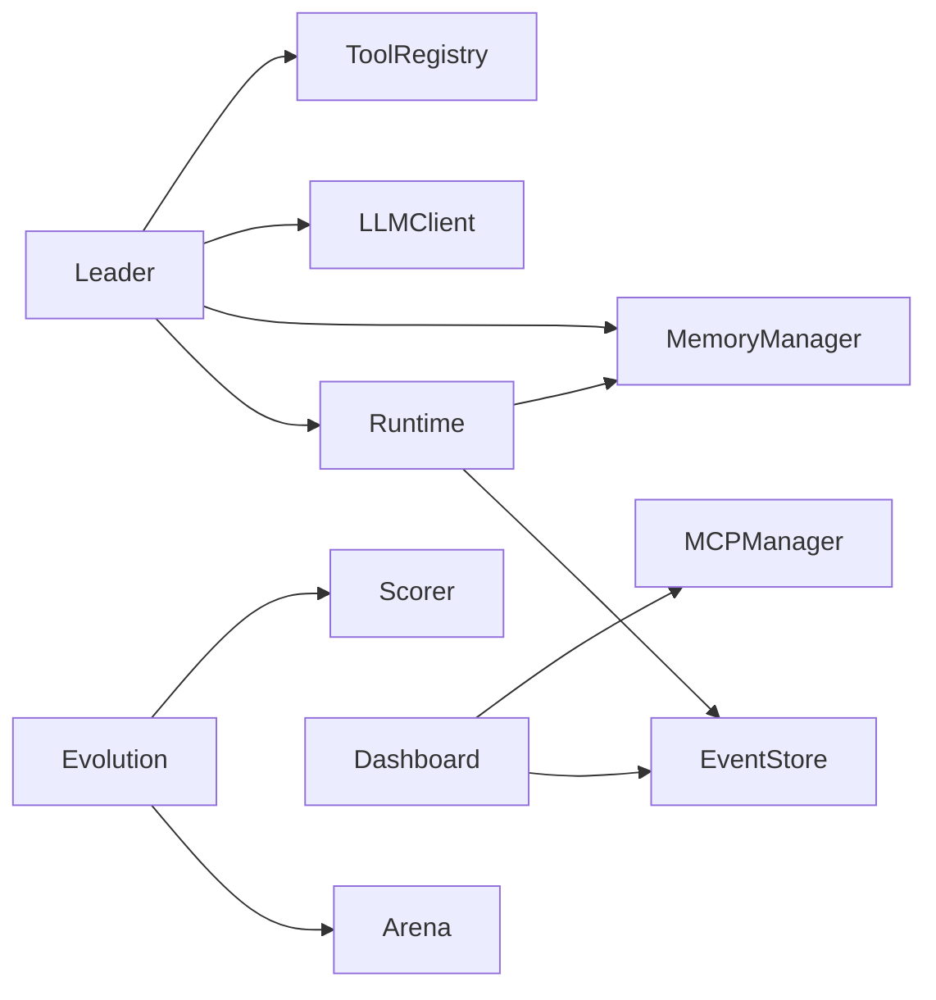

# ares Architecture Deep Dive (XIII): Bootstrap & API Layer — Wiring Without the Pain

There's a moment in every framework's life when the user's first question shifts from "how do I call an LLM?" to "how do I wire all this together?" That's the moment you need a bootstrap.

In the early days, starting ares meant creating 15 objects by hand, passing them to each other in the right order, and praying you didn't miss a dependency. It looked like this:

```go
eventStore := events.NewMemoryEventStore()
memMgr, _ := memory.NewMemoryManager(memory.DefaultMemoryConfig())
llmClient, _ := llm.NewClient(llm.Config{...})
leader := leader.New(leader.Config{...}, memMgr, llmClient, ...)
rt := runtime.New(runtime.Config{...}, eventStore, memMgr)
rt.RegisterAgent(leader, func() base.Agent { return leader.New(...) })
rt.Start(ctx)
```

Six lines of wiring before you can do anything. Miss one dependency? Runtime panic at 3am. Change a constructor signature? Fix 20 call sites.

The bootstrap solves this: `ares, _ := bootstrap.New(ctx, bootstrap.DefaultConfig())`. One line. All dependencies wired. All modules connected.

---

## The Problem: Dependency Hell

Every module in ares depends on other modules:



Wire it by hand and you're playing Jenga with constructor arguments. Get the order wrong? Circular dependency. Forget a nil check? Panic at runtime.

**Honest reflection**: We considered dependency injection frameworks (Wire, Dig, fx). They solve the wiring problem but add complexity and magic. When something fails at startup, you're staring at a generated file you've never seen, trying to understand why the DI container couldn't resolve `MemoryManager`. I'd rather have explicit code I can read and debug.

---

## The Design: Interfaces First

The API layer has one rule: **no implementations**.

```
api/
├── core/        # Interfaces only: AgentService, Runtime, Evolution, Arena, ...
├── errors/      # Error types
├── client/      # Go SDK (talks to the server)
├── handler/     # HTTP handlers (thin delegation)
├── router/      # Route registration
└── bootstrap/   # Factory — wires internal/ implementations
```

`api/core/` defines what a module *does*, not how it *does it*. The `Runtime` interface says "you can start, stop, register agents, get stats." It doesn't say whether agents are goroutines, threads, or remote processes.

```go
// api/core/runtime.go
type Runtime interface {
    RegisterAgent(agent Agent, factory AgentFactory)
    StartAgent(ctx context.Context, agent Agent) error
    StopAgent(ctx context.Context, agentID string) error
    GetAgent(agentID string) Agent
    Start(ctx context.Context) error
    Stop() error
    Stats() RuntimeStats
}
```

The implementation lives in `internal/ares_runtime/manager.go`. The bootstrap wires them together.

**Honest reflection**: We had 7 service implementations living in `api/service/`. They were full of business logic — in-memory caches, retry loops, error handling. This defeated the purpose of the API layer. In v0.2.4, we moved all implementations to `internal/` and left `api/` as a pure contract. The migration was painful (30+ files moved, 50+ import paths updated) but the result is clean: `api/` is a contract, `internal/` is implementation.

---

## The Bootstrap: One Line to Rule Them All

```go
// api/bootstrap/bootstrap.go
func New(ctx context.Context, cfg *Config) (*ARES, error) {
    eventStore := ares_events.NewMemoryEventStore()
    rt := ares_runtime.New(cfg.Runtime, eventStore, nil)
    memMgr, _ := memory.NewMemoryManager(cfg.Memory)
    evoSvc, _ := evolution.NewService(cfg.Evolution)
    arenaSvc := arena.NewService(cfg.ArenaInjector, eventStore)
    mcpMgr, _ := mcp.NewMCPManager(cfg.MCP, nil)
    dashOrch := dashboard.NewOrchestrator(nil, nil)
    flightRec := flight.NewFlightRecorder(*cfg.Flight)

    return &ARES{
        Runtime:    rt,
        Memory:     memMgr,
        Evolution:  evoSvc,
        Arena:      arenaSvc,
        MCP:        mcpMgr,
        Dashboard:  dashOrch,
        Flight:     flightRec,
        EventStore: eventStore,
    }, nil
}
```

The `ARES` struct is a container — it holds references to all modules. You access them directly:

```go
ares, _ := bootstrap.New(ctx, bootstrap.DefaultConfig())
ares.Start(ctx)
ares.Runtime.Stats()
ares.RunEvolution(ctx, 10)
ares.ExecuteArenaAction(ctx, action)
```

**Honest reflection**: The bootstrap isn't a dependency injection container. It's a factory function with hardcoded wiring. If you need custom dependencies (e.g., a PostgreSQL event store instead of in-memory), you wire it yourself. The bootstrap covers 90% of use cases. The other 10% can call constructors directly.

---

## Module Logging: Who Said That?

Every module in ares has a scoped logger:

```go
// internal/logger/logger.go
func Module(name string) *slog.Logger {
    return slog.Default().With("module", name)
}

// internal/ares_runtime/log.go
var log = logger.Module("runtime")
```

Now every log entry from Runtime carries `module=runtime`. Workflow carries `module=workflow`. Memory carries `module=memory`.

This sounds trivial until 3am when you're staring at logs like:
```
INFO started agents=3
INFO started agents=2
INFO started agents=1
```

Which module started which agents? Without module tags, you don't know. With them:
```
INFO started agents=3 module=runtime
INFO started agents=2 module=workflow
INFO started agents=1 module=memory
```

**Honest reflection**: We considered passing loggers through context. Context-based logging is "more correct" — it propagates through call chains. But in practice, Runtime doesn't call Workflow doesn't call Memory in a neat chain. They're peers. A package-level logger per module is the pragmatic choice. If you need correlation, that's what trace IDs are for.

---

## Event.ModuleName: Who Did What?

The same problem exists in the event system. When you replay an event stream, you see:

```json
{"type": "step.started", "payload": {"step_id": "s1"}}
{"type": "tool.call.completed", "payload": {"tool": "search"}}
```

Which module emitted `step.started`? The workflow engine? The runtime? The plugin bus? The payload doesn't say.

Adding `ModuleName` to the `Event` struct forced a signature change:

```go
// Before: ambiguous source
Emit(ctx, store, streamID, eventType, payload)

// After: explicit source
Emit(ctx, store, streamID, eventType, "runtime", payload)
```

This broke every caller. All 30+ of them. But it was the right call — making the source explicit at the call site means you can't accidentally emit an event without declaring who you are.

---

## The Lesson

The API layer and bootstrap aren't glamorous features. They don't demo well. You can't show a investor a factory function and say "look, it wires dependencies!"

But they're the difference between a framework that's pleasant to use and one that makes you want to throw your laptop out the window. Every minute spent on wiring is a minute not spent on the user's actual problem.

**The best API is the one you don't notice.** You call `bootstrap.New()`, get a working system, and focus on your Agent logic. The wiring is invisible. That's the point.
