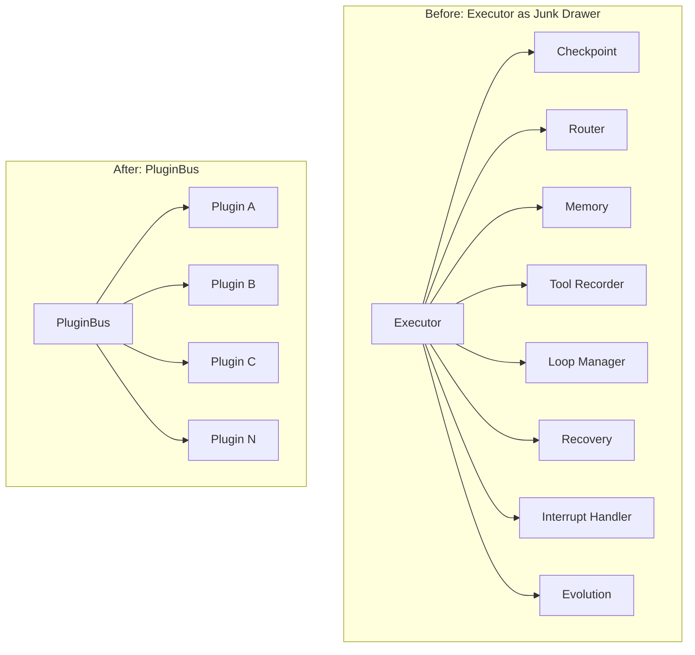
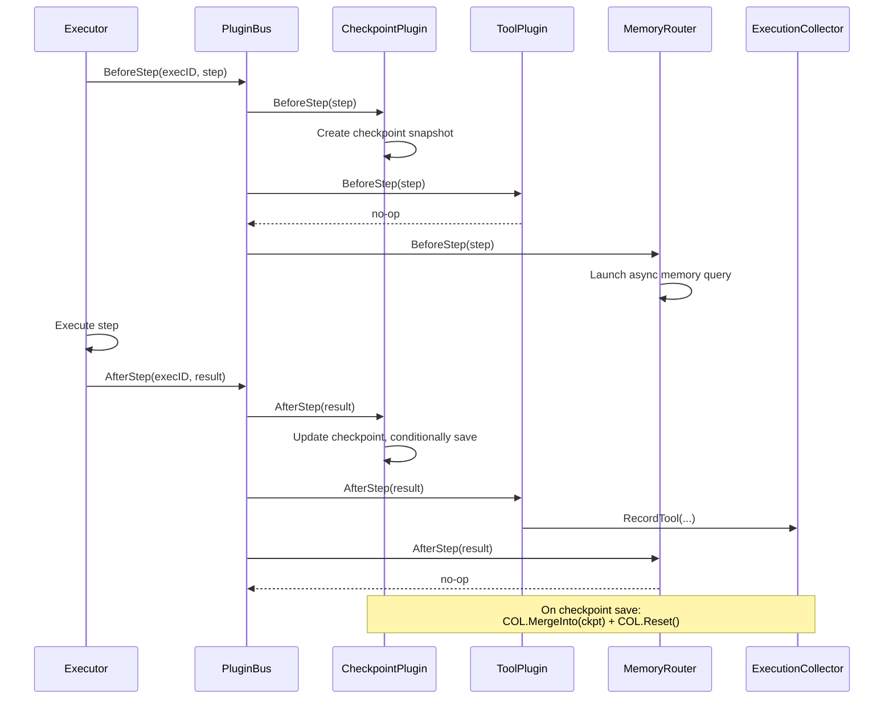

# ares Architecture Deep Dive (XIV): Plugin System — Extending Without Touching

> I had a checkpoint plugin, a memory router, and a tool recorder — all wired directly into the executor. Every time I wanted to add a new behavior, I was editing the same 400-line file, adding another `if` branch, another goroutine, another channel. The executor was becoming a junk drawer.
> That's when I realized: the problem isn't that we need more features. The problem is that every feature lives in the same place. **What if the executor didn't know about any of them?**

---

## 1. The Junk Drawer Problem

Back when ares had maybe three plugins, life was simple. The executor had a `checkpoint` field, a `router` field, and a `memory` field. Each one was called at a specific point in the step lifecycle — save checkpoint before the step, route after the step, query memory somewhere in between. It worked. It was readable. It was fine.

Then I added tool recording. Then interrupt handling. Then loop management. Then recovery policies. Then evolution recommendations. Each addition meant touching the executor struct, the executor's `Start` method, the executor's `Stop` method, and the step execution path. The struct grew to fifteen fields. The `Start` method became a laundry list of nil checks and initialization. The step execution path had hook calls interleaved with core logic.

The worst part? Half these features didn't even know about each other, but they all lived in the same file. The checkpoint plugin needed to flush at loop boundaries — so now the executor knew about both. The memory router needed to find the memory plugin — so the executor was passing references around. The tool recorder needed to write to the same collector as the checkpoint plugin — so the executor was managing a shared data structure that two unrelated features depended on.

I was building a monolith with extension points painted on.



The fix was obvious once I saw it: **stop putting features in the executor. Put them in plugins. Give the executor a bus, and let plugins register themselves.**

---

## 2. The RuntimePlugin Interface

The interface had to be minimal. If it had too many methods, writing a plugin would feel like writing a mini-executor. If it had too few, plugins couldn't do anything useful.

Four methods. That's it.

```go
// internal/ares_runtime/plugin.go
type RuntimePlugin interface {
    Name() string
    Capabilities() []Capability
    Start(ctx context.Context, bus EventBus) error
    Stop(ctx context.Context) error
}
```

`Name()` is the identity. `Capabilities()` is the service tag. `Start` and `Stop` are the lifecycle. The key design decision: `Start` receives the `EventBus` as a parameter. This means plugins don't need a reference to the bus at construction time — they get it when they start. It also means the bus can be swapped out in tests without rebuilding the plugin.

The contract says `Start` MUST be non-blocking. If a plugin needs to run a background goroutine (like the ObserverPlugin draining events), it spawns the goroutine in `Start` and cancels it in `Stop`. The bus enforces this with a timeout — more on that later.

Eight capability constants define the functional areas:

```go
const (
    CapObserver   Capability = "observer"
    CapCheckpoint Capability = "checkpoint"
    CapRouter     Capability = "router"
    CapLoop       Capability = "loop"
    CapMemory     Capability = "memory"
    CapEvolution  Capability = "evolution"
    CapTool       Capability = "tool"
    CapRecovery   Capability = "recovery"
)
```

A plugin can advertise multiple capabilities. The CheckpointPlugin, for example, advertises `CapCheckpoint`. The MemoryRouter advertises `CapRouter`. These aren't just labels — they're the keys for runtime service discovery, as we'll see in the `PluginsByCap` section.

### Extended Interfaces

Some plugins need more than the base four methods. Rather than bloating `RuntimePlugin`, we define optional interfaces that the bus can discover via type assertion:

```go
type MemoryPlugin interface {
    RuntimePlugin
    AdviseRoute(ctx context.Context, state RouteState) ([]RouteAdvice, error)
}

type EvolutionPlugin interface {
    RuntimePlugin
    Recommend(ctx context.Context, state ExecutionState) (*RuntimeRecommendation, error)
    RecordOutcome(ctx context.Context, outcome ExecutionOutcome) error
}

type RecoveryPlugin interface {
    RuntimePlugin
    ShouldRecover(ctx context.Context, failure StepFailure, state ExecutionState) bool
}
```

This is the Interface Segregation Principle in practice. The bus doesn't know about `MemoryPlugin` — only the routers that need memory advice do. The bus doesn't know about `EvolutionPlugin` — only the evolution router and loop plugin do. Each consumer discovers the interface it needs at runtime.

---

## 3. The PluginBus: Registry, Lifecycle, and Event Backbone

The `PluginBus` is the central nervous system. It's simultaneously a plugin registry, a lifecycle manager, a hook dispatcher, and an event bus. One struct, four jobs.

```go
// internal/ares_runtime/bus.go
type PluginBus struct {
    plugins       []RuntimePlugin
    hooks         []namedHook
    caps          map[Capability][]RuntimePlugin
    subscribers   []*subscriber
    mu            sync.RWMutex
    started       bool
    pluginTimeout time.Duration
    logger        *slog.Logger
}
```

Construction uses the functional options pattern:

```go
bus := NewPluginBus(
    WithPluginTimeout(10 * time.Second),
    WithLogger(myLogger),
)
```

### Registration

`Register` does four things in one call:

```go
func (b *PluginBus) Register(plugin RuntimePlugin) error {
    // 1. Reject nil, duplicates, and late registration
    // 2. Append to b.plugins
    // 3. Index under each capability in b.caps
    // 4. Auto-register as WorkflowHook if implemented
    if hook, ok := plugin.(WorkflowHook); ok {
        b.hooks = append(b.hooks, namedHook{pluginName: plugin.Name(), hook: hook})
    }
    return nil
}
```

That fourth step is the magic. A plugin that implements both `RuntimePlugin` and `WorkflowHook` gets registered as both — without the plugin author writing any glue code. The CheckpointPlugin, ToolPlugin, MemoryRouter, LoopPlugin, InterruptPlugin, and ArenaPlugin all benefit from this. One struct, two interfaces, automatic wiring.

### Start and Stop

`Start` iterates plugins in registration order. `Stop` iterates in **reverse** order. This is LIFO teardown — the last plugin to start is the first to stop. If plugin B depends on plugin A (say, a router depending on the bus's event system), B should be registered after A and will be stopped before A.

Every `Start` and `Stop` call goes through `invokeWithTimeout`:

```go
func invokeWithTimeout(ctx context.Context, timeout time.Duration,
    pluginName string, fn func(context.Context) error) (err error) {

    callCtx, cancel := context.WithTimeout(ctx, timeout)
    defer cancel()

    done := make(chan error, 1)
    go func() {
        defer func() {
            if r := recover(); r != nil {
                done <- &PluginError{
                    PluginName: pluginName,
                    Err:        ErrPluginPanic,
                    Recovered:  r,
                }
            }
        }()
        done <- fn(callCtx)
    }()

    select {
    case err = <-done:
        return err
    case <-callCtx.Done():
        return fmt.Errorf("%w: %w", ErrPluginTimeout, callCtx.Err())
    }
}
```

Three layers of protection: panic recovery via `defer recover()`, timeout via `context.WithTimeout` (default 30 seconds), and error propagation via the result channel. If a plugin panics during `Start`, the bus catches it, wraps it in a `PluginError`, and continues with the next plugin. If a plugin hangs forever, the timeout kills it after 30 seconds.

`Start` collects all errors and returns them joined:

```go
return errors.Join(errs...)
```

This means one failing plugin doesn't prevent others from starting. The bus is optimistic — it starts everything it can and reports all failures at once.

### Service Discovery: PluginsByCap

This is how plugins find each other without tight coupling:

```go
func (b *PluginBus) PluginsByCap(cap Capability) []RuntimePlugin {
    b.mu.RLock()
    defer b.mu.RUnlock()
    plugins := b.caps[cap]
    if len(plugins) == 0 {
        return nil
    }
    result := make([]RuntimePlugin, len(plugins))
    copy(result, plugins)
    return result
}
```

The MemoryRouter uses this to find MemoryPlugin instances. The EvolutionRouter uses it to find EvolutionPlugin instances. The LoopPlugin uses it to find CheckpointPlugin, MemoryPlugin, and EvolutionPlugin instances at round boundaries. No direct references, no constructor injection — just "give me everything that can do X."

---

## 4. WorkflowHook: Interceptors with Teeth

The `WorkflowHook` interface is the step-level extension point:

```go
type WorkflowHook interface {
    BeforeStep(ctx context.Context, executionID string, step *Step) error
    AfterStep(ctx context.Context, executionID string, result *StepResult) error
}
```

The bus calls `BeforeStep` before each step and `AfterStep` after each step. But here's the critical contract: **hook failures do not abort step execution.** If a hook panics, times out, or returns an error, the bus logs it and moves on to the next hook. The step still executes.

```go
func (b *PluginBus) BeforeStep(ctx context.Context, executionID string, step *Step) error {
    var errs []error
    for _, nh := range hooks {
        if err := invokeWithTimeout(ctx, b.pluginTimeout,
            nh.pluginName+":beforeStep", func(sctx context.Context) error {
                return nh.hook.BeforeStep(sctx, executionID, step)
            }); err != nil {
            b.logger.Warn("runtime: before step hook failed (continuing)",
                "plugin", nh.pluginName, "error", err)
            errs = append(errs, err)
        }
    }
    return errors.Join(errs...)
}
```

This is a deliberate design choice. A misbehaving hook should not break the workflow. The checkpoint plugin failing to save shouldn't prevent the step from executing. The tool recorder timing out shouldn't hang the pipeline. Log it, aggregate it, keep going.

The `Step` and `StepResult` types are lightweight mirrors of the engine types:

```go
type Step struct {
    ID, Name, AgentType, Output, Error string
    Status    StepStatus
    StartedAt time.Time
}

type StepResult struct {
    StepID, Name, Output, Error string
    Status   StepStatus
    Duration time.Duration
    Metadata map[string]string
}
```

These are defined in the `ares_runtime` package to avoid import cycles with the workflow engine. The engine copies data into these structs before calling the bus, and the bus passes them to hooks. It's a boundary — clean, explicit, and dependency-free.

---

## 5. EventBus: Typed Pub/Sub with Drop Semantics

The `EventBus` interface is how plugins communicate without knowing each other:

```go
type EventBus interface {
    Emit(ctx context.Context, streamID string, eventType ares_events.EventType,
        moduleName string, payload map[string]any)
    Subscribe(ctx context.Context, filter ares_events.EventFilter) (<-chan *ares_events.Event, error)
}
```

The `PluginBus` itself implements `EventBus`. When a plugin calls `Emit`, the bus constructs an `Event` with a UUID, timestamp, and the provided fields, then fans it out to all matching subscribers.

The critical property: **non-blocking emit with drop semantics.**

```go
func (b *PluginBus) Emit(ctx context.Context, streamID string,
    eventType ares_events.EventType, moduleName string, payload map[string]any) {

    evt := &ares_events.Event{...}

    for _, s := range subs {
        if !matchFilter(evt, s.filter) {
            continue
        }
        func() {
            defer func() { _ = recover() }()
            select {
            case s.ch <- evt:
            case <-ctx.Done():
                return
            default:
                // Drop event if buffer full.
            }
        }()
    }
}
```

Three protections in one: the `select` with `default` drops events when the subscriber's 64-element buffer is full. The `defer recover()` catches send-on-closed-channel when a subscriber's cleanup goroutine races with the emit. The `ctx.Done()` check prevents blocking on cancelled contexts.

This means a slow plugin cannot backpressure the entire event pipeline. If the ObserverPlugin's store is slow and its buffer fills up, events are dropped — not queued, not blocked. The alternative (unbounded buffering) would cause memory leaks. The alternative (backpressure) would cause cascading slowdowns. Drop is the least bad option.

Subscribe returns a channel that automatically closes when the context is cancelled:

```go
func (b *PluginBus) Subscribe(ctx context.Context,
    filter ares_events.EventFilter) (<-chan *ares_events.Event, error) {

    ch := make(chan *ares_events.Event, 64)
    sub := &subscriber{ch: ch, filter: filter}
    b.subscribers = append(b.subscribers, sub)

    go func() {
        <-ctx.Done()
        // Remove subscriber and close channel
    }()

    return ch, nil
}
```

The filter matches on `Types` and `StreamIDs`. Empty filter fields mean "match all." Non-empty fields mean "match any of these." The ObserverPlugin subscribes to seven event types (workflow started/completed/failed, step started/completed/failed, checkpoint.saved). The ArenaPlugin subscribes to fault events. Each plugin sees exactly what it needs.

---

## 6. The Built-in Plugins

### ObserverPlugin

The simplest plugin. It subscribes to lifecycle events and persists them to an `EventStore`. In `Start`, it derives an independent context from `context.Background()` (so it survives the `Start` call's timeout), spawns a goroutine that drains the channel, and calls `store.Append` for each event. In `Stop`, it cancels the context, which removes the subscription and exits the goroutine.

No hooks, no capabilities beyond `CapObserver`. Pure event sink.

### CheckpointPlugin

The heavyweight. It implements `RuntimePlugin`, `WorkflowHook`, and `Flusher`. Before each step, it creates or updates an `ExperienceCheckpoint` snapshot. After each step, it records the result. It supports batched writes via `WithFlushInterval(n)` — save every N hook calls instead of every call.

The `ExperienceCheckpoint` is a rich struct:

```go
type ExperienceCheckpoint struct {
    SchemaVersion    int
    ExecutionID      string
    WorkflowID       string
    StateVersion     int64
    StepStates       []StepStateSnapshot
    Variables        map[string]interface{}
    DAGNodes         []string
    DAGEdges         []DAGEdge
    RouteHistory     []RouteEntry
    ToolHistory      []ToolEntry
    MemoryHits       []MemoryEntry
    InterruptHistory []InterruptEntry
    ErrorHistory     []ErrorEntry
    ScoringSignals   []ScoringSignal
    // ... more fields
}
```

Six history arrays, DAG topology, variables, scoring signals — everything needed to reconstruct an execution or feed the evolution system. The checkpoint is the plugin system's collective memory.

### ToolPlugin

Records tool invocations via the `ExecutionCollector`. In `AfterStep`, it inspects `result.Metadata["tool_name"]` for tool invocation info. If present, it calls `collector.RecordTool(...)`. Also maintains a tool registry with `RegisterTool` and `IsRegistered` for validation.

### MemoryRouter

The most interesting router. It embeds `ExpressionRouter` for rule-based fallback, but adds memory-aware routing with **async pre-fetch**:

```go
func (r *MemoryRouter) BeforeStep(ctx context.Context, _ string, step *Step) error {
    state := RouteState{CurrentStepID: step.ID}
    go func() {
        advice := r.queryMemory(ctx, state)
        r.prefetch.mu.Lock()
        r.prefetch.advice = advice
        r.prefetch.stepID = step.ID
        r.prefetch.mu.Unlock()
    }()
    return nil
}
```

`BeforeStep` launches a background goroutine that queries memory while the step executes. When `Route()` is called after the step completes, the pre-fetched advice is used immediately — zero latency. If the pre-fetch hasn't completed, `Route()` falls through to a synchronous query.

Service discovery happens via type assertion:

```go
pb, ok := r.bus.(*PluginBus)
memPlugins := pb.PluginsByCap(CapMemory)
mp, ok := memPlugins[0].(MemoryPlugin)
advice, err := mp.AdviseRoute(ctx, state)
```

The router casts the `EventBus` to `*PluginBus` to access `PluginsByCap`. This is a deliberate tight coupling to the concrete type — the `EventBus` interface doesn't expose `PluginsByCap`. We'll discuss this tradeoff in the honest reflection section.

### EvolutionRouter

Similar pattern to MemoryRouter, but consults `EvolutionPlugin.Recommend` instead. If the evolution plugin returns a recommendation with confidence >= 0.3 and a `PreferredAgent`, and an `AgentStepResolver` is configured, it maps the agent name to a step ID. Falls through to expression rules otherwise.

### FallbackRouter

Chain of Responsibility. Tries multiple `RouterPlugin` instances in order, returns the first non-nil decision. If all return nil, returns a fallback decision with `Source: "fallback"` and empty `NextStepID`, which tells the executor to continue with default DAG traversal.

### LoopPlugin

Manages the evolutionary loop lifecycle. Does NOT drive the loop — the executor does that. Provides `ShouldExecuteRound(nextRound, vars)` for round boundary decisions and `OnRoundEnd(ctx, round, executionID)` for between-round orchestration.

`OnRoundEnd` is where the plugin system's collective intelligence comes together:

1. Find `CapCheckpoint` plugins, call `Flush` on those implementing `Flusher`
2. Find `CapMemory` plugins, call `AdviseRoute`
3. Find `CapEvolution` plugins, call `RecordOutcome`

Three different plugin types, discovered by capability, coordinated at a single boundary point. No direct references between them.

### BasicRecoveryPlugin

Allowlist-based recovery policy. Steps whose IDs are in the allowlist are eligible for recovery. `ShouldRecover` checks the allowlist. `AllowStep` and `RevokeStep` manage it at runtime.

### InterruptPlugin

Observes HITL (Human-In-The-Loop) lifecycle events. In `AfterStep`, it inspects `result.Metadata` for interrupt actions, emits `EventInterruptCreated`, and records via the collector. It doesn't handle interrupts itself — that's the executor's job. It just watches and records.

### ArenaPlugin

Fault injection for chaos engineering. It can inject three fault types into any plugin:

```go
const (
    FaultPluginPanic   FaultType = "plugin_panic"
    FaultPluginTimeout FaultType = "plugin_timeout"
    FaultPluginError   FaultType = "plugin_error"
)
```

`ScheduleFault(pluginName, faultType)` schedules a fault. On the next `BeforeStep` call, it triggers: `panic(...)` for panic faults, `select{}` for timeout faults (the bus's `invokeWithTimeout` catches this), or `return ErrFaultInjected` for error faults.

This is how we test the bus's resilience. The ArenaPlugin deliberately misbehaves, and we verify that the bus catches every failure mode — panics, timeouts, and errors — without crashing.

---

## 7. ExecutionCollector: Thread-Safe Data Aggregation

Multiple plugins generate data during execution — routing decisions, tool invocations, memory hits, interrupt actions, errors. The `ExecutionCollector` aggregates all of it:

```go
type ExecutionCollector struct {
    mu           sync.Mutex
    executionID  string
    routeHistory []RouteRecord
    toolHistory  []ToolRecord
    memoryHits   []MemoryHitRecord
    interruptLog []InterruptRecord
    errorLog     []ErrorRecord
}
```

Every `Record*` method appends under lock. Every getter returns a copy. `Export()` returns a deep copy as a `map[string]any` for serialization.

The critical integration point is `MergeInto`:

```go
func (c *ExecutionCollector) MergeInto(ckpt *ExperienceCheckpoint) {
    c.mu.Lock()
    defer c.mu.Unlock()
    for _, r := range c.routeHistory {
        ckpt.RouteHistory = append(ckpt.RouteHistory, RouteEntry{...})
    }
    for _, t := range c.toolHistory {
        ckpt.ToolHistory = append(ckpt.ToolHistory, ToolEntry{...})
    }
    // ... memory, interrupt, error
}
```

The `CheckpointPlugin.saveLocked` calls `collector.MergeInto(ckpt)` then `collector.Reset()` before each save. This drains collected data into the checkpoint exactly once. No duplicates, no data loss. The collector is the funnel; the checkpoint is the bucket.

---

## 8. Honest Reflection: What We Got Right and What We Didn't

### What works well

**Auto-hook registration** is the single best design decision in the system. A plugin author implements two interfaces, registers once, and both lifecycle and hook behavior are wired automatically. No glue code, no configuration, no ceremony. Six of the ten built-in plugins use this pattern.

**Log-and-continue for hooks** is the right call for a system where plugins are optional enhancements, not critical path components. A failing checkpoint save shouldn't prevent the step from executing. A timing out tool recorder shouldn't hang the pipeline. We log it, we aggregate it, we move on.

**LIFO teardown** prevents the class of bugs where plugin B tries to use plugin A after A has been stopped. Registration order is dependency order, and teardown reverses it.

**The ArenaPlugin** proved its worth in testing. We discovered that the bus's `invokeWithTimeout` correctly handles all three fault types — panics via `recover()`, timeouts via `context.WithTimeout`, and errors via normal return. Without the ArenaPlugin, we'd be testing this manually or not at all.

### What we got wrong

**The `PluginsByCap` type assertion.** Routers cast `bus` to `*PluginBus` to access `PluginsByCap`. This breaks the `EventBus` abstraction. If someone wraps the bus in a decorator or uses a different implementation, routers silently fail to find peer plugins. The alternative — extending `EventBus` with `PluginsByCap` — would bloat the interface for plugins that only need emit/subscribe. We chose the lesser evil, but it's still an evil.

**Hook execution order is implicit.** Hooks execute in registration order. If plugin A needs to run before plugin B's hook, A must be registered first. This coupling is invisible — there's no declaration, no dependency graph, no error if the order is wrong. It works because we control the registration order in the bootstrap code. But if a user registers plugins in the wrong order, they get subtle bugs with no error messages.

**No hook result propagation.** Hooks return errors, but the errors are aggregated and logged — they don't influence step execution. This means a hook can't say "don't execute this step" or "change the step's input." The hook is an observer, not an interceptor. For some use cases (like access control), this is too weak. We'd need a richer return type — maybe a `HookResult` with `Abort bool` and `ModifiedStep *Step`. But that would complicate the simple log-and-continue contract.

**The collector is a shared mutable state bottleneck.** Every plugin that writes to the collector contends on the same mutex. Under high concurrency (many steps, many hooks), this could become a contention point. We haven't measured it yet, but the design smells. A per-plugin collector with a merge step would be better.

---

## 9. The Architecture at a Glance

```mermaid
graph TB
    subgraph "PluginBus"
        REG[Register] --> PLUGINS[plugins[]]
        REG --> CAPS[caps map]
        REG --> HOOKS[hooks[]]
        START[Start] --> |"LIFO order"| STOP[Stop]
        EMIT[Emit] --> SUBS[subscribers[]]
    end

    subgraph "Built-in Plugins"
        OBS[ObserverPlugin<br/>CapObserver]
        CPK[CheckpointPlugin<br/>CapCheckpoint]
        TPL[ToolPlugin<br/>CapTool]
        MRT[MemoryRouter<br/>CapRouter]
        ERT[EvolutionRouter<br/>CapRouter]
        FRT[FallbackRouter<br/>CapRouter]
        LPP[LoopPlugin<br/>CapLoop]
        RCV[BasicRecoveryPlugin<br/>CapRecovery]
        IRP[InterruptPlugin]
        ARN[ArenaPlugin]
    end

    subgraph "Data Flow"
        COL[ExecutionCollector] -->|MergeInto| CKPT[ExperienceCheckpoint]
    end

    PLUGINS --> OBS & CPK & TPL & MRT & ERT & FRT & LPP & RCV & IRP & ARN
    CAPS -->|PluginsByCap| MRT
    CAPS -->|PluginsByCap| ERT
    CAPS -->|PluginsByCap| LPP
    HOOKS -->|BeforeStep/AfterStep| CPK & TPL & MRT & IRP & ARN
    CPK --> COL
    TPL --> COL
    MRT --> COL
```



---

## 10. Design Patterns Summary

| Pattern | Location | Purpose |
|---------|----------|---------|
| Auto-registration | `bus.go:82-84` | Type assertion for WorkflowHook — zero glue code |
| Capability map | `bus.go:271-281` | Runtime service discovery by functional area |
| Non-blocking emit | `bus.go:226-235` | Drop events for slow subscribers, never block |
| Async pre-fetch | `router_memory.go:68-86` | Hide memory latency behind step execution |
| Collector-Checkpoint drain | `collector.go:227-264` | MergeInto + Reset for exactly-once data transfer |
| LIFO teardown | `bus.go:121` | Reverse-order stop prevents dependency violations |
| Log-and-continue | `bus.go:156-175` | Hook failures don't abort step execution |
| Chain of Responsibility | `router_fallback.go` | Try routers in order, first non-nil wins |
| Chaos engineering | `arena.go` | Inject faults to test bus resilience |

---

## 11. Conclusion

The plugin system started as a refactoring exercise — get features out of the executor. It became something more: a framework for composing independent behaviors through a shared bus, discovered by capability, coordinated at lifecycle boundaries.

What surprised me most was how little code the bus itself is. The `PluginBus` is maybe 350 lines. The `invokeWithTimeout` function is 25 lines. The `Emit` implementation is 30 lines. The entire system — bus, hooks, events, collector — is under 1000 lines. But the behaviors it enables — checkpointing, routing, memory, evolution, recovery, fault injection — would be thousands of lines if wired directly into the executor.

The lesson isn't "use plugins." The lesson is: **when a file keeps growing, the problem isn't that you need more code. The problem is that you need more boundaries.** The plugin system is a boundary. The executor doesn't know about checkpoints. The checkpoint plugin doesn't know about the tool recorder. The tool recorder doesn't know about the memory router. They all know about the bus, and the bus knows about nothing.

That's the real win. Not the abstractions, not the interfaces, not the capability map. The win is that adding a new feature means writing a new file, not editing an existing one.

---

**Appendix: Key File Index**

| Component | File Path |
|-----------|-----------|
| RuntimePlugin interface | `internal/ares_runtime/plugin.go` |
| PluginBus | `internal/ares_runtime/bus.go` |
| EventBus implementation | `internal/ares_runtime/bus.go` |
| WorkflowHook interface | `internal/ares_runtime/plugin.go` |
| invokeWithTimeout | `internal/ares_runtime/bus.go` |
| ExecutionCollector | `internal/ares_runtime/collector.go` |
| CheckpointPlugin | `internal/ares_runtime/checkpoint.go` |
| ObserverPlugin | `internal/ares_runtime/observer.go` |
| ToolPlugin | `internal/ares_runtime/tool.go` |
| ExpressionRouter | `internal/ares_runtime/router.go` |
| MemoryRouter | `internal/ares_runtime/router_memory.go` |
| EvolutionRouter | `internal/ares_runtime/router_evolution.go` |
| FallbackRouter | `internal/ares_runtime/router_fallback.go` |
| LoopPlugin | `internal/ares_runtime/loop.go` |
| BasicRecoveryPlugin | `internal/ares_runtime/recovery.go` |
| InterruptPlugin | `internal/ares_runtime/interrupt.go` |
| ArenaPlugin | `internal/ares_runtime/arena.go` |
| Error types | `internal/ares_runtime/errors.go` |
| Event types | `internal/ares_runtime/events.go` |
