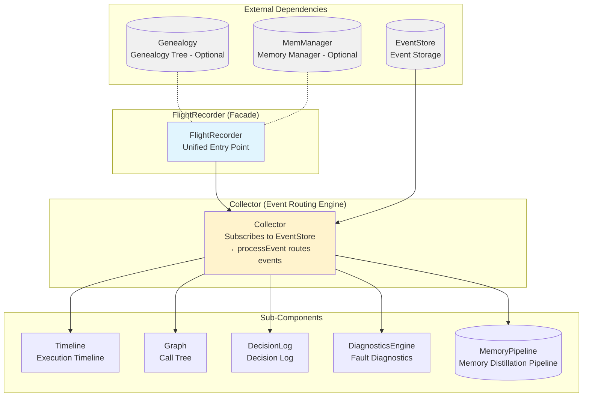
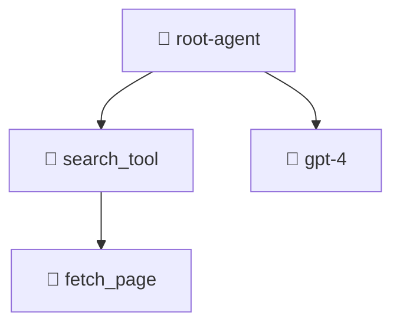
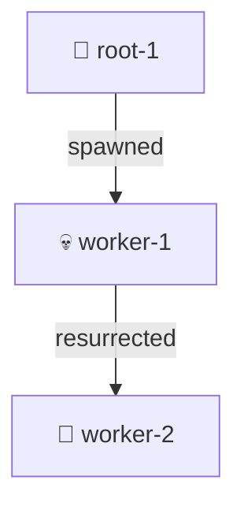

# ares Architecture Deep Dive (XVI): Flight Recorder — Agent Black Box and Execution Trace Replay

> Ever had this happen…
> An Agent mysteriously froze in production. You check the logs — nothing. You check the metrics — normal. You stare at the screen and ask yourself: *"What the hell just happened in those few seconds?"*
> Airplanes have black boxes. Why don't Agents?

***

## 1. An Embarrassing Debug Story

Let me tell you the story that made me decide to build the Flight Recorder.

One day, an Agent in production just… stopped. Not crashed, not OOM'd — just **stopped working**. The process was alive, goroutines weren't dead, but it wasn't doing anything.

First reaction: check the logs.

Logs said: everything's fine.

Second reaction: check the LLM calls.

LLM said: returned a normal result.

Third reaction: check tool calls.

Tools said: all successful.

Fourth reaction: start questioning my life choices.

It took me two days to find the real cause — the Agent parsed the LLM's JSON result wrong, retried five times, all failed, and then the code hit a branch **nobody thought to check**: it silently skipped all remaining steps without an error, without a retry, without any indication of failure. The Agent was *"alive, but dead."*

Those two days taught me three things:

1. **"Everything's fine" in logs usually means you logged the wrong things**
2. **The most dangerous system failure isn't a crash — it's silently doing nothing**
3. **I needed a black box — something that records every detail of an Agent's execution**

That's the origin story of the Flight Recorder.

***

## 2. Global Architecture: What the Black Box Looks Like

The Flight Recorder isn't a single "recorder" — it's an **aggregation facade** that manages six sub-components underneath:



The `FlightRecorder` struct itself has just four fields:

```go
type FlightRecorder struct {
    collector  *Collector              // event routing hub
    eventStore ares_events.EventStore  // read-only ref for external subscribers
    memManager memory.MemoryManager    // optional, for memory distillation
    genealogy  *Genealogy              // optional, agent lineage tree
    mu         sync.RWMutex            // protects started state
    started    bool
}
```

A few design decisions worth noting:

**The Collector is the single write point.** All sub-components (Timeline, Graph, DecisionLog, DiagnosticsEngine, Pipeline) are written by the Collector through its `processEvent` method. This isn't accidental — Fisher calls it the "Single Writer Pattern." I'm less academic about it — I simply didn't want six components independently subscribing to EventStore, spawning six goroutines fighting over the same data. **One goroutine consumes, six data structures are updated.** Clean and simple.

**EventStore has two references**: one in the Collector (for subscription consumption), one in FlightRecorder (exposed to external subscribers). This has a cool consequence — external systems (like the Evolution system's adapter) can subscribe directly to EventStore and process events in parallel with the Collector, without interfering with Flight Recorder's internal state. Two independent subscribers, zero interference.

**Genealogy and MemManager are optional.** `NewFlightRecorder` doesn't require them to be non-nil. This means you can run a lightweight black box with just Timeline + Diagnostics, or a full-blown execution analysis suite with Genealogy + Pipeline. Progressive complexity.

### Start / Stop Lifecycle

```go
func (fr *FlightRecorder) Start(ctx context.Context) error {
    fr.mu.Lock()
    defer fr.mu.Unlock()
    if fr.started { return nil }            // idempotent
    if err := fr.collector.Start(ctx); err != nil { return err }
    fr.started = true
    log.Info("flight recorder started")
    return nil
}

func (fr *FlightRecorder) Stop() {
    fr.mu.Lock()
    defer fr.mu.Unlock()
    if !fr.started { return }               // idempotent
    fr.collector.Stop()
    fr.started = false
    log.Info("flight recorder stopped")
}
```

Both `Start()` and `Stop()` are idempotent — calling them multiple times won't panic. This matters in production because your orchestrator might accidentally call `Start()` twice during an Agent restart. `RWMutex` protects the `started` state: `Start`/`Stop` use write locks (`Lock`), read operations use read locks (`RLock`).

***

## 3. Collector — The Event Routing Engine

The Collector is the engine of the entire Flight Recorder. Its construction is almost laughably simple:

```go
func NewCollector(cfg CollectorConfig) *Collector {
    return &Collector{
        eventStore: cfg.EventStore,
        timeline:   NewTimeline(),
        graph:      NewGraph(),
        decisions:  NewDecisionLog(),
        diag:       NewDiagnosticsEngine(),
        pipelines:  make(map[string]*MemoryPipeline),
    }
}
```

Five fields, five sub-components. All sub-components pre-allocate their slice capacities (`make([]T, 0, N)`) — a common Go optimization to avoid frequent slice reallocation:

| Component | Pre-alloc Size |
|-----------|----------------|
| Timeline | 64 |
| Diagnostics | 32 |
| DecisionLog | 32 |
| MemoryPipeline | 8 |

### Startup: Subscribing to EventStore

```go
func (c *Collector) Start(ctx context.Context) error {
    if c.eventStore == nil { return nil }      // nil-safe
    ctx, c.cancel = context.WithCancel(ctx)
    ch, err := c.eventStore.Subscribe(ctx, ares_events.EventFilter{})
    if err != nil { return err }
    c.wg.Add(1)
    go c.collectLoop(ctx, ch)
    return nil
}
```

**When EventStore is nil, it silently skips startup.** This means Flight Recorder can be created even without an EventStore configured — it won't record any data, but it won't crash either. This is crucial because development and test environments may not have an EventStore set up.

`collectLoop` is a standard select-loop goroutine:

```go
func (c *Collector) collectLoop(ctx context.Context, ch <-chan *ares_events.Event) {
    defer c.wg.Done()
    for {
        select {
        case <-ctx.Done():
            return
        case evt, ok := <-ch:
            if !ok { return }
            c.processEvent(evt)
        }
    }
}
```

### processEvent — The Master Router

This is the single most important method in the entire Flight Recorder. If you only read one piece of code to understand how the black box works, read this:

```go
func (c *Collector) processEvent(evt *ares_events.Event) {
    if evt == nil { return }

    switch evt.Type {
    case ares_events.EventAgentStarted:
        c.handleAgentStart(evt)
    case ares_events.EventAgentStopped:
        c.handleAgentEnd(evt)
    case ares_events.EventTaskCreated, ares_events.EventTaskDispatched:
        c.handleTaskStart(evt)
    case ares_events.EventTaskCompleted, ares_events.EventTaskFailed:
        c.handleTaskEnd(evt)
    case ares_events.EventFailoverTriggered, ares_events.EventFailoverCompleted:
        c.handleFailover(evt)
    case ares_events.EventMemoryDistilled:
        c.handleMemoryDistilled(evt)
    case ares_events.EventLLMCall:
        c.handleLLMCall(evt)
    }

    if isToolEvent(evt) {
        c.handleToolEvent(evt)
    }
    if isDecisionEvent(evt) {
        c.handleDecisionEvent(evt)
    }
}
```

Note one crucial detail: **the switch and the ifs are NOT mutually exclusive.** An event could be both an `EventLLMCall` (handled by the switch) and match `isToolEvent`'s prefix condition — if EventStore registered some weird event type like `tool.llm.call`. This isn't a bug, it's by design. This lets a single event update both the Timeline and the Graph simultaneously.

The prefix matching logic is worth a look too:

```go
func isToolEvent(evt *ares_events.Event) bool {
    s := string(evt.Type)
    return len(s) > 5 && s[:5] == "tool."
}

func isDecisionEvent(evt *ares_events.Event) bool {
    s := string(evt.Type)
    return len(s) > 9 && s[:9] == "decision."
}
```

Using `s[:5]` instead of `strings.HasPrefix` — not because I'm a performance maniac, but because `HasPrefix` internally does extra string header processing. It's a micro-optimization that adds up on high-frequency event processing paths. The bounds check (`len(s) > 5`) before the slice is the important part — learned that one the hard way.

### What Each Handler Does

| Handler | Timeline | Graph | Diagnostics | Pipeline | DecisionLog |
|---------|----------|-------|-------------|----------|-------------|
| handleAgentStart | EventAgentStart | NodeAgent + StatusRunning | - | - | - |
| handleAgentEnd | EventAgentEnd | NodeAgent → StatusCompleted | - | - | - |
| handleTaskStart | EventWaiting | - | - | - | - |
| handleTaskEnd (success) | EventAgentEnd | - | - | - | - |
| handleTaskEnd (failure) | EventError | - | Auto-diagnose + SuggestFix | - | - |
| handleFailover | EventError | - | - | - | - |
| handleMemoryDistilled | EventMemoryOp | - | - | AddStage | - |
| handleLLMCall | EventLLMCall | NodeLLM | - | - | - |
| handleToolEvent | EventToolCall | NodeTool | - | - | - |
| handleDecisionEvent | - | - | - | - | Add |

When `handleTaskEnd` processes a failure, it automatically calls `SuggestFix(ClassifyError(errMsg))` and stores the diagnosis in a `DiagnosticRecord`. In other words: **every Agent failure automatically generates a "root cause + fix suggestion" record** — no extra code, no manual logging, the Collector does it for you.

The `handleMemoryDistilled` handler extracts `input_count` and `output_count` from the event payload and stores them in the appropriate session's Pipeline. Notice it uses `float64` for the type assertion — this isn't a bug, it's the reality of JSON serialization: `json.Unmarshal` parses all numbers as `float64`, regardless of whether you defined them as `int` or `int64` in Go.

```go
if v, ok := evt.Payload["input_count"].(float64); ok {
    inputCount = int(v)
}
```

I hesitated for about thirty seconds before writing this — should I add a `math.Round`? I figured `input_count` is inherently an integer, and `float64` → `int` precision loss simply can't happen within the integer range. But if someone passes `3.14` inputs… well, that's not the Collector's problem.

***

## 4. Timeline — Every Second Is Recorded

The Timeline is the most straightforward component of the Flight Recorder — it's just a chronologically ordered list of events. But it's also one of the most useful. When something goes wrong with your Agent, the Timeline is the first thing you open.

### Ten Event Types

```go
const (
    EventAgentStart EventType = "agent.start"
    EventAgentEnd   EventType = "agent.end"
    EventToolCall   EventType = "tool.call"
    EventToolResult EventType = "tool.result"
    EventLLMCall    EventType = "llm.call"
    EventLLMResult  EventType = "llm.result"
    EventWaiting    EventType = "waiting"
    EventError      EventType = "error"
    EventMemoryOp   EventType = "memory.op"
    EventDecision   EventType = "decision"
)
```

Each event record contains these fields:

```go
type TimelineEvent struct {
    ID       string            `json:"id"`
    ParentID string            `json:"parent_id,omitempty"`
    AgentID  string            `json:"agent_id"`
    Type     EventType         `json:"type"`
    Name     string            `json:"name"`
    StartAt  time.Time         `json:"start_at"`
    EndAt    time.Time         `json:"end_at,omitempty"`
    Duration time.Duration     `json:"duration"`
    Metadata map[string]any    `json:"metadata,omitempty"`
}
```

`Metadata map[string]any` is the escape hatch — any piece of information you don't know where else to put, shove it in here. The FlightBridge (more on that later) stuffs `source="arena"`, `action_type`, `success`, and other fields into Metadata.

### TimelineSummary — Where Did All the Time Go?

```go
func (t *Timeline) Summary() TimelineSummary {
    // ...
    for _, e := range t.events {
        summary.ToolDuration += typeDuration(e, EventToolCall, EventToolResult)
        summary.LLMDuration += typeDuration(e, EventLLMCall, EventLLMResult)
        summary.WaitDuration += typeDuration(e, EventWaiting)
        summary.ErrorDuration += typeDuration(e, EventError)
    }
    // ...
}
```

`typeDuration` is a helper:

```go
func typeDuration(e TimelineEvent, types ...EventType) time.Duration {
    for _, tp := range types {
        if e.Type == tp { return e.Duration }
    }
    return 0
}
```

This function only makes sense for events with a set `EndAt` — the `Duration` field is populated by the Collector when constructing the `TimelineEvent`. **Start-only events (like agent.start, task.start) have Duration = 0 and don't affect the statistics.** It's a subtle design detail you'd only notice by reading the source.

The way total duration is calculated is also interesting — not a simple sum of all Durations, but the time axis range: `max(EndAt) - min(StartAt)`:

```go
if len(t.events) > 0 {
    minStart := t.events[0].StartAt
    var maxEnd time.Time
    for _, e := range t.events {
        if e.StartAt.Before(minStart) { minStart = e.StartAt }
        if !e.EndAt.IsZero() && (maxEnd.IsZero() || e.EndAt.After(maxEnd)) {
            maxEnd = e.EndAt
        }
    }
    if !maxEnd.IsZero() && maxEnd.After(minStart) {
        summary.TotalDuration = maxEnd.Sub(minStart)
    }
}
```

The advantage: **gaps between events (idle/wait time) are counted**. If an LLM call took 3 seconds, a tool call took 2 seconds, but the Agent idled for 5 seconds in between — summing individual Durations gives you 5 seconds, while `maxEnd - minStart` gives you 10 seconds. That 5-second gap is exactly the kind of wait/block time you need to investigate.

### RWMutex + Defensive Copying

All read methods on Timeline return **copies** of the internal slice, not the slice itself:

```go
func (t *Timeline) Events() []TimelineEvent {
    t.mu.RLock()
    defer t.mu.RUnlock()
    result := make([]TimelineEvent, len(t.events))
    copy(result, t.events)
    return result
}
```

This is a deliberate but costly design choice. Defensive copying means every read is O(n) memory allocation and data copy. For the Dashboard API — which copies the entire Timeline on every HTTP request — this becomes a visible performance bottleneck when events pile up.

Fisher's take: "When you can solve a problem with money, don't solve it with complexity. Defensive copy first, profile for bottlenecks later."

Easy for him to say. If you have 100K Timeline events and each API request copies 100K of them… yeah, that needs optimizing. The question is — do you actually record 100K events in a single Agent execution? If your answer is "maybe," then you need to think about: **what should be recorded, and what shouldn't.** More on this in the Honest Talk section.

***

## 5. Diagnostics — Automatic Fault Diagnosis

The DiagnosticsEngine is the most ambitious component of the Flight Recorder — it wants to automatically tell you "what went wrong" instead of making you dig through hundreds of log lines guessing.

```go
type DiagnosticsEngine struct {
    records []DiagnosticRecord
    mu      sync.RWMutex
}
```

### Eight Fault Categories

```go
const (
    DiagToolTimeout      DiagnosticCategory = "tool_timeout"
    DiagLLMError         DiagnosticCategory = "llm_error"
    DiagParseError       DiagnosticCategory = "parse_error"
    DiagMemoryError      DiagnosticCategory = "memory_error"
    DiagNetworkError     DiagnosticCategory = "network_error"
    DiagConfigError      DiagnosticCategory = "config_error"
    DiagConcurrencyError DiagnosticCategory = "concurrency_error"
    DiagUnknown          DiagnosticCategory = "unknown"
)
```

### ClassifyError — The Elegance and Crudeness of String Matching

```go
func ClassifyError(errMsg string) DiagnosticCategory {
    switch {
    case contains(errMsg, "timeout") || contains(errMsg, "deadline exceeded"):
        return DiagToolTimeout
    case contains(errMsg, "llm") || contains(errMsg, "openai") || contains(errMsg, "ollama") || contains(errMsg, "generate"):
        return DiagLLMError
    case contains(errMsg, "parse") || contains(errMsg, "unmarshal") || contains(errMsg, "json"):
        return DiagParseError
    case contains(errMsg, "memory") || contains(errMsg, "session") || contains(errMsg, "distill"):
        return DiagMemoryError
    case contains(errMsg, "connection") || contains(errMsg, "network") || contains(errMsg, "dial"):
        return DiagNetworkError
    case contains(errMsg, "config") || contains(errMsg, "yaml") || contains(errMsg, "env"):
        return DiagConfigError
    default:
        return DiagUnknown
    }
}

func contains(s, substr string) bool {
    return strings.Contains(strings.ToLower(s), strings.ToLower(substr))
}
```

I'll be honest: this code makes me cringe a little. **It's a glorified grep.** It has no semantic understanding of errors whatsoever — "dial" appearing in "dial tone" gets classified as NetworkError, but "yaml: dial tone" gets ConfigError (because "yaml" matches first). Wait — the switch matches in order, so "yaml" comes before "dial" — ConfigError it is. See? Even I can't keep track of the matching order.

That's the fatal flaw of this design: **keyword order is everything.** If you move `contains(errMsg, "json")` before `contains(errMsg, "timeout")`, then "json: timeout reading body" suddenly goes from ToolTimeout to ParseError — classification entirely determined by case ordering, with zero relation to the actual error semantics.

But I kept this implementation for three reasons:

1. **It's so simple it can't be wrong.** No ML model, no embeddings, no classifier thresholds — just a switch and a few keywords.
2. **It covers 80% of common errors.** In ares's real-world operation, most error messages contain these keywords.
3. **There's an escape hatch.** `DiagUnknown` catches everything else, and `SuggestFix` provides generic advice.

When your requirement is "rough classification is good enough," string matching is the most pragmatic solution. Don't bring in a classifier for "elegance" — you'll likely end up with something that's neither accurate nor fast.

### SuggestFix — Remediation Suggestions

```go
func SuggestFix(cat DiagnosticCategory) []string {
    switch cat {
    case DiagToolTimeout:
        return []string{
            "Increase tool timeout in config",
            "Add retry with exponential backoff",
            "Check if the tool server is responsive",
        }
    case DiagLLMError:
        return []string{
            "Check LLM provider status (Ollama/OpenAI)",
            "Verify API key and base URL",
            "Try a different model",
            "Reduce input token count",
        }
    // ... 3-4 suggestions per category
    }
}
```

These suggestions are in plain English — human-readable sentences intended for your operations colleagues. They're not "system instructions" for an Agent; they're "advice for the human on call." The `FlightToExperienceAdapter` uses them to generate Experience entries (Score inversely proportional to severity), but that's a story for another day (covered in the Evolution deep-dive article).

### AutoDiagnose — One-Click Diagnosis

```go
func AutoDiagnose(agentID, taskID string, err error, duration time.Duration) DiagnosticRecord {
    errMsg := ""
    if err != nil { errMsg = err.Error() }
    cat := ClassifyError(errMsg)
    suggestions := SuggestFix(cat)
    suggestion := ""
    if len(suggestions) > 0 { suggestion = suggestions[0] }
    return DiagnosticRecord{
        ID:         fmt.Sprintf("diag-%d", time.Now().UnixNano()),
        AgentID:    agentID,
        TaskID:     taskID,
        Category:   cat,
        RootCause:  errMsg,
        Suggestion: suggestion,
        Timestamp:  time.Now(),
        Duration:   duration,
    }
}
```

IDs are generated with `time.Now().UnixNano()`. Not a UUID, not a Snowflake ID — just a timestamp with a "diag-" prefix. The upside: naturally ordered, sortable by time. The downside: collision is theoretically possible under high concurrency — while two goroutines calling `time.Now().UnixNano()` in the same nanosecond is unlikely, the probability isn't zero.

If you have 100 Agents diagnosing simultaneously, the collision probability is… well, it hasn't happened in production yet. We'll deal with it when it does.

***

## 6. DecisionLog — Traceable Choices

An Agent is fundamentally a decision loop: observe → decide → act → observe → decide → act… Every action an Agent takes is the product of some decision. The DecisionLog records this decision-making process.

### Five Decision Types

```go
const (
    DecisionToolSelect      DecisionType = "tool_selection"
    DecisionModelSelect     DecisionType = "model_selection"
    DecisionMemoryRetrieval DecisionType = "memory_retrieval"
    DecisionRetry           DecisionType = "retry"
    DecisionRouting         DecisionType = "routing"
)
```

Each decision contains:

```go
type Decision struct {
    ID         string         `json:"id"`
    AgentID    string         `json:"agent_id"`
    Type       DecisionType   `json:"type"`
    Candidates []string       `json:"candidates"`   // candidate list
    Selected   string         `json:"selected"`     // final choice
    Reason     string         `json:"reason"`       // why this choice
    Confidence float64        `json:"confidence"`   // confidence [0, 1]
    Timestamp  time.Time      `json:"timestamp"`
    Metadata   map[string]any `json:"metadata,omitempty"`
}
```

The combination of `Candidates` + `Selected` + `Reason` + `Confidence` answers one critical question: **Why did the Agent make this choice?**

This is invaluable during debugging. When you find your Agent picked the wrong tool, you open the DecisionLog:

```
Agent "worker-3" at 14:32:15 selected tool "delete_database"
Candidates: [query_database, analyze_data, delete_database, backup_data]
Confidence: 0.92
Reason: "User requested deletion of all data, delete_database best matches"
```

Ah, the user asked for it. Fair enough. But if the reason was "delete_database scored highest because it has the shortest name" — then you've got an LLM prompt problem on your hands.

### handleDecisionEvent — From EventStore to Decision

```go
func (c *Collector) handleDecisionEvent(evt *ares_events.Event) {
    d := Decision{
        ID:        evt.ID,
        AgentID:   evt.StreamID,
        Type:      DecisionToolSelect,
        Timestamp: evt.Timestamp,
        Metadata:  evt.Payload,
    }
    if reason, ok := evt.Payload["reason"].(string); ok {
        d.Reason = reason
    }
    if selected, ok := evt.Payload["selected"].(string); ok {
        d.Selected = selected
    }
    if confidence, ok := evt.Payload["confidence"].(float64); ok {
        d.Confidence = confidence
    }
    c.decisions.Add(d)
}
```

Note: **Type is hardcoded to `DecisionToolSelect`.** The event type `decision.xxx` only determines "this is a decision event," not which sub-type of decision it is. The `reason` / `selected` / `confidence` fields are extracted on a "best-effort" basis — if the event publisher didn't provide them, they remain zero values.

This means the data quality of DecisionLog **depends entirely on the event publisher**. If some Agent publishes decision events with an empty payload, that decision record is essentially meaningless — you know a decision was made, but not about what, why, or with what confidence. It's like knowing someone made a phone call, but not who they called, what they said, or how long the call lasted.


***

## 7. Replay — Return to the Scene of the Crime

If the Timeline is watching a recording, Replay is **frame-by-frame playback**.

```go
type ReplaySession struct {
    taskID      string
    ares_events []*ares_events.Event
    currentIdx  int
}

func NewReplaySession(ctx context.Context, eventStore ares_events.EventStore, taskID string) (*ReplaySession, error) {
    evts, err := eventStore.Read(ctx, taskID, ares_events.ReadOptions{
        Direction: ares_events.ReadAscending,
        Limit:     10000,
    })
    if len(evts) == 0 {
        return nil, fmt.Errorf("no ares_events found for task %s", taskID)
    }
    return &ReplaySession{
        taskID:      taskID,
        ares_events: evts,
        currentIdx:  -1,  // ★ initialized to -1
    }, nil
}
```

`currentIdx` starts at -1, and `Step()` increments first, then reads:

```go
func (s *ReplaySession) Step() (*ReplayStep, error) {
    if s.currentIdx >= len(s.ares_events)-1 {
        return nil, fmt.Errorf("no more steps")
    }
    s.currentIdx++
    return s.currentStep(), nil
}
```

The -1 initialization is interesting. If you call `Current()` immediately after creating a ReplaySession, you get nil (because `currentIdx = -1`, so `currentStep()` does nothing). You must call `Step()` first to see the first event. This matches the semantics of file reading and database cursors — creation doesn't return data, `Step()` returns the first record.

But what if you call `StepTo(0)`? That jumps directly to index 0, skipping `Step()`'s increment. So `StepTo(0)` and the first call to `Step()` both return index 0. There's a minor inconsistency in the API — but honestly, nobody mixes `Step()` and `StepTo()` in a single ReplaySession in practice.

### Replay Limitations

```go
Limit: 10000,
```

A single replay session is capped at 10,000 events. This isn't an arbitrary number — an Agent executing a moderately complex task generates anywhere from a few hundred to a few thousand events. 10,000 is the ceiling; exceeding it means either the task is too complex (and should be split), or someone wrote an infinite loop making your Agent call the same tool repeatedly.

If a task genuinely exceeds 10,000 events, the behavior is: `Read()` doesn't error — it just returns the first 10,000 events, silently truncating the rest. When you replay, you're not seeing the complete picture — you might think you've replayed the entire task, but the last 2,000 operations were silently eaten. This is a limitation inherited from the EventStore layer, and the Flight Recorder unfortunately has to live with it.

***

## 8. Graph & Genealogy — Call Tree and Resurrection

The Timeline is a time-dimensional record. The Graph is a structural record. If the Timeline is a video recording, the Graph is a **relationship map** — who called whom, which tasks are nested within which, how deep the call chain goes.

### 8.1 Graph — It's a Tree 🌲 Not a Graph

```go
type Graph struct {
    root   *GraphNode
    nodes  map[string]*GraphNode
    mu     sync.RWMutex
}

type GraphNode struct {
    ID        string            `json:"id"`
    Name      string            `json:"name"`
    Type      NodeType          `json:"type"`
    Status    NodeStatus        `json:"status"`
    ParentID  string            `json:"parent_id,omitempty"`
    Children  []*GraphNode      `json:"children"`
    Metadata  map[string]any    `json:"metadata,omitempty"`
    StartAt   time.Time         `json:"start_at"`
    EndAt     time.Time         `json:"end_at,omitempty"`
}
```

Three node types:

```go
const (
    NodeAgent NodeType = "agent"
    NodeTool  NodeType = "tool"
    NodeLLM   NodeType = "llm"
)
```

Three node statuses:

```go
const (
    StatusRunning    NodeStatus = "running"      // ⏳ running
    StatusCompleted  NodeStatus = "completed"    // ✅ completed
    StatusFailed     NodeStatus = "failed"       // ❌ failed
)
```

What's interesting: **it's called Graph, but the structure is a Tree.** `Children []*GraphNode` means each node can have multiple children but only one parent (referenced via `ParentID`). This isn't a graph — a graph allows arbitrary connections, cross-edges, cycles, and many-to-many relationships. Trees have no cycles, and parent-child relationships are strictly hierarchical.

Why a tree and not a graph? Because Agent execution is inherently tree-shaped: an Agent spawns sub-Agents, calls tools, invokes LLMs — these operations naturally form nested parent-child relationships. You'd rarely encounter a situation where Agent A calls Agent B, and Agent B concurrently calls Agent A back in a cycle. If you do, you might need to fix your architecture before you worry about recording it.

### Three Export Formats

The Graph supports three serialization formats:

```go
func (g *Graph) ExportMermaid() (string, error)   // Mermaid flow chart
func (g *Graph) ExportDOT() (string, error)       // Graphviz DOT format
func (g *Graph) ExportJSON() ([]byte, error)      // JSON
```

Mermaid output uses indentation for hierarchy — Agent nodes get a `(🤖)` prefix, Tool nodes get `(🔧)`, LLM nodes get `(🧠)`. The exported mermaid can be dropped straight into any Markdown renderer:



DOT format is more detailed — nodes are color-coded by status: running (blue `#e3f2fd`), completed (green `#c8e6c9`), failed (red `#ffcdd2`). Render with Graphviz for a publishable SVG diagram.

JSON format is the most complete — it preserves all fields and is designed for programmatic consumption. The Dashboard's `/flight/graph` endpoint returns exactly this.

### 8.2 Genealogy — Resurrection 🌱

If the Graph is "the current call chain," the Genealogy is "the historical lineage." It records the **family tree** of Agents — child Agents inherit configuration and experience from parents, and even Agents that "died" are tracked through resurrection events.

```go
type Genealogy struct {
    roots []*LineageNode
    nodes map[string]*LineageNode
    mu    sync.RWMutex
}

type LineageNode struct {
    ID        string            `json:"id"`
    Type      string            `json:"type"`
    ParentID  string            `json:"parent_id,omitempty"`
    Children  []*LineageNode    `json:"children,omitempty"`
    Relation  AgentRelation     `json:"relation"`       // spawned / resurrected / promoted
    IsAlive   bool              `json:"is_alive"`
    SpawnedAt time.Time         `json:"spawned_at"`
    DiedAt    time.Time         `json:"died_at,omitempty"`
    Metadata  map[string]any    `json:"metadata,omitempty"`
}
```

The three possible relations:

```go
const (
    RelationSpawned     AgentRelation = "spawned"
    RelationResurrected AgentRelation = "resurrected"
    RelationPromoted    AgentRelation = "promoted"
)
```

The Genealogy's most compelling feature is **RecordResurrection** — when a crashed Agent is respawned by the Leader, Genealogy doesn't just record "a new Agent was born." It records that "**the old Agent has been resurrected**":

```go
func (g *Genealogy) RecordResurrection(oldID, newID string) {
    g.mu.Lock()
    defer g.mu.Unlock()
    oldNode, ok := g.nodes[oldID]
    if !ok { return }
    newNode := &LineageNode{
        ID:        newID,
        Type:      oldNode.Type,
        ParentID:  oldNode.ParentID,
        Children:  oldNode.Children,       // transfer children
        Relation:  RelationResurrected,
        IsAlive:   true,
        SpawnedAt: time.Now(),
        Metadata:  oldNode.Metadata,
    }
    oldNode.Children = nil                 // old node no longer has children
    oldNode.IsAlive = false
    oldNode.DiedAt = time.Now()
    g.nodes[newID] = newNode
    // update parent's children list
    if parent, ok := g.nodes[oldNode.ParentID]; ok {
        for i, c := range parent.Children {
            if c.ID == oldID {
                parent.Children[i] = newNode
                break
            }
        }
    }
}
```

Notice the semantics: **resurrection doesn't create a new Agent — it inherits the old Agent's Type, ParentID, and children.** The old node is marked dead, the new node is marked alive, and the parent's children list is updated to point to the new node. This "inheritance" logic preserves the connectivity of the family tree — you never lose an Agent's position in the lineage just because it crashed and restarted.

A separate method, `RecordPromotion(agentID)`, handles the case where a Sub-Agent is promoted to a leadership role — it marks the node with `RelationPromoted` without creating a new ID.

`ExportMermaid` uses emoji to distinguish states:

```go
func (g *Genealogy) ExportMermaid() string {
    var sb strings.Builder
    sb.WriteString("graph TB\n")
    for id, node := range g.nodes {
        status := "🤖"  // alive
        if !node.IsAlive { status = "💀" }
        if node.Relation == RelationPromoted { status = "👑" }
        sb.WriteString(fmt.Sprintf("    %s[%s %s]\n", id, status, node.ID))
    }
    for _, node := range g.nodes {
        if node.ParentID != "" {
            sb.WriteString(fmt.Sprintf("    %s -->|%s| %s\n", node.ParentID, node.Relation, node.ID))
        }
    }
    return sb.String()
}
```

The output looks something like:



A worker crashed, the Leader resurrected it — **the family tree captures it all, with births and deaths, inheritance and karma.**

### 8.3 GenealogyCollector — Why Separate Subscriber?

Genealogy has its own Collector — `GenealogyCollector` — which is **not** fed through the unified Collector described in section 3. It independently subscribes to EventStore at the bootstrap level:

```go
type GenealogyCollector struct {
    genealogy  *Genealogy
    eventStore ares_events.EventStore
    cancel     context.CancelFunc
    wg         sync.WaitGroup
}

func (c *GenealogyCollector) Start(ctx context.Context) error {
    if c.eventStore == nil { return nil }
    ctx, c.cancel = context.WithCancel(ctx)
    ch, err := c.eventStore.Subscribe(ctx, ares_events.EventFilter{})
    if err != nil { return err }
    c.wg.Add(1)
    go c.collectLoop(ctx, ch)
    return nil
}

func (c *GenealogyCollector) processEvent(evt *ares_events.Event) {
    if evt == nil { return }
    switch evt.Type {
    case ares_events.EventAgentStarted:
        c.handleAgentStarted(evt)
    case ares_events.EventAgentStopped:
        c.handleAgentStopped(evt)
    case ares_events.EventFailoverTriggered:
        c.handleFailoverTriggered(evt)
    case ares_events.EventFailoverCompleted:
        c.handleFailoverCompleted(evt)
    }
}
```

Why not have the main Collector handle Genealogy events too? The answer is **separation of concerns**.

The main Collector manages "execution-time" data — Timeline, Graph, Diagnostics — data that's valid for the duration of a single execution. Once the Agent finishes, this data is consumed and discarded. But Genealogy is "persistent lineage" data — when an Agent crashes, its Genealogy record doesn't disappear; it gets marked as dead or resurrected. If the main Collector also owned Genealogy, logs and lineage would be coupled — clearing logs would destroy lineage, and upgrading the Collector could accidentally affect lineage logic.

Two subscribers, two EventStore subscriptions, zero interference. **One records execution, the other records bloodlines — separate concerns, separate code.**

### 8.4 handleFailoverCompleted — The Resurrection Logic

```go
func (c *GenealogyCollector) handleFailoverCompleted(evt *ares_events.Event) {
    oldID, _ := evt.Payload["old_agent_id"].(string)
    newID, _ := evt.Payload["new_agent_id"].(string)

    if oldID != "" && newID != "" {
        c.genealogy.RecordResurrection(oldID, newID)
    } else if newID != "" {
        // Promotion — the new agent takes over
        c.genealogy.RecordPromotion(newID)
    }
}
```

The logic distinguishes two scenarios by checking which IDs are present in the payload:
- **Resurrection** (both `oldID` and `newID` present): A failed Agent was respawned — the old ID is marked dead, the new ID inherits its children and metadata
- **Promotion** (only `newID` present): A Sub-Agent was promoted to a leadership role — marked as `RelationPromoted`

These two scenarios have completely different meanings when displayed on the Dashboard. Resurrection says "the system recovered." Promotion says "the architecture changed."

***

## 9. MemoryPipeline — Memory Distillation Tracking

The MemoryPipeline is the "lightest" component in the Flight Recorder — it tracks only one thing: **the input/output ratio of memory distillation.**

### Compression Ratio

```go
type MemoryPipeline struct {
    sessionID string
    stages    []PipelineStage
    mu        sync.RWMutex
}

type PipelineStage struct {
    Name        string    `json:"name"`
    InputCount  int       `json:"input_count"`
    OutputCount int       `json:"output_count"`
    Timestamp   time.Time `json:"timestamp"`
}
```

Each stage records "how many memory items went in" and "how many memory items came out." The `CompressionRatio` is derived from these values:

```go
func (p *MemoryPipeline) Summary() PipelineSummary {
    p.mu.RLock()
    defer p.mu.RUnlock()

    summary := PipelineSummary{
        SessionID:        p.sessionID,
        Stages:           len(p.stages),
        TotalInput:       0,
        TotalOutput:      0,
        CompressionRatio: 0,
    }

    if len(p.stages) > 0 {
        // TotalInput = first stage's input, TotalOutput = last stage's output
        // Middle stages are intermediate results, not cumulative
        summary.TotalInput = p.stages[0].InputCount
        summary.TotalOutput = p.stages[len(p.stages)-1].OutputCount
    }

    if summary.TotalInput > 0 {
        summary.CompressionRatio = float64(summary.TotalOutput) / float64(summary.TotalInput)
    }
    return summary
}
```

When a distillation process takes in 100 memory items and outputs 20, the `CompressionRatio = 0.2`. This means **memory was compressed by 80%** — or, the Agent considered 80% of those memories redundant.

The summary takes the first stage's input and the last stage's output — not a cumulative sum across all stages. This is the correct approach: middle stages receive the output of the previous stage as input, so summing them would double-count intermediate results. Only the initial input and final output matter for the compression ratio.

That said, `CompressionRatio` is a coarse metric — it tells you "how much was compressed" but not "how much quality was lost." A high compression ratio (0.1) that's inaccurate is far worse than a low ratio (0.9) that's precise. The MemoryPipeline can give you the former, but it can't distinguish the latter — that's the Distillation System's job, not the Flight Recorder's.

***

## 10. Consumption Pipelines: Three Destinations for Flight Data

The Flight Recorder captures massive amounts of data — but data that isn't consumed is just "a bigger, prettier logging system." The full value of the Flight Recorder is realized through three consumption pipelines.

### 10.1 FlightBridge — Arena's Probe

When the Arena runs regression tests, the FlightBridge writes each Action's execution result into the Flight Recorder. This means you can see which tools timed out and which LLM calls failed during Arena regression runs — without adding a single log line to the Arena's code.

```go
// arena/flight_bridge.go
type FlightBridge struct {
    recorder *flight.FlightRecorder
}

func (b *FlightBridge) OnActionExecuted(ctx context.Context, action *Action, result *ActionResult) {
    category := arenaActionToCategory(action.Type)
    b.recorder.Collector().RecordTimelineEvent(...)
    if result.Error != nil {
        b.recorder.Collector().RecordDiagnostic(...)
    }
}
```

`arenaActionToCategory` maps Arena ActionTypes to DiagnosticCategories:

| Arena ActionType | DiagnosticCategory |
|-----------------|-------------------|
| ToolExecution | tool_timeout |
| LLMInference | llm_error |
| MemoryQuery | memory_error |
| TaskDelegation | parse_error |
| TaskResultParsing | parse_error |
| Retry | — (Timeline only, no Diagnostics) |
| ... | ... |

### 10.2 FlightToExperienceAdapter — Failure Is the Best Teacher

This adapter is the input pipeline for the Evolution system. Its logic is brutally simple: **failures recorded by the Flight Recorder → automatically turned into Experience entries.**

```go
func (a *FlightToExperienceAdapter) Run(ctx context.Context) error {
    subscriber := a.flight.EventStore()
    ch, err := subscriber.Subscribe(ctx, ares_events.EventFilter{
        Types: []ares_events.EventType{
            ares_events.EventTaskFailed,
            ares_events.EventStepFailed,
            ares_events.EventStepRecoveryFailed,
        },
    })
    if err != nil { return err }

    for evt := range ch {
        a.processEvent(ctx, evt)
    }
    return nil
}
```

It only subscribes to three failure event types — TaskFailed, StepFailed, StepRecoveryFailed. Other events (like LLM call failures that the Agent automatically retries and recovers from) don't trigger experience extraction. The reasoning: **only learn from final failures. Trial-and-error recoveries don't need behavioral changes, and intermediate noise doesn't deserve to become experience.**

The `severityToScore` conversion:

```go
func severityToScore(severity int) float64 {
    score := float64(11-severity) / 10.0
    if score < 0 { score = 0 }
    return score
}
```

Severity ranges from 1–10, score ranges from 0–1. A severity=10 fatal error → score=0.1 ("please never do this again"), severity=1 minor error → score=1.0 ("this is occasionally tolerable").

**Failures with severity < 3 are dropped entirely** — minor warnings don't deserve to become Experience entries. When you're in development, you can trigger hundreds of low-severity alerts daily; if each one became an Experience, the experience store would bloat into unusability within a week.

The `DiagnosticRecord.Severity` field is used directly here — the bootstrap layer's `categorizeSeverity` function maps the 8 DiagnosticCategories to severity values:

| DiagnosticCategory | Severity |
|-------------------|----------|
| ConcurrencyError | 8 |
| LLMError | 7 |
| MemoryError | 6 |
| NetworkError | 6 |
| ToolTimeout | 5 |
| ParseError | 4 |
| ConfigError | 3 |
| Unknown | 3 |

ConcurrencyError tops the list (severity=8) — concurrent bugs are the hardest to reproduce and locate. LLMErrors (7) come next — because an Agent can't function without its LLM. ConfigError (3) sits at the bottom — configuration problems usually only affect a single Agent and are the fastest to fix.

### 10.3 Bootstrap's Wrapper Interfaces

In `bootstrap.go`, the FlightRecorder is wrapped in three interfaces, each tailored to a different consumer:

```go
type flightRecorderWrapper struct {
    *flight.FlightRecorder
}

type diagnosticsAccessorWrapper struct {
    diag *flight.DiagnosticsEngine
}

type eventStoreSubscriberWrapper struct {
    store ares_events.EventStore
}
```

Why three wrapper layers instead of exposing `FlightRecorder` directly? **Interface Segregation** — `FlightRecorder` has too many methods. Some consumers only need read access to diagnostics; some only need to subscribe to EventStore; some don't care about the API surface at all.

### 10.4 Dashboard API — Visualization

The Dashboard exposes 6 Flight-related endpoints:

```go
mux.HandleFunc("/flight/timeline", a.handleFlightTimeline)
mux.HandleFunc("/flight/summary", a.handleFlightSummary)
mux.HandleFunc("/flight/graph", a.handleFlightGraph)
mux.HandleFunc("/flight/decisions", a.handleFlightDecisions)
mux.HandleFunc("/flight/diagnostics", a.handleFlightDiagnostics)
mux.HandleFunc("/flight/genealogy", a.handleFlightGenealogy)
```

These 6 endpoints correspond directly to the FlightRecorder's 6 core query capabilities (Timeline has two endpoints — one for the event list, one for the summary). The Orchestrator accesses Flight via a nil-safe method:

```go
func (o *Orchestrator) getFlight() *flight.FlightRecorder {
    o.mu.RLock()
    defer o.mu.RUnlock()
    return o.flight
}
```

FlightRecorder is optional — if it doesn't exist, the endpoints return empty data instead of crashing.

***

## 11. Honest Talk / 说实话

The Flight Recorder is one of my favorite components in ares. I'm happier writing this article than most others — because the problem it solves **really hurts**. But in the same breath, I'm acutely aware of its shortcomings. Time for some real talk.

### 11.1 String Matching Is Not Fault Classification

`ClassifyError` is an ordered `strings.Contains` switch statement. In engineering terms, this is called "good enough." But there's a wide river between "good enough" and "good."

A real-world example: suppose the LLM returns `"parse error: json: timeout waiting for connection"`. What is this? ParseError? Timeout? LLMError? By the current case order — timeout matches first (case 1) → ToolTimeout. But the actual problem was a failed JSON parse of the LLM's output, caused by a connection timeout (network issue). Is the classification accurate? No. But in most scenarios, it's enough to get you looking in the right place.

If you truly want accurate error classification, you should bring in an LLM-as-Classifier or an embedding-based semantic classifier — but that means additional latency and cost. **The Flight Recorder chose "cheap but imperfect" over "perfect but expensive."** I stand by that choice.

### 11.2 The Cost of Defensive Copying

Every read method on Timeline, Graph, and DecisionLog returns a deep copy of the internal slice. This guarantees thread safety — callers can freely modify the returned data without corrupting Flight Recorder's internal state.

But the price is O(n) allocation and copy on every read. If the Dashboard polls `GET /flight/timeline` every 5 seconds, and each response returns 5,000 events — that's a `make([]TimelineEvent, 5000)` + `copy` every 5 seconds.

Optimization paths:
1. **copy-on-write**: share read-only slices across goroutines, copy only on write
2. **Slice references + reference counting**: not safe, Go's GC won't cooperate
3. **Skip defensive copying, use RLock**: safe but read operations can block writes

Fisher's right — "profile for bottlenecks before optimizing." But I can already predict that high-frequency Dashboard polling will make defensive copying a bottleneck. The simplest fix: **add an `EventsSince(t time.Time)` method to Timeline, returning only events after a given timestamp.** Most queries would then return incremental data — O(delta) instead of O(total).

### 11.3 The Awkwardness of Two Collectors

The main Collector and the GenealogyCollector are two independent EventStore subscribers. This means **the same event is processed twice**.

The problems this creates:
- **Duplicated work**: one event triggers channel reads and dispatch in two goroutines
- **Ordering issues**: while EventStore guarantees ordering, two goroutines may process at different speeds. The main Collector might not have finished processing `EventAgentStopped` before GenealogyCollector has already processed `EventFailoverCompleted`
- **Consistency**: if the main Collector panics, GenealogyCollector might have already written its data — partial inconsistency

Why not merge them? Because **the responsibility boundaries are different.** The main Collector's data is "temporary execution records" — you can safely clear the Timeline without affecting an Agent's lineage information. Genealogy is "persistent inheritance records" — losing the Timeline after an Agent restart is fine, but losing the Genealogy breaks the ability to trace evolutionary history.

The benefits of separation outweigh the waste. But the consistency guarantee of "one event processed by two parallel subscribers" remains a valid concern. The ideal approach: **flush the main Collector's results to Genealogy in a single transaction after the execution ends.** But that introduces cross-component synchronization dependencies — violating the "low coupling" design principle.

There's no perfect answer here. The current solution is **sacrificing cross-component strong consistency in favor of eventual consistency.**

### 11.4 What to Record, What to Skip

The Flight Recorder's original design principle was "record everything." Any event can be recorded in the Timeline. But in practice I've found: **not all data is worth recording.**

The Flight Recorder currently records:
- Every LLM call's start/end and token consumption ✅
- Every tool call's parameters and result ✅
- Every Agent decision ✅
- Memory distillation input/output ratios ✅

But it does NOT record:
- The LLM's full response text ❌
- The tool's full output ❌
- Every fine-grained state transition ❌

The criterion for "worth recording" is: **can you extract useful debugging information from this data?** The LLM's full response text is useless for debugging — you either look at token counts and latency (from Timeline) or structured decision info (from DecisionLog). Those tens of thousands of tokens of raw text — you're never going to read them. But "why did the Agent choose this tool" — that decision reason — is invaluable debugging data.

So the Flight Recorder's actual principle isn't "record everything." It's **"record every piece of** debuggable metadata **."** The word "metadata" is the key insight — raw data is too bulky and noisy for a black box. Extracted, classified, attributed metadata is what belongs in the Flight Recorder.

***

## 12. Appendix

### File Index

| File | Responsibility | Core Structs/Functions |
|------|---------------|----------------------|
| `internal/ares_flight/recorder.go` | FlightRecorder facade | `Start/Stop` idempotent lifecycle |
| `internal/ares_flight/collector.go` | Event routing engine | `processEvent` router + 10 handler methods |
| `internal/ares_flight/timeline.go` | Execution timeline | 10 EventTypes + `TimelineSummary` + defensive copy |
| `internal/ares_flight/diagnostics.go` | Auto fault diagnosis | 8 `DiagnosticCategory` + `ClassifyError` + `SuggestFix` + `AutoDiagnose` |
| `internal/ares_flight/decision.go` | Decision log | 5 `DecisionType` + `Candidates/Selected/Reason/Confidence` |
| `internal/ares_flight/replay.go` | Replay system | `currentIdx=-1` + `Step()` increment-then-read + `Limit=10000` |
| `internal/ares_flight/graph.go` | Call tree | 3 NodeTypes + 3 Statuses + 3 export formats (Mermaid/DOT/JSON) |
| `internal/ares_flight/genealogy.go` | Agent genealogy tree | `RecordSpawn`/`RecordRoot`/`RecordDeath`/`RecordResurrection`/`RecordPromotion` + emoji export |
| `internal/ares_flight/genealogy_collector.go` | Independent genealogy collector | EventStore subscription + `handleFailoverCompleted` resurrection/promotion logic |
| `internal/ares_flight/pipeline.go` | Memory distillation tracking | `PipelineStage` + `CompressionRatio` (first/last stage) |
| `internal/ares_flight/log.go` | Logging | `var log = logger.Module("flight")` |
| `internal/ares_arena/integration.go` | Arena FlightBridge | Maps 11 ActionTypes → DiagnosticCategories |
| `internal/ares_evolution/adapter.go` | FlightToExperienceAdapter | Flight failures → automatic Experience conversion |
| `internal/ares_bootstrap/bootstrap.go` | Adapter wrappers + fallback | `categorizeSeverity` mapping + 3 interface segregation wrappers |
| `internal/dashboard/api.go` | Flight API endpoints | 6 `/flight/*` routes |
| `internal/dashboard/orchestrator.go` | nil-safe Flight access | `getFlight()` RLock-safe return |

### Related Articles in This Series

- **[XI] Autonomous Evolution**: The `FlightToExperienceAdapter` feeds Flight Recorder data into the Evolution system. Without the Flight Recorder, the Evolution system loses its primary source of learning from execution failures.
- **[XII] Event System**: The Flight Recorder's EventStore dependency is the Event System's `MemoryEventStore`. Without the Event System, the Flight Recorder is just a local in-memory cache.
- **[VII] Runtime & Lifecycle**: The Runtime is the Flight Recorder's direct consumer — Agents execute within the Runtime, and the Flight Recorder captures every breath. See "Runtime Lifecycle — Birth, Death, and Resurrection" for the full story on how Agents interact with the Flight Recorder.

---

> Bugs? Contributions? The code lives at `internal/ares_flight/`. If the black box doesn't record something you need — that's a feature request, not a bug. Open an issue. Or better yet, send a PR. 😎

***

## 11. Honest Talk / 说实话

The Flight Recorder is one of my favorite components in ares. I'm happier writing this article than most others — because the problem it solves **really hurts**. But in the same breath, I'm acutely aware of its shortcomings. Time for some real talk.

### 11.1 String Matching Is Not Fault Classification

`ClassifyError` is an ordered `strings.Contains` switch statement. In engineering terms, this is called "good enough." But there's a wide river between "good enough" and "good."

A real-world example: suppose the LLM returns `"parse error: json: timeout waiting for connection"`. What is this? ParseError? Timeout? LLMError? By the current case order — timeout matches first (case 1) → ToolTimeout. But the actual problem was a failed JSON parse of the LLM's output, caused by a connection timeout (network issue). Is the classification accurate? No. But in most scenarios, it's enough to get you looking in the right place.

If you truly want accurate error classification, you should bring in an LLM-as-Classifier or an embedding-based semantic classifier — but that means additional latency and cost. **The Flight Recorder chose "cheap but imperfect" over "perfect but expensive."** I stand by that choice.

### 11.2 The Cost of Defensive Copying

Every read method on Timeline, Graph, and DecisionLog returns a deep copy of the internal slice. This guarantees thread safety — callers can freely modify the returned data without corrupting Flight Recorder's internal state.

But the price is O(n) allocation and copy on every read. If the Dashboard polls `GET /flight/timeline` every 5 seconds, and each response returns 5,000 events — that's a `make([]TimelineEvent, 5000)` + `copy` every 5 seconds.

Optimization paths:
1. **copy-on-write**: share read-only slices across goroutines, copy only on write
2. **Slice references + reference counting**: not safe, Go's GC won't cooperate
3. **Skip defensive copying, use RLock**: safe but read operations can block writes

Fisher's right — "profile for bottlenecks before optimizing." But I can already predict that high-frequency Dashboard polling will make defensive copying a bottleneck. The simplest fix: **add an `EventsSince(t time.Time)` method to Timeline, returning only events after a given timestamp.** Most queries would then return incremental data — O(delta) instead of O(total).

### 11.3 The Awkwardness of Two Collectors

The main Collector and the GenealogyCollector are two independent EventStore subscribers. This means **the same event is processed twice**.

The problems this creates:
- **Duplicated work**: one event triggers channel reads and dispatch in two goroutines
- **Ordering issues**: while EventStore guarantees ordering, two goroutines may process at different speeds. The main Collector might not have finished processing `EventAgentStopped` before GenealogyCollector has already processed `EventFailoverCompleted`
- **Consistency**: if the main Collector panics, GenealogyCollector might have already written its data — partial inconsistency

Why not merge them? Because **the responsibility boundaries are different.** The main Collector's data is "temporary execution records" — you can safely clear the Timeline without affecting an Agent's lineage information. Genealogy is "persistent inheritance records" — losing the Timeline after an Agent restart is fine, but losing the Genealogy breaks the ability to trace evolutionary history.

The benefits of separation outweigh the waste. But the consistency guarantee of "one event processed by two parallel subscribers" remains a valid concern. The ideal approach: **flush the main Collector's results to Genealogy in a single transaction after the execution ends.** But that introduces cross-component synchronization dependencies — violating the "low coupling" design principle.

There's no perfect answer here. The current solution is **sacrificing cross-component strong consistency in favor of eventual consistency.**

### 11.4 What to Record, What to Skip

The Flight Recorder's original design principle was "record everything." Any event can be recorded in the Timeline. But in practice I've found: **not all data is worth recording.**

The Flight Recorder currently records:
- Every LLM call's start/end and token consumption ✅
- Every tool call's parameters and result ✅
- Every Agent decision ✅
- Memory distillation input/output ratios ✅

But it does NOT record:
- The LLM's full response text ❌
- The tool's full output ❌
- Every fine-grained state transition ❌

The criterion for "worth recording" is: **can you extract useful debugging information from this data?** The LLM's full response text is useless for debugging — you either look at token counts and latency (from Timeline) or structured decision info (from DecisionLog). Those tens of thousands of tokens of raw text — you're never going to read them. But "why did the Agent choose this tool" — that decision reason — is invaluable debugging data.

So the Flight Recorder's actual principle isn't "record everything." It's **"record every piece of debuggable metadata."** The word "metadata" is the key insight — raw data is too bulky and noisy for a black box. Extracted, classified, attributed metadata is what belongs in the Flight Recorder.

***

## 12. Appendix

### File Index

| File | Responsibility | Core Structs/Functions |
|------|---------------|----------------------|
| `internal/ares_flight/recorder.go` | FlightRecorder facade | `Start/Stop` idempotent lifecycle |
| `internal/ares_flight/collector.go` | Event routing engine | `processEvent` router + 10 handler methods |
| `internal/ares_flight/timeline.go` | Execution timeline | 10 EventTypes + `TimelineSummary` + defensive copy |
| `internal/ares_flight/diagnostics.go` | Auto fault diagnosis | 8 `DiagnosticCategory` + `ClassifyError` + `SuggestFix` + `AutoDiagnose` |
| `internal/ares_flight/decision.go` | Decision log | 5 `DecisionType` + `Candidates/Selected/Reason/Confidence` |
| `internal/ares_flight/replay.go` | Replay system | `currentIdx=-1` + `Step()` increment-then-read + `Limit=10000` |
| `internal/ares_flight/graph.go` | Call tree | 3 NodeTypes + 3 Statuses + 3 export formats (Mermaid/DOT/JSON) |
| `internal/ares_flight/genealogy.go` | Agent genealogy tree | `RecordSpawn`/`RecordRoot`/`RecordDeath`/`RecordResurrection`/`RecordPromotion` + emoji export |
| `internal/ares_flight/genealogy_collector.go` | Independent genealogy collector | EventStore subscription + `handleFailoverCompleted` resurrection/promotion logic |
| `internal/ares_flight/pipeline.go` | Memory distillation tracking | `PipelineStage` + `CompressionRatio` (first/last stage) |
| `internal/ares_flight/log.go` | Logging | `var log = logger.Module("flight")` |
| `internal/ares_arena/integration.go` | Arena FlightBridge | Maps 11 ActionTypes → DiagnosticCategories |
| `internal/ares_evolution/adapter.go` | FlightToExperienceAdapter | Flight failures → automatic Experience conversion |
| `internal/ares_bootstrap/bootstrap.go` | Adapter wrappers + fallback | `categorizeSeverity` mapping + 3 interface segregation wrappers |
| `internal/dashboard/api.go` | Flight API endpoints | 6 `/flight/*` routes |
| `internal/dashboard/orchestrator.go` | nil-safe Flight access | `getFlight()` RLock-safe return |

### Related Articles in This Series

- **[XI] Autonomous Evolution**: The `FlightToExperienceAdapter` feeds Flight Recorder data into the Evolution system. Without the Flight Recorder, the Evolution system loses its primary source of learning from execution failures.
- **[XII] Event System**: The Flight Recorder's EventStore dependency is the Event System's `MemoryEventStore`. Without the Event System, the Flight Recorder is just a local in-memory cache.
- **[VII] Runtime & Lifecycle**: The Runtime is the Flight Recorder's direct consumer — Agents execute within the Runtime, and the Flight Recorder captures every breath. See "Runtime Lifecycle — Birth, Death, and Resurrection" for the full story on how Agents interact with the Flight Recorder.

---

> Bugs? Contributions? The code lives at `internal/ares_flight/`. If the black box doesn't record something you need — that's a feature request, not a bug. Open an issue. Or better yet, send a PR. 😎
