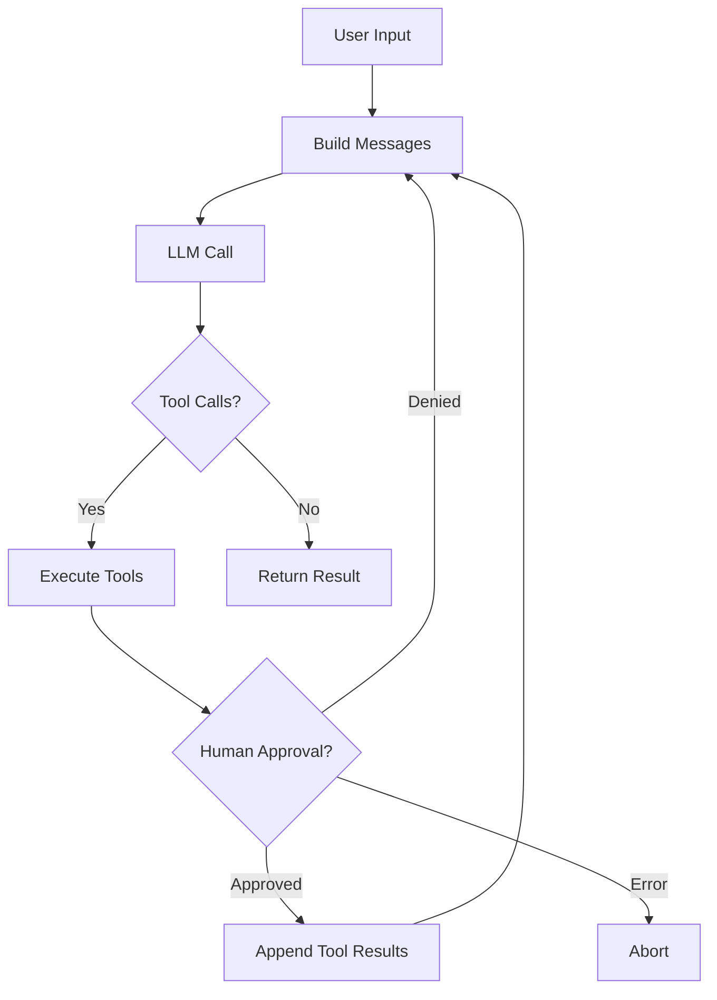
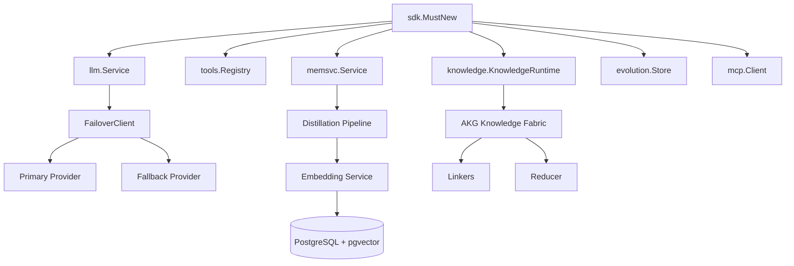

# ares Architecture Deep Dive (XVII): SDK Layer — One Line of Code to Start an Agent

Every framework has the same last-mile problem. The internals are beautiful — clean interfaces, pluggable providers, composable pipelines. Then the user shows up and asks: "How do I make it go?"

Early ares had no SDK. You wanted an agent? Here's the recipe:

```go
eventStore := events.NewMemoryEventStore()
memMgr, _ := memory.NewMemoryManager(memory.DefaultMemoryConfig())
llmClient, _ := llm.NewClient(llm.Config{...})
toolReg := tools.NewRegistry()
toolReg.Register(builtin.NewSearch())
leader := leader.New(leader.Config{...}, memMgr, llmClient, toolReg)
rt := runtime.New(runtime.Config{...}, eventStore, memMgr)
rt.RegisterAgent(leader, func() base.Agent { return leader.New(...) })
rt.Start(ctx)
```

Eleven lines of wiring before you can say "hello". Miss one nil check? 3 AM panic. Change a constructor signature? Fix 20 call sites.

The SDK solves this: `rt := ares.MustNew(ares.WithOpenAI("gpt-4o-mini"))`. One line. Provider, tools, memory, everything ready.

---

## The Problem: Five Integrators, Five Setups

When v0.2.5 shipped, five different teams were integrating ares. Each had a different entry point:

| Team | What they wanted | What they did |
|------|------------------|---------------|
| Internal CLI | Full runtime | Copied `cmd/ares` bootstrap, 300 lines |
| Knowledge team | Just LLM + tools | Hand-wired `llm.Service` + `tools.Registry` |
| Eval team | Just LLM for judging | Called `llm.NewClient` directly |
| External integrator | A simple agent | Gave up after reading the bootstrap |
| Quant team | Agent + memory + tools | Wrote their own 200-line init |

Five different setups meant five places to update when a constructor changed. Five different ways to handle errors. Five different ways to configure the LLM.

**Honest reflection**: We tried generating integration code from a template. It worked for a week, then someone needed a custom memory backend and the template couldn't express it. Templates are rigid; functional options are flexible.

---

## The Design: Functional Options, Sensible Defaults

The SDK package (`sdk/`) is the single entry point for ares. It wraps all internal components behind a production-friendly API.

### The Core Contract

```go
// sdk/sdk.go
func MustNew(opts ...Option) *Runtime     // panics on error, for quickstart
func New(opts ...Option) (*Runtime, error) // returns error, for production
```

`Runtime` is the top-level container. It owns:
- `llmSvc` — LLM client (OpenAI, Anthropic, Ollama, OpenRouter)
- `toolReg` — tool registry
- `memSvc` — memory service (optional)
- `knowledgeRT` — AKF Knowledge Fabric runtime (optional)
- `evolutionStore` — strategy evolution store (optional)
- `mcpClients` — MCP server connections (optional)

### The Option Pattern

Every configuration is a functional option:

```go
rt := ares.MustNew(
    ares.WithOpenAI("gpt-4o-mini"),
    ares.WithDefaultMemory(),
    ares.WithEvolution(),
    ares.WithKnowledge(),
    ares.WithMCP(ares.MCPConn{
        Name:    "filesystem",
        Command: "/usr/local/bin/mcp-fs",
    }),
)
```

The full option surface:

| Option | What it does |
|--------|--------------|
| `WithOpenAI(model)` | Configure OpenAI provider |
| `WithOllama(model)` | Configure Ollama provider |
| `WithAnthropic(model)` | Configure Anthropic provider |
| `WithOpenRouter(model)` | Configure OpenRouter provider |
| `WithBaseURL(url)` | Override default API base URL |
| `WithAPIKey(key)` | Set API key explicitly |
| `WithFallbackLLM(cfg)` | Add automatic failover provider |
| `WithDefaultMemory()` | Enable in-memory session storage |
| `WithMemoryConfig(maxHist, maxSess)` | Tune memory sizing |
| `WithDistillation(threshold)` | Enable memory distillation |
| `WithEmbeddingService(url, model)` | Inject external embedding service |
| `WithPostgres(cfg)` | Enable PostgreSQL-backed memory |
| `WithKnowledgeConfig(cfg)` | Tune retrieval chunking and similarity |
| `WithEvolution()` | Enable strategy evolution |
| `WithKnowledge()` | Enable AKF Knowledge Fabric pipeline |
| `WithMCP(conn)` | Connect to MCP server, register its tools |
| `WithTrace(enabled)` | Toggle per-step trace logging |

**Honest reflection**: We considered a config struct. `Config{Provider: "openai", Model: "gpt-4o", Memory: true, ...}`. But structs don't compose — you can't say "give me the production config but with memory disabled." Functional options do compose, and they let us add new options without breaking existing callers.

---

## The Agent: A ReAct Loop in 20 Lines

Once you have a `Runtime`, creating an agent is trivial:

```go
agent := rt.NewAgent("assistant",
    ares.WithInstruction("You are a helpful assistant."),
    ares.WithTools(searchTool, calcTool),
    ares.WithHumanInput(approveFunc),
    ares.WithMaxIterations(10),
)

result, err := agent.Run(ctx, "What's 2+2?")
```

`Agent.Run` executes a ReAct (Reasoning + Acting) loop:



The `Result` struct gives you everything:

```go
type Result struct {
    Output     string        `json:"output"`
    ToolCalls  int           `json:"tool_calls"`
    MemoryUsed bool          `json:"memory_used"`
    TokenUsage TokenUsage    `json:"token_usage"`
    Duration   time.Duration `json:"duration"`
}
```

### Streaming

`Stream` returns a channel for async response streaming:

```go
ch, err := agent.Stream(ctx, "hello")
for chunk := range ch {
    if chunk.Err != nil { return chunk.Err }
    fmt.Print(chunk.Content)
}
```

**Honest reflection**: The current `Stream` simulates streaming — it runs the full `agent.Run`, then sends the output in 10-rune chunks. True token-level streaming requires deeper changes to the LLM client. This is a known limitation.

---

## Teams: Multi-Agent Orchestration

```go
team := rt.NewTeam("research-team",
    ares.WithAutoSplit(),
    ares.WithVerifier(2),
    ares.WithMaxConcurrency(3),
)
result, err := team.Run(ctx, "Research the top 3 LLM frameworks")
```

Team options:

| Option | What it does |
|--------|--------------|
| `WithTeamConfig(cfg)` | Apply complete TeamConfig |
| `WithAutoSplit()` | Leader auto-splits task (default) |
| `WithExplicitGroups(groups...)` | Manual assignment mode |
| `WithVerifier(index)` | Set verifier agent by member index |
| `WithMaxConcurrency(n)` | Cap simultaneous member execution |

---

## Config-Driven Setup

For production, YAML config is cleaner than stacking 10 options:

```go
cfg, err := ares.LoadConfigFile("ares.yaml")
opts := cfg.ToOptions()
rt := ares.MustNew(opts...)
```

`ares.yaml`:
```yaml
llm:
  provider: openai
  model: gpt-4o-mini
  api_key: ${OPENAI_API_KEY}

memory:
  enabled: true
  max_history: 20
  max_sessions: 100

evolution:
  enabled: true

knowledge:
  enabled: true
  chunk_size: 512
  top_k: 5
```

**Honest reflection**: The YAML schema grew organically. Each new feature added a new section. By v0.2.7, the schema was a grab-bag of unrelated knobs. v0.2.8 added `distillation_threshold` and `max_history`/`max_sessions` as commented-out defaults in all example configs, pointing to `examples/12-yaml-driven-flags` for semantics. The goal: zero-value means "use component default," so you only uncomment what you want to tune.

---

## The Full Stack

When all options are enabled, the SDK wires this stack:



---

## Lessons

The SDK layer isn't glamorous. You can't demo `MustNew` to investors and say "look, one line!"

But it's the difference between "I integrated ares in 5 minutes" and "I gave up after reading the bootstrap." Every minute spent on wiring is a minute not spent on the user's actual problem.

**The best SDK is the one you don't notice.** You call `MustNew`, get a working agent, and focus on your logic. The wiring is invisible. That's the point.

