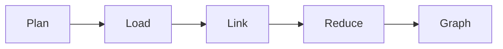

# ares Architecture Deep Dive (XVIII): Knowledge Graph Build — From Markdown to 27K Edges (AKG)

Article X covered *retrieval* — how to find relevant memories. This article covers *construction* — how those memories become a knowledge graph in the first place.

The AKF Knowledge Fabric (`internal/knowledge/`) is the engine that turns raw provider data into a linked, queryable graph. v0.2.7 shipped it; v0.2.8 exposed it through the public `api/knowledge` API.

---

## The Problem: Three Providers, No Edges

Three teams were each building their own knowledge store:

| Team | Source | Storage | Edges? |
|------|--------|---------|--------|
| Memory | Conversation turns | PostgreSQL + pgvector | None |
| Evolution | Strategy decisions | In-memory | None |
| Code | Source files | SQLite | None |

Each team had nodes. Nobody had edges. When someone asked "which decision led to this code change?", the answer required manually joining three stores.

**Honest reflection**: We tried a unified SQL schema first. It took two weeks, broke three integrations, and still couldn't express "strategy S superseded strategy T because decision D chose approach A." The relational model fights you when the data is fundamentally graph-shaped.

---

## The Design: Plan → Load → Link → Reduce → Graph

`KnowledgeRuntime` orchestrates a five-stage pipeline:



### Stage 1: Plan

The `KnowledgePlanner` decides *what* to load. The default planner loads all registered providers:

```go
// internal/knowledge/planner/default.go
type DefaultPlanner struct{}

func (p *DefaultPlanner) Plan(ctx context.Context, intent Intent) (*Plan, error) {
    sources := p.discovery.Discover(ctx, intent)
    return &Plan{Sources: sources}, nil
}
```

An `Intent` describes what the runtime wants ("build a graph for this task"). The planner maps intent to sources.

### Stage 2: Load

Providers load raw `KnowledgeObject`s from their backing store:

```go
// internal/knowledge/provider/interface.go
type Provider interface {
    Name() string
    Load(ctx context.Context) ([]*knowledge.KnowledgeObject, error)
}
```

Five built-in providers:

| Provider | Source | Object Type |
|----------|--------|-------------|
| `memory.Provider` | Conversation turns | `ObjectMemory` |
| `evolution.Provider` | Strategy decisions | `ObjectDecision` |
| `code.Provider` | Source files | `ObjectCode` |
| `mysql.Provider` | MySQL rows | `ObjectDocument` |
| `postgres.Provider` | PostgreSQL rows | `ObjectDocument` |
| `vector.Provider` | pgvector embeddings | `ObjectMemory` |

### Stage 3: Link

This is where the magic happens. Four `Linker` plugins generate edges:

| Linker | Edge Type | Logic |
|--------|-----------|-------|
| `DecisionLinker` | `decided_by`, `rationale_for` | Keyword scoring on summaries/tags |
| `ArchitectureLinker` | `depends_on`, `implements` | Code entities ↔ architecture decisions |
| `SimilarityLinker` | `similar_to` | Token-overlap similarity (default ≥ 0.3) |
| `TimelineLinker` | `supersedes`, `generated_by` | Chronological ordering by `CreatedAt` |

Each Linker is independent and pluggable. Adding a new relation type means implementing `runtime.Linker` and registering it — no changes to the core pipeline.

### Stage 4: Reduce

The `Reducer` prunes and ranks the graph. Without reduction, a 147-node graph can explode to 50K+ edges (similarity is O(n²)). The reducer applies:

1. **Edge type limits** — cap `similar_to` edges per node
2. **Score thresholds** — drop edges below `MinScore`
3. **Redundancy removal** — collapse parallel edges of the same type

The benchmark: **147 nodes, 27K edges, 73ms build time.**

### Stage 5: Graph

The final `KnowledgeGraph` is stored in a pluggable `Store`:

| Store | Backend | Use Case |
|-------|---------|----------|
| `memory.Store` | In-memory map | Testing, small graphs |
| `sqlite.Store` | SQLite | Single-node deployment |
| `postgres.Store` | PostgreSQL + pgvector | Production, distributed |

---

## The Lazy Graph

Not every query needs the full graph. `lazy_graph.go` builds subgraphs on demand:

```go
// internal/knowledge/runtime/lazy_graph.go
func (r *KnowledgeRuntime) GetSubgraph(ctx context.Context, rootID string, depth int) (*knowledge.KnowledgeGraph, error)
```

This is what `agent.Run` calls when `WithKnowledge()` is enabled — it builds a small subgraph around the current task, not the entire corpus.

**Honest reflection**: The lazy graph was a performance hack that became an architecture. Initially we built the full graph every time. At 500 nodes, build time hit 2 seconds. At 1000, it was 8 seconds. The lazy graph brought it back to ~50ms for typical queries.

---

## The Public API

v0.2.8 exposes the Knowledge Fabric through `api/knowledge`:

```go
// api/knowledge/knowledge.go
type KnowledgeObject struct {
    ID       string
    Type     ObjectType
    Summary  string
    Tags     []string
    Payload  map[string]any
    CreatedAt time.Time
}

type KnowledgeGraph struct {
    Objects  []*KnowledgeObject
    Relations []Relation
}
```

External integrators can now build and query knowledge graphs without importing `internal/`:

```go
graph, err := runtime.GetSubgraph(ctx, taskID, 2)
for _, obj := range graph.Objects {
    fmt.Printf("%s: %s\n", obj.Type, obj.Summary)
}
```

---

## The Adapter Bridge

`internal/knowledge/service/adapter.go` (v0.2.8, +126 lines) bridges the public `api/knowledge` API to the internal Knowledge Fabric runtime. It translates:

- Public `KnowledgeObject` ↔ internal `knowledge.KnowledgeObject`
- Public `KnowledgeGraph` ↔ internal `knowledge.KnowledgeGraph`
- Public query API ↔ internal `retriever.Retriever`

This is the pattern: public API in `api/`, implementation in `internal/`, adapter in `internal/<module>/service/adapter.go`.

---

## Lessons

The AKG Knowledge Fabric is the most complex module in ares. It has six sub-packages, four Linkers, three Stores, six Providers. But the core insight is simple: **knowledge is a graph, not a table.**

When you stop fighting the graph shape and embrace it — Linkers that generate edges, Reducers that prune them, Lazy graphs that build subgraphs on demand — the system gets simpler, not more complex.

**The best knowledge system is the one that knows what shape its data is.** For ares, that shape is a graph.
