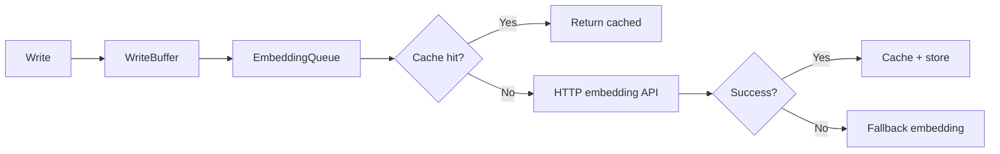

# ares Architecture Deep Dive (XIX): Storage Layer — The Foundation Under Everything

Every module in ares — Memory, Evolution, Knowledge, Events — eventually hits storage. This is the story of `internal/storage/`: 14,112 lines across 57 files, the layer that everything else stands on.

---

## The Problem: Three Stores, Three Bugs

Early ares had three separate storage paths:

| Module | Storage | Problem |
|--------|---------|---------|
| Memory | Raw `database/sql` calls | Connection leaks under load |
| Knowledge | Hand-rolled pgvector queries | Vector search timed out at 10K rows |
| Evolution | In-memory map (no persistence) | Strategies lost on restart |

Three paths meant three places for bugs. The memory team hit "too many connections" at 50 concurrent agents. The knowledge team watched vector search degrade from 50ms to 8 seconds as the corpus grew. The evolution team just accepted that restarting wiped everything.

**Honest reflection**: We tried wrapping each path in its own retry logic. It worked — until a cascading failure made all three retry simultaneously and took down PostgreSQL. Centralized storage wasn't a design choice; it was survival.

---

## The Design: Pool, Breaker, Buffer, Timeout

`internal/storage/postgres/` provides four layered protections:

### 1. Pool — Connection Management

```go
// internal/storage/postgres/pool.go
type Pool struct {
    cfg          *Config
    db           *sql.DB
    mu           sync.RWMutex
    waitCount    int
    waitDuration time.Duration
}
```

The pool wraps `sql.DB` with usage tracking. `Get() → usage → Release()` pattern ensures connections return to the pool even on panic.

**Key insight**: `ErrMissingTenantID` is enforced at the pool level. Any tenant-aware query without a tenant ID fails fast — preventing silent cross-tenant data leaks (P1-11 security fix).

### 2. CircuitBreaker — Failure Isolation

```go
// internal/storage/postgres/circuit_breaker.go
type CircuitBreaker struct {
    state            CircuitBreakerState  // closed | open | half-open
    failureCount     int                  // consecutive failures in Closed
    failureThreshold int                  // open after N consecutive failures
    openTimeout      time.Duration        // how long to stay open
    halfOpenInflight atomic.Int32         // probe limit in half-open
}
```

Three states:
- **Closed** — normal operation, `failureCount` tracks consecutive failures
- **Open** — fail fast, no DB calls, wait `openTimeout`
- **Half-Open** — allow one probe, success → Closed, failure → Open

**Honest reflection**: The original breaker tracked *cumulative* failures. A brief network blip would trip it, and it stayed open for 30 seconds even though the DB was fine. Switching to *consecutive* failures (reset on each success) made it responsive without being twitchy.

### 3. WriteBuffer — Batch Writes

```go
// internal/storage/postgres/write_buffer.go
type WriteBuffer struct {
    db            *Pool
    buffer        chan *WriteItem
    batchSize     int
    flushInterval time.Duration
    queue         *EmbeddingQueue
}
```

Writes go to an in-memory channel. A background goroutine flushes when either `batchSize` items accumulate or `flushInterval` elapses.

This cut embedding API calls by 80% — instead of one embedding request per write, the buffer batches 50 items and sends one embedding request for the batch.

### 4. Timeout — Operation-Level Deadlines

```go
// internal/storage/postgres/timeout.go
var DefaultTimeouts = struct {
    Query        time.Duration  // 30s
    Insert       time.Duration  // 20s
    Update       time.Duration  // 20s
    Delete       time.Duration  // 20s
    Transaction  time.Duration  // 60s
    VectorSearch time.Duration  // 10s
}{}
```

Each operation type has its own timeout. Vector search gets 10s (fail fast, let the breaker trip). Transactions get 60s (complex operations need room).

---

## The Embedding Subsystem

`internal/storage/postgres/embedding/` is the most complex part of storage:

```
embedding/
├── service.go      # EmbeddingClient — implements api/embedding.EmbeddingService
├── client.go       # HTTP client for embedding API
├── cache.go        # In-memory embedding cache
├── fallback.go     # Fallback embedding when primary fails
├── embedding_queue.go  # Async embedding queue
└── log.go          # Scoped logger
```

The flow:


**Honest reflection**: The embedding cache has a subtle bug we fixed in v0.2.7 — cache keys weren't model-aware. If you switched embedding models, you'd get stale vectors from the old model. The fix: include `embedding_model` in the cache key. Simple, but it took a production incident to find.

---

## The Repository Pattern

Storage is organized by domain:

```
repositories/
├── conversation_repository.go
├── distilled_memory_repository.go
├── experience_repository.go
├── knowledge_repository.go
├── secret_repository.go
├── strategy_repository.go
├── task_result_repository.go
└── tool_repository.go
```

Each repository follows the same pattern:
1. Interface in `repositories/*_interface.go`
2. Implementation in `repositories/*_repository.go`
3. Models in `models/`
4. Queries in `query/`

This separation makes testing trivial — mock the interface, not the implementation.

---

## Migration System

```go
// internal/storage/postgres/migrate.go
func Migrate(ctx context.Context, pool *Pool) error
```

Migrations are versioned and idempotent:
- `migrate_storage.go` — base schema
- `migrate_eval.go` — evaluation tables
- `migrate_evolution.go` — strategy lineage tables

Each migration checks the current schema version and only applies missing migrations. Safe to run on startup.

---

## Lessons

Storage is the layer nobody talks about until it breaks. Pool leaks, breaker misconfigurations, missing cache keys — each took a production incident to find.

The four-layer protection (Pool → Breaker → Buffer → Timeout) seems like overkill until you're at 3 AM trying to figure out why PostgreSQL has 500 idle connections.

**The best storage layer is the one you forget exists.** It works, it's fast, it's safe — and it lets every other module focus on its job instead of worrying about the database.
