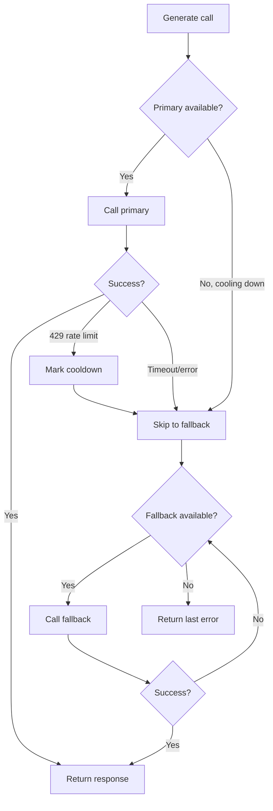

# ares Architecture Deep Dive (XX): LLM Client Layer — Failover, DeepSeek, and Multi-Provider Abstraction

Article V (Tool System) showed how tools get called — the four paths. But *who* calls the LLM in the first place? That's the `internal/llm/` layer: 5,799 lines across two packages, the abstraction that lets ares talk to OpenAI, Anthropic, Ollama, and OpenRouter without caring which one is answering.

---

## The Problem: One Provider, Three Failure Modes

v0.2.4 had a single `llm.Client` talking to one provider. It worked — until it didn't:

| Failure | Symptom | Impact |
|---------|---------|--------|
| Timeout | 60s hang, then error | Agent appears frozen |
| Rate limit (429) | Immediate rejection | Burst traffic kills the agent |
| Provider outage | Connection refused | Total downtime |

The quant team hit all three in one afternoon. Their fix: a shell script that restarted the agent every 5 minutes. That's not a fix; that's giving up.

**Honest reflection**: We considered a load balancer — round-robin across providers. But providers aren't interchangeable. GPT-4o answers differently than Claude 3 Haiku. A load balancer silently changes your agent's behavior. Failover is explicit: primary first, fallback only on failure.

---

## The Design: FailoverClient

```go
// internal/llm/failover.go
type FailoverClient struct {
    clients          []*Client       // primary + fallbacks, tried in order
    timeout          time.Duration   // per-call timeout
    cooldownDuration time.Duration   // how long to skip a rate-limited provider
    mu               sync.RWMutex
    cooldowns        map[string]time.Time  // provider+model → cooldown expiry
}
```

The flow:



Key features:

### 1. Rate-Limit-Aware Cooldown

When a provider returns HTTP 429, `FailoverClient` marks it as cooled down for `cooldownDuration` (default 60s). Subsequent calls skip the cooled-down provider and go straight to fallbacks.

```go
// internal/llm/failover.go
func (fc *FailoverClient) isAvailable(idx int) bool {
    fc.mu.RLock()
    defer fc.mu.RUnlock()
    key := fc.clientKey(idx)
    if expiry, ok := fc.cooldowns[key]; ok {
        return time.Now().After(expiry)
    }
    return true
}
```

This prevents the "retry storm" — instead of hammering a rate-limited provider, we skip it entirely until the cooldown expires.

### 2. Per-Call Timeout

Each call gets its own `context.WithTimeout`. A 30s timeout on a slow provider doesn't block a fast fallback.

### 3. Ordered Fallbacks

Fallbacks are tried in registration order. If you configure:

```go
ares.WithFallbackLLM(&core.LLMConfig{Provider: "anthropic", Model: "claude-3-haiku"}),
ares.WithFallbackLLM(&core.LLMConfig{Provider: "ollama", Model: "llama3.2"}),
```

…then primary (OpenAI) → Anthropic → Ollama. The first success wins.

**Honest reflection**: We didn't add a "preferred provider" concept. If Anthropic is your fallback and it succeeds, you keep using OpenAI next time. This means you're not load-balancing — you're only falling back when the primary fails. That's the intent.

---

## The DeepSeek ReasoningContent Fix

DeepSeek's API returns thinking-mode responses with a `reasoning_content` field separate from the regular `content`. Early ares ignored this field entirely — the thinking trace was silently dropped.

The fix (v0.2.7) added `ReasoningContent` to both `Message` and `AssistantMsg`:

```go
// internal/core/models/message.go
type Message struct {
    Role             string
    Content          string
    ReasoningContent string  // NEW: DeepSeek thinking trace
    ToolCalls        []ToolCall
}
```

The `toMap()` serialization was updated to round-trip the field properly. Without this, DeepSeek responses lost their reasoning chain — making debugging impossible.

**Honest reflection**: This is a provider-specific quirk leaking into the core model. The "clean" design would be a `ProviderMetadata map[string]any` field. But a typed `ReasoningContent` field is easier to use and document. We chose pragmatism over purity.

---

## The Output Adapter

`internal/llm/output/` handles the messy reality that every provider has a different response format:

```
output/
├── openai.go        # OpenAI response parsing
├── ollama.go        # Ollama response parsing
├── openrouter.go    # OpenRouter response parsing
├── adapter.go       # Unified adapter
├── parser.go        # Response parsing
├── validator.go     # Response validation
├── toolcall.go      # Tool call extraction
├── template.go      # Prompt templating
└── timeout.go       # Output timeout
```

Each provider file implements the same interface. The `adapter.go` picks the right parser based on `LLMConfig.Provider`:

```go
// internal/llm/output/adapter.go
func NewAdapter(provider string) (OutputAdapter, error) {
    switch provider {
    case core.LLMProviderOpenAI:
        return &OpenAIAdapter{}, nil
    case core.LLMProviderOllama:
        return &OllamaAdapter{}, nil
    case core.LLMProviderOpenRouter:
        return &OpenRouterAdapter{}, nil
    default:
        return nil, fmt.Errorf("unsupported provider: %s", provider)
    }
}
```

**Honest reflection**: Anthropic uses a different message format than OpenAI. We initially tried to normalize everything to OpenAI's format at the adapter layer. This worked for simple cases but broke on tool calls — Anthropic's tool call format is structurally different. The final design: each adapter handles its own format, and the `parser.go` does the final normalization.

---

## The Service Layer

`internal/llmservice/service.go` wraps the client in a service:

```go
// internal/llmservice/service.go
type Service struct {
    client          LLMClient
    repo            core.LLMRepository
    config          *core.BaseConfig
    llmConfig       *core.LLMConfig
    embeddingClient any
}
```

`LLMClient` is the interface satisfied by both `*llm.Client` and `*llm.FailoverClient`:

```go
type LLMClient interface {
    Generate(ctx context.Context, prompt string) (string, error)
    GenerateStream(ctx context.Context, prompt string) (<-chan llm.StreamChunk, error)
    Chat(ctx context.Context, messages []*core.LLMMessage, tools []core.Tool, params map[string]any) (*core.GenerateResponse, error)
    IsEnabled() bool
    GetProvider() string
    GetModel() string
    Close()
}
```

This is what the SDK (`sdk/sdk.go`) calls. The service layer adds:
- Request logging (via `repo`)
- Embedding client injection (optional)
- Tracer integration (via `ares_observability`)

---

## Lessons

The LLM client layer is invisible when it works. You don't notice the failover until you check the logs and see "primary failed, used fallback." You don't notice the cooldown until you realize your burst traffic didn't trigger a single 429.

**The best client layer is the one that makes failure boring.** A provider outage should be a log line, not a page at 3 AM. Failover, cooldown, and per-call timeouts turn catastrophic failures into minor inconveniences.
