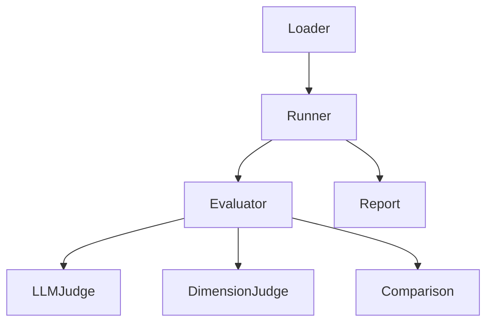

# ares Architecture Deep Dive (XXI): Evaluation Framework — How We Know If an Agent Is Actually Good

"How do you know your agent improved?" This question haunted v0.2.5. The evolution engine was generating new strategies, the arena was running battles — but we had no objective way to say "strategy A is 12% better than strategy B."

The evaluation framework (`internal/ares_eval/`, 3,390 lines) is the answer. It's the layer that turns "looks better to me" into reproducible scores.

---

## The Problem: Vibes-Based Evaluation

Early ares had three evaluation paths, all broken:

| Path | Method | Problem |
|------|--------|---------|
| Manual | "Read the output, does it look right?" | Not scalable, heavily biased |
| Unit tests | Hardcoded expected outputs | Fragile, LLM output varies |
| Token counting | "More tokens = more thorough" | GPT-4o-mini at 500 tokens beats GPT-4 at 2000 |

We tried building a custom scoring rubric. It worked for a week, then someone asked "how do you compare a 7/10 on task X with a 8/10 on task Y?" The answer: you can't, unless you have a framework.

**Honest reflection**: We considered using an existing eval framework (promptfoo, langchain eval). They're great for single-model evaluation. But ares needed *comparative* evaluation — is strategy A better than strategy B on the same task? That's a different problem.

---

## The Design: Three Layers



### Layer 1: Test Cases (`loader.go`, `types.go`)

```go
// internal/ares_eval/types.go
type TestCase struct {
    ID          string
    Input       string
    Expected    string  // optional reference answer
    Category    string  // "reasoning", "coding", "chat", etc.
    Difficulty  string  // "easy", "medium", "hard"
    Metadata    map[string]any
}

type TestResult struct {
    TestCaseID string
    Output     string
    Scores     []EvalScore
    Duration   time.Duration
    Error      error
}

type EvalScore struct {
    EvaluatorName string
    Score         float64
    MaxScore      float64
    Reasoning     string
}
```

Test cases are loaded from YAML or JSON:

```yaml
- id: reasoning_01
  input: "If A > B and B > C, what's the relationship between A and C?"
  expected: "A > C"
  category: reasoning
  difficulty: easy
```

### Layer 2: Evaluators (`evaluator.go`, `llm_judge.go`, `dimension_judge.go`)

The core interface:

```go
// internal/ares_eval/evaluator.go
type Evaluator interface {
    Name() string
    Evaluate(ctx context.Context, tc TestCase, result TestResult) ([]EvalScore, error)
}
```

Three built-in evaluators:

#### LLMJudgeEvaluator

Uses an LLM-as-judge to score outputs. Supports three scales:

```go
// internal/ares_eval/llm_judge.go
const (
    ScaleOneToTen  ScaleType = iota + 1  // 1-10 scoring
    ScaleOneToFive                       // 1-5 scoring
    ScalePassFail                        // binary pass/fail
)
```

The judge prompt (simplified):

```
You are evaluating an AI assistant's response.

Task: {input}
Expected: {expected}
Actual: {output}

Score the response on a scale of 1-10:
- 10: Perfect, matches or exceeds expected
- 7-9: Good, minor issues
- 4-6: Partial, missing key elements
- 1-3: Poor, wrong or irrelevant

Respond with JSON: {"score": N, "reasoning": "..."}
```

**Honest reflection**: LLM-as-judge has a known bias — it prefers longer, more verbose responses. We added a length penalty to the judge prompt, but it's a band-aid. The "real" fix is calibrating the judge against human evaluations, which we haven't done yet.

#### DimensionJudgeEvaluator

Scores across multiple dimensions:

```go
// internal/ares_eval/dimension_judge.go
type Dimension struct {
    Name      string  // "accuracy", "completeness", "clarity"
    Weight    float64
    MaxScore  float64
}
```

Each dimension gets its own score, then a weighted aggregate. This is what the evolution engine uses for fitness evaluation.

### Layer 3: Runner and Comparison (`runner.go`, `comparison.go`, `concurrent_runner.go`)

```go
// internal/ares_eval/runner.go
type Runner struct {
    evaluators []Evaluator
    loader     *Loader
}

func (r *Runner) RunAll(ctx context.Context) (*Report, error)
func (r *Runner) RunScenario(ctx context.Context, scenario string) (*Report, error)
```

The **comparison** layer is where the magic happens:

```go
// internal/ares_eval/comparison.go
type Comparison struct {
    Baseline    *Report
    Candidate   *Report
    Improvements []ScoreDelta
    Regressions   []ScoreDelta
}
```

This lets us say:

```
Strategy A (baseline):  average score 7.2/10
Strategy B (candidate): average score 8.1/10
Improvement: +12.5%
```

The `concurrent_runner.go` runs test cases in parallel, cutting evaluation time from 30 minutes to 3 minutes on a 100-case suite.

---

## Integration with Evolution

The evaluation framework is the fitness function for the GA engine (Article XI):

```go
// internal/ares_bootstrap/bootstrap.go (simplified)
func SetupEvaluators(llmClient *llm.Client, registry *eval.EvaluatorRegistry) error {
    judge, err := eval.NewLLMJudgeEvaluator(llmClient,
        eval.WithScale(eval.ScaleOneToTen),
        eval.WithMaxRetries(3),
    )
    if err != nil {
        return err
    }
    registry.Register(judge)

    dimJudge, err := eval.NewDimensionJudgeEvaluator(llmClient,
        eval.WithDimensions(defaultDimensions),
    )
    if err != nil {
        return err
    }
    registry.Register(dimJudge)

    return nil
}
```

When evolution runs, it:
1. Generates a new strategy (via mutation)
2. Runs it through the agent
3. Evaluates the output with `LLMJudgeEvaluator`
4. Uses the score as fitness for selection

**Honest reflection**: The LLM judge is expensive — each evaluation is an LLM call. For a 100-case suite with 10 strategies per generation, that's 1000 LLM calls per generation. We added caching (same input → same score) and a "fast mode" that only evaluates 10 random cases. But the fundamental cost remains.

---

## The Service Layer

`internal/ares_eval/service/` exposes the evaluation framework via HTTP:

```
service/
├── handler.go       # HTTP handlers
├── router.go        # Route registration
├── service.go       # Business logic
├── repository.go    # Result persistence
└── types.go         # API types
```

Endpoints:
- `POST /eval/run` — Run an evaluation suite
- `GET /eval/results/{id}` — Get results
- `POST /eval/compare` — Compare two runs

---

## Lessons

The evaluation framework is the most undervalued module in ares. Nobody asks "how do you evaluate?" in a demo. But without it, evolution is just random mutation — no fitness function, no selection pressure, no improvement.

**The best evaluation framework is the one that makes "is it better?" a question with a numerical answer.** Vibes don't scale. Reproducible scores do.
