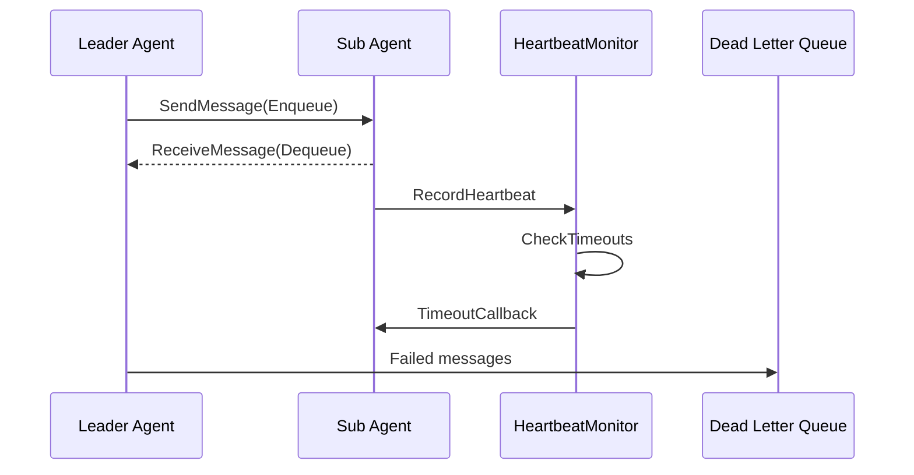

# GoAgentX Architecture Deep Dive (II): Agent Harmony Protocol — The Communication Foundation for Multi-Agent Systems

> When it comes to multi-Agent systems, most people's first reaction is: "How do Agents talk to each other? Via HTTP or WebSocket? Through a message queue?"
> My answer is rather blunt: **Running in the same process, and you still want to communicate over the network? Just use Go channels and be done with it.**
> And that's how AHP was born — a communication protocol that doesn't touch the wire.

## Foreword

What's the most annoying thing about building a multi-Agent system? It's not that the Agents aren't smart enough — it's that the Agents don't talk to each other.

The Leader assigns a task to a Sub. The Sub finishes and wants to report back, only to find that the Leader has already timed out. The Sub wants to report its progress, but there's nowhere to do so. The Leader wants to know if the Sub is still alive, but there's no heartbeat mechanism.

When I first built this in Python, I used Redis queues. Later I switched to Go and wanted a more formal solution, so I spent two full days wrestling with RabbitMQ — the first day installing Erlang, configuring vhosts, setting up exchanges, mapping out binding keys; the second day writing 200+ lines of glue code just to deliver a single message from Agent A to Agent B.

When I finally ran the benchmark, the end-to-end latency had gone from <1μs (Go channel) to 2ms+ — that's a 2000x slowdown, and it wasn't even caused by network latency since both Agents were in the same process. Pure serialization and routing overhead. I thought: **Same process, two goroutines, sending a message still has to go through the network? That's just insane.**

So I wrote a purely in-process communication protocol: no network, no serialization, no middleware dependency. Just channels + shared memory.

## I. Why reinvent the wheel?

GoAgentX has two roles: Leader Agent (who assigns work) and Sub Agent (who does the work). The communication between them needs to handle a bunch of annoyances:

- **Async messaging**: The Leader can toss out a task and move on, without waiting for the Sub to finish
- **Progress feedback**: The Sub needs to let the Leader know when it's 50% done
- **Heartbeat detection**: The Leader needs to know if the Sub has crashed
- **Fault tolerance**: If a message fails to send, there needs to be a fallback

I looked around and found that everything was either too heavy (RabbitMQ), too slow (Redis over the network), or philosophically misaligned with Go. In the end I decided: **Build my own.**

The reasoning is actually very simple:

1. **Fast**: Channel-based messaging vs. network RTT — the gap is so large there's no need to compare
2. **Simple**: No need to deal with serialization, network jitter, partition tolerance, or any of those distributed system nightmares
3. **Easy to change**: If we ever need to go microservice, just swap the underlying transport from channels to gRPC — the business code on top doesn't need to change a single line

## II. Overall Architecture

The overall architecture of AHP can be summarized in one diagram:



Core components include:

| Component | Responsibility | Implementation Highlight |
|-----------|---------------|--------------------------|
| `Protocol` | Unified facade, composes all sub-components | Facade pattern, provides all-in-one interface |
| `MessageQueue` | Independent message queue per Agent | Based on buffered channel + backup buffer + atomic.Bool |
| `HeartbeatMonitor` | Heartbeat detection + timeout callback | Shared instance, no extra components needed for distributed systems |
| `DLQ` | Dead letter message storage and retry | Supports custom handlers and automatic retry |
| `QueueRegistry` | Manages all Agent queues | Lazy loading + double-checked locking |
| `Codec` | Message serialization | JSON implementation, CodecRegistry is extensible |

## III. Message Model

### 3.1 Five Message Types

AHP defines 5 message types, covering all scenarios in inter-Agent communication:

```go
const (
    AHPMethodTask      AHPMethod = "TASK"      // Task assignment
    AHPMethodResult    AHPMethod = "RESULT"     // Task result
    AHPMethodProgress  AHPMethod = "PROGRESS"   // Progress feedback
    AHPMethodACK       AHPMethod = "ACK"        // Acknowledgment reply
    AHPMethodHeartbeat AHPMethod = "HEARTBEAT"  // Heartbeat signal
)
```

### 3.2 Message Structure

```go
type AHPMessage struct {
    MessageID   string         `json:"message_id"`
    Method      AHPMethod      `json:"method"`
    AgentID     string         `json:"agent_id"`
    TargetAgent string         `json:"target_agent"`
    TaskID      string         `json:"task_id"`
    SessionID   string         `json:"session_id"`
    Payload     map[string]any `json:"payload"`
    Timestamp   time.Time      `json:"timestamp"`
}
```

### 3.3 MessageID Generation

The MessageID is designed as a three-segment ID:

```go
func generateMessageID() string {
    id := atomic.AddUint64(&messageIDCounter, 1)
    randSuffix := getRandomSuffix()
    return fmt.Sprintf("%s.%d.%s",
        time.Now().Format("20060102150405.000000"), id, randSuffix)
}
```

- **Timestamp prefix**: Human-readable, makes debugging easier
- **Atomic counter**: Incrementing sequence number for multiple messages within the same nanosecond
- **Random suffix**: Avoids conflicts in multi-process scenarios

This scheme doesn't rely on a global coordinator and guarantees uniqueness within a process.

### 3.4 Helper Constructors

AHP provides a set of constructors that abstract away the details of message building:

```go
NewMessage(method, agentID, targetAgent, taskID, sessionID)
NewTaskMessage(agentID, targetAgent, taskID, sessionID, payload)
NewResultMessage(agentID, targetAgent, taskID, sessionID, result)
NewProgressMessage(agentID, targetAgent, taskID, sessionID, progress)
NewACKMessage(agentID, targetAgent, taskID, sessionID)
NewHeartbeatMessage(agentID)
```

One notable case is `NewResultMessage`: it wraps `*models.TaskResult` into `Payload["result"]`, while `GetResult()` needs to handle the type loss that occurs after JSON deserialization — `TaskResult` becomes `map[string]any`. `GetResult()` internally implements the `reconstructTaskResult` function, which uses reflection and field mapping to rebuild the original struct.

## IV. Message Queue: MessageQueue

### 4.1 Core Implementation

`MessageQueue` is built on top of a buffered Go channel:

```go
type MessageQueue struct {
    messages     chan *AHPMessage
    agentID      string
    opts         *QueueOptions
    backupBuffer []*AHPMessage
    backupMu     sync.Mutex
    closed       atomic.Bool
    closeOnce    sync.Once
}
```

### 4.2 Enqueue: Non-blocking Write

```go
func (q *MessageQueue) Enqueue(ctx context.Context, msg *AHPMessage) (retErr error) {
    if q.closed.Load() { return errors.ErrQueueClosed }
    defer func() {
        if r := recover(); r != nil { retErr = errors.ErrQueueClosed }
    }()
    select {
    case q.messages <- msg:
        return nil
    default:
        return errors.ErrQueueFull
    }
}
```

Design highlights:

1. **Non-blocking**: Returns `ErrQueueFull` immediately when the channel is full, does not block the caller
2. **atomic.Bool for closed check**: Lock-free check of the closed flag
3. **defer recover fallback**: Panic from `send on closed channel` is gracefully caught
4. **Unused context parameter**: The `default` branch will never select `ctx.Done()`, making the context parameter effectively useless here

### 4.3 Dequeue: Blocking Read

```go
func (q *MessageQueue) Dequeue(ctx context.Context) (*AHPMessage, error) {
    q.backupMu.Lock()
    if len(q.backupBuffer) > 0 {
        msg := q.backupBuffer[0]
        q.backupBuffer = q.backupBuffer[1:]
        q.backupMu.Unlock()
        return msg, nil
    }
    q.backupMu.Unlock()
    select {
    case msg, ok := <-q.messages:
        if !ok { return nil, errors.ErrQueueClosed }
        return msg, nil
    case <-ctx.Done():
        return nil, ctx.Err()
    }
}
```

Dequeue supports context cancellation, which is Go's standard cancelable blocking pattern.

### 4.4 Peek and Backup Buffer

`Peek()` allows checking the front of the queue without removing the message. The core challenge is: once a message is taken out of a channel, if the channel is full, it cannot be put back. The solution is the `backupBuffer`, which serves as overflow storage — `Dequeue` reads from the backupBuffer first.

### 4.5 QueueRegistry: Queue Manager

`QueueRegistry`'s `GetOrCreate` method uses the **Double-Checked Locking** pattern:

```go
func (r *QueueRegistry) GetOrCreate(agentID string) *MessageQueue {
    r.mu.RLock()
    q, ok := r.queues[agentID]
    r.mu.RUnlock()
    if ok { return q }
    r.mu.Lock()
    defer r.mu.Unlock()
    if q, ok := r.queues[agentID]; ok { return q } // Double-check
    q = NewMessageQueue(agentID, r.defaultOpts)
    r.queues[agentID] = q
    return q
}
```

## V. Heartbeat Detection: HeartbeatMonitor

### 5.1 Core Flow

- Each Agent sends heartbeats at a fixed interval (default 5s)
- HeartbeatMonitor records the timestamp of the most recent heartbeat
- If the timeout threshold (default 30s) is exceeded and the number of consecutive misses reaches the limit (default 3), the Agent is marked offline

### 5.2 Timeout Detection Algorithm

```go
func (m *HeartbeatMonitor) CheckTimeouts() []string {
    timedOut := m.checkAndMarkOffline()  // Detection under write lock
    for _, agentID := range timedOut {
        m.notifyCallbacks(agentID)        // Execute callbacks outside the lock
    }
    return timedOut
}
```

Key edge case handling:

1. **Gradual timeout**: An Agent is only declared offline after 3 missed heartbeats, preventing false positives from occasional network latency
2. **Avoid duplicate callbacks**: An Agent already marked Offline will not trigger callbacks again
3. **Callbacks executed outside the lock**: `notifyCallbacks` copies the callback list, releases the lock, then executes — this is critical for preventing deadlocks

### 5.3 Two Types of HeartbeatSender

1. **`ahp.HeartbeatSender`**: Sends an `AHPMethodHeartbeat` message to the target's `MessageQueue` — this is **in-band** heartbeat
2. **`heartbeatSender`** (in `internal/agents/sub/`): Directly calls `HeartbeatMonitor.RecordHeartbeat` — this is **out-of-band** heartbeat

Currently, the Sub Agent uses the second approach, which is more efficient in a monolithic deployment.

## VI. Dead Letter Queue: DLQ

When `Enqueue` returns an error, `Protocol.SendMessage` routes the failed message to the DLQ:

```go
func classifyEnqueueError(err error) string {
    switch {
    case errors.Is(err, apperrors.ErrQueueClosed):  return "queue_closed"
    case errors.Is(err, apperrors.ErrQueueFull):    return "queue_full"
    case errors.Is(err, context.Canceled):          return "context_canceled"
    case errors.Is(err, context.DeadlineExceeded):  return "context_deadline"
    default:                                        return "unknown"
    }
}
```

`DLQProcessor` supports registering custom handlers by error type, and supports automatic retry:

- `MaxRetries = 0`: Unlimited retries
- `MaxRetries > 0`: Marked as exhausted after reaching the limit
- Currently no exponential backoff — this is an area for improvement

## VII. Protocol Facade

```go
type Protocol struct {
    registry  *QueueRegistry
    dlq       *DLQ
    codec     Codec
    heartbeat *HeartbeatMonitor
    config    *ProtocolConfig
}
```

| Method | Function |
|--------|----------|
| `SendMessage(ctx, msg)` | Sends a message, routes to DLQ on failure |
| `ReceiveMessage(ctx, agentID)` | Receives a message, blocks until available |
| `SendTask/SendResult` | Convenience methods for sending |
| `RecordHeartbeat(agentID)` | Records a heartbeat |
| `CheckTimeouts()` | Checks for timeouts |
| `Stats()` | Runtime status snapshot |
| `Close()` | Closes all resources |

## VIII. AHP Integration in Agents

### 8.1 Messenger Interface

```go
type Messenger interface {
    SendMessage(ctx context.Context, msg *ahp.AHPMessage) error
    ReceiveMessage(ctx context.Context) (*ahp.AHPMessage, error)
}
```

Both Leader Agent and Sub Agent implement this interface. During construction, `MessageQueue` and `HeartbeatMonitor` are injected via dependency injection.

### 8.2 Dispatcher's Task Distribution

`taskDispatcher` supports both **local execution** and **distributed dispatch** modes. The core logic is in `executeTask`:

```go
if executor, ok := d.executorFuncs[task.Type]; ok {
    return executor(ctx, task, agentAddr, sessionID)  // Local execution
}
if d.messageSender == nil { /* return error */ }
msg := ahp.NewTaskMessage(...)                        // Send via AHP
d.messageSender.Send(ctx, agentAddr, msg)
return d.waitForResult(ctx, task.TaskID)              // Block waiting for result
```

This design allows the Agent communication pattern to seamlessly switch between monolithic and distributed deployments.

## IX. Design Pattern Summary

| Pattern | Location | Description |
|---------|----------|-------------|
| **Facade** | `Protocol` | Unified interface, composes all components |
| **Registry** | `QueueRegistry`, `CodecRegistry` | Named instance management, lazy loading |
| **Strategy** | `Codec` interface | Replaceable serialization strategy |
| **Observer** | `TimeoutCallback` | Heartbeat timeout callback |
| **Dead Letter Queue** | `DLQ` + `DLQProcessor` | Failed message storage and retry |
| **Double-Checked Locking** | `GetOrCreate` | Balances performance and correctness |
| **Panic Recovery** | `Enqueue` | `defer recover()` handles concurrent close |
| **Lock-Free Read** | `atomic.Bool` | Lock-free reading of close state |

## X. Key Design Decisions

### 10.1 Why Non-blocking Enqueue?

- Agents run in a multi-threaded environment; blocking could lead to cascading waits
- DLQ provides better fault-tolerance semantics — failed messages can be retried
- Callers have greater control: retry immediately, retry later, or discard

### 10.2 TOCTOU Avoidance

`SendMessage` has a critical design choice: **it does not check IsFull before enqueuing**. If it checked first and then enqueued, the queue could go from not-full to full between the check and the enqueue (a TOCTOU race condition), causing message loss. Directly performing the operation and handling errors is more robust.

### 10.3 Serialization Extensibility

Currently AHP is purely in-process communication, so JSON is sufficient. But the Codec interface has reserved extensibility in two directions:
1. **Cross-process communication**: protobuf/msgpack can provide smaller payloads
2. **Persistence**: If DLQ messages need to be persisted to disk, binary formats are more advantageous

## XI. What's Missing? (Honest Section)

To be honest, AHP isn't perfect. I've run into a few pain points myself, some of them quite painful:

1. **Purely in-process**: Can't span processes. If you need distributed deployment, you'll need to swap out the MessageQueue implementation. And "swap out the implementation" isn't as simple as it sounds — channel's synchronous semantics are fundamentally different from async network message queues, and there are plenty of edge cases to handle in the transition
2. **No broadcast**: Want to send a message to multiple Sub Agents? You'll have to send them one by one in a Leader-side for loop. At one point I needed to notify 6 Sub Agents simultaneously — by the time the Leader had sent to the 3rd one, the 1st had already finished execution. Serial sending became the bottleneck of the entire workflow
3. **Retry strategy is too naive**: The DLQ retry interval is fixed — no exponential backoff. Once a downstream API went down for 10 minutes, and the DLQ hammered it with fixed-interval retries the entire time, making an already fragile situation worse. I added circuit-breaking logic afterward — should have done it from the start
4. **Routing is too rigid**: No support for content-based dynamic routing or Topic subscriptions. Current routing is just "send to this AgentID" — if I want to route by message type, I have to write if-else chains at the business layer

There's also a less obvious cost: **the "just swap the implementation" assumption may be wrong in the short term.** Many of AHP's semantics (non-blocking Enqueue, backup buffer, shared-memory Heartbeat) depend on channel's synchronous characteristics. When you actually switch to gRPC or RabbitMQ, porting these behaviors is far harder than it looks on paper — you need to reimplement a whole set of asynchronous semantics that just *look like* channels. An abstraction layer can isolate interfaces, but it can't isolate semantic differences.

All that said, these limitations are **acceptable trade-offs** at the monolithic stage — the channel approach eliminated 90% of distributed system complexity for me. If I'd gone with RabbitMQ from day one, inter-Agent communication might have been more robust, but the project would have taken one to two extra weeks to launch, not to mention the ongoing operational cost. For a startup-stage project, that math works out every time.

## Summary

AHP is the communication wheel I built for GoAgentX. Channel-based messaging, DLQ as fallback, HeartbeatMonitor for liveness checks — three pieces combined, and the multi-Agent communication infrastructure is good to go.

Those interfaces left in the code (Codec, DLQ handler, MessageSender) are essentially escape hatches I left for myself: if we ever need to switch to gRPC or RabbitMQ, just swap out one layer of implementation — the business code on top doesn't change. This kind of design is especially important in startup projects — you never know what the architecture will look like tomorrow.

Next up, let's talk about **Memory Distillation** — how Agents distill useful experience from hundreds of conversation histories and reuse them directly when encountering similar problems.