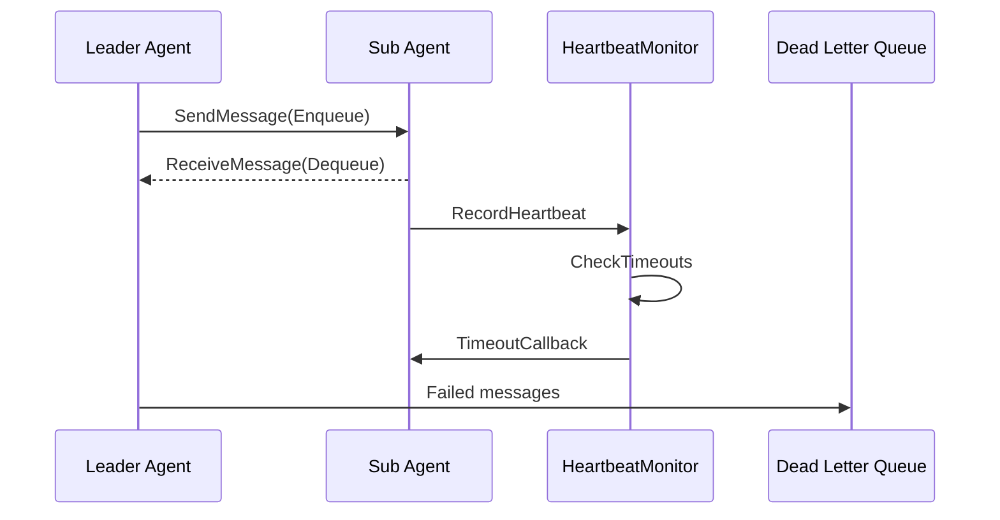

# GoAgentX Architecture Deep Dive (2): Agent Harmony Protocol — The Communication Bedrock for Multi-Agent Systems

> When people ask "how do your agents talk to each other?", they expect something like HTTP, WebSocket, or a message queue.
> My answer was simpler: **They're in the same process. Why involve the network at all? Just use Go channels.**
> That's how AHP was born — a protocol that never touches the wire.

## The Problem I Hit

The most annoying thing about building multi-agent systems isn't that agents aren't smart enough — it's that they don't talk to each other.

The Leader assigns a task to a Sub. The Sub finishes and wants to report back — but the Leader already timed out. The Sub wants to send progress updates — nowhere to send them. The Leader wants to know if the Sub is still alive — no heartbeat mechanism.

When I first built this in Python, I used Redis queues. When I switched to Go, I spent two days reading RabbitMQ documentation. I remember thinking: **Two goroutines in the same process, sending a message — and I need a message broker? That's insane.**

So I wrote a purely in-process protocol: no network, no serialization, no middleware. Just Go channels + shared memory.

## Why Roll Your Own?

GoAgentX has two roles: Leader Agent (delegates work) and Sub Agent (does the work). The communication between them has to handle:

- **Async messaging**: Leader sends a task and moves on — doesn't block waiting for the Sub to finish
- **Progress feedback**: Sub tells the Leader "I'm 50% done"
- **Heartbeat detection**: Leader knows if a Sub is still alive
- **Fault tolerance**: Failed message delivery needs a fallback

I looked around and found: everything was either too heavy (RabbitMQ), too slow (Redis over network), or philosophically incompatible with Go's concurrency model. So I built my own.

The reasons were dead simple:

1. **It's fast**: Channel ops vs network RTT — not even close
2. **It's simple**: No serialization, no network jitter, no partition tolerance nightmares
3. **It's evolvable**: When I eventually need distributed deployment, I swap the channel backend for gRPC. The business logic above doesn't change a single line.

## Global Architecture



| Component | Responsibility | Highlights |
|-----------|---------------|------------|
| `Protocol` | Unified facade, composes all sub-components | Facade pattern, one-stop interface |
| `MessageQueue` | Per-agent message queue | Buffered channel + backup buffer + atomic.Bool |
| `HeartbeatMonitor` | Heartbeat detection + timeout callbacks | Shared instance, no external dependencies |
| `DLQ` | Dead letter storage and retry | Custom handlers + auto retry |
| `QueueRegistry` | Manages all agent queues | Lazy initialization + double-checked locking |
| `Codec` | Message serialization | JSON implementation, extensible via CodecRegistry |

## Message Model

### Five Message Types

```go
const (
    AHPMethodTask      AHPMethod = "TASK"      // Task assignment
    AHPMethodResult    AHPMethod = "RESULT"     // Task result
    AHPMethodProgress  AHPMethod = "PROGRESS"   // Progress update
    AHPMethodACK       AHPMethod = "ACK"        // Acknowledgment
    AHPMethodHeartbeat AHPMethod = "HEARTBEAT"  // Liveness signal
)
```

### Message Structure

```go
type AHPMessage struct {
    MessageID   string         `json:"message_id"`
    Method      AHPMethod      `json:"method"`
    AgentID     string         `json:"agent_id"`
    TargetAgent string         `json:"target_agent"`
    TaskID      string         `json:"task_id"`
    SessionID   string         `json:"session_id"`
    Payload     map[string]any `json:"payload"`
    Timestamp   time.Time      `json:"timestamp"`
}
```

### MessageID Generation

The MessageID is a three-part composite:

```go
func generateMessageID() string {
    id := atomic.AddUint64(&messageIDCounter, 1)
    randSuffix := getRandomSuffix()
    return fmt.Sprintf("%s.%d.%s",
        time.Now().Format("20060102150405.000000"), id, randSuffix)
}
```

- **Timestamp prefix**: Human-readable, traceable
- **Atomic counter**: Monotonic sequence within the same nanosecond
- **Random suffix**: Collision-free across multiple processes

### Constructor Functions

```go
NewMessage(method, agentID, targetAgent, taskID, sessionID)
NewTaskMessage(agentID, targetAgent, taskID, sessionID, payload)
NewResultMessage(agentID, targetAgent, taskID, sessionID, result)
NewProgressMessage(agentID, targetAgent, taskID, sessionID, progress)
NewACKMessage(agentID, targetAgent, taskID, sessionID)
NewHeartbeatMessage(agentID)
```

`GetResult()` handles a tricky problem: after JSON deserialization, `TaskResult` loses its type and becomes `map[string]any`. The method's `reconstructTaskResult` function uses reflection and field mapping to rebuild the original struct — a classic solution to JSON polymorphism serialization.

## MessageQueue

### Core Implementation

```go
type MessageQueue struct {
    messages     chan *AHPMessage
    agentID      string
    opts         *QueueOptions
    backupBuffer []*AHPMessage
    backupMu     sync.Mutex
    closed       atomic.Bool
    closeOnce    sync.Once
}
```

### Enqueue: Non-Blocking Write

```go
func (q *MessageQueue) Enqueue(ctx context.Context, msg *AHPMessage) (retErr error) {
    if q.closed.Load() { return errors.ErrQueueClosed }
    defer func() {
        if r := recover(); r != nil { retErr = errors.ErrQueueClosed }
    }()
    select {
    case q.messages <- msg:
        return nil
    default:
        return errors.ErrQueueFull
    }
}
```

Key design choices:
1. **Non-blocking**: Returns `ErrQueueFull` immediately when the channel is full
2. **atomic.Bool**: Lock-free closed-state check
3. **defer recover**: Gracefully handles `send on closed channel` panics
4. **ctx parameter unused**: The `default` branch never selects `ctx.Done()`

### Dequeue: Blocking Read

```go
func (q *MessageQueue) Dequeue(ctx context.Context) (*AHPMessage, error) {
    q.backupMu.Lock()
    if len(q.backupBuffer) > 0 {
        msg := q.backupBuffer[0]
        q.backupBuffer = q.backupBuffer[1:]
        q.backupMu.Unlock()
        return msg, nil
    }
    q.backupMu.Unlock()
    select {
    case msg, ok := <-q.messages:
        if !ok { return nil, errors.ErrQueueClosed }
        return msg, nil
    case <-ctx.Done():
        return nil, ctx.Err()
    }
}
```

### Peek and Backup Buffer

`Peek()` inspects the head of the queue without removing the message. The challenge: once you take a message from a channel, you can't put it back if the channel is full. The solution is a `backupBuffer` — `Dequeue` checks the backup buffer first, ensuring no message is lost.

### QueueRegistry

Uses **Double-Checked Locking** for performance:

```go
func (r *QueueRegistry) GetOrCreate(agentID string) *MessageQueue {
    r.mu.RLock()
    q, ok := r.queues[agentID]
    r.mu.RUnlock()
    if ok { return q }
    r.mu.Lock()
    defer r.mu.Unlock()
    if q, ok := r.queues[agentID]; ok { return q }
    q = NewMessageQueue(agentID, r.defaultOpts)
    r.queues[agentID] = q
    return q
}
```

## HeartbeatMonitor

### Core Flow

- Agents send heartbeats at a fixed interval (default 5s)
- HeartbeatMonitor records the last heartbeat time
- If the timeout is exceeded (default 30s) and `MissedCount >= MaxMissed` (default 3), the agent is marked offline

### Timeout Detection Algorithm

```go
func (m *HeartbeatMonitor) CheckTimeouts() []string {
    timedOut := m.checkAndMarkOffline()  // Under write lock
    for _, agentID := range timedOut {
        m.notifyCallbacks(agentID)        // Outside the lock
    }
    return timedOut
}
```

Critical edge cases:
1. **Gradual timeout**: 3 missed heartbeats before declaring offline — avoids false kills from transient network delays
2. **No duplicate callbacks**: Already-offline agents won't trigger callbacks again
3. **Callbacks outside the lock**: `notifyCallbacks` copies the callback slice under a read lock, releases it, then invokes callbacks. This prevents deadlocks.

### Two HeartbeatSenders

1. **`ahp.HeartbeatSender`**: Sends `AHPMethodHeartbeat` messages into `MessageQueue` — **in-band** heartbeat
2. **`heartbeatSender`** (in `internal/agents/sub/`): Calls `HeartbeatMonitor.RecordHeartbeat` directly — **out-of-band** heartbeat

Currently, Sub Agents use the second approach, which is more efficient in monolithic deployments.

## Dead Letter Queue

When `Enqueue` fails, `Protocol.SendMessage` routes the failed message to DLQ:

```go
func classifyEnqueueError(err error) string {
    switch {
    case errors.Is(err, apperrors.ErrQueueClosed):  return "queue_closed"
    case errors.Is(err, apperrors.ErrQueueFull):    return "queue_full"
    case errors.Is(err, context.Canceled):          return "context_canceled"
    case errors.Is(err, context.DeadlineExceeded):  return "context_deadline"
    default:                                        return "unknown"
    }
}
```

`DLQProcessor` supports custom handlers per error type and automatic retry:

- `MaxRetries = 0`: Unlimited retries
- `MaxRetries > 0`: Exhausted after the configured count
- No exponential backoff — a potential improvement area

## Protocol Facade

```go
type Protocol struct {
    registry  *QueueRegistry
    dlq       *DLQ
    codec     Codec
    heartbeat *HeartbeatMonitor
    config    *ProtocolConfig
}
```

| Method | Purpose |
|--------|---------|
| `SendMessage(ctx, msg)` | Send message, auto-route to DLQ on failure |
| `ReceiveMessage(ctx, agentID)` | Receive message, blocking |
| `SendTask/SendResult` | Convenience wrappers |
| `RecordHeartbeat(agentID)` | Record heartbeat |
| `CheckTimeouts()` | Check for timed-out agents |
| `Stats()` | Snapshot of runtime state |
| `Close()` | Shutdown all resources |

## Agent Integration

### Messenger Interface

```go
type Messenger interface {
    SendMessage(ctx context.Context, msg *ahp.AHPMessage) error
    ReceiveMessage(ctx context.Context) (*ahp.AHPMessage, error)
}
```

Both `leaderAgent` and `subAgent` implement this, with `MessageQueue` and `HeartbeatMonitor` injected via constructors.

### Dispatcher Task Distribution

`taskDispatcher` supports both **local execution** and **distributed dispatch**:

```go
if executor, ok := d.executorFuncs[task.Type]; ok {
    return executor(ctx, task, agentAddr, sessionID)
}
if d.messageSender == nil { /* return error */ }
msg := ahp.NewTaskMessage(...)
d.messageSender.Send(ctx, agentAddr, msg)
return d.waitForResult(ctx, task.TaskID)
```

This design allows seamless switching between monolithic and distributed deployment.

## Design Patterns Summary

| Pattern | Location | Description |
|---------|----------|-------------|
| **Facade** | `Protocol` | Unified interface over all components |
| **Registry** | `QueueRegistry`, `CodecRegistry` | Named instance management, lazy init |
| **Strategy** | `Codec` interface | Pluggable serialization |
| **Observer** | `TimeoutCallback` | Heartbeat timeout callbacks |
| **Dead Letter Queue** | `DLQ` + `DLQProcessor` | Failed message storage and retry |
| **Double-Checked Locking** | `GetOrCreate` | Performance + correctness |
| **Panic Recovery** | `Enqueue` | `defer recover()` for concurrent close |
| **Lock-Free Read** | `atomic.Bool` | Lock-free closed flag check |

## Design Decisions I Stand By

### Why Non-Blocking Enqueue?

Agents run in a multi-threaded environment. Blocking one agent while it tries to send a message can cascade through the whole system. DLQ handles failures better — failed messages can be retried, and the caller decides what to do: immediate retry, deferred retry, or discard.

### Why No Check-Before-Send

`SendMessage` intentionally doesn't check `IsFull` first. If I did, there's a TOCTOU race: queue could go from non-full to full between the check and the send. Just send and handle the error. Simpler, safer.

### Why a Codec Interface in an In-Process Protocol

Even though AHP runs in-process today, the `Codec` interface is my insurance policy for tomorrow:
1. **Cross-process**: protobuf/msgpack when you go distributed
2. **Persistence**: binary formats when you want DLQ messages on disk

## What's Missing (Honest Section)

AHP isn't perfect. Here are the things I'd fix if I had more time:

1. **In-process only**: Can't cross processes. You need to swap MessageQueue for a network transport when going distributed.
2. **No broadcast**: Sending to multiple Subs? Do it one by one. I know, it's annoying.
3. **No exponential backoff**: DLQ retries at a fixed interval. Under sustained failure, you might get a retry storm. Still on my TODO.
4. **Static routing**: No content-based routing or topic subscriptions. Simple by design, inflexible by consequence.

## Summary

AHP is the communication wheel I built for GoAgentX. Channels for message passing, DLQ for fault tolerance, HeartbeatMonitor for liveness detection — three pieces that make multi-agent communication work without the overhead of a distributed system.

The interfaces I left in the code (`Codec`, DLQ handler, `MessageSender`) are my escape hatch: swap one layer, change the whole transport, don't touch anything above it. In a startup project, this kind of design flexibility is gold — because you never know what your architecture will look like next month.

Next: **Memory Distillation** — how I taught agents to stop drowning in conversation history and actually learn from experience.