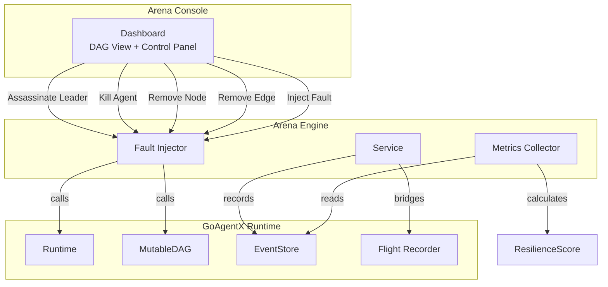
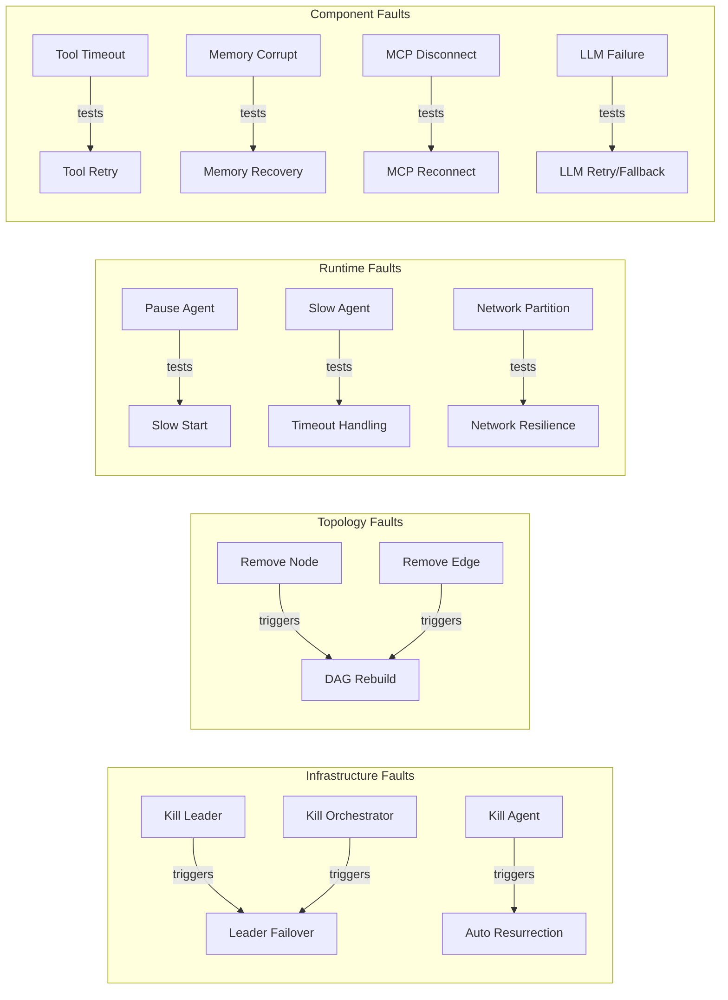
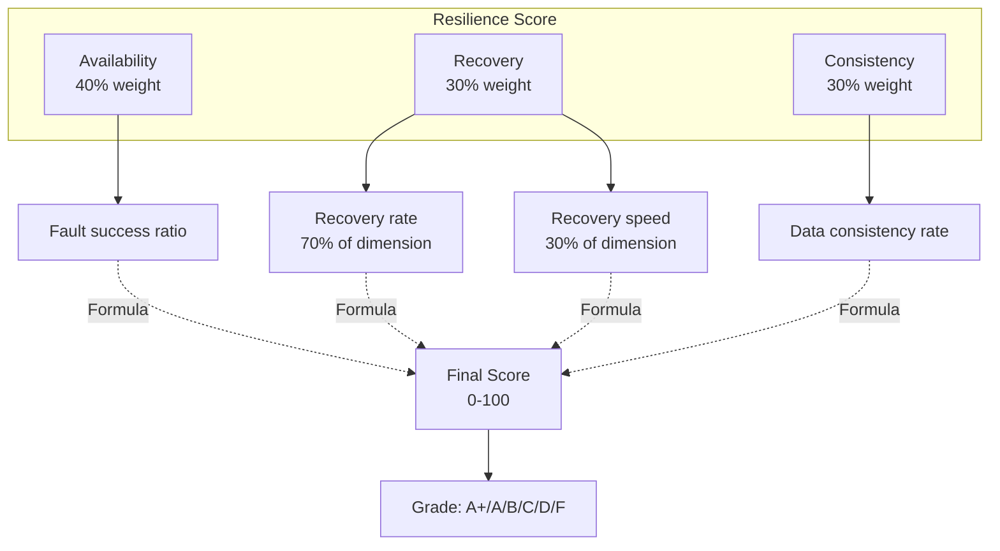
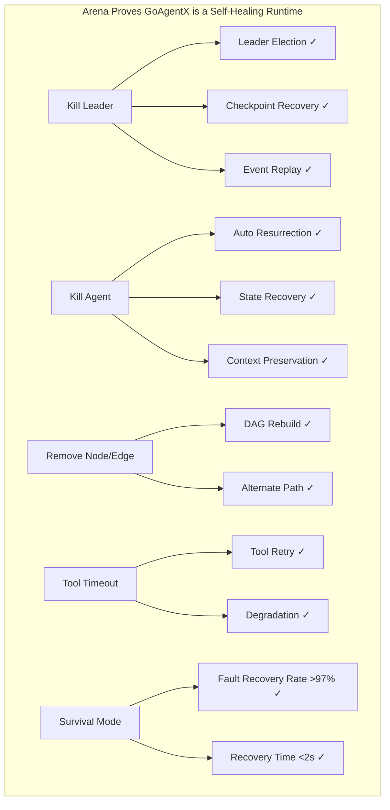

# GoAgentX Architecture Deep Dive (9): Arena / Fault Injection — Break It Deliberately, Watch It Self-Heal

> Other agent frameworks show you how smart the agent is: fluent conversations, strong reasoning, smooth tool usage.
> GoAgentX shows you something else: **when you deliberately kill its agents, can it survive?**
> I call this "Edo Tensei Verification" — click a button on the Dashboard, assassinate a working agent, and see if it can pick itself back up.

---

## 1. Why I Built a "Break Things" Feature

Believe it or not, the Arena module was inspired by a production incident.

I was testing agent stability and manually killed a process. The agent auto-resurrected and continued working on unfinished tasks. I was excited — but then I thought: **This was just a manual test. Can I automate it?**

So I built Arena — a module whose sole purpose is to break things. Not to show how smart agents are, but to show whether agents survive when they're constantly being attacked.

Arena's secret is dead simple: **it doesn't implement its own Runtime, DAG, or Recovery logic. It just deliberately calls the existing dangerous APIs (StopAgent, RemoveNode, RemoveEdge), and then waits to see the system fix itself.**



Core files:

| File | Purpose |
|------|---------|
| `internal/arena/types.go` | ActionType, Action, Result, Stats |
| `internal/arena/injector.go` | FaultInjector — wraps Runtime + DAG APIs |
| `internal/arena/service.go` | Arena Service — executes actions, records history |
| `internal/arena/http.go` | REST API + SSE streaming |
| `internal/arena/scenario.go` | Scenario orchestrator |
| `internal/arena/survival.go` | Survival mode — continuous random faults |
| `internal/arena/metrics.go` | MetricsCollector — recovery timing + counts |
| `internal/arena/score.go` | ResilienceScore — 3-dimensional scoring |
| `internal/arena/integration.go` | FlightBridge — Arena → Flight Recorder |
| `internal/dashboard/static/app.js` | Frontend: DAG visualization, control panel, event log |
| `cmd/arena/main.go` | CLI: run / validate / list / survival / inspect / serve |

---

## 2. Architecture

### 2.1 Core Design Principle

Arena **does not** implement its own Runtime, DAG, or Recovery system. It is a thin layer that calls existing APIs:

```go
func (in *Injector) KillAgent(ctx context.Context, id string) error {
    return in.runtime.StopAgent(ctx, id)
    // Resurrection is handled automatically by the existing Resurrection plugin
}

func (in *Injector) RemoveNode(ctx context.Context, id string) error {
    return in.dag.RemoveNode(ctx, id)
    // MutableDAG rebuilds topology automatically
}
```

### 2.2 Thirteen Chaos Actions



### 2.3 Three-Layer Architecture


---

## 3. Fault Injection

### 3.1 Injector Design

The `Injector` depends on two interfaces — `RuntimeProvider` and `DAGProvider` — both of which are subsets of the full Runtime/DAG capabilities. This interface-based design means Arena doesn't need to import concrete Runtime or DAG packages, only a small API surface. Any type implementing these interfaces can be used, making Arena easily testable with mocks.

### 3.2 Kill Leader — The Signature Move

Killing the Leader is Arena's most impactful demonstration, proving three capabilities at once:

```go
func (in *Injector) KillLeader(ctx context.Context) (string, error) {
    leaderID := ""
    for _, info := range in.runtime.ListAgents() {
        if info.Type == "leader" {
            leaderID = info.ID
            break
        }
    }
    if leaderID == "" {
        return "", ErrLeaderNotFound
    }
    if err := in.runtime.StopAgent(ctx, leaderID); err != nil {
        return "", fmt.Errorf("arena: kill leader %s: %w", leaderID, err)
    }
    return leaderID, nil
}
```

The causal chain:
1. Arena calls `StopAgent("leader-1")`
2. Runtime marks the agent as stopped
3. Agent goroutine exits
4. `NotifyAgentDead` is called
5. LeaderSupervisor detects leader absence
6. Failover triggers: election → checkpoint recovery → event replay
7. New leader is promoted and running within seconds

---

## 4. Service Layer

### 4.1 Action Execution

```go
func (s *Service) Execute(ctx context.Context, action Action) Result {
    start := time.Now()
    var err error

    switch action.Type {
    case ActionKillLeader:
        _, err = s.injector.KillLeader(ctx)
    case ActionKillAgent:
        err = s.injector.KillAgent(ctx, action.TargetID)
    // ... 13 cases
    }

    result := Result{Success: err == nil, Duration: time.Since(start)}
    s.recordMetrics(action.Type, result.Success, result.Duration)
    s.emitEvent(ctx, action, result)
    return result
}
```

Each action result is emitted as an event in the EventStore and pushed to the Dashboard frontend in real time via SSE streaming.

---

## 5. Resilience Score

### 5.1 Three-Dimensional Scoring System



| Score Range | Grade |
|-------------|-------|
| ≥ 95 | A+ |
| ≥ 90 | A |
| ≥ 80 | B |
| ≥ 70 | C |
| ≥ 60 | D |
| < 60 | F |

---

## 6. Scenario Runner

YAML defines orchestrated sequences of chaos actions:

```yaml
name: leader-failover-storm
actions:
  - delay: 0s
    action:
      type: kill_leader
  - delay: 8s
    action:
      type: kill_agent
  - delay: 5s
    action:
      type: slow_agent
      metadata:
        duration: 8s
```

Two built-in scenarios:
- **`leader_assassination.yaml`**: 4-phase — assassinate Leader → verify new Leader → randomly kill agent → slow agent under load
- **`cascading_storm.yaml`**: 7-phase — network partition → kill → tool timeout → memory corrupt → MCP disconnect → LLM failure → cascading slowdown

---

## 7. Survival Mode

Survival mode continuously injects random faults for a configured duration:

```bash
goagentx arena survival --addr http://localhost:8080 --duration 30m --interval 10s
```

Live output:

```
Elapsed: 12s         Actions: 1     Score: 100.0 (A+)
Elapsed: 22s         Actions: 2     Score: 97.3 (A+)
```

13 fault types randomly select targets. Ctrl+C stops and prints the final report.

---

## 8. Dashboard Integration

### 8.1 Frontend

The Arena tab provides:


**13 fault buttons**: ☠Leader / ⚙Orch / Kill / ✕Node / ✕Edge / ⏸Pause / ▶Resume / 🐌Slow / 🗡Partition / ⏰Timeout / 📚MemCorrupt / 📱MCP DC / 🧠LLM Fail

**Event Log** streams real-time recovery narratives:

```
10:01:02 ✗ kill_leader → Leader killed
10:01:04 ✓ kill_leader → New leader elected
10:01:06 ✓ workflow → Workflow resumed
```

### 8.2 Post-Mortem Inspect

```bash
goagentx arena inspect --addr http://localhost:8080
```

```
═══════════════════════════════════════════════════════
  Arena Inspection Report
═══════════════════════════════════════════════════════

  Score:          92.4 (A)
  Recovery Rate:  92.9%
  Faults:         32 total, 31 recovered, 1 failed
  Diagnostics:
    concurrency_error    3  (37.5%)
    tool_timeout         2  (25.0%)
```

---

## 9. CLI Command Reference

| Command | Description |
|---------|-------------|
| `goagentx arena run <scenario.yaml>` | Run a scenario against remote server |
| `goagentx arena validate <scenario.yaml>` | Validate scenario file locally |
| `goagentx arena list [dir]` | List scenario files in directory |
| `goagentx arena serve [--addr]` | Start Arena HTTP server |
| `goagentx arena survival [--addr] [--duration]` | Start survival mode (live progress) |
| `goagentx arena inspect [--addr]` | Post-mortem inspection report |

---

## 10. Architectural Summary

### Design Patterns

| Pattern | Location | Purpose |
|---------|----------|---------|
| Facade | `Injector` | Wraps Runtime + DAG into unified chaos interface |
| Strategy | `ActionType` → `Service.Execute` | Dispatch 13 fault types |
| Observer | SSE stream | Real-time event push to dashboard |
| Decorator | `FlightBridge` | Augment arena actions with flight recording |
| Composite | `Scenario` | Multiple orchestrated actions as one run |
| CLI Command | `cmd/arena/main.go` | 6 subcommands |

### Self-Healing Capabilities Arena Proves



---

## 11. Conclusion

Arena is the feature I find most interesting in GoAgentX. Not because the technology is particularly impressive — but because it shows something most other frameworks don't: **can the system survive when it's being continuously destroyed?**

13 fault types, scenario orchestration, survival mode, real-time Dashboard, Flight Recorder integration, three-dimensional resilience scoring... All of these together turn `goagentx arena run cascading_storm.yaml` from a test command into a demo that says: "Look how resilient my system is."

I once showed a friend: opened the Dashboard, clicked "Assassinate Leader," the agent died... then 1.4 seconds later it auto-resurrected. He said: "Holy shit, it does that?"

I thought: **Yeah. That's exactly why I spent so much time building this.**

> "Break it deliberately. Watch it self-heal." — This is GoAgentX's most impressive demo, and the biggest source of satisfaction I've had in building this framework.