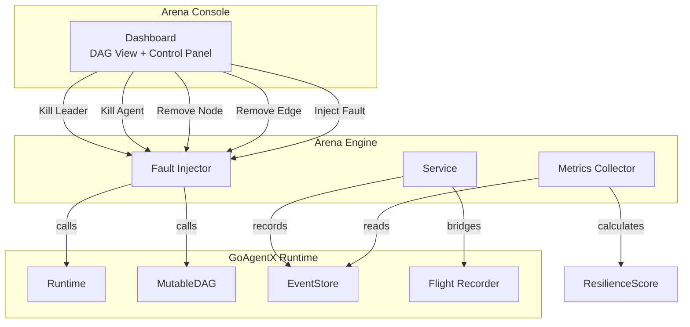
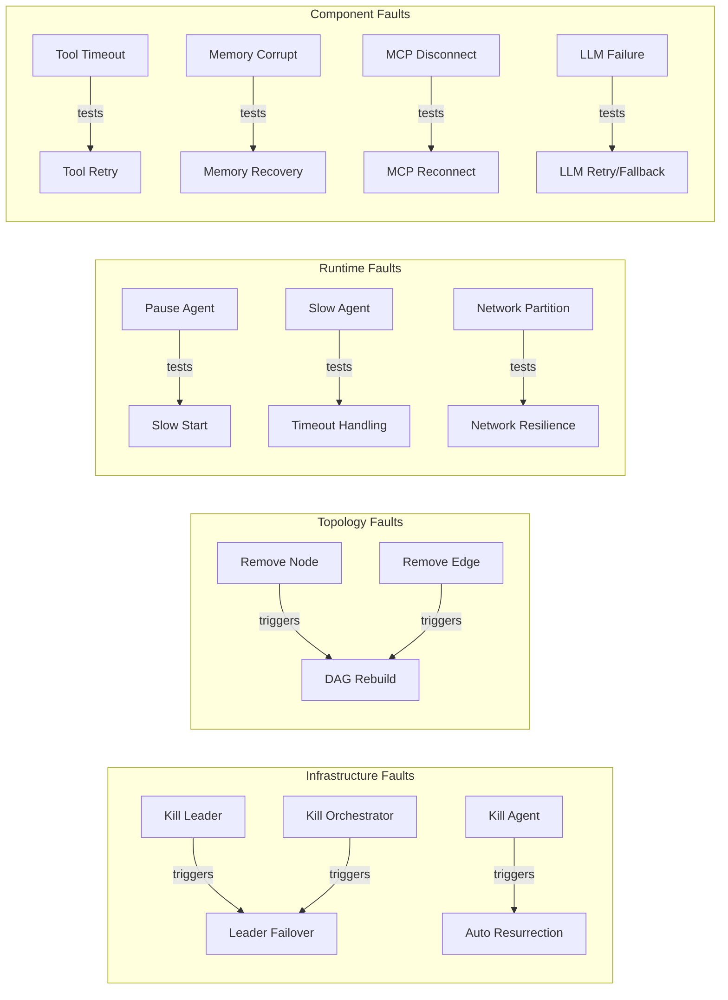
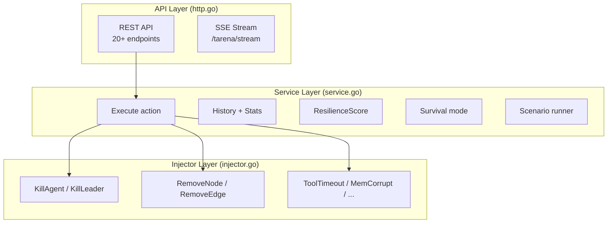
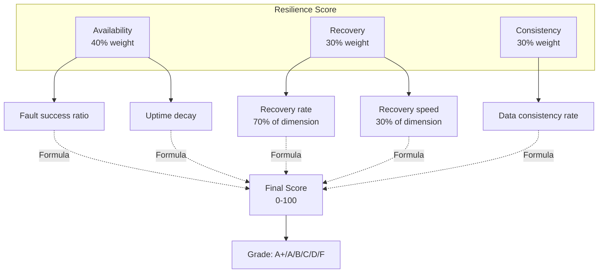
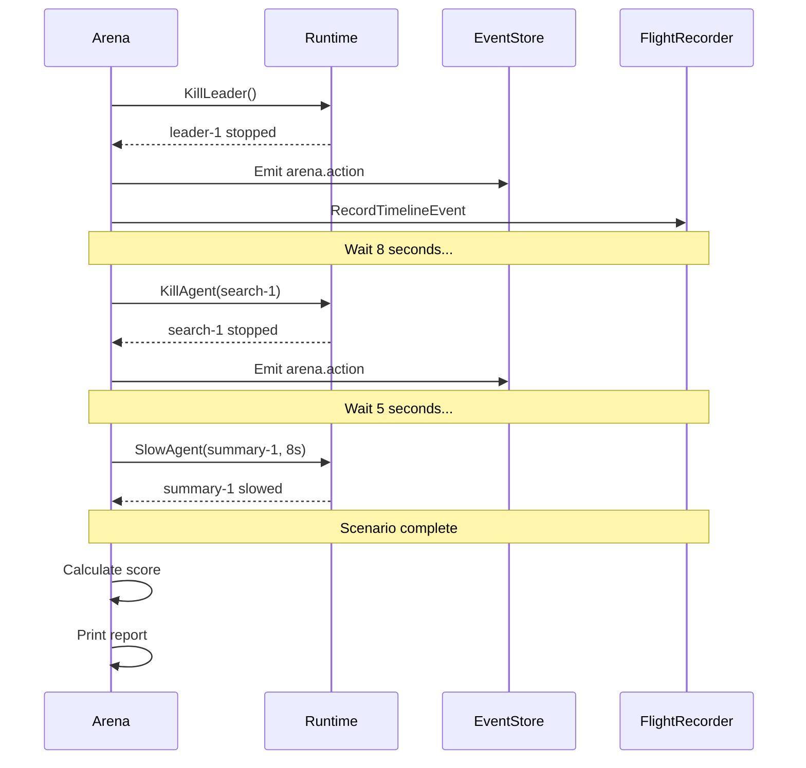
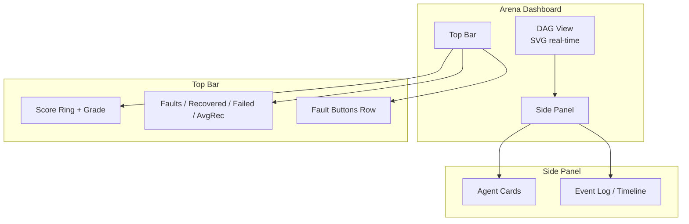
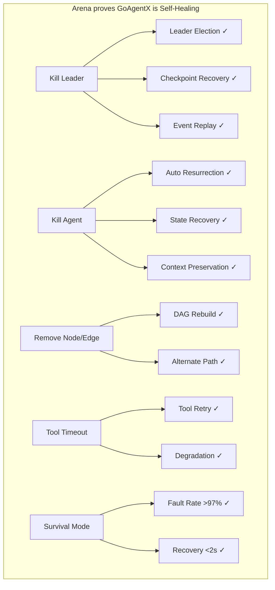

# GoAgentX Architecture Deep Dive (9): Arena / Fault Injection — Break It, Watch It Recover

> Most agent frameworks show you how smart their agents are. GoAgentX shows you what happens when you deliberately kill them — assassinate the leader, delete DAG nodes, cut network connections, corrupt memory — and watch the system heal itself in real time.

---

## 1. Why I Built a "Break Things" Button

You might not believe this, but Arena was inspired by a production incident.

I was testing agent stability and manually killed a process. The agent auto-resurrected and continued working. I was excited — but then I thought: **I only tested this manually. Can I automate it?**

So I built Arena — a module whose sole purpose is to break things. Not to show how smart agents are. To show that agents survive when you continuously try to kill them.

Arena's secret is dead simple: **it doesn't implement its own Runtime, DAG, or recovery logic. It just calls the existing dangerous APIs (StopAgent, RemoveNode, RemoveEdge) and watches the system heal itself.**



Core files:

| File | Purpose |
|------|---------|
| `internal/arena/types.go` | ActionType, Action, Result, Stats |
| `internal/arena/injector.go` | FaultInjector — wraps runtime + DAG APIs |
| `internal/arena/service.go` | Arena Service — executes actions, records history |
| `internal/arena/http.go` | REST API + SSE streaming |
| `internal/arena/scenario.go` | Scenario runner — scheduled fault sequences |
| `internal/arena/survival.go` | Survival mode — continuous random faults |
| `internal/arena/metrics.go` | MetricsCollector — recovery timing + counts |
| `internal/arena/score.go` | ResilienceScore — 3-dimensional scoring |
| `internal/arena/integration.go` | FlightBridge — arena → flight recorder |
| `internal/dashboard/static/app.js` | Frontend: DAG visualization, control panel, event log |
| `cmd/arena/main.go` | CLI: run / validate / list / survival / inspect / serve |

---

## 2. Architecture

### 2.1 Core Design Principle

Arena does **not** implement its own Runtime, DAG, or Recovery system. It is a thin layer that calls existing APIs:

```go
func (in *Injector) KillAgent(ctx context.Context, id string) error {
    return in.runtime.StopAgent(ctx, id)
    // Resurrection is handled automatically by the existing plugin
}

func (in *Injector) RemoveNode(ctx context.Context, id string) error {
    return in.dag.RemoveNode(ctx, id)
    // MutableDAG rebuilds topology automatically
}
```

### 2.2 Fault Types — 13 Chaos Actions

```go
const (
    ActionKillLeader       ActionType = "kill_leader"
    ActionKillAgent        ActionType = "kill_agent"
    ActionRemoveNode       ActionType = "remove_node"
    ActionRemoveEdge       ActionType = "remove_edge"
    ActionPauseAgent       ActionType = "pause_agent"
    ActionResumeAgent      ActionType = "resume_agent"
    ActionSlowAgent        ActionType = "slow_agent"
    ActionKillOrchestrator ActionType = "kill_orchestrator"
    ActionNetworkPartition ActionType = "network_partition"
    ActionToolTimeout      ActionType = "tool_timeout"
    ActionMemoryCorrupt    ActionType = "memory_corrupt"
    ActionMCPDisconnect    ActionType = "mcp_disconnect"
    ActionLLMFailure       ActionType = "llm_failure"
)
```



### 2.3 Three-Layer Architecture



---

## 3. Fault Injection

### 3.1 Injector Design

The `Injector` depends on two interfaces — `RuntimeProvider` and `DAGProvider` — both of which are subsets of the full runtime/DAG capabilities:

```go
type RuntimeProvider interface {
    StopAgent(ctx context.Context, agentID string) error
    ListAgents() []runtime.AgentInfo
    PauseAgent(ctx context.Context, agentID string) error
    ResumeAgent(ctx context.Context, agentID string) error
    SlowAgent(ctx context.Context, agentID string, delay time.Duration) error
    PartitionNetwork(ctx context.Context, agentID string) error
    ToolTimeout(ctx context.Context, agentID string, timeout time.Duration) error
    CorruptMemory(ctx context.Context, agentID string) error
    DisconnectMCP(ctx context.Context, agentID string) error
    InjectLLMFailure(ctx context.Context, agentID string, errType string) error
}

type DAGProvider interface {
    RemoveNode(ctx context.Context, id string) error
    RemoveEdge(ctx context.Context, from, to string) error
}
```

This interface-based design means Arena doesn't import concrete Runtime or DAG packages — it only needs a small API surface. Any type implementing these interfaces can be used, making Arena testable with mocks.

### 3.2 Kill Leader — The Signature Move

Killing the leader is Arena's most impactful demonstration. It proves three capabilities at once:

```go
func (in *Injector) KillLeader(ctx context.Context) (string, error) {
    leaderID := ""
    for _, info := range in.runtime.ListAgents() {
        if info.Type == "leader" {
            leaderID = info.ID
            break
        }
    }
    if leaderID == "" {
        return "", ErrLeaderNotFound
    }
    if err := in.runtime.StopAgent(ctx, leaderID); err != nil {
        return "", fmt.Errorf("arena: kill leader %s: %w", leaderID, err)
    }
    return leaderID, nil
}
```

The causal chain:
1. Arena calls `StopAgent("leader-1")`
2. Runtime marks the agent as stopped
3. Agent goroutine exits
4. `NotifyAgentDead` is called
5. LeaderSupervisor detects leader absence
6. Failover triggers: election → checkpoint recovery → event replay
7. New leader is promoted and running within seconds

---

## 4. Service Layer

### 4.1 Action Execution

The `Service` routes each action type to the corresponding injector method:

```go
func (s *Service) Execute(ctx context.Context, action Action) Result {
    start := time.Now()
    var err error

    switch action.Type {
    case ActionKillLeader:
        _, err = s.injector.KillLeader(ctx)
    case ActionKillAgent:
        err = s.injector.KillAgent(ctx, action.TargetID)
    case ActionRemoveNode:
        err = s.injector.RemoveNode(ctx, action.TargetID)
    case ActionRemoveEdge:
        err = s.injector.RemoveEdge(ctx, action.SourceID, action.TargetID)
    case ActionToolTimeout:
        timeout, _ := parseDuration(action, 5*time.Second)
        err = s.injector.ToolTimeout(ctx, action.TargetID, timeout)
    // ... 13 cases total
    }

    result := Result{Success: err == nil, Duration: time.Since(start)}
    s.recordMetrics(action.Type, result.Success, result.Duration)
    s.emitEvent(ctx, action, result)
    return result
}
```

### 4.2 Event Emission

Every action result is emitted as an event in the EventStore:

```go
ev := &events.Event{
    ID:       events.NewEventID(),
    StreamID: "arena",
    Type:     events.EventType("arena.action.executed"),
    Payload: map[string]any{
        "action_id": action.ID,
        "type":      string(action.Type),
        "target_id": action.TargetID,
        "success":   result.Success,
        "duration":  result.Duration.String(),
    },
}
s.store.Append(ctx, "arena", []*events.Event{ev}, 0)
```

These events flow through the EventStore's `Subscribe` mechanism to the SSE endpoint, where the Dashboard's frontend consumes them in real time.

---

## 5. Resilience Score

### 5.1 Three-Dimensional Scoring

The score is calculated across three dimensions:



**Availability (40%)**: `(TotalFaults - FailedFaults) / TotalFaults * 100`. Measures how many faults were successfully injected vs failed.

**Recovery (30%)**: `RecoveryRate * 0.7 + SpeedScore * 0.3`. Recovery rate is the success ratio; speed score decays linearly from 100 (≤1s) to 0 (≥10s).

**Consistency (30%)**: Based on `DataConsistencyRate` from metrics, or a heuristic estimation from failure counts.

### 5.2 Grade Thresholds

| Score Range | Grade |
|-------------|-------|
| ≥ 95 | A+ |
| ≥ 90 | A |
| ≥ 80 | B |
| ≥ 70 | C |
| ≥ 60 | D |
| < 60 | F |

---

## 6. Scenario Runner

Scenarios define scheduled sequences of chaos actions:

```yaml
name: leader-failover-storm
config:
  stop_on_error: true
  warmup: 3s
  cooldown: 10s
  timeout: 2m

actions:
  - delay: 0s
    action:
      type: kill_leader
    label: assassinate-leader
    expect_success: true

  - delay: 8s
    action:
      type: kill_agent
      target_id: ""
    label: verify-new-leader

  - delay: 5s
    action:
      type: slow_agent
      target_id: ""
      metadata:
        duration: 8s
    label: stress-test-new-leader
```



Two complete scenarios are included:
- **`leader_assassination.yaml`**: 4-phase — kill leader → verify new leader → kill random agent → slow agent under load
- **`cascading_storm.yaml`**: 7-phase — network partition → kill → tool timeout → memory corrupt → MCP disconnect → LLM failure → slow cascade

---

## 7. Survival Mode

Survival mode runs continuous random faults for a configured duration:

```go
func (s *Service) RunSurvival(ctx context.Context, cfg SurvivalConfig) SurvivalReport {
    ticker := time.NewTicker(cfg.Interval)
    defer ticker.Stop()

    for {
        select {
        case <-ctx.Done():
            return s.buildReport(timeline)
        case <-ticker.C:
            if time.Since(start) > cfg.Duration {
                return s.buildReport(timeline)
            }
            action := s.randomChaosAction()
            result := s.Execute(ctx, action)
            // Record and continue...
        }
    }
}
```

The random action generator selects from all 13 fault types with random targets. Running via CLI:

```bash
goagentx arena survival --addr http://localhost:8080 --duration 30m --interval 10s
```

Live output during survival:
```
Elapsed: 12s         Actions: 1     Score: 100.0 (A+)
Elapsed: 22s         Actions: 2     Score: 97.3 (A+)
Elapsed: 32s         Actions: 3     Score: 97.3 (A+)
```

---

## 8. Dashboard Integration

### 8.1 Frontend

The Arena tab in the GoAgentX Dashboard provides:



**13 fault buttons**: ☠Leader / ⚙Orch / Kill / ✕Node / ✕Edge / ⏸Pause / ▶Resume / 🐌Slow / 🗡Partition / ⏰Timeout / 📚MemCorrupt / 📱MCP DC / 🧠LLM Fail

**Event Log** streams real-time recovery narratives:
```
10:01:02 ✗ kill_leader → Leader killed
10:01:04 ✓ kill_leader → New leader elected
10:01:06 ✓ workflow → Workflow resumed
```

**Resilience Score Ring** animates with each fault.

### 8.2 SSE Stream

The frontend connects via `EventSource`:

```javascript
const SSE = new EventSource('/arena/stream');
SSE.onmessage = (e) => {
    const ev = JSON.parse(e.data);
    addEvent(ev);      // append to timeline
    renderScore();     // update score ring
    renderDAG();       // recolor agent nodes
};
```

### 8.3 Flight Recorder Bridge

Arena actions are also recorded in the Flight Recorder for post-mortem analysis:

```go
type FlightBridge struct {
    recorder *flight.FlightRecorder
}

func (b *FlightBridge) OnActionExecuted(action Action, result Result) {
    // Timeline event for visualization
    b.recordTimelineEvent(action, result)

    // Diagnostic record for failed actions
    if !result.Success {
        b.recordDiagnostic(action, result)
    }
}
```

The `arena inspect` CLI command queries these records:

```bash
goagentx arena inspect --addr http://localhost:8080
```

```
═══════════════════════════════════════════════════════
  Arena Inspection Report
═══════════════════════════════════════════════════════

  Score:          92.4 (A)
  Recovery Rate:  92.9%
  Faults:         32 total, 31 recovered, 1 failed

  Metrics:
    Avg Recovery Time: 1.4s
    Min Recovery Time: 200ms
    Max Recovery Time: 3.2s
    Failovers:         2
    Data Consistency:  95.0%

  Timeline Events: 47
    ✓ kill_leader
    ✓ tool_timeout
    ✗ llm_failure
    ...

  Diagnostics: 8 failures
  Category Breakdown:
    concurrency_error         3  (37.5%)
    tool_timeout              2  (25.0%)
    network_error             1  (12.5%)
    ...
```

---

## 9. CLI Commands

| Command | Description |
|---------|-------------|
| `goagentx arena run <scenario.yaml>` | Run a scenario against remote server |
| `goagentx arena validate <scenario.yaml>` | Validate scenario file locally |
| `goagentx arena list [dir]` | List scenario files in directory |
| `goagentx arena serve [--addr]` | Start arena HTTP server |
| `goagentx arena survival [--addr] [--duration]` | Start survival mode (live progress) |
| `goagentx arena inspect [--addr]` | Post-mortem inspection report |

---

## 10. Architectural Summary

### Design Patterns

| Pattern | Location | Purpose |
|---------|----------|---------|
| Facade | `Injector` | Wraps Runtime + DAG into single chaos interface |
| Strategy | `ActionType` → `Service.Execute` | Dispatch 13 fault types |
| Observer | SSE stream | Real-time event push to dashboard |
| Decorator | `FlightBridge` | Augment arena actions with flight recording |
| Composite | `Scenario` | Multiple scheduled actions as one run |
| Debounce | `lastChecked` (compactor) | Avoid redundant compaction checks |

### What Arena Proves



### File Index

| File | Purpose |
|------|---------|
| `internal/arena/types.go` | ActionType, Action, Result, Stats |
| `internal/arena/injector.go` | Fault injection methods (13 types) |
| `internal/arena/service.go` | Action execution, history, metrics, event emission |
| `internal/arena/http.go` | REST API (26 routes), SSE, route registration |
| `internal/arena/scenario.go` | YAML scenario loading, validation, execution |
| `internal/arena/survival.go` | Continuous random fault injection |
| `internal/arena/metrics.go` | Recovery timing, failover counting, consistency |
| `internal/arena/score.go` | 3-dimension weighted scoring + grade mapping |
| `internal/arena/integration.go` | FlightBridge to flight recorder |
| `internal/dashboard/static/app.js` | Frontend: DAG, control panel, event log, score |
| `cmd/arena/main.go` | CLI: run, validate, list, survival, inspect, serve |
| `examples/arena/leader_assassination.yaml` | 4-phase leader failover scenario |
| `examples/arena/cascading_storm.yaml` | 7-phase multi-vector chaos scenario |

---

## 11. Conclusion

Arena is the feature I'm most proud of. Not because the technology is impressive — because it shows something most frameworks don't: **can your system survive when you deliberately try to destroy it?**

13 fault types. Scriptable scenarios. Survival mode. Real-time dashboard. Flight recorder integration. 3D resilience scoring. Together, they turn `goagentx arena run cascading_storm.yaml` from a test command into a demo that makes people say "wait, that actually works?"

I showed a friend once: opened the Dashboard, clicked "Assassinate Leader," the agent died... then 1.4 seconds later it auto-resurrected. He said: "Holy shit, it came back."

I thought: **Yeah. That's exactly why I built this.**

> "Break it. Watch it recover." — The most memorable demo GoAgentX has to offer, and the biggest source of satisfaction in building this framework.
