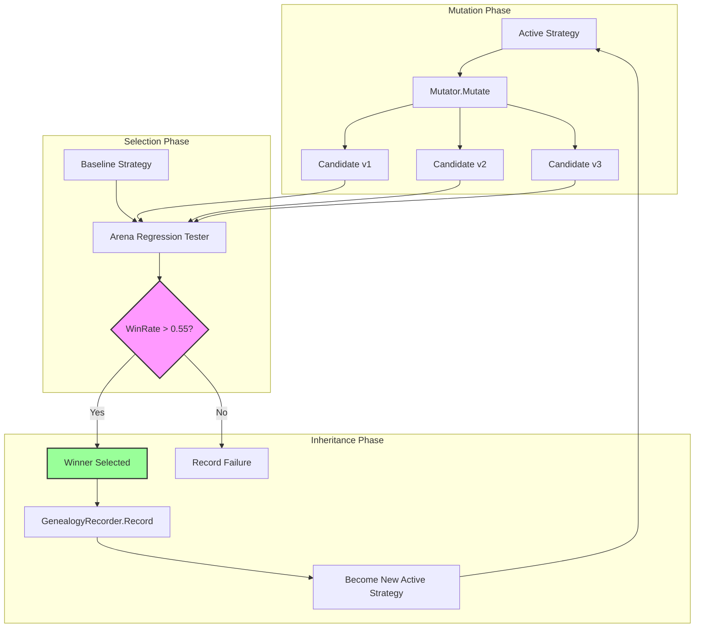
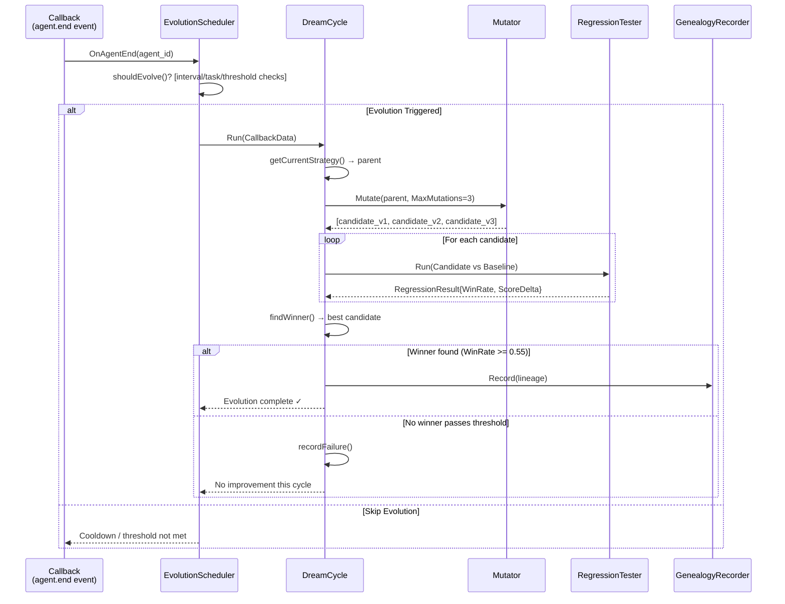
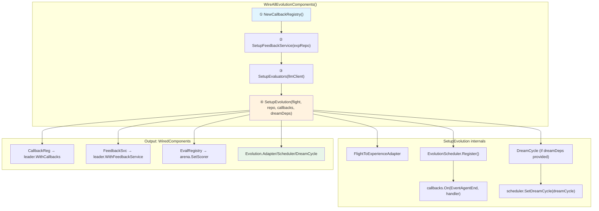

# GoAgentX Architecture Deep Dive (IV): Autonomous Evolution — When Agents Learn to Improve Themselves

> Have you ever wondered why agents can't get smarter with use?
> They make the same mistake twice. Every time they solve a problem, next time they start from scratch.
> If humans can learn from mistakes, why can't agents?
> I thought to myself: **What if we borrowed a page from biology?** Mutation, selection, inheritance — evolution itself is just a feedback loop running for 3.8 billion years.
> And so GoAgentX's Autonomous Evolution system was born — teaching agents to dream, mutate, test, and evolve.

---

## 1. A Naive Idea: Just Tweak the Prompt

Let me start with the wrong turn I took first.

When I first thought about "making agents smarter over time," my instinct wasn't building an evolution engine — it was **tweaking the system prompt**. The idea seemed obvious enough:

> Every time the agent makes a mistake, append a lesson to the system prompt: "Don't do X again." Over time, the prompt accumulates wisdom.

I hacked together something like this:

```go
type PromptLearner struct {
    basePrompt string
    lessons    []string
    maxLessons int
}

func (l *PromptLearner) LearnFromMistake(mistake string, correction string) {
    lesson := fmt.Sprintf("- When %s, instead do: %s", mistake, correction)
    l.lessons = append(l.lessons, lesson)
    if len(l.lessons) > l.maxLessons {
        l.lessons = l.lessons[len(l.lessons)-l.maxLessons:]
    }
}

func (l *PromptLearner) BuildPrompt() string {
    var sb strings.Builder
    sb.WriteString(l.basePrompt)
    sb.WriteString("\n\n## Learned Lessons:\n")
    for _, lesson := range l.lessons {
        sb.WriteString(lesson + "\n")
    }
    return sb.String()
}
```

This looked elegant at first glance. O(n) append, simple truncation, no database needed. In the early "get it running" phase, this approach was irresistibly tempting.

But after running it for a while, everything fell apart.

### Prompts Get Too Long

Each lesson adds ~50-100 tokens. After 100 mistakes, you've got 5K-10K tokens of lessons stuffed into every single request. The LLM spends half its attention window reading past failures instead of focusing on the current task. And the worst part? **Old lessons contradict new ones** — "always use strict mode" vs "sometimes relax strict mode for edge cases." The agent gets confused by its own accumulated wisdom.

### No Quantifiable Feedback

The prompt learner has no concept of whether a lesson actually helped. Did adding "don't timeout on long queries" improve success rate? Who knows? There's no scoring mechanism, no A/B test, nothing. You're just hoping that more text equals better behavior.

### No Feedback Loop

Even if a lesson works, there's no mechanism to reinforce it or retire it. Good lessons sit next to bad ones with equal weight. The system can't distinguish between "this saved us 3 times" and "this was added by accident once."

### Lessons Learned

The reason prompt tweaking didn't work boils down to one thing: **what agents need isn't more instructions — it's a structured process for generating, testing, and selecting better strategies.**

These two differ by a dimension. The former is a prompt engineering problem; the latter is a systems problem. Using prompt engineering to solve self-improvement is like using a hammer to fix a watch — you might get lucky once, but you'll break something eventually.

That's when I went back to fundamentals and asked: what does it actually take for an agent to improve itself?

---

## 2. Core Insight: Evolution = Mutation + Selection + Inheritance

I realized that nature had already solved this problem. Biological evolution is just a feedback loop that's been running for billions of years. Let me map the concepts:

| Biological Concept | Agent Evolution Equivalent | Implementation |
|---|---|---|
| **Mutation** | Change parameters / prompts / tools | `Mutator.Mutate()` |
| **Selection** | Arena regression testing (new vs old) | `RegressionTester.Run()` |
| **Inheritance** | Genealogy recording strategy lineage | `GenealogyRecorder.Record()` |
| **Fitness** | Evaluator score + Arena WinRate | `LLMJudgeEvaluator.Evaluate()` |
| **Generation** | One complete Dream Cycle | `DreamCycle.Run()` |

The complete loop looks like this:



Each cycle produces a slightly better (or equally good) strategy. Over hundreds of cycles, the agent accumulates small improvements that compound — exactly how biological evolution works.

The key design principle: **every mutation must be tested before adoption.** No "trust me, this prompt is better" — prove it in the arena first.

---

## 3. Infrastructure Audit: 75% Already Here

Here's what surprised me most during this project: when I sat down to build autonomous evolution, I discovered that **most of the infrastructure already existed**. GoAgentX had been quietly accumulating the pieces without anyone connecting them.

Let me walk through each piece that was already lying around.

### Experience System — Bandit Ranking (`internal/experience/`)

The experience system already had a bandit-style feedback loop. `FeedbackService` records successes and failures per experience:

```go
// From internal/experience/feedback_service.go
func (s *FeedbackService) RecordSuccess(ctx context.Context, experienceID string) error {
    if experienceID == "" {
        return nil
    }
    if err := s.experienceRepo.IncrementUsageCount(ctx, experienceID); err != nil {
        return fmt.Errorf("record success feedback: %w", err)
    }
    return nil
}

func (s *FeedbackService) RecordFailure(ctx context.Context, experienceID string) error {
    if experienceID == "" {
        return nil
    }
    if err := s.experienceRepo.DecrementRank(ctx, experienceID); err != nil {
        return fmt.Errorf("record failure feedback: %w", err)
    }
    return nil
}
```

And `RankingService` implements multi-signal ranking with usage boost and recency decay:

```go
// From internal/experience/ranking_service.go
// FinalScore = SemanticScore + UsageBoost + RecencyBoost
//
// Where:
// - UsageBoost = min(log(1 + usage_count) * weight, 0.2)
// - RecencyBoost = exp(-age_days / recency_days) * weight
func (s *RankingService) Rank(ctx context.Context, experiences []*Experience, baseScores []float64) []*RankedExperience {
    // ... calculates final score combining semantic similarity,
    // logarithmic usage boost (capped at 0.2), and exponential recency decay
}
```

The ranking formula uses `log(1 + count)` for usage boost — preventing old experiences from dominating — and caps the maximum boost at 0.2. Recency follows exponential decay with a configurable half-life (default 30 days). This is a proper lightweight bandit system, not just a sort-by-date hack.

### Callback System — Event Hooks (`internal/callbacks/`)

The callback system was already there, ready to emit lifecycle events:

```go
// From internal/callbacks/callbacks.go
const (
    EventLLMStart   Event = "llm.start"
    EventLLMEnd     Event = "llm.end"
    EventAgentStart Event = "agent.start"
    EventAgentEnd   Event = "agent.end"
    EventToolStart  Event = "tool.start"
    EventToolEnd    Event = "tool.end"
)

type Registry struct {
    handlers map[Event][]Handler
    mu       sync.RWMutex
}

func (r *Registry) On(event Event, handler Handler) {
    r.mu.Lock()
    defer r.mu.Unlock()
    r.handlers[event] = append(r.handlers[event], handler)
}

func (r *Registry) Emit(ctx *Context) {
    // Dispatches to all registered handlers sequentially
    // With panic recovery per handler
}
```

Nine event types, thread-safe registry, panic recovery per handler. This is the nervous system of the entire evolution architecture — every trigger flows through here.

### Eval Engine — LLM-as-Judge (`internal/eval/`)

The evaluation framework already supported LLM-based judging for open-ended tasks:

```go
// From internal/eval/llm_judge.go
type LLMJudgeEvaluator struct {
    client     LLMClient
    promptTmpl *template.Template
    scale      ScaleType // ScaleOneToTen | ScaleOneToFive | ScalePassFail
}

func (e *LLMJudgeEvaluator) Evaluate(ctx context.Context, tc TestCase, result TestResult) ([]EvalScore, error) {
    // 1. Render prompt template with test case data
    prompt, err := e.renderPrompt(tc, result)
    // 2. Call LLM for judgment
    rawResponse, err := e.client.Generate(ctx, prompt)
    // 3. Parse JSON response into score + reasoning
    judgeResp, err := e.parseResponse(rawResponse)
    // 4. Normalize to [0, 1] based on scale type
    normalizedScore := judgeResp.Score / e.scale.maxScore()
    return []EvalScore{{Metric: "llm_judge", Score: normalizedScore}}, nil
}
```

Three scale types (1-10, 1-5, pass/fail), robust JSON extraction from LLM responses (handles markdown fences, nested objects), and normalization to [0,1]. This is the fitness function for our evolution arena.

### Flight Recorder — Decision Logging (`internal/flight/`)

The flight recorder was already capturing diagnostic data from every agent execution — timeouts, LLM errors, parse failures, concurrency issues. Each record includes category, root cause, suggestion, and severity level. This is the raw material that the evolution adapter mines for experiences.

### Memory Distillation — Knowledge Extraction

Covered in Deep Dive III. The distillation pipeline converts raw conversations into structured experiences with vector embeddings. Two paths coexist: lightweight O(1) extraction for high-frequency tasks and full LLM-powered distillation for high-value ones.

### DevAgent — Code Generation

The DevAgent can generate, modify, and validate code. In future iterations, this becomes the tool-generation engine for Level 3 evolution (automatic tool creation).

### Summary: What We Had vs. What We Built

| Component | Status Before | Status Now |
|---|---|---|
| Experience/Bandit System | Implemented, isolated | Wired into feedback loop |
| Callback Registry | Implemented, zero registrations | Registered for agent.end events |
| LLM Judge | Implemented, standalone | Integrated as arena scorer |
| Flight Recorder | Implemented, read-only | Connected via adapter |
| Memory Distillation | Implemented, separate | Bridged to experience store |
| Mutator | Non-existent | Full parameter + prompt mutation |
| Regression Tester | Basic arena tests | Adapted for strategy comparison |
| Dream Cycle Orchestrator | Non-existent | Full evolution loop |
| Genealogy Recorder | Non-existent | Lineage tracking interface |
| Bootstrap Wiring | Manual, fragmented | Single `WireAllEvolutionComponents()` call |

**75% of the pieces were already built.** They were just sitting in separate packages, never talking to each other. The real work wasn't writing new code — it was wiring existing components together.

---

## 4. Five Broken Links

When I started connecting the dots, I found five places where the chain was broken. Each one seems small in isolation, but together they meant the entire evolution loop couldn't close. Let me walk through each fix.

### Broken Link #1: Bandit Feedback Loop — UsageCount Always Zero

The `RankingService` calculated usage boosts, but nobody ever called `RecordSuccess`. Experiences were retrieved, used in tasks, and then... silence. The `UsageCount` stayed at zero forever because the feedback path was never wired.

**Before**: Task completes → experience used → nothing happens → UsageCount = 0

**After**: Task completes → experience used → `FeedbackService.RecordSuccess(experienceID)` → UsageCount increments → RankingService sees higher usage → same experience ranks higher next time

The fix lives in `bootstrap.go`'s `SetupFeedbackService`:

```go
// From internal/bootstrap/bootstrap.go
func SetupFeedbackService(expRepo repositories.ExperienceRepositoryInterface) *experience.FeedbackService {
    if expRepo == nil {
        return nil
    }
    svc := experience.NewFeedbackService(expRepo)
    return svc
}
```

And gets injected into the LeaderAgent via `leader.WithFeedbackService(svc)` at construction time. Now every task completion triggers the feedback loop.

### Broken Link #2: Callback System — Zero Registration, Zero Emission

The callback `Registry` existed, `Emit` worked perfectly, but **nobody ever called `On()` to register any handlers**. It was like having a telephone exchange with no phones connected.

Look at the scheduler's registration:

```go
// From internal/evolution/scheduler.go
func (s *EvolutionScheduler) Register() {
    if s.callbacks == nil {
        slog.Warn("[Evolution] Callback registry is nil, cannot register")
        return
    }
    s.callbacks.On(callbacks.EventAgentEnd, func(ctx *callbacks.Context) {
        data := CallbackData{AgentID: ctx.AgentID}
        callbackCtx := context.Background()
        if ctx.Extra != nil {
            for k, v := range ctx.Extra {
                callbackCtx = context.WithValue(callbackCtx, k, v)
            }
        }
        callbackCtx = context.WithValue(callbackCtx, "agent_id", ctx.AgentID)
        s.OnAgentEnd(callbackCtx, data)
    })
}
```

This one line — `s.callbacks.On(callbacks.EventAgentEnd, ...)` — is what closes the trigger loop. Every time an agent finishes a task, the scheduler gets notified and decides whether to kick off an evolution cycle. Without this registration, the entire evolution system is deaf to agent activity.

### Broken Link #3: Missing LLM Judge Integration

We had `LLMJudgeEvaluator`, we had the arena, but nobody connected them. The arena's `Scorer` interface was generic:

```go
// From internal/arena/regression.go
type Scorer interface {
    Score(input any) (float64, error)
}
```

Any implementation works. But for strategy comparison, we need something that can judge agent output quality. Enter the bootstrap wiring:

```go
// From internal/bootstrap/bootstrap.go
func SetupEvaluators(llmClient *llm.Client, registry *eval.EvaluatorRegistry) error {
    judge, err := eval.NewLLMJudgeEvaluator(llmClient,
        eval.WithChinesePrompt(),
        eval.WithScale(eval.ScaleOneToTen),
    )
    if err != nil {
        return fmt.Errorf("create llm judge: %w", err)
    }
    if err := registry.Register("llm_judge", judge); err != nil {
        return fmt.Errorf("register llm judge: %w", err)
    }
    return nil
}
```

Now the arena can use `"llm_judge"` as its scorer, giving us quantifiable fitness scores for strategy selection.

### Broken Link #4: Two Distillation Systems Disconnected

Memory Distillation writes to the `memory` pipeline. Evolution reads from the `experience` repository. These were two separate tables, two separate concepts, never bridged.

The fix is `NewExperienceStoreAdapter` in bootstrap:

```go
// From internal/bootstrap/bootstrap.go
type experienceStoreAdapter struct {
    repo repositories.ExperienceRepositoryInterface
}

func (a *experienceStoreAdapter) Create(ctx context.Context, exp *distillation.StoredExperience) error {
    model := &models.Experience{
        TenantID:  exp.TenantID,
        Type:      exp.Type,
        Problem:   exp.Problem,
        Solution:   exp.Solution,
        Score:     exp.Score,
        Success:   exp.Score > 0.5,
        Metadata:  metadata,
        CreatedAt: time.Now().UTC(),
    }
    return a.repo.Create(ctx, model)
}
```

This adapter implements `distillation.ExperienceStore` by delegating to `repositories.ExperienceRepositoryInterface`. The Distiller now writes directly into the experience table that the evolution system reads from. One bridge, two systems connected.

### Broken Link #5: Flight Data Observed But Never Acted On

The Flight Recorder collected beautiful diagnostic data — categories, root causes, suggestions, severities — but nobody consumed it. It was like having a security camera that records everything but nobody watches the feed.

The `FlightToExperienceAdapter` is the consumer:

```go
// From internal/evolution/adapter.go
func (a *FlightToExperienceAdapter) Run(ctx context.Context) error {
    subscriber := a.flight.EventStore()
    ch, err := subscriber.Subscribe(ctx, events.EventFilter{
        Types: []events.EventType{
            events.EventTaskFailed,
            events.EventStepFailed,
            events.EventStepRecoveryFailed,
        },
    })
    // ... listens for failure events, extracts diagnostics, creates experiences
}

func (a *FlightToExperienceAdapter) buildExperience(record DiagnosticRecord, agentID string) *Experience {
    if record.Severity < 3 { return nil } // Skip low-severity noise
    score := severityToScore(record.Severity) // Higher severity = lower score
    return &Experience{
        Type:     TypeFailure,
        Problem:  fmt.Sprintf("[%s] %s", record.Category, record.RootCause),
        Solution: solution,
        Score:    score,
        Source:   "flight_recorder",
    }
}
```

Notice the design decision: **only failure events generate experiences**, and only those with severity >= 3. Normal executions are noise — we want to learn from mistakes, not from routine operations. The score is inversely proportional to severity: severe failures get low scores (patterns to avoid), minor issues get higher scores (less critical).

---

## 5. Dream Mode: When Agents Dream

This is the centerpiece of the entire evolution system. Dream Mode is what happens when the agent isn't serving user requests — it enters a dormant state where it mutates its own strategy, tests variants against historical data, and adopts improvements.

### What Happens During a Dream Cycle



### Three-Level Mutation Gradient

The Mutator supports three levels of mutation, each more powerful than the last:

**Level 1: Parameter Mutation (80% probability)**

```go
// From internal/evolution/mutation/mutator.go
func (m *Mutator) mutateParameter(parent *Strategy) (*Strategy, error) {
    child := parent.Clone()
    candidates := m.mutableParamNames(child.Params)
    paramName := candidates[0] // Pick random mutable param
    newVal := m.pickDifferentValue(rangeDef.Values, child.Params[paramName])
    child.Params[paramName] = newVal
    child.MutationDesc = fmt.Sprintf("parameter %q changed to %v", paramName, newVal)
    return child, nil
}
```

Default mutable parameters come pre-configured:

```go
// From internal/evolution/mutation/types.go
var DefaultParamRanges = map[string]ParamRange{
    "temperature":        {Values: []any{0.1, 0.3, 0.5, 0.7, 0.9}},
    "top_k":             {Values: []any{10, 20, 40, 80}},
    "max_steps":         {Values: []any{5, 10, 15, 20}},
    "memory_limit":      {Values: []any{3, 5, 10}},
    "conflict_threshold": {Values: []any{0.85, 0.90, 0.95}},
}
```

Temperature, top-k, max steps, memory limit, conflict threshold — these are the knobs that control agent behavior. Each mutation picks one knob and changes it to a different value from the allowed range.

**Level 2: Prompt Template Mutation (20% probability)**

```go
// From internal/evolution/mutation/mutator.go
func (m *Mutator) mutatePrompt(parent *Strategy) (*Strategy, error) {
    child := parent.Clone()
    newTemplate := m.pickDifferentString(m.promptPool, parent.PromptTemplate)
    child.PromptTemplate = newTemplate
    child.MutationDesc = "prompt template changed"
    return child, nil
}
```

Requires a non-empty `promptPool` configured via `WithPromptPool(...)`. Swaps the entire prompt template — a much larger behavioral change than tweaking temperature.

**Level 3: Tool Generation (Reserved)**

Defined in the `MutationType` enum but not yet implemented:

```go
// From internal/evolution/mutation/types.go
const (
    MutationParameter MutationType = iota + 1
    MutationPrompt
    MutationTool // TODO: reserved for Iteration 3
)
```

This is where DevAgent would automatically generate new tools based on observed patterns. Imagine the agent realizing "I keep doing this 5-step workaround for API rate limiting" and generating a dedicated `RateLimitHandler` tool. That's Level 3.

### Arena Role Reversal: From "Breaking Agents" to "Validation Gateway"

The Arena subsystem was originally designed for fault injection — stress-testing agents by throwing edge cases at them. In the evolution context, its role flips: instead of trying to **break** the agent, it tries to **validate** that a mutated strategy is genuinely better.

The regression tester runs both baseline and candidate strategies through the same test suite:

```go
// From internal/arena/regression.go
func (rt *RegressionTester) Run(ctx context.Context, cfg RegressionConfig) (*RegressionResult, error) {
    var oldScores, newScores []float64
    g, gCtx := errgroup.WithContext(ctx)

    g.Go(func() error {
        scores, err := rt.runStrategy(gCtx, cfg.OldStrategy, cfg.BaselineRuns)
        oldScores = scores
        return nil
    })

    g.Go(func() error {
        scores, err := rt.runStrategy(gCtx, cfg.NewStrategy, cfg.CompareRuns)
        newScores = scores
        return nil
    })

    // ... builds result with Welch's t-test significance
}
```

Both strategies run concurrently via `errgroup`. The result includes:

- **WinRate**: Fraction of pairwise comparisons where candidate >= baseline
- **Confidence**: Statistical significance via Welch's t-test approximation
- **PValue**: Computed p-value for the significance check

Only candidates passing both thresholds (`WinRate >= MinWinRate` defaulting to 0.55 AND statistically significant) are considered winners. This prevents adopting mutations that win by luck.

### The DreamCycle Orchestrator

Putting it all together, `DreamCycle.Run()` is the conductor:

```go
// From internal/evolution/dream_cycle.go
func (dc *DreamCycle) Run(ctx context.Context, data CallbackData) error {
    dc.taskCount++

    // Guard rails: enabled?, cooldown?, minimum tasks?
    if !dc.config.Enabled { return nil }
    if time.Since(dc.lastCycle) < dc.config.Cooldown { return nil }
    if taskCount < dc.config.MinTasksBeforeEvolve { return nil }
    if !dc.scheduler.shouldEvolve(ctx, data) { return nil }

    // Step 1: Get parent strategy
    parent, err := dc.getCurrentStrategy()

    // Step 2: Generate candidates
    candidates, err := dc.mutator.Mutate(ctx, parent, dc.config.MaxMutations)

    // Step 3: Find winner via arena
    winner, err := dc.findWinner(ctx, candidates, parent)

    // Step 4: Record lineage
    if dc.genealogy != nil {
        lineage := StrategyLineage{
            ParentID:         parent.ID,
            ChildID:          winner.strategy.ID,
            MutationType:     "dream_cycle",
            WinRate:          winner.winRate,
            ScoreImprovement: winner.scoreImprovement,
        }
        dc.genealogy.Record(ctx, lineage)
    }

    return nil
}
```

Notice the guard rails: cooldown between cycles (default 5 minutes), minimum task threshold (default 10 tasks), and delegation to `shouldEvolve()` for additional heuristics. These prevent evolution from running too frequently (wasting compute) or too early (not enough signal).

---

## 6. Bootstrap Wiring: The Last Mile

This is the part that almost drove me crazy. All the components were implemented. All the interfaces were defined. All the tests passed individually. But **nobody was calling anything**.

The mutator was built but never instantiated. The scheduler was coded but never registered. The adapter was written but never started. Each component was a perfect island.

The solution is `WireAllEvolutionComponents()` in `bootstrap.go` — the single entry point that connects everything:



The actual function:

```go
// From internal/bootstrap/bootstrap.go
func WireAllEvolutionComponents(
    ctx context.Context,
    deps *WireDependencies,
) (*WiredComponents, error) {
    result := &WiredComponents{}

    // Step 1: Always create callback registry — backbone for all event wiring
    result.CallbackReg = NewCallbackRegistry()

    // Step 2: Create feedback service if experience repo available
    result.FeedbackSvc = SetupFeedbackService(deps.ExpRepo)

    // Step 3: Create evaluator registry and register LLM Judge
    result.EvalRegistry = eval.NewEvaluatorRegistry()
    if deps.LLMClient != nil {
        SetupEvaluators(deps.LLMClient, result.EvalRegistry)
    }

    // Step 4: Create evolution system if flight recorder and repo available
    if deps.FlightRecorder != nil && deps.ExpRepo != nil {
        evolutionRepo := &evolutionExpRepoAdapter{repo: deps.ExpRepo}
        evolutionComps, err := SetupEvolution(
            ctx, deps.FlightRecorder, evolutionRepo,
            result.CallbackReg, deps.DreamDeps,
        )
        result.Evolution = evolutionComps
    }

    return result, nil
}
```

One function call in `main()`. That's it. Everything after that is just passing the returned `WiredComponents` fields as constructor options:

```go
// In main() or equivalent:
wired, err := bootstrap.WireAllEvolutionComponents(ctx, &bootstrap.WireDependencies{
    LLMClient:      llmClient,
    FlightRecorder: flightRecorder,
    ExpRepo:        expRepo,
    EmbeddingService: embedder,
    DreamDeps: &bootstrap.DreamCycleDeps{
        Mutator:   mutator,
        Tester:    testerAdapter,
        Genealogy: genealogy,
    },
})

agent := leader.New(
    config,
    leader.WithCallbacks(wired.CallbackReg),
    leader.WithFeedbackService(wired.FeedbackSvc),
)
```

The `WiredComponents` struct returns exactly what you need to inject — nothing more, nothing less. The callback registry goes to the LLM client and leader agent. The feedback service goes to the leader agent. The evaluator registry goes to the test runner. The evolution components run themselves once started.

### Adapter Pattern Proliferation

One thing you'll notice in the bootstrap code: there are adapters everywhere. `flightRecorderWrapper`, `diagnosticsAccessorWrapper`, `eventStoreSubscriberWrapper`, `evolutionExpRepoAdapter`, `experienceStoreAdapter`, `MutationAdapter`, `TesterAdapter`...

This isn't accidental. Each package defines its own domain types, and the adapters translate between them. The evolution package doesn't know about `flight.FlightRecorder` — it knows about `evolution.FlightRecorder`. The arena package doesn't know about `evolution.Strategy` — it knows about `interface{}`. The adapters are the glue code that makes composition possible without coupling.

Is this verbose? Yes. Is it worth it? Also yes. Each package compiles independently. You can swap the arena implementation without touching evolution. You can replace the flight recorder without breaking the adapter. The cost is more adapter structs; the benefit is true separation of concerns.

---

## 7. Current Limitations: Let's Be Honest

Alright, enough architecture porn. Let's talk about what doesn't work yet.

### `shouldEvolve` Is Still a Stub

If you look at `EvolutionScheduler.shouldEvolve()`, you'll see a lot of TODO comments:

```go
// From internal/evolution/scheduler.go
func (s *EvolutionScheduler) shouldEvolve(ctx context.Context, data CallbackData) bool {
    // TODO: integrate with actual ExperienceRepository to query task count and scores.
    // Currently using a simple internal counter fallback
    minTasks := 10

    // TODO: wire into EvalEngine or Flight Diagnostics for real score data.
    // Expected interface: GetRollingScores(window int) ([]float64, error)

    switch s.trigger {
    case TriggerOnThreshold:
        // TODO: query diagnostics count from flight recorder.
    case TriggerOnDemand:
        return false
    }

    return true // Conservative default: allow evolution when interval passes
}
```

Right now, `shouldEvolve` basically says "yes" whenever the minimum interval has elapsed. There's no score degradation detection, no threshold-based triggering, no rolling average comparison. It works, but it's not smart. The infrastructure for real heuristics exists (flight diagnostics, eval scores, experience trends) — the wiring just hasn't happened yet.

### `getCurrentStrategy` Returns a Placeholder

The DreamCycle's strategy source is hard-coded:

```go
// From internal/evolution/dream_cycle.go
func (dc *DreamCycle) getCurrentStrategy() (Strategy, error) {
    // TODO: replace with real strategy store lookup.
    // Expected implementation: dc.strategyStore.GetActive(ctx)
    slog.Warn("[DreamCycle] Using placeholder strategy; integrate with strategy store for production")
    return Strategy{
        ID:      "root-strategy-v1",
        Name:    "DefaultStrategy",
        Version: 1,
        Params: map[string]any{
            "temperature":   0.7,
            "max_tokens":    4096,
            "retry_count":   3,
            "timeout_secs":  120,
        }, nil
}
```

Every evolution cycle currently mutates the same placeholder strategy. In production, this needs to read the currently active strategy from persistent storage — so that each cycle evolves from the *previous winner*, not from the original root.

### Dream Mode Disabled by Default

```go
// From internal/evolution/dream_cycle.go
func DefaultDreamCycleConfig() DreamCycleConfig {
    return DreamCycleConfig{
        Enabled:              false, // <-- OFF by default
        MinTasksBeforeEvolve: 10,
        MinScoreDrop:         0.15,
        MaxMutations:         3,
        MinWinRate:           0.55,
        Cooldown:             5 * time.Minute,
    }
}
```

Dream Mode is opt-in, not opt-out. You need to explicitly enable it and provide all dependencies (mutator, tester, optional genealogy). This is intentional — autonomous evolution running wild in production could do more harm than good if the fitness function isn't well-calibrated.

### No Rollback Mechanism

If a mutated strategy wins the arena but degrades real-world performance, there's no automatic rollback. The genealogy recorder tracks lineage, but nobody reads it to revert bad decisions. This is a known gap — the simplest fix would be a "shadow mode" where the winning strategy serves a fraction of traffic while monitoring real-world metrics.

### Statistical Rigor Is Approximate

The arena's Welch's t-test uses normal distribution approximation for p-values:

```go
// From internal/arena/regression.go
func approximatePValue(tStat float64, df float64) float64 {
    if df > 30 {
        return normalApproximationPValue(tStat)
    }
    // For smaller df, use scaling factor to be more conservative
    scale := 1.0 + (30-df)/60.0
    pVal := normalApproximationPValue(tStat) * scale
    return pVal
}
```

For large samples (>30 degrees of freedom), this is fine. For small samples, the conservative scaling factor helps but isn't as rigorous as a proper t-distribution calculation. Production use should consider integrating a proper statistics library (like `gonum/stat`) for exact t-distribution p-values.

---

## 8. Implementation Roadmap & Risks

### Three Iteration Timeline

| Iteration | Focus | Status | Key Deliverables |
|---|---|---|---|
| **Iteration 1** (Current) | Parameter mutation + arena validation | Done | Mutator, RegressionTester, DreamCycle, Bootstrap wiring |
| **Iteration 2** | Prompt template mutation | Next | Prompt pool management, A/B prompt testing, template versioning |
| **Iteration 3** | Automatic tool generation | Planned | DevAgent integration, tool schema generation, safety validation |

### Risk Matrix

| Risk | Likelihood | Impact | Mitigation |
|---|---|---|---|
| Bad mutation adopted (regression) | Medium | High | WinRate threshold + statistical significance + shadow mode |
| Evolution too frequent (cost) | Low | Medium | Cooldown guards + min task threshold |
| Fitness function gaming | Medium | High | Multiple evaluator types + human oversight dashboard |
| Strategy store corruption | Low | Critical | Immutable lineage log + rollback to any ancestor |
| Prompt injection via mutation | Low | Critical | Template sanitization + allowlist of safe templates |
| Infinite mutation loop | Very Low | Medium | Max depth limit + convergence detection |

### Production Readiness Checklist

- [ ] `shouldEvolve` wired to real score trend data (not just interval check)
- [ ] `getCurrentStrategy` integrated with persistent strategy store
- [ ] Shadow mode: winning strategy serves 10% traffic before full rollout
- [ ] Rollback mechanism: revert to ancestor strategy on metric degradation
- [ ] Dashboard: visualize evolution history, lineage tree, win rates
- [ ] Alerting: notify humans when auto-evolution makes significant changes
- [ ] Rate limiting: cap total evolution cycles per day/hour
- [ ] Exact t-distribution p-values (replace normal approximation)

---

## 9. Next Steps: Full Autonomous Evolution

### Level 2: Prompt Template Mutation

The Mutator already supports prompt swapping (that 20% branch in `mutateOne`). What's missing is the **prompt pool** — a curated set of templates that represent different behavioral strategies:

- `"precise"`: Focus on accuracy, take extra verification steps
- `"fast"`: Prioritize speed, accept approximate answers
- `"creative"`: Explore unconventional solutions
- `"conservative"`: Stick to proven patterns, avoid risks

Each template gets tested in the arena. Over time, the agent discovers which prompt style works best for which type of task — and adapts accordingly.

### Level 3: Automatic Tool Generation

This is the frontier. When the agent notices it repeatedly performs the same multi-step pattern ("check cache → miss → query DB → format response"), DevAgent generates a dedicated tool (`CachedQuery`) that encapsulates the pattern. The Mutator's `MutationTool` branch activates, and the agent literally extends its own capabilities.

The safety constraints here are critical:
- Generated tools must pass static analysis (no infinite loops, proper error handling)
- Tools must be validated in sandboxed arena runs before deployment
- Human approval gate for tools that modify external state
- Automatic deprecation for tools that fall below usage threshold

### Evolution Dashboard

A UI showing the agent's evolutionary history:

```
Generation 1 (root-strategy-v1) ──┬── Gen 2a (temp=0.3) ✗ WinRate=0.42
                                  ├── Gen 2b (temp=0.9) ✗ WinRate=0.48
                                  └── Gen 2c (prompt=fast) ✓ WinRate=0.61
                                                          │
                                       Generation 3 ───────┤── Gen 3a (steps=15) ✗
                                                          └── Gen 3b (prompt=precise) ✓ WinRate=0.67 ← ACTIVE
```

Lineage tree, win rate trends, mutation descriptions, timestamps — full traceability of every decision the evolution system made.

### When Will Agents Write Better Code Than Themselves?

Honestly? I don't know. What I do know is:

- The loop is closed. Data flows from execution → diagnosis → experience → mutation → selection → adoption.
- The guard rails are in place. Statistical significance, win rate thresholds, cooldown timers.
- The foundation is solid. Bandit ranking, LLM judging, arena testing, genealogy tracking.
- The gaps are known. Strategy persistence, rollback mechanism, shadow mode, dashboard.

Autonomous evolution isn't about replacing human judgment — it's about automating the tedious parts of improvement so humans can focus on the creative ones. The agent can tweak temperature and swap prompts. Humans decide what "good" means in the first place.

---

## Conclusion

GoAgentX's Autonomous Evolution system isn't magic. It's a carefully wired feedback loop built from pieces that were mostly already there:

```
Callback(agent.end) → Scheduler.shouldEvolve() → DreamCycle.Run()
  → Mutator.Mutate(parent, N) → [candidate_1 ... candidate_N]
  → RegressionTester.Run(candidate vs baseline) → WinRate + P-value
  → Select winner (if WinRate ≥ 0.55 + significant)
  → GenealogyRecorder.Record(lineage) → Winner becomes new active
```

Each component is independently testable. Each interface is cleanly separated. Each adapter translates between domains without coupling them together. The bootstrap wiring is one function call.

What I'm most satisfied with isn't the evolution algorithm itself — it's that **75% of the infrastructure was already built** for other purposes (memory distillation, flight recording, callback hooks, eval engine). The evolution system is just the connective tissue that makes them work together.

The agent still can't write better code than a human programmer. But it can now learn from its mistakes, test alternative strategies, and adopt improvements without manual intervention. That's not artificial general intelligence — it's something arguably more practical: **artificial iterative improvement.**

And honestly? That might be enough.

---

**Next Article Preview**: I haven't decided yet. Maybe a deep dive into the Tool System — how GoAgentX's MCP integration turns external APIs into composable agent capabilities. Or maybe the Security & Observability stack — zero-trust architecture, audit logging, and runtime guards. Or perhaps it's time to write about something entirely new that we haven't even built yet. Stay tuned.
