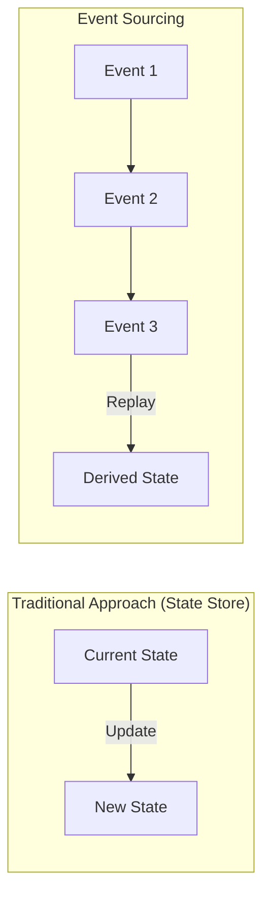
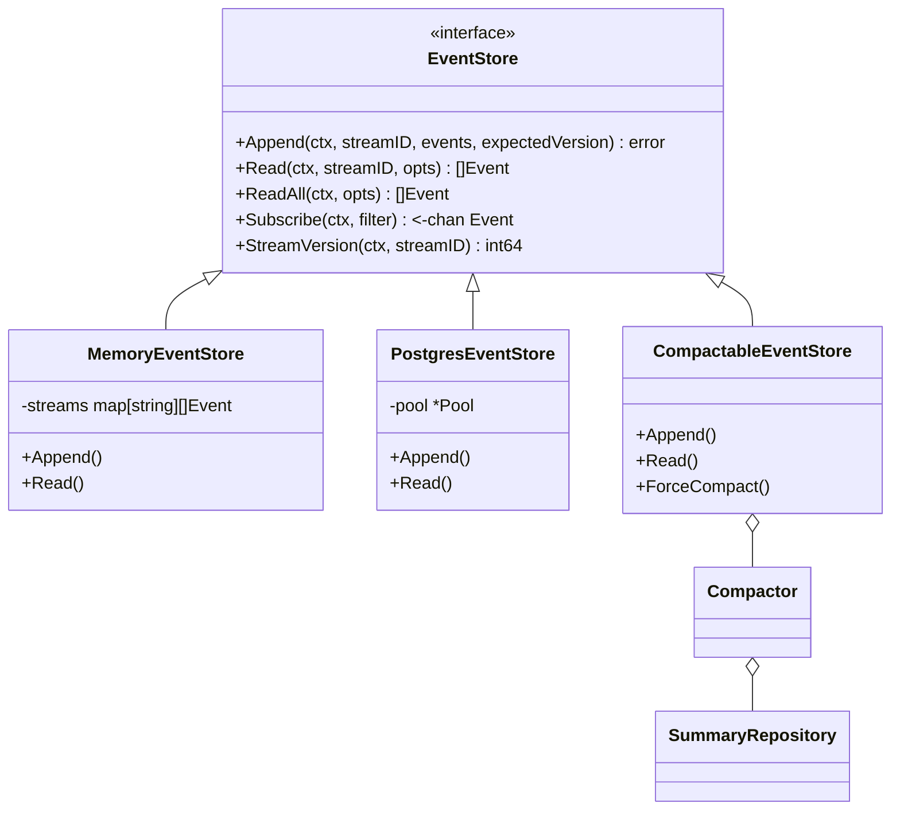
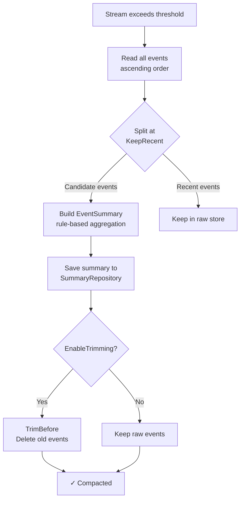
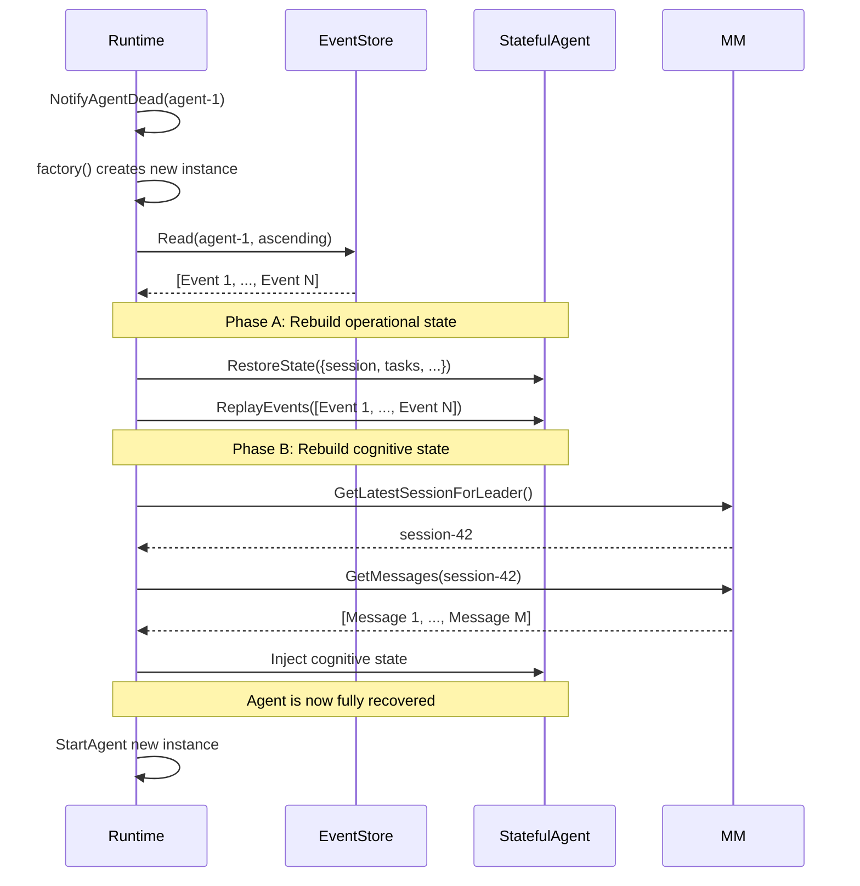
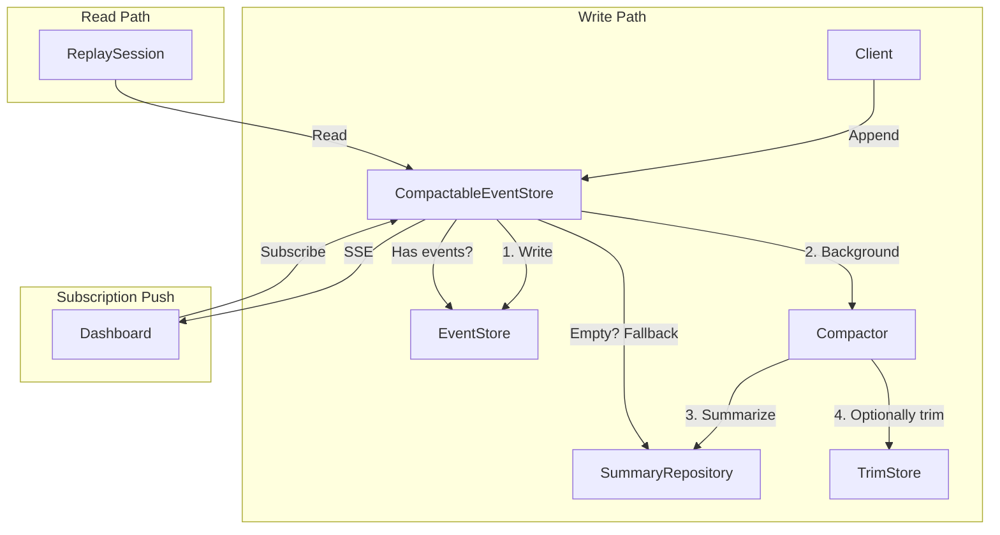

# ares Architecture Deep Dive (8): Event System — Event Sourcing Foundation for State Recovery and Audit Trails

> Agent startup is an event, task assignment is an event, tool call is an event, LLM response is an event, Agent crash is an event too.
> I thought at the time: **If I record every single thing the Agent does, can I fully reconstruct its state after it crashes?**
> The answer is yes. That's how Event Sourcing works in ares.

---

## 1. Why Record Every Single Thing

Back in the early days when I was building Agents, I managed state with a global struct. Everything crammed into one big map — what step the Agent was on, what data it had processed, what errors it hit. It looked simple, but problems surfaced.

I still remember the worst one: an Agent had been running in production all afternoon, handling 30+ user requests, each involving multiple rounds of conversation and tool calls. Then the process crashed — OOM killed, with only a single "signal: killed" line in the logs.

All state was gone. No checkpoint, no recovery path, no way to tell what it was working on when it died.

Users came asking: "Why isn't the Agent responding?" I said: "It lost its memory." That was the moment I realized: without persistent state, an Agent is a disposable consumable — use it once and you can't get it back.

To put it bluntly, the global map approach has three hard problems:

1. Agent crashes → map is gone → state is lost
2. Want to know what the Agent did five minutes ago? No record.
3. Need to audit whether the Agent made unauthorized tool calls? No log.

Later I looked into Event Sourcing, and I found its approach is the complete opposite: **Don't store the current state. Store every operation that changed the state. Want the current state? Replay the events and compute it yourself.**

This pattern has been used in financial systems for years, but not so much in Agent frameworks. I figured: since nobody's doing it, I'll build it.



This architecture provides three critical guarantees:
- **Complete audit trail**: Every state change is recorded with a timestamp and payload
- **Temporal query**: The system can answer "what was the state at time T?"
- **State reconstruction**: Any Agent's state can be rebuilt from scratch by replaying its event stream

Core files:

| File | Purpose |
|------|---------|
| `internal/ares_events/types.go` | Event model, EventStore interface |
| `internal/ares_events/memory_store.go` | In-memory EventStore |
| `internal/ares_events/pg_store.go` | PostgreSQL EventStore |
| `internal/ares_events/compactor.go` | Event compaction into summaries |
| `internal/ares_events/trim_store.go` | Delete old events after compaction |
| `internal/ares_events/compactable_store.go` | Auto-compacting EventStore wrapper |
| `internal/ares_events/summary.go` | EventSummary model + CompactionConfig |
| `internal/ares_events/summary_repository.go` | PgSummaryRepository |
| `internal/ares_events/memory_summary_repo.go` | In-memory SummaryRepository |
| `internal/flight/replay.go` | ReplaySession for step-by-step replay |

---

## 2. Event Model

### 2.1 Event Structure

`internal/ares_events/types.go` defines the foundational types:

```go
type Event struct {
    ID         string         `json:"id"`
    StreamID   string         `json:"stream_id"`
    Type       EventType      `json:"type"`
    ModuleName string         `json:"module_name,omitempty"`
    Payload    map[string]any `json:"payload"`
    Metadata   map[string]any `json:"metadata,omitempty"`
    Version    int64          `json:"version"`
    Timestamp  time.Time      `json:"timestamp"`
}
```

Each event belongs to a **stream** (identified by `StreamID`). A stream is an append-only sequence of events for a single entity — typically an Agent. The `Version` field enables optimistic concurrency control, and the `Type` field is used for routing and replay classification. The `ModuleName` field records which subsystem emitted the event — "runtime", "workflow", "memory", etc. This sounds obvious until you try to replay an event stream and discover you can't tell whether `step.started` came from the workflow engine or the plugin bus. Without it, you're reverse-engineering the source from the payload shape. With it, you know.

### 2.2 Event Types

```go
const (
    EventAgentStarted        EventType = "agent.started"
    EventAgentStopped        EventType = "agent.stopped"
    EventAgentFailed         EventType = "agent.failed"
    EventTaskCreated         EventType = "task.created"
    EventTaskAssigned        EventType = "task.assigned"
    EventTaskCompleted       EventType = "task.completed"
    EventTaskFailed          EventType = "task.failed"
    EventMessageAdded        EventType = "message.added"
    EventLLMCall             EventType = "llm.call"
    EventToolCall            EventType = "tool.call"
    EventSessionCreated      EventType = "session.created"
    EventFailoverTriggered   EventType = "failover.triggered"
    EventFailoverCompleted   EventType = "failover.completed"
)
```

### 2.3 EventStore Interface

```go
type EventStore interface {
    Append(ctx context.Context, streamID string, events []*Event, expectedVersion int64) error
    Read(ctx context.Context, streamID string, opts ReadOptions) ([]*Event, error)
    ReadAll(ctx context.Context, opts ReadOptions) ([]*Event, error)
    Subscribe(ctx context.Context, filter EventFilter) (<-chan *Event, error)
    StreamVersion(ctx context.Context, streamID string) (int64, error)
}
```



Key semantics:
- `Append` uses `expectedVersion` for optimistic concurrency control: `0` means the stream must be empty, `-1` bypasses the check, a positive value must match the current version
- `Read` supports `FromVersion`, `Limit`, and `Direction` (ascending/descending) via `ReadOptions`
- `Subscribe` returns a channel of events matching the filter; the channel closes when the context is cancelled

---

## 3. Store Implementations

### 3.1 MemoryEventStore

`internal/ares_events/memory_store.go` provides an in-memory implementation, primarily used for testing and demo mode:

```go
type MemoryEventStore struct {
    mu      sync.RWMutex
    streams map[string][]*Event
    events  []*Event
    version int64
}
```

The `Append` method performs: lock → version validation → assign sequence numbers → write to both stream store and flat store → notify subscribers. `Subscribe` creates a buffered channel (capacity 100); new events are broadcast to all channels; if the buffer is full, the event is dropped (non-blocking send).

### 3.2 PostgresEventStore

`internal/ares_events/pg_store.go` provides a production-grade PostgreSQL implementation:

```sql
INSERT INTO events (id, stream_id, type, payload, metadata, version, created_at, timestamp)
VALUES ($1, $2, $3, $4, $5, $6, $7, $8)
ON CONFLICT (stream_id, version) DO NOTHING
```

`ON CONFLICT DO NOTHING` provides idempotent append — if the same event is inserted twice due to a client retry, the second insert is silently ignored. This is critical for at-least-once delivery semantics.

---

## 4. Event Compaction Pipeline

Without compaction, the event store grows unboundedly. ares's Compactor solves this by summarizing old events into compact snapshots.

### 4.1 CompactionConfig

```go
type CompactionConfig struct {
    Threshold              int           // Events triggering compaction (default: 500)
    KeepRecent             int           // Raw events to retain (default: 100)
    MaxSummariesPerStream  int           // Max summaries per stream
    SummaryTTL             time.Duration // Summary retention (default: 30 days)
    EnableTrimming         bool          // Delete raw events after compaction
}
```

Default behavior: when a stream exceeds 500 events, compact the oldest 400 into a summary, keep the most recent 100 as raw events.

### 4.2 Compaction Pipeline



### 4.3 DefaultSummarizer

The rule-based summarizer produces concise English summaries without requiring an LLM call:

```
Agent agent-1 ran 3 task(s) [task-42, task-43, task-44],
called 5 tool(s) [search, book, weather, calculator, email],
emitted 23 events over 3m12s,
bound to user request: "Plan a trip to Tokyo",
result: completed
```

### 4.4 Summary Fallback on Read

If raw events have been trimmed, `Read` automatically falls back to summaries:

```go
func (s *CompactableEventStore) Read(ctx context.Context, streamID string, opts ReadOptions) ([]*Event, error) {
    events, err := s.EventStore.Read(ctx, streamID, opts)
    if err != nil {
        return nil, err
    }
    if len(events) > 0 {
        return events, nil
    }

    summaries, summaryErr := s.compactor.repo.FindByStreamID(ctx, streamID)
    if summaryErr != nil || len(summaries) == 0 {
        return events, nil
    }

    synthetic := make([]*Event, 0, len(summaries))
    for _, sum := range summaries {
        synthetic = append(synthetic, &Event{
            Type: EventType("event.summary"),
            Payload: map[string]any{
                "summary_text": sum.SummaryText,
                "event_count":  sum.EventCount,
                "outcome":      sum.Outcome,
            },
        })
    }
    return synthetic, nil
}
```

---

## 5. ReplaySession

`internal/flight/replay.go` provides step-by-step event replay for a task:


Core methods:
- `Step()`: advance one event, return that step
- `StepTo(n)`: jump to a specified step
- `Summary()`: return an overview (total steps, duration, list of Agent IDs, event type distribution)
- `Reset()`: return to the starting position

---

## 6. Store Implementation Comparison

| Feature | MemoryEventStore | PostgresEventStore |
|---------|-----------------|-------------------|
| Persistence | None (process-level) | Yes (table storage) |
| Concurrency control | Mutex lock | `ON CONFLICT DO NOTHING` |
| Subscription | Buffered channel + subscriber map | LISTEN/NOTIFY or polling |
| Use cases | Testing, demo, single process | Production, distributed deployment |

---

## 7. Integration with Agent Resurrection

The Event System integrates deeply with the Runtime's resurrection pipeline:



Two-phase recovery ensures:
- **Operational state** (tasks, sessions, execution status) is reconstructed from the event stream
- **Cognitive state** (conversation history, memories) is restored from MemoryManager
- **Each phase is independently recoverable** — partial recovery is better than no recovery at all

---

## 8. Architectural Summary

### Design Patterns

| Pattern | Location | Purpose |
|---------|----------|---------|
| Event Sourcing | `types.go` | Immutable append-only log |
| Optimistic Concurrency Control | `Append(expectedVersion)` | Conflict detection on concurrent writes |
| CQRS | EventStore (write) + SummaryRepository (read) | Write-optimized raw store + read-optimized summaries |
| Observer | `Subscribe(channel)` | Real-time event stream push |
| Strategy | `Summarizer` function type | Pluggable summary generation (rule-based or LLM) |
| Decorator | `CompactableEventStore` wraps `EventStore` | Transparent compaction, unchanged API |
| Debounce | `lastChecked` map | Avoid redundant compaction checks |

### Key Data Flow



---

## v0.2.4 Update

**Event.ModuleName**: Every event now carries a `ModuleName` field identifying which module emitted it. The `Emit()` signature changed from:

```go
// Before: who emitted this event?
Emit(ctx, store, streamID, eventType, payload)

// After: always traceable
Emit(ctx, store, streamID, eventType, "runtime", payload)
```

When you replay an event stream, you can now see:
```json
{"type": "step.started", "module_name": "workflow", ...}
{"type": "tool.call.completed", "module_name": "runtime", ...}
{"type": "memory.distilled", "module_name": "memory", ...}
```

This closes the "who did what" gap — previously you had to infer the source from the event type and payload. Now it's explicit.

---

## 9. Conclusion

Event Sourcing + CQRS + pluggable stores + auto-compaction — this combination isn't anything new in enterprise systems. But placed within an Agent framework, I think it's a pretty interesting experiment.

What was the most satisfying experience? An Agent was running a complex multi-step workflow with multiple tool calls and LLM interactions when it crashed halfway through. In the old days, I'd be staring at logs, guessing: was it a prompt problem? An LLM hallucination? Wrong tool parameters? Guess, fix, rerun, repeat — three or four cycles just to pinpoint the issue.

But this time I opened the Dashboard, found the Agent's event stream, and replayed it step by step from the beginning. By event 7 I was already grinning — the Agent's `tool.call:7` had returned an empty result from the search API, and it blindly concatenated that empty result into the next LLM prompt without a null check. The bug itself wasn't complicated — what was new is that I **saw the full causal chain** unfolding event by event. Not guessing — watching.

At that moment, I felt like I wasn't debugging — I was watching a black box flight recorder.

**That's the value of the event system: it doesn't make you run faster. It tells you exactly why things went wrong when they do.**

---

*Next preview: Arena / Fault Injection — possibly the most unhinged feature in ares. You can click a button on the Dashboard, assassinate a running Agent, and then watch it resurrect from the ashes.*