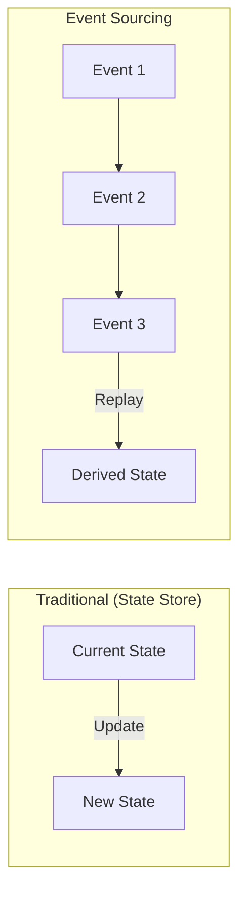
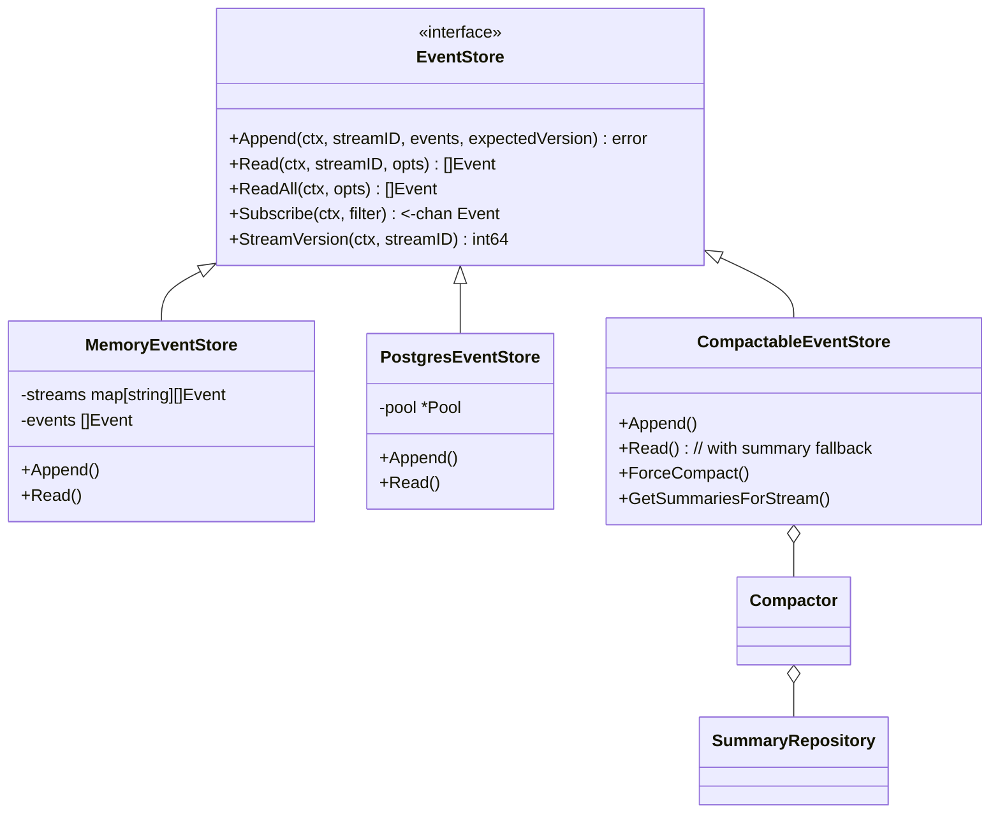
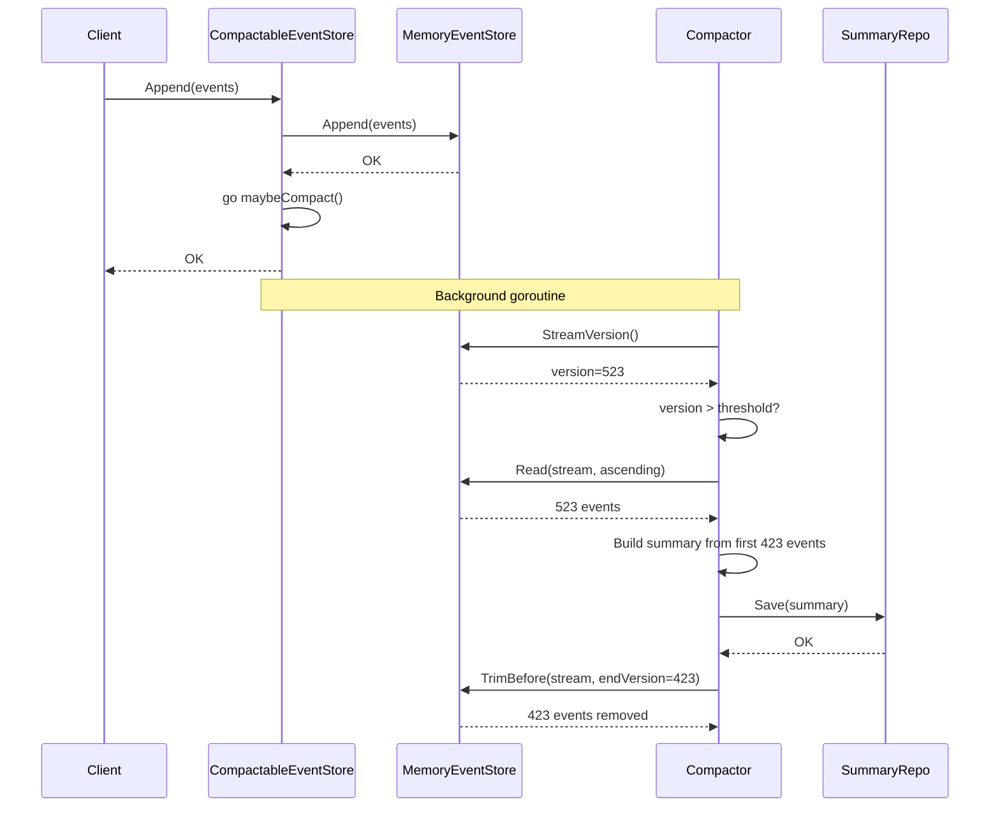
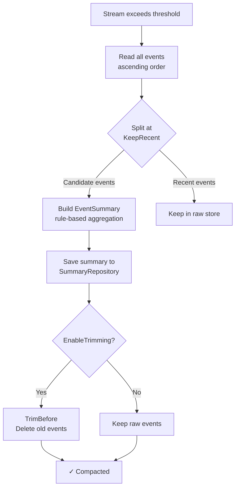
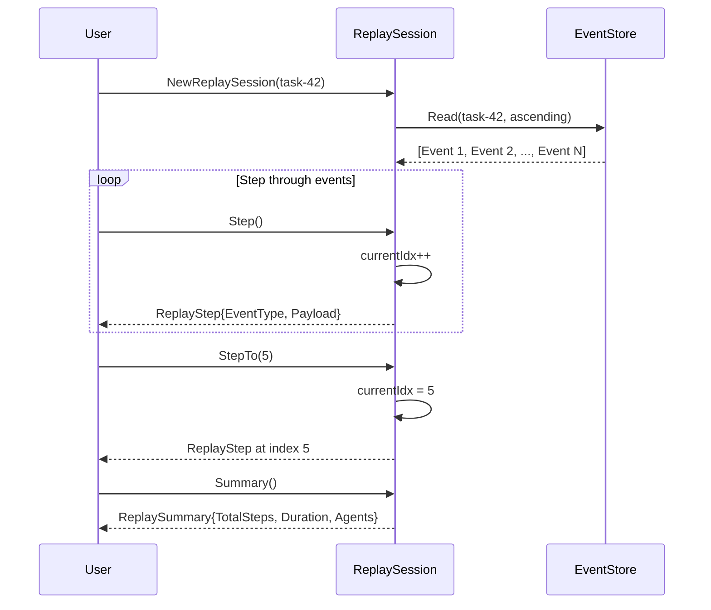
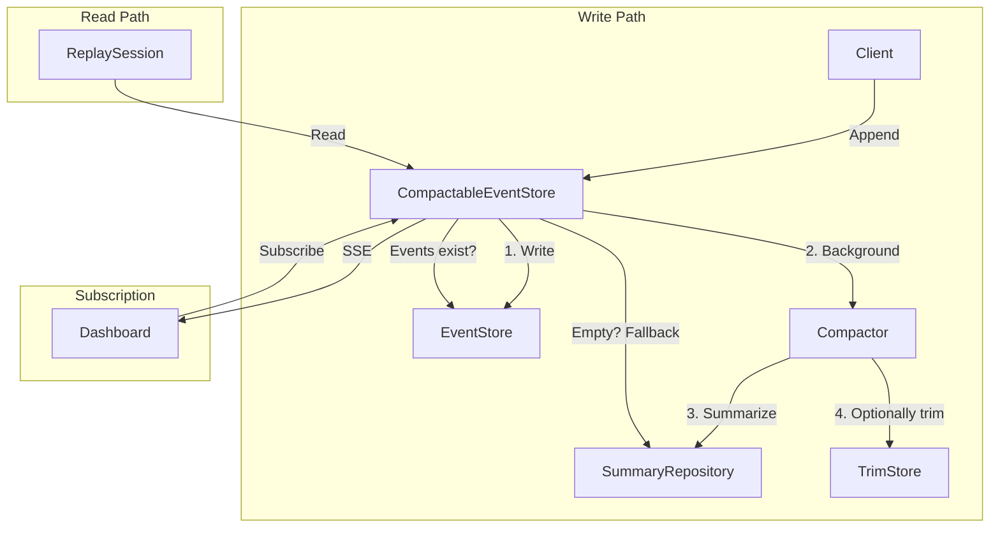

# GoAgentX Architecture Deep Dive (8): Event System — Event Sourcing for State Recovery and Audit Trails

> Every action in a multi-agent system is an event. Agent started, task assigned, tool called, LLM responded, agent crashed, agent resurrected. GoAgentX's Event System records all of them as an immutable, replayable log — the single source of truth for state recovery, audit trails, and system observability.

---

## 1. Why Record Every Single Thing

Early on, I managed agent state with a global struct. Everything in one big map: what the agent was doing, what data it processed, what errors it hit. Simple, but problematic:

1. Agent crashes → map is gone → state is gone
2. Want to know what the agent did 5 minutes ago? No record.
3. Need to audit whether an agent made unauthorized tool calls? No log.

Then I discovered Event Sourcing. The idea is the opposite of traditional state management: **don't store the current state. Store every operation that changed the state. Want the current state? Replay the events.**

Financial systems have used this for decades. Agent frameworks? Not so much. I figured: if nobody's doing it, I'll build it.



This architecture provides three critical guarantees:
- **Complete audit trail**: Every state change is recorded with timestamp and payload
- **Temporal query**: The system can answer "what was the state at time T?"
- **State reconstruction**: Any Agent's state can be rebuilt from scratch by replaying its event stream

Core files:

| File | Purpose |
|------|---------|
| `internal/events/types.go` | Event model, EventStore interface |
| `internal/events/memory_store.go` | In-memory EventStore implementation |
| `internal/events/pg_store.go` | PostgreSQL EventStore implementation |
| `internal/events/compactor.go` | Event compaction into summaries |
| `internal/events/trim_store.go` | Old event deletion after compaction |
| `internal/events/compactable_store.go` | Auto-compacting EventStore wrapper |
| `internal/events/summary.go` | EventSummary model + CompactionConfig |
| `internal/events/summary_repository.go` | PgSummaryRepository |
| `internal/events/memory_summary_repo.go` | In-memory SummaryRepository |
| `internal/flight/replay.go` | ReplaySession for step-by-step replay |

---

## 2. Event Model

### 2.1 Event Structure

The foundational type is defined in `internal/events/types.go`:

```go
type Event struct {
    ID        string         `json:"id"`
    StreamID  string         `json:"stream_id"`
    Type      EventType      `json:"type"`
    Payload   map[string]any `json:"payload"`
    Metadata  map[string]any `json:"metadata,omitempty"`
    Version   int64          `json:"version"`
    Timestamp time.Time      `json:"timestamp"`
}
```

Each event belongs to a **stream** (identified by `StreamID`). A stream is an append-only sequence of events for a single entity — typically an Agent. The `Version` field enables optimistic concurrency control, and `Type` classifies the event for routing and replay.

### 2.2 Event Types

```go
type EventType string

const (
    EventAgentStarted        EventType = "agent.started"
    EventAgentStopped        EventType = "agent.stopped"
    EventAgentFailed         EventType = "agent.failed"
    EventTaskCreated         EventType = "task.created"
    EventTaskAssigned        EventType = "task.assigned"
    EventTaskCompleted       EventType = "task.completed"
    EventTaskFailed          EventType = "task.failed"
    EventMessageAdded        EventType = "message.added"
    EventLLMCall             EventType = "llm.call"
    EventToolCall            EventType = "tool.call"
    EventSessionCreated      EventType = "session.created"
    EventFailoverTriggered   EventType = "failover.triggered"
    EventFailoverCompleted   EventType = "failover.completed"
)
```

### 2.3 EventStore Interface

```go
type EventStore interface {
    Append(ctx context.Context, streamID string, events []*Event, expectedVersion int64) error
    Read(ctx context.Context, streamID string, opts ReadOptions) ([]*Event, error)
    ReadAll(ctx context.Context, opts ReadOptions) ([]*Event, error)
    Subscribe(ctx context.Context, filter EventFilter) (<-chan *Event, error)
    StreamVersion(ctx context.Context, streamID string) (int64, error)
}
```

Key semantics:
- `Append` uses `expectedVersion` for optimistic concurrency: `0` means the stream must not exist, `-1` (or any negative) bypasses the check, a positive value must match the stream's current version.
- `Read` returns events for a single stream. `ReadOptions` supports `FromVersion`, `Limit`, and `Direction` (ascending/descending).
- `Subscribe` returns a channel of events matching the filter; the channel closes when the context is cancelled.
- `ReadAll` scans across all streams — used by compactor and admin tools.



---

## 3. Store Implementations

### 3.1 MemoryEventStore

`internal/events/memory_store.go` provides an in-memory implementation primarily used for testing and demo mode:

```go
type MemoryEventStore struct {
    mu      sync.RWMutex
    streams map[string][]*Event // streamID → events
    events  []*Event            // Flat list for ReadAll + Subscribe
    version int64               // Global monotonically increasing version
}
```

The `Append` method:
1. Locks the mutex
2. Validates `expectedVersion` against the stream's current version
3. Assigns sequential versions to new events
4. Appends to both the per-stream slice and the flat events slice
5. Notifies subscribers via a channel

The `Subscribe` method creates a buffered channel (capacity 100) and registers it in a subscriber map. New events are broadcast to all subscriber channels. If a subscriber's buffer is full, the event is dropped (non-blocking send).

### 3.2 PostgresEventStore

`internal/events/pg_store.go` provides a PostgreSQL-backed implementation for production:

```go
type PostgresEventStore struct {
    pool *postgres.Pool
}
```

The `Append` method uses a single SQL statement for atomicity:

```sql
INSERT INTO events (id, stream_id, type, payload, metadata, version, created_at, timestamp)
VALUES ($1, $2, $3, $4, $5, $6, $7, $8)
ON CONFLICT (stream_id, version) DO NOTHING
```

The `ON CONFLICT DO NOTHING` clause provides idempotent append — if the same event is inserted twice (e.g., after a client retry), the second insert is silently ignored. This is critical for at-least-once delivery semantics.

Optimistic concurrency control is handled by checking the stream's current version before insert — a separate `SELECT COUNT(*)` or `SELECT MAX(version)` query.



---

## 4. Event Compaction Pipeline

Without compaction, the event store grows unboundedly — every `agent.started`, `llm.call`, and `tool.call` accumulates. GoAgentX's Compactor solves this by summarizing old events into compact snapshots.

### 4.1 CompactionConfig

```go
type CompactionConfig struct {
    Threshold            int           // Events triggering compaction (default: 500)
    KeepRecent           int           // Events to retain (default: 100)
    MaxSummariesPerStream int          // Max summaries per stream
    SummaryTTL           time.Duration // Summary retention (default: 30 days)
    EnableTrimming       bool          // Delete raw events after compaction
}
```

Default: when a stream exceeds 500 events, compact the oldest 400 into a summary, keep the most recent 100 as raw events.

### 4.2 Compactor

```go
type Compactor struct {
    store      EventStore
    repo       SummaryRepository
    config     CompactionConfig
    summarizer EventSummarizer
    trimStore  TrimAwareStore
}
```

The compaction pipeline:



### 4.3 DefaultSummarizer

The rule-based summarizer produces concise English summaries without requiring an LLM call:

```
Agent agent-1 ran 3 task(s) [task-42, task-43, task-44],
called 5 tool(s) [search, book, weather, calculator, email],
emitted 23 events over 3m12s,
bound to user request: "Plan a trip to Tokyo",
result: completed
```

### 4.4 CompactableEventStore

The `CompactableEventStore` wraps any `EventStore` and adds auto-compaction:

```go
type CompactableEventStore struct {
    EventStore                      // Embedded — delegates Read, etc.
    compactor *Compactor
    trimStore TrimAwareStore
    mu        sync.Mutex
    lastChecked map[string]int64    // Debounce: avoids redundant checks
}
```

When `Append` is called, after writing events, a goroutine checks if compaction is needed. The check is debounced — it only runs when the stream has grown by at least 25% of the threshold since the last check.

### 4.5 Read with Summary Fallback

If raw events have been trimmed, `Read` falls back to summaries:

```go
func (s *CompactableEventStore) Read(ctx context.Context, streamID string, opts ReadOptions) ([]*Event, error) {
    events, err := s.EventStore.Read(ctx, streamID, opts)
    if err != nil {
        return nil, err
    }
    if len(events) > 0 {
        return events, nil
    }

    // Underlying store empty — check summaries as fallback.
    summaries, summaryErr := s.compactor.repo.FindByStreamID(ctx, streamID)
    if summaryErr != nil || len(summaries) == 0 {
        return events, nil
    }

    synthetic := make([]*Event, 0, len(summaries))
    for _, sum := range summaries {
        synthetic = append(synthetic, &Event{
            ID:   sum.ID,
            Type: EventType("event.summary"),
            Payload: map[string]any{
                "summary_text":  sum.SummaryText,
                "event_count":   sum.EventCount,
                "outcome":       sum.Outcome,
            },
            Version:   sum.EndVersion,
            Timestamp: sum.CreatedAt,
        })
    }
    return synthetic, nil
}
```

---

## 5. ReplaySession

`internal/flight/replay.go` provides step-by-step event replay for a task:

```go
type ReplaySession struct {
    taskID     string
    events     []*events.Event
    currentIdx int
}

func NewReplaySession(ctx context.Context, eventStore events.EventStore, taskID string) (*ReplaySession, error) {
    evts, err := eventStore.Read(ctx, taskID, events.ReadOptions{
        Direction: events.ReadAscending,
        Limit:     10000,
    })
    if err != nil {
        return nil, fmt.Errorf("read events for task %s: %w", taskID, err)
    }
    if len(evts) == 0 {
        return nil, fmt.Errorf("no events found for task %s", taskID)
    }
    // ...
}
```



Key features:
- `Step()`: advances one event, returns it
- `StepTo(n)`: jumps to a specific step
- `Summary()`: returns an overview (total steps, duration, agent IDs, event type distribution)
- `Reset()`: returns to the beginning
- `IsFinished()`: checks if all steps have been consumed

---

## 6. SummaryRepository Implementations

### 6.1 PgSummaryRepository

Stores summaries in the `event_summaries` table:

```sql
CREATE TABLE IF NOT EXISTS event_summaries (
    id VARCHAR(255) PRIMARY KEY,
    stream_id VARCHAR(255) NOT NULL,
    agent_id VARCHAR(255) NOT NULL,
    task_id VARCHAR(255),
    session_id VARCHAR(255),
    user_id VARCHAR(255),
    summary_text TEXT NOT NULL,
    event_count INTEGER NOT NULL DEFAULT 0,
    start_version BIGINT NOT NULL,
    end_version BIGINT NOT NULL,
    start_time TIMESTAMP NOT NULL,
    end_time TIMESTAMP NOT NULL,
    event_type_counts JSONB DEFAULT '{}'::jsonb,
    tasks_created JSONB DEFAULT '[]'::jsonb,
    tools_called JSONB DEFAULT '[]'::jsonb,
    errors JSONB DEFAULT '[]'::jsonb,
    request_summary TEXT,
    outcome VARCHAR(50) NOT NULL DEFAULT 'active',
    metadata JSONB DEFAULT '{}'::jsonb,
    created_at TIMESTAMP DEFAULT NOW()
);
```

Query interface:
- `FindByStreamID`: all summaries for a stream, ordered by start_version
- `FindByAgentAndTask`: summaries matching both agent and task
- `FindByAgentID`: all summaries for an agent (cross-stream)
- `FindLatestByStreamID`: most recent summary for a stream
- `DeleteOlderThan`: cleanup by TTL

### 6.2 MemorySummaryRepository

In-memory counterpart for testing and demo mode. Uses a `map[string]*EventSummary` for storage and `map[string][]string` for stream-indexed lookups, with sorted insertion to maintain version order.

---

## 7. TrimStore Implementations

After successful compaction, old raw events can be deleted:

### 7.1 PgTrimStore

```go
func (s *PgTrimStore) TrimBefore(ctx context.Context, streamID string, endVersion int64) (int64, error) {
    result, err := s.pool.Exec(ctx,
        `DELETE FROM events WHERE stream_id = $1 AND version <= $2`,
        streamID, endVersion,
    )
    // ...
}
```

### 7.2 MemoryTrimStore

```go
func (s *MemoryTrimStore) TrimBefore(_ context.Context, streamID string, endVersion int64) (int64, error) {
    s.mu.Lock()
    defer s.mu.Unlock()

    stream := s.streams[streamID]
    split := len(stream) // Default: trim all
    for i, evt := range stream {
        if evt.Version > endVersion {
            split = i
            break
        }
    }

    if split > 0 {
        s.streams[streamID] = stream[split:]
        // Also filter the flat events slice
        var kept []*Event
        for _, evt := range s.events {
            if evt.StreamID != streamID || evt.Version > endVersion {
                kept = append(kept, evt)
            }
        }
        s.events = kept
    }
    return int64(split), nil
}
```

---

## 8. Integration with Agent Resurrection

The Event System integrates deeply with the Runtime's resurrection pipeline:


The two-phase recovery ensures:
- **Operational state** (tasks, sessions, execution status) is reconstructed from the event stream
- **Cognitive state** (conversation history, memories) is restored from MemoryManager
- Each phase is independently recoverable — partial recovery is better than no recovery

---

## 9. Architectural Summary

### Design Patterns

| Pattern | Location | Purpose |
|---------|----------|---------|
| Event Sourcing | `types.go` (Event model) | Immutable append-only log |
| Optimistic Concurrency | `Append(expectedVersion)` | Conflict detection on concurrent writes |
| CQRS | EventStore (write) + SummaryRepository (read) | Write-optimized raw store + read-optimized summaries |
| Observer | `Subscribe(channel)` | Real-time event streaming |
| Strategy | `Summarizer` function type | Pluggable summary generation (rule-based or LLM) |
| Decorator | `CompactableEventStore` wraps `EventStore` | Transparent compaction without API change |
| Debounce | `lastChecked` map | Avoid redundant compaction checks |

### Key Data Flow



### File Index

| File | Purpose |
|------|---------|
| `internal/events/types.go` | Event model, EventType constants, EventStore interface |
| `internal/events/memory_store.go` | In-memory EventStore with subscriber support |
| `internal/events/pg_store.go` | PostgreSQL EventStore with idempotent insert |
| `internal/events/compactor.go` | Compactor + DefaultSummarizer |
| `internal/events/summary.go` | EventSummary model, SummaryRepository interface, CompactionConfig |
| `internal/events/summary_repository.go` | PgSummaryRepository with full CRUD |
| `internal/events/memory_summary_repo.go` | In-memory SummaryRepository |
| `internal/events/trim_store.go` | PgTrimStore + MemoryTrimStore |
| `internal/events/compactable_store.go` | Auto-compacting EventStore wrapper |
| `internal/flight/replay.go` | ReplaySession for step-by-step replay |

---

## 10. Conclusion

Event Sourcing + CQRS + pluggable stores + auto-compaction. None of this is new in enterprise software. But in an agent framework? I think it's a pretty interesting experiment.

The best moment? An agent crashed. I opened the Dashboard, replayed its entire event stream, and watched step by step where it went wrong. Felt less like debugging and more like watching a black box flight recorder.

**That's what the event system is for. Not to make agents run faster. To tell you exactly what happened when they don't.**

---

*Next: Arena / Fault Injection — the most unhinged feature in GoAgentX. You can click a button on the Dashboard and assassinate a running agent. Then watch it resurrect itself.*
