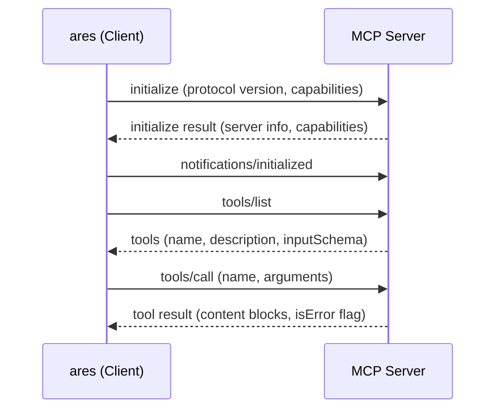
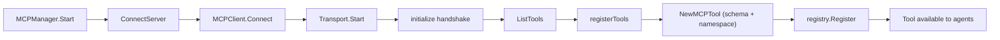

# ares Architecture Deep Dive (XV): MCP Integration — Teaching Agents to Use Tools

I broke the tool system on a Tuesday afternoon.

It was supposed to be a simple demo. I'd written a custom tool that talked to a code analysis server — spawn a process, send a JSON request, parse the response. Worked perfectly in my dev environment. Then someone else tried to run it on their machine and got nothing. No error, no output, just a silent failure. Turns out the tool was hardcoded to spawn a binary at an absolute path that only existed on my laptop.

That was the moment I realized: **we had a tool registration problem, not a tool execution problem.** Every tool was a bespoke integration. Every tool author had to know the internals of our registry. Every deployment was a game of "did you install the right binary?" We needed a protocol — something that let tools describe themselves, discover themselves, and connect without the framework knowing the details.

That protocol already existed. It's called MCP.

---

## The Problem: Brittle Tools Everywhere

Before MCP, registering a tool in ares looked like this:

```go
// The old way: manual, fragile, coupled
registry.Register("codegraph_analyze", &CodeGraphTool{
    binaryPath: "/usr/local/bin/codegraph-server",  // breaks on every machine
    timeout:    30 * time.Second,
})
```

Every tool was a Go struct that implemented the `core.Tool` interface. Every tool author had to import our internal packages, understand our parameter schema format, and handle their own process management. If you wanted to add a tool written in Python or Rust? Good luck. You'd be writing a Go wrapper that spawned a subprocess and spoke some ad-hoc JSON protocol over stdin.

The worst part was discovery. You couldn't ask a running tool server "what tools do you have?" You had to read the documentation, hope it was up to date, and manually wire everything together. Tools were static. Configuration was manual. And every new integration meant touching the framework's source code.

We needed tools that could **announce themselves**.

---

## MCP: The Protocol That Describes Tools

The Model Context Protocol is a JSON-RPC 2.0 specification for tool discovery and invocation. The core idea is simple: a server exposes tools with JSON Schema definitions, and a client discovers and calls them over a standard wire format.

The handshake looks like this:



Three things make this powerful:

1. **Self-describing tools** — the server provides JSON Schema for each tool's parameters. No guessing, no documentation rot.
2. **Transport-agnostic** — the protocol doesn't care if you're talking over stdin/stdout or HTTP. Same messages, different wires.
3. **Dynamic discovery** — the server can notify the client when tools change. No restart required.

In ares, we implement this in `internal/ares_mcp/client.go`. The `MCPClient` struct manages a single connection to one MCP server. The `Connect` method performs the full handshake:

```go
func (c *MCPClient) Connect(ctx context.Context) error {
    if err := c.transport.Start(ctx); err != nil {
        return fmt.Errorf("start transport: %w", err)
    }
    c.receiveLoop.Go(c.runReceiveLoop)
    if err := c.initialize(ctx); err != nil {
        return fmt.Errorf("initialize: %w", err)
    }
    if _, err := c.ListTools(ctx); err != nil {
        return fmt.Errorf("list tools: %w", err)
    }
    return nil
}
```

Start the transport, launch the background receive loop, shake hands, discover tools. Four steps, no ambiguity.

---

## Two Transports, One Interface

The MCP spec defines two transport mechanisms. We implement both, behind a single `Transport` interface in `internal/ares_mcp/transport.go`:

```go
type Transport interface {
    Start(ctx context.Context) error
    Send(ctx context.Context, msg *JSONRPCMessage) error
    Receive(ctx context.Context) (*JSONRPCMessage, error)
    Close() error
}
```

**Stdio transport** (`internal/ares_mcp/transport_stdio.go`) launches a subprocess and communicates over newline-delimited JSON on stdin/stdout. This is the workhorse for local tools — the framework spawns the tool server as a child process, and they talk through pipes. The tricky part is making `Receive` interruptible: the underlying `bufio.Scanner.Scan()` blocks, so we run it in a goroutine and use a channel to shuttle messages back. When the context is cancelled, we close the stdout pipe to unblock the scanner.

**SSE transport** (`internal/ares_mcp/transport_sse.go`) communicates over HTTP. The receive path opens a long-lived Server-Sent Events stream via GET; the send path POSTs JSON-RPC messages to a URL the server provides dynamically through an `endpoint` event. This is for remote tool servers — anything running on another machine, in a container, or behind a network boundary.

The factory at the bottom of `client.go` selects between them based on configuration:

```go
func NewTransportFromConfig(config TransportConfig) (Transport, error) {
    switch config.Type {
    case "stdio":
        return NewStdioTransport(*config.Stdio), nil
    case "sse":
        return NewSSETransport(*config.SSE), nil
    default:
        return nil, fmt.Errorf("unsupported transport type: %s", config.Type)
    }
}
```

**Honest reflection**: We considered a third transport — gRPC — because it's faster and has better tooling. We decided against it because MCP's spec only defines stdio and SSE, and we didn't want to maintain a non-standard extension. If the spec adds gRPC later, we'll add it. For now, two transports cover the real use cases: local processes and remote HTTP servers.

---

## The Manager: Juggling Multiple Servers

A single MCP client is useful. But in practice, you want to connect to multiple tool servers simultaneously — one for code analysis, one for database access, one for file operations. That's where `MCPManager` comes in.

The manager lives in `internal/ares_mcp/manager.go`. It holds a map of named clients, each wrapped in a `managedClient` struct that tracks connection state, error history, and registered tool names:

```go
type MCPManager struct {
    clients  map[string]*managedClient
    registry *core.Registry
    mu       sync.RWMutex
    config   *MCPManagerConfig
}

type managedClient struct {
    client  *MCPClient
    config  MCPServerConfig
    connAt  time.Time
    lastErr error
    tools   []string
}
```

The `Start` method iterates the configuration and connects to every server marked `Enabled && AutoStart`. Each connection follows the same pattern: create transport, create client, handshake, register tools. If a server fails to connect, we log the error and move on to the next one. **One bad server doesn't block the others.**

When a server sends a `notifications/tools/list_changed` notification — meaning it has added, removed, or modified tools — the client's `onChange` callback fires, which calls `RefreshTools` on the manager. This unregisters the old tools from the shared registry, re-discovers via `ListTools`, and re-registers the new set. The entire process is transparent to the rest of the framework.

The configuration is declarative:

```yaml
mcp:
  servers:
    - name: codegraph
      enabled: true
      auto_start: true
      timeout: 30
      transport:
        type: stdio
        stdio:
          command: codegraph-mcp-server
          args: ["serve"]
          work_dir: /path/to/project
    - name: remote-db
      enabled: true
      auto_start: true
      transport:
        type: sse
        sse:
          url: http://db-tools.internal:8080/mcp
```

Validation in `internal/ares_config/config.go` catches configuration errors early: duplicate server names, missing commands for stdio, missing URLs for SSE, invalid transport types. Fail fast, fail loud.

---

## The Bridge: MCP Tools Become Native Tools

Here's where the magic happens. The whole point of MCP integration is that **MCP tools should be indistinguishable from native tools** to the rest of the framework. An agent calling an MCP tool shouldn't know or care that the tool lives in a separate process.

The bridge is `MCPTool` in `internal/ares_mcp/mcp_tool.go`:

```go
type MCPTool struct {
    *base.BaseTool
    client     *MCPClient
    serverName string
    toolDef    *MCPToolDef
}
```

Construction happens in `NewMCPTool`. It takes an `MCPToolDef` (the server's description of the tool) and wraps it:

1. **Schema conversion** — The MCP `inputSchema` is raw JSON Schema. Our tool system uses `core.ParameterSchema`. The `ConvertJSONSchema` function in `internal/ares_mcp/schema.go` bridges the two, preserving type information, required fields, and enum constraints.

2. **Namespacing** — Tool names become `mcp.<serverName>.<toolName>`. If the `codegraph` server exposes an `analyze` tool, the full name is `mcp.codegraph.analyze`. This prevents collisions between tools from different servers.

3. **Categorization** — MCP tools get `core.CategoryExternal` and `core.CapabilityExternal`. The capability engine in `internal/tools/resources/core/capability.go` uses these to filter tools by origin.

4. **Interface satisfaction** — By embedding `base.BaseTool`, the `MCPTool` automatically satisfies the `core.Tool` interface defined in `internal/tools/resources/core/tool.go`. No boilerplate.

The `Execute` method is the payoff:

```go
func (t *MCPTool) Execute(ctx context.Context, params map[string]interface{}) (core.Result, error) {
    result, err := t.client.CallTool(ctx, t.toolDef.Name, params)
    if err != nil {
        return core.NewErrorResult(err.Error()), nil
    }
    if result.IsError {
        return core.NewErrorResult(extractText(result.Content)), nil
    }
    return core.NewResult(true, map[string]interface{}{
        "content": extractText(result.Content),
        "blocks":  result.Content,
    }), nil
}
```

The tool delegates to the MCP client, which sends a `tools/call` request over the transport. The response comes back as content blocks (text, images, embedded resources). We convert it to a `core.Result` and return it.

Notice the error handling: transport failures and tool-level errors both return `core.Result` with `Success: false`, not Go errors. The Go error return is always `nil`. This keeps the tool execution boundary clean — the caller checks `result.Success`, not `err != nil`.

---

## The Registry: One Map to Rule Them All

The `core.Registry` in `internal/tools/resources/core/registry.go` is a thread-safe `map[string]Tool` with a lazy schema cache. MCP tools, built-in tools, plugin tools — they all live in the same registry. When an agent needs to execute a tool, it calls `registry.Execute(name, params)`. The registry looks up the tool by name, validates parameters against the cached schema, and calls `tool.Execute`.

The registration flow for MCP tools:



The manager keeps a list of registered tool names per server. When disconnecting, it unregisters exactly those tools — no more, no less. This prevents stale tool references from lingering in the registry after a server goes down.

---

## Error Handling: Timeouts, Retries, and Graceful Degradation

MCP tools are network calls in disguise. They can hang, fail, or return garbage. We handle this at multiple layers:

**Timeouts** — Every `CallTool` invocation uses `context.WithTimeout`, defaulting to 30 seconds. The timeout is configurable per-server in the YAML config. If a tool server doesn't respond in time, the context cancels, the pending request channel is cleaned up, and the caller gets a timeout error.

**Request correlation** — The `MCPClient` uses a `map[int64]chan *JSONRPCMessage` to correlate requests with responses. Each outbound request gets a unique ID from an atomic counter (`IDGenerator` in `internal/ares_mcp/jsonrpc.go`). A buffered channel is registered in the `pending` map before sending. The `receiveLoop` goroutine dispatches responses to the correct channel by matching `msg.ID`. If the context times out, the channel is removed from the map, preventing memory leaks.

**JSON-RPC error codes** — The protocol defines standard error codes: `ParseError (-32700)`, `InvalidRequest (-32600)`, `MethodNotFound (-32601)`, `InvalidParams (-32602)`, `InternalError (-32603)`. Our `JSONRPCError` type implements the `error` interface, so protocol-level errors propagate naturally through Go's error handling.

**Graceful close** — When a transport fails to close, we log the warning but don't propagate the error. The client's `Close` method drains all pending channels, ensuring no goroutine is left waiting on a response that will never come.

**Honest reflection**: We don't have retry logic or circuit breakers yet. If a tool server crashes mid-request, the caller gets an error and that's it. We considered adding automatic retries with exponential backoff, but decided to keep it simple for now. The manager's `RefreshTools` handles server-side changes, but transient failures are the caller's problem. This is a gap we'll close when we see real production workloads that need it.

---

## Dashboard: Seeing What's Connected

The web dashboard needs to show MCP server status in real time. We defined a clean interface for this in `internal/dashboard/types.go`:

```go
type MCPStatusProvider interface {
    ListServers() []MCPServerStatusView
}
```

The `MCPManager` satisfies this interface. `MCPServerStatusView` includes `Name`, `Connected`, `ToolCount`, `Version`, `Error`, `ConnAt`, and a `Tools` slice with per-tool details. The REST API exposes this at `GET /mcp` and `GET /mcp/{name}`.

For real-time updates, the dashboard uses WebSocket channels. When MCP tools change — a server connects, disconnects, or refreshes its tool set — a `mcp_tool_change` message is broadcast on the `mcp` WebSocket channel. The frontend subscribes to this channel and updates the UI without polling.

The wiring happens in `internal/ares_bootstrap/bootstrap.go`:

```go
func SetupMCP(ctx context.Context, cfg *ares_config.MCPConfig, registry *core.Registry) (*ares_mcp.MCPManager, error) {
    // convert config types, create manager, call Start
}
```

This is called during bootstrap, before the dashboard or orchestrator starts. By the time the web UI loads, all auto-start MCP servers are already connected and their tools are registered.

---

## The Plugin Factory: Dynamic Tool Creation

There's one more integration point: the `MCPToolFactory` in `internal/ares_mcp/factory.go`. It implements `core.ToolFactory` from `internal/tools/resources/core/factory.go`, which means MCP tools can be created dynamically through the plugin registry.

The factory accepts a config map with `name`, `transport_type`, `command` or `url`, creates a temporary MCP client, discovers tools, and returns the first one. This is useful for ad-hoc tool creation — "I need a tool that talks to this server, but I don't want to add it to the YAML config."

We include a compile-time interface check to make sure we don't accidentally break the contract:

```go
var _ core.ToolFactory = (*MCPToolFactory)(nil)
```

This pattern appears everywhere in the MCP codebase. Every transport, every tool, every factory has a compile-time check. It's a small thing, but it catches integration bugs at build time instead of runtime.

---

## The Honest Truth

MCP integration was one of those features that started as a "nice to have" and became essential. The initial motivation was selfish — I was tired of writing Go wrappers for Python tools. But once we had the protocol working, something unexpected happened: **other people started writing tool servers.**

The code analysis tool is written in Rust. The database tool is a standalone Go binary. The file search tool is a Python script. They all speak MCP, and they all appear as native tools in ares. The framework doesn't know or care what language they're written in. That's the real value of a protocol — it's a contract, not an implementation.

**Honest reflection**: The schema conversion layer (`ConvertJSONSchema` in `internal/ares_mcp/schema.go`) is the weakest link. JSON Schema is a sprawling spec with `oneOf`, `anyOf`, `allOf`, `$ref`, and a dozen other constructs we don't fully support. We handle the common cases — objects with typed properties, required fields, enums, defaults — but complex nested schemas can produce surprising results. We'll need to invest in a proper JSON Schema parser if MCP adoption grows.

The server-side implementation (`internal/ares_mcp/server.go`) is also more complete than we originally planned. We built it for testing, then realized it's useful for creating ares-to-ares tool bridges — one ares instance exposing its tools to another via MCP. This wasn't in the original design, but it fell out naturally from the protocol.

---

## What's Next

The MCP integration is stable, but there's more to do:

- **Retry and circuit breaker** patterns for transient failures
- **Tool versioning** — handling schema changes when a server updates its tools
- **Authentication** — MCP doesn't define auth yet, but we'll need it for production deployments
- **Metrics** — tool call latency, error rates, server uptime

The protocol is young. The ecosystem is growing. And for the first time, adding a tool to ares doesn't require touching the framework's source code. That's the whole point.

---

## Series Index

| # | Topic | What You'll Learn |
|---|-------|-------------------|
| I | Architecture Overview | The big picture and five-layer architecture |
| II | Agent Harmony Protocol | Multi-agent communication patterns |
| III | Memory Distillation | How agents remember and forget |
| IV | Workflow Engine | DAG-based dynamic orchestration |
| V | Tool Invocation Layer | Three paths to tool execution |
| VI | Security & Observability | Defense in depth and tracing |
| VII | Runtime & Lifecycle | Agent birth, death, and resurrection |
| VIII | Event System | Event sourcing for state recovery |
| IX | Arena / Fault Injection | Chaos engineering for agents |
| X | Retrieval System | Hybrid search and scoring |
| XI | Autonomous Evolution | Self-improving agents |
| XII | Security Hardening | Threat defense |
| XIII | Bootstrap & API Layer | Wiring without the pain |
| XIV | *(Reserved)* | — |
| XV | **MCP Integration** | Tool discovery and protocol bridging |
