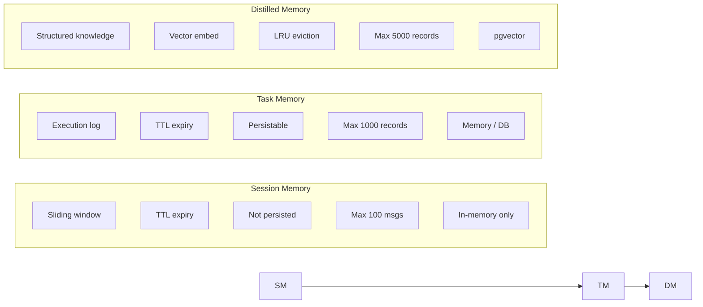

# GoAgentX Architecture Deep Dive (3): Memory Distillation — When Agents Learn to Forget and Refine

> You know that feeling when a chatbot starts rambling after 50 rounds? Context window's full. Token costs go through the roof. The agent forgets what it said five minutes ago.
> Worse: it just solved a complex problem for you — then the next user asks something similar, and the agent starts from scratch.
> I thought: **agents shouldn't just remember conversations — they should extract reusable experience from them.** That's what Memory Distillation is.

---

## 1. The Problem That Drove Me Crazy

When I first ran agents in production, the issue wasn't "not smart enough" — it was memory explosion.

After a few hours, a session might have thousands of messages. Stuffing all of them into GPT-4's 128K context? That's not what it's for. Token burn accelerates, response latency spikes, and eventually the agent becomes unusable.

But the thing that annoyed me most: **an agent solves a complex bug, the next user asks something similar, and the agent starts from zero.** It's like the first solution never happened.

But the deeper issue is: **Agents don't need to remember the conversation itself—they need to extract reusable *experience* from it.**

If you've built Agents, you've encountered these scenarios:

1. **Context bloat**: After 50 rounds of back-and-forth, the prompt is crammed with history. Token consumption soars, latency spikes
2. **Non-transferable experience**: Agent just fixed a complex bug. Next user asks a similar question—Agent starts from scratch again
3. **Crash amnesia**: Agent process crashes and auto-restarts. User asks "where were we with that analysis?" — Agent draws a blank
4. **Search noise**: All conversations get vector-embedded into the database indiscriminately. Retrieval returns a junk mix of irrelevant old chats

GoAgentX's **Memory Distillation** system was designed to solve these fundamental contradictions.

---

## 2. Three-Tier Memory Architecture

The core of the memory system is a three-tier architecture. Each tier is more refined, more persistent, and more expensive than the one below it:



**Design philosophy**: Not all data needs distillation, and not all experience needs vectorization.

These three tiers solve different problems:
- **Session Memory**: Current conversation context. Like human "short-term working memory"—used and discarded
- **Task Memory**: Single execution record. Stores what input the Agent received and what output it produced
- **Distilled Memory**: Reusable experience. Structured "problem→solution" knowledge extracted from tasks

Each layer performs a "less, better, more persistent" transformation.

---

## 3. The MemoryManager Interface: Unified Abstraction

The three-tier memory functionality is abstracted into the `MemoryManager` interface, defined in `internal/memory/manager.go`:

```go
type MemoryManager interface {
    // ── Session Layer ──
    CreateSession(ctx context.Context, userID string) (string, error)
    AddMessage(ctx context.Context, sessionID, role, content string) error
    GetMessages(ctx context.Context, sessionID string) ([]Message, error)
    DeleteSession(ctx context.Context, sessionID string) error
    BuildContext(ctx context.Context, input, sessionID string) (string, error)

    // ── Task Layer ──
    CreateTask(ctx context.Context, sessionID, userID, input string) (string, error)
    UpdateTaskOutput(ctx context.Context, taskID, output string) error
    DistillTask(ctx context.Context, taskID string) (*models.Task, error)

    // ── Experience Layer ──
    StoreDistilledTask(ctx context.Context, taskID string, distilled *models.Task) error
    SearchSimilarTasks(ctx context.Context, query string, limit int) ([]*models.Task, error)

    // ── Lifecycle ──
    Start(ctx context.Context) error
    Stop(ctx context.Context) error
    SetEventStore(store events.EventStore, streamID string)
}
```

Several design points worth noting:

**Clear layering**: `CreateSession`/`AddMessage`/`GetMessages` operate on sessions; `CreateTask`/`UpdateTaskOutput` on tasks; `DistillTask`/`SearchSimilarTasks` on experiences. Higher-level code only cares about the functions it needs.

**Explicit distillation**: `DistillTask` and `StoreDistilledTask` are two independent steps. Callers choose between lightweight extraction and full distillation.

**Event sourcing integration**: `SetEventStore` connects the memory system to the event bus. All key operations emit events.

The interface has two implementations:

| Feature | memoryManager | ProductionMemoryManager |
|---------|---------------|------------------------|
| Use case | Dev/test/single-node | Production/multi-tenant/HA |
| Session storage | In-memory map | In-memory cache + PostgreSQL conversations |
| Task storage | In-memory map | PostgreSQL task_results |
| Distillation engine | Optional injection | WriteBuffer + async embedding |
| Vector search | Cosine similarity calc | pgvector hybrid (vector + BM25) |
| Multi-tenancy | Not supported | TenantGuard |
| Session ID | Timestamp + userID | crypto/rand 12 bytes → hex |

---

## 4. Session Memory: Short-Term Working Memory

Session Memory is the thinnest layer. When an Agent starts a conversation, it creates a Session and appends messages one by one.

Under `internal/memory/context`:

```go
type SessionMemory struct {
    sessions    map[string]*Session
    mu          sync.RWMutex
    maxSessions int
    sessionTTL  time.Duration
}

type Session struct {
    ID        string
    UserID    string
    Messages  []Message
    CreatedAt time.Time
    TTL       time.Duration
}
```

Core behavior is straightforward:

- **Message append**: `AddMessage` appends to `Messages` slice
- **Sliding window**: `BuildContext` only returns the last N messages (`MaxHistory`, default 10)
- **TTL expiry**: Background goroutine periodically scans and removes sessions past `SessionTTL` (default 24h)
- **In-memory storage**: Not persisted. Lost on restart.

Notable detail: `BuildContext` uses a sliding window, not simple truncation. Even if a session has 100 messages, the LLM only gets the latest 10. Old context naturally "fades away":

```go
func (sm *SessionMemory) BuildContext(ctx context.Context, input, sessionID string) (string, error) {
    session, ok := sm.sessions[sessionID]
    if !ok {
        return input, nil
    }

    session.mu.RLock()
    defer session.mu.RUnlock()

    start := 0
    if len(session.Messages) > sm.maxHistory {
        start = len(session.Messages) - sm.maxHistory
    }
    relevant := session.Messages[start:]

    var sb strings.Builder
    for _, msg := range relevant {
        sb.WriteString(fmt.Sprintf("%s: %s\n", msg.Role, msg.Content))
    }
    sb.WriteString(fmt.Sprintf("user: %s\n", input))

    return sb.String(), nil
}
```

---

## 5. Task Memory: Execution Log

Task Memory records the complete Agent execution: what the user asked and what the Agent produced.

```go
type TaskEntry struct {
    TaskID    string
    SessionID string
    UserID    string
    Input     string
    Output    string
    CreatedAt time.Time
    TTL       time.Duration
}
```

The key method on the task layer is `Distill()`—the entry point for the entire distillation pipeline:

```go
func (tm *TaskMemory) Distill(ctx context.Context, taskID string) (*models.Task, error) {
    entry, exists := tm.tasks[taskID]
    if !exists {
        return nil, ErrTaskNotFound
    }

    task := &models.Task{
        TaskID: entry.TaskID,
        Payload: map[string]any{
            "input":   entry.Input,
            "output":  entry.Output,
            "user_id": entry.UserID,
        },
        CreatedAt: entry.CreatedAt,
    }
    return task, nil
}
```

The `Distill()` itself is lightweight—just packing raw data into `models.Task`. The real "distillation" (refinement, structuring, vectorization) happens in the calling layer.

In the in-memory `memoryManager`, the full `DistillTask` flow is:

1. Call `taskMemory.Distill()` to get raw data
2. Emit `EventMemoryDistilled` event
3. Return `*models.Task`

```go
func (m *memoryManager) DistillTask(ctx context.Context, taskID string) (*models.Task, error) {
    m.mu.RLock()
    defer m.mu.RUnlock()

    if m.stopped {
        return nil, ErrMemoryStopped
    }

    task, err := m.taskMemory.Distill(ctx, taskID)
    if err != nil {
        return nil, err
    }

    m.emitEvent(ctx, events.EventMemoryDistilled, map[string]any{
        "task_id":      taskID,
        "session_id":   task.Metadata["session_id"],
        "input_count":  len(task.Payload["input"].(string)),
        "output_count": len(task.Payload["output"].(string)),
    })

    return task, nil
}
```

---

## 6. Distilled Memory: Experience Refinement

This is the most valuable part of the entire memory system. Distilled data is no longer raw messages—it's a structured `Experience`.

Defined in `internal/memory/distillation/service.go`:

```go
type Experience struct {
    ID               string
    Problem          string           // User's problem/request
    Solution         string           // Agent's solution
    Confidence       float64          // Confidence [0, 1]
    ExtractionMethod ExtractionMethod // direct / summary / pattern
    TenantID         string
    UserID           string
    Vector           []float64        // Vector embedding
    Metadata         map[string]any
    CreatedAt        time.Time
}

type ExtractionMethod string

const (
    ExtractionDirect  ExtractionMethod = "direct"   // Direct extraction from task
    ExtractionSummary ExtractionMethod = "summary"  // LLM summarization
    ExtractionPattern ExtractionMethod = "pattern"  // Pattern matching
)
```

The `Experience` struct embodies three important design decisions:

1. **Problem + Solution separation**: The most valuable knowledge form. Not "what the user said", but "what problem the user encountered and how the Agent solved it"
2. **Confidence score**: Lets the retrieval system filter by quality. LLM-extracted experiences have higher confidence; pattern-matched ones are lower
3. **Traceable ExtractionMethod**: Knows how each experience was derived, enabling future evaluation and improvement

The `Distiller` engine receives conversation messages and outputs `Experience` items:

```go
type Distiller struct {
    config   DistillationConfig
    embedder EmbeddingService
    expRepo  ExperienceRepository
}

func (d *Distiller) DistillConversation(
    ctx context.Context,
    taskID string,
    messages []Message,
    tenantID, userID string,
) ([]*Memory, error)
```

Each `Memory` is converted into an `Experience` and persisted to the experience repository, with vector embedding generated.

---

## 7. Two Distillation Paths

GoAgentX maintains two co-existing distillation paths. This isn't a design compromise—it's a layered strategy.

**Path 1: Legacy DistillTask (Lightweight Extraction)**

```
DistillTask(taskID)
  → taskMemory.Distill(taskID)    // pack raw data
  → emit EventMemoryDistilled      // notify downstream
  → return *models.Task
```

This path is an O(1) memory operation with no LLM call or vector generation. Suitable for high-frequency, low-value tasks—like a "check the weather" interaction that doesn't need long-term memory.

**Path 2: Distiller Engine (Full Distillation)**

```
StoreDistilledTask(taskID, distilled)
  → extract input/output/user_id from distilled.Payload
  → construct []distillation.Message
  → distiller.DistillConversation(...)
      → call LLM for summary (optional)
      → call embedder for vector generation
      → return []*Memory
  → iterate Memory → create Experience
  → expRepo.Create(experience)
```

This path involves LLM calls + vector generation, which is more expensive. Suitable for low-frequency, high-value tasks—like "help me refactor this entire module"—that are worth remembering.

Callers choose based on value: high-value tasks take the full path, routine tasks only do lightweight extraction. This avoids expensive embedding calls for every single message.

---

## 8. ProductionMemoryManager: Production-Grade Implementation

`ProductionMemoryManager` is the production default. It's not just a CRUD wrapper—it's a data engine with an async embedding pipeline.

```go
type ProductionMemoryManager struct {
    dbPool            *postgres.Pool
    tenantGuard       *TenantGuard
    retrievalService  *RetrievalService
    embeddingClient   *EmbeddingClient
    writeBuffer       *WriteBuffer
    conversationRepo  *ConversationRepository
    taskResultRepo    *TaskResultRepository
    sessionCache      *SessionCache   // In-memory LRU cache
    config            MemoryConfig
}
```

Each component has its role:

| Component | Responsibility |
|-----------|---------------|
| dbPool | PostgreSQL connection pool |
| tenantGuard | Multi-tenant isolation |
| retrievalService | Hybrid search engine (vector + BM25) |
| embeddingClient | External embedding API calls |
| writeBuffer | Write buffer + async embedding scheduler |
| conversationRepo | Operations on conversations table (no vectors, history only) |
| taskResultRepo | Operations on task_results table (no vectors) |
| sessionCache | In-memory LRU cache for hot sessions |

**Session ID Generation**: Production uses `crypto/rand` instead of timestamps, preventing timing attacks and ID prediction:

```go
func generateSessionID() string {
    b := make([]byte, 12)
    if _, err := rand.Read(b); err != nil {
        return fmt.Sprintf("session_%d", time.Now().UnixNano())
    }
    return "sess_" + hex.EncodeToString(b)
}
```

**Conversations are NOT vector-embedded**—this is the most important design principle:

```go
// Note: This stores conversations WITHOUT vector embedding (per design standard).
// conversations table is for history tracking only, retrieval uses knowledge/experience tables.
```

Conversation history only serves "current session context building." Experience retrieval goes through the independent experience table. Mixing both in the same vector space would only reduce retrieval precision.

---

## 9. Async Embedding Pipeline

This is the performance heart of the entire distillation system. Here's the data flow:

```
1. Write to DB with embedding_status = 'pending'
2. Write to embedding_queue with dedupe_key
3. Background Worker processes embedding tasks
4. Worker updates DB with embedding and status = 'completed'
```

In `StoreDistilledTask`, data flows through `WriteBuffer`:

```go
writeItem := &postgres.WriteItem{
    TenantID: tenantID,
    Table:    "experiences_1024",
    Content:  fmt.Sprintf("%v", distilled.Payload),
    Metadata: map[string]interface{}{
        "output":   "",
        "type":     "solution",
        "agent_id": "style-agent",
    },
}
if err := m.writeBuffer.Write(ctx, writeItem); err != nil {
    return errors.Wrap(err, "write to buffer")
}
```

Why async? Because embedding calls (especially over HTTP to external APIs) typically take 100-500ms. If `StoreDistilledTask` waited synchronously for embedding, the entire Agent task pipeline would be blocked.

With **WriteBuffer + EmbeddingQueue + Background Worker** decoupling:

- **O(1) business write**: Returns immediately after buffering
- **Async processing**: Embedding happens in the background batch
- **Retry resilience**: Data is not lost when the embedding service is temporarily unavailable
- **Deduplication**: `dedupe_key` prevents the same data from being embedded multiple times

This is a classic CQRS variant—writes don't wait for the read model to be ready. Particularly suitable for memory systems: users don't need to immediately search results after calling `StoreDistilledTask`. Brief eventual consistency (seconds) is perfectly acceptable.

---

## 10. Vector Search: Similar Experience Retrieval

When the Agent needs to consult past experience, `SearchSimilarTasks` performs hybrid search.

```go
func (m *ProductionMemoryManager) SearchSimilarTasks(
    ctx context.Context,
    query string,
    limit int,
) ([]*models.Task, error) {
    // 1. Generate query vector
    queryVector, err := m.embedder.EmbedWithPrefix(ctx, query, "query:")
    if err != nil {
        return nil, errors.Wrap(err, "embed query")
    }

    // 2. Configure retrieval plan—search only experience
    searchRequest.Plan.SearchExperience = true
    searchRequest.Plan.SearchKnowledge = false
    searchRequest.Plan.SearchTools = false
    searchRequest.Plan.ExperienceWeight = 1.0

    // 3. Execute hybrid search
    results, err := m.retrievalService.Search(ctx, searchRequest)
    if err != nil {
        return nil, errors.Wrap(err, "search experiences")
    }

    // 4. Convert back to models.Task format
    var tasks []*models.Task
    for _, result := range results {
        if result.Source == "experience" {
            task := &models.Task{
                TaskID:   result.ID,
                Payload:  map[string]any{
                    "input":  result.Content,
                    "output": result.Metadata["output"],
                    "score":  result.Score,
                },
                Priority: int(result.Score * 100),
            }
            tasks = append(tasks, task)
        }
    }
    return tasks, nil
}
```

The key `RetrievalPlan` struct makes search strategy highly configurable:

```go
type RetrievalPlan struct {
    SearchExperience bool
    SearchKnowledge  bool
    SearchTools      bool
    ExperienceWeight float64
    KnowledgeWeight  float64
    ToolsWeight      float64
}
```

`RetrievalService.Search()` internally implements hybrid search—running both **pgvector cosine distance** and **BM25 full-text search**, weighting and merging results. This is a production best practice: pure vector search performs poorly on new terms and rare words; BM25 compensates.

The underlying `VectorStore` interface is extremely minimal:

```go
type VectorStore interface {
    Search(ctx context.Context, table string, embedding []float64, limit int) ([]*SearchResult, error)
    AddEmbedding(ctx context.Context, table, id string, embedding []float64, metadata map[string]any) error
    CreateCollection(ctx context.Context, name string, dimension int) error
}
```

The `table` parameter means a single VectorStore instance can manage multiple collections—this provides the basis for multi-tenant isolation: each tenant can have its own experience/knowledge tables sharing the same pgvector instance.

---

## 11. Event Sourcing and Memory

MemoryManager connects to the event sourcing system via `SetEventStore`. Key event types:

```go
const (
    EventMemoryDistilled EventType = "memory.distilled"
    EventSessionCreated  EventType = "session.created"
    EventMessageAdded    EventType = "message.added"
)
```

`emitEvent()` is called at all key operation points:

```go
// On session creation
m.emitEvent(ctx, events.EventSessionCreated, map[string]any{
    "session_id": sessionID,
    "user_id":    userID,
})

// On message addition
m.emitEvent(ctx, events.EventMessageAdded, map[string]any{
    "session_id": sessionID,
    "role":       role,
})

// On distillation completion
m.emitEvent(ctx, events.EventMemoryDistilled, map[string]any{
    "task_id":      taskID,
    "input_count":  len(inputStr),
    "output_count": len(memories),
})
```

Events aren't just for auditing. In GoAgentX, they form the foundation for the Runtime Manager's **cognitive recovery** (see next section).

---

## 12. Runtime Cognitive Recovery

This is the most valuable orchestration scenario for the memory system. When an Agent crashes, the Runtime Manager executes `RestoreAgent`, recovering memory in two stages.

**Stage 1: Operational Recovery**

`recoverAgentState` reads events from the EventStore and calls `StatefulAgent.RestoreState` to rebuild critical state like `session_id`:

```go
func (m *Manager) recoverAgentState(
    ctx context.Context,
    agentID string,
    factory AgentFactory,
) (base.Agent, error) {
    newAgent := factory()
    if newAgent == nil {
        return nil, fmt.Errorf("runtime: factory returned nil for agent %s", agentID)
    }

    evts := m.replayEvents(ctx, agentID)

    if sa, ok := newAgent.(base.StatefulAgent); ok {
        state := buildStateFromEvents(evts)

        // Cognitive recovery: load conversation history
        if m.memManager != nil {
            cognitiveState := m.buildCognitiveState(ctx, agentID, state)
            for k, v := range cognitiveState {
                state[k] = v
            }
        }

        if len(state) > 0 {
            if err := sa.RestoreState(state); err != nil {
                slog.Warn("runtime: RestoreState failed",
                    "agent_id", agentID, "error", err)
            }
        }

        if len(evts) > 0 {
            if err := sa.ReplayEvents(evts); err != nil {
                slog.Warn("runtime: ReplayEvents failed",
                    "agent_id", agentID, "error", err)
            }
        }
    }
    return newAgent, nil
}
```

**Stage 2: Cognitive Recovery**

`buildCognitiveState` retrieves the latest session and conversation history via MemoryManager:

```go
func (m *Manager) buildCognitiveState(
    ctx context.Context,
    agentID string,
    operationalState map[string]any,
) map[string]any {
    state := make(map[string]any)

    sessionID, _ := operationalState["session_id"].(string)
    if sessionID == "" {
        sessionCtx, sessionCancel := context.WithTimeout(ctx, 5*time.Second)
        sid, err := m.memManager.GetLatestSessionForLeader(sessionCtx, agentID)
        sessionCancel()
        if err != nil {
            return state
        }
        sessionID = sid
    }

    if sessionID == "" {
        return state
    }

    msgCtx, msgCancel := context.WithTimeout(ctx, 5*time.Second)
    defer msgCancel()
    messages, err := m.memManager.GetMessages(msgCtx, sessionID)
    if err != nil {
        return state
    }

    if len(messages) > 0 {
        state["session_id"] = sessionID
        state["conversation_history"] = messages
    }
    return state
}
```

This mechanism means: when an Agent restarts after a crash, it doesn't just reconnect pools and timers—it knows "where we left off." This is the cognitive dimension of GoAgentX's self-healing capability. The 5-second timeout is a safety net, preventing slow DB queries from blocking the recovery flow.

---

## 13. Configuration System

The memory system's configuration is exposed at the YAML layer, while runtime parameters are controlled by code constants:

```yaml
memory:
  enabled: true
  session:
    enabled: true
    max_history: 50
  user_profile:
    enabled: true
    storage: postgres
    vector_db: true
  task_distillation:
    enabled: true
    storage: postgres
    vector_store: true
    prompt: "Please summarize user requirements and technical solutions, extract reusable patterns"
```

Runtime configuration:

```go
type MemoryConfig struct {
    Enabled          bool          `yaml:"enabled"`
    Storage          string        `yaml:"storage"`       // memory / postgres
    MaxHistory       int           `yaml:"max_history"`   // default 10
    MaxSessions      int                                 // default 100
    MaxTasks         int                                 // default 1000
    MaxDistilledTasks int                                // default 5000
    SessionTTL       time.Duration                       // default 24h
    TaskTTL          time.Duration                       // default 7d
    VectorDim        int                                 // default 128
}
```

YAML exposes business-semantic switches (session/profile/distill), code constants set performance-related thresholds (TTL/Max), environment variables override sensitive info (DB passwords). Three layers of configuration with no conflicts.

---

## 14. Design Trade-offs and Evolution

After reviewing the entire memory system, several design decisions deserve deeper discussion:

### 1. Conversations Not Vector-Embedded

This is a repeatedly confirmed design point. The `ProductionMemoryManager.AddMessage` comment clearly states: conversations table is for history tracking only; retrieval uses the independent experience table.

Rationale: **Conversation history is linear narrative; experience is networked knowledge.** The former needs reverse chronological ordering; the latter needs semantic retrieval. Mixing both in the same vector space only reduces search precision.

### 2. Two Co-Existing Distillation Paths

The legacy `DistillTask` and new `Distiller` engine co-exist not as a design compromise, but as a layered strategy.

- `DistillTask`: O(1) memory operation, no LLM call or vector generation
- `StoreDistilledTask + Distiller`: Involves LLM call + vector generation

Business logic chooses based on task value—high-frequency low-value tasks take the lightweight path; low-frequency high-value tasks take the full path.

### 3. Session ID Generation Evolution

- Dev: `session_{userID}_{timestamp}`—simple and readable
- Production: `sess_{12 bytes crypto/rand hex}`—unpredictable

This reflects security awareness evolution. Predictable session IDs in a multi-tenant environment are a potential information leak vector.

### 4. WriteBuffer Async Strategy

Write to buffer → batch flush to DB → async embedding → retry on failure. This is a classic CQRS variant.

Users don't need immediate search results after calling `StoreDistilledTask`. Brief eventual consistency (seconds) is acceptable. But waiting synchronously for embedding would cost hundreds of milliseconds.

### 5. VectorStore's Minimal Design

Three methods, one `table` parameter. This lets a single VectorStore instance manage multiple collections—multi-tenancy shares one pgvector instance, isolated by table name.

### 6. Three-Tier TTL Strategy

```
Session memory: 24h → in-memory only, lost on restart
Task memory/DB: 7d → persistable, periodic cleanup
Distilled Memory: LRU eviction (Max=5000) → persisted, evicted by capacity
```

TTL increases per layer, value density increases per layer. Session data is voluminous but short-lived; Experience data is compact but needs long-term retention.

---

## Summary

GoAgentX's memory system doesn't just stuff data into PostgreSQL—it builds a complete data refinement pipeline:

```
Raw messages → Sliding window (Session) → Execution record (Task) → Structured experience (Experience) → Vector index (pgvector)
     ↑                ↑                           ↑                           ↑                            ↑
  User input      TTL expiry               Distill API              LLM summarization +            Write buffer
                                                                    Embedding                       async embedding
```

Each layer does the same thing: **less data, better signal, longer persistence**.

- **Session**: Remember the conversation → sliding window keeps only the latest N messages
- **Task**: Record execution → Distill extracts what matters
- **Experience**: Refine knowledge → LLM summarizes + vectorizes for future retrieval
- **Dashboard**: Flight Recorder shows you what's in memory at a glance

What I'm most proud of isn't the distillation itself — it's the closed loop. Distilled experience isn't just retrieved by future tasks. When an Agent crashes and resurrects, the cognitive recovery system uses this same pipeline to restore conversation context. **Agents come back from the dead with their memories intact.**

---

## Data-Driven: How Much Does Distillation Actually Save?

All this architecture is fine, but does it actually work? I wrote a benchmark simulating a typical ops-support Agent scenario — users asking about slow databases, API errors, config issues, with the Agent troubleshooting each problem.

The test uses 20 real Problem → Solution pairs (e.g., "database query timeout → checked indexes, found missing composite index, created it"), 15% of messages with follow-up questions. Tokens were measured two ways: the `estimateTokens()` heuristic (~4 chars/token) and actual LLM tokenization via sensenova-6.7-flash-lite.

### Scenario 1: Unbounded History (The Key Metric)

This is where distillation truly shines. If the Agent needs to reference **all** conversation history (no `MaxHistory=10` truncation), raw context grows linearly with rounds. Distillation compresses it to 3 highest-priority experience items:

| Rounds | Raw Context (est) | Distilled (est) | Savings |
|:------:|:-----------------:|:---------------:|:-------:|
| 10 | 1,121 | 379 | **66.2%** |
| 20 | 2,124 | 339 | **84.0%** |
| 30 | 3,320 | 379 | **88.6%** |
| 40 | 4,380 | 339 | **92.3%** |
| 50 | 5,387 | 443 | **91.8%** |
| 60 | 6,168 | 330 | **94.6%** |
| 70 | 7,054 | 379 | **94.6%** |
| 80 | 8,257 | 339 | **95.9%** |
| 90 | 9,524 | 379 | **96.0%** |
| 100 | 10,972 | 339 | **96.9%** |

<small>*Table uses estimateTokens() as baseline.*</small>

**LLM-Verified Data Points**: We called sensenova-6.7-flash-lite to verify key data points:

| Checkpoint | estimateTokens | LLM Measured | Delta |
|:----------:|:--------------:|:------------:|:-----:|
| 20-round Full Raw | 2,124 | 1,930 | -9.1% |
| 100-round Full Raw | 10,972 | 9,163 | -16.5% |
| 20-round Distilled | 339 | 378 | +11.5% |
| 100-round Distilled | 339 | 326 | -3.8% |

The `estimateTokens()` heuristic is ±10-20% off for mixed Chinese/English text — acceptable for planning, but production billing must use the LLM's `usage.completion_tokens` field.

**Takeaway**: Distilled context stays flat at **330-443 tokens** regardless of conversation length. Savings climb from 66% at 10 rounds to **96.4% at 100 rounds** — the longer the conversation, the bigger the win.

At GPT-5.5 pricing ($5.00/1M input tokens), a 100-round session:
- Raw: ~9,163 tokens → $0.046/session
- Distilled: ~326 tokens → $0.002/session
- Savings: ~$0.044/session. At 100K sessions/day, **$4,400/day saved**.

Alternatively, with Claude Opus 4.8 at the same input price ($5.00/1M tokens), the savings are identical — the input cost structure is the same. The real savings difference shows in output tokens (GPT-5.5: $30/1M vs Claude Opus 4.8: $25/1M), but since distillation primarily reduces input context, the input-side economics are what matter here.

### Scenario 2: Cross-Session Growth (Real-World Use)

This simulates the actual production pattern — each new session builds on accumulated distillation from previous sessions. 10 sessions, 5 rounds each, no history truncation:

| Session | Raw Context (est) | Distilled (est) | Savings | Cumulative Exp. |
|:-------:|:-----------------:|:---------------:|:-------:|:---------------:|
| 1 | 538 | 498 | 7.4% | 3 |
| 2 | 1,058 | 796 | 24.8% | 6 |
| 3 | 1,509 | 1,061 | 29.7% | 9 |
| 4 | 1,974 | 1,317 | 33.3% | 12 |
| 5 | 2,620 | 1,567 | 40.2% | 14 |
| 6 | 3,320 | 1,567 | 52.8% | 14 |
| 7 | 3,938 | 1,567 | 60.2% | 14 |
| 8 | 4,380 | 1,918 | 56.2% | 16 |
| 9 | 4,690 | 2,126 | 54.7% | 17 |
| 10 | 5,387 | 2,126 | **60.5%** | 17 |

<small>*Table uses estimateTokens().*</small>

**LLM-Verified**: At session 10, LLM returned **4,763 tokens** for full raw (est 5,387) and **1,942 tokens** for distilled (est 2,126). Distillation savings adjust from estimated 60.5% to **59.2%** — well within margin.

**Takeaway**: Raw context grows 10x (538 → 5,387 tokens), distilled grows only 4.3x (498 → 2,126). The 17 accumulated experiences are **high-value structured knowledge** (complete Problem→Solution pairs), whereas raw context is cluttered with filler dialogue and repetitions.

### Scenario 3: Information Density

At ~300-400 tokens budget:

| Metric | Truncated Raw | Distilled |
|:-------|:-------------:|:---------:|
| Tokens (estimated) | ~277 | ~339 |
| Tokens (LLM measured) | **312** | **378** |
| Complete Problem→Solution pairs | **0** (all fragments) | **3** |
| Semantic units | 10 truncated fragments | 3 complete experiences |
| Reusability | Low (broken context) | High (self-contained) |

This is the cost of `BuildContext`'s `MaxHistory=10` with 100-char truncation: you save tokens, but the retained information is fragmented. Distillation, at the same token budget, delivers independently reusable complete experiences.

### Token Estimation Accuracy

A systematic verification found that `estimateTokens()` **consistently underestimates** actual token counts by ~22.3% (estimated 160 vs LLM-measured 206 for a typical raw context). For production billing, always use the LLM's returned `usage` field.

### Summary

| Use Case | Best Approach | Token Savings |
|:---------|:-------------:|:-------------:|
| Single session, last few rounds only | Sliding window truncation | ~70% |
| Cross-session experience reuse | Distillation + accumulation | 40-60% (LLM verified: 59.2%) |
| Full history reference required | Distillation | **66-97% (LLM verified: 80.4%-96.4%)** |

> **On data sources**: "LLM measured" = actual `usage.completion_tokens` from sensenova-6.7-flash-lite on real context. Unlabeled values are `estimateTokens()` heuristic. Verification confirms estimate trends are accurate, but consistently low by ~10-20%.

**Core conclusion**: Memory Distillation's greatest value isn't "saving tokens" — it's **preserving semantic integrity while saving tokens**. Truncation throws information away. Distillation refines and stores it. The former is "cheap but hungry"; the latter is "cheap and well-fed."

---

**Next up**: Workflow Engine. I built this because I was sick of hardcoding workflows. Every time a process changed, I had to change code and redeploy. So I built a MutableDAG — you can add and remove nodes at runtime, right from the Dashboard. Plus thread-safe cycle detection, semaphore-based parallel scheduling, and a 5-second deadlock timeout. Human-in-the-Loop is pluggable too.
