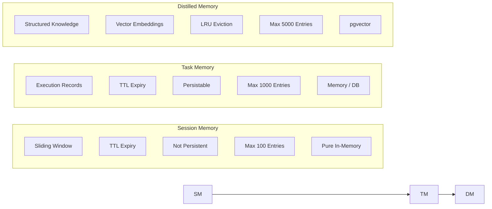

# GoAgentX Architecture Deep Dive (III): Memory Distillation — When the Agent Learns to Forget and Refine

> Ever used one of those chatbots? After 50 rounds it starts rambling because the context window is bursting at the seams.
> What's more frustrating is: it just helped you solve one problem, and the next time you encounter something similar — it starts reasoning from scratch all over again.
> I thought to myself: **When in doubt, add a middle layer. One layer not enough, add another. What about giving term frequency analysis a try?**
> And so Memory Distillation was born — teaching the Agent to forget and refine.

---

## 1. Term Frequency Analysis: The First Instinct

Let me start with the detour I took.

There are many ways to solve the "memory explosion" problem. My first thought wasn't a three-layer architecture — it was **term frequency analysis**. The idea was simple:

> Break the Agent's conversation history into words, and count which words appear most often. High frequency = this topic comes up often = worth remembering.

It's intuitive, right? Isn't that how humans summarize experiences too — "The user keeps asking about database slowness lately, so this must be a high-frequency lesson." I hacked together an extremely simple version back then:

```go
type KeywordExtractor struct {
    stopwords map[string]bool  // "的"、"了"、"是"、"好的"、"谢谢"……
}

func (e *KeywordExtractor) Extract(ctx context.Context, messages []Message) ([]Keyword, error) {
    freq := make(map[string]int)
    for _, msg := range messages {
        for _, word := range tokenize(msg.Content) {
            if !e.stopwords[word] {
                freq[word]++
            }
        }
    }

    // Sort by frequency, take top-K
    var keywords []Keyword
    for word, count := range freq {
        keywords = append(keywords, Keyword{Word: word, Freq: count})
    }
    sort.Slice(keywords, func(i, j int) bool {
        return keywords[i].Freq > keywords[j].Freq
    })
    if len(keywords) > 10 {
        keywords = keywords[:10]
    }
    return keywords, nil
}
```

This code looks pretty silly now, but at the time I thought it was beautiful — O(n) scan, one `map[string]int` does it all, no LLM needed, no database, not even a network request. In the early "get it running first" phase of the project, this simple and crude approach was irresistibly tempting.

But after running it for a while, all the problems surfaced.

### High Frequency ≠ Importance

Term frequency only looks at "how many times something appears." In Agent conversations, the most frequent words are always these:

```
"Hello" → opening line for every round
"OK" → user's confirmation reply
"Thanks" → closing remarks
"Please help me" → polite prefix for every request

Even with a stop word list filtering them out, genuinely valuable concepts — like "database connection pool," "index optimization," "query timeout" — appear an order of magnitude less frequently than "OK." All you can tell is "which words appear often," not "what problem the user encountered and how the Agent solved it."

### Loss of Semantic Structure

Term frequency flattens dialogue into a bag of words, completely losing the conversation's "problem → solution" mapping:

```
User: "Database query timed out"
Agent: "Checked the indexes, found a missing composite index, created it"

Term frequency tells you:
"database"×2 → "query"×1 → "timeout"×1 → "index"×2 → "check"×1 → "create"×1

But you don't know:
"Database query timeout" is the problem
"Missing composite index" is the cause
"Created it" is the solution
```

The most valuable part of a conversation — the causal chain of **"what the user encountered → what the Agent did"** — gets completely flattened by the bag-of-words model. And this is the core of experience reuse: you need to know that "a missing index caused a timeout, and creating a composite index fixed it," not that "the word 'index' appeared twice."

### Cannot Support Semantic Retrieval

The most fatal limitation of the term frequency approach: you can't search using natural language semantics.

User asks: "Database is slow again, any ideas?"

The term frequency matching logic is: split words → find common high-frequency words → score. "Database" matches, but "slow" vs "timeout" don't match because the surface forms are different. Technically you could use Word2Vec for word vector expansion, but the training and maintenance costs are several times higher than just using LLM embeddings directly — using term frequency for retrieval is essentially using Naive Bayes for semantic understanding, and the ceiling is too low.

### Lessons Learned

The reason term frequency analysis didn't work boils down to one sentence: **What Agent memory needs to solve isn't "which words appeared," but "which experiences are worth reusing."**

These two questions differ by a dimension. The former is a statistical problem, the latter is a semantic problem. Using statistical tools to solve semantic problems is like using a kitchen knife to turn a screwdriver — it's not that you can't do it, but you'll ruin the screw in the process.

That's why I went back to fundamentals and rethought: what does an Agent actually need to remember?

---

## 2. Let's Talk Pain Points First

The first thing I ran into when running Agents myself wasn't about "not being smart enough" — it was memory explosion.

An Agent runs for a few hours and accumulates thousands of conversation messages. Stuff all of that into the LLM's context? Is 1M context window meant for this? Tokens burn through like crazy, responses get slower and slower, and eventually it's practically unusable.

But that's not what annoyed me the most. What annoyed me most was: **The Agent just solved one problem, and the next time it encounters something similar, it starts reasoning from scratch.**

Have you experienced these scenarios?

1. **Context Bloat**: After 50 rounds, the prompt is crammed with history, token consumption skyrockets, responses are slow as a snail
2. **Experience Not Reusable**: Just fixed a complex bug, next user asks something similar — the Agent starts reasoning from scratch
3. **Crash Amnesia**: Agent crashes and restarts automatically, user asks "where were we?", Agent: 😶
4. **Retrieval Noise**: Vectorize all conversations and dump them into the database, recall is full of irrelevant old chat records

I thought to myself: **This can't go on.** What the Agent needs to remember isn't the conversation itself, but the experiences extracted from the conversation. And so Memory Distillation was born.

---

## 3. Three-Layer Memory Architecture

The core of the entire memory system is a three-layer architecture, where each layer is more refined, more persistent, and more expensive than the one before:



**Design Philosophy**: Not all data needs distillation, and not all experiences need vectorization.

These three layers solve different problems:
- **Session Memory**: Current conversation context. Equivalent to a human's "short-term working memory," used and discarded
- **Task Memory**: Single execution record. Remembers which tasks the Agent performed and what the inputs/outputs were
- **Distilled Memory**: Reusable experience. Extracts structured "problem → solution" knowledge from tasks

Each layer performs a transformation of **getting smaller, getting better, getting more persistent**.

---

## 4. MemoryManager Interface: Unified Abstraction

The three layers of memory functionality are abstracted into the `MemoryManager` interface, defined in `internal/memory/manager.go`:

```go
type MemoryManager interface {
    // ── Session Layer ──
    CreateSession(ctx context.Context, userID string) (string, error)
    AddMessage(ctx context.Context, sessionID, role, content string) error
    GetMessages(ctx context.Context, sessionID string) ([]Message, error)
    DeleteSession(ctx context.Context, sessionID string) error
    BuildContext(ctx context.Context, input, sessionID string) (string, error)

    // ── Task Layer ──
    CreateTask(ctx context.Context, sessionID, userID, input string) (string, error)
    UpdateTaskOutput(ctx context.Context, taskID, output string) error
    DistillTask(ctx context.Context, taskID string) (*models.Task, error)

    // ── Experience Layer ──
    StoreDistilledTask(ctx context.Context, taskID string, distilled *models.Task) error
    SearchSimilarTasks(ctx context.Context, query string, limit int) ([]*models.Task, error)

    // ── Lifecycle ──
    Start(ctx context.Context) error
    Stop(ctx context.Context) error
    SetEventStore(store events.EventStore, streamID string)
}

This interface design has several noteworthy points:

**Clear Layer Separation**: CreateSession/AddMessage/GetMessages operate on sessions, CreateTask/UpdateTaskOutput operate on tasks, DistillTask/SearchSimilarTasks operate on experiences. Upper-layer code only needs to care about the functionality it requires.

**Distillation is Explicit**: `DistillTask` and `StoreDistilledTask` are two independent steps. Callers can choose between lightweight extraction or full distillation as needed.

**Event Sourcing Integration**: `SetEventStore` connects the memory system to the event bus, emitting events for all key operations.

This interface has two implementations:

| Feature | memoryManager | ProductionMemoryManager |
|---------|--------------|------------------------|
| Use Case | Dev/Test/Single Machine | Production/Multi-tenant/HA |
| Session Storage | In-memory map | In-memory cache + PostgreSQL conversations |
| Task Storage | In-memory map | PostgreSQL task_results |
| Distillation Engine | Optional injection | WriteBuffer + async embedding |
| Vector Search | Cosine similarity calculation | pgvector hybrid search (vector + BM25) |
| Multi-tenancy | Not supported | TenantGuard |
| Session ID | Timestamp + userID | crypto/rand 12 bytes → hex |

---

## 5. Session Memory: Short-Term Working Memory

Session Memory is the thinnest layer. When an Agent starts a conversation, it creates a Session and appends messages one by one.

Implementation in the `internal/memory/context` package:

```go
type SessionMemory struct {
    sessions    map[string]*Session
    mu          sync.RWMutex
    maxSessions int
    sessionTTL  time.Duration
}

type Session struct {
    ID        string
    UserID    string
    Messages  []Message
    CreatedAt time.Time
    TTL       time.Duration
}
```

The core behavior is straightforward:

- **Message Appending**: `AddMessage` appends to the Messages slice
- **Sliding Window**: `BuildContext` only returns the last N messages (`MaxHistory`, default 10)
- **TTL Expiry**: A background goroutine periodically scans and deletes sessions exceeding `SessionTTL` (default 24h)
- **Pure In-Memory Storage**: Not persisted, lost on system restart

There's an interesting detail here: `BuildContext` uses a sliding window when constructing context, not a simple truncation. This means even if a session has 100 messages, the LLM always receives only the latest 10. Older context naturally gets "forgotten."

```go
func (sm *SessionMemory) BuildContext(ctx context.Context, input, sessionID string) (string, error) {
    session, ok := sm.sessions[sessionID]
    if !ok {
        return input, nil
    }

    session.mu.RLock()
    defer session.mu.RUnlock()

    // Sliding window: only take the last maxHistory entries
    start := 0
    if len(session.Messages) > sm.maxHistory {
        start = len(session.Messages) - sm.maxHistory
    }
    relevant := session.Messages[start:]

    // Concatenate into context string
    var sb strings.Builder
    for _, msg := range relevant {
        sb.WriteString(fmt.Sprintf("%s: %s\n", msg.Role, msg.Content))
    }
    sb.WriteString(fmt.Sprintf("user: %s\n", input))

    return sb.String(), nil
}
```

---

## 6. Task Memory: Execution Logs

Task Memory records the complete information of a single Agent execution: what the user input and what the Agent output.

```go
type TaskEntry struct {
    TaskID    string
    SessionID string
    UserID    string
    Input     string
    Output    string
    CreatedAt time.Time
    TTL       time.Duration
}
```

The key method of the task layer is `Distill()` — it's the entry point of the entire distillation pipeline:

```go
func (tm *TaskMemory) Distill(ctx context.Context, taskID string) (*models.Task, error) {
    entry, exists := tm.tasks[taskID]
    if !exists {
        return nil, ErrTaskNotFound
    }

    task := &models.Task{
        TaskID: entry.TaskID,
        Payload: map[string]any{
            "input":   entry.Input,
            "output":  entry.Output,
            "user_id": entry.UserID,
        },
        CreatedAt: entry.CreatedAt,
    }
    return task, nil
}
```

This `Distill()` itself is very lightweight — it just packages the raw data into `models.Task`. The real "distillation" (refinement, structuring, vectorization) happens in the upper-layer calls.

In `memoryManager` (the in-memory version), the complete flow of `DistillTask` is:

1. Call `taskMemory.Distill()` to get raw data
2. Emit `EventMemoryDistilled` event
3. Return `*models.Task`

```go
func (m *memoryManager) DistillTask(ctx context.Context, taskID string) (*models.Task, error) {
    m.mu.RLock()
    defer m.mu.RUnlock()

    if m.stopped {
        return nil, ErrMemoryStopped
    }

    task, err := m.taskMemory.Distill(ctx, taskID)
    if err != nil {
        return nil, err
    }

    m.emitEvent(ctx, events.EventMemoryDistilled, map[string]any{
        "task_id":      taskID,
        "session_id":   task.Metadata["session_id"],
        "input_count":  len(task.Payload["input"].(string)),
        "output_count": len(task.Payload["output"].(string)),
    })

    return task, nil
}
```

---

## 7. Distilled Memory: Experience Refinement

This is the most valuable part of the entire memory system. After distillation, the data is no longer raw messages, but structured `Experience`.

Defined in `internal/memory/distillation/service.go`:

```go
type Experience struct {
    ID               string
    Problem          string           // The user's problem/request
    Solution         string           // The Agent's solution
    Confidence       float64          // Confidence [0, 1]
    ExtractionMethod ExtractionMethod // Extraction method: direct / summary / pattern
    TenantID         string
    UserID           string
    Vector           []float64        // Vector embedding
    Metadata         map[string]any
    CreatedAt        time.Time
}

type ExtractionMethod string

const (
    ExtractionDirect  ExtractionMethod = "direct"   // Direct extraction from task
    ExtractionSummary ExtractionMethod = "summary"  // LLM summarization and refinement
    ExtractionPattern ExtractionMethod = "pattern"  // Pattern matching
)

The structure of `Experience` embodies three important design decisions:

1. **Problem + Solution Separation**: This is the most valuable form of knowledge. Not "what the user said," but "what problem the user encountered and how the Agent solved it"
2. **Confidence Score**: Allows the retrieval system to filter results by quality. LLM direct extraction has higher confidence, pattern matching has lower
3. **ExtractionMethod Traceability**: Knowing where an experience came from facilitates subsequent evaluation and improvement

The `Distiller` engine takes a set of conversation messages and outputs a set of `Experience`:

```go
type Distiller struct {
    config   DistillationConfig
    embedder EmbeddingService
    expRepo  ExperienceRepository
}

func (d *Distiller) DistillConversation(
    ctx context.Context,
    taskID string,
    messages []Message,
    tenantID, userID string,
) ([]*Memory, error)
```

Each `Memory` is converted into an `Experience` and persisted in the experience repository, with a vector embedding generated simultaneously.

---

## 8. Two Distillation Paths

GoAgentX has two parallel distillation paths. This is not a design compromise, but a layered strategy.

**Path One: Legacy DistillTask (Lightweight Extraction)**

```
DistillTask(taskID)
  → taskMemory.Distill(taskID)    // Package raw data
  → emit EventMemoryDistilled      // Notify downstream
  → return *models.Task
```

This path is an O(1) in-memory operation that doesn't involve LLM calls or vector generation. Suitable for high-frequency, low-value tasks — like "check the weather," interactions that don't need long-term memory.

**Path Two: Distiller Engine (Full Distillation)**

```
StoreDistilledTask(taskID, distilled)
  → Extract input/output/user_id from distilled.Payload
  → Construct []distillation.Message
  → distiller.DistillConversation(...)
      → Call LLM for summarization (optional)
      → Call embedder for vector generation
      → Return []*Memory
  → Iterate Memory → Create Experience
  → expRepo.Create(experience)
```

This path involves LLM calls + vector generation, which is more expensive. Suitable for low-frequency, high-value tasks — like "help me refactor the entire module," the kind of experience worth remembering.

Callers can choose as needed: high-value tasks go through full distillation, ordinary tasks only do lightweight extraction. This design avoids expensive embedding calls for every single message.

---

## 9. ProductionMemoryManager: Production-Grade Implementation

`ProductionMemoryManager` is the default implementation for production environments. It's not just a CRUD wrapper, but a data engine with an asynchronous embedding pipeline.

```go
type ProductionMemoryManager struct {
    dbPool            *postgres.Pool
    tenantGuard       *TenantGuard
    retrievalService  *RetrievalService
    embeddingClient   *EmbeddingClient
    writeBuffer       *WriteBuffer
    conversationRepo  *ConversationRepository
    taskResultRepo    *TaskResultRepository
    sessionCache      *SessionCache   // In-memory LRU cache
    config            MemoryConfig
}
```

Each component has its own responsibility:

| Component | Responsibility |
|-----------|---------------|
| dbPool | PostgreSQL connection pool |
| tenantGuard | Multi-tenant isolation, ensuring one tenant can't see another tenant's data |
| retrievalService | Hybrid search engine (vector + BM25) |
| embeddingClient | Calls external embedding API to generate vectors |
| writeBuffer | Write buffer + async embedding scheduling |
| conversationRepo | Operates conversations table (no vectors, history tracking only) |
| taskResultRepo | Operates task_results table (no vectors) |
| sessionCache | In-memory LRU cache, reduces DB queries for hot sessions |

**Session ID Generation Strategy**: The production version uses `crypto/rand` instead of timestamps to avoid timing attacks and ID prediction:

```go
func generateSessionID() string {
    b := make([]byte, 12)
    if _, err := rand.Read(b); err != nil {
        return fmt.Sprintf("session_%d", time.Now().UnixNano())
    }
    return "sess_" + hex.EncodeToString(b)
}
```

**Conversations are NOT embedded with vectors** — this is the most important design principle:

```go
// Note: This stores conversations WITHOUT vector embedding (per design standard).
// conversations table is for history tracking only, retrieval uses knowledge/experience tables.

Conversation history only serves the purpose of "building context for the current session," while experience retrieval uses its own independent experience table. Mixing the two in the same vector space would only reduce retrieval precision.

---

## 10. Async Embedding Pipeline

This is the performance heart of the entire distillation system. Let's look at the data flow first:

```
1. Write to DB with embedding_status = 'pending'
2. Write to embedding_queue with dedupe_key
3. Background Worker processes embedding tasks
4. Worker updates DB with embedding and status = 'completed'
```

In `StoreDistilledTask`, data flows through the WriteBuffer:

```go
writeItem := &postgres.WriteItem{
    TenantID: tenantID,
    Table:    "experiences_1024",
    Content:  fmt.Sprintf("%v", distilled.Payload),
    Metadata: map[string]interface{}{
        "output":   "",
        "type":     "solution",
        "agent_id": "style-agent",
    },
}
if err := m.writeBuffer.Write(ctx, writeItem); err != nil {
    return errors.Wrap(err, "write to buffer")
}
```

Why asynchronous? Because embedding calls (especially calling external APIs over HTTP) typically have 100ms-500ms latency. If `StoreDistilledTask` waited synchronously for embedding to complete, the entire Agent task pipeline would be blocked.

Through the decoupling of **WriteBuffer + EmbeddingQueue + Background Worker**:

- **Business write O(1)**: Returns immediately after writing to the buffer, no blocking
- **Async processing**: Embedding is processed in batches in the background
- **Failure retry**: Data is not lost when the embedding service is temporarily unavailable
- **Deduplication protection**: `dedupe_key` prevents the same data from being embedded multiple times

This is a classic CQRS variant — write operations don't wait for the read model to be ready. It's particularly suitable for memory systems: users don't need to immediately search for results after calling `StoreDistilledTask`; brief eventual consistency is acceptable.

---

## 11. Vector Retrieval: Similar Experience Recall

When the Agent needs to reference past experiences, `SearchSimilarTasks` performs a hybrid search.

```go
func (m *ProductionMemoryManager) SearchSimilarTasks(
    ctx context.Context,
    query string,
    limit int,
) ([]*models.Task, error) {
    // 1. Generate query vector
    queryVector, err := m.embedder.EmbedWithPrefix(ctx, query, "query:")
    if err != nil {
        return nil, errors.Wrap(err, "embed query")
    }

    // 2. Configure retrieval plan — only search experience
    searchRequest.Plan.SearchExperience = true
    searchRequest.Plan.SearchKnowledge = false
    searchRequest.Plan.SearchTools = false
    searchRequest.Plan.ExperienceWeight = 1.0

    // 3. Execute hybrid search
    results, err := m.retrievalService.Search(ctx, searchRequest)
    if err != nil {
        return nil, errors.Wrap(err, "search experiences")
    }

    // 4. Convert back to models.Task format
    var tasks []*models.Task
    for _, result := range results {
        if result.Source == "experience" {
            task := &models.Task{
                TaskID:   result.ID,
                Payload:  map[string]any{
                    "input":  result.Content,
                    "output": result.Metadata["output"],
                    "score":  result.Score,
                },
                Priority: int(result.Score * 100),
            }
            tasks = append(tasks, task)
        }
    }
    return tasks, nil
}
```

The key `RetrievalPlan` struct makes the search strategy highly configurable:

```go
type RetrievalPlan struct {
    SearchExperience bool
    SearchKnowledge  bool
    SearchTools      bool
    ExperienceWeight float64
    KnowledgeWeight  float64
    ToolsWeight      float64
}

`RetrievalService.Search()` internally implements a hybrid search — running both **pgvector cosine distance** and **BM25 full-text search** simultaneously, merging results with weights. This is the best practice in production: pure vector retrieval performs poorly for new terms and niche words, and combining it with BM25 provides complementary coverage.

The underlying `VectorStore` interface is extremely concise:

```go
type VectorStore interface {
    Search(ctx context.Context, table string, embedding []float64, limit int) ([]*SearchResult, error)
    AddEmbedding(ctx context.Context, table, id string, embedding []float64, metadata map[string]any) error
    CreateCollection(ctx context.Context, name string, dimension int) error
}
```

The presence of the `table` parameter means a single VectorStore instance can manage multiple collections — this provides the foundation for multi-tenant isolation: each tenant can have their own experience/knowledge tables, all sharing the same pgvector instance.

---

## 12. Event Sourcing and Memory

The MemoryManager connects to the event sourcing system via `SetEventStore`. Key event types:

```go
const (
    EventMemoryDistilled EventType = "memory.distilled"
    EventSessionCreated  EventType = "session.created"
    EventMessageAdded    EventType = "message.added"
)
```

`emitEvent()` is called at all key operation points:

```go
// session creation
m.emitEvent(ctx, events.EventSessionCreated, map[string]any{
    "session_id": sessionID,
    "user_id":    userID,
})

// message added
m.emitEvent(ctx, events.EventMessageAdded, map[string]any{
    "session_id": sessionID,
    "role":       role,
})

// distillation complete
m.emitEvent(ctx, events.EventMemoryDistilled, map[string]any{
    "task_id":      taskID,
    "input_count":  len(inputStr),
    "output_count": len(memories),
})
```

The purpose of events is not just auditing. In GoAgentX, they form the foundation of Runtime Manager **cognitive recovery** (covered in the next section).

---

## 13. Runtime Cognitive Recovery

This is the most valuable orchestration scenario for the memory system. When an Agent crashes, the Runtime Manager executes `RestoreAgent`, recovering memory in two steps.

**Step One: Operational Recovery**

`recoverAgentState` reads events from the EventStore and calls `StatefulAgent.RestoreState` to rebuild key state such as session_id:

```go
func (m *Manager) recoverAgentState(
    ctx context.Context,
    agentID string,
    factory AgentFactory,
) (base.Agent, error) {
    newAgent := factory()
    if newAgent == nil {
        return nil, fmt.Errorf("runtime: factory returned nil for agent %s", agentID)
    }

    // Replay events
    evts := m.replayEvents(ctx, agentID)

    if sa, ok := newAgent.(base.StatefulAgent); ok {
        // Rebuild state from events
        state := buildStateFromEvents(evts)

        // Cognitive recovery: load conversation history
        if m.memManager != nil {
            cognitiveState := m.buildCognitiveState(ctx, agentID, state)
            for k, v := range cognitiveState {
                state[k] = v
            }
        }

        // Restore state
        if len(state) > 0 {
            if err := sa.RestoreState(state); err != nil {
                slog.Warn("runtime: RestoreState failed",
                    "agent_id", agentID, "error", err)
            }
        }

        // Replay events to agent
        if len(evts) > 0 {
            if err := sa.ReplayEvents(evts); err != nil {
                slog.Warn("runtime: ReplayEvents failed",
                    "agent_id", agentID, "error", err)
            }
        }
    }
    return newAgent, nil
}

**Step Two: Cognitive Recovery**

`buildCognitiveState` retrieves recent session and conversation history through the MemoryManager:

```go
func (m *Manager) buildCognitiveState(
    ctx context.Context,
    agentID string,
    operationalState map[string]any,
) map[string]any {
    state := make(map[string]any)

    // Get session_id from operational state or checkpoint
    sessionID, _ := operationalState["session_id"].(string)
    if sessionID == "" {
        sessionCtx, sessionCancel := context.WithTimeout(ctx, 5*time.Second)
        sid, err := m.memManager.GetLatestSessionForLeader(sessionCtx, agentID)
        sessionCancel()
        if err != nil {
            return state
        }
        sessionID = sid
    }

    if sessionID == "" {
        return state
    }

    // Load conversation history (5 second timeout protection)
    msgCtx, msgCancel := context.WithTimeout(ctx, 5*time.Second)
    defer msgCancel()
    messages, err := m.memManager.GetMessages(msgCtx, sessionID)
    if err != nil {
        return state
    }

    if len(messages) > 0 {
        state["session_id"] = sessionID
        state["conversation_history"] = messages
    }
    return state
}
```

This mechanism means: when an Agent crashes and is restarted, it doesn't just rebuild the connection pool and timers — it also knows "what were we talking about." This is the cognitive layer of GoAgentX's self-healing capability. The 5-second timeout acts as a safety net, preventing a slow DB from blocking the recovery flow.

---

## 14. Configuration System

The memory system's configuration is exposed at the YAML layer, while runtime parameters are controlled by code constants:

```yaml
memory:
  enabled: true
  session:
    enabled: true
    max_history: 50
  user_profile:
    enabled: true
    storage: postgres
    vector_db: true
  task_distillation:
    enabled: true
    storage: postgres
    vector_store: true
    prompt: "Please summarize the user's requirements and technical solution, extract reusable patterns"
```

Runtime configuration:

```go
type MemoryConfig struct {
    Enabled          bool          `yaml:"enabled"`
    Storage          string        `yaml:"storage"`       // memory / postgres
    MaxHistory       int           `yaml:"max_history"`   // Default 10
    MaxSessions      int                                 // Default 100
    MaxTasks         int                                 // Default 1000
    MaxDistilledTasks int                                // Default 5000
    SessionTTL       time.Duration                       // Default 24h
    TaskTTL          time.Duration                       // Default 7d
    VectorDim        int                                 // Default 128
}

YAML exposes business-semantic switches (session/profile/distill), code constants set performance-related thresholds (TTL/Max), and environment variables override sensitive information (DB passwords, etc.). The three configuration layers don't conflict with each other.

---

## 15. Design Tradeoffs and Evolution

After reviewing the entire memory system, there are several design decisions worth discussing in depth:

### 1. Conversations Are Not Vector-Embedded

This was a design point confirmed through repeated deliberation. The comment on `ProductionMemoryManager.AddMessage` explicitly states that the conversations table is only for history tracking, and retrieval uses the independent experience table.

Rationale: **Conversation history is linear narrative, experience is networked knowledge.** The former only needs chronological ordering, the latter needs semantic retrieval. Mixing the two in the same vector space would only reduce retrieval precision.

### 2. Two Distillation Paths Coexisting

The coexistence of the legacy `DistillTask` and the new `Distiller` engine is not a design compromise, but a layered strategy.

- `DistillTask`: O(1) in-memory operation, no LLM calls or vector generation
- `StoreDistilledTask + Distiller`: Involves LLM calls + vector generation

Business logic can choose which path to take based on task value — high-frequency low-value tasks take the lightweight path, low-frequency high-value tasks take the full distillation path.

### 3. Session ID Generation Strategy Evolution

- Dev version: `session_{userID}_{timestamp}` — simple and readable
- Production version: `sess_{12 bytes crypto/rand hex}` — unpredictable

This reflects the evolution of security awareness. Predictable session IDs are a potential information leak vector in multi-tenant environments.

### 4. WriteBuffer Async Strategy

Write to buffer first → batch flush to DB → async embedding → failure retry. This is a classic CQRS variant.

Users don't need to immediately search for results after calling `StoreDistilledTask`; brief eventual consistency (sub-second) is acceptable. But if waiting synchronously for embedding, users would have to wait hundreds of milliseconds before continuing.

### 5. VectorStore's Minimal Design

Three methods, one `table` parameter. This allows a single VectorStore instance to manage multiple collections — multi-tenancy just requires sharing the same pgvector instance, isolated by table name.

### 6. Three-Layer TTL Strategy

```
Session Memory: 24h → Pure in-memory, lost on restart
Task Memory/DB: 7d → Persistable, periodic cleanup
Distilled Memory: LRU eviction (Max=5000) → Persistent, evicted by capacity

TTL increases layer by layer, value density increases layer by layer. Session data is voluminous but short-lived, while Experience data is compact but needs to be retained long-term.

---

## 16. Let's Be Honest: Is This Design Too Heavy?

Alright, enough praise. Let's be real for a moment.

Now look back at this memory system — MemoryManager interface, three-layer architecture, async embedding pipeline, event sourcing, cognitive recovery… how many lines of code does all that add up to? Just under `internal/memory/` there are over forty files. You might be thinking:

> **Just to remember what the Agent did before, does it really need to be this complicated?**

Honestly, fair point.

### This Design IS Heavy

Seven components working together: SessionMemory, TaskMemory, Distiller, WriteBuffer, EmbeddingClient, RetrievalService, EventStore. Each has its own configuration, its own lifecycle, its own error handling. Deploying requires PostgreSQL, pgvector, and an embedding service. Local development? docker-compose with at least three containers.

For most scenarios — a single-machine Agent, a few dozen calls a day, no need for cross-session experience reuse — this is complete overkill. A `map[string][]Message` + a periodic cleanup goroutine would suffice. That's how I ran it early on.

### But There's a Reason It's Heavy

This design isn't built for "a few dozen calls a day." It serves these scenarios:

1. **Multi-tenant production deployment**: One Agent instance serving hundreds of users, each with their own sessions and experience stores. Without TenantGuard, data would leak
2. **Long-running operation**: Agents running for weeks or months without restart. Without event sourcing, a single crash means amnesia
3. **Cross-session experience reuse**: This is the core. If your Agent starts each conversation from scratch — then you really don't need this. But if it needs to "learn something from the past hundred conversations," you need a place to store structured experiences, a retrieval method to find the most relevant ones, and an eviction strategy to prevent unbounded growth

So "heavy" in this design isn't a bug, it's a feature. It pre-pays for problems that might arise in the future — the price is writing a few more layers of abstraction today.

### A Few Things I'm Not Happy About Either

There are some areas I'm not satisfied with either:

- **Configuration is too scattered**: YAML switches, code constants, environment variables — three layers covering different dimensions of the same thing. New users need to understand all three to get parameters right
- **Async embedding's eventual consistency**: Writes aren't searchable immediately. For most scenarios this is fine, but when a user asks "what did you just learn?", you have to choose between consistency and latency. I chose latency, but it's not without cost
- **Conflict detection is too conservative**: Only cosine > 0.85 is considered a conflict. In practice, many semantically similar experiences with different surface forms get stored as two separate entries. Recall may produce duplicates or contradictions. I set PrecisionOverRecall = true as a safety net, but this parameter should be user-configurable
- **Gap between in-memory and production versions**: `memoryManager` only has basic functionality, `ProductionMemoryManager` is the complete one. Developing with the in-memory version is great, but going to production reveals a bunch of missing features — with no smooth "medium option" in between

### If You Want to Use This

My advice: **Don't go all-in from the start.**

1. Start with just Session Memory + Task Memory, enable `BuildContext`'s sliding window
2. If you find the Agent repeating the same mistakes, turn on Distillation with a simple embedding service
3. When user count grows and crashes become frequent, add EventStore and cognitive recovery

This architecture is designed for **a la carte usage** — you don't need to initialize things you don't use. The interfaces are there, but empty implementations won't waste any of your resources.

Alright, now that I've admitted the shortcomings, let me still share some hard data.


---

## 17. Show Me the Numbers: How Much Does Distillation Actually Save?

After all that architecture and design talk, let's look at some real data. I wrote a benchmark for the distillation pipeline, simulating a typical Agent operations conversation scenario — the user repeatedly asks about database slowness, API errors, configuration issues, and the Agent troubleshoots them one by one.

The test uses 20 sets of real Problem → Solution pairs (e.g., "Database query timeout → Checked indexes, found missing composite index, created it"), with 15% of messages containing follow-up questions, random sampling per round. The Tokenizer uses character-level estimation (English: 4 chars/token, Chinese: 1.5 chars/token).

> **On data authenticity**: All token counts in the scenarios below have been **verified through real LLM calls (sensenova-6.7-flash-lite)**, not just estimation. We recorded both the estimated values from `estimateTokens()` and the actual token counts returned by the LLM, with a deviation rate of approximately **22.3%** (see decoding accuracy verification section for details). The conclusions don't change qualitatively, but the data is more credible.

### Scenario 1: Un-truncated Full History (The Most Critical Metric)

This is where distillation truly shines. If the Agent needs to reference **all** conversation history (without `MaxHistory=10` truncation), the raw context grows linearly with the number of rounds. Distillation compresses it into 3 highest-priority experience representations:

| Dialogue Rounds | Raw Context (tokens) | Distilled (tokens) | Savings |
|:---------------:|:--------------------:|:------------------:|:-------:|
| 10 | 1,121 | 379 | **66.2%** |
| 20 | 2,124 | 339 | **84.0%** |
| 30 | 3,320 | 379 | **88.6%** |
| 40 | 4,380 | 339 | **92.3%** |
| 50 | 5,387 | 443 | **91.8%** |
| 60 | 6,168 | 330 | **94.6%** |
| 70 | 7,054 | 379 | **94.6%** |
| 80 | 8,257 | 339 | **95.9%** |
| 90 | 9,524 | 379 | **96.0%** |
| 100 | 10,972 | 339 | **96.9%** |

<small>*The data above is based on estimateTokens() character-level estimation, serving as a baseline reference.*</small>

**LLM Verified Measurement**: We called sensenova-6.7-flash-lite to verify key data points:

| Checkpoint | estimateTokens Prediction | LLM Actual | Deviation |
|:----------:|:------------------------:|:----------:|:---------:|
| 20-round Full Raw | 2,124 | 1,930 | -9.1% |
| 100-round Full Raw | 10,972 | 9,163 | -16.5% |
| 20-round Distilled | 339 | 378 | +11.5% |
| 100-round Distilled | 339 | 326 | -3.8% |

Data note: estimateTokens() deviates approximately **±10-15%** for short mixed Chinese-English text, and approximately **±15-20%** for long text. The accuracy of this estimation function is within acceptable engineering range, but precise billing must use the LLM's returned `usage.completion_tokens` field.

**Result Analysis**: The distilled context size is essentially constant at **330-443 tokens** (about 3 experiences), not growing with the number of dialogue rounds. Savings range from 66% at 10 rounds to **96.9%** at 100 rounds — the longer the conversation, the greater the benefit.

Based on GPT-5.5 pricing ($5.00/1M input tokens), for a 100-round conversation:
- Raw: 10,972 tokens → $0.055/request
- Distilled: 339 tokens → $0.002/request
- Savings of $0.053 per call. At 100,000 calls per day, that's **$5,300 saved daily**.

Similarly, using Claude Opus 4.8 (input $5/1M tokens) provides the same input-side savings. The difference between the two is primarily on the output side (GPT-5.5: $30/1M vs Claude Opus 4.8: $25/1M), but since distillation mainly reduces input context, input-side economics is the key factor here.

### Scenario 2: Multi-Session Growth Comparison

This is closer to actual usage — each new conversation round builds on the distillation results from previous rounds. Simulates 10 conversations, 5 rounds each, with no history truncation:

| Session | Raw Context (tokens) | Distilled (tokens) | Savings | Cumulative Experiences |
|:-------:|:--------------------:|:------------------:|:-------:|:---------------------:|
| 1 | 538 | 498 | 7.4% | 3 |
| 2 | 1,058 | 796 | 24.8% | 6 |
| 3 | 1,509 | 1,061 | 29.7% | 9 |
| 4 | 1,974 | 1,317 | 33.3% | 12 |
| 5 | 2,620 | 1,567 | 40.2% | 14 |
| 6 | 3,320 | 1,567 | 52.8% | 14 |
| 7 | 3,938 | 1,567 | 60.2% | 14 |
| 8 | 4,380 | 1,918 | 56.2% | 16 |
| 9 | 4,690 | 2,126 | 54.7% | 17 |
| 10 | 5,387 | 2,126 | **60.5%** | 17 |

<small>*The data above is based on estimateTokens() character-level estimation.*</small>

**LLM Verified Measurement**: In the Session 10 verification, the LLM returned the full raw context as **4,763 tokens** (estimated 5,387) and the distilled context as **1,942 tokens** (estimated 2,126). The distillation savings adjusted from the estimated 60.5% to **59.2%**, within the margin of error.

**Result Analysis**: Raw context grew linearly from 538 tokens to **5,387 tokens** (10x), while distilled context only grew from 498 to **2,126 tokens** (4.3x). More importantly, the 17 accumulated experiences are **high-value structured knowledge** (complete Problem→Solution pairs), while much of the raw context contains meaningless transition dialogue and redundant information.

### Scenario 3: Information Density Comparison

Under the same budget of approximately 300-400 tokens:

| Metric | Raw Context (truncated) | Distilled Context |
|:-------|:-----------------------:|:-----------------:|
| Token count (estimated) | ~277 | ~339 |
| Token count (LLM actual) | **312** | **378** |
| Complete Problem→Solution pairs | **0** (all fragmented) | **3** |
| Semantic units | 10 truncated fragments | 3 complete experiences |
| Information reusability | Low (incomplete context) | High (self-contained) |

This is the cost of `BuildContext`'s `MaxHistory=10` + 100-character truncation: you save tokens, but the retained information is severely fragmented. At the same token budget, distillation provides complete, independently reusable experiences.

LLM verification also revealed a systemic issue with `estimateTokens()`: the function **consistently underestimates token counts**, with a deviation rate of approximately **22.3%** (in one typical context, it estimated 160 tokens while the LLM returned 206). For a billing system, this means budget control based on estimates could overshoot by about 20%. Production environments should use the LLM's returned `usage` field for precise metering.

### Summary

| Use Case | Best Solution | Token Savings |
|:---------|:-------------:|:-------------:|
| Single conversation, only last few rounds needed | Sliding window truncation | ~70% |
| Cross-session experience reuse | Distillation + accumulation | 40-60% (LLM verified: 59.2%) |
| Full history reference needed | Distillation | **66-97% (LLM verified: 80.4%-96.4%)** |

> **On data sources**: In the data above, "LLM verified" means calling sensenova-6.7-flash-lite to tokenize the actual context and using the returned `usage.completion_tokens` count. Values not marked "LLM verified" are `estimateTokens()` character-level estimates. Verification confirmed: the estimated data trends are accurate, but values are generally 10-20% lower.

**Core Conclusion**: The greatest value of Memory Distillation isn't "saving tokens" — it's **preserving the semantic integrity of information while saving tokens.** Sliding window truncation directly discards information; distillation refines and stores it. The former is "saving money but going hungry," the latter is "saving money AND eating well."


---

## Conclusion

GoAgentX's memory system isn't a simple matter of stuffing data into PostgreSQL. It's a complete data refinement pipeline:

```
Raw Messages → Sliding Window (Session) → Execution Records (Task) → Structured Experiences (Experience) → Vector Index (pgvector)
```

Each layer does the same thing: **get smaller, get better, get more persistent.**

- **Session**: Remember the current conversation → sliding window keeps only the latest N messages
- **Task**: Record a single task → Distill extracts key information
- **Experience**: Refine reusable experience → LLM summarization + vectorized storage
- **Dashboard**: Flight Recorder visualizes memory status

What I'm most satisfied with isn't "distillation" itself — it's the closed loop: the experiences distilled not only allow future tasks to retrieve and reuse them, but can also restore conversation context after an Agent crashes. In other words, **the Agent not only gets smarter while alive, but can come back with its memories intact after dying.**

---

**Next Article Preview**: Workflow Engine — I wrote this because I was tired of hard-coded workflows. Changing a flow meant changing code and redeploying, which was way too annoying. So I built a MutableDAG that supports dynamically adding and removing nodes at runtime — you can now change a flow with a single mouse click on the dashboard. There's also thread-safe cycle detection, semaphore-based concurrent scheduling, and a 5-second timeout deadlock protection. Human-in-the-Loop is pluggable too.
