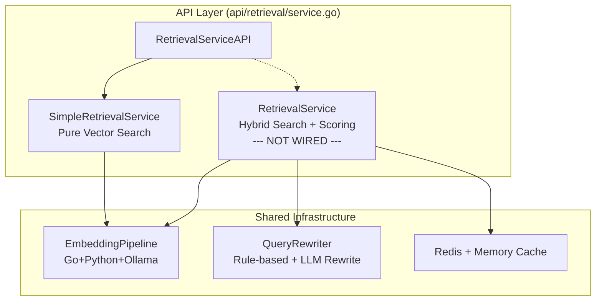
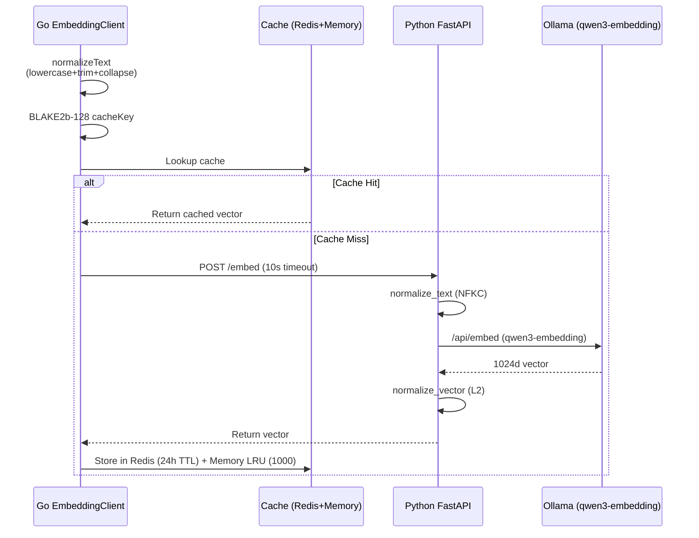
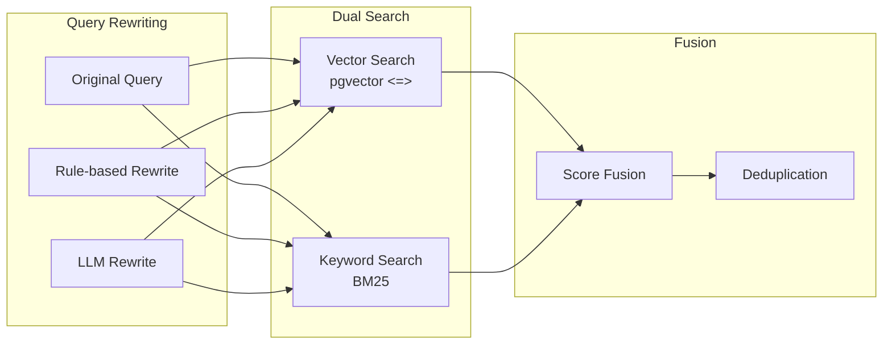
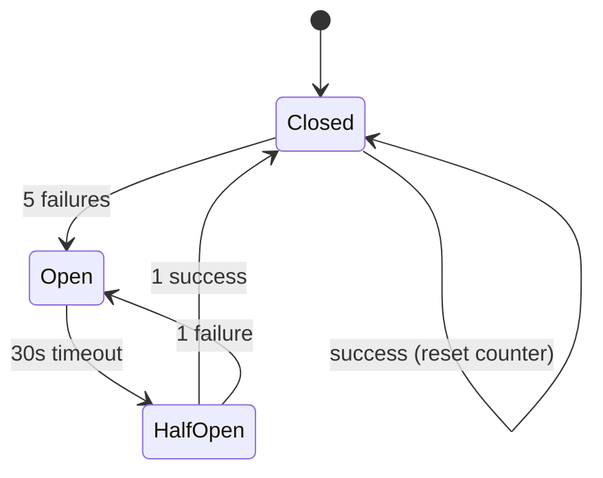

# GoAgentX Architecture Deep Dive (10): Retrieval System -- Hybrid Search and Scoring Pipeline

> The agent says: "Based on your past experience, I suggest..." — but the suggestion is completely irrelevant.
> Even worse: the agent solved this exact problem before, but now it's starting from scratch.
> I realized: **an agent's memory isn't about whether it has memory — it's about whether it can retrieve the right one.**
> An agent without retrieval is a goldfish: 7-second memory, forever reinventing the wheel.

## Why Retrieval Determines Agent IQ

There's a brutal truth about building agents: **No matter how powerful the model, if you feed it the wrong context, the output is garbage.**

GPT-4 can score in the top 10% on benchmarks. But if I feed it the wrong documents, irrelevant experience, outdated knowledge... it produces output that sounds convincing but is completely wrong. That's worse than saying "I don't know" — because the user will trust it.

I made a classic mistake when I first used embeddings: dump everything into one vector store and take whatever comes back. The result?

- A search for "Python dependency install error" returned a JavaScript tutorial snippet from three months ago — because it was all text embeddings, semantically mixed together
- A search for "user login timeout" returned "How to optimize PostgreSQL connection pools" — relevant but not precise
- The agent took the irrelevant context and fabricated a plausible-looking solution, wasting 40 minutes of the user's time

That's when I concluded: **A retrieval system isn't something you build with a vector database and call it a day.** It needs multi-strategy search, weighted scoring, signal amplification, time decay... a full pipeline that guarantees what goes into the LLM is genuinely useful.

## Architecture Overview: Two Retrieval Systems + Shared Infrastructure

GoAgentX's retrieval architecture has two layers:



**SimpleRetrievalService** is the one actually wired into the API — pure vector search, straightforward, reliable for 80% of scenarios.

**RetrievalService** is the full hybrid search engine — 2069 lines covering vector search, BM25 keyword search, multi-layer weighted scoring, signal amplification, time decay, deduplication... a complete production-grade retrieval pipeline.

Guess what? **advancedRetrieval has always been nil in the API layer.** We'll get to that in the Honest Section.

## Embedding Pipeline

Let's start with the foundation — no matter which retrieval strategy you use, embedding is the unavoidable first step.



### Text Normalization

Go side entry point:

```go
// internal/storage/postgres/embedding/client.go
func normalizeText(input string) string {
    input = strings.ToLower(input)
    input = strings.TrimSpace(input)
    // Collapse multiple whitespace characters into a single space
    return regexp.MustCompile(`\s+`).ReplaceAllString(input, " ")
}
```

Python side goes further:

```python
# services/embedding/app.py
import unicodedata

def normalize_text(text: str) -> str:
    text = unicodedata.normalize('NFKC', text)
    # Remove control characters
    text = ''.join(ch for ch in text if unicodedata.category(ch) != 'Cc')
    text = text.lower().strip()
    return re.sub(r'\s+', ' ', text)
```

Why two-stage normalization? Go's `strings.ToLower` and Python's `str.lower()` behave differently on certain Unicode characters (like İ, ı). Double normalization ensures that even if one side changes its logic, the other side catches it.

### Cache Strategy

Embedding calls are expensive — every query hits an external model. Cache is the first optimization:

- **Redis**: 24-hour TTL, shared across processes
- **Memory LRU**: 1000 entries, in-process hot cache

```go
// internal/storage/postgres/embedding/cache.go
func (c *Cache) getCacheKey(input string) string {
    hash := blake2b.Sum128([]byte(input))
    return fmt.Sprintf("embed:%x", hash)
}
```

BLAKE2b-128 is faster than MD5 and shorter than SHA-256 — 16-byte digest is just right for a cache key.

### Model & Vector Normalization

The embedding model is **qwen3-embedding:0.6b**, outputting 1024-dimensional vectors. L2 normalization before returning:

```python
# services/embedding/app.py
vectors = np.array(vectors)
norms = np.linalg.norm(vectors, axis=1, keepdims=True)
vectors = vectors / norms
```

Normalization is critical — it turns the vector inner product into a proxy for cosine similarity. The `<=>` operator result is naturally a [-1, 1] similarity value.

### Degradation Strategy

Embedding calls have three possible outcomes:

```go
// internal/storage/postgres/embedding/fallback.go
const (
    FallbackToCache   // Have old vector in cache, return without updating
    FallbackToKeyword // Fallback to pure keyword search
    FallbackToError   // Return error, let upper layer handle
)
```

This prevents "embedding down = retrieval down" as a hard dependency. In production, the most common case is Ollama timing out occasionally. Degrading to keyword search loses precision, but at least it works.

## SimpleRetrievalService: Pure Vector Search

This is the service actually wired into the API. Its logic is straightforward:

```go
// internal/storage/postgres/services/simple_retrieval_service.go
func (s *SimpleRetrievalService) Search(ctx context.Context, 
    query string, limit int, tenantID string) ([]*RetrievalResult, error) {
    
    queryVec, err := s.embedding.GenerateEmbedding(ctx, query)
    if err != nil {
        return nil, fmt.Errorf("generate embedding: %w", err)
    }

    rows, err := s.db.Query(ctx, `
        SELECT content, metadata, 
               1 - (embedding <=> $1) AS similarity
        FROM knowledge_embeddings
        WHERE tenant_id = $2
        ORDER BY embedding <=> $1
        LIMIT $3
    `, queryVec, tenantID, limit)
    // ...
}
```

Three steps: generate vector → `<=>` cosine distance sort → return Top-K. No rewriting, no weighting, no deduplication. It's almost comically simple — but it works as long as your knowledge base is clean and queries are unambiguous.

The downside is equally obvious: short queries, ambiguous queries, and typos all degrade vector search significantly. When the vector itself misses, there's nothing to catch it.

## RetrievalService: The Hybrid Search Engine

This is where things get serious — 2069 lines covering the **full retrieval pipeline**.

### Hybrid Search Strategy



For **each query variant** (original + rewrites), it runs both vector search and BM25 keyword search in parallel. All results flow into the scoring pipeline.

### Query Rewriting

Two rewriting strategies:

**Rule-based** — reads synonym mappings from config:

```yaml
# configs/synonyms.yaml
synonyms:
  "memory": ["memory", "experience", "distillation", "memories"]
  "tool": ["tool", "function", "capability", "skill"]
  "error": ["error", "bug", "failure", "exception", "crash"]
```

**LLM-based** — calls the model for semantic rewrites, with strict constraints:

```go
// internal/storage/postgres/services/query_rewriter.go
const (
    maxRewrites      = 2
    llmTimeout       = 30 * time.Second
    llmTemperature   = 0.3      // Low temperature for stability
    jaccardThreshold = 0.6      // Min similarity to original query
    rewriteCacheTTL  = 10 * time.Minute
)
```

The core logic:

1. Check cache first — same query within 10 minutes won't re-call the LLM
2. After LLM response, compute Jaccard similarity (character-level overlap)
3. Rewrites below 0.6 similarity are discarded — prevents the LLM from drifting
4. Keep at most 2 rewrites

Why 0.6? Tuned empirically. Below 0.6, the rewrite no longer carries the original intent. Above 0.6, most of the original semantics are preserved.

### Query Weights

Different query variants carry different weights in scoring:

| Query Source | Weight | Rationale |
|------------|--------|-----------|
| Original | 1.0 | What the user said matters most |
| Rule-based rewrite | 0.7 | Synonym expansion, reliable but conservative |
| LLM rewrite | 0.5 | Trust half — LLMs are unpredictable |

This weight assignment sends a clear signal: **No matter how smart the machine thinks it is, the user's original query comes first.**

### Source Weights

When multiple sources are active (e.g., searching Knowledge + Experience + Tools simultaneously), results need cross-source ranking. Source weights prioritize different domains:

| Source | Weight | Rationale |
|--------|--------|-----------|
| Knowledge | 0.4 | Structured, high-quality knowledge base |
| Experience | 0.3 | Historically validated by real usage |
| Tools | 0.2 | Tool descriptions are short, less semantic richness |
| TaskResults | 0.1 | High volume, high noise |

Important: **When only one source is active, source weight is ignored** (defaults to 1.0). Cross-source ranking only matters when you're comparing across domains.

### Sub-Source Weights

Within each source, vector and keyword search scores need balancing:

| Sub-source | Weight |
|-----------|--------|
| Vector | 1.0 |
| Keyword | 0.8 |

Semantic matching takes priority — but keyword search is irreplaceable for entity names, error messages, and code snippets. The 0.8 ratio balances both approaches.

### Signal Amplification

Beyond static weights, the system applies **dynamic signals** based on result metadata:

**Experience signals:**

| Signal | Condition | Multiplier |
|--------|-----------|------------|
| Successful | `SuccessCount > 0` | 1.2 |
| Failed | `FailureCount > 0` | 0.7 |
| Fast execution | `ExecTime < 1s` | 1.2 |
| Slow execution | `ExecTime > 5s` | 0.8 |
| Frequently reused | `ReuseCount > 3` | 1.1 |
| Documented | `Documented == true` | 1.05 |

**Tool signals:**

| Signal | Condition | Multiplier |
|--------|-----------|------------|
| Auth required | `AuthRequired == true` | 0.9 |
| High success rate | `SuccessRate > 0.9` | 1.1 |
| Low success rate | `SuccessRate < 0.5` | 0.8 |

The logic is intuitive: **Results that have a proven track record — fast, successful, frequently reused — should rank higher.** Conversely, things that keep failing or are slow to execute should be demoted.

### Time Decay

Information has a shelf life. A three-month-old experience may be obsolete. A six-month-old tool version may have been deprecated.

```go
func (s *RetrievalService) applyTimeDecay(score float64, 
    createdAt time.Time) float64 {
    
    ageHours := time.Since(createdAt).Hours()
    decay := math.Exp(-0.01 * ageHours)
    if decay < 0.1 {
        decay = 0.1
    }
    return score * decay
}
```

Time decay formula: `e^(-0.01 × age_hours)`

| Age | Decay |
|-----|-------|
| 1 hour | 0.990 |
| 24 hours | 0.787 |
| 7 days | 0.185 |
| 30 days | 0.011 → floor at 0.1 |
| Older | 0.1 (floor) |

`math.Exp(-0.01 * age_hours)` means: 78% after 1 day, 18% after 7 days, and after a month it's at the 0.1 floor. The system naturally favors recent content.

The 0.1 floor ensures that even ancient content can still be retrieved if other signals are strong enough. Information doesn't completely vanish just because it's old.

### The Complete Scoring Formula

Putting it all together:

```
FinalScore = BaseScore × QueryWeight × SourceWeight × SubSourceWeight 
             × SourceSignals × TimeDecay
```

A concrete example: a user searches for "Python dependency install error," and the LLM finds a relevant experience fragment:

- BaseScore = 0.85 (raw vector similarity)
- QueryWeight = 1.0 (original query, no rewrite)
- SourceWeight = 1.0 (single source, no cross-domain)
- SubSourceWeight = 1.0 (from vector search)
- SourceSignals = 1.2 × 1.1 × 1.05 (successful + frequently reused + documented)
- TimeDecay = 0.787 (created 24 hours ago)

```
FinalScore = 0.85 × 1.0 × 1.0 × 1.0 × (1.2 × 1.1 × 1.05) × 0.787
           = 0.85 × 1.386 × 0.787
           ≈ 0.927
```

Note: **SourceSignals are multiplicative.** Multiple positive signals compound significantly — 1.2 × 1.1 × 1.05 ≈ 1.386, boosting the final score by 38.6%. Conversely, a single negative signal (like a failed experience at 0.7) can drag the score down by 30%.

This is intentional: let strong evidence chains and warning signs both have a significant impact on scoring, rather than getting averaged out.

### Deduplication

Different search paths can return the same content. When vector search and keyword search both hit the same piece of code, the system doesn't just deduplicate — it **accumulates score**:

```go
func (s *RetrievalService) deduplicate(results []*ScoredResult) []*ScoredResult {
    seen := make(map[string]*ScoredResult)
    for _, r := range results {
        if existing, ok := seen[r.ID]; ok {
            // Same content hit by multiple paths — bonus points
            existing.Score += r.Score * 0.3
        } else {
            seen[r.ID] = r
        }
    }
    // ...
}
```

This is the "multi-path hit signal": when the same content is surfaced by both vector and keyword search, it's genuinely relevant. The 30% bonus is empirically tuned — too high and one item dominates, too low and the multi-path signal doesn't matter.

### Precision Mode

For certain queries, the system switches to exact-match-first mode:

```go
func isPrecisionMode(query string) bool {
    if len([]rune(query)) <= 10 {
        return true
    }
    specialChars := "=+-*/:"
    for _, c := range query {
        if strings.ContainsRune(specialChars, c) {
            return true
        }
    }
    return false
}
```

Precision mode search path: **Exact match → Keyword search → Vector search** (fallback).

When does it trigger?

- Short queries (<= 10 chars) — "err 500", "timeout" — vector search performs poorly on short queries because there's too little semantic signal
- Queries with special characters — "status=error", "CPU>90%" — these have inherent structure that vector search would lose

## Concurrency Model & Gate System

### Concurrency Control

The retrieval system involves multiple independent operations (multiple query variants × multiple search strategies). Control is via `errgroup`:

```go
g, ctx := errgroup.WithContext(ctx)
g.SetLimit(2) // Max 2 concurrent goroutines

for _, variant := range queryVariants {
    variant := variant
    g.Go(func() error {
        ctx, cancel := context.WithTimeout(ctx, 2*time.Second)
        defer cancel()
        return s.searchSingleVariant(ctx, variant, results)
    })
}
```

`SetLimit(2)` caps concurrent searches at 2, preventing a flood of queries hitting the database simultaneously. Each sub-search has a 2-second context timeout — any search path taking longer gets dropped, without affecting the overall result.

### Three-Layer Gate

```go
type Gate struct {
    rateLimiter      *RateLimiter   // 100 req/s
    circuitBreaker   *CircuitBreaker // 5 failures before open
    dbTimeout        time.Duration  // 30s
}
```



- **RateLimiter**: Max 100 retrieval requests per second. Excess requests get a 429, no database hit.
- **CircuitBreaker**: After 5 consecutive failures, the circuit opens. 30 seconds later it tries half-open recovery. During the open state, errors are returned immediately — no wasted resources.
- **DB Timeout**: Each database query waits at most 30 seconds.

This gate system is deliberately conservative. The retrieval system is the agent's knowledge lifeline — if it goes down, the agent becomes useless. Better to return empty results than to make the agent wait 60 seconds for a timeout.

## Debugging & Observability

Every retrieval request can generate detailed debug info:

```go
type DebugInfo struct {
    Query           string
    Rewrites        []string
    TotalResults    int
    QueryTime       time.Duration
    ScoreBreakdown  []ScoreDebug
}

type ScoreDebug struct {
    ID              string
    Content         string
    BaseScore       float64
    QueryWeight     float64
    SourceWeight    float64
    SubSourceWeight float64
    SourceSignals   map[string]float64
    TimeDecay       float64
    FinalScore      float64
}
```

`GenerateDebugInfo()` provides full scoring traceability — every weight factor for every result. This is invaluable when tuning scoring parameters or debugging why a bad result ranked first.

## Honest Section

Time to address the elephant in the room.

**The RetrievalService (2069-line hybrid search engine) has never been wired into the API.**

```go
// api/retrieval/service.go
func NewRetrievalService(cfg *Config) (*Service, error) {
    simpleRetrieval, err := NewSimpleRetrievalService(...)
    // advancedRetrieval, err := NewAdvancedRetrievalService(...) // commented out
    
    return &Service{
        simpleRetrieval:   simpleRetrieval,
        // advancedRetrieval: advancedRetrieval, // always nil
    }, nil
}
```

Feel like you just got clickbaited?

I was excited when I wrote this system — "Now THIS is a real retrieval engine." Then I finished it and realized: SimpleRetrievalService was already running in production. Replacing it with this complex system requires extensive integration testing, A/B testing, performance benchmarking... and it just never got done.

There's some logic to the decision: SimpleRetrievalService handles 80% of scenarios well enough. Complex scoring, signal amplification, time decay — the benefits aren't dramatic at low data volumes (< 100k entries).

But I also know: **as user data and experience accumulate, this hybrid search engine needs to go live.** The code is written. It's waiting.

So this article isn't about a feature you're using today — it's a blueprint for what you should expect in the future. If you're already hitting the ceiling of pure vector search (poor short query recall, bad cross-domain ranking, low experience reuse rates), this hybrid pipeline is the answer.

The code exists. Just waiting for someone to come and complain loudly enough.

## Summary

GoAgentX's retrieval system in one sentence: **Pure vector search is the foundation. The hybrid search + multi-layer scoring pipeline is the nuclear option. The launch button just hasn't been pressed yet.**

Key design points:

1. **Embedding pipeline** — Go-Python-Ollama three-layer architecture, dual normalization + three-tier cache (Redis + LRU + Fallback)
2. **Query rewriting** — rule-based synonyms + LLM rewrites, Jaccard threshold filtering, 10-minute cache
3. **Multi-layer scoring** — static weights (query/source/sub-source) × dynamic signals (success/failure/speed/reuse) × time decay
4. **Deduplication** — 30% bonus for multi-path hits, identifying genuinely relevant content
5. **Precision mode** — short queries and structural queries go exact-match → keyword → vector fallback
6. **Gate system** — RateLimit + CircuitBreaker + DB Timeout, preventing the retrieval system from being overwhelmed

An agent's intelligence ≈ the quality of context it receives. And context quality comes down to whether the retrieval system can find the right content, from the right source, with the right weight, at the right time.

---

> Information isn't power. Retrieval is. — My (collecting dust) lesson after building an entire retrieval pipeline.

**Next up:** No more articles planned for this series — this is the final installment. But if there's a module you want me to dive into, just say the word.
