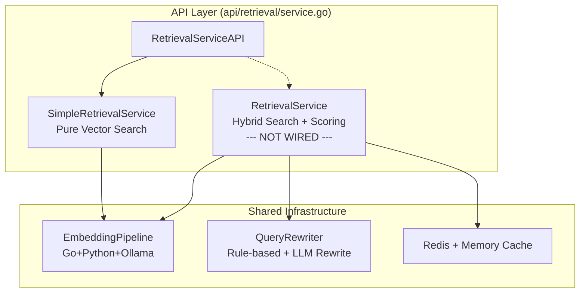
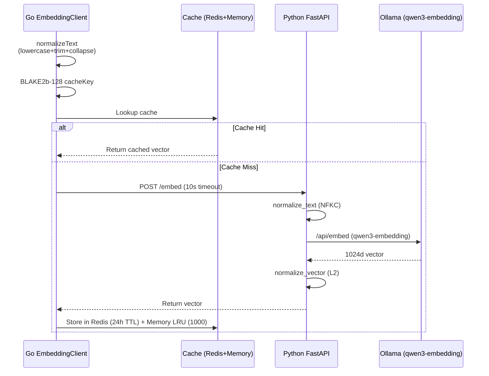
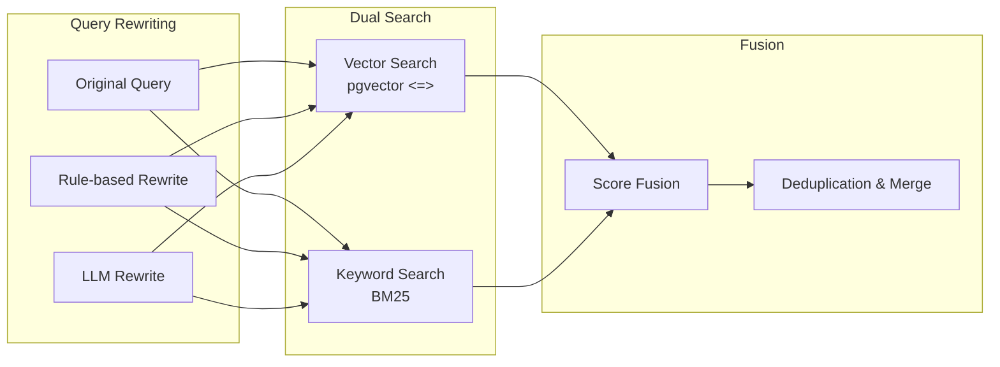
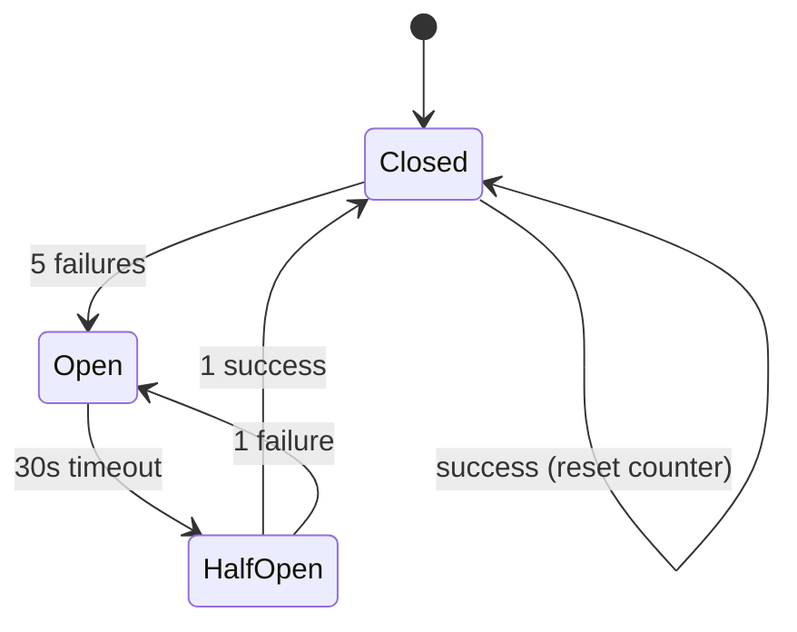

# GoAgentX Architecture Deep Dive (10): Retrieval System — Hybrid Search and Scoring Pipeline

> The agent says: "Based on your past experience, I suggest..." — but the suggestion is completely irrelevant.
> Even worse: the agent solved this exact problem before, but now it's starting from scratch.
> I realized back then: an agent's memory isn't about whether it has memory — it's about whether it can retrieve the right one.
> An agent without retrieval is a goldfish: 7-second memory, forever reinventing the wheel.

## 1. First, Why Retrieval Determines Agent IQ

There's a brutal truth about building agents: **No matter how powerful the model, if you feed it the wrong context, the output is garbage.**

GPT-5 can score in the top 10%, but if I feed it the wrong documents, irrelevant experience, outdated knowledge... the output is something that sounds reasonable but is actually nonsense. That's worse than saying "I don't know" — because the user will trust it.

I made a classic mistake when I first worked with embeddings: dump everything into one vector store and take whatever comes back. The result?

- Searching for "Python dependency install error" returned a JavaScript tutorial snippet from three months ago — because it was all text embeddings, semantically mixed together
- Searching for "user login timeout" returned "How to optimize PostgreSQL connection pools" — relevant but not precise
- The agent took the irrelevant context and fabricated a plausible-looking solution, wasting 40 minutes of the user's time

So I concluded: **A retrieval system isn't something you build with a vector database and call it a day.** It needs multi-strategy search, weighted scoring, signal amplification, time decay... a full combination punch that guarantees what goes into the LLM is genuinely useful.

## 2. Architecture Overview: Two Retrieval Systems + Shared Infrastructure

GoAgentX's retrieval system has two layers:



**SimpleRetrievalService** is the retrieval solution actually wired into the current API layer — pure vector search, straightforward, suitable for scenarios where "don't mess up" is more important than extreme precision.

**RetrievalService** is the full hybrid search engine — 2069 lines of code covering vector search, BM25 keyword search, multi-layer weighted scoring, signal amplification, time decay, deduplication and merging... a complete production-grade retrieval pipeline.

Guess what? **advancedRetrieval has always been nil in the API layer.** We'll unpack that in the "Honest Section."

## 3. Data Classification Storage: Not Redundancy, But Division of Labor

Before diving into the embedding and search details, we need to answer a fundamental question: **Why use both pgvector and plain PostgreSQL tables?**

First-time observers of GoAgentX's storage design often react: "Isn't this just vector retrieval? Why not use a dedicated vector database?" — I know that reaction well, because that's exactly what I thought when I started.

### 3.1 What Vector DBs Can and Can't Do

Let's first demystify vector databases.

**What vector DBs are good at:** At moderate scale (tens to hundreds of thousands of entries), they bring semantically similar things together. "Apples" and "oranges" can be found together, and "Python language" and "Golang language" can be associated — something traditional keyword search truly can't do.

**What vector DBs are not good at:** As data volume grows, similarity in high-dimensional space gradually loses its discriminative power. This isn't a bug in any particular product — it's a mathematical property of high-dimensional geometry known as the **Curse of Dimensionality**, directly manifesting in retrieval.

In a 1024-dimensional space (GoAgentX's embedding dimension), the cosine similarity between two random unrelated vectors is typically around 0.7-0.8. This means when you dump 100,000 entries into a single vector bucket and search for "Python dependency install error," your top-10 results might have five that look like:

```
Rank 1: "pip freeze best practices"                — cosine sim 0.91, precisely relevant
Rank 2: "JavaScript EventLoop deep dive"            — cosine sim 0.87, completely irrelevant
Rank 3: "pip install inside Docker containers"      — cosine sim 0.86, partially relevant
Rank 4: "Vue3 reactivity explained"                 — cosine sim 0.84, completely irrelevant
Rank 5: "Node.js package management common errors"   — cosine sim 0.83, seemingly relevant but not
```

Rank 2 and Rank 1 differ by only 0.04 in cosine similarity, but for an agent, one is a lifeline and the other is poison.

This isn't a "failure" of vector search — it's the **boundary of what vector search can do**: it tells you "these texts are mathematically nearby," but mathematical proximity doesn't equal real relevance — especially when different data types are mixed in the same semantic space.

### 3.2 For LLMs, More Is Worse

Now go back to the example at the start of the article: searching "Python dependency install error" returns ten results, three of which are high-similarity JavaScript tutorials.

What happens when the agent receives these ten results?

It stuffs every single one into its context window. Then it sees Rank 2 — "JavaScript EventLoop deep dive" — does this have anything to do with "Python dependency error"? No. But the agent doesn't just ignore it. It **tries to rationalize this information**, because the LLM's training objective is to "generate the most coherent output given all available context."

So it might produce: "Similar issues exist in Node.js. Consider checking whether the event loop is blocked..."

This is the real path to hallucination: **the agent isn't making things up — it's doing its best to use every input it's given, including the inputs that should never have been in the search results.**

At larger scale (millions, tens of millions of entries), this problem's consequences compound:
- The absolute number of high-similarity false positives grows significantly
- Every retrieval cycle floods the context window with a new batch of noise
- Agent reasoning quality doesn't degrade linearly — it **falls off a cliff** once noise exceeds a certain fraction of the context window, and output reliability collapses

### 3.3 Solution: Data Type Split Routing

Once you understand vector DB boundaries and the damage false positives do to LLMs, the solution is clear: **don't let a single vector bucket bear the retrieval burden for all data.** Split data by type, route different types through different retrieval paths, so they don't interfere with each other.

GoAgentX divides data into four domains:

| Data Domain | Storage Location | Retrieval Strategy | Weight | Core Signal |
|-------------|-----------------|-------------------|--------|-------------|
| **Knowledge** | pgvector dedicated table | Pure vector search | 0.4 | Semantic similarity |
| **Experience** | PostgreSQL + metadata columns | Vector search + signal weighting | 0.3 | Success/failure, speed, reuse rate |
| **Tools** | PostgreSQL registry | Keyword primary, vector fallback | 0.2 | Exact match |
| **TaskResults** | PostgreSQL archive table | Keyword + time decay | 0.1 | Recency |

**Knowledge** is the "textbook" — curated and reviewed knowledge artifacts, highest quality. Its vector space contains only knowledge articles, unpolluted by other data types, so simple pure vector search is sufficiently reliable.

**Experience** is the "lab notebook" — records of problems the agent has solved in the past. The core value of this data isn't semantic similarity, but **historical validation signals**. So it adds signal weighting on top of vector search: successful experiences ×1.2, failed experiences ×0.7, fast execution ×1.2.

**Tools** are the "toolbox manuals" — short text, fixed format, limited semantic density. Pure vector search is mostly wasted on this kind of data — keyword exact matching + category filtering handles the vast majority of queries.

**TaskResults** are the "scratch paper" — raw records of every task the agent executed. Highest volume, noisiest, lowest quality. Weight is only 0.1, and it's most heavily affected by time decay — task results from 30 days ago barely participate in ranking.

### 3.4 How Classification Storage Reduces Hallucination

Going back to the hallucination path, classification storage cuts it off at three levels:

**1. Smaller vector space = higher discriminability**

Each domain's data retrieves within its own independent vector space. The Knowledge domain contains only knowledge articles. Inside this restricted space, cosine similarity genuinely reflects semantic distance — there's no more "search Python dependency returns JavaScript" situations because the latter simply doesn't exist in the same vector space.

**2. Different data types use different strategies, each playing to its strengths**

Experience data doesn't need "the most similar" result — it needs "the most successful" one. So signal weighting is more effective than pure vector search. Tool descriptions don't need semantic search — they need exact matching. Every strategy operates in its optimal zone, without forcing one engine to solve all problems.

**3. Context window protection mechanism**

Through weight layering (Knowledge's weight is 4× that of TaskResults), time decay, and precision-mode priority strategies for key data types, the system ensures the LLM's context window is preferentially filled with high-quality, high-confidence content.

### 3.5 Why Not Just Use Two Databases (Milvus / Pinecone)?

A more radical question: pgvector plus PostgreSQL looks like "not using two databases but having four tables" — why not just use two dedicated databases?

Two words: **transactional consistency and operational simplicity.**

Dedicated vector databases (Milvus, Pinecone, Qdrant) are indeed stronger at vector search performance, but at the cost of:
- **Eventual consistency** — writes aren't guaranteed to be immediately readable
- **Cross-system JOIN impossible** — can't simultaneously do vector search and structured filtering in a single query
- **Operational overhead** — every additional independent database means another cluster to monitor, back up, and tune

GoAgentX's choice: **store vectors in the pgvector plugin, and structured metadata in related tables within the same PostgreSQL. One query completes vector + metadata combined filtering and sorting at the SQL level.**

```sql
SELECT e.content, e.metadata,
       1 - (ke.embedding <=> $1) AS vector_score,
       e.success_count, e.exec_time_ms
FROM experience e
JOIN knowledge_embeddings ke ON ke.content_id = e.id
WHERE e.tenant_id = $2
  AND e.success_count > 3
ORDER BY (1 - (ke.embedding <=> $1)) * 1.1
         * CASE WHEN e.exec_time_ms < 1000 THEN 1.2 ELSE 1.0 END
         DESC
LIMIT 10
```

In short: **This isn't redundancy between pgvector and PostgreSQL, nor is it a replacement for vector databases — it's a data classification system where "data type determines retrieval strategy, retrieval strategy determines storage location" fully realized within the PostgreSQL ecosystem.**

## 4. Embedding Pipeline

Let's start with the infrastructure — no matter which retrieval strategy you use, embedding is the unavoidable first step.



### 4.1 Text Normalization

Go side entry point:

```go
// internal/storage/postgres/embedding/client.go
func normalizeText(input string) string {
    input = strings.ToLower(input)
    input = strings.TrimSpace(input)
    // Collapse multiple whitespace characters into a single space
    return regexp.MustCompile(`\s+`).ReplaceAllString(input, " ")
}
```

Python side goes further:

```python
# services/embedding/app.py
import unicodedata

def normalize_text(text: str) -> str:
    text = unicodedata.normalize('NFKC', text)
    # Remove control characters
    text = ''.join(ch for ch in text if unicodedata.category(ch) != 'Cc')
    text = text.lower().strip()
    return re.sub(r'\s+', ' ', text)
```

Why two-stage normalization? Go's `strings.ToLower` and Python's `str.lower()` behave differently on certain Unicode characters (like İ, ı). Double normalization ensures that even if one side changes its logic, the other side catches it.

### 4.2 Cache Strategy

Embedding calls are expensive — every request hits an external model. So cache is the first optimization:

- **Redis**: 24-hour TTL, shared across processes
- **Memory LRU**: 1000 entry limit, in-process hot cache

```go
// internal/storage/postgres/embedding/cache.go
func (c *Cache) getCacheKey(input string) string {
    hash := blake2b.Sum128([]byte(input))
    return fmt.Sprintf("embed:%x", hash)
}
```

BLAKE2b-128 is faster than MD5 and shorter than SHA-256 — a 16-byte digest is just right for a cache key.

### 4.3 Model and Vector Normalization

The embedding model is **qwen3-embedding:0.6b**, outputting 1024-dimensional vectors. L2 normalization is applied before returning:

```python
# services/embedding/app.py
vectors = np.array(vectors)
norms = np.linalg.norm(vectors, axis=1, keepdims=True)
vectors = vectors / norms
```

Normalization is critical — it turns the vector inner product into a proxy for cosine similarity. This way, the result from the `<=>` operator is naturally a similarity value in the range [-1, 1].

### 4.4 Degradation Strategy

Embedding calls have three possible outcomes, each mapped to a degradation path:

```go
// internal/storage/postgres/embedding/fallback.go
const (
    FallbackToCache   // Cache has old vector, return without updating
    FallbackToKeyword // Fallback to pure keyword search
    FallbackToError   // Return error, let upper layer handle
)
```

This prevents the vicious dependency where "embedding is down, so retrieval can't work." In production, the most common case is Ollama timing out occasionally. Degrading to keyword search loses precision, but at least it still works.

## 5. SimpleRetrievalService: Pure Vector Search

This is the service actually wired into the current API layer. Its logic is extremely straightforward:

```go
// internal/storage/postgres/services/simple_retrieval_service.go
func (s *SimpleRetrievalService) Search(ctx context.Context, 
    query string, limit int, tenantID string) ([]*RetrievalResult, error) {
    
    queryVec, err := s.embedding.GenerateEmbedding(ctx, query)
    if err != nil {
        return nil, fmt.Errorf("generate embedding: %w", err)
    }

    rows, err := s.db.Query(ctx, `
        SELECT content, metadata, 
               1 - (embedding <=> $1) AS similarity
        FROM knowledge_embeddings
        WHERE tenant_id = $2
        ORDER BY embedding <=> $1
        LIMIT $3
    `, queryVec, tenantID, limit)
    // ...
}
```

Just three steps: generate vector → `<=>` cosine distance sort → return Top-K. No rewriting, no weighting, no deduplication. It's almost comically simple — but sufficient, as long as your knowledge base is high quality and queries are unambiguous.

The downside is equally obvious: it's defenseless against short queries, ambiguous queries, and queries with typos. In these cases, the vector itself simply can't find anything relevant.

## 6. RetrievalService: The Hybrid Search Engine

This is the real heavyweight — 2069 lines of code covering the **full retrieval pipeline**.

### 6.1 Hybrid Search Strategy



During a search, for **each query variant** (original + rewritten versions), it simultaneously runs both vector search and BM25 keyword search. All results flow into the scoring pipeline.

### 6.2 Query Rewriting

Query rewriting has two approaches:

**Rule-based** — reads synonym mappings from config:

```yaml
# configs/synonyms.yaml
synonyms:
  "memory": ["memory", "experience", "distillation", "memories"]
  "tool": ["tool", "function", "capability", "skill"]
  "error": ["error", "bug", "failure", "exception", "crash"]
```

**LLM-based** — calls the model for text rewriting, but with strict constraints:

```go
// internal/storage/postgres/services/query_rewriter.go
const (
    maxRewrites      = 2          // Generate at most 2 rewrites
    llmTimeout       = 30 * time.Second
    llmTemperature   = 0.3        // Low temperature for stability
    jaccardThreshold = 0.6        // Minimum similarity to original query
    rewriteCacheTTL  = 10 * time.Minute
)
```

The core logic:

1. Check cache first — the same query within 10 minutes won't re-call the LLM
2. After the LLM call, compute Jaccard similarity (character-level overlap)
3. Rewrites below 0.6 similarity are discarded — prevents the LLM from drifting off
4. Keep at most 2 rewrites

Why 0.6? Empirically determined. Below 0.6, the rewrite no longer carries the same meaning as the original; above 0.6, most of the original semantic information is preserved.

### 6.3 Query Weights

Different query variants carry different weights in scoring:

| Query Source | Weight | Rationale |
|-------------|--------|-----------|
| Original query | 1.0 | What the user said is most important |
| Rule-based rewrite | 0.7 | Synonym expansion, reliable but doesn't overstep |
| LLM rewrite | 0.5 | Trust half, because LLMs have too many uncontrollable factors |

This weight distribution sends a clear signal: **No matter how smart the machine guesses, it's not as important as the user's original query.**

### 6.4 Source Weights

When multiple sources are active simultaneously (e.g., searching Knowledge + Experience + Tools), results need cross-source ranking. Source weights adjust the priority of different domains:

| Source | Weight | Rationale |
|--------|--------|-----------|
| Knowledge | 0.4 | Knowledge base is structured and high-quality |
| Experience | 0.3 | Experience is historically validated |
| Tools | 0.2 | Tool descriptions are usually short, limited semantic richness |
| TaskResults | 0.1 | Task results have huge volume and lots of noise |

Note: **When only one source is active, source weights don't apply** (value is 1.0). This is by design because single-source scenarios don't need cross-domain ranking — internal scores are sufficient.

### 6.5 Sub-Source Weights

Within each source, the scores from vector search and keyword search also need to be reconciled:

| Sub-source | Weight |
|-----------|--------|
| Vector | 1.0 |
| Keyword | 0.8 |

Semantic matching takes priority over literal matching — but keyword search plays an irreplaceable role in scenarios like entity names and error messages. The 0.8 ratio strikes a balance between the two.

### 6.6 Signal Weighting

Beyond static weights, the system introduces a set of **dynamic signals** that adjust scores based on the metadata of retrieved results:

**Experience signals:**

| Signal | Condition | Multiplier |
|--------|-----------|------------|
| Successful experience | `SuccessCount > 0` | 1.2 |
| Failed experience | `FailureCount > 0` | 0.7 |
| Fast execution | `ExecTime < 1s` | 1.2 |
| Slow execution | `ExecTime > 5s` | 0.8 |
| Frequently reused | `ReuseCount > 3` | 1.1 |
| Has documentation | `Documented == true` | 1.05 |

**Tool signals:**

| Signal | Condition | Multiplier |
|--------|-----------|------------|
| Auth required | `AuthRequired == true` | 0.9 |
| High success rate | `SuccessRate > 0.9` | 1.1 |
| Low success rate | `SuccessRate < 0.5` | 0.8 |

The logic behind these signals is intuitive: **Results with good historical performance, fast execution, and frequent reuse should rank higher.** Conversely, results that keep failing or are slow to execute should be demoted.

### 6.7 Time Decay

Information has a shelf life. An experience from three months ago may already be outdated. A tool version from six months ago may have been deprecated.

```go
func (s *RetrievalService) applyTimeDecay(score float64, 
    createdAt time.Time) float64 {
    
    ageHours := time.Since(createdAt).Hours()
    decay := math.Exp(-0.01 * ageHours)
    if decay < 0.1 {
        decay = 0.1
    }
    return score * decay
}
```

Time decay formula: `e^(-0.01 × age_hours)`

| Age | Decay Coefficient |
|-----|------------------|
| 1 hour | 0.990 |
| 24 hours | 0.787 |
| 7 days | 0.185 |
| 30 days | 0.011 → floor at 0.1 |
| Older | 0.1 (floor) |

`math.Exp(-0.01 * age_hours)` means: 78% after 1 day, 18% after 7 days, and after a month it's essentially at the 0.1 floor. The system naturally favors recent content.

The 0.1 floor ensures that even ancient content can still be retrieved if other signals are strong enough — it won't completely vanish just because of age.

### 6.8 The Complete Scoring Formula

Putting all the factors together, the final scoring formula is:

```
FinalScore = BaseScore × QueryWeight × SourceWeight × SubSourceWeight 
             × SourceSignals × TimeDecay
```

A concrete example: suppose a user searches for a problem about "Python dependency install error," and the LLM finds a relevant memory fragment based on historical experience:

- BaseScore = 0.85 (raw vector similarity)
- QueryWeight = 1.0 (using the original query, no rewrite)
- SourceWeight = 1.0 (single source, no cross-domain)
- SubSourceWeight = 1.0 (from vector search)
- SourceSignals = 1.2 × 1.1 × 1.05 (successful experience + frequently reused + has documentation)
- TimeDecay = 0.787 (created 24 hours ago)

```
FinalScore = 0.85 × 1.0 × 1.0 × 1.0 × (1.2 × 1.1 × 1.05) × 0.787
           = 0.85 × 1.386 × 0.787
           ≈ 0.927
```

Note: **SourceSignals are multiplicative.** This means multiple positive signals compound significantly — 1.2 × 1.1 × 1.05 ≈ 1.386, directly boosting the final score by 38.6%. Conversely, a single negative signal (like a failed experience at 0.7) can drag the score down by 30%.

This is intentional: let "good evidence chains" and "bad indicators" both have a significant impact on the score, rather than getting averaged out.

### 6.9 Deduplication and Merging

Different search paths may return the same content. For example, both vector search and keyword search might hit the same piece of code. In this case, the system doesn't simply deduplicate — it **accumulates the score**:

```go
func (s *RetrievalService) deduplicate(results []*ScoredResult) []*ScoredResult {
    seen := make(map[string]*ScoredResult)
    for _, r := range results {
        if existing, ok := seen[r.ID]; ok {
            // Same content hit by multiple search paths — bonus points
            existing.Score += r.Score * 0.3
        } else {
            seen[r.ID] = r
        }
    }
    // ...
}
```

This is the "multi-path hit signal": when the same content is hit by both vector search and keyword search, it's genuinely relevant. The 30% bonus is an empirically tuned value — too high and one item dominates the rankings, too low and the multi-path hit signal doesn't carry its weight.

### 6.10 Precision Mode

For certain special queries, the system switches to exact-match mode:

```go
func isPrecisionMode(query string) bool {
    if len([]rune(query)) <= 10 {
        return true
    }
    specialChars := "=+-*/:"
    for _, c := range query {
        if strings.ContainsRune(specialChars, c) {
            return true
        }
    }
    return false
}
```

The retrieval path in precision mode: **Exact match → Keyword search → Vector search** (fallback).

When does it trigger?

- Very short queries (<= 10 characters) — short queries like "err 500" or "timeout" are problematic for vector search because too few words make the semantics ambiguous
- Queries with special characters — queries like "status=error" or "CPU>90%" have inherent structure, and running semantic search directly would lose critical information

## 7. Concurrency Model and Gate System

### 7.1 Concurrency Control

The retrieval system involves multiple independent operations (multiple query variants × multiple search strategies), using `errgroup` for concurrency control:

```go
g, ctx := errgroup.WithContext(ctx)
g.SetLimit(2) // At most 2 concurrent goroutines

for _, variant := range queryVariants {
    variant := variant
    g.Go(func() error {
        ctx, cancel := context.WithTimeout(ctx, 2*time.Second)
        defer cancel()
        return s.searchSingleVariant(ctx, variant, results)
    })
}
```

`SetLimit(2)` limits concurrency to 2, preventing a flood of search requests hitting the database simultaneously. Each sub-search has a 2-second context timeout — any search path taking longer gets dropped without affecting the overall result.

### 7.2 Gate System

The system integrates a three-layer gate:

```go
type Gate struct {
    rateLimiter      *RateLimiter   // 100 req/s
    circuitBreaker   *CircuitBreaker // Opens after 5 failures
    dbTimeout        time.Duration  // 30s
}
```

- **RateLimiter**: At most 100 retrieval requests per second. Excess requests return 429 directly, without hitting the database.
- **CircuitBreaker**: After 5 consecutive retrieval failures, enters open (熔断) state. Attempts half-open recovery after 30 seconds. During the open state, errors are returned directly, wasting no resources.
- **DB Timeout**: Each database query waits at most 30 seconds.



This gate system is designed to be quite conservative — the retrieval system is the knowledge lifeline of the entire agent. If it goes down, the agent becomes brain-dead. Better to return empty results than to make the agent wait 60 seconds for a timeout.

## 8. Debugging and Observability

Every retrieval request can generate detailed debug information:

```go
type DebugInfo struct {
    Query           string
    Rewrites        []string
    TotalResults    int
    QueryTime       time.Duration
    ScoreBreakdown  []ScoreDebug
}

type ScoreDebug struct {
    ID              string
    Content         string
    BaseScore       float64
    QueryWeight     float64
    SourceWeight    float64
    SubSourceWeight float64
    SourceSignals   map[string]float64
    TimeDecay       float64
    FinalScore      float64
}
```

`GenerateDebugInfo()` provides full scoring chain traceability — every weight factor for every result is recorded. This is invaluable when tuning scoring parameters or debugging "why is this bad result ranked first?"

## 9. Honest Section

Now, time to address the elephant in the room.

**The RetrievalService (this 2069-line hybrid search engine) has never been wired into the API layer.**

```go
// api/retrieval/service.go
func NewRetrievalService(cfg *Config) (*Service, error) {
    simpleRetrieval, err := NewSimpleRetrievalService(...)
    // advancedRetrieval, err := NewAdvancedRetrievalService(...) // This line is commented out
    
    return &Service{
        simpleRetrieval:   simpleRetrieval,
        // advancedRetrieval: advancedRetrieval, // always nil
    }, nil
}
```

Haha, feel like you just got clickbaited?

I was incredibly excited when I wrote this thing — "Now THIS is a real retrieval system." Then I finished it and realized: SimpleRetrievalService was already running stable. Replacing it with this complex system requires extensive integration testing, A/B testing, and performance benchmarking. And so it keeps getting postponed.

There's some logic to the decision: SimpleRetrievalService is good enough for 80% of scenarios. Complex scoring, signal weighting, time decay — the benefits aren't dramatic at small data volumes (< 100k entries).

But I also know: **as user data and experience accumulate, this hybrid search engine will need to go live sooner or later.** The code is already written. It just needs a spark.

So this article isn't documentation for a feature you're already using — it's a blueprint for "the future you should know about." If you're truly hitting the ceiling of pure vector search (low short-query recall, poor cross-domain ranking, low experience reuse rates), this hybrid search pipeline is the answer.

Anyway, the code is already written. We'll talk about it when someone actually comes knocking.

## 10. Summary

GoAgentX's retrieval system in one sentence: **The foundation is a simple pure-vector solution, the nuclear option is hybrid search + multi-layer scoring pipeline, but the launch button for the nuclear option hasn't been pressed yet.**

Key design points:

1. **Embedding pipeline** — Go-Python-Ollama three-layer architecture, dual normalization + three-tier cache (Redis + LRU + Fallback)
2. **Query rewriting** — rule-based synonyms + LLM rewrites, Jaccard threshold filtering, 10-minute cache
3. **Multi-layer scoring** — static weights (query/source/sub-source) × dynamic signals (success/failure/speed/reuse) × time decay
4. **Deduplication and merging** — 30% score bonus for multi-path hits, identifying genuinely relevant content
5. **Precision mode** — short queries and structural queries go exact match + keyword + vector fallback
6. **Gate system** — RateLimit + CircuitBreaker + DB Timeout, preventing the retrieval system from being overwhelmed

An agent's intelligence ≈ the quality of context fed into it. And context quality depends on whether the retrieval system can pull the right content, from the right place, with the right weight, at the right time.

---

> Information isn't power. Retrieval is. — My realization (still collecting dust) after building an entire retrieval pipeline.

**Next up:** No more articles planned for this series — this concludes the series for now. But if there's a module you're particularly curious about, just let me know.