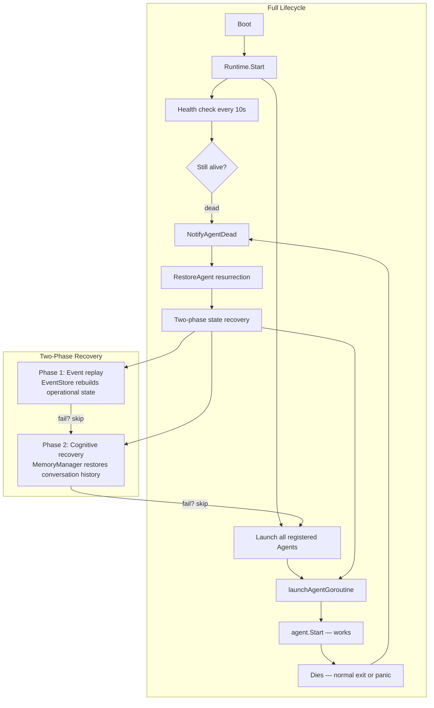
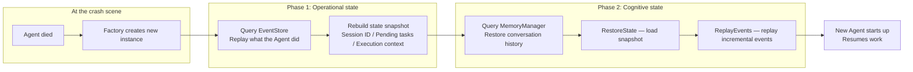
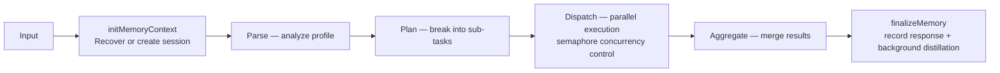
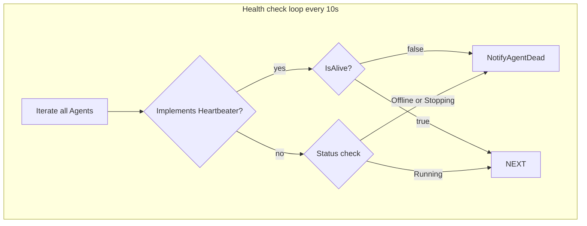
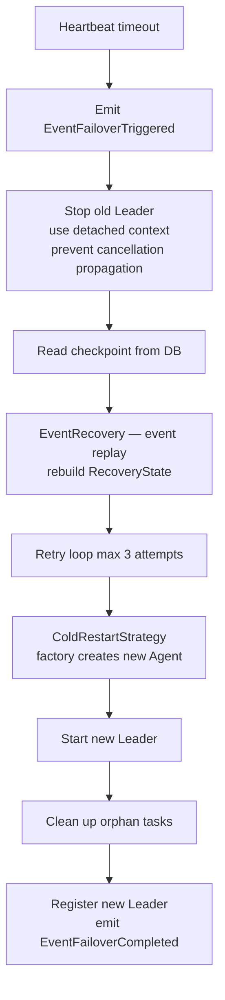
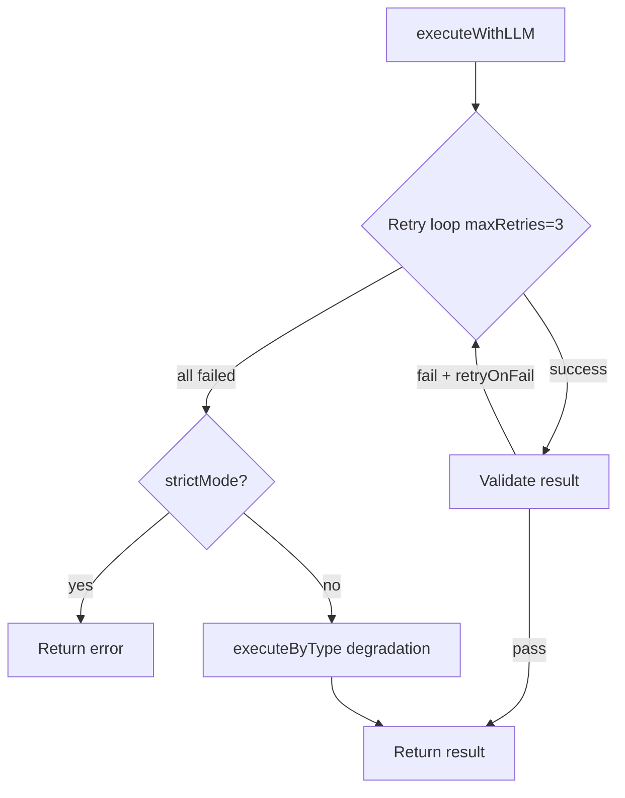
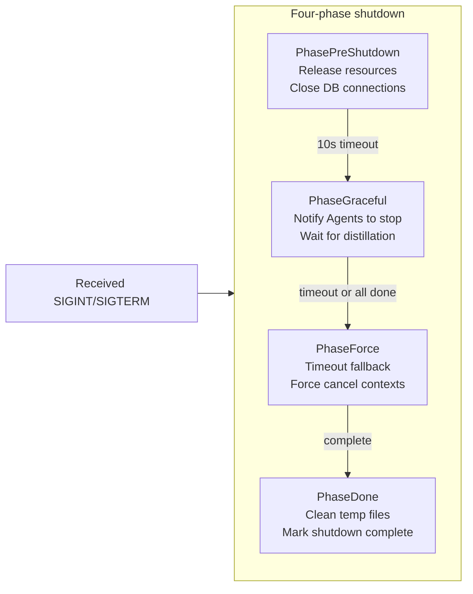

# GoAgentX Architecture Deep Dive (7): Runtime & Lifecycle — Birth, Death, and Resurrection

What happens when an Agent dies? Every framework has to answer this, but few do it well. This article walks through the Runtime subsystem's design journey — from "how to prevent crashes" to "how to resurrect with memories intact" and "how to resume interrupted work without wasting tokens." You'll see the concurrency trap behind the Resurrection Guard, the fault-tolerance philosophy of two-phase state recovery, the detached-context distillation pattern, and the honest trade-offs behind every decision. Written for developers working on agent reliability, distributed orchestration, or stateful service auto-recovery.

> Other Agent frameworks compete on features and flashiness. I have only one obsession: **Bugs I can accept. Crashes I absolutely cannot.**
> One day I started thinking — what if I just `kill -9` a running Agent right now? How would I bring it back?
> Manually? First locate which process, dig through logs to find the cause, write a patch, then `go run main.go --args`… I'm already annoyed just thinking about it.
> So what if there's a mechanism where an Agent can die and then **get back up on its own, with its memories intact**? I call this **resurrection**.
> This is the core of the Runtime subsystem — Agents are disposable executors; the Runtime owns their birth, death, and resurrection.

## 1. The Rabbit Hole

Let me walk you through how I **agonized** over this design.

My first idea was simple: spawn a separate monitor task that checks every Agent's heartbeat. If one dies, report it — then restart it. Sounds solid, right? Then I asked myself: **what happens when the monitor itself dies?** Spawn another monitor to watch the monitor? It's turtles all the way down.

OK, different approach: spin up a backup Leader. Hot standby, disaster recovery, the whole deal. Then the next question hit me — **what about Sub Agents?** I can't give every Sub its own backup. So... a pool of rotating Subs? Cool, cool. Sounds great.

Then came the question that shut me up: **what about the interrupted task?**

The user asked the Agent to write a file. It got halfway through and the system crashed. System restarts, Agent auto-resurrects, and tells the user: **"Hey, the system just went down. I know you're frustrated — grab some tea, and we'll pick up where we left off!"**

Even if the user wants to curse the developer's ancestors, I'd say that's fair. More importantly — what about all those tokens that were already spent? Start over, spend them all again? That's real money.

So the Runtime subsystem's design wasn't about "how to make an Agent never die." It was about three much more pragmatic questions:

1. **How does an Agent get itself back up after dying?** (auto-resurrection)
2. **How does it remember what it was doing?** (state recovery)
3. **How does an interrupted task resume without wasting tokens?** (checkpoint resume)

Answer those three, and you can say "crashes don't happen."

---

## 2. Architecture: The Runtime Owns Life and Death



The core philosophy fits in one line:

```go
// Agents are disposable executors; the Runtime owns their birth, death, and resurrection.
```

Translation: Agents are throwaway executors — but their birth, death, and resurrection belong to the Runtime.

---

## 3. The Resurrection Guard: Why `stopped` Must Come Before `cancel`

This is the most important concurrency detail in the entire system. Here's the key sequence:

```go
func (m *Manager) StopAgent(ctx context.Context, agentID string) error {
    m.mu.Lock()
    // Step 1: Mark as "voluntary stop" FIRST
    ma.stopped = true
    cancel := ma.cancel
    m.mu.Unlock()

    // Step 2: Cancel context SECOND
    if cancel != nil { cancel() }  // triggers goroutine exit
}
```

Why must `stopped = true` come before `cancel()`? Consider this race:

1. Thread A calls `ma.cancel()`, Agent goroutine detects context cancellation
2. Goroutine exits and calls `NotifyAgentDead`
3. If `ma.stopped` hasn't been set to true yet, `NotifyAgentDead` thinks it's an accidental death and **incorrectly triggers resurrection**

Mark first, cancel second — that's the **Resurrection Guard**.

The full guard logic has four conditions; any match skips resurrection:

```go
if m.isStopped ||         // Runtime itself is stopping
   ma.stopped ||           // Agent was voluntarily stopped
   ma.resurrecting ||      // Resurrection already in progress
   ma.restarts >= MaxRestarts  // Too many resurrections
{
    return  // Don't resurrect
}
```

**Honest reflection**: `MaxRestarts = 10` is a number I pulled out of thin air. Why 10, not 3 or 20? No basis whatsoever. We once hit a real issue: an Agent kept dying one second after startup due to a config error. It got resurrected, died, resurrected, died — all 10 restarts burned, stone dead. The logs were full of resurrection spam, and debugging was a nightmare. Should've used **exponential backoff** instead of a hard counter. Never got around to fixing it.

---

## 4. Two-Phase State Recovery: Dying is Fine, Amnesia is Not

The core of resurrection is `recoverAgentState`:



**The most critical fault tolerance design**: the two phases are independent. Either one can fail without blocking the entire resurrection:

```go
func (m *Manager) recoverAgentState(ctx context.Context, ...) (base.Agent, error) {
    newAgent := factory()  // Fresh instance

    evts := m.replayEvents(ctx, agentID)  // Phase 1
    // replayEvents failure logs a warning and returns empty list

    if sa, ok := newAgent.(base.StatefulAgent); ok {
        state := buildStateFromEvents(evts)
        sa.RestoreState(state)
        sa.ReplayEvents(evts)
        // Phase 2 is also fault-tolerant
    }
    return newAgent, nil  // Agent starts regardless of recovery completeness
}
```

```go
// Cognitive recovery: pull conversation history from MemoryManager
func (m *Manager) buildCognitiveState(ctx context.Context, ...) map[string]any {
    sessionID, _ := operationalState["session_id"].(string)
    if sessionID == "" {
        sid, err := m.memManager.GetLatestSessionForLeader(ctx, agentID)
        sessionID = sid  // Not found? Leave empty. Not fatal.
    }
    messages, _ := m.memManager.GetMessages(ctx, sessionID)
    state["session_id"] = sessionID
    state["conversation_history"] = messages
    return state
}
```

**Honest reflection**: This "partial recovery is better than none" design was inspired by Kubernetes' Init Container strategy. But there's a big problem — if event replay only recovers 80% of the state, the Agent might think it completed a task it didn't. How do you verify recovery completeness? There's no mechanism today. The fix should be an integrity check in the event stream (like WAL checksum).

---

## 5. Leader Agent's Orchestration Pipeline: stopCh Everywhere

The Leader's `Process` method runs a four-stage pipeline:



Each step checks for a stop signal:

```go
select {
case <-a.stopCh:
    return nil, ErrAgentNotRunning
default:
}
```

This means: even if the user hits Ctrl+C at step 2, the Agent doesn't plow through the entire pipeline before stopping.

### Context Detachment in Distillation: The Easiest Bug to Miss

The distillation logic in `finalizeMemory` hides a classic concurrency problem:

```go
func (a *leaderAgent) finalizeMemory(...) {
    a.distillMu.Lock()
    select {
    case <-a.stopCh:
        a.distillMu.Unlock()
        return  // Stopping, skip distillation
    default:
    }
    a.distillWg.Add(1)         // Must Add inside the lock
    a.distillMu.Unlock()

    a.distillEg.Go(func() error {
        defer a.distillWg.Done()

        // Key: use context.Background() to detach from parent
        // Distillation continues even if client disconnects
        distillCtx, cancel := context.WithTimeout(context.Background(), 2*time.Minute)
        defer cancel()

        distilled, _ := a.memoryManager.DistillTask(gCtx, taskID)
        return a.memoryManager.StoreDistilledTask(gCtx, taskID, distilled)
    })
}
```

Three things to notice:

1. **`distillMu` protects the atomicity of `stopCh` check + `Wg.Add(1)`**: Without the lock, `Wait` could run before `Add` → `panic: Add after Wait`
2. **`context.Background()`**: Distillation is independent of the client connection
3. **Stop order**: `close(stopCh)` → `distillWg.Wait()` → `distillEg.Wait()`

**Honest reflection**: `context.Background()` detaches from parent cancellation, but also loses the cancellation chain — what if distillation takes 2 hours? There is a `2*time.Minute` timeout, but again, it's a number I made up. There's also no documentation telling users "distillation may take up to 2 minutes and uses X MB of RAM." That's an operational visibility gap.

---

## 6. Health Check and Heartbeat: The Thinnest Safety Net



```go
func (m *Manager) healthCheck() {
    for _, c := range checks {
        if h, ok := c.agent.(base.Heartbeater); ok {
            if !h.IsAlive() {
                m.NotifyAgentDead(c.id, "heartbeat failed")
            }
            continue
        }
        // Fall back to status polling
        status := c.agent.Status()
        if status == models.AgentStatusOffline {
            m.NotifyAgentDead(c.id, "status=offline")
        }
    }
}
```

There's a subtle problem here: **`NotifyAgentDead` is called from the health check goroutine**, but `NotifyAgentDead` triggers async resurrection (`m.g.Go(func()...)`). This means health check detects a death -> triggers resurrection -> but has no idea whether the resurrection succeeded, how long it took, or whether the Agent died again.

**Honest reflection**: The health check loop is one-way. It only says "found problem -> threw to resurrection" without ever confirming "problem is resolved." The ideal design would let health check observe resurrection status — e.g., a flag that gets set on successful resurrection, letting health check reset its counter. This would also detect "resurrection loops" and alert instead of silently retrying 10 times.

---

## 7. Supervisor Failover: Cold Restart Strategy

When a Leader's heartbeat times out, `LeaderSupervisor` executes failover:



```go
type RecoveryState struct {
    SessionID     string
    PendingTasks  []string    // Work not yet completed
    LastVersion   int64       // Event version number
    LastFailover  time.Time   // Last failover time
}
```

**Honest reflection**: `EventRecovery.RecoverFromEvents()` uses a degradation strategy — if an event field is corrupted, it skips instead of erroring. This guarantees "recover as much as possible," but might produce a "looks normal but logically wrong" state. E.g., there's a task in `PendingTasks` that was actually already completed in the event stream, but a corrupted field makes it appear unprocessed. The Agent re-executes, potentially producing duplicate results.

Current philosophy: **Better to redo than to miss.** This aligns with the "robustness first" principle, but assumes idempotency — not all tools are idempotent. The fix is to add idempotency markers to tools, so the recovery system knows which can be safely retried and which must be skipped.

---

## 8. Sub Agent: Simplified Lifecycle

Sub Agent is much simpler than Leader:

```go
type subAgent struct {
    stopCh   chan struct{}   // Signals all goroutines to stop
    streamWg sync.WaitGroup  // Tracks active stream goroutines
}
```

The executor's retry and degradation is the most interesting part of the Sub layer:



Heartbeat sender uses `sync.Once` for defensive close:

```go
func (s *heartbeatSender) Stop() {
    s.stopOnce.Do(func() { close(s.stopCh) })
}
```

**Honest reflection**: Sub Agent's `executeByType` degradation is a crude fallback — when all LLM calls fail, it dispatches to hardcoded handling logic based on task type. "Analysis" tasks return empty results, "generation" tasks return cached versions. The quality depends entirely on how many task types are covered. Currently only 4 types are covered — everything else just errors out, making the fallback essentially useless.

---

## 9. Graceful Shutdown: Four-Phase Pipeline



```go
// PhaseExecutor supports retry and exponential backoff
func (e *PhaseExecutor) Execute(ctx context.Context, fn func(ctx context.Context) error) error {
    for attempt := 0; attempt <= e.maxRetries; attempt++ {
        if err := fn(ctx); err != nil {
            backoff := time.Duration(1<<uint(attempt)) * time.Second
            if e.onFailure != nil { e.onFailure(err) }
            continue
        }
        break
    }
    if e.onComplete != nil { return e.onComplete() }
}
```

The callback registry supports priority-sorted shutdown:

```go
type RegisteredCallback struct {
    ID       string
    Priority int       // Higher = executes first
    Fn       Callback
    Timeout  time.Duration
    OnError  func(error)
}
```

---

## 10. Callbacks: Lifecycle Hooks

A lightweight event hook system — each handler has independent panic recovery:

```go
func (r *Registry) Emit(ctx *Context) {
    handlers := r.handlers[ctx.Event]
    for _, h := range handlers {
        func() {
            defer func() {
                if r := recover(); r != nil {
                    slog.Error("handler panicked", "event", ctx.Event)
                }
            }()
            h(ctx)
        }()
    }
}
```

**Honest reflection**: This system lives in an awkward state. It was designed early on for LLM/Agent/Tool lifecycle event notifications. Later, `events.EventStore` was added for event sourcing. Their functionality overlaps. The only reason it's still here is that some things still depend on callbacks (logging, metrics) and migrating is more expensive than keeping it. Classic "old and new system coexistence" — both emit events, but consumers are different, and debugging requires checking two places.

---

## 11. Known Issues & Design Flaws

**1. Restart count has no exponential backoff**

`MaxRestarts` is a hard cap of 10. Repeated resurrection failures flood the logs. Should use exponential backoff (1s, 2s, 4s...) to gradually reduce frequency.

**2. Health check has no feedback loop**

It only says "found problem, tossed it to resurrection" — never confirms whether the problem was actually solved. Resurrection loops go undetected.

**3. Event replay completeness is unverifiable**

If the event stream is corrupted or replay is incomplete, the Agent can resurrect with "partial amnesia" — thinking it completed tasks it didn't. Needs WAL-level integrity checks.

**4. Context detachment (distillation) is invisible to ops**

`context.Background()` ensures distillation doesn't get cancelled, but it also means **nobody knows it's running**. No visibility into background tasks.

**5. Sub Agent degradation coverage is incomplete**

`executeByType` only covers 4 task types. For everything else, degradation = just error out — same as not having degradation at all.

**6. Non-idempotent tools are at risk**

"Better to redo than miss" is catastrophic for non-idempotent tools (place order, send email). Needs tool-level idempotency markers.

**7. Callbacks and Events coexist**

Both emit events, both consume events, but there's no unified event model. Debugging requires checking two places.

---

## 12. Architecture Summary

| Pattern | Problem Solved | Gap |
|---------|---------------|-----|
| Resurrection Guard (stopped before cancel) | Prevents voluntary stop from being misidentified as accidental death | — |
| Error-tolerant recovery chain | Partial recovery > no recovery | Recovery completeness unverifiable |
| Context detachment (Background) | Distillation survives request cancellation | Invisible to operations |
| Semaphore concurrency control | Limits parallel sub-tasks | — |
| Factory pattern + event replay | State reconstruction | Unsafe for non-idempotent tools |
| sync.Once + Mutex | Prevents Add after Wait panic | — |
| Multi-phase shutdown | Ordered resource release | — |

The most satisfying test I ever ran: I started 10 Agents running analysis tasks, then manually `kill -9`'d the process. When it restarted, every Agent auto-resurrected and continued where it left off.

That moment I knew: **the money wasn't wasted.**

---

**Appendix: Key File Index**

| File | Core Responsibility |
|------|-------------------|
| `internal/runtime/runtime.go` | Runtime interface and config definition |
| `internal/runtime/manager.go` | Register, start, stop, resurrect, health check |
| `internal/agents/base/agent.go` | Agent interface hierarchy: Agent / StatefulAgent / Heartbeater |
| `internal/agents/leader/agent.go` | Leader pipeline + state recovery + safe distillation |
| `internal/agents/leader/dispatcher.go` | Semaphore concurrent dispatch |
| `internal/agents/leader/supervisor.go` | Heartbeat monitor + failover + cold restart |
| `internal/agents/leader/event_recovery.go` | Rebuild RecoveryState from event stream |
| `internal/agents/sub/agent.go` | Sub Agent lifecycle |
| `internal/agents/sub/executor.go` | LLM execution engine (retry + degradation) |
| `internal/agents/sub/heartbeat.go` | Heartbeat sender + sync.Once shutdown |
| `internal/shutdown/manager.go` | Four-phase shutdown |
| `internal/callbacks/callbacks.go` | LLM/Agent/Tool lifecycle hooks |

---

**Next up: [Event System](/docs/articles/en/event-system.md) — how Agents communicate, how events are sourced, and how state is rebuilt.**