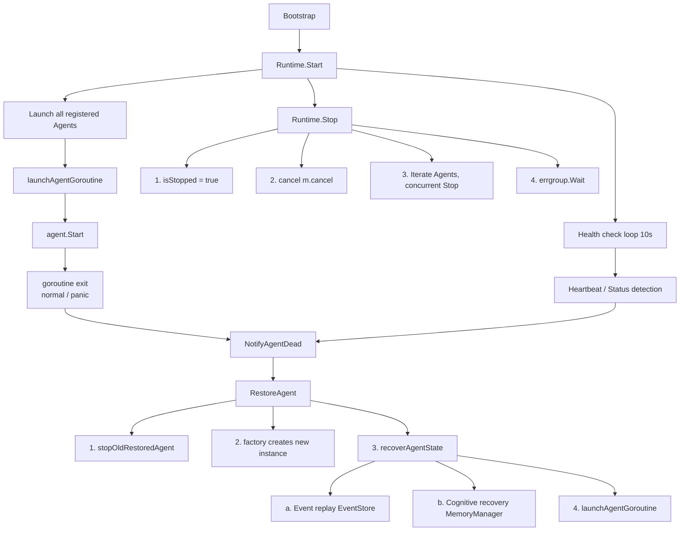

# GoAgentX Architecture Deep Dive (7): Runtime & Lifecycle — Birth, Death, and Resurrection

> Will an Agent die? Yes. LLM timeout can kill it, memory exhaustion can kill it, panic can kill it, host restart can kill it.
> But is there a mechanism that lets an Agent come back with its memories intact? I call this **resurrection**.
> This is the core of the Runtime subsystem — Agents are disposable executors; the Runtime owns their birth, death, and resurrection.

## 1. Agents Are Not Immortal

Before GoAgentX, I wrote Agents in Python. When an Agent died, it died — process exited, all state lost, the user had to re-explain everything from scratch. The most devastating case was an Agent that ran for two hours analyzing data, then panicked on the last step. All that work, wasted.

I thought to myself: **An Agent shouldn't just die like that. It needs to be able to come back, and when it does, it should remember where it left off.**

That's where the Runtime subsystem's design started. Its philosophy is written in the package comment in `internal/runtime/runtime.go`, one line that makes the attitude crystal clear:

```go
// Agents are disposable executors; the Runtime owns their birth, death, and resurrection.
```

Translation: Agents are throwaway executors — but their birth, death, and resurrection belong to the Runtime.

This article provides a source-code-level deep dive into four major Runtime modules: **Runtime Core Management**, **Agent Interface Contract**, **Leader Agent Orchestration & State Recovery**, **Sub Agent Execution Model**, and the **Graceful Shutdown System**.

## 2. Runtime Core Interface and Manager Implementation

### 2.1 Runtime Interface

`internal/runtime/runtime.go` defines Runtime's core contract:

```go
type Runtime interface {
    StartAgent(ctx context.Context, agent base.Agent) error
    StopAgent(ctx context.Context, agentID string) error
    RestartAgent(ctx context.Context, agentID string) error
    RestoreAgent(ctx context.Context, agentID string, factory AgentFactory) error
    NotifyAgentDead(agentID string, reason string)
    RegisterAgent(agent base.Agent, factory AgentFactory)
    Start(ctx context.Context) error
    Stop() error
    Stats() RuntimeStats
}
```

Key semantics:

- `RegisterAgent` registers an Agent and its factory; the factory creates new instances during resurrection.
- `StartAgent` starts an Agent inside an errgroup-managed goroutine with panic recovery.
- `NotifyAgentDead` is called by the Agent or health check to trigger the async resurrection flow.
- `RestoreAgent` performs complete two-phase state recovery: operational state (EventStore event replay) + cognitive state (MemoryManager conversation history restoration).

The configuration constants reflect the system's fault tolerance boundaries:

```go
func DefaultConfig() *Config {
    return &Config{
        HealthCheckInterval: 10 * time.Second,
        MaxRestartsPerAgent: 10,
        MaxReplayEvents:     10000,
        AgentStopTimeout:    10 * time.Second,
        OverallStopTimeout:  30 * time.Second,
        RestoreTimeout:      60 * time.Second,
    }
}
```

### 2.2 Manager Data Structure

`internal/runtime/manager.go` contains the `Manager`, the default Runtime interface implementation:

```go
type Manager struct {
    mu            sync.RWMutex
    agents        map[string]*managedAgent
    factories     map[string]AgentFactory
    eventStore    events.EventStore
    memManager    memory.MemoryManager
    g             *errgroup.Group
    gctx          context.Context
    cancel        context.CancelFunc
    config        *Config
    totalRestarts int
    startTime     time.Time
    isStarted     bool
    isStopped     bool
}
```

Key design point: `g` is `*errgroup.Group`, but the Manager's constructor initializes with `errgroup.WithContext(context.Background())` to avoid panic when `m.g.Go()` is called before `Start()`. When `Start()` is invoked, `g` is replaced with a new errgroup using the caller's context.

### 2.3 managedAgent Metadata

```go
type managedAgent struct {
    agent        base.Agent
    factory      AgentFactory
    cancel       context.CancelFunc
    restarts     int
    stopped      bool      // Voluntary stop flag
    resurrecting bool      // Resurrection-in-progress flag
}
```

`stopped` and `resurrecting` are two critical guard flags, discussed in detail in the "Resurrection Guard" section below.

## 3. Agent Interface Hierarchy

`internal/agents/base/agent.go` defines the multi-layer Agent interface:

### 3.1 Core Agent Interface

```go
type Agent interface {
    ID() string
    Type() models.AgentType
    Status() models.AgentStatus
    Start(ctx context.Context) error
    Stop(ctx context.Context) error
    Process(ctx context.Context, input any) (any, error)
    ProcessStream(ctx context.Context, input any) (<-chan AgentEvent, error)
}
```

### 3.2 Stateful Agent Interface

```go
type StatefulAgent interface {
    RestoreState(state map[string]any) error
    ReplayEvents(events []*events.Event) error
    Snapshot() (map[string]any, error)
}
```

Agents implementing this interface can have their state reconstructed during resurrection. Both `leaderAgent` and `subAgent` verify compliance at compile time via `var _ base.StatefulAgent = (*leaderAgent)(nil)`.

### 3.3 Optional Interfaces

```go
type Heartbeater interface {
    Heartbeat(ctx context.Context) error
    IsAlive() bool
}

type Messenger interface {
    SendMessage(ctx context.Context, msg *ahp.AHPMessage) error
    ReceiveMessage(ctx context.Context) (*ahp.AHPMessage, error)
}
```

## 4. Complete Agent Lifecycle



## 5. Death and Resurrection Deep Dive

### 5.1 Resurrection Guard

This is the most important concurrency safety pattern in the entire system. Its core is in the interaction between `StopAgent` and `NotifyAgentDead`:

```go
func (m *Manager) StopAgent(ctx context.Context, agentID string) error {
    m.mu.Lock()
    ma, exists := m.agents[agentID]
    // Step 1: Mark as "voluntary stop" FIRST
    ma.stopped = true
    cancel := ma.cancel
    m.mu.Unlock()

    // Step 2: Cancel context SECOND
    if cancel != nil {
        cancel()    // This triggers goroutine exit
    }
    // ... graceful agent stop ...
}
```

Why must `ma.stopped = true` come before `ma.cancel()`? Consider this race condition:

1. Thread A (StopAgent) calls `ma.cancel()`.
2. Agent goroutine detects context cancellation, calls `NotifyAgentDead`.
3. Thread B (NotifyAgentDead) reads `ma.stopped` — if `stopped` hasn't been set to true yet, it would incorrectly trigger the resurrection flow.

By setting `stopped = true` before cancelling the context, even if the goroutine immediately calls `NotifyAgentDead` after cancellation, it sees `ma.stopped == true` and skips resurrection.

### 5.2 NotifyAgentDead Full Guard Logic

```go
func (m *Manager) NotifyAgentDead(agentID string, reason string) {
    m.mu.Lock()
    // Four guard conditions; any match skips resurrection:
    if m.isStopped ||               // Runtime already stopped
       ma.stopped ||                // Agent voluntarily stopped
       ma.resurrecting ||           // Resurrection already in progress
       ma.restarts >= MaxRestarts   // Max restarts exceeded
    {
        m.mu.Unlock()
        return
    }
    ma.restarts++
    ma.resurrecting = true
    m.totalRestarts++

    // Async resurrection — doesn't block caller
    m.g.Go(func() error {
        defer func() {
            ma.resurrecting = false
        }()
        restoreCtx, cancel := context.WithTimeout(m.gctx, m.config.RestoreTimeout)
        defer cancel()
        return m.RestoreAgent(restoreCtx, agentID, factory)
    })
    m.mu.Unlock()
}
```

### 5.3 Two-Phase State Recovery

`RestoreAgent`'s core logic lives in `recoverAgentState`:

```go
func (m *Manager) recoverAgentState(ctx context.Context, agentID string, factory AgentFactory) (base.Agent, error) {
    newAgent := factory()  // Factory creates fresh instance

    evts := m.replayEvents(ctx, agentID)  // Phase A: operational state recovery

    if sa, ok := newAgent.(base.StatefulAgent); ok {
        // Build state from events
        state := buildStateFromEvents(evts)

        // Phase B: cognitive state recovery
        if m.memManager != nil {
            cognitiveState := m.buildCognitiveState(ctx, agentID, state)
            for k, v := range cognitiveState {
                state[k] = v
            }
        }

        // First restore state snapshot
        sa.RestoreState(state)
        // Then replay incremental events
        sa.ReplayEvents(evts)
    }
    return newAgent, nil
}
```

**Fault tolerance strategy**: The entire recovery chain is error-tolerant. EventStore read failure → skip event replay; MemoryManager read failure → skip cognitive recovery. The Agent still starts successfully. This design ensures "partial recovery is better than no recovery at all."

The `buildCognitiveState` method loads conversation history from MemoryManager:

```go
func (m *Manager) buildCognitiveState(ctx context.Context, ...) map[string]any {
    sessionID, _ := operationalState["session_id"].(string)
    if sessionID == "" {
        sid, err := m.memManager.GetLatestSessionForLeader(ctx, agentID)
        sessionID = sid
    }
    messages, _ := m.memManager.GetMessages(ctx, sessionID)
    state["session_id"] = sessionID
    state["conversation_history"] = messages
    return state
}
```

### 5.4 Health Check Loop

The `healthCheck` method runs in a dedicated goroutine started by `Start()`, executing every 10 seconds:

```go
func (m *Manager) healthCheck() {
    for _, c := range checks {
        if h, ok := c.agent.(base.Heartbeater); ok {
            if !h.IsAlive() {
                m.NotifyAgentDead(c.id, "health check: heartbeat failed")
            }
            continue
        }
        // Fall back to status check
        status := c.agent.Status()
        if status == models.AgentStatusOffline || status == models.AgentStatusStopping {
            m.NotifyAgentDead(c.id, "health check: status="+string(status))
        }
    }
}
```

## 6. Leader Agent Lifecycle Management

### 6.1 Orchestration Pipeline

In `internal/agents/leader/agent.go`, the Leader's `Process` method implements a four-stage orchestration pipeline:

```
strInput -> parseInput -> string
    |
    v
initMemoryContext (session recovery/create -> record message -> build context -> search similar tasks -> create task record)
    |
    v
parser.Parse          Step 1: Parse user profile
    |
    v
planner.Plan          Step 2: Plan sub-tasks
    |
    v
dispatcher.Dispatch   Step 3: Parallel task dispatch (semaphore concurrency control)
    |
    v
aggregator.Aggregate  Step 4: Aggregate sub-task results
    |
    v
finalizeMemory (update task output -> record assistant reply -> background distillation)
```

Each step includes a `stopCh` check:

```go
select {
case <-a.stopCh:
    return nil, coreerrors.ErrAgentNotRunning
default:
}
```

This enables fast response to stop requests without waiting for the entire orchestration pipeline to complete.

### 6.2 Safe Distillation Pattern (Context Detachment)

The distillation logic in `finalizeMemory` demonstrates an important concurrency safety pattern:

```go
func (a *leaderAgent) finalizeMemory(ctx context.Context, sessionID, taskID string, result *models.RecommendResult) {
    // Check if stopping to prevent Add after Wait panic
    a.distillMu.Lock()
    select {
    case <-a.stopCh:
        a.distillMu.Unlock()
        return  // Agent is stopping, skip distillation
    default:
    }
    a.distillWg.Add(1)
    a.distillMu.Unlock()

    a.distillEg.Go(func() error {
        defer a.distillWg.Done()

        // Use context.Background() to detach from parent context
        // Distillation continues even if client disconnects
        distillCtx, cancel := context.WithTimeout(context.Background(), 2*time.Minute)
        defer cancel()

        distilled, _ := a.memoryManager.DistillTask(gCtx, taskID)
        return a.memoryManager.StoreDistilledTask(gCtx, taskID, distilled)
    })
}
```

Key design points:

- **Context detachment**: Uses `context.Background()` rather than the passed-in `ctx`, so distillation continues even after client disconnection or request timeout.
- **distillMu lock**: The `stopCh` check and `WaitGroup.Add(1)` must happen atomically under the same lock. Otherwise, `Add` could be called after `Wait`, causing `panic: Add after Wait`.
- **Stop order**: `close(stopCh)` -> `distillWg.Wait()` -> `distillEg.Wait()` -> `streamEg.Wait()`, ensuring all background tasks complete before resource release.

### 6.3 Sub Agent Execution Model

Sub Agents in `internal/agents/sub/` use a simplified lifecycle management:

```go
type subAgent struct {
    // ... core dependencies
    stopCh   chan struct{}   // Notifies all goroutines to stop
    streamWg sync.WaitGroup  // Tracks active ProcessStream goroutines
}
```

The **taskExecutor** (`executor.go`) implements LLM execution with retry and degradation:

```
LLM Execution Path:
  executeWithLLM(ctx, task, profile)
    -> retry loop (maxRetries=3)
       -> executeWithLLMSingle -> template rendering -> LLM call
       -> validator.ValidateRecommendResult validate result
       -> validation failure + retryOnFail=true -> retry
       -> strictMode=true -> return error, otherwise use unvalidated result
  => All LLM calls fail -> executeByType degradation (fallback)
```

**heartbeatSender** (`heartbeat.go`) uses `sync.Once` for defensive shutdown:

```go
func (s *heartbeatSender) Stop() {
    s.stopOnce.Do(func() {
        close(s.stopCh)
    })
}
```

**toolBinder** (`tools.go`) implements a local tool Registry bridge pattern:

```go
func (b *toolBinder) BridgeFromRegistry(registry *core.Registry) {
    for _, name := range registry.List() {
        if _, exists := b.tools[name]; exists {
            continue  // Locally registered tools are not overwritten
        }
        b.tools[name] = func(ctx context.Context, args map[string]any) (any, error) {
            return t.Execute(ctx, args)
        }
    }
}
```

## 7. Leader Supervisor Failover

`internal/agents/leader/supervisor.go` contains the `LeaderSupervisor`, which monitors Leader heartbeats and triggers failover on timeout:

```
handleFailover(leaderID) -- Heartbeat timeout callback
    |
    v
1. Emit EventFailoverTriggered event
    |
    v
2. Agent.Stop(detachedCtx) -- Use detached context to prevent cancellation propagation
    |
    v
3. checkpoint.GetLatest() -- Restore checkpoint from database
    |
    v
4. EventRecovery.RecoverFromEvents() -- Event replay degradation strategy
    |
    v
5. Retry loop (MaxFailoverAttempts=3):
      ColdRestartStrategy.HandleFailover()
        -> factory(ctx, config) create new Agent
        -> Inject CheckpointRepository
        -> agent.Start(ctx)
    |
    v
6. TaskRecovery.RecoverStaleTasks() -- Clean up orphan tasks
    |
    v
7. Register new Leader -> Emit EventFailoverCompleted
```

Note: `EventRecovery` (`event_recovery.go`) implements incremental state reconstruction from the event stream, including session ID, pending task list, and last failover time:

```go
type RecoveryState struct {
    SessionID     string
    PendingTasks  []string
    LastVersion   int64
    LastFailover  time.Time
}
```

## 8. Graceful Shutdown System

`internal/shutdown/manager.go` implements the four-phase shutdown pipeline:

```
PhasePreShutdown  ->  PhaseGraceful  ->  PhaseForce  ->  PhaseDone
    (Pre-shutdown,      (Graceful,        (Force,          (Done,
     resource release)   gradual stop)     timeout fallback) cleanup)
```

### 8.1 Phase Executor

`PhaseExecutor` (`phase.go`) supports retry, exponential backoff, and rollback:

```go
func (e *PhaseExecutor) Execute(ctx context.Context, fn func(ctx context.Context) error) error {
    for attempt := 0; attempt <= e.maxRetries; attempt++ {
        if err := fn(ctx); err != nil {
            backoff := time.Duration(1<<uint(attempt)) * time.Second
            if e.onFailure != nil {
                e.onFailure(err)
            }
            continue
        }
        break
    }
    if e.onComplete != nil {
        return e.onComplete()
    }
}
```

### 8.2 Callback Registry

`CallbackRegistry` (`callbacks.go`) supports priority-sorted callback registration:

```go
type RegisteredCallback struct {
    ID       string
    Priority int       // Higher priority executes first
    Fn       Callback
    Timeout  time.Duration
    OnError  func(error)
}
```

### 8.3 Signal Handler

`SignalHandler` (`signal.go`) converts OS signals into the shutdown flow:

```go
type SignalHandler struct {
    signals []os.Signal  // Default: SIGINT, SIGTERM
    manager *Manager
}

func (h *SignalHandler) handleSignal(sig os.Signal) {
    switch sig {
    case os.Interrupt, syscall.SIGINT, syscall.SIGTERM:
        shutdownCtx, cancel := context.WithTimeout(context.Background(), h.manager.timeout)
        defer cancel()
        h.manager.StartShutdown(shutdownCtx)
    }
}
```

## 9. Callbacks Lifecycle Hooks

`internal/callbacks/callbacks.go` provides a lightweight event hook system:

```go
const (
    EventLLMStart   Event = "llm.start"
    EventLLMEnd     Event = "llm.end"
    EventLLMError   Event = "llm.error"
    EventLLMToken   Event = "llm.token"
    EventAgentStart Event = "agent.start"
    EventAgentEnd   Event = "agent.end"
    EventToolStart  Event = "tool.start"
    EventToolEnd    Event = "tool.end"
    EventToolError  Event = "tool.error"
)

type Handler func(ctx *Context)

func (r *Registry) Emit(ctx *Context) {
    handlers := r.handlers[ctx.Event]
    for _, h := range handlers {
        func() {
            defer func() {
                if r := recover(); r != nil {
                    slog.Error("handler panicked", "event", ctx.Event)
                }
            }()
            h(ctx)
        }()
    }
}
```

Each handler has independent panic recovery — one handler's panic doesn't affect subsequent handlers.

## 10. Architectural Summary

### Design Patterns

| Pattern | Location | Purpose |
|---------|----------|---------|
| Resurrection Guard | `manager.go` | `stopped` set before `cancel()`, prevents race conditions |
| Context Detachment | `leader/agent.go` | Distillation uses `context.Background()` independent of request |
| Semaphore Concurrency Control | `leader/dispatcher.go` | `chan struct{}` limits parallel tasks |
| Error-Tolerant Recovery Chain | `manager.go` | EventStore and MemoryManager independently recoverable, Agent still starts on failure |
| Dual-State Recovery | `manager.go` | Operational (events) + Cognitive (messages) independent recovery paths |
| Factory Pattern | `runtime.go` | `AgentFactory` creates new instances |
| sync.Once + Mutex | `leader/agent.go` | Prevents WaitGroup Add after Wait |
| Priority Callbacks | `shutdown/callbacks.go` | Priority-sorted shutdown handlers |
| Multi-Phase Shutdown | `shutdown/manager.go` | PreShutdown -> Graceful -> Force -> Done |

### Key File Index

| File | Core Contribution |
|------|------------------|
| `internal/runtime/runtime.go` | Runtime interface and config definition |
| `internal/runtime/manager.go` | Core lifecycle management: register, start, stop, resurrect, health check |
| `internal/agents/base/agent.go` | Agent interface hierarchy definition |
| `internal/agents/leader/agent.go` | Leader orchestration pipeline and state recovery implementation |
| `internal/agents/leader/dispatcher.go` | Semaphore concurrent task dispatch |
| `internal/agents/leader/supervisor.go` | Failover monitoring and cold restart strategy |
| `internal/agents/leader/event_recovery.go` | Event log state reconstruction |
| `internal/agents/leader/checkpoint.go` | PostgreSQL checkpoint persistence |
| `internal/agents/leader/recovery.go` | Orphan task cleanup |
| `internal/agents/sub/agent.go` | Sub Agent lifecycle and streaming |
| `internal/agents/sub/executor.go` | LLM execution engine (retry + degradation) |
| `internal/agents/sub/heartbeat.go` | ID-level heartbeat sender |
| `internal/agents/sub/tools.go` | Tool binding and Registry bridge |
| `internal/shutdown/manager.go` | Multi-phase shutdown manager |
| `internal/shutdown/phase.go` | Phase executor with retry and rollback |
| `internal/shutdown/callbacks.go` | Priority-sorted shutdown callback registry |
| `internal/shutdown/signal.go` | OS signal forwarding |
| `internal/callbacks/callbacks.go` | LLM/Agent/Tool lifecycle hooks |

## 11. Conclusion

The Runtime subsystem is the part I spent the most time on and revised the most times. Not because the technology was hard — it's that the question "how should an Agent come back from the dead?" took a long time to answer.

The answer turned out simple: **Agents are disposable, but their state is not.**

The Resurrection Guard pattern prevents race conditions. The error-tolerant recovery chain ensures "partial recovery is better than none." The multi-phase graceful shutdown lets the process exit cleanly no matter what scenario.

The most satisfying test I ever ran: I started 10 Agents running analysis tasks, then manually `kill -9`'d the process. When it restarted, every Agent auto-resurrected and continued where it left off. That moment I knew: **this thing worked.**

Next up is the **Event System** — every action an Agent takes is recorded as an immutable event. Resurrection depends on it, auditing depends on it, debugging depends on it.