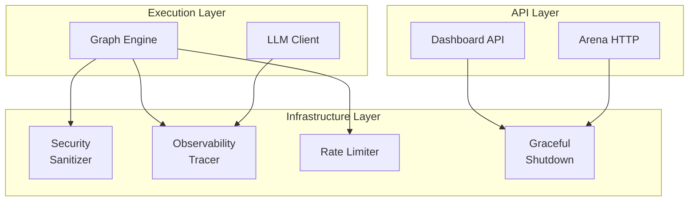
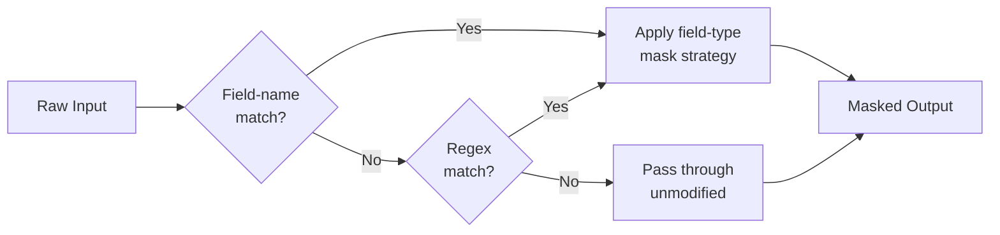
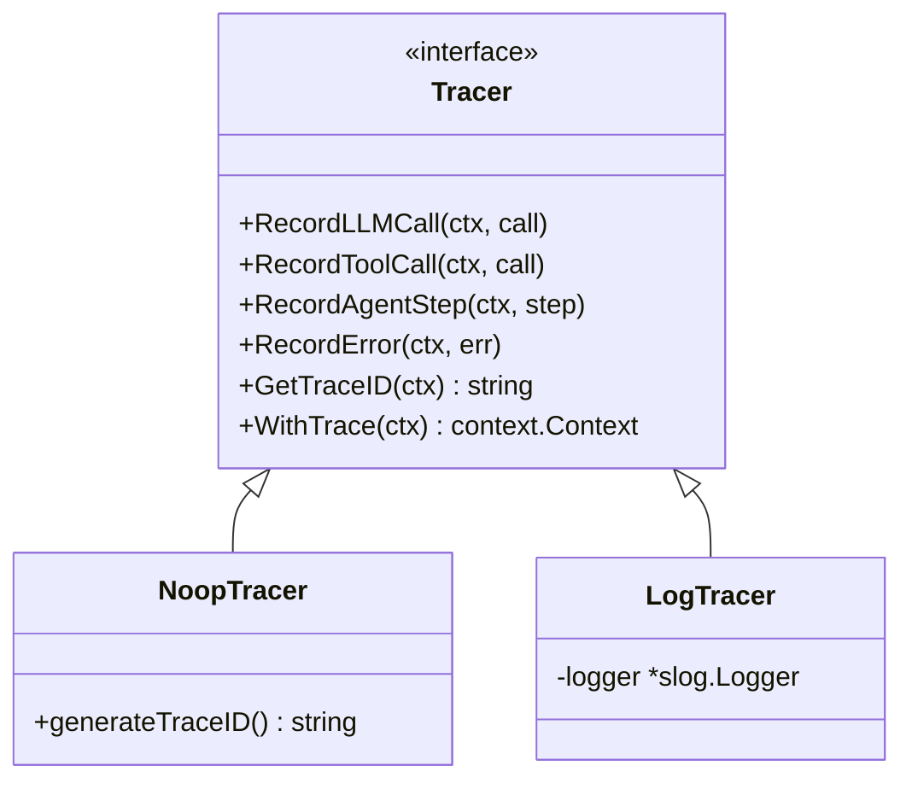
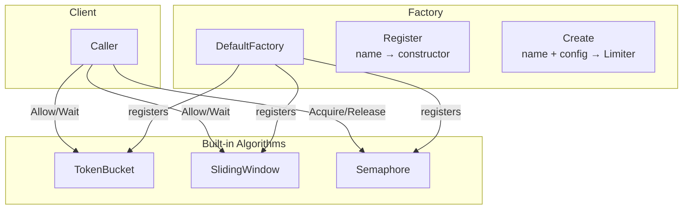
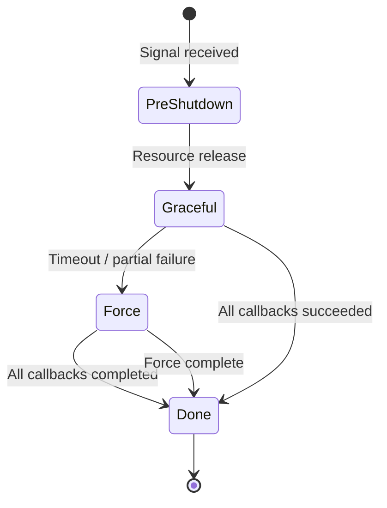
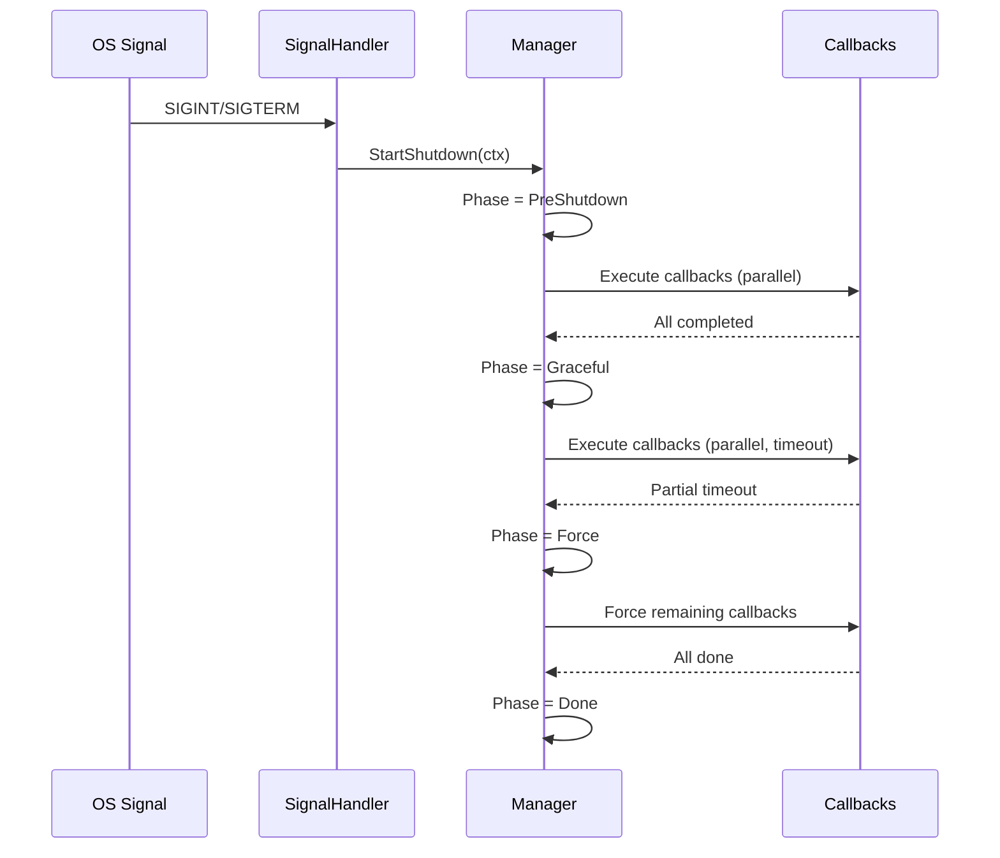
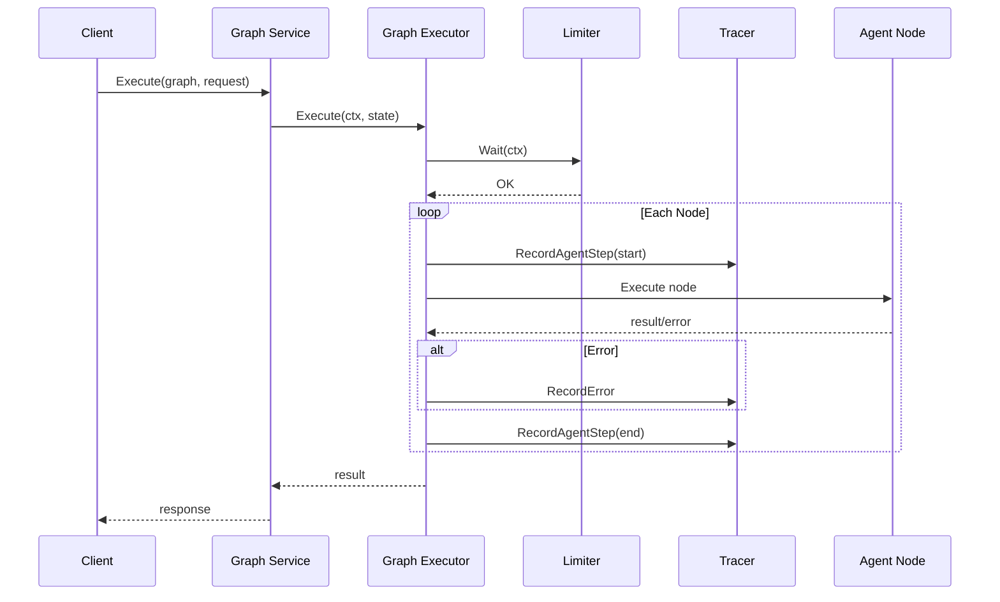
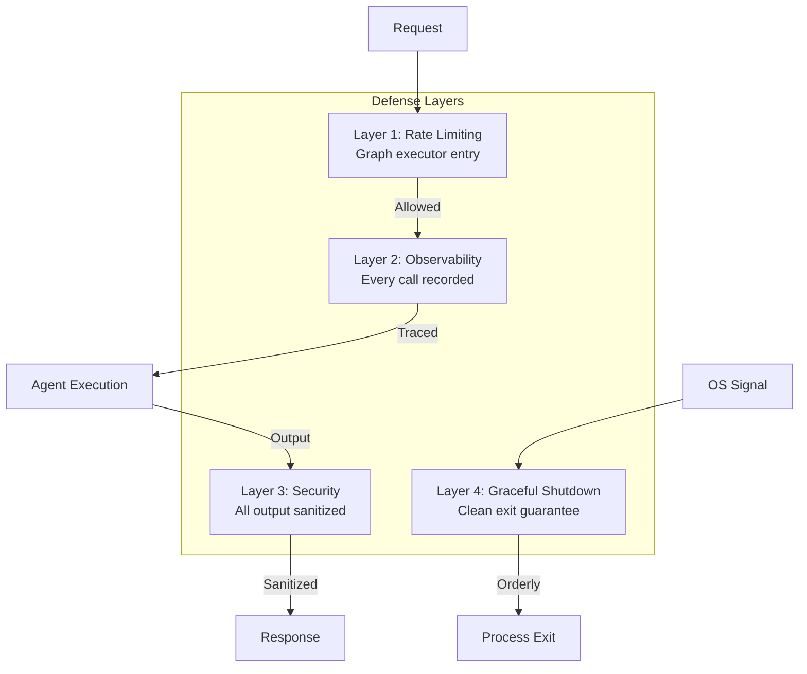
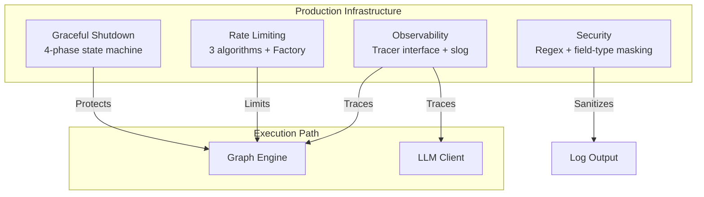

# GoAgentX Architecture Deep Dive (6): Security & Observability — Defense in Depth and Transparent Tracing

> In production-grade Agent systems, security and observability are two sides of the same coin. The security module prevents sensitive information leakage, the observability module records every call's full trace, the rate limiter ensures the system isn't overwhelmed by burst traffic, and the graceful shutdown module guarantees clean process exit without orphaned resources.

---

## 1. Why Security Can't Be an Afterthought

Giving an agent tools is like giving a teenager car keys — they can go anywhere, but there's no guarantee they won't crash.

I've seen too many AI projects fail in production because of basic security lapses: agents printing API keys in logs, prompts leaking database credentials, LLM responses exposing phone numbers. These aren't "we'll fix it later" problems — compliance audit teams will hunt you down.

So when I designed GoAgentX's infrastructure, I treated security and observability as first-class concerns from day one. Not "build features, add security later" — **security is in the foundation**.

This article covers four infrastructure modules: **Security (Sanitizer)**, **Observability (Tracer)**, **Rate Limiting**, and **Graceful Shutdown**. They're not the flashiest part of the framework. But without them, running agents in production is like deploying without a seatbelt.



Core files:

| Module | Path |
|--------|------|
| Security (Sanitizer) | `internal/security/sanitizer.go` |
| Observability (Tracer) | `internal/observability/tracer.go`, `noop.go`, `log.go` |
| Rate Limiting | `internal/ratelimit/` (4 source files) |
| Graceful Shutdown | `internal/shutdown/` (4 source files) |
| Middleware | `internal/dashboard/api.go`, `internal/arena/http.go` |
| E2E Integration | `internal/workflow/graph/graph.go`, `.../executor.go` |
| API Layer | `api/service/graph/service.go` |

---

## 2. Security Module: Regex-Based Sensitive Data Sanitization

The core design philosophy is **"field-type + regex detection → targeted masking strategy"**, not simple global string replacement. It provides two layers of defense.

### 2.1 SensitiveFieldType — String Constants Instead of iota

Unlike common iota-based enums, GoAgentX uses string constants for sensitive field types:

```go
const (
    SensitiveFieldTypeAPIKey       SensitiveFieldType = "api_key"
    SensitiveFieldTypePassword     SensitiveFieldType = "password"
    SensitiveFieldTypeEmail        SensitiveFieldType = "email"
    SensitiveFieldTypePhone        SensitiveFieldType = "phone"
    SensitiveFieldTypeCreditCard   SensitiveFieldType = "credit_card"
    SensitiveFieldTypeSSN          SensitiveFieldType = "ssn"
)
```

String constants are natively serializable (usable in JSON/YAML config) and enable runtime type identification via reflection or string matching.

### 2.2 Two-Layer Detection Mechanism

The Sanitizer's workflow operates in two layers:

**Layer 1: Field-name matching.** For structured JSON input (LLM requests/responses), the Sanitizer traverses field names and maps them to `SensitiveFieldType` via `getFieldType()`. A field name containing "key" or "token" is classified as APIKey.

**Layer 2: Regex matching.** For unstructured text or scenarios JSON cannot cover, the Sanitizer maintains a set of pre-compiled regex patterns to scan text content:

```go
type Sanitizer struct {
    patterns []sanitizePattern
}

type sanitizePattern struct {
    pattern *regexp.Regexp
    mask    func(string) string
}
```

Each sensitive type has a different masking strategy:

```go
func (s *Sanitizer) maskAPIKey(input string) string {
    if len(input) <= 8 {
        return strings.Repeat("*", len(input))
    }
    return input[:4] + strings.Repeat("*", len(input)-8) + input[len(input)-4:]
}
```

This "keep first 4 + last 4 characters, mask middle" strategy preserves format features for debugging while hiding the actual secret.



Other masking strategies:

| Type | Strategy | Example |
|------|----------|---------|
| **Password** | Full replacement | `********` |
| **Email** | Keep domain, mask username | `j***@example.com` |
| **Phone** | Keep prefix 3 + suffix 4 | `138****5678` |
| **CreditCard** | Keep last 4 digits | `**** **** **** 1234` |
| **SSN** | Keep last 4 digits | `***-**-1234` |

### 2.3 SafeLogger — Secure Log Wrapper

`SafeLogger` is an elegant application-layer wrapper around Sanitizer:

```go
type SafeLogger struct {
    sanitizer *Sanitizer
    logger    func(string)
}
```

It wraps any `func(string)` log function into an auto-sanitized version — all log output is automatically processed by the Sanitizer before being written. This design allows the security module to transparently embed into existing logging systems without modifying log consumer code.

### 2.4 Package-Level Convenience Function

```go
func SanitizeLog(logger func(string), message string) {
    s := &Sanitizer{}
    s.SafeLogger(logger).Output(message)
}
```

`SanitizeLog()` provides an "out-of-the-box" one-shot sanitization function for scripts or simple scenarios, eliminating the need to construct a Sanitizer instance in advance.

---

## 3. Observability Module: Tracer Interface with Two Implementations

GoAgentX's observability uses the classic **Observer pattern**: an abstract `Tracer` interface with `NoopTracer` and `LogTracer` implementations.



### 3.1 Tracer Interface

```go
type Tracer interface {
    RecordLLMCall(ctx context.Context, call *LLMCall)
    RecordToolCall(ctx context.Context, call *ToolCall)
    RecordAgentStep(ctx context.Context, step *AgentStep)
    RecordError(ctx context.Context, err *AgentError)
    GetTraceID(ctx context.Context) string
    WithTrace(ctx context.Context) context.Context
}
```

This interface covers four key observation points during Agent execution:
1. **LLM calls** (`RecordLLMCall`): model, prompt, response, token usage, latency
2. **Tool calls** (`RecordToolCall`): tool name, input, output, latency
3. **Agent steps** (`RecordAgentStep`): execution phase per node
4. **Errors** (`RecordError`): error type and message

### 3.2 NoopTracer — Zero-Overhead Default

```go
type NoopTracer struct{}

var traceCounter uint64

func (t *NoopTracer) generateTraceID() string {
    id := atomic.AddUint64(&traceCounter, 1)
    return fmt.Sprintf("trace-%d", id)
}
```

`NoopTracer` is the default tracer in the Graph constructor. Its `Record*` methods are all empty implementations. `WithTrace` checks whether a trace ID already exists in the context to avoid redundant generation.

### 3.3 LogTracer — Structured Logging via slog

```go
type LogTracer struct {
    logger *slog.Logger
}
```

`LogTracer` maps each Tracer event point to a structured log record. Key design points:
- **Success/failure branches**: `ErrorContext` on failure, `InfoContext` on success
- **Structured attributes**: all fields as key-value pairs for log collection systems (Loki, Datadog)
- **Dependency injection**: `LogTracer` receives an external logger, following the dependency inversion principle

---

## 4. Rate Limiting Module: Three Algorithms + Factory Pattern

The rate limiting module provides three built-in algorithms with factory-pattern extensibility.



### 4.1 Limiter Interface and Factory

```go
type Limiter interface {
    Allow() bool
    Wait(ctx context.Context) error
    Reset()
    Rate() float64
}

type Factory struct {
    constructors map[string]func(config map[string]any) (Limiter, error)
}
```

`Factory` uses a register-create pattern: `Register(name, constructor)` registers a constructor, `Create(name, config)` creates by name. `DefaultFactory` is a package-level singleton, pre-registered with three built-in limiters.

### 4.2 TokenBucketLimiter

```go
type TokenBucketLimiter struct {
    rate      float64
    burst     int
    tokens    float64
    lastCheck time.Time
    mu        sync.Mutex
}
```

Core logic in `Allow()`: calculates replenished tokens based on `time.Since(lastCheck).Seconds() * rate`, then decides whether to allow. `Wait()` implements busy-loop with `time.After(waitTime)`. Supports `SetRate()` and `SetBurst()` for runtime parameter adjustment.

### 4.3 SlidingWindowLimiter

```go
type SlidingWindowLimiter struct {
    rate       int
    windowSize time.Duration
    requests   []time.Time
    mu         sync.Mutex
}
```

Based on a timestamp array: each request appends the current time to the tail, `cleanup()` removes expired requests outside the window. `Allow()` checks `len(l.requests) < l.rate`. Supports `ResetAt(t time.Time)` for periodic resets.

### 4.4 SemaphoreLimiter

```go
type SemaphoreLimiter struct {
    slots chan struct{}
}
```

Channel-based semaphore: `Acquire()` reads from the channel, `Release()` writes back. `WeightedSemaphoreLimiter` is a weighted version using `sync.Cond` + `context.AfterFunc` for cancellation propagation, supporting per-key weight allocation (e.g., per-API-key quotas).

### 4.5 Algorithm Comparison

| Algorithm | Best For | Behavior |
|-----------|----------|----------|
| **TokenBucket** | Burst traffic | Smooths bursts with replenishment |
| **SlidingWindow** | Precise rate control | Hard limit per time window |
| **Semaphore** | Concurrent connection limit | Cap on in-flight requests |

In production, the Graph executor entry typically uses TokenBucket because Agent workflows have a natural "burst" pattern — multiple nodes may become ready simultaneously.

---

## 5. Graceful Shutdown Module: Four-Phase State Machine

The graceful shutdown module is the last line of defense for system fault tolerance, ensuring orderly process exit under any circumstances.



### 5.1 Manager — Four-Phase Execution

```go
const (
    PhasePreShutdown Phase = iota // 0
    PhaseGraceful                 // 1
    PhaseForce                    // 2
    PhaseDone                     // 3
)
```

Each phase executes callbacks concurrently with per-callback timeout:

```go
func (m *Manager) executePhase(ctx context.Context, phase Phase) []CallbackResult {
    var wg sync.WaitGroup
    results := make([]CallbackResult, 0, len(callbacks))
    resultsMu := sync.Mutex{}

    for _, cb := range callbacks {
        wg.Add(1)
        go func(cb RegisteredCallback) {
            defer wg.Done()
            defer func() {
                if rec := recover(); rec != nil { /* panic recovery */ }
            }()
            cbCtx, cancel := context.WithTimeout(ctx, cb.timeout)
            defer cancel()
            err := cb.fn(cbCtx)
            // ...
        }(cb)
    }
    wg.Wait()
    return results
}
```

Each callback runs in its own goroutine with its own timeout context. Panic recovery ensures a single callback crash doesn't affect the overall shutdown flow. Each phase also has a 5-second hard timeout.

### 5.2 PhaseExecutor — Retry with Exponential Backoff

```go
type PhaseExecutor struct {
    phase    Phase
    state    ExecutorState
    retry    int
    maxRetry int
    rollback func()
}
```

State transitions: `Pending → Running → Completed / Failed`. Retry uses exponential backoff: `backoff = time.Duration(1 << uint(attempt)) * time.Second`. Attempt is capped at 29 to prevent overflow with `1<<30`.

### 5.3 CallbackRegistry — Priority-Sorted Registration

Callbacks are organized by phase via `map[Phase][]RegisteredCallback`, bubble-sorted by priority descending. `CallbackChain` supports both serial chain and parallel batch execution modes.

### 5.4 SignalHandler — OS Signal Listening

```go
type SignalHandler struct {
    signals []os.Signal
    ch      chan os.Signal
}
```

Integrates standard library `os/signal`, listening for `SIGINT`, `SIGTERM`, `os.Interrupt`. Provides two blocking methods: `WaitForSignal()` and `WaitForContextOrSignal()`.

### 5.5 Complete Shutdown Sequence

A typical graceful shutdown follows this sequence:



---

## 6. Middleware Pattern: CORS and Panic Recovery

### 6.1 Dashboard withCORS Middleware

```go
func withCORS(next http.Handler) http.Handler {
    return http.HandlerFunc(func(w http.ResponseWriter, r *http.Request) {
        w.Header().Set("Access-Control-Allow-Origin", "*")
        w.Header().Set("Access-Control-Allow-Methods", "GET, POST, DELETE, OPTIONS")
        w.Header().Set("Access-Control-Allow-Headers", "Content-Type")
        if r.Method == http.MethodOptions {
            w.WriteHeader(http.StatusOK)
            return
        }
        next.ServeHTTP(w, r)
    })
}
```

### 6.2 Unified withRecovery Middleware

```go
func withRecovery(next http.Handler) http.Handler {
    return http.HandlerFunc(func(w http.ResponseWriter, r *http.Request) {
        defer func() {
            if rec := recover(); rec != nil {
                slog.Error("api: panic recovered", "path", r.URL.Path, "recover", rec)
                writeJSON(w, http.StatusInternalServerError, errResp("internal server error"))
            }
        }()
        next.ServeHTTP(w, r)
    })
}
```

### 6.3 Middleware Composition

```go
func (a *APIv2) Handler() http.Handler {
    mux := http.NewServeMux()
    // ... register all routes ...
    return withRecovery(withCORS(mux))
}
```

This onion-ring composition ensures all request paths are protected by CORS and panic recovery.

---

## 7. End-to-End Integration: From Graph Service to LLM Client

These four modules are not isolated — they collaborate tightly within the Graph execution engine.

### 7.1 API Layer Injection

In `api/service/graph/service.go` `Service.Execute()`:

```go
func (s *Service) Execute(ctx context.Context, g *wfgraph.Graph, request *ExecuteRequest) (*ExecuteResponse, error) {
    if s.tracer != nil {
        g.SetTracer(s.tracer)
    }
    if s.limiter != nil {
        g.SetLimiter(s.limiter)
    }
    result, err := g.Execute(ctx, state)
}
```

If `config.Tracer` is nil, the constructor defaults to `observability.NewNoopTracer()`, ensuring observability is always enabled.

### 7.2 Observation Points in Graph Executor

The full call chain in `internal/workflow/graph/executor.go`:



**Step 1: Rate limiting check**
```go
if g.limiter != nil {
    if err := g.limiter.Wait(ctx); err != nil {
        return nil, errors.Wrap(err, "rate limit")
    }
}
```

**Step 2: AgentStep recording before and after each node**
```go
g.tracer.RecordAgentStep(ctx, &observability.AgentStep{
    TraceID:  g.tracer.GetTraceID(ctx),
    AgentID:  nodeID,
    StepName: "execute",
})
// ... execute node ...
g.tracer.RecordAgentStep(ctx, &observability.AgentStep{
    TraceID:  g.tracer.GetTraceID(ctx),
    AgentID:  nodeID,
    StepName: "execute",
    Duration: time.Since(nodeStart),
})
```

**Step 3: Error recording on failure**
```go
if err != nil {
    g.tracer.RecordError(ctx, &observability.AgentError{
        TraceID:   g.tracer.GetTraceID(ctx),
        AgentID:   nodeID,
        ErrorType: "execution_error",
        Message:   err.Error(),
    })
}
```

### 7.3 LLM Client Observation

In `internal/llm/client.go`, `recordLLMCall()` is called from both `Generate()` and `GenerateStream()`:

```go
func (c *Client) recordLLMCall(ctx context.Context, prompt, response string, tokens int, start time.Time, err error) {
    if c.tracer == nil {
        return
    }
    c.tracer.RecordLLMCall(ctx, &observability.LLMCall{
        TraceID:    c.tracer.GetTraceID(ctx),
        Model:      c.config.Model,
        Prompt:     prompt,
        Response:   response,
        TokensUsed: tokens,
        Duration:   time.Since(start),
        Error:      err,
    })
}
```

For streaming calls (`GenerateStream`), `recordLLMCall` is called asynchronously after the stream ends, accumulating the full response in a goroutine before recording.

---

## 8. Architectural Observations

### 8.1 Layered Defense Philosophy



- **Security**: Independent of the execution pipeline, auto-sanitizes all log output — the last line of defense
- **Observability**: Injected via interface into Graph and LLM Client — transparent tracing infrastructure
- **Rate Limiting**: Intercepts at the Graph executor entry point — no per-node granular control
- **Graceful Shutdown**: Completely independent, triggered by OS signals via SignalHandler — no business logic coupling

### 8.2 Module Coupling Analysis

The four modules have extremely low coupling:

| Module | Couples To | Coupling Level |
|--------|-----------|----------------|
| Security | Nothing (standalone) | None |
| Observability | Graph + LLM Client (via Tracer interface) | Loose (swappable) |
| Rate Limiting | Graph (via Limiter interface) | Loose |
| Graceful Shutdown | OS signals (via SignalHandler) | None |

Each module can be independently tested, replaced, or even removed without affecting the others.

### 8.3 Default Safe vs Explicit Configuration

| Feature | Default | Philosophy |
|---------|---------|------------|
| Tracer | `NoopTracer` (non-nil) | Always on, even if no-op |
| Limiter | nil (no rate limiting) | Explicit opt-in |
| Sanitizer | Must construct explicitly | Explicit opt-in |

The "safe by default" design ensures Tracer call sites never panic even without a real tracer configured.

---

## 9. Summary

GoAgentX's security, observability, rate limiting, and graceful shutdown modules form the infrastructure backbone of a production-grade Agent system:



- **Security** uses dual detection (field-name + regex) for sensitive data masking
- **Observability** decouples "what to record" from "how to record" via the Tracer interface
- **Rate Limiting** provides three algorithms with flexible switching via the Factory pattern
- **Graceful Shutdown** uses a four-phase state machine with exponential-backoff retry for orderly exit under any circumstances

These aren't the coolest part of GoAgentX. They're the **uncool but essential** parts. No sanitizer? Compliance will find you. No rate limiter? A traffic spike takes you down. No graceful shutdown? Orphaned resources everywhere.

But if I did my job right, you won't notice them. They just work. **That's what infrastructure should be — there when you need it, invisible when you don't.**

---

*Next: Runtime & Lifecycle — how an agent is born, how it dies, and how it comes back from the dead with its memory intact. I call this the "resurrection mechanic."*
